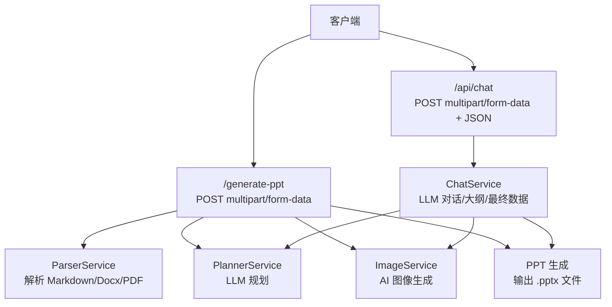
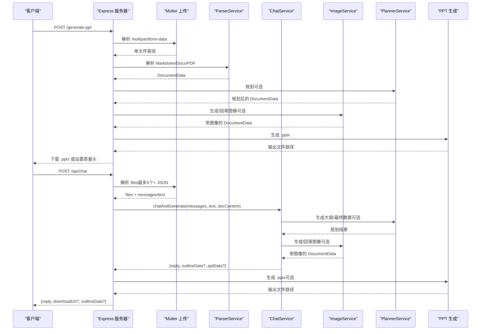
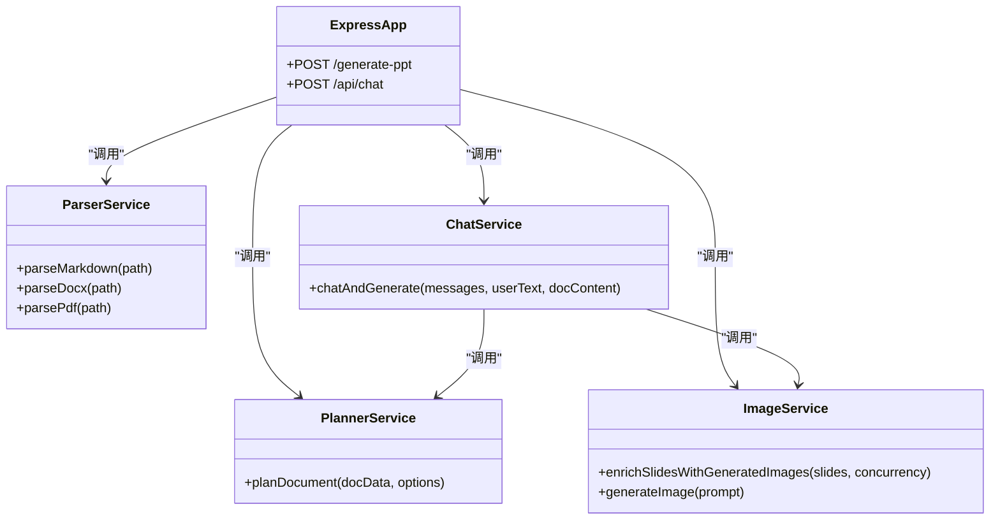

# API 接口文档

<cite>
**本文引用的文件列表**
- [package.json](file://package.json)
- [src/index.ts](file://src/index.ts)
- [src/services/chat.service.ts](file://src/services/chat.service.ts)
- [src/services/parser.service.ts](file://src/services/parser.service.ts)
- [src/services/planner.service.ts](file://src/services/planner.service.ts)
- [src/services/image.service.ts](file://src/services/image.service.ts)
- [src/types.ts](file://src/types.ts)
- [readme.md](file://readme.md)
- [test-chat.js](file://test-chat.js)
- [test-chat-upload.js](file://test-chat-upload.js)
</cite>

## 目录
1. [简介](#简介)
2. [项目结构](#项目结构)
3. [核心组件](#核心组件)
4. [架构总览](#架构总览)
5. [详细组件分析](#详细组件分析)
6. [依赖关系分析](#依赖关系分析)
7. [性能考量](#性能考量)
8. [故障排查指南](#故障排查指南)
9. [结论](#结论)
10. [附录](#附录)

## 简介
本文件为 Generate-PPT 的 API 接口完整文档，覆盖以下内容：
- 所有 RESTful API 端点的 HTTP 方法、URL 模式、请求/响应模式与认证方式
- 重点端点 /generate-ppt 与 /api/chat 的使用方法，包括请求参数、文件上传格式、响应数据结构与错误处理
- 具体的 cURL 示例与客户端实现指南
- 身份验证考虑、速率限制与版本信息
- 常见用例、客户端实现指导与性能优化技巧
- 调试工具与监控方法
- 如适用，已弃用功能的迁移指南与向后兼容性说明

## 项目结构
- 后端基于 Express 框架，提供两个主要 API：
  - POST /generate-ppt：从 Markdown/Word/PDF 文档生成 PPT
  - POST /api/chat：支持多轮对话与文件上传的智能 PPT 生成
- 关键服务模块：
  - 解析器：ParserService（Markdown/Docx/PDF 解析）
  - 规划器：PlannerService（LLM 规划与合并）
  - 图像服务：ImageService（AI 图像生成与回填）
  - 聊天服务：ChatService（LLM 对话与大纲/最终数据解析）
  - 类型定义：types.ts（统一数据结构）

图表来源
- [src/index.ts:314-427](file://src/index.ts#L314-L427)
- [src/services/parser.service.ts:11-167](file://src/services/parser.service.ts#L11-L167)
- [src/services/planner.service.ts:53-101](file://src/services/planner.service.ts#L53-L101)
- [src/services/image.service.ts:4-28](file://src/services/image.service.ts#L4-L28)
- [src/services/chat.service.ts:31-101](file://src/services/chat.service.ts#L31-L101)

章节来源
- [src/index.ts:1-432](file://src/index.ts#L1-L432)
- [readme.md:104-120](file://readme.md#L104-L120)

## 核心组件
- Express 应用与中间件
  - CORS、JSON 解析、静态资源与输出目录挂载
  - Multer 文件上传配置（磁盘存储、文件名策略）
- 会话级图片缓存
  - 用于 /api/chat 在“确认生成”阶段恢复上传文档的原始图片
- 两大 API 端点
  - /generate-ppt：单文件上传，支持规划器模式与可选质量评估
  - /api/chat：多文件上传（最多 5 个），支持 messages 数组或字符串，支持文本附加说明

章节来源
- [src/index.ts:21-70](file://src/index.ts#L21-L70)
- [src/index.ts:314-427](file://src/index.ts#L314-L427)
- [src/index.ts:71-270](file://src/index.ts#L71-L270)

## 架构总览
下图展示 API 请求在服务层的调用链与数据流。

图表来源
- [src/index.ts:71-270](file://src/index.ts#L71-L270)
- [src/index.ts:314-427](file://src/index.ts#L314-L427)
- [src/services/chat.service.ts:40-101](file://src/services/chat.service.ts#L40-L101)
- [src/services/planner.service.ts:84-101](file://src/services/planner.service.ts#L84-L101)
- [src/services/image.service.ts:15-28](file://src/services/image.service.ts#L15-L28)

## 详细组件分析

### 端点：POST /generate-ppt
- 功能：从 Markdown/Word/PDF 文档生成 PPT
- 请求方式：POST
- Content-Type：multipart/form-data
- 表单字段：
  - file（必填）：.md/.docx/.pdf
  - plannerMode（可选）：strict 或 creative
- 成功响应：
  - 下载 .pptx 文件（二进制）
  - 若启用质量评估，设置以下响应头：
    - X-PPT-Quality-Score：总体分数
    - X-PPT-Quality-Grade：等级
    - X-PPT-Quality-Json：质量报告 JSON 路径
    - X-PPT-Quality-Markdown：质量报告 Markdown 路径
- 错误响应：
  - 400：缺少文件或格式不受支持
  - 500：生成过程异常

请求示例（cURL）
- 生成 PPT 并下载
  - curl -X POST http://localhost:3000/generate-ppt -F "file=@input/计算机发展史.docx" -F "plannerMode=creative" --output output/from-api.pptx

章节来源
- [src/index.ts:314-427](file://src/index.ts#L314-L427)
- [readme.md:106-120](file://readme.md#L106-L120)

### 端点：POST /api/chat
- 功能：支持多轮对话与文件上传的智能 PPT 生成
- 请求方式：POST
- Content-Type：multipart/form-data（files 最多 5 个）或 application/json（仅 text/messages）
- 表单字段（multipart/form-data）：
  - files（可选）：.md/.docx/.pdf/.png/.jpg/.jpeg，最多 5 个
  - text（可选）：附加说明文本
  - messages（可选）：数组或 JSON 字符串，元素为 {role, content}
- JSON 请求体（application/json）：
  - messages：数组或 JSON 字符串
  - text：字符串
- 成功响应：
  - reply：LLM 回复文本
  - downloadUrl（可选）：/output/{filename}.pptx
  - outlineData（可选）：当处于大纲阶段时返回
- 错误响应：
  - 500：内部错误

请求示例（cURL）
- 仅文本对话
  - curl -X POST http://localhost:3000/api/chat -H "Content-Type: application/json" -d '{"messages":[{"role":"user","content":"我想做一个关于AI技术的工作汇报PPT"}]}'
- 上传文件并生成
  - curl -X POST http://localhost:3000/api/chat -F "files=@input/计算机发展史.docx" -F "text=请根据这份文档生成PPT" -F "messages=[]" --output output/chat-response.json

章节来源
- [src/index.ts:71-270](file://src/index.ts#L71-L270)
- [src/services/chat.service.ts:40-101](file://src/services/chat.service.ts#L40-L101)
- [test-chat-upload.js:46-189](file://test-chat-upload.js#L46-L189)

### 数据模型与响应结构
- DocumentData：文档数据结构
  - title：标题
  - slides：幻灯片数组
    - title：标题
    - bullets：要点数组
    - images：图像数组（Base64 或 URL）
    - slideRole：幻灯片角色
    - imagePrompt：图像提示词
    - keyMessage：核心观点
    - speakerNotes：讲解要点
    - sourceRefs：来源索引
- OutlineData：大纲数据结构
  - title：标题
  - brief：简述
    - deckGoal：目标
    - audience：受众
    - focus：焦点
    - style：风格
  - slides：大纲条目数组

章节来源
- [src/types.ts:66-71](file://src/types.ts#L66-L71)
- [src/types.ts:15-29](file://src/types.ts#L15-L29)

### 认证与安全
- /api/chat 与 /api/llm（内部调用）使用 Bearer Token 认证
  - 令牌来源：PLANNER_AUTH_TOKEN 或 LLM_AUTH_TOKEN，若为空则回退到 IMAGE_API_KEY
  - 可选代理模式：PLANNER_USE_WORKER_PROXY=true 时，通过 Cloudflare Worker 转发至 Gemini
- CORS 已全局启用，允许跨域访问
- 速率限制：代码中未实现显式限流，建议在网关或反向代理层进行限制

章节来源
- [src/services/chat.service.ts:32-38](file://src/services/chat.service.ts#L32-L38)
- [src/services/planner.service.ts:67-81](file://src/services/planner.service.ts#L67-L81)
- [readme.md:52-60](file://readme.md#L52-L60)
- [src/index.ts:24-26](file://src/index.ts#L24-L26)

### 版本信息
- 项目版本：1.0.0
- Node.js 兼容性：推荐 >=16
- 渲染模式：默认模板叠加模式，可通过环境变量切换

章节来源
- [package.json:1-45](file://package.json#L1-L45)
- [readme.md:127-131](file://readme.md#L127-L131)

## 依赖关系分析
- 服务间耦合
  - /generate-ppt：ParserService → PlannerService → ImageService → PPT 生成
  - /api/chat：ChatService → PlannerService → ImageService → PPT 生成
- 外部依赖
  - LLM 与图像服务：通过 /api/llm 与 /api/image/direct-edit 调用
  - 文件上传：multer（磁盘存储）
  - 静态资源：public 与 output 目录

图表来源
- [src/index.ts:45-51](file://src/index.ts#L45-L51)
- [src/services/chat.service.ts:31-38](file://src/services/chat.service.ts#L31-L38)
- [src/services/planner.service.ts:53-82](file://src/services/planner.service.ts#L53-L82)
- [src/services/image.service.ts:4-13](file://src/services/image.service.ts#L4-L13)

## 性能考量
- 图像并发生成
  - 通过 IMAGE_CONCURRENCY 控制并发度，默认 2
  - 支持缓存与降级回退，提升稳定性
- 渲染模式
  - PPT_RENDER_MODE 非 legacy 时采用 HTML→PNG→PPT 流水线，可结合 ENABLE_AI_IMAGES 控制是否生成 AI 图像
- 质量评估
  - ENABLE_EVALUATION=true 时输出质量报告与评分头
- 上传文件大小
  - /api/chat 支持最多 5 个文件，注意带宽与磁盘空间

章节来源
- [src/index.ts:236-255](file://src/index.ts#L236-L255)
- [src/index.ts:380-385](file://src/index.ts#L380-L385)
- [src/services/image.service.ts:15-28](file://src/services/image.service.ts#L15-L28)
- [readme.md:17-50](file://readme.md#L17-L50)

## 故障排查指南
- 常见错误与定位
  - 400：缺少文件或格式不受支持（/generate-ppt）
  - 500：内部错误（解析/规划/生成/LLM 调用失败）
- LLM 与图像服务
  - 检查 PLANNER_AUTH_TOKEN/LLM_AUTH_TOKEN 与 IMAGE_API_KEY 是否正确配置
  - 若启用代理模式，检查 CLOUDFLARE_WORKER_URL 与 LLM_API_KEY/GOOGLE_API_KEY
- 日志与调试
  - 服务器启动日志：端口监听
  - /api/chat 与 /api/chat 的请求日志（含文件数量与消息数量）
  - ChatService 的阶段检测与响应解析日志
- 监控指标
  - 质量评估头：X-PPT-Quality-Score、X-PPT-Quality-Grade、X-PPT-Quality-Json、X-PPT-Quality-Markdown

章节来源
- [src/index.ts:266-269](file://src/index.ts#L266-L269)
- [src/index.ts:417-421](file://src/index.ts#L417-L421)
- [src/services/chat.service.ts:40-101](file://src/services/chat.service.ts#L40-L101)
- [readme.md:52-60](file://readme.md#L52-L60)

## 结论
- 本项目提供了两条主要 API：/generate-ppt 与 /api/chat，分别面向“文档直生成”和“对话式生成”
- /api/chat 支持多轮对话与文件上传，具备智能阶段识别与大纲/最终数据生成能力
- 通过环境变量灵活控制渲染模式、图像生成与质量评估
- 建议在生产环境中配合网关/反向代理实施速率限制与安全加固

## 附录

### 客户端实现指导
- 使用 axios 或 fetch 发送 multipart/form-data 请求
- /api/chat 支持两种请求体：
  - multipart/form-data：files、text、messages
  - application/json：messages、text
- 处理响应：
  - /generate-ppt：接收二进制 .pptx 并保存
  - /api/chat：解析 reply、downloadUrl、outlineData

章节来源
- [test-chat-upload.js:46-189](file://test-chat-upload.js#L46-L189)
- [test-chat.js:9-29](file://test-chat.js#L9-L29)

### 常见用例
- 直接从 Word 生成 PPT，并选择创意模式
- 上传 Markdown 文档并附加说明，触发对话式生成
- 仅通过文本对话，由系统引导生成大纲并确认后输出最终 PPT

章节来源
- [readme.md:113-120](file://readme.md#L113-L120)
- [test-chat-upload.js:69-119](file://test-chat-upload.js#L69-L119)

### 已弃用功能与迁移
- 未发现明确的已弃用端点或接口变更记录
- 若未来引入新版本 API，建议通过子路径（如 /v2/...）过渡并保留向后兼容

[本节为概念性说明，无需源码引用]