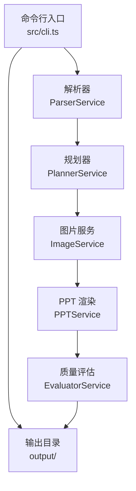
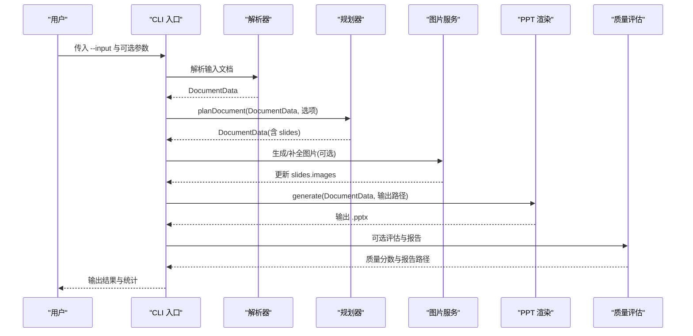
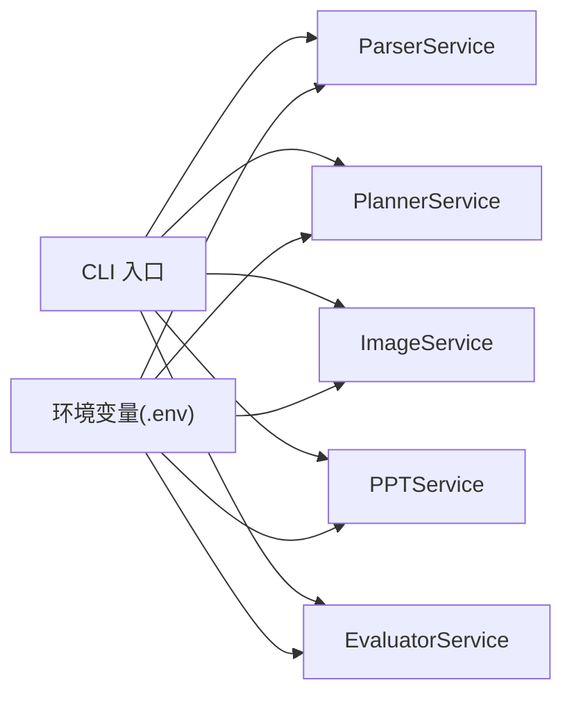

# 命令行工具

<cite>
**本文引用的文件**
- [src/cli.ts](file://src/cli.ts)
- [package.json](file://package.json)
- [readme.md](file://readme.md)
- [ARCHITECTURE.md](file://ARCHITECTURE.md)
- [src/services/parser.service.ts](file://src/services/parser.service.ts)
- [src/services/planner.service.ts](file://src/services/planner.service.ts)
- [src/services/image.service.ts](file://src/services/image.service.ts)
- [src/services/ppt.service.ts](file://src/services/ppt.service.ts)
- [src/services/evaluator.service.ts](file://src/services/evaluator.service.ts)
- [src/types.ts](file://src/types.ts)
</cite>

## 目录
1. [简介](#简介)
2. [项目结构](#项目结构)
3. [核心组件](#核心组件)
4. [架构总览](#架构总览)
5. [详细组件分析](#详细组件分析)
6. [依赖分析](#依赖分析)
7. [性能考虑](#性能考虑)
8. [故障排除指南](#故障排除指南)
9. [结论](#结论)
10. [附录](#附录)

## 简介
本文件为 Generate-PPT 的命令行工具提供完整、可操作的使用与运维指南。CLI 工具支持从 Markdown、Word、PDF 文档生成 PPTX，并可选输出质量评估报告；同时提供规划模式、受众、焦点、风格、长度等参数，便于定制生成效果。CLI 与 Web 服务共享同一套核心服务链路，但在运行方式、并发与资源管理上各有侧重。

## 项目结构
- CLI 入口位于 src/cli.ts，负责解析命令行参数、执行完整生成链路并将结果输出至 output/。
- 核心服务链路：
  - 解析器：ParserService（支持 .md/.docx/.pdf）
  - 规划器：PlannerService（可选 LLM，支持严格/创意模式）
  - 图片服务：ImageService（AI 生成或回退）
  - PPT 渲染：PPTService（角色驱动渲染）
  - 质量评估：EvaluatorService（输出 JSON/Markdown 报告）
- 环境变量集中于 .env（由 readme.md 提供示例），CLI 与 Web 服务均读取相同配置。

**图表来源**
- [src/cli.ts:65-170](file://src/cli.ts#L65-L170)
- [src/services/parser.service.ts](file://src/services/parser.service.ts)
- [src/services/planner.service.ts](file://src/services/planner.service.ts)
- [src/services/image.service.ts:15-28](file://src/services/image.service.ts#L15-L28)
- [src/services/ppt.service.ts:52-75](file://src/services/ppt.service.ts#L52-L75)
- [src/services/evaluator.service.ts:32-93](file://src/services/evaluator.service.ts#L32-L93)

**章节来源**
- [ARCHITECTURE.md:42-62](file://ARCHITECTURE.md#L42-L62)
- [src/cli.ts:65-170](file://src/cli.ts#L65-L170)

## 核心组件
- 命令行入口与参数解析：负责校验输入、解析文档、调用规划与渲染、可选生成质量报告。
- 解析器：将 Markdown/DOCX/PDF 转为结构化 DocumentData。
- 规划器：基于输入与偏好生成演示化大纲，支持严格/创意模式与多种 deck 参数。
- 图片服务：为缺图页面生成或下载图片，支持并发与缓存。
- PPT 渲染：按 slideRole 渲染不同模板，支持图片优先/仅图片模式等渲染配置。
- 质量评估：对生成的 PPT 进行结构、布局、图片语义、内容丰富度、受众匹配、一致性等维度评分。

**章节来源**
- [src/cli.ts:65-170](file://src/cli.ts#L65-L170)
- [src/services/parser.service.ts](file://src/services/parser.service.ts)
- [src/services/planner.service.ts:84-101](file://src/services/planner.service.ts#L84-L101)
- [src/services/image.service.ts:15-28](file://src/services/image.service.ts#L15-L28)
- [src/services/ppt.service.ts:52-75](file://src/services/ppt.service.ts#L52-L75)
- [src/services/evaluator.service.ts:32-93](file://src/services/evaluator.service.ts#L32-L93)

## 架构总览
CLI 与 Web 服务共享相同的处理链路，但 CLI 专注于本地批量生成与回归验证，Web 服务用于在线交互与 API 调用。CLI 的关键流程如下：
- 校验并解析输入文件（.md/.docx/.pdf）
- 规划文档（可选严格/创意模式与 deck 参数）
- 可选生成图片（受并发与开关控制）
- 渲染 PPT
- 可选质量评估与报告输出

**图表来源**
- [src/cli.ts:65-170](file://src/cli.ts#L65-L170)
- [src/services/parser.service.ts](file://src/services/parser.service.ts)
- [src/services/planner.service.ts:84-101](file://src/services/planner.service.ts#L84-L101)
- [src/services/image.service.ts:15-28](file://src/services/image.service.ts#L15-L28)
- [src/services/ppt.service.ts:52-75](file://src/services/ppt.service.ts#L52-L75)
- [src/services/evaluator.service.ts:32-93](file://src/services/evaluator.service.ts#L32-L93)

## 详细组件分析

### CLI 命令行参数与选项
- 必填参数
  - --input：输入文件路径（支持 .md/.docx/.pdf）。CLI 会解析为绝对路径并校验存在性。
- 可选参数
  - --output：输出 PPTX 路径（默认输出到 output/，文件名包含输入文件名与时间戳）。
  - --planner-mode：规划模式，取值 strict 或 creative。
  - --deck-format：演示格式，取值 presenter 或 detailed。
  - --audience：受众，取值 general、beginner、executive、student、technical。
  - --focus：焦点，取值 overview、timeline、argument、process、comparison。
  - --style：风格，取值 professional、minimal、bold、educational。
  - --length：长度，取值 short、default、long。
- 环境变量（影响行为）
  - ENABLE_AI_IMAGES：是否启用 AI 图片生成（默认 true）。
  - IMAGE_CONCURRENCY：图片生成并发数（默认 2）。
  - ENABLE_EVALUATION：是否启用质量评估（默认 true）。
  - 其他渲染与规划相关环境变量见下节。

**章节来源**
- [src/cli.ts:65-170](file://src/cli.ts#L65-L170)
- [src/types.ts:3-8](file://src/types.ts#L3-L8)

### 解析器（ParserService）
- 输入支持：.md、.docx、.pdf
- 输出：DocumentData（包含 title、slides、brief、understanding 等）
- 特点：保留层级结构，针对不同格式采用不同的解析策略与兜底方案。

**章节来源**
- [src/cli.ts:84-92](file://src/cli.ts#L84-L92)
- [src/services/parser.service.ts](file://src/services/parser.service.ts)

### 规划器（PlannerService）
- 功能：将结构化文档重写为演示化大纲，生成 keyMessage、summary、speakerNotes、imagePrompt、slideRole 等。
- 模式：strict（贴近原文）、creative（适度润色但不引入未支持事实）。
- 选项：deckFormat、audience、focus、style、length。
- 行为：若启用 LLM，优先调用统一中转接口；可选使用 worker proxy；支持稀疏页扩写与叙事连续性增强。

**章节来源**
- [src/cli.ts:127-134](file://src/cli.ts#L127-L134)
- [src/services/planner.service.ts:84-101](file://src/services/planner.service.ts#L84-L101)
- [readme.md:52-67](file://readme.md#L52-L67)

### 图片服务（ImageService）
- 功能：为缺图页面生成图片，支持缓存、降级与回退。
- 并发：通过 runWithConcurrency 控制并发数。
- 降级策略：主 API 失败后尝试简化提示词，再失败则回退到占位图或本地占位。

**章节来源**
- [src/cli.ts:136-140](file://src/cli.ts#L136-L140)
- [src/services/image.service.ts:15-28](file://src/services/image.service.ts#L15-L28)
- [src/services/image.service.ts:199-216](file://src/services/image.service.ts#L199-L216)

### PPT 渲染（PPTService）
- 功能：使用 pptxgenjs 渲染 PPT，按 slideRole 选择模板，自动分页，插入图片、标题、要点、页脚、引用等。
- 渲染配置：受 PPT_TEMPLATE_STYLE、PPT_IMAGE_ONLY_MODE、PPT_KEEP_TEXT、PPT_MAX_BULLETS_PER_SLIDE、PPT_SHOW_SOURCE_REFS 等环境变量控制。

**章节来源**
- [src/services/ppt.service.ts:52-85](file://src/services/ppt.service.ts#L52-L85)

### 质量评估（EvaluatorService）
- 功能：对生成的 PPT 进行结构逻辑、布局、图片语义、内容丰富度、受众匹配、一致性等维度评分，并输出 JSON 与 Markdown 报告。
- 评估依据：既看 DocumentData，也解析最终 .pptx 的可见文本，识别渲染后的问题（如元信息泄漏、提示词式说明、中英文混杂等）。

**章节来源**
- [src/cli.ts:153-160](file://src/cli.ts#L153-L160)
- [src/services/evaluator.service.ts:32-93](file://src/services/evaluator.service.ts#L32-L93)

## 依赖分析
- CLI 依赖各服务模块，形成端到端链路。
- 环境变量贯穿解析、规划、图片、渲染、评估全流程。
- Web 服务与 CLI 共享相同服务，但 Web 服务还提供 API 接口与响应头质量信息。

**图表来源**
- [src/cli.ts:77-81](file://src/cli.ts#L77-L81)
- [readme.md:17-50](file://readme.md#L17-L50)

**章节来源**
- [src/cli.ts:77-81](file://src/cli.ts#L77-L81)
- [readme.md:17-50](file://readme.md#L17-L50)

## 性能考虑
- 并发控制
  - 图片生成并发：通过 IMAGE_CONCURRENCY 控制（默认 2），可根据 CPU/网络资源调整。
  - 并发执行：ImageService 使用 runWithConcurrency 限制同时进行的任务数量。
- 资源管理
  - 输出目录：CLI 默认输出到 output/，可指定 --output 自定义路径。
  - 质量评估：ENABLE_EVALUATION 可关闭以节省时间。
- 渲染优化
  - PPT_MAX_BULLETS_PER_SLIDE 控制每页最大要点数，平衡信息密度与可读性。
  - PPT_TEMPLATE_STYLE 与 PPT_IMAGE_ONLY_MODE 可切换视觉风格与图片优先策略。
- 稀疏页处理
  - PlannerService 的稀疏页扩写可减少“半页空白”，提升观感与内容密度。

**章节来源**
- [src/cli.ts:136-140](file://src/cli.ts#L136-L140)
- [src/services/image.service.ts:199-216](file://src/services/image.service.ts#L199-L216)
- [src/services/ppt.service.ts:77-85](file://src/services/ppt.service.ts#L77-L85)
- [src/services/planner.service.ts:97-101](file://src/services/planner.service.ts#L97-L101)

## 故障排除指南
- 输入文件错误
  - 未提供 --input 或文件不存在：CLI 会抛出错误并终止。
  - 不支持的扩展名：CLI 抛出错误，提示不支持的文件类型。
- 规划器相关
  - 未设置认证令牌：当启用 LLM 时，若缺少 PLANNER_AUTH_TOKEN/LLM_AUTH_TOKEN/IMAGE_API_KEY，规划器会跳过 LLM 路径，退回启发式规划。
  - worker proxy：若启用 PLANNER_USE_WORKER_PROXY，需提供 CLOUDFLARE_WORKER_URL 与真实 provider key，否则可能无法访问上游模型。
- 图片生成失败
  - 主 API 失败：自动尝试简化提示词重试；再失败则回退到占位图或本地占位。
  - 并发过高：适当降低 IMAGE_CONCURRENCY。
- 渲染问题
  - 元信息泄漏或提示词式文案：检查规划器的语言清洗与 PPTService 的过滤逻辑。
  - 文字溢出或分页异常：调整 PPT_MAX_BULLETS_PER_SLIDE 或减少每页要点数。
- 质量评估
  - 评估失败：CLI 会记录警告并继续输出 PPT，不影响主流程。
- 环境变量
  - 未配置 .env：请复制 .env.example 并按需填写必要字段。

**章节来源**
- [src/cli.ts:67-92](file://src/cli.ts#L67-L92)
- [src/services/planner.service.ts:109-120](file://src/services/planner.service.ts#L109-L120)
- [src/services/image.service.ts:42-56](file://src/services/image.service.ts#L42-L56)
- [src/services/ppt.service.ts:77-85](file://src/services/ppt.service.ts#L77-L85)
- [src/services/evaluator.service.ts:158-162](file://src/services/evaluator.service.ts#L158-L162)
- [readme.md:17-50](file://readme.md#L17-L50)

## 结论
CLI 工具提供了与 Web 服务一致的生成能力，适合本地调试、批量生成与回归验证。通过合理配置环境变量与参数，可在保证质量的同时优化性能与资源占用。建议在 CI/CD 中结合质量评估报告进行自动化质量门禁。

## 附录

### 安装与配置
- 安装依赖
  - 使用 npm install 安装项目依赖。
- 配置环境变量
  - 复制 .env.example 为 .env，并按需填写 IMAGE_API_KEY、PLANNER_*、PPT_*、ENABLE_EVALUATION 等。
- 启动 CLI
  - 使用 npm run generate 并传入 --input 与可选参数。

**章节来源**
- [package.json:5-12](file://package.json#L5-L12)
- [readme.md:11-50](file://readme.md#L11-L50)

### 常用命令示例
- 单文件处理
  - npm run generate -- --input input/计算机发展史.docx --output output/计算机发展史-unified.pptx
- 创意模式
  - npm run generate -- --input input/计算机发展史.docx --output output/计算机发展史-creative.pptx --planner-mode creative
- 指定 deck 参数
  - npm run generate -- --input input/示例.md --planner-mode strict --deck-format presenter --audience general --focus overview --style professional --length default

**章节来源**
- [readme.md:92-102](file://readme.md#L92-L102)

### 与 Web 服务和 API 的区别与优势
- 区别
  - CLI：本地执行，适合批量与回归；Web：在线交互与 API 调用。
  - Web 服务会将质量分数与报告路径写入响应头，CLI 则直接输出到控制台与文件。
- 优势
  - CLI 更易集成到本地脚本与 CI/CD；Web 服务更易对接前端或第三方系统。

**章节来源**
- [ARCHITECTURE.md:86-102](file://ARCHITECTURE.md#L86-L102)
- [readme.md:104-120](file://readme.md#L104-L120)

### 性能优化建议
- 调整图片并发：根据机器与网络状况设置 IMAGE_CONCURRENCY。
- 关闭评估：在不需要质量报告时设置 ENABLE_EVALUATION=false。
- 控制每页要点：通过 PPT_MAX_BULLETS_PER_SLIDE 平衡密度与可读性。
- 选择渲染模式：在视觉优先场景启用 PPT_IMAGE_ONLY_MODE。

**章节来源**
- [src/cli.ts:136-140](file://src/cli.ts#L136-L140)
- [src/services/ppt.service.ts:77-85](file://src/services/ppt.service.ts#L77-L85)

### 并发控制与资源管理
- 图片并发：runWithConcurrency 限制同时任务数，避免资源争用。
- 输出目录：CLI 默认输出到 output/，可通过 --output 指定自定义路径。
- 资源清理：生成完成后可手动清理 output/ 或按需保留质量报告。

**章节来源**
- [src/services/image.service.ts:199-216](file://src/services/image.service.ts#L199-L216)
- [src/cli.ts:142-149](file://src/cli.ts#L142-L149)

### 故障排除清单
- 输入校验：确认 --input 存在且扩展名为 .md/.docx/.pdf。
- 规划器：检查 PLANNER_AUTH_TOKEN/LLM_AUTH_TOKEN/IMAGE_API_KEY 是否配置；必要时关闭 worker proxy。
- 图片：观察日志中降级提示；适当降低并发或更换提示词。
- 渲染：检查元信息是否被过滤；调整每页要点数。
- 评估：若评估失败，不影响 PPT 生成，可稍后单独运行评估。

**章节来源**
- [src/cli.ts:67-92](file://src/cli.ts#L67-L92)
- [src/services/planner.service.ts:109-120](file://src/services/planner.service.ts#L109-L120)
- [src/services/image.service.ts:42-56](file://src/services/image.service.ts#L42-L56)
- [src/services/evaluator.service.ts:158-162](file://src/services/evaluator.service.ts#L158-L162)

### CI/CD 集成建议
- 步骤
  - 安装依赖：npm install
  - 配置 .env：注入必要的 API 密钥与开关
  - 执行 CLI：npm run generate -- --input $INPUT_FILE --output $OUTPUT_PPTX
  - 可选评估：读取 output/*.quality.json 作为质量门禁依据
- 最佳实践
  - 将 output/ 与质量报告纳入制品库或工件存储
  - 使用 IMAGE_CONCURRENCY 控制并发，避免 CI 资源抖动
  - 在 PR 场景仅运行评估，主分支再生成 PPT

**章节来源**
- [package.json:5-12](file://package.json#L5-L12)
- [readme.md:17-50](file://readme.md#L17-L50)