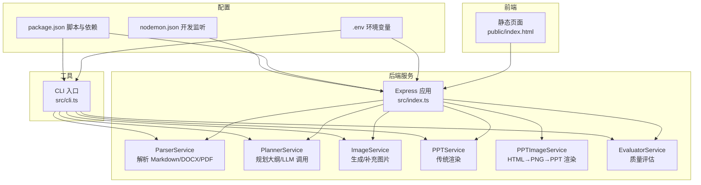
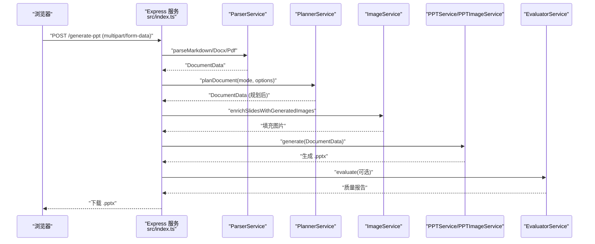
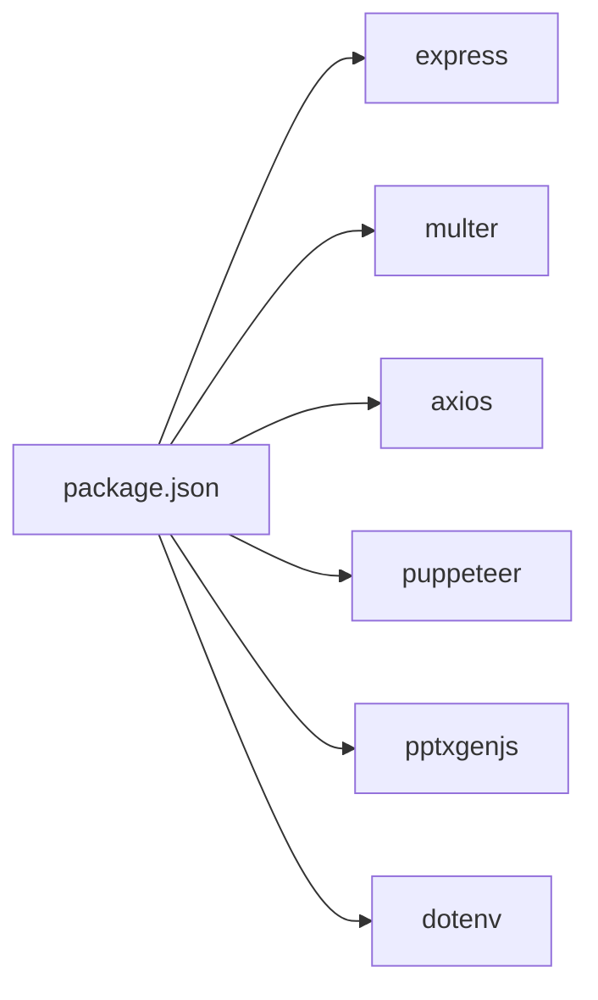

# 快速开始

<cite>
**本文引用的文件列表**
- [package.json](file://package.json)
- [readme.md](file://readme.md)
- [src/index.ts](file://src/index.ts)
- [src/cli.ts](file://src/cli.ts)
- [src/types.ts](file://src/types.ts)
- [src/services/ppt.service.ts](file://src/services/ppt.service.ts)
- [src/services/planner.service.ts](file://src/services/planner.service.ts)
- [public/index.html](file://public/index.html)
- [nodemon.json](file://nodemon.json)
</cite>

## 目录
1. [简介](#简介)
2. [项目结构](#项目结构)
3. [核心组件](#核心组件)
4. [架构总览](#架构总览)
5. [详细组件解析](#详细组件解析)
6. [依赖关系分析](#依赖关系分析)
7. [性能与资源建议](#性能与资源建议)
8. [常见问题与故障排除](#常见问题与故障排除)
9. [结语](#结语)
10. [附录：命令与示例](#附录命令与示例)

## 简介
本指南面向首次接触 Generate-PPT 的用户，帮助你在 15 分钟内完成环境准备、安装配置与首次运行。你将学会：
- 环境要求与 Node.js 兼容性
- 安装与初始配置
- 环境变量详解（AI 服务密钥、端口、功能开关）
- 三种主要使用方式：Web 服务、CLI 工具、API 调用
- 常见初始化问题与故障排除

## 项目结构
该项目采用“服务端 + 前端静态页面 + CLI”的多入口设计，核心逻辑集中在后端服务中，前端提供交互界面，CLI 提供离线批量处理能力。

图表来源
- [src/index.ts:1-432](file://src/index.ts#L1-L432)
- [src/cli.ts:1-176](file://src/cli.ts#L1-L176)
- [src/services/ppt.service.ts:1-200](file://src/services/ppt.service.ts#L1-L200)
- [src/services/planner.service.ts:1-200](file://src/services/planner.service.ts#L1-L200)
- [public/index.html:1-388](file://public/index.html#L1-L388)
- [package.json:1-45](file://package.json#L1-L45)
- [nodemon.json:1-6](file://nodemon.json#L1-L6)

章节来源
- [package.json:1-45](file://package.json#L1-L45)
- [readme.md:127-131](file://readme.md#L127-L131)

## 核心组件
- Express Web 服务：提供 /generate-ppt 和 /api/chat 两个核心接口，支持文件上传与对话式生成。
- 解析器：支持 Markdown、DOCX、PDF 三种源格式，保留层级结构。
- 规划器：基于 LLM（默认 Gemini 3.1 Pro）生成/优化大纲，支持严格与创意两种模式。
- 图像服务：可选生成 AI 图片，或回填文档原始图片。
- PPT 渲染：支持传统 pptxgen 渲染与 HTML→PNG→PPT 两套渲染管线。
- 质量评估：可选输出质量评分与报告文件。
- CLI：命令行入口，支持参数化控制生成流程。

章节来源
- [src/index.ts:314-427](file://src/index.ts#L314-L427)
- [src/cli.ts:65-170](file://src/cli.ts#L65-L170)
- [src/services/ppt.service.ts:45-68](file://src/services/ppt.service.ts#L45-L68)
- [src/services/planner.service.ts:53-101](file://src/services/planner.service.ts#L53-L101)

## 架构总览
下图展示 Web 服务与前端交互、以及 API 调用的关键流程。

图表来源
- [src/index.ts:314-427](file://src/index.ts#L314-L427)
- [src/services/ppt.service.ts:45-68](file://src/services/ppt.service.ts#L45-L68)
- [src/services/planner.service.ts:84-101](file://src/services/planner.service.ts#L84-L101)

## 详细组件解析

### 环境变量与配置
以下为关键环境变量及其作用（来源于 README 与服务实现）：
- 通用
  - PORT：服务端口，默认 3000
- AI 与图像
  - ENABLE_AI_IMAGES：是否启用 AI 图片生成（默认启用）
  - IMAGE_CONCURRENCY：并发度（默认 2）
  - IMAGE_MODEL：图像模型名称（默认 gemini-3.1-flash-image-preview）
  - IMAGE_RESOLUTION：图像分辨率（如 2K）
  - IMAGE_API_KEY：图像服务密钥
  - IMAGE_API_BASE_URL：图像服务基础地址
- 规划器（Planner）
  - ENABLE_PLANNER：是否启用 LLM 规划（默认启用）
  - PLANNER_MODEL：规划使用的模型（默认 gemini-3.1-pro-preview）
  - PLANNER_API_BASE_URL：规划服务基础地址
  - PLANNER_AUTH_TOKEN / LLM_AUTH_TOKEN：规划服务鉴权令牌
  - PLANNER_USE_WORKER_PROXY：是否通过 Cloudflare Worker 代理调用
  - CLOUDFLARE_WORKER_URL：Worker 地址
  - LLM_API_KEY / GOOGLE_API_KEY：Worker 代理所需的第三方密钥
  - AIWORKFLOW_BACKEND_ENV_PATH：可选，用于 worker 代理的后端环境路径
  - PLANNER_CONTENT_MODE：规划模式（strict/creative）
  - PLANNER_EXPAND_SPARSE_CONTENT：稀疏内容扩展（默认启用）
  - PLANNER_USE_GUEST_LOGIN：允许访客登录（默认关闭）
- PPT 渲染与样式
  - PPT_TEMPLATE_STYLE：模板样式（默认启用）
  - PPT_KEEP_TEXT：保留原文本（默认启用）
  - PPT_IMAGE_ONLY_MODE：仅图片模式（默认关闭）
  - PPT_MAX_BULLETS_PER_SLIDE：每页最大要点数（默认 5）
  - PPT_RENDER_MODE：渲染模式（非 legacy 则走 HTML→PNG→PPT）
- 质量评估
  - ENABLE_EVALUATION：是否输出质量评估（默认启用）

章节来源
- [readme.md:17-61](file://readme.md#L17-L61)
- [readme.md:68-83](file://readme.md#L68-L83)
- [src/index.ts:236-255](file://src/index.ts#L236-L255)
- [src/services/ppt.service.ts:70-78](file://src/services/ppt.service.ts#L70-L78)
- [src/services/planner.service.ts:67-82](file://src/services/planner.service.ts#L67-L82)

### Web 服务启动与前端交互
- 启动方式：执行 npm start 即可启动开发服务器（热更新），默认监听端口由 PORT 决定。
- 前端页面：public/index.html 提供“AI 对话生成”和“文档上传生成”两个面板，后者通过 /generate-ppt 接口提交文件。
- 关键接口：
  - POST /generate-ppt：接收 multipart/form-data，字段 file（.md/.docx/.pdf），可选 plannerMode（strict/creative）等。
  - POST /api/chat：支持多文件上传与消息历史，返回回复、大纲预览与下载链接。

章节来源
- [readme.md:84-91](file://readme.md#L84-L91)
- [readme.md:104-120](file://readme.md#L104-L120)
- [src/index.ts:314-427](file://src/index.ts#L314-L427)
- [public/index.html:150-174](file://public/index.html#L150-L174)
- [public/index.html:340-367](file://public/index.html#L340-L367)

### CLI 工具使用
- 使用方式：npm run generate，支持如下参数：
  - --input：必填，输入文件路径（.md/.docx/.pdf）
  - --output：输出文件路径（默认 output/原文件名-时间戳.pptx）
  - --planner-mode：strict 或 creative
  - --deck-format：presenter 或 detailed
  - --audience：general/beginner/executive/student/technical
  - --focus：overview/timeline/argument/process/comparison
  - --style：professional/minimal/bold/educational
  - --length：short/default/long
- 行为：解析 → 规划 → 图片增强（可选）→ 生成 PPT → 质量评估（可选）

章节来源
- [readme.md:92-102](file://readme.md#L92-L102)
- [src/cli.ts:65-170](file://src/cli.ts#L65-L170)

### API 接口调用
- POST /generate-ppt
  - Content-Type: multipart/form-data
  - 字段：
    - file：必填，.md/.docx/.pdf
    - plannerMode：可选，strict 或 creative
    - deckFormat、audience、focus、style、length：可选，对应类型定义
  - 返回：生成的 .pptx；若开启评估，会附加质量分数与报告路径头
- curl 示例：参见 README 的示例命令

章节来源
- [readme.md:104-120](file://readme.md#L104-L120)
- [src/index.ts:314-427](file://src/index.ts#L314-L427)
- [src/types.ts:1-80](file://src/types.ts#L1-L80)

### 数据模型与渲染策略
- DocumentData：包含 title、slides、brief、understanding 等
- SlideContent：包含标题、要点、图片、布局、角色等
- PlannerOptions：规划参数集合
- 渲染策略：
  - 传统模式：使用 pptxgen 渲染，受 PPT_TEMPLATE_STYLE、PPT_KEEP_TEXT、PPT_IMAGE_ONLY_MODE、PPT_MAX_BULLETS_PER_SLIDE 等影响
  - HTML→PNG→PPT 模式：当 PPT_RENDER_MODE 非 legacy 时启用，先生成图片再转 PPT

章节来源
- [src/types.ts:66-80](file://src/types.ts#L66-L80)
- [src/types.ts:48-64](file://src/types.ts#L48-L64)
- [src/types.ts:73-80](file://src/types.ts#L73-L80)
- [src/services/ppt.service.ts:70-78](file://src/services/ppt.service.ts#L70-L78)
- [src/index.ts:236-255](file://src/index.ts#L236-L255)

## 依赖关系分析
- 运行时依赖：Express、Multer、Axios、Puppeteer、pptxgenjs、dotenv 等
- 开发依赖：TypeScript、ts-node、nodemon 等
- 开发脚本：start（开发服务器）、build（编译）、serve（生产运行）、generate（CLI）、test:*（测试）

图表来源
- [package.json:18-31](file://package.json#L18-L31)

章节来源
- [package.json:1-45](file://package.json#L1-45)

## 性能与资源建议
- 并发与内存：IMAGE_CONCURRENCY 建议根据 CPU 与网络带宽调整；Puppeteer 启动较耗内存，建议在资源充足的机器上运行。
- 渲染模式选择：HTML→PNG→PPT 模式通常更美观但耗时较长；传统模式更快但样式相对简单。
- 输出目录：服务端与 CLI 默认输出到项目根目录下的 output 文件夹，注意磁盘空间与权限。

[本节为通用建议，不涉及具体文件分析]

## 常见问题与故障排除
- Node.js 版本不兼容
  - 现象：启动时报错或运行异常
  - 处理：参考 README 的 Node.js 兼容性要求（推荐 ≥16），升级至满足条件的版本
- 环境变量缺失
  - 现象：规划器或图像服务报错
  - 处理：复制 .env.example 至 .env，按需填写 IMAGE_API_KEY、PLANNER_AUTH_TOKEN、PORT 等
- CORS 与跨域
  - 现象：浏览器访问 /generate-ppt 报错
  - 处理：服务已内置 CORS 中间件，若自建前端请确保同源或正确配置代理
- 文件格式不支持
  - 现象：上传 .docx/.pdf/.md 之外的文件报错
  - 处理：仅支持 .md/.docx/.pdf；确保文件未损坏且路径正确
- 评估报告未生成
  - 现象：期望的质量分数与报告未出现
  - 处理：检查 ENABLE_EVALUATION 是否为 true；确认输出目录可写
- Worker 代理模式
  - 现象：PLANNER_USE_WORKER_PROXY=true 时仍失败
  - 处理：确认 CLOUDFLARE_WORKER_URL、LLM_API_KEY 或 GOOGLE_API_KEY 正确；否则回退到本地令牌模式

章节来源
- [readme.md:127-131](file://readme.md#L127-L131)
- [readme.md:52-61](file://readme.md#L52-L61)
- [src/index.ts:24-27](file://src/index.ts#L24-L27)
- [src/index.ts:337-369](file://src/index.ts#L337-L369)

## 结语
至此，你已经完成了环境准备、安装配置与三种使用方式的实践。建议在首次运行后，逐步调整环境变量以获得更符合预期的输出，并结合质量评估报告持续优化生成效果。

[本节为总结性内容，不涉及具体文件分析]

## 附录：命令与示例

- 安装与启动
  - 安装依赖：npm install
  - 启动开发服务器：npm start
  - 打包构建（可选）：npm run build
  - 生产运行（可选）：npm run serve

- Web 服务
  - 访问地址：http://localhost:3000
  - 使用前端页面上传文件，或直接调用 /generate-ppt 接口

- CLI 使用
  - 基础生成：npm run generate -- --input 输入路径 --output 输出路径
  - 创意模式：追加 --planner-mode creative
  - 参数化生成：追加 --deck-format/--audience/--focus/--style/--length

- API 调用（curl）
  - 上传文件并生成 PPT：参见 README 的 curl 示例
  - 可选参数：plannerMode=strict|creative，以及其他规划参数

章节来源
- [readme.md:11-15](file://readme.md#L11-L15)
- [readme.md:84-91](file://readme.md#L84-L91)
- [readme.md:92-102](file://readme.md#L92-L102)
- [readme.md:104-120](file://readme.md#L104-L120)