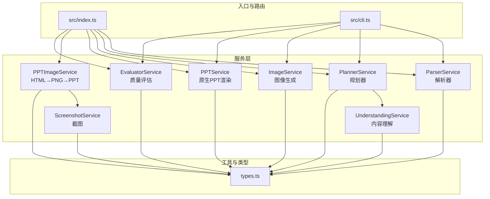
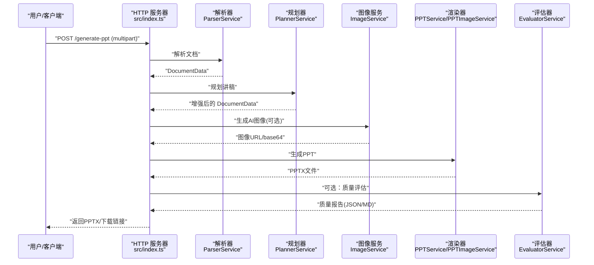
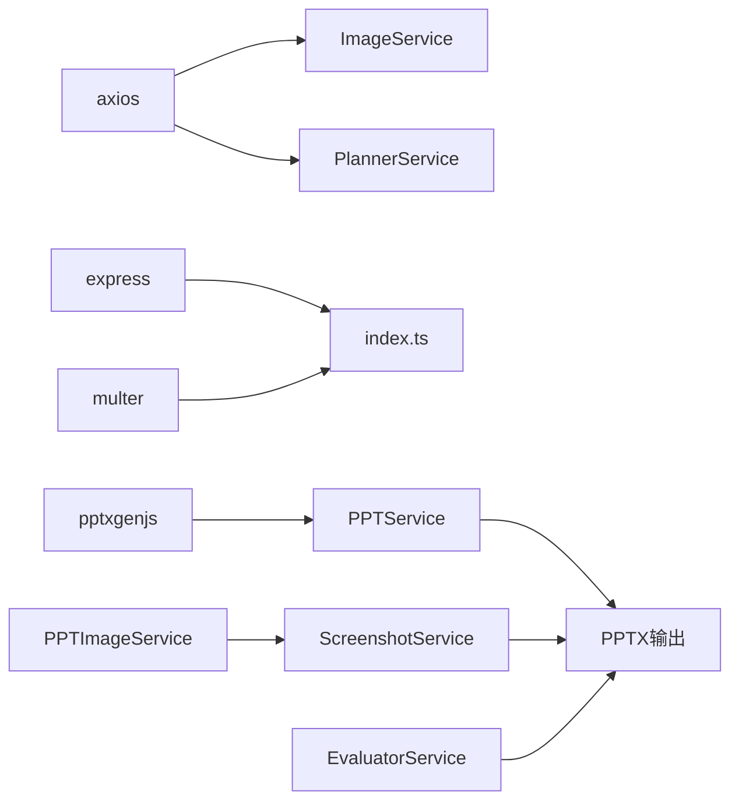

# 故障排除与常见问题

<cite>
**本文引用的文件**   
- [readme.md](file://readme.md)
- [package.json](file://package.json)
- [src/index.ts](file://src/index.ts)
- [src/cli.ts](file://src/cli.ts)
- [src/types.ts](file://src/types.ts)
- [src/services/parser.service.ts](file://src/services/parser.service.ts)
- [src/services/planner.service.ts](file://src/services/planner.service.ts)
- [src/services/image.service.ts](file://src/services/image.service.ts)
- [src/services/ppt.service.ts](file://src/services/ppt.service.ts)
- [src/services/ppt-image.service.ts](file://src/services/ppt-image.service.ts)
- [src/services/screenshot.service.ts](file://src/services/screenshot.service.ts)
- [src/services/evaluator.service.ts](file://src/services/evaluator.service.ts)
- [src/services/understanding.service.ts](file://src/services/understanding.service.ts)
- [nodemon.json](file://nodemon.json)
</cite>

## 目录
1. [简介](#简介)
2. [项目结构](#项目结构)
3. [核心组件](#核心组件)
4. [架构总览](#架构总览)
5. [详细组件分析](#详细组件分析)
6. [依赖分析](#依赖分析)
7. [性能考虑](#性能考虑)
8. [故障排除指南](#故障排除指南)
9. [结论](#结论)
10. [附录](#附录)

## 简介
本文件面向使用 Generate-PPT 的用户与维护者，提供系统化的故障排除与常见问题解答。内容覆盖安装与环境配置、运行与 API 使用、图像生成与渲染、质量评估、性能优化、日志与诊断、版本与升级注意事项，以及紧急处置建议。文档以“问题类型”为主线，结合代码实现细节，帮助快速定位与解决问题。

## 项目结构
项目采用分层模块化设计：
- 入口与路由：HTTP 服务器与 API 路由定义
- 服务层：解析、规划、图像生成、PPT 渲染、截图、理解与评估
- 工具与类型：通用类型定义与工具函数
- CLI：命令行入口，便于离线批量生成
- 配置与监控：环境变量、日志输出、热重载配置

**图表来源**
- [src/index.ts:1-433](file://src/index.ts#L1-L433)
- [src/cli.ts:1-176](file://src/cli.ts#L1-L176)
- [src/services/parser.service.ts:1-453](file://src/services/parser.service.ts#L1-L453)
- [src/services/planner.service.ts:1-800](file://src/services/planner.service.ts#L1-L800)
- [src/services/image.service.ts:1-218](file://src/services/image.service.ts#L1-L218)
- [src/services/ppt.service.ts:1-800](file://src/services/ppt.service.ts#L1-L800)
- [src/services/ppt-image.service.ts:1-53](file://src/services/ppt-image.service.ts#L1-L53)
- [src/services/screenshot.service.ts:1-77](file://src/services/screenshot.service.ts#L1-L77)
- [src/services/understanding.service.ts:1-96](file://src/services/understanding.service.ts#L1-L96)
- [src/services/evaluator.service.ts:1-800](file://src/services/evaluator.service.ts#L1-L800)
- [src/types.ts:1-160](file://src/types.ts#L1-L160)

**章节来源**
- [src/index.ts:1-433](file://src/index.ts#L1-L433)
- [src/cli.ts:1-176](file://src/cli.ts#L1-L176)

## 核心组件
- 解析器（ParserService）：支持 Markdown、DOCX、PDF，提取标题、要点、图片，构建统一的文档结构
- 规划器（PlannerService）：基于 LLM 或启发式策略生成讲稿大纲、布局、图像意图与提示词
- 图像服务（ImageService）：调用外部图像接口生成幻灯片背景图，带缓存与降级兜底
- PPT 渲染（PPTService）：原生 pptxgenjs 渲染，支持模板风格、仅图模式等
- HTML→PNG→PPT（PPTImageService + ScreenshotService）：通过 Puppeteer 截图生成高清 PPT
- 评估器（EvaluatorService）：对生成的 PPT 进行多维度评分与报告输出
- CLI（cli.ts）：命令行入口，支持批处理与参数化控制

**章节来源**
- [src/services/parser.service.ts:1-453](file://src/services/parser.service.ts#L1-L453)
- [src/services/planner.service.ts:1-800](file://src/services/planner.service.ts#L1-L800)
- [src/services/image.service.ts:1-218](file://src/services/image.service.ts#L1-L218)
- [src/services/ppt.service.ts:1-800](file://src/services/ppt.service.ts#L1-L800)
- [src/services/ppt-image.service.ts:1-53](file://src/services/ppt-image.service.ts#L1-L53)
- [src/services/screenshot.service.ts:1-77](file://src/services/screenshot.service.ts#L1-L77)
- [src/services/evaluator.service.ts:1-800](file://src/services/evaluator.service.ts#L1-L800)
- [src/cli.ts:1-176](file://src/cli.ts#L1-L176)

## 架构总览
下图展示从输入文档到最终 PPT 的端到端流程，以及关键错误点与降级路径。

**图表来源**
- [src/index.ts:314-428](file://src/index.ts#L314-L428)
- [src/services/parser.service.ts:1-453](file://src/services/parser.service.ts#L1-L453)
- [src/services/planner.service.ts:1-800](file://src/services/planner.service.ts#L1-L800)
- [src/services/image.service.ts:1-218](file://src/services/image.service.ts#L1-L218)
- [src/services/ppt.service.ts:1-800](file://src/services/ppt.service.ts#L1-L800)
- [src/services/ppt-image.service.ts:1-53](file://src/services/ppt-image.service.ts#L1-L53)
- [src/services/evaluator.service.ts:1-800](file://src/services/evaluator.service.ts#L1-L800)

## 详细组件分析

### 组件A：解析器（ParserService）
- 功能要点
  - Markdown：按标题层级与列表项构建幻灯片，提取图片
  - DOCX：转换为 HTML 后解析标题、列表、段落与图片
  - PDF：按段落切分，生成若干幻灯片
- 常见问题
  - PDF 解析依赖 pdf-parse，旧版 Node 可能不兼容；如初始化失败，需升级 Node 版本
  - DOCX 图片内嵌为 base64，体积较大，注意内存占用
- 诊断建议
  - 检查 Node 版本是否满足要求
  - 查看解析后 slides 数量与图片数量是否符合预期

**章节来源**
- [src/services/parser.service.ts:136-183](file://src/services/parser.service.ts#L136-L183)
- [readme.md:127-131](file://readme.md#L127-L131)

### 组件B：规划器（PlannerService）
- 功能要点
  - 启发式规划：无 LLM 时的默认策略
  - LLM 规划：支持直连或通过 Cloudflare Worker 代理
  - 内容模式：strict/creative；稀疏扩展；嘉宾登录
- 常见问题
  - 缺少鉴权令牌时跳过 LLM 规划，退回启发式结果
  - Worker 代理需要正确的 CLOUDFLARE_WORKER_URL 与密钥
  - 模型参数与超时设置影响稳定性
- 诊断建议
  - 检查 ENABLE_PLANNER、PLANNER_AUTH_TOKEN、PLANNER_MODEL、PLANNER_API_BASE_URL
  - 开启 PLANNER_USE_WORKER_PROXY 时核对 CLOUDFLARE_WORKER_URL 与 LLM_API_KEY/GOOGLE_API_KEY

**章节来源**
- [src/services/planner.service.ts:67-82](file://src/services/planner.service.ts#L67-L82)
- [src/services/planner.service.ts:103-162](file://src/services/planner.service.ts#L103-L162)
- [src/services/planner.service.ts:164-190](file://src/services/planner.service.ts#L164-L190)
- [readme.md:52-61](file://readme.md#L52-L61)

### 组件C：图像服务（ImageService）
- 功能要点
  - 主接口：生成图像，支持缓存与降级
  - 降级策略：失败时使用简化提示词重试，再回退到随机占位图
- 常见问题
  - 外部接口不稳定导致生成失败
  - 返回非期望格式（URL/base64），需标准化
- 诊断建议
  - 检查 IMAGE_API_KEY、IMAGE_API_BASE_URL、IMAGE_CONCURRENCY
  - 关注日志中的“Primary image API failed”与“图片生成失败，尝试使用简化提示词重试”

**章节来源**
- [src/services/image.service.ts:9-13](file://src/services/image.service.ts#L9-L13)
- [src/services/image.service.ts:30-57](file://src/services/image.service.ts#L30-L57)
- [src/services/image.service.ts:158-178](file://src/services/image.service.ts#L158-L178)

### 组件D：PPT 渲染（PPTService 与 PPTImageService）
- 功能要点
  - PPTService：原生 pptxgenjs 渲染，支持模板风格、仅图模式、保留文本等
  - PPTImageService：HTML→PNG→PPT，适合高保真视觉
- 常见问题
  - 模板样式依赖字体与颜色，不同平台显示可能有差异
  - HTML→PNG 流程对 Puppeteer 依赖强，资源消耗大
- 诊断建议
  - 切换 PPT_RENDER_MODE 控制渲染路径
  - 检查 PPT_TEMPLATE_STYLE、PPT_IMAGE_ONLY_MODE、PPT_KEEP_TEXT 等开关

**章节来源**
- [src/services/ppt.service.ts:77-85](file://src/services/ppt.service.ts#L77-L85)
- [src/services/ppt-image.service.ts:18-51](file://src/services/ppt-image.service.ts#L18-L51)
- [src/services/screenshot.service.ts:15-52](file://src/services/screenshot.service.ts#L15-L52)

### 组件E：评估器（EvaluatorService）
- 功能要点
  - 对生成的 PPT 进行多维度评分（逻辑、布局、图像语义、内容丰富度、受众契合、一致性、源理解）
  - 输出 JSON 与 Markdown 报告
- 常见问题
  - ZIP 解析失败或文件不存在时，会回退为空指标
  - 混合语言检测与元信息识别依赖渲染文本提取
- 诊断建议
  - 确认 ENABLE_EVALUATION 开关
  - 检查输出目录权限与磁盘空间

**章节来源**
- [src/services/evaluator.service.ts:95-108](file://src/services/evaluator.service.ts#L95-L108)
- [src/services/evaluator.service.ts:110-162](file://src/services/evaluator.service.ts#L110-L162)

## 依赖分析
- 运行时依赖
  - express、multer、cors、dotenv：Web 服务与文件上传
  - pptxgenjs：PPT 渲染
  - puppeteer：HTML 截图
  - mammoth、marked、pdf-parse：文档解析
  - axios：HTTP 请求（图像与 LLM）
- 开发依赖
  - ts-node、nodemon、typescript：开发与热重载
- 关键耦合
  - PlannerService 与 UnderstandingService 协作产出 DeckBrief
  - ImageService 与 PPTService/PPTImageService 松耦合，通过 slides 的 images 字段衔接
  - EvaluatorService 依赖 ZIP 解析 PPT 内容进行指标统计

**图表来源**
- [package.json:18-31](file://package.json#L18-L31)
- [src/services/image.service.ts:1-218](file://src/services/image.service.ts#L1-L218)
- [src/services/planner.service.ts:1-800](file://src/services/planner.service.ts#L1-L800)
- [src/services/ppt.service.ts:1-800](file://src/services/ppt.service.ts#L1-L800)
- [src/services/ppt-image.service.ts:1-53](file://src/services/ppt-image.service.ts#L1-L53)
- [src/services/screenshot.service.ts:1-77](file://src/services/screenshot.service.ts#L1-L77)
- [src/services/evaluator.service.ts:1-800](file://src/services/evaluator.service.ts#L1-L800)

**章节来源**
- [package.json:18-44](file://package.json#L18-L44)

## 性能考虑
- 并发与吞吐
  - 图像生成并发数由 IMAGE_CONCURRENCY 控制，默认 2
  - HTML→PNG 截图对 CPU/内存压力较大，建议在资源充足的环境中运行
- 渲染路径选择
  - 原生 PPT 渲染更快，适合大批量与低延迟场景
  - HTML→PNG 渲染更易保持视觉一致性，但耗时较长
- 资源与缓存
  - ImageService 内置提示词到图像的缓存，减少重复请求
  - 解析器对 PDF 的懒加载避免不必要的依赖加载

**章节来源**
- [src/services/image.service.ts:159-178](file://src/services/image.service.ts#L159-L178)
- [src/services/ppt-image.service.ts:18-51](file://src/services/ppt-image.service.ts#L18-L51)
- [src/services/parser.service.ts:169-183](file://src/services/parser.service.ts#L169-L183)

## 故障排除指南

### 安装与环境问题
- 症状
  - 安装依赖时报错或 Node 版本不兼容
- 根因
  - Node 版本过低；PDF 解析依赖需要较新运行时
- 处理步骤
  - 升级 Node 至推荐版本及以上
  - 清理缓存后重新安装依赖
- 参考
  - [readme.md:127-131](file://readme.md#L127-L131)
  - [package.json:18-31](file://package.json#L18-L31)

**章节来源**
- [readme.md:127-131](file://readme.md#L127-L131)
- [package.json:18-31](file://package.json#L18-L31)

### 配置错误
- 症状
  - 规划器未生效、图像生成失败、评估报告缺失
- 根因
  - 环境变量未正确设置或冲突
- 处理步骤
  - 核对 .env 文件与以下关键变量：
    - IMAGE_API_KEY、IMAGE_API_BASE_URL、IMAGE_CONCURRENCY、IMAGE_MODEL、IMAGE_RESOLUTION
    - ENABLE_PLANNER、PLANNER_MODEL、PLANNER_API_BASE_URL、PLANNER_AUTH_TOKEN、LLM_AUTH_TOKEN
    - PLANNER_USE_WORKER_PROXY、CLOUDFLARE_WORKER_URL、LLM_API_KEY、GOOGLE_API_KEY
    - ENABLE_EVALUATION、PPT_TEMPLATE_STYLE、PPT_KEEP_TEXT、PPT_IMAGE_ONLY_MODE、PPT_MAX_BULLETS_PER_SLIDE
    - PORT、PPT_RENDER_MODE
  - 若启用 Worker 代理，确保 CLOUDFLARE_WORKER_URL 与密钥有效
  - 若使用 CLI，确认传入的参数与工作目录正确
- 参考
  - [readme.md:17-61](file://readme.md#L17-L61)
  - [src/index.ts:314-428](file://src/index.ts#L314-L428)
  - [src/cli.ts:65-176](file://src/cli.ts#L65-L176)

**章节来源**
- [readme.md:17-61](file://readme.md#L17-L61)
- [src/index.ts:314-428](file://src/index.ts#L314-L428)
- [src/cli.ts:65-176](file://src/cli.ts#L65-L176)

### 性能问题
- 症状
  - 生成缓慢、CPU/内存占用高、Puppeteer 启动失败
- 根因
  - HTML→PNG 渲染路径资源消耗大；并发过高；浏览器启动参数不当
- 处理步骤
  - 切换到原生 PPT 渲染（PPT_RENDER_MODE 不等于 html）
  - 降低 IMAGE_CONCURRENCY
  - 确保系统具备足够内存与磁盘空间
  - 检查 Puppeteer 启动参数与沙箱设置
- 参考
  - [src/services/ppt-image.service.ts:18-51](file://src/services/ppt-image.service.ts#L18-L51)
  - [src/services/screenshot.service.ts:54-68](file://src/services/screenshot.service.ts#L54-L68)

**章节来源**
- [src/services/ppt-image.service.ts:18-51](file://src/services/ppt-image.service.ts#L18-L51)
- [src/services/screenshot.service.ts:54-68](file://src/services/screenshot.service.ts#L54-L68)

### 功能异常
- 症状
  - 无法生成 PPT、图像为空、幻灯片内容不完整
- 根因
  - 输入文件格式不受支持、解析失败、规划器返回空结果、图像接口异常
- 处理步骤
  - 确认上传文件为 .md/.docx/.pdf 或允许的图片
  - 检查解析器输出的 slides 数量与图片字段
  - 若启用 LLM 规划，检查鉴权与网络连通性
  - 若图像生成失败，查看降级日志并重试
- 参考
  - [src/index.ts:314-428](file://src/index.ts#L314-L428)
  - [src/services/parser.service.ts:12-97](file://src/services/parser.service.ts#L12-L97)
  - [src/services/planner.service.ts:84-101](file://src/services/planner.service.ts#L84-L101)
  - [src/services/image.service.ts:30-57](file://src/services/image.service.ts#L30-L57)

**章节来源**
- [src/index.ts:314-428](file://src/index.ts#L314-L428)
- [src/services/parser.service.ts:12-97](file://src/services/parser.service.ts#L12-L97)
- [src/services/planner.service.ts:84-101](file://src/services/planner.service.ts#L84-L101)
- [src/services/image.service.ts:30-57](file://src/services/image.service.ts#L30-L57)

### API 与 CLI 使用问题
- 症状
  - API 返回 400/500 错误、CLI 报缺少参数或文件不存在
- 根因
  - 参数校验失败、文件路径错误、缺少必需字段
- 处理步骤
  - API：检查 multipart 表单字段 file 与可选 plannerMode
  - CLI：确认 --input、--output、--planner-mode 等参数存在且合法
  - 查看服务端日志中的错误堆栈
- 参考
  - [src/index.ts:314-428](file://src/index.ts#L314-L428)
  - [src/cli.ts:65-176](file://src/cli.ts#L65-L176)

**章节来源**
- [src/index.ts:314-428](file://src/index.ts#L314-L428)
- [src/cli.ts:65-176](file://src/cli.ts#L65-L176)

### 日志与诊断信息收集
- 日志位置
  - 服务端标准输出包含关键错误与警告（如 Planner API 失败、图像接口异常、PDF 初始化失败）
- 收集清单
  - 服务端启动日志与错误堆栈
  - 生成过程中的中间状态（解析结果、规划结果、图像生成结果）
  - 输出目录（output）中的 PPTX 与质量报告
- 参考
  - [src/index.ts:72-270](file://src/index.ts#L72-L270)
  - [src/services/parser.service.ts:169-183](file://src/services/parser.service.ts#L169-L183)
  - [src/services/image.service.ts:95-101](file://src/services/image.service.ts#L95-L101)

**章节来源**
- [src/index.ts:72-270](file://src/index.ts#L72-L270)
- [src/services/parser.service.ts:169-183](file://src/services/parser.service.ts#L169-L183)
- [src/services/image.service.ts:95-101](file://src/services/image.service.ts#L95-L101)

### 版本兼容性与升级注意事项
- Node 兼容性
  - 推荐 Node >= 16；PDF 解析依赖需要较新运行时
- 依赖更新
  - 更新前执行清理缓存与重新安装
  - 关注 puppeteer、pptxgenjs 等二进制依赖的系统要求
- 参考
  - [readme.md:127-131](file://readme.md#L127-L131)
  - [package.json:18-31](file://package.json#L18-L31)

**章节来源**
- [readme.md:127-131](file://readme.md#L127-L131)
- [package.json:18-31](file://package.json#L18-L31)

### 紧急处置方案
- 快速降级
  - 关闭 ENABLE_AI_IMAGES，跳过图像生成
  - 关闭 ENABLE_PLANNER，使用启发式规划
  - 切换到原生 PPT 渲染，避免 Puppeteer 依赖
- 临时修复
  - 清理 uploads 与 output 目录，释放磁盘空间
  - 重启服务与浏览器实例（Puppeteer）
- 参考
  - [src/services/image.service.ts:12-13](file://src/services/image.service.ts#L12-L13)
  - [src/services/ppt-image.service.ts:18-51](file://src/services/ppt-image.service.ts#L18-L51)
  - [nodemon.json:1-6](file://nodemon.json#L1-L6)

**章节来源**
- [src/services/image.service.ts:12-13](file://src/services/image.service.ts#L12-L13)
- [src/services/ppt-image.service.ts:18-51](file://src/services/ppt-image.service.ts#L18-L51)
- [nodemon.json:1-6](file://nodemon.json#L1-L6)

## 结论
本指南提供了从安装、配置、使用到性能优化与故障排除的完整路径。建议在生产环境中：
- 明确各组件的依赖与阈值（并发、分辨率、渲染路径）
- 建立日志与质量报告的自动化收集
- 在升级前进行充分验证与回滚预案

## 附录

### 常用环境变量一览
- 图像与规划
  - IMAGE_API_KEY、IMAGE_API_BASE_URL、IMAGE_CONCURRENCY、IMAGE_MODEL、IMAGE_RESOLUTION
  - ENABLE_PLANNER、PLANNER_MODEL、PLANNER_API_BASE_URL、PLANNER_AUTH_TOKEN、LLM_AUTH_TOKEN
  - PLANNER_USE_WORKER_PROXY、CLOUDFLARE_WORKER_URL、LLM_API_KEY、GOOGLE_API_KEY、PLANNER_CONTENT_MODE、PLANNER_EXPAND_SPARSE_CONTENT、PLANNER_USE_GUEST_LOGIN
- 渲染与输出
  - ENABLE_EVALUATION、PPT_TEMPLATE_STYLE、PPT_KEEP_TEXT、PPT_IMAGE_ONLY_MODE、PPT_MAX_BULLETS_PER_SLIDE、PPT_RENDER_MODE
- 服务
  - PORT

**章节来源**
- [readme.md:17-61](file://readme.md#L17-L61)