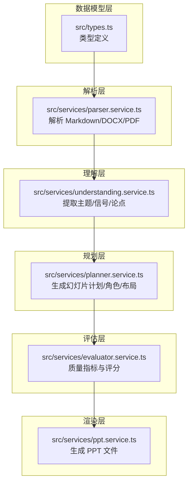
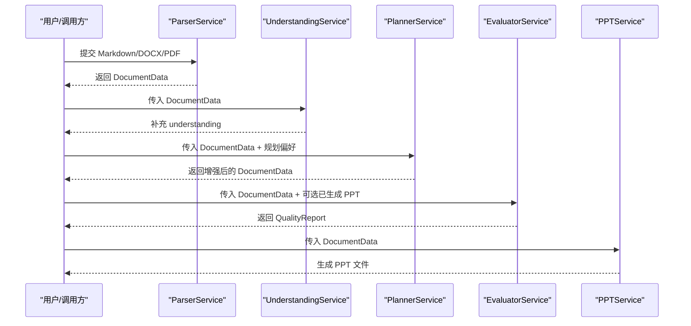
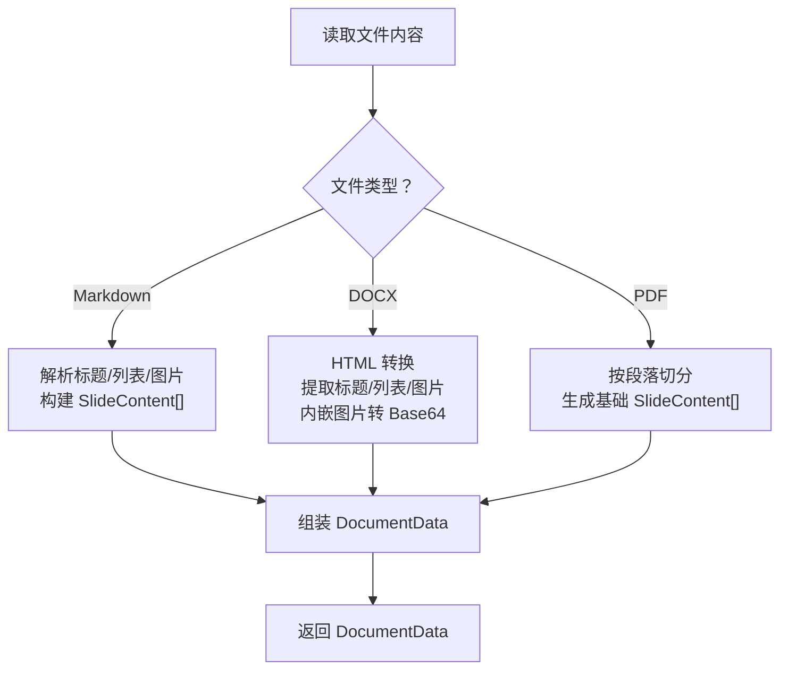
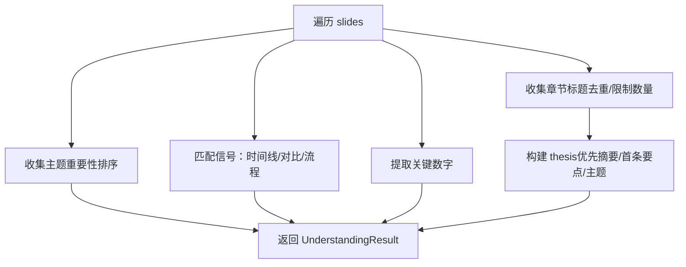
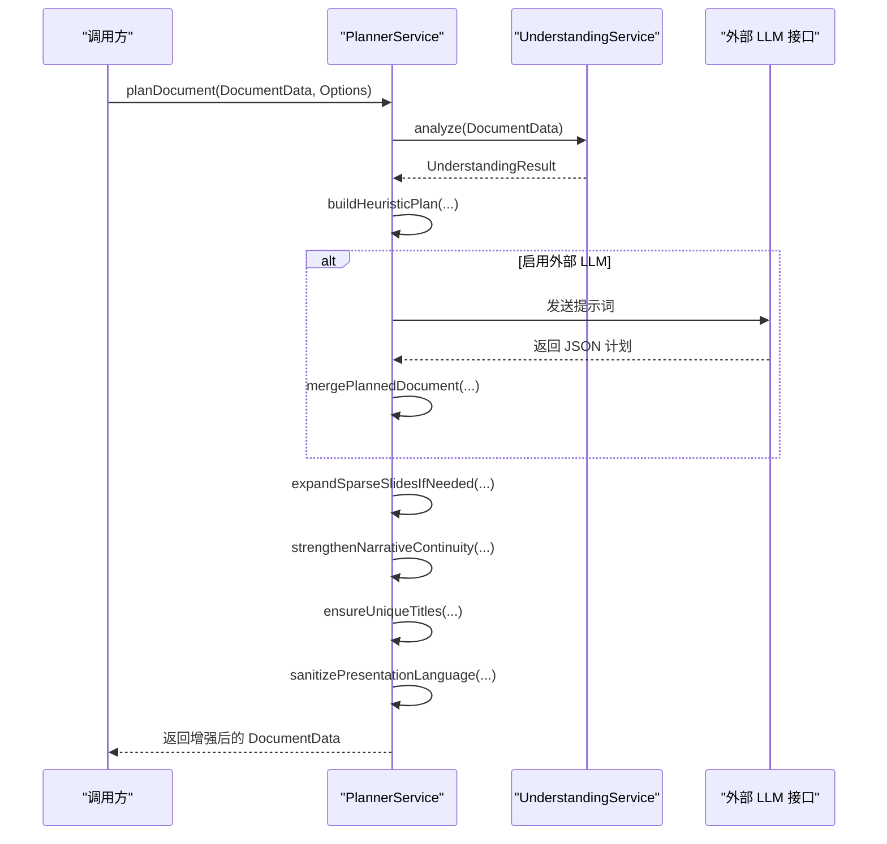
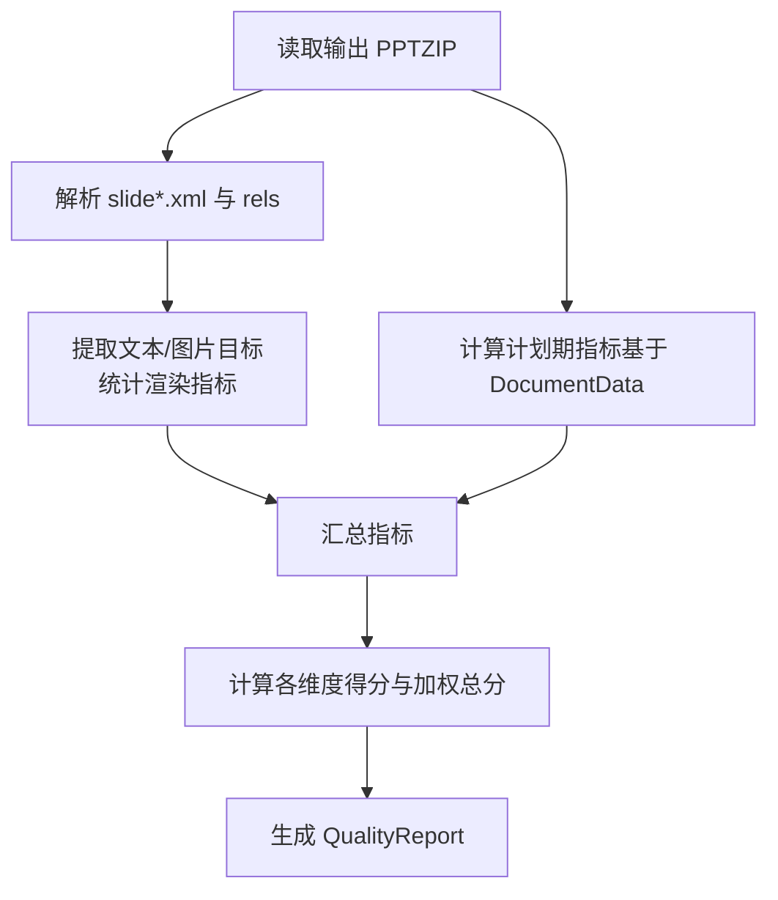
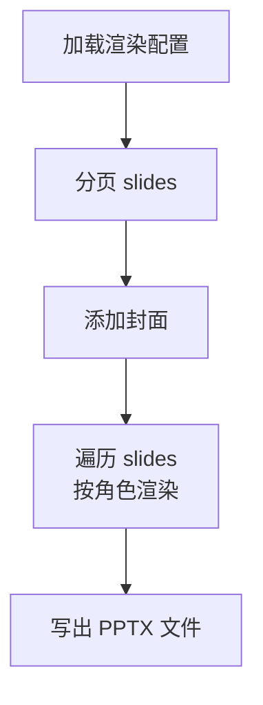
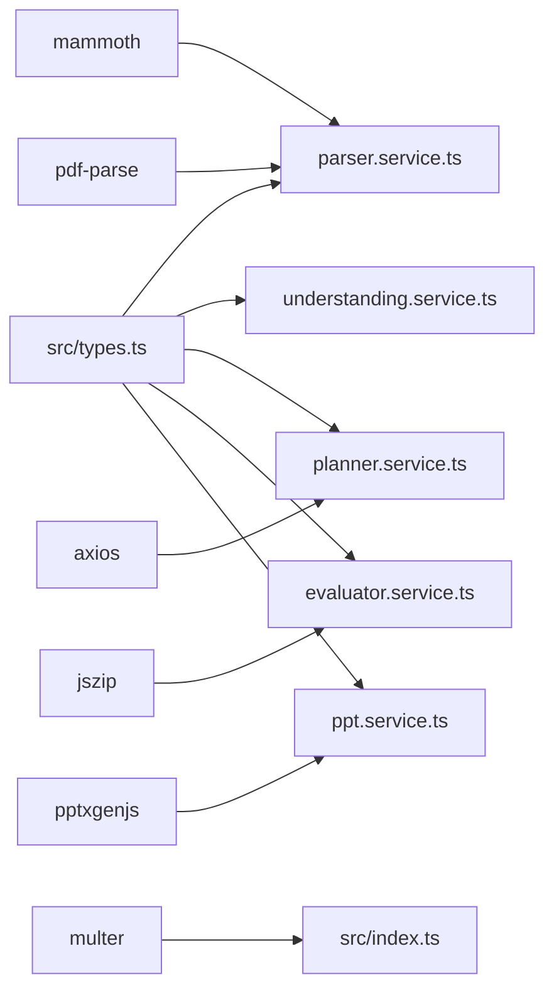
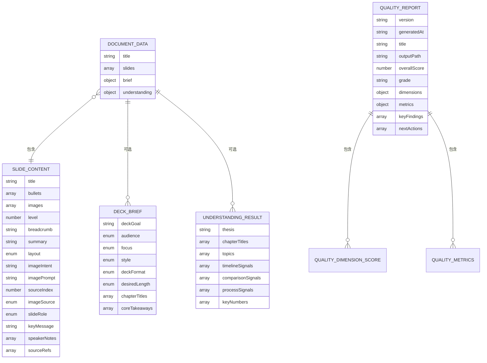

# 数据模型

<cite>
**本文引用的文件**
- [src/types.ts](file://src/types.ts)
- [src/services/parser.service.ts](file://src/services/parser.service.ts)
- [src/services/planner.service.ts](file://src/services/planner.service.ts)
- [src/services/understanding.service.ts](file://src/services/understanding.service.ts)
- [src/services/evaluator.service.ts](file://src/services/evaluator.service.ts)
- [src/services/ppt.service.ts](file://src/services/ppt.service.ts)
- [src/index.ts](file://src/index.ts)
- [package.json](file://package.json)
- [nodemon.json](file://nodemon.json)
</cite>

## 目录
1. [简介](#简介)
2. [项目结构](#项目结构)
3. [核心组件](#核心组件)
4. [架构总览](#架构总览)
5. [详细组件分析](#详细组件分析)
6. [依赖分析](#依赖分析)
7. [性能考量](#性能考量)
8. [故障排查指南](#故障排查指南)
9. [结论](#结论)
10. [附录](#附录)

## 简介
本文件系统化梳理 Generate-PPT 的数据模型与数据流，聚焦以下核心实体：DocumentData、SlideContent、DeckBrief、QualityReport，并结合解析、规划、理解、评估与生成等服务模块，说明字段定义、数据类型、业务规则、验证与约束、数据访问与缓存策略、性能与可靠性建议，以及质量报告的产出与使用方式。

## 项目结构
Generate-PPT 的数据模型以 TypeScript 类型为中心，贯穿解析、规划、理解、评估与生成五大阶段。类型定义位于统一的类型文件中，服务模块通过函数式接口消费这些数据结构，最终生成 PPT 并输出质量报告。

图表来源
- [src/types.ts:21-71](file://src/types.ts#L21-L71)
- [src/services/parser.service.ts:11-97](file://src/services/parser.service.ts#L11-L97)
- [src/services/understanding.service.ts:3-22](file://src/services/understanding.service.ts#L3-L22)
- [src/services/planner.service.ts:53-101](file://src/services/planner.service.ts#L53-L101)
- [src/services/evaluator.service.ts:23-93](file://src/services/evaluator.service.ts#L23-L93)
- [src/services/ppt.service.ts:52-75](file://src/services/ppt.service.ts#L52-L75)

章节来源
- [src/types.ts:1-160](file://src/types.ts#L1-L160)
- [src/services/parser.service.ts:11-167](file://src/services/parser.service.ts#L11-L167)
- [src/services/understanding.service.ts:3-96](file://src/services/understanding.service.ts#L3-L96)
- [src/services/planner.service.ts:53-101](file://src/services/planner.service.ts#L53-L101)
- [src/services/evaluator.service.ts:23-93](file://src/services/evaluator.service.ts#L23-L93)
- [src/services/ppt.service.ts:52-75](file://src/services/ppt.service.ts#L52-L75)

## 核心组件
本节对四个关键数据模型进行逐项说明，包括字段、类型、可选性、默认行为与业务含义。

- DocumentData
  - 字段
    - title: 字符串，演示文稿标题
    - slides: SlideContent[]，幻灯片集合
    - brief?: DeckBrief，简要信息（可选）
    - understanding?: UnderstandingResult，理解结果（可选）
  - 用途
    - 作为解析、规划、评估、生成各阶段的统一载体，贯穿端到端流程
  - 约束与规则
    - slides 非空时，每个 SlideContent 的 title、bullets、images 等字段在不同阶段可能被规范化或补全
    - brief 与 understanding 由理解与规划阶段生成，用于指导布局、角色与提示词构建

- SlideContent
  - 字段
    - title: 字符串，标题
    - bullets: 字符串数组，要点列表
    - images: 字符串数组，Base64 或 URL
    - level?: 数字，层级（来自解析阶段）
    - breadcrumb?: 字符串，路径摘要（来自解析阶段）
    - summary?: 字符串，摘要
    - layout?: SlideLayoutType，布局类型
    - imageIntent?: 字符串，图像意图
    - imagePrompt?: 字符串，图像提示词
    - sourceIndex?: 数字，源索引
    - imageSource?: SlideImageSource，图像来源类型
    - slideRole?: SlideRole，幻灯片角色
    - keyMessage?: 字符串，关键信息
    - speakerNotes?: 字符串数组，讲者备注
    - sourceRefs?: 数字数组，源引用索引
  - 用途
    - 规划阶段的最小工作单元；渲染阶段的直接输入
  - 约束与规则
    - layout 与 imagePrompt 在规划阶段通常被补全
    - sourceRefs 用于质量评估时回溯来源

- DeckBrief
  - 字段
    - deckGoal: 字符串，演讲目标
    - audience: 枚举，受众
    - focus: 枚举，关注焦点
    - style: 枚举，风格
    - deckFormat: 枚举，格式（演示/详细）
    - desiredLength: 枚举，长度
    - chapterTitles: 字符串数组，章节标题
    - coreTakeaways: 字符串数组，核心要点
  - 用途
    - 指导规划阶段的角色分配、布局与提示词生成
  - 约束与规则
    - 字段值来自用户选项或默认值，受规范化逻辑约束

- QualityReport
  - 字段
    - version: 字符串，报告版本
    - generatedAt: 字符串，生成时间
    - title: 字符串，演示文稿标题
    - outputPath?: 字符串，输出路径
    - overallScore: 数字，总分
    - grade: 字符串，等级
    - dimensions: 各维度得分与权重
    - metrics: 质量指标集合
    - keyFindings: 字符串数组，关键发现
    - nextActions: 字符串数组，改进建议
  - 用途
    - 评估生成的 PPT 质量，提供可视化与文本报告
  - 约束与规则
    - 维度权重固定，总分为加权求和
    - 输出路径可选，默认写入 output 目录

章节来源
- [src/types.ts:21-71](file://src/types.ts#L21-L71)
- [src/types.ts:82-159](file://src/types.ts#L82-L159)

## 架构总览
下图展示从输入到输出的端到端数据流，强调数据模型在各阶段的传递与转换。

图表来源
- [src/services/parser.service.ts:11-97](file://src/services/parser.service.ts#L11-L97)
- [src/services/understanding.service.ts:3-22](file://src/services/understanding.service.ts#L3-L22)
- [src/services/planner.service.ts:84-101](file://src/services/planner.service.ts#L84-L101)
- [src/services/evaluator.service.ts:32-93](file://src/services/evaluator.service.ts#L32-L93)
- [src/services/ppt.service.ts:53-75](file://src/services/ppt.service.ts#L53-L75)

## 详细组件分析

### 解析器：ParserService
- 输入
  - Markdown/DOCX/PDF 文件路径
- 处理
  - 解析标题、列表、图片，构建 SlideContent 列表
  - 对 DOCX：支持内嵌图片转 Base64
  - 对 PDF：按段落切分生成幻灯片
- 输出
  - DocumentData（title + slides），必要时补全默认标题与单张幻灯片兜底

图表来源
- [src/services/parser.service.ts:12-97](file://src/services/parser.service.ts#L12-L97)
- [src/services/parser.service.ts:99-167](file://src/services/parser.service.ts#L99-L167)

章节来源
- [src/services/parser.service.ts:11-167](file://src/services/parser.service.ts#L11-L167)

### 理解器：UnderstandingService
- 输入
  - DocumentData（含 slides）
- 处理
  - 提取章节标题、主题、时间线/对比/流程信号、关键数字
  - 构建 thesis（论点）
- 输出
  - UnderstandingResult（包含 thesis、chapterTitles、topics、signals、numbers）

图表来源
- [src/services/understanding.service.ts:3-22](file://src/services/understanding.service.ts#L3-L22)

章节来源
- [src/services/understanding.service.ts:3-96](file://src/services/understanding.service.ts#L3-L96)

### 规划器：PlannerService
- 输入
  - DocumentData + PlannerOptions（可选）
- 处理
  - 基于启发式构建初始计划
  - 可选调用外部 LLM 接口生成更高质量计划
  - 合并、稀疏扩展、叙事连贯性强化、唯一标题、语言净化
- 输出
  - 增强后的 DocumentData（补充 slideRole、layout、imagePrompt、breadcrumb 等）

图表来源
- [src/services/planner.service.ts:84-101](file://src/services/planner.service.ts#L84-L101)
- [src/services/planner.service.ts:103-162](file://src/services/planner.service.ts#L103-L162)
- [src/services/planner.service.ts:340-394](file://src/services/planner.service.ts#L340-L394)
- [src/services/planner.service.ts:798-800](file://src/services/planner.service.ts#L798-L800)

章节来源
- [src/services/planner.service.ts:53-101](file://src/services/planner.service.ts#L53-L101)
- [src/services/planner.service.ts:103-162](file://src/services/planner.service.ts#L103-L162)
- [src/services/planner.service.ts:340-394](file://src/services/planner.service.ts#L340-L394)
- [src/services/planner.service.ts:798-800](file://src/services/planner.service.ts#L798-L800)

### 评估器：EvaluatorService
- 输入
  - DocumentData + 可选已生成 PPT 路径
- 处理
  - 解析 ZIP 中的 PPT XML，统计渲染后指标
  - 计算多维度评分与加权总分
  - 收集关键发现与改进建议
- 输出
  - QualityReport（包含版本、时间、标题、总分、等级、维度、指标、发现与行动）

图表来源
- [src/services/evaluator.service.ts:32-93](file://src/services/evaluator.service.ts#L32-L93)
- [src/services/evaluator.service.ts:110-175](file://src/services/evaluator.service.ts#L110-L175)
- [src/services/evaluator.service.ts:285-356](file://src/services/evaluator.service.ts#L285-L356)

章节来源
- [src/services/evaluator.service.ts:23-93](file://src/services/evaluator.service.ts#L23-L93)
- [src/services/evaluator.service.ts:110-175](file://src/services/evaluator.service.ts#L110-L175)
- [src/services/evaluator.service.ts:285-356](file://src/services/evaluator.service.ts#L285-L356)

### 渲染器：PPTService
- 输入
  - DocumentData + 渲染配置（模板样式、仅图模式、保留文本、每页最大要点数、显示来源引用）
- 处理
  - 分页（按每页最大要点数）
  - 添加封面、按角色添加幻灯片
  - 写出 PPTX 文件
- 输出
  - PPTX 文件路径

图表来源
- [src/services/ppt.service.ts:53-75](file://src/services/ppt.service.ts#L53-L75)
- [src/services/ppt.service.ts:77-85](file://src/services/ppt.service.ts#L77-L85)

章节来源
- [src/services/ppt.service.ts:52-75](file://src/services/ppt.service.ts#L52-L75)
- [src/services/ppt.service.ts:77-85](file://src/services/ppt.service.ts#L77-L85)

## 依赖分析
- 类型依赖
  - 所有服务模块均依赖 src/types.ts 中的类型定义
- 运行时依赖
  - axios：外部 LLM 接口调用
  - pptxgenjs：PPT 生成
  - mammoth/pdf-parse：DOCX/PDF 解析
  - jszip：评估阶段 ZIP 解析
  - multer：上传处理（会话级缓存）
- 环境变量
  - 规划器相关：PLANNER_*、CLOUDFLARE_WORKER_URL、LLM_API_KEY、GOOGLE_API_KEY、PLANNER_USE_WORKER_PROXY、PLANNER_USE_GUEST_LOGIN 等
  - 渲染器相关：PPT_*（模板样式、仅图模式、保留文本、每页最大要点数、显示来源引用）
  - 其他：NODE_ENV、HOST、PORT 等（由 Express 使用）

图表来源
- [src/types.ts:1-160](file://src/types.ts#L1-L160)
- [src/services/parser.service.ts:1-3](file://src/services/parser.service.ts#L1-L3)
- [src/services/planner.service.ts:1-16](file://src/services/planner.service.ts#L1-L16)
- [src/services/evaluator.service.ts:1-10](file://src/services/evaluator.service.ts#L1-L10)
- [src/services/ppt.service.ts:1-2](file://src/services/ppt.service.ts#L1-L2)
- [src/index.ts:43-69](file://src/index.ts#L43-L69)
- [package.json:18-31](file://package.json#L18-L31)

章节来源
- [package.json:18-31](file://package.json#L18-L31)
- [src/index.ts:43-69](file://src/index.ts#L43-L69)

## 性能考量
- 解析阶段
  - DOCX 图片内嵌 Base64 会增大内存占用，建议在大文档场景控制并发与分块处理
  - PDF 解析依赖 pdf-parse，需较新 Node 版本以避免初始化失败
- 规划阶段
  - 外部 LLM 调用存在网络延迟与超时风险，建议设置合理超时与重试策略
  - 启用工作器代理可降低直连成本，但需确保代理可用性
- 评估阶段
  - ZIP 解析与 XML 提取为 CPU 密集操作，建议在生成完成后异步评估
  - 渲染指标依赖 ZIP 结构，若输出异常将导致评估为空
- 渲染阶段
  - 分页与布局计算为 O(n) 线性复杂度，注意每页最大要点数对内存与渲染时间的影响
- 缓存策略
  - 会话级图片缓存（按上传文件名哈希）10 分钟 TTL，自动清理过期缓存，避免重复处理

章节来源
- [src/services/parser.service.ts:169-183](file://src/services/parser.service.ts#L169-L183)
- [src/services/planner.service.ts:103-162](file://src/services/planner.service.ts#L103-L162)
- [src/services/evaluator.service.ts:110-175](file://src/services/evaluator.service.ts#L110-L175)
- [src/services/ppt.service.ts:66-71](file://src/services/ppt.service.ts#L66-L71)
- [src/index.ts:53-69](file://src/index.ts#L53-L69)

## 故障排查指南
- 规划器无响应或报错
  - 检查认证令牌与外部接口可用性；必要时启用访客登录或回退密钥
  - 关注超时与状态码日志
- 评估报告为空
  - 确认输出路径存在且为有效 PPTX；ZIP 结构是否符合预期
  - 检查 ZIP 内 slide*.xml 与 rels 是否存在
- 渲染异常
  - 检查每页最大要点数配置是否合理
  - 确认字体与模板样式设置未引发渲染错误
- 缓存问题
  - 若出现图片不一致，检查缓存 TTL 与清理逻辑

章节来源
- [src/services/planner.service.ts:116-162](file://src/services/planner.service.ts#L116-L162)
- [src/services/evaluator.service.ts:110-175](file://src/services/evaluator.service.ts#L110-L175)
- [src/services/ppt.service.ts:77-85](file://src/services/ppt.service.ts#L77-L85)
- [src/index.ts:53-69](file://src/index.ts#L53-L69)

## 结论
Generate-PPT 的数据模型以 DocumentData 为核心，围绕解析、理解、规划、评估与生成形成闭环。类型定义清晰、职责边界明确，配合服务模块实现从源文档到高质量 PPT 的自动化流水线。质量报告为持续改进提供了量化依据。建议在生产环境中加强外部依赖监控、缓存与超时策略，并规范环境变量配置。

## 附录

### 数据模型 ER 图

图表来源
- [src/types.ts:21-71](file://src/types.ts#L21-L71)
- [src/types.ts:82-159](file://src/types.ts#L82-L159)

### 示例数据（结构示意）
- DocumentData
  - title: "示例演示文稿"
  - slides:
    - title: "引言"
      - bullets: ["要点1", "要点2"]
      - images: ["data:image/png;base64,..."]
      - layout: "image_overlay"
      - slideRole: "content"
      - imagePrompt: "引言场景"
      - sourceRefs: [1]
    - title: "总结"
      - bullets: ["要点3"]
      - slideRole: "summary"
      - sourceRefs: [2]
  - brief:
    - deckGoal: "概述目标"
    - audience: "general"
    - focus: "overview"
    - style: "professional"
    - deckFormat: "presenter"
    - desiredLength: "default"
    - chapterTitles: ["引言", "总结"]
    - coreTakeaways: ["要点3"]
  - understanding:
    - thesis: "核心论点"
    - chapterTitles: ["引言", "总结"]
    - topics: [{"title": "主题1", "importance": 5, "sourceRefs": [1]}]
    - timelineSignals: []
    - comparisonSignals: []
    - processSignals: []
    - keyNumbers: ["100%"]

- QualityReport
  - version: "v3"
  - generatedAt: "2025-01-01T00:00:00Z"
  - title: "示例演示文稿"
  - overallScore: 92.5
  - grade: "A"
  - dimensions:
    - logic: {score: 95, weight: 0.17, weightedScore: 16.15}
    - layout: {score: 90, weight: 0.14, weightedScore: 12.6}
    - imageSemantics: {score: 92, weight: 0.12, weightedScore: 11.04}
    - contentRichness: {score: 91, weight: 0.15, weightedScore: 13.65}
    - audienceFit: {score: 88, weight: 0.14, weightedScore: 12.32}
    - consistency: {score: 89, weight: 0.1, weightedScore: 8.9}
    - sourceUnderstanding: {score: 93, weight: 0.18, weightedScore: 16.74}
  - metrics:
    - slideCount: 2
    - slideWithImageCount: 1
    - imageCoverage: 0.5
    - renderedSlideCount: 2
    - renderedImageCoverage: 0.5
    - visualFirstDeck: false
  - keyFindings: ["要点1/2/3 覆盖良好"]
  - nextActions: ["优化图像提示词一致性"]

### 数据访问模式与缓存策略
- 会话级图片缓存
  - 存储结构：Map<文件名哈希, { titleMap: Map<标题, 图片URL[]>, ordered: string[], createdAt: number }>
  - TTL：10 分钟，定时清理过期条目
  - 作用：避免重复上传与处理相同文档的图片，提升交互体验
- 评估阶段 ZIP 解析
  - 异步读取与解析，失败时降级为空指标集
- 渲染配置
  - 通过环境变量动态控制模板样式、仅图模式、保留文本、每页最大要点数、来源引用显示

章节来源
- [src/index.ts:53-69](file://src/index.ts#L53-L69)
- [src/services/evaluator.service.ts:110-175](file://src/services/evaluator.service.ts#L110-L175)
- [src/services/ppt.service.ts:77-85](file://src/services/ppt.service.ts#L77-L85)

### 数据生命周期、保留策略与归档规则
- 生命周期
  - 输入：上传/导入源文档
  - 处理：解析 → 理解 → 规划 → 生成 → 评估
  - 输出：PPTX 文件与质量报告
- 保留策略
  - 默认输出目录 output，可由评估器保存报告（JSON/Markdown）
  - 会话级图片缓存按 TTL 自动清理
- 归档规则
  - 建议将生成的 PPTX 与质量报告归档至长期存储，便于审计与复盘

章节来源
- [src/services/evaluator.service.ts:95-108](file://src/services/evaluator.service.ts#L95-L108)
- [src/index.ts:53-69](file://src/index.ts#L53-L69)

### 数据迁移路径与版本管理
- 版本
  - QualityReport.version 固定为 "v3"
- 迁移建议
  - 若未来引入新的维度或指标，应保持向后兼容字段，新增字段置于 metrics 或 dimensions 新增键位
  - 规划阶段输出 Schema 变更需同步更新解析与合并逻辑

章节来源
- [src/services/evaluator.service.ts:56-58](file://src/services/evaluator.service.ts#L56-L58)

### 数据安全、隐私与访问控制
- 安全建议
  - 外部 LLM 接口需妥善管理认证令牌，避免泄露
  - 评估阶段读取 ZIP 文件需校验路径与内容，防止路径穿越
  - 上传目录与输出目录纳入 nodemon 忽略列表，避免误监听
- 隐私与访问控制
  - 评估器仅解析 ZIP 内容，不持久化源文档
  - 建议在生成前对敏感信息进行脱敏处理

章节来源
- [src/services/planner.service.ts:116-162](file://src/services/planner.service.ts#L116-L162)
- [nodemon.json:1-6](file://nodemon.json#L1-L6)