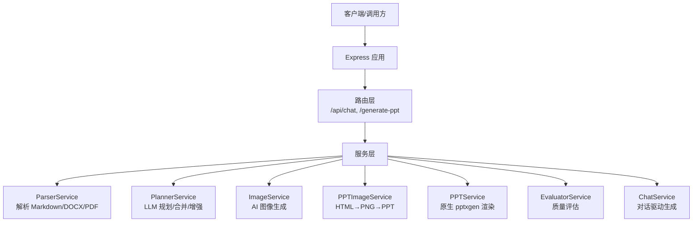
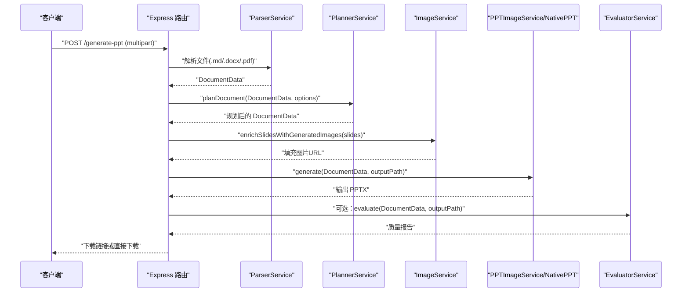
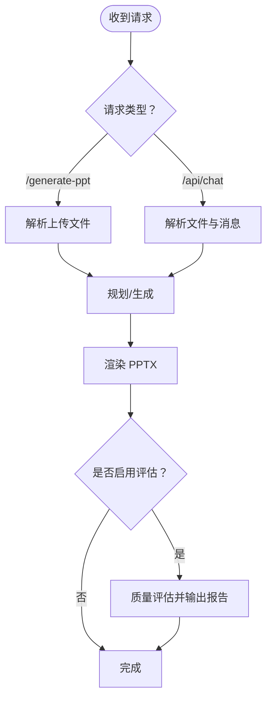
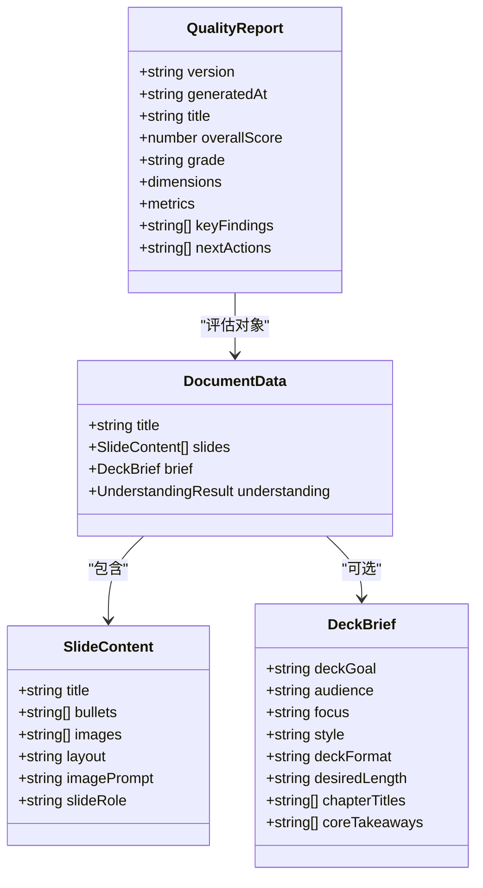
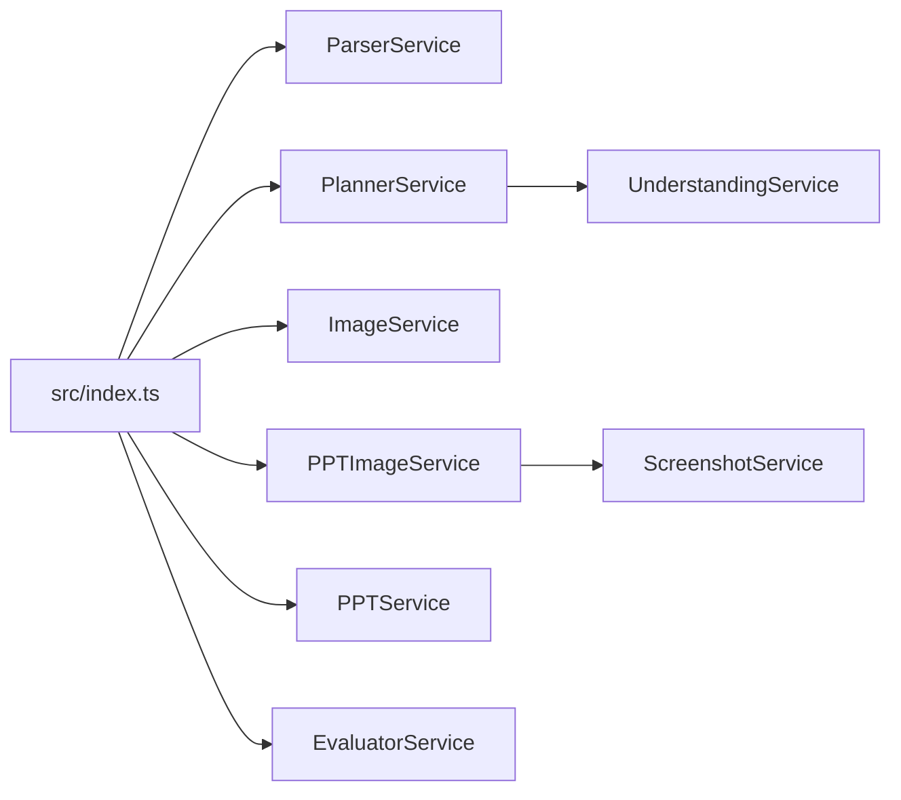

# API 架构设计

<cite>
**本文档引用的文件**
- [src/index.ts](file://src/index.ts)
- [src/types.ts](file://src/types.ts)
- [src/services/chat.service.ts](file://src/services/chat.service.ts)
- [src/services/parser.service.ts](file://src/services/parser.service.ts)
- [src/services/planner.service.ts](file://src/services/planner.service.ts)
- [src/services/image.service.ts](file://src/services/image.service.ts)
- [src/services/ppt.service.ts](file://src/services/ppt.service.ts)
- [src/services/ppt-image.service.ts](file://src/services/ppt-image.service.ts)
- [src/services/screenshot.service.ts](file://src/services/screenshot.service.ts)
- [src/services/evaluator.service.ts](file://src/services/evaluator.service.ts)
- [src/services/understanding.service.ts](file://src/services/understanding.service.ts)
- [package.json](file://package.json)
- [readme.md](file://readme.md)
- [test/test-image-backfill.ts](file://test/test-image-backfill.ts)
- [test/test_image_api.ts](file://test/test_image_api.ts)
</cite>

## 目录
1. [简介](#简介)
2. [项目结构](#项目结构)
3. [核心组件](#核心组件)
4. [架构总览](#架构总览)
5. [详细组件分析](#详细组件分析)
6. [依赖关系分析](#依赖关系分析)
7. [性能考虑](#性能考虑)
8. [故障排查指南](#故障排查指南)
9. [结论](#结论)
10. [附录](#附录)

## 简介
本文件为 Generate-PPT 的 API 架构设计文档，面向希望集成或扩展该系统的开发者与产品团队。文档覆盖 RESTful API 的设计原则、路由与端点设计、请求/响应格式、错误处理、版本控制与向后兼容策略、认证与安全机制，并提供架构图、端点设计图、使用示例与最佳实践。

## 项目结构
- 后端基于 Node.js + Express，采用模块化服务层设计，核心逻辑分布在解析、规划、图像生成、PPT 渲染与评估等服务中。
- 主入口负责路由注册、中间件配置（CORS、JSON、静态资源）、文件上传（Multer）以及会话级缓存管理。
- 服务层通过环境变量进行外部服务调用（如 LLM、图像生成），并通过可配置渲染模式（原生 pptxgen 或 HTML→PNG→PPT）输出 PPTX。

图表来源
- [src/index.ts:1-433](file://src/index.ts#L1-L433)
- [src/services/parser.service.ts:1-453](file://src/services/parser.service.ts#L1-L453)
- [src/services/planner.service.ts:1-800](file://src/services/planner.service.ts#L1-L800)
- [src/services/image.service.ts:1-218](file://src/services/image.service.ts#L1-L218)
- [src/services/ppt-image.service.ts:1-53](file://src/services/ppt-image.service.ts#L1-L53)
- [src/services/ppt.service.ts:1-800](file://src/services/ppt.service.ts#L1-L800)
- [src/services/evaluator.service.ts:1-800](file://src/services/evaluator.service.ts#L1-L800)
- [src/services/chat.service.ts:1-400](file://src/services/chat.service.ts#L1-L400)

章节来源
- [src/index.ts:1-433](file://src/index.ts#L1-L433)
- [package.json:1-45](file://package.json#L1-L45)

## 核心组件
- 路由与中间件
  - CORS、JSON 请求体解析、静态资源托管、文件上传（Multer）。
  - 会话级图片缓存（按文档标题哈希缓存，10分钟TTL）。
- 服务层
  - 解析器：支持 Markdown、DOCX、PDF，提取标题、要点、图片。
  - 规划器：结合理解服务与 LLM，生成结构化大纲与幻灯片。
  - 图像服务：基于提示词生成 AI 图像，具备缓存与降级策略。
  - PPT 渲染：两种模式——原生 pptxgen 或 HTML→PNG→PPT。
  - 评估器：对生成的 PPTX 进行多维度质量评分与报告输出。
  - 对话服务：驱动“大纲→确认→最终生成”的三阶段对话流程。

章节来源
- [src/index.ts:21-433](file://src/index.ts#L21-L433)
- [src/services/parser.service.ts:1-453](file://src/services/parser.service.ts#L1-L453)
- [src/services/planner.service.ts:1-800](file://src/services/planner.service.ts#L1-L800)
- [src/services/image.service.ts:1-218](file://src/services/image.service.ts#L1-L218)
- [src/services/ppt.service.ts:1-800](file://src/services/ppt.service.ts#L1-L800)
- [src/services/ppt-image.service.ts:1-53](file://src/services/ppt-image.service.ts#L1-L53)
- [src/services/evaluator.service.ts:1-800](file://src/services/evaluator.service.ts#L1-L800)
- [src/services/chat.service.ts:1-400](file://src/services/chat.service.ts#L1-L400)

## 架构总览
- 数据流
  - 客户端上传文档或发起对话，后端解析/规划/生成图像，最终渲染为 PPTX 并返回下载链接或直接下载。
- 错误处理
  - 统一捕获异常并返回结构化错误信息；对 LLM/图像 API 失败进行降级与提示。
- 安全与鉴权
  - 通过环境变量注入令牌；对外部 LLM/图像接口设置超时与代理策略；建议在生产环境启用反向代理与访问控制。
- 版本控制与兼容
  - 当前未实现显式的 API 版本号；通过环境变量与可选功能（如评估、图像生成）实现向后兼容。

图表来源
- [src/index.ts:314-428](file://src/index.ts#L314-L428)
- [src/services/parser.service.ts:1-453](file://src/services/parser.service.ts#L1-L453)
- [src/services/planner.service.ts:1-800](file://src/services/planner.service.ts#L1-L800)
- [src/services/image.service.ts:1-218](file://src/services/image.service.ts#L1-L218)
- [src/services/ppt-image.service.ts:1-53](file://src/services/ppt-image.service.ts#L1-L53)
- [src/services/ppt.service.ts:1-800](file://src/services/ppt.service.ts#L1-L800)
- [src/services/evaluator.service.ts:1-800](file://src/services/evaluator.service.ts#L1-L800)

## 详细组件分析

### 路由与端点设计
- POST /generate-ppt
  - Content-Type: multipart/form-data
  - 字段:
    - file (必需): .md/.docx/.pdf
    - plannerMode (可选): strict 或 creative
  - 成功响应: 直接下载 .pptx 文件
  - 失败响应: 400/500 错误码及错误信息
- POST /api/chat
  - Content-Type: multipart/form-data 或 application/json
  - 字段:
    - files (可选): 最多 5 个，支持 .md/.docx/.pdf/.png/.jpg
    - text (可选): 用户输入文本
    - messages (可选): 历史消息数组（字符串或 JSON）
  - 成功响应: { reply, downloadUrl?, outlineData? }
  - 失败响应: 500 错误码及错误信息

图表来源
- [src/index.ts:71-270](file://src/index.ts#L71-L270)
- [src/index.ts:314-428](file://src/index.ts#L314-L428)

章节来源
- [src/index.ts:71-270](file://src/index.ts#L71-L270)
- [src/index.ts:314-428](file://src/index.ts#L314-L428)
- [readme.md:104-120](file://readme.md#L104-L120)

### 请求/响应格式与数据模型
- 请求体字段
  - /generate-ppt: file, plannerMode
  - /api/chat: files[], text, messages
- 响应体字段
  - /generate-ppt: 直接下载 .pptx
  - /api/chat: reply(string), downloadUrl?(string), outlineData?(object)
- 数据模型
  - DocumentData: title, slides[], brief?, understanding?
  - SlideContent: title, bullets[], images[], layout?, imagePrompt?, slideRole?
  - PlannerOptions: mode, deckFormat, audience, focus, style, length
  - QualityReport: 总分、等级、各维度得分与证据、建议

图表来源
- [src/types.ts:66-160](file://src/types.ts#L66-L160)

章节来源
- [src/types.ts:1-160](file://src/types.ts#L1-L160)

### 错误处理机制
- 统一 try/catch 包裹，捕获解析、规划、渲染、评估过程中的异常。
- 对外部 API（LLM/图像）失败进行降级与提示，保证服务可用性。
- 文件上传与格式校验：缺失文件、不支持格式、并发限制等返回 400/422 等状态码。

章节来源
- [src/index.ts:71-270](file://src/index.ts#L71-L270)
- [src/index.ts:314-428](file://src/index.ts#L314-L428)
- [src/services/chat.service.ts:97-100](file://src/services/chat.service.ts#L97-L100)
- [src/services/image.service.ts:95-101](file://src/services/image.service.ts#L95-L101)

### 版本控制与向后兼容
- 当前未实现显式 API 版本号（如 /v1/）。
- 通过环境变量控制功能开关（如 ENABLE_EVALUATION、ENABLE_AI_IMAGES、PPT_RENDER_MODE），实现渐进式升级与向后兼容。
- 建议未来引入语义化版本与路径前缀（/v1/），并在变更时保持默认行为不变，新增参数/字段时保持可选。

章节来源
- [src/index.ts:380-416](file://src/index.ts#L380-L416)
- [readme.md:17-50](file://readme.md#L17-L50)

### 认证与安全机制
- 认证
  - 通过环境变量注入令牌（PLANNER_AUTH_TOKEN、LLM_AUTH_TOKEN、IMAGE_API_KEY），用于外部 LLM/图像服务鉴权。
- 安全
  - 默认启用 CORS，建议在生产环境限制来源。
  - 文件上传采用磁盘存储与随机命名，注意清理与大小限制。
  - 外部 API 请求设置超时与代理禁用，避免 SSRF。
- 建议
  - 在网关层启用 HTTPS、速率限制与访问控制。
  - 对敏感环境变量进行加密存储与轮换。

章节来源
- [src/services/chat.service.ts:32-38](file://src/services/chat.service.ts#L32-L38)
- [src/services/planner.service.ts:54-82](file://src/services/planner.service.ts#L54-L82)
- [src/services/image.service.ts:5-13](file://src/services/image.service.ts#L5-L13)
- [src/index.ts:24-27](file://src/index.ts#L24-L27)

### API 使用示例与最佳实践
- 示例
  - 使用 curl 上传文件并生成 PPT（参考 README）。
  - 使用 /api/chat 进行对话式生成，支持多轮与图片回填。
- 最佳实践
  - 合理设置 IMAGE_CONCURRENCY，避免并发过高导致外部服务限流。
  - 在生产环境开启质量评估（ENABLE_EVALUATION），并读取 X-PPT-* 响应头。
  - 对于长文档，优先使用 DOCX/Markdown，减少 PDF 解析复杂度。
  - 使用会话级缓存优化重复生成场景（/api/chat 的图片回填）。

章节来源
- [readme.md:104-120](file://readme.md#L104-L120)
- [test/test-image-backfill.ts:1-202](file://test/test-image-backfill.ts#L1-L202)
- [test/test_image_api.ts:1-44](file://test/test_image_api.ts#L1-L44)

## 依赖关系分析
- 组件耦合
  - 路由层仅负责编排，与服务层松耦合；服务内部通过接口清晰分离职责。
- 外部依赖
  - Express、Multer、pptxgenjs、axios、puppeteer、JSZip 等。
- 环境变量
  - 通过 process.env 控制模型、令牌、渲染模式、功能开关等。

图表来源
- [src/index.ts:45-51](file://src/index.ts#L45-L51)
- [src/services/planner.service.ts:65](file://src/services/planner.service.ts#L65)
- [src/services/ppt-image.service.ts:14-16](file://src/services/ppt-image.service.ts#L14-L16)

章节来源
- [package.json:18-43](file://package.json#L18-L43)

## 性能考虑
- 并发控制
  - 图像生成支持并发参数（IMAGE_CONCURRENCY），建议根据外部服务限流与硬件资源调整。
- 渲染模式
  - HTML→PNG→PPT 模式可获得更高分辨率，但耗时较长；原生模式更快但灵活性较低。
- 缓存策略
  - 会话级图片缓存（10分钟）提升重复生成效率；注意内存占用与清理。
- I/O 优化
  - 输出目录统一管理，避免频繁创建/删除文件；PPTX 生成后立即下载，减少长时间持有句柄。

章节来源
- [src/index.ts:53-69](file://src/index.ts#L53-L69)
- [src/services/image.service.ts:199-216](file://src/services/image.service.ts#L199-L216)
- [src/services/ppt-image.service.ts:18-51](file://src/services/ppt-image.service.ts#L18-L51)

## 故障排查指南
- 常见问题
  - 400/404：缺少文件、不支持的格式、路径错误。
  - 500：外部 LLM/图像服务不可用、解析异常、渲染失败。
- 排查步骤
  - 检查环境变量（TOKEN、BASE_URL、CONCURRENCY）。
  - 查看服务日志与超时设置。
  - 使用测试脚本验证图像生成与图片回填链路。
- 相关文件
  - /api/chat 的图片回填测试与图像生成测试脚本。

章节来源
- [src/index.ts:71-270](file://src/index.ts#L71-L270)
- [src/index.ts:314-428](file://src/index.ts#L314-L428)
- [test/test-image-backfill.ts:1-202](file://test/test-image-backfill.ts#L1-L202)
- [test/test_image_api.ts:1-44](file://test/test_image_api.ts#L1-L44)

## 结论
本 API 架构以“解析—规划—图像—渲染—评估”为主线，通过服务层解耦与环境变量控制实现了高扩展性与向后兼容。建议在未来引入 API 版本化、细粒度鉴权与可观测性指标，以满足更大规模的生产需求。

## 附录
- 端点一览
  - POST /generate-ppt：上传文档生成 PPTX
  - POST /api/chat：对话式生成（大纲→确认→最终生成）
- 关键环境变量
  - IMAGE_API_KEY、PLANNER_AUTH_TOKEN、PLANNER_MODEL、PPT_RENDER_MODE、ENABLE_EVALUATION、IMAGE_CONCURRENCY 等

章节来源
- [readme.md:17-50](file://readme.md#L17-L50)
- [src/index.ts:380-416](file://src/index.ts#L380-L416)