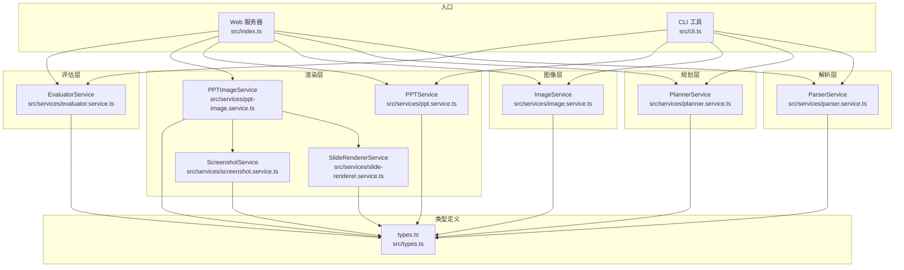
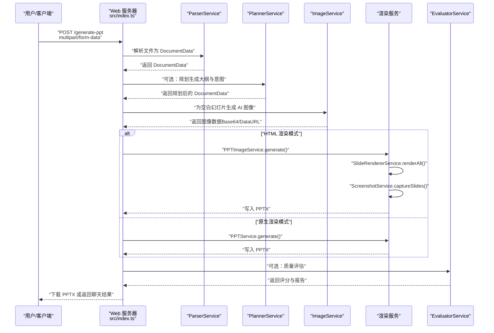
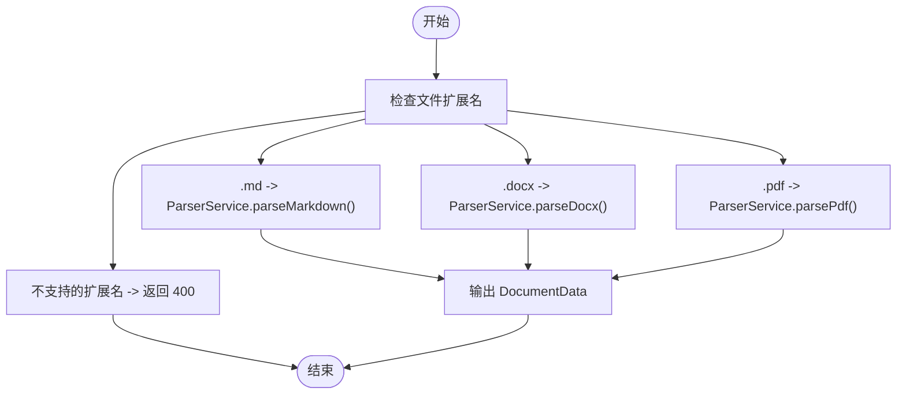
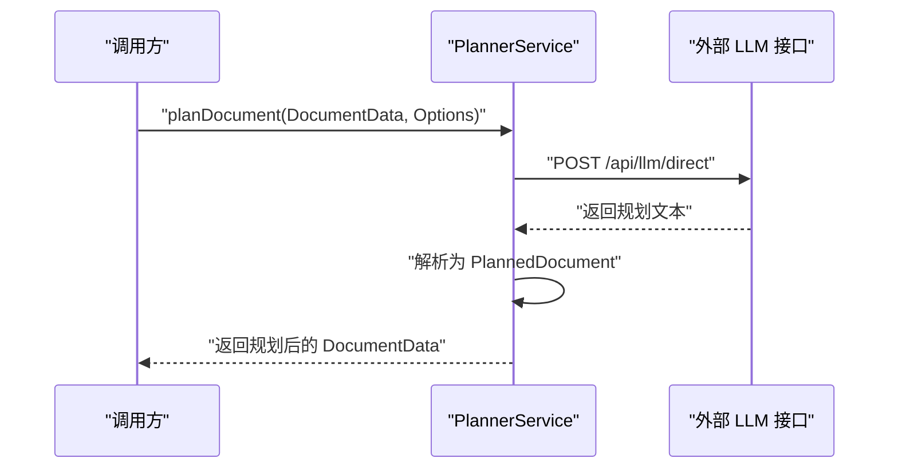
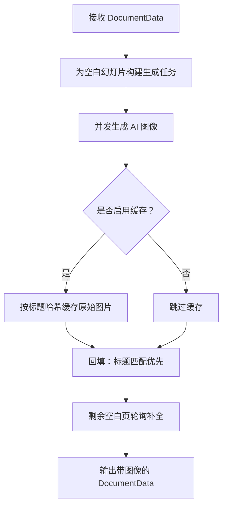
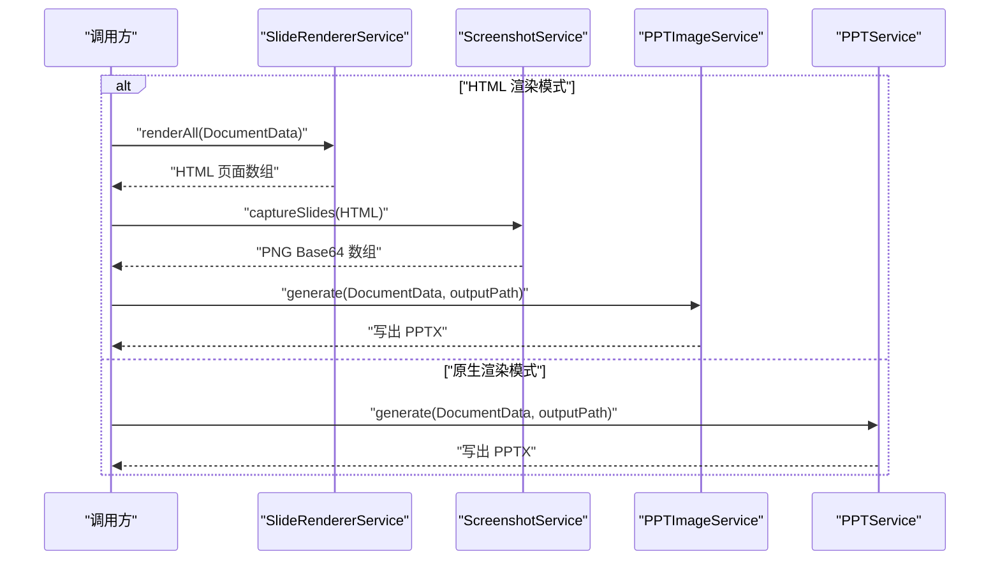
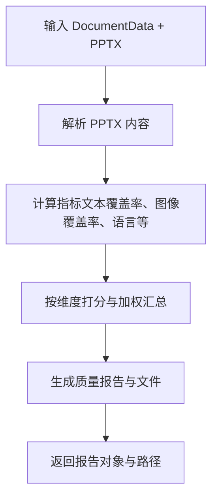
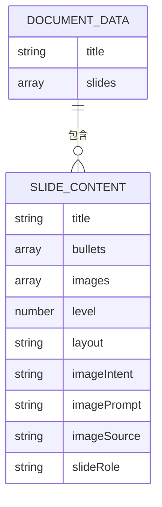
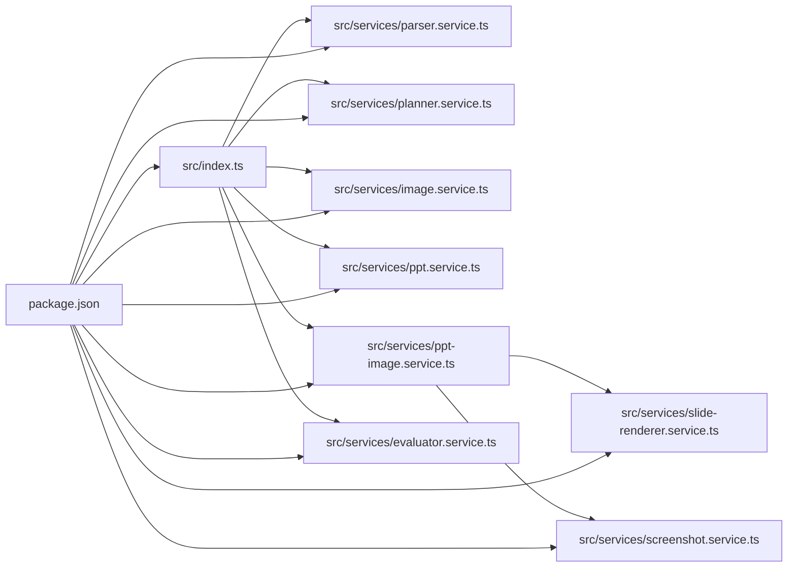

# 数据流设计

<cite>
**本文引用的文件**
- [readme.md](file://readme.md)
- [src/index.ts](file://src/index.ts)
- [src/types.ts](file://src/types.ts)
- [src/cli.ts](file://src/cli.ts)
- [src/services/parser.service.ts](file://src/services/parser.service.ts)
- [src/services/planner.service.ts](file://src/services/planner.service.ts)
- [src/services/image.service.ts](file://src/services/image.service.ts)
- [src/services/ppt.service.ts](file://src/services/ppt.service.ts)
- [src/services/ppt-image.service.ts](file://src/services/ppt-image.service.ts)
- [src/services/slide-renderer.service.ts](file://src/services/slide-renderer.service.ts)
- [src/services/screenshot.service.ts](file://src/services/screenshot.service.ts)
- [src/services/evaluator.service.ts](file://src/services/evaluator.service.ts)
- [package.json](file://package.json)
</cite>

## 目录
1. [引言](#引言)
2. [项目结构](#项目结构)
3. [核心组件](#核心组件)
4. [架构总览](#架构总览)
5. [详细组件分析](#详细组件分析)
6. [依赖关系分析](#依赖关系分析)
7. [性能考量](#性能考量)
8. [故障排查指南](#故障排查指南)
9. [结论](#结论)
10. [附录](#附录)

## 引言
本文件面向 Generate-PPT 项目的“数据流设计”，系统性阐述从文件上传到最终 PPT 生成的完整数据路径与处理流程。重点包括：
- 数据在各阶段的流转、转换与格式变化
- 缓存策略与临时存储机制
- 数据验证与错误处理机制
- 关键流程图与时序图

该设计既服务于开发者理解系统内部工作原理，也便于非技术读者把握端到端的数据处理过程。

## 项目结构
项目采用基于功能模块的分层组织方式，核心入口位于应用服务器与命令行工具，业务逻辑分布在解析、规划、图像生成、PPT 渲染、质量评估等服务模块中；类型定义集中于 types 文件，便于跨模块共享。

图表来源
- [src/index.ts:1-433](file://src/index.ts#L1-L433)
- [src/cli.ts:1-176](file://src/cli.ts#L1-L176)
- [src/services/parser.service.ts:1-453](file://src/services/parser.service.ts#L1-L453)
- [src/services/planner.service.ts:1-1623](file://src/services/planner.service.ts#L1-L1623)
- [src/services/image.service.ts:1-156](file://src/services/image.service.ts#L1-L156)
- [src/services/ppt.service.ts:52-85](file://src/services/ppt.service.ts#L52-L85)
- [src/services/ppt-image.service.ts:14-52](file://src/services/ppt-image.service.ts#L14-L52)
- [src/services/slide-renderer.service.ts:14-46](file://src/services/slide-renderer.service.ts#L14-L46)
- [src/services/screenshot.service.ts:15-52](file://src/services/screenshot.service.ts#L15-L52)
- [src/services/evaluator.service.ts:32-93](file://src/services/evaluator.service.ts#L32-L93)
- [src/types.ts:1-160](file://src/types.ts#L1-L160)

章节来源
- [src/index.ts:1-433](file://src/index.ts#L1-L433)
- [src/cli.ts:1-176](file://src/cli.ts#L1-L176)
- [src/types.ts:1-160](file://src/types.ts#L1-L160)

## 核心组件
- 应用入口与路由
  - Web 服务器提供两类接口：文件上传生成 PPT 的标准流程，以及对话式生成 PPT 的聊天接口。
  - CLI 提供离线批量生成能力，参数化控制规划模式与展示风格。
- 解析器 ParserService
  - 支持 Markdown、DOCX、PDF 三类输入，统一输出结构化文档数据（标题、层级、要点、图片等）。
- 规划器 PlannerService
  - 可选启用，调用外部 LLM 接口生成规划后的幻灯片大纲与意图信息。
- 图像服务 ImageService
  - 为空白幻灯片生成 AI 图像，支持缓存与降级策略。
- 渲染服务
  - PPTService：原生 pptxgenjs 渲染，支持模板样式、纯图模式等配置。
  - PPTImageService + SlideRendererService + ScreenshotService：HTML 渲染为高清 PNG 后写入 PPT。
- 质量评估 EvaluatorService
  - 对生成的 PPT 进行多维度打分与报告输出。

章节来源
- [src/index.ts:314-428](file://src/index.ts#L314-L428)
- [src/cli.ts:65-176](file://src/cli.ts#L65-L176)
- [src/services/parser.service.ts:11-167](file://src/services/parser.service.ts#L11-L167)
- [src/services/planner.service.ts:53-162](file://src/services/planner.service.ts#L53-L162)
- [src/services/image.service.ts:4-156](file://src/services/image.service.ts#L4-L156)
- [src/services/ppt.service.ts:52-85](file://src/services/ppt.service.ts#L52-L85)
- [src/services/ppt-image.service.ts:14-52](file://src/services/ppt-image.service.ts#L14-L52)
- [src/services/slide-renderer.service.ts:14-46](file://src/services/slide-renderer.service.ts#L14-L46)
- [src/services/screenshot.service.ts:15-52](file://src/services/screenshot.service.ts#L15-L52)
- [src/services/evaluator.service.ts:32-93](file://src/services/evaluator.service.ts#L32-L93)

## 架构总览
下图展示了两种渲染路径：原生渲染与 HTML→PNG→PPT 渲染，并标注了关键数据结构与服务交互。

图表来源
- [src/index.ts:314-428](file://src/index.ts#L314-L428)
- [src/services/parser.service.ts:11-167](file://src/services/parser.service.ts#L11-L167)
- [src/services/planner.service.ts:116-162](file://src/services/planner.service.ts#L116-L162)
- [src/services/image.service.ts:15-28](file://src/services/image.service.ts#L15-L28)
- [src/services/ppt-image.service.ts:18-51](file://src/services/ppt-image.service.ts#L18-L51)
- [src/services/slide-renderer.service.ts:14-46](file://src/services/slide-renderer.service.ts#L14-L46)
- [src/services/screenshot.service.ts:15-52](file://src/services/screenshot.service.ts#L15-L52)
- [src/services/ppt.service.ts:52-75](file://src/services/ppt.service.ts#L52-L75)
- [src/services/evaluator.service.ts:32-93](file://src/services/evaluator.service.ts#L32-L93)

## 详细组件分析

### 组件一：文件上传与解析（Web 与 CLI 共用）
- 输入：multipart/form-data（单文件）或命令行参数（单文件）
- 处理：
  - 根据扩展名选择解析器：Markdown、DOCX、PDF
  - 统一输出 DocumentData（标题、幻灯片列表、可选简报与理解结果）
- 输出：DocumentData
- 关键点：
  - 扩展名校验与错误响应
  - 解析失败时记录日志并继续流程（不影响后续步骤）

图表来源
- [src/index.ts:314-350](file://src/index.ts#L314-L350)
- [src/cli.ts:65-92](file://src/cli.ts#L65-L92)
- [src/services/parser.service.ts:12-167](file://src/services/parser.service.ts#L12-L167)

章节来源
- [src/index.ts:314-350](file://src/index.ts#L314-L350)
- [src/cli.ts:65-92](file://src/cli.ts#L65-L92)
- [src/services/parser.service.ts:12-167](file://src/services/parser.service.ts#L12-L167)

### 组件二：规划阶段（可选）
- 输入：DocumentData + 规划选项（模式、受众、焦点、风格、长度等）
- 处理：
  - 通过外部 LLM 接口生成规划文本
  - 解析为结构化 PlannedDocument
  - 转换为 DocumentData（补充布局、意图、角色等）
- 输出：DocumentData（含规划信息）
- 关键点：
  - 支持严格/创意两种模式
  - 支持稀疏内容扩展（仅在启用时生效）
  - 支持代理模式与访客登录降级

图表来源
- [src/services/planner.service.ts:116-162](file://src/services/planner.service.ts#L116-L162)
- [src/services/planner.service.ts:164-190](file://src/services/planner.service.ts#L164-L190)
- [src/services/planner.service.ts:1555-1585](file://src/services/planner.service.ts#L1555-L1585)

章节来源
- [src/services/planner.service.ts:53-162](file://src/services/planner.service.ts#L53-L162)
- [src/services/planner.service.ts:164-190](file://src/services/planner.service.ts#L164-L190)
- [src/services/planner.service.ts:1555-1585](file://src/services/planner.service.ts#L1555-L1585)

### 组件三：图像生成与回填（会话级缓存）
- 输入：DocumentData（可能已包含原始图片）
- 处理：
  - 为空白幻灯片生成 AI 图像（支持并发）
  - 会话级缓存：按文档标题哈希缓存原始图片，10 分钟 TTL 自动清理
  - 回填策略：
    1) 标题精确匹配回填
    2) 未匹配空白页按顺序轮询补全
- 输出：DocumentData（部分幻灯片填充图像）
- 关键点：
  - 缓存键来自文档标题（小写）
  - 回填后继续渲染

图表来源
- [src/index.ts:53-69](file://src/index.ts#L53-L69)
- [src/index.ts:94-167](file://src/index.ts#L94-L167)
- [src/index.ts:169-185](file://src/index.ts#L169-L185)
- [src/index.ts:194-227](file://src/index.ts#L194-L227)
- [src/services/image.service.ts:15-28](file://src/services/image.service.ts#L15-L28)

章节来源
- [src/index.ts:53-69](file://src/index.ts#L53-L69)
- [src/index.ts:94-167](file://src/index.ts#L94-L167)
- [src/index.ts:169-185](file://src/index.ts#L169-L185)
- [src/index.ts:194-227](file://src/index.ts#L194-L227)
- [src/services/image.service.ts:4-156](file://src/services/image.service.ts#L4-L156)

### 组件四：渲染路径（两种模式）
- 原生渲染（pptxgenjs）
  - 加载渲染配置（模板样式、纯图模式、保留文字、每页最大要点数等）
  - 分页与角色化添加幻灯片
  - 写出 PPTX
- HTML→PNG→PPT 渲染
  - SlideRendererService 将每个幻灯片渲染为 HTML 页面
  - ScreenshotService 使用 Puppeteer 截图（1920×1080，2x 输出）
  - PPTImageService 将截图作为全屏背景写入 PPTX

图表来源
- [src/services/ppt-image.service.ts:18-51](file://src/services/ppt-image.service.ts#L18-L51)
- [src/services/slide-renderer.service.ts:14-46](file://src/services/slide-renderer.service.ts#L14-L46)
- [src/services/screenshot.service.ts:15-52](file://src/services/screenshot.service.ts#L15-L52)
- [src/services/ppt.service.ts:52-75](file://src/services/ppt.service.ts#L52-L75)

章节来源
- [src/services/ppt-image.service.ts:14-52](file://src/services/ppt-image.service.ts#L14-L52)
- [src/services/slide-renderer.service.ts:14-46](file://src/services/slide-renderer.service.ts#L14-L46)
- [src/services/screenshot.service.ts:15-52](file://src/services/screenshot.service.ts#L15-L52)
- [src/services/ppt.service.ts:52-85](file://src/services/ppt.service.ts#L52-L85)

### 组件五：质量评估与报告
- 输入：DocumentData 与生成的 PPTX
- 处理：
  - 解析渲染后的 PPTX，统计文本、图像、语言等指标
  - 计算多维度得分与总体等级
  - 生成 JSON 与 Markdown 报告
- 输出：质量报告对象与文件路径

图表来源
- [src/services/evaluator.service.ts:32-93](file://src/services/evaluator.service.ts#L32-L93)
- [src/services/evaluator.service.ts:95-108](file://src/services/evaluator.service.ts#L95-L108)

章节来源
- [src/services/evaluator.service.ts:32-93](file://src/services/evaluator.service.ts#L32-L93)
- [src/services/evaluator.service.ts:95-108](file://src/services/evaluator.service.ts#L95-L108)

### 组件六：数据模型与类型
- DocumentData：标题、幻灯片数组、简报、理解结果
- SlideContent：标题、要点、图像（Base64/DataURL）、层级、布局、意图、角色等
- PlannerOptions：规划模式与展示偏好
- QualityReport：质量维度、指标、建议与等级

图表来源
- [src/types.ts:66-71](file://src/types.ts#L66-L71)
- [src/types.ts:48-64](file://src/types.ts#L48-L64)

章节来源
- [src/types.ts:1-160](file://src/types.ts#L1-L160)

## 依赖关系分析
- 运行时依赖
  - Web 服务器：Express、CORS、Multer（文件上传）
  - 文档解析：mammoth（DOCX）、pdf-parse（PDF）、marked（Markdown）
  - PPT 渲染：pptxgenjs
  - 图像生成：Axios（HTTP 客户端）
  - HTML 截图：Puppeteer
  - 质量评估：JSZip（读取 PPTX 内容）
- 环境变量驱动行为
  - 渲染模式、AI 图像开关与并发度、模板样式、纯图模式、每页最大要点数、质量评估开关等

图表来源
- [package.json:18-31](file://package.json#L18-L31)
- [src/index.ts:45-51](file://src/index.ts#L45-L51)

章节来源
- [package.json:18-31](file://package.json#L18-L31)
- [src/index.ts:45-51](file://src/index.ts#L45-L51)

## 性能考量
- 并发控制
  - 图像生成支持并发度配置，默认 2，避免过度占用外部 API。
- 渲染模式选择
  - HTML→PNG→PPT 渲染可获得更高分辨率与更丰富的视觉效果，但 CPU/内存开销更大。
- 缓存策略
  - 图像生成缓存：命中即返回，减少重复请求。
  - 会话级图片缓存：10 分钟 TTL，降低重复生成成本。
- I/O 优化
  - 临时文件与输出目录统一管理，避免磁盘碎片与路径错误。

## 故障排查指南
- 常见错误与处理
  - 文件未上传或格式不支持：返回 400，检查扩展名与上传字段。
  - 规划器外部接口失败：降级为本地规划或跳过规划，继续执行。
  - 图像生成失败：启用降级策略（占位图或备用链接），并记录错误日志。
  - PPTX 下载失败：检查输出目录权限与网络状态。
  - 质量评估失败：忽略评估或记录警告，不影响 PPT 下载。
- 日志与可观测性
  - 关键节点均输出日志，便于定位问题。
  - 质量评估阶段对异常进行捕获与降级处理。

章节来源
- [src/index.ts:314-350](file://src/index.ts#L314-L350)
- [src/index.ts:424-428](file://src/index.ts#L424-L428)
- [src/services/planner.service.ts:140-143](file://src/services/planner.service.ts#L140-L143)
- [src/services/image.service.ts:95-101](file://src/services/image.service.ts#L95-L101)
- [src/services/evaluator.service.ts:158-162](file://src/services/evaluator.service.ts#L158-L162)

## 结论
本数据流设计清晰地刻画了从文件上传到 PPT 生成的完整路径，涵盖解析、规划、图像生成、渲染与评估等关键环节。通过会话级缓存与并发控制，系统在保证质量的同时兼顾性能与稳定性。建议在生产环境中结合监控与日志，持续优化渲染与评估策略。

## 附录
- 环境变量与运行方式参考项目自述文件
- CLI 与 Web API 的参数与行为详见入口文件注释与实现

章节来源
- [readme.md:17-131](file://readme.md#L17-L131)
- [src/index.ts:104-120](file://src/index.ts#L104-L120)
- [src/index.ts:104-120](file://src/index.ts#L104-L120)