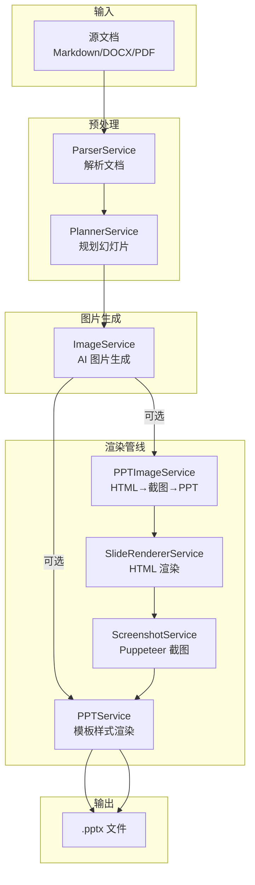
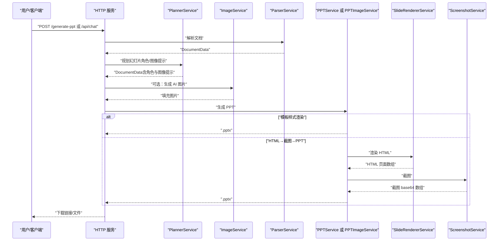
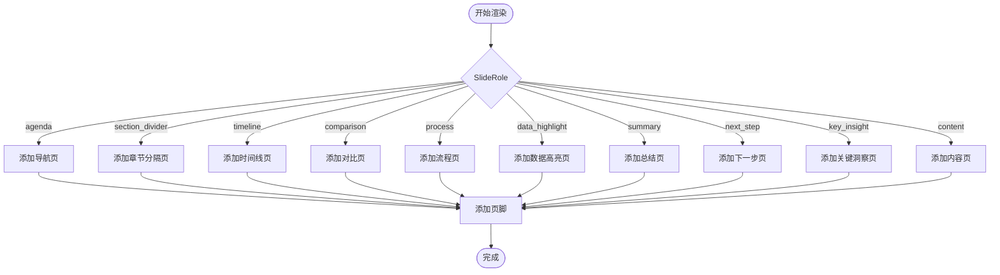
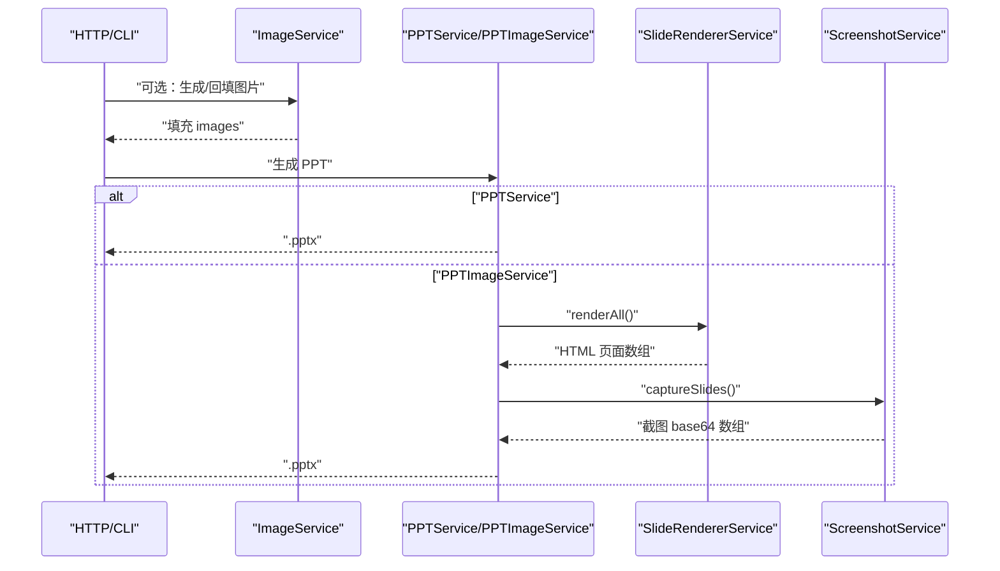
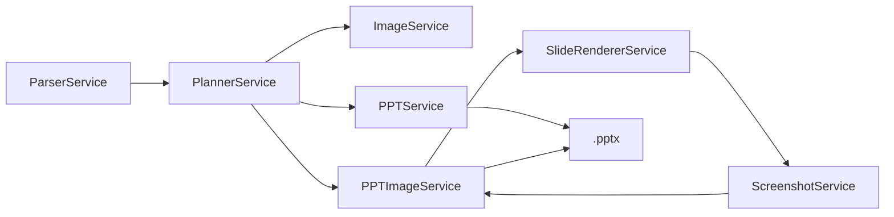

# PPT 生成服务

<cite>
**本文引用的文件列表**
- [src/services/ppt.service.ts](file://src/services/ppt.service.ts)
- [src/services/ppt-image.service.ts](file://src/services/ppt-image.service.ts)
- [src/services/slide-renderer.service.ts](file://src/services/slide-renderer.service.ts)
- [src/services/screenshot.service.ts](file://src/services/screenshot.service.ts)
- [src/services/image.service.ts](file://src/services/image.service.ts)
- [src/services/parser.service.ts](file://src/services/parser.service.ts)
- [src/services/planner.service.ts](file://src/services/planner.service.ts)
- [src/index.ts](file://src/index.ts)
- [src/cli.ts](file://src/cli.ts)
- [src/types.ts](file://src/types.ts)
- [package.json](file://package.json)
- [readme.md](file://readme.md)
</cite>

## 目录
1. [简介](#简介)
2. [项目结构](#项目结构)
3. [核心组件](#核心组件)
4. [架构总览](#架构总览)
5. [详细组件分析](#详细组件分析)
6. [依赖关系分析](#依赖关系分析)
7. [性能考量](#性能考量)
8. [故障排查指南](#故障排查指南)
9. [结论](#结论)
10. [附录](#附录)

## 简介
本文件面向 Generate-PPT 的 PPT 生成服务，系统性阐述模板渲染与图片渲染两条管线的工作原理、模板配置、布局适配与质量控制策略，并给出与图片生成服务的集成方式与数据传递格式。文档同时提供不同幻灯片角色的处理流程、性能优化建议与错误处理最佳实践，帮助开发者快速理解与扩展服务。

## 项目结构
- 服务层：解析、规划、PPT 渲染、图片渲染、截图、图片生成等服务模块
- 控制器层：HTTP 接口与命令行入口
- 类型定义：统一的数据模型与枚举类型
- 运行环境：通过 .env 配置渲染模式、并发度、评估开关等

图表来源
- [src/services/parser.service.ts:11-167](file://src/services/parser.service.ts#L11-L167)
- [src/services/planner.service.ts:84-101](file://src/services/planner.service.ts#L84-L101)
- [src/services/image.service.ts:15-28](file://src/services/image.service.ts#L15-L28)
- [src/services/ppt.service.ts:52-75](file://src/services/ppt.service.ts#L52-L75)
- [src/services/ppt-image.service.ts:18-51](file://src/services/ppt-image.service.ts#L18-L51)
- [src/services/slide-renderer.service.ts:14-45](file://src/services/slide-renderer.service.ts#L14-L45)
- [src/services/screenshot.service.ts:15-51](file://src/services/screenshot.service.ts#L15-L51)

章节来源
- [src/index.ts:314-428](file://src/index.ts#L314-L428)
- [src/cli.ts:65-170](file://src/cli.ts#L65-L170)

## 核心组件
- PPTService：基于 pptxgenjs 的模板样式渲染，支持多角色幻灯片、分页与页脚
- PPTImageService：基于 HTML 渲染与 Puppeteer 截图的高清图片渲染管线
- SlideRendererService：将每页幻灯片渲染为独立 HTML 页面
- ScreenshotService：使用 Puppeteer 在高分辨率下截图并转为 base64
- ImageService：调用外部图片 API 生成或回退图片，支持缓存与并发
- ParserService：从 Markdown/DOCX/PDF 提取标题、要点与图片
- PlannerService：基于 LLM 的规划与角色推断，生成带角色与图像提示的幻灯片
- 类型系统：SlideRole、DeckBrief、DocumentData 等统一数据结构

章节来源
- [src/services/ppt.service.ts:52-75](file://src/services/ppt.service.ts#L52-L75)
- [src/services/ppt-image.service.ts:14-51](file://src/services/ppt-image.service.ts#L14-L51)
- [src/services/slide-renderer.service.ts:7-46](file://src/services/slide-renderer.service.ts#L7-L46)
- [src/services/screenshot.service.ts:9-51](file://src/services/screenshot.service.ts#L9-L51)
- [src/services/image.service.ts:4-28](file://src/services/image.service.ts#L4-L28)
- [src/services/parser.service.ts:11-167](file://src/services/parser.service.ts#L11-L167)
- [src/services/planner.service.ts:53-101](file://src/services/planner.service.ts#L53-L101)
- [src/types.ts:9-71](file://src/types.ts#L9-L71)

## 架构总览
系统提供两条渲染路径：
- 模板样式渲染（PPTService）：直接使用 pptxgenjs 绘制形状、文本与图片，适合快速生成与可控排版
- HTML→截图→PPT 渲染（PPTImageService）：先将每页幻灯片渲染为 HTML，再以高分辨率截图，最后将截图作为全屏背景写入 PPT，适合追求视觉一致性的场景

图表来源
- [src/index.ts:314-428](file://src/index.ts#L314-L428)
- [src/services/planner.service.ts:84-101](file://src/services/planner.service.ts#L84-L101)
- [src/services/image.service.ts:15-28](file://src/services/image.service.ts#L15-L28)
- [src/services/ppt.service.ts:52-75](file://src/services/ppt.service.ts#L52-L75)
- [src/services/ppt-image.service.ts:18-51](file://src/services/ppt-image.service.ts#L18-L51)
- [src/services/slide-renderer.service.ts:14-45](file://src/services/slide-renderer.service.ts#L14-L45)
- [src/services/screenshot.service.ts:15-51](file://src/services/screenshot.service.ts#L15-L51)

## 详细组件分析

### 模板系统与渲染逻辑
- 角色驱动的幻灯片渲染：PPTService 根据 SlideRole 调用对应渲染函数，如 agenda、section_divider、timeline、comparison、process、data_highlight、summary、next_step、key_insight、content 等
- 分页与页脚：对长列表进行分页，添加页码与角色标签
- 模板样式配置：通过环境变量控制是否启用模板样式、仅图片模式、保留文本、最大条目数、显示参考来源等
- 布局适配：根据角色选择不同的背景、卡片、网格、连线与字体大小策略；支持中英文语言检测与本地化文案

图表来源
- [src/services/ppt.service.ts:231-277](file://src/services/ppt.service.ts#L231-L277)

章节来源
- [src/services/ppt.service.ts:77-85](file://src/services/ppt.service.ts#L77-L85)
- [src/services/ppt.service.ts:231-277](file://src/services/ppt.service.ts#L231-L277)

### PPT 服务与 PPT 图片服务协作机制
- 协同流程：在生成前可选择是否注入 AI 图片；若启用 HTML 渲染模式，则由 PPTImageService 负责 HTML 渲染与截图，否则由 PPTService 直接绘制
- 数据传递：DocumentData 含有 title、slides、brief、understanding；每页 SlideContent 包含 title、bullets、images、slideRole、imagePrompt 等字段
- 输出：最终生成 .pptx 文件，可通过 HTTP 下载或 CLI 输出

图表来源
- [src/index.ts:236-255](file://src/index.ts#L236-L255)
- [src/services/ppt-image.service.ts:18-51](file://src/services/ppt-image.service.ts#L18-L51)
- [src/services/slide-renderer.service.ts:14-45](file://src/services/slide-renderer.service.ts#L14-L45)
- [src/services/screenshot.service.ts:15-51](file://src/services/screenshot.service.ts#L15-L51)

章节来源
- [src/index.ts:236-255](file://src/index.ts#L236-L255)
- [src/services/ppt-image.service.ts:18-51](file://src/services/ppt-image.service.ts#L18-L51)

### 模板配置、布局适配与质量控制
- 模板配置：通过环境变量控制渲染风格、文本保留、最大条目数、来源引用显示等
- 布局适配：不同角色采用不同布局（网格、卡片、连线、标题区占比等），并根据内容长度动态调整字号与间距
- 质量控制：通过质量评估维度（逻辑、布局、图像语义、内容丰富度、受众契合、一致性、来源理解）生成评分报告

章节来源
- [src/services/ppt.service.ts:77-85](file://src/services/ppt.service.ts#L77-L85)
- [readme.md:68-83](file://readme.md#L68-L83)

### 不同幻灯片角色的处理方式
- agenda：导航页，两列卡片展示章节标题
- section_divider：章节分隔页，支持背景图与面包屑
- timeline：时间线页，水平轨道+事件卡片
- comparison：对比页，左右两栏要点
- process：流程页，步骤序列+箭头连接
- data_highlight：数据高亮页，强调关键数据
- summary：总结页，勾选式要点
- next_step：下一步页，行动建议
- key_insight：关键洞察页（演示文稿模式下短要点）
- content：默认内容页，图文布局

章节来源
- [src/services/ppt.service.ts:279-795](file://src/services/ppt.service.ts#L279-L795)

### 与图片生成服务的集成方式与数据传递格式
- 数据格式：SlideContent 的 images 字段承载图片数据（URL 或 data URL），imagePrompt 用于指导 AI 图片生成
- 集成方式：ImageService 支持主 API 与回退策略，生成后写入 slides；PPTImageService 在 HTML 渲染前注入图片
- 并发控制：通过环境变量设置并发度，避免资源争用

章节来源
- [src/services/image.service.ts:15-28](file://src/services/image.service.ts#L15-L28)
- [src/services/ppt-image.service.ts:18-25](file://src/services/ppt-image.service.ts#L18-L25)

### 具体代码示例（路径引用）
- 生成模板样式 PPT 的入口：[src/services/ppt.service.ts:52-75](file://src/services/ppt.service.ts#L52-L75)
- 生成 HTML→截图→PPT 的入口：[src/services/ppt-image.service.ts:18-51](file://src/services/ppt-image.service.ts#L18-L51)
- 渲染单页 HTML 的实现：[src/services/slide-renderer.service.ts:14-45](file://src/services/slide-renderer.service.ts#L14-L45)
- 截图实现（Puppeteer）：[src/services/screenshot.service.ts:15-51](file://src/services/screenshot.service.ts#L15-L51)
- 图片生成与回退策略：[src/services/image.service.ts:30-57](file://src/services/image.service.ts#L30-L57)
- 解析 Markdown/DOCX/PDF：[src/services/parser.service.ts:12-167](file://src/services/parser.service.ts#L12-L167)
- 角色规划与图像提示：[src/services/planner.service.ts:340-394](file://src/services/planner.service.ts#L340-L394)

## 依赖关系分析
- 外部依赖：pptxgenjs（PPT 渲染）、puppeteer（截图）、axios（图片 API）、mammoth/pdf-parse（文档解析）
- 内部依赖：各服务模块间通过 DocumentData 与 SlideContent 串联，PlannerService 产出角色与图像提示，ImageService 注入图片，PPTService/PPTImageService 输出 PPT

图表来源
- [src/services/parser.service.ts:11-167](file://src/services/parser.service.ts#L11-L167)
- [src/services/planner.service.ts:84-101](file://src/services/planner.service.ts#L84-L101)
- [src/services/image.service.ts:15-28](file://src/services/image.service.ts#L15-L28)
- [src/services/ppt.service.ts:52-75](file://src/services/ppt.service.ts#L52-L75)
- [src/services/ppt-image.service.ts:18-51](file://src/services/ppt-image.service.ts#L18-L51)
- [src/services/slide-renderer.service.ts:14-45](file://src/services/slide-renderer.service.ts#L14-L45)
- [src/services/screenshot.service.ts:15-51](file://src/services/screenshot.service.ts#L15-L51)

章节来源
- [package.json:18-31](file://package.json#L18-L31)

## 性能考量
- 渲染模式选择：模板样式渲染更快，HTML→截图→PPT 更耗时但视觉一致性强
- 并发控制：图片生成与截图均支持并发，合理设置并发度可提升吞吐
- 缓存策略：图片生成服务内置缓存，避免重复请求
- 资源管理：Puppeteer 浏览器实例复用，避免频繁启动/关闭
- 输出优化：按需生成图片，避免不必要的图像覆盖

[本节为通用建议，无需特定文件引用]

## 故障排查指南
- 环境变量缺失：检查 IMAGE_API_KEY、PLANNER_AUTH_TOKEN、端口等配置
- PDF 解析失败：确认 Node 版本满足 pdf-parse 要求
- 图片生成失败：查看主 API 与回退策略日志，确认网络与代理设置
- 截图异常：检查 Puppeteer 启动参数与无头模式兼容性
- PPT 生成异常：核对模板样式配置与角色映射

章节来源
- [readme.md:17-61](file://readme.md#L17-L61)
- [src/services/screenshot.service.ts:54-68](file://src/services/screenshot.service.ts#L54-L68)
- [src/services/image.service.ts:95-101](file://src/services/image.service.ts#L95-L101)

## 结论
本服务通过“解析—规划—图片—渲染”的流水线，提供了灵活的 PPT 生成能力。模板样式渲染与 HTML→截图→PPT 两种路径满足不同质量与性能需求；角色驱动的模板系统确保内容结构清晰、视觉统一；质量评估体系有助于持续改进生成效果。结合合理的并发与缓存策略，可在保证质量的同时提升吞吐与稳定性。

[本节为总结，无需特定文件引用]

## 附录
- 环境变量与运行方式详见 [readme.md:17-131](file://readme.md#L17-L131)
- CLI 使用示例：[src/cli.ts:65-170](file://src/cli.ts#L65-L170)
- HTTP 接口示例：[src/index.ts:314-428](file://src/index.ts#L314-L428)