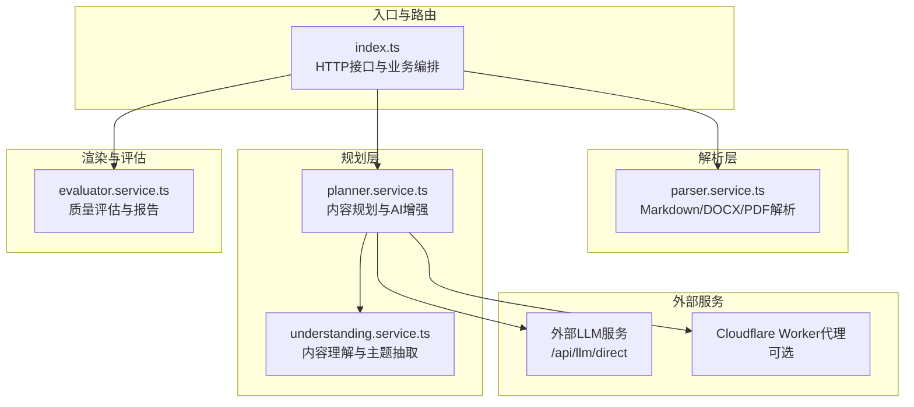
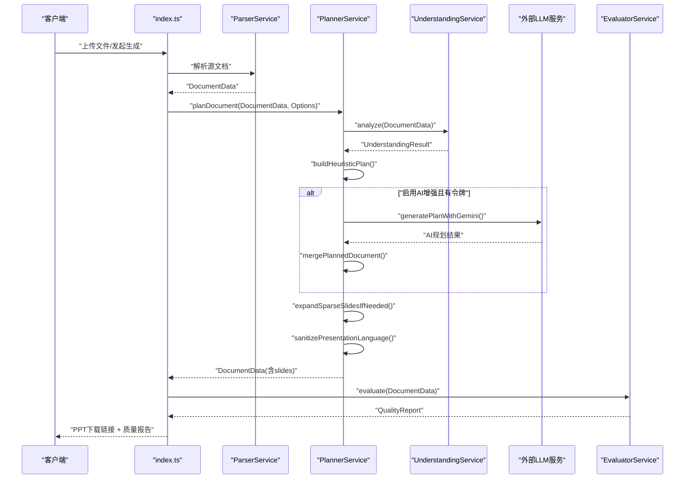
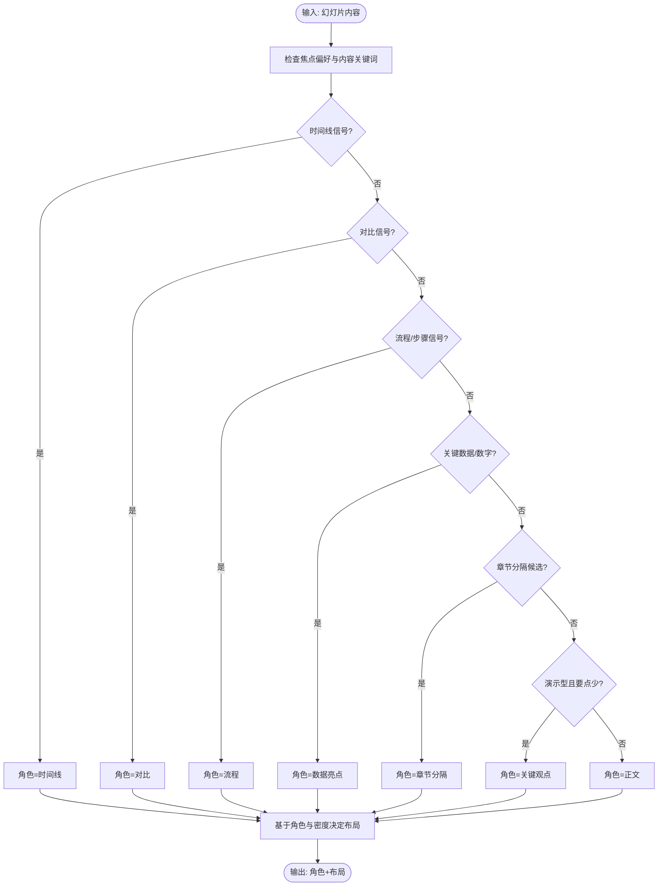
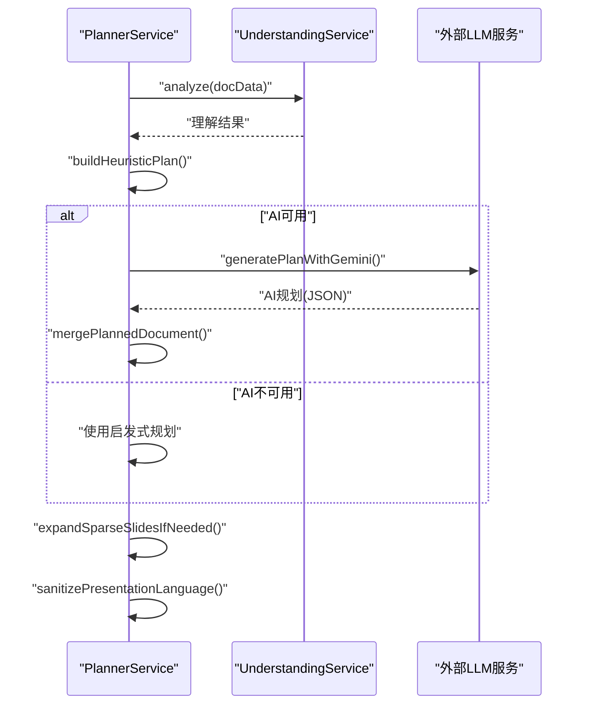
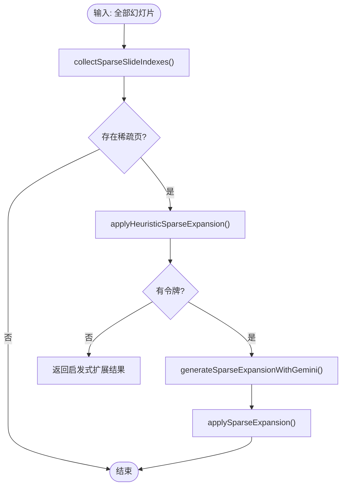
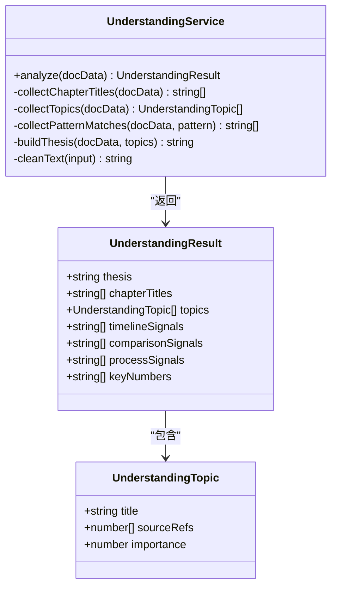
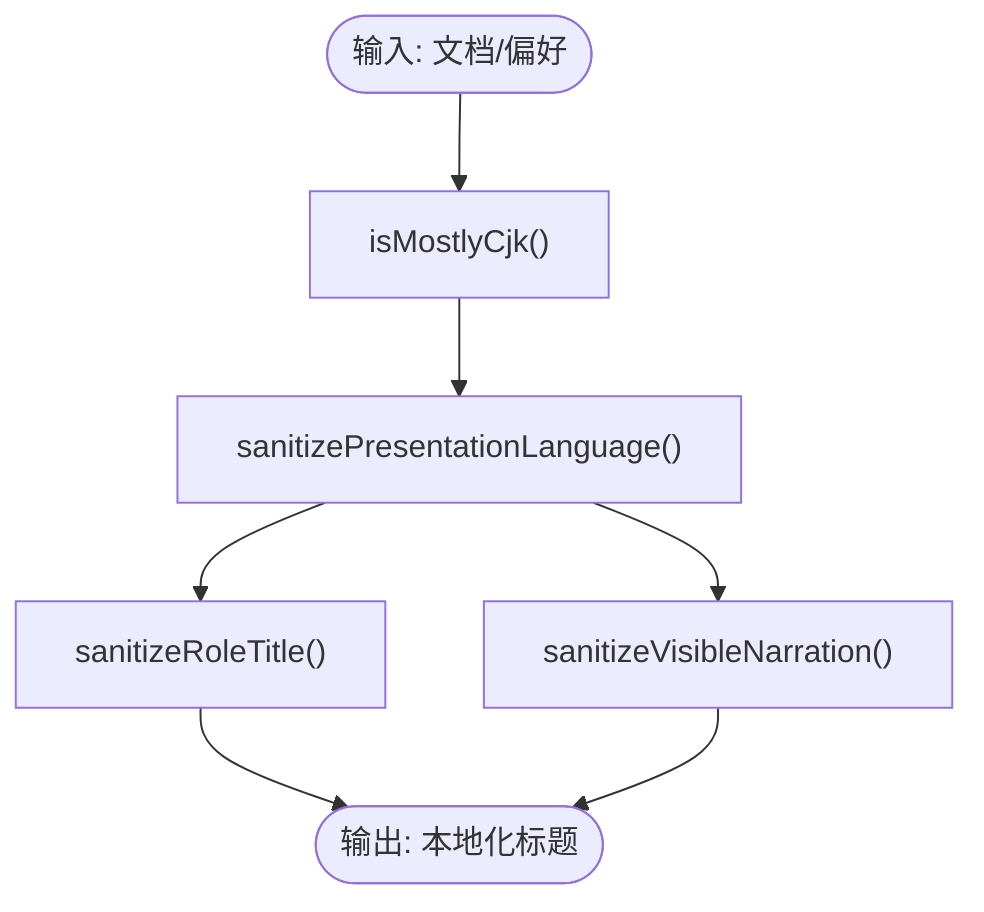
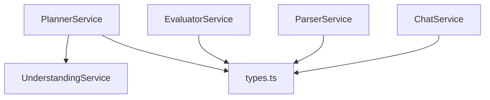

# 内容规划服务

<cite>
**本文引用的文件**
- [planner.service.ts](file://src/services/planner.service.ts)
- [understanding.service.ts](file://src/services/understanding.service.ts)
- [types.ts](file://src/types.ts)
- [index.ts](file://src/index.ts)
- [readme.md](file://readme.md)
- [package.json](file://package.json)
- [evaluator.service.ts](file://src/services/evaluator.service.ts)
- [parser.service.ts](file://src/services/parser.service.ts)
- [chat.service.ts](file://src/services/chat.service.ts)
</cite>

## 目录
1. [简介](#简介)
2. [项目结构](#项目结构)
3. [核心组件](#核心组件)
4. [架构总览](#架构总览)
5. [详细组件分析](#详细组件分析)
6. [依赖关系分析](#依赖关系分析)
7. [性能考量](#性能考量)
8. [故障排除指南](#故障排除指南)
9. [结论](#结论)
10. [附录](#附录)

## 简介
内容规划服务负责将源文档转换为结构化的演示文稿计划，结合启发式算法与AI推理实现角色推断、布局优化与规划策略。其核心能力包括：
- 基于源材料的启发式规划与AI增强规划的融合
- 自动识别幻灯片角色（如议程、总结、下一步、时间线、对比、流程、数据亮点等）
- 基于受众、焦点、风格、长度等偏好进行布局与语言净化
- 对稀疏内容进行启发式扩展，并可选地通过AI进一步扩充
- 与理解服务协作，完成主题抽取、章节线索与论点提炼
- 与评估服务协作，输出质量报告与改进建议

## 项目结构
项目采用模块化服务架构，内容规划服务位于 src/services 目录，配合解析、渲染、评估等服务协同工作。

**图表来源**
- [index.ts:1-433](file://src/index.ts#L1-L433)
- [planner.service.ts:1-1803](file://src/services/planner.service.ts#L1-L1803)
- [understanding.service.ts:1-96](file://src/services/understanding.service.ts#L1-L96)
- [evaluator.service.ts:1-1542](file://src/services/evaluator.service.ts#L1-L1542)

**章节来源**
- [index.ts:1-433](file://src/index.ts#L1-L433)
- [package.json:1-45](file://package.json#L1-L45)

## 核心组件
- 规划器服务（PlannerService）：负责构建启发式计划、调用AI进行增强规划、合并结果、稀疏内容扩展、语言净化与布局优化。
- 理解服务（UnderstandingService）：从源文档中抽取主题、章节标题、时间线/对比/流程/关键数字等信号，形成“内容理解”结果。
- 类型定义（types.ts）：统一定义幻灯片、文档、规划参数、质量维度等数据结构。
- 评估服务（EvaluatorService）：对生成的PPT进行多维度质量评分与报告输出。
- 解析服务（ParserService）：将Markdown/DOCX/PDF解析为统一的文档数据结构。
- 聊天服务（ChatService）：支持对话式生成PPT大纲与最终数据。

**章节来源**
- [planner.service.ts:53-1803](file://src/services/planner.service.ts#L53-L1803)
- [understanding.service.ts:3-96](file://src/services/understanding.service.ts#L3-L96)
- [types.ts:1-160](file://src/types.ts#L1-L160)
- [evaluator.service.ts:23-1542](file://src/services/evaluator.service.ts#L23-L1542)
- [parser.service.ts:11-453](file://src/services/parser.service.ts#L11-L453)
- [chat.service.ts:31-400](file://src/services/chat.service.ts#L31-L400)

## 架构总览
内容规划服务的执行流程分为“启发式规划 + AI增强规划 + 合并与后处理”，并通过理解服务提供结构化洞察，最终输出高质量的演示文稿计划。

**图表来源**
- [index.ts:314-428](file://src/index.ts#L314-L428)
- [planner.service.ts:84-101](file://src/services/planner.service.ts#L84-L101)
- [planner.service.ts:340-394](file://src/services/planner.service.ts#L340-L394)
- [understanding.service.ts:4-22](file://src/services/understanding.service.ts#L4-L22)

**章节来源**
- [index.ts:314-428](file://src/index.ts#L314-L428)
- [planner.service.ts:84-101](file://src/services/planner.service.ts#L84-L101)

## 详细组件分析

### 角色推断与布局优化
- 角色推断（Slide Role Inference）：根据焦点偏好与内容特征自动判定幻灯片角色，优先考虑时间线、对比、流程、数据亮点等模式，其次依据章节分隔与呈现格式选择“关键观点”等角色。
- 布局优化（Layout Optimization）：基于角色与内容密度选择“仅图片”或“图片叠加文字”的布局；针对“议程/总结/下一步”等实用角色强制使用“仅图片”布局以强化视觉表达。

**图表来源**
- [planner.service.ts:613-638](file://src/services/planner.service.ts#L613-L638)
- [planner.service.ts:1294-1328](file://src/services/planner.service.ts#L1294-L1328)
- [planner.service.ts:1397-1404](file://src/services/planner.service.ts#L1397-L1404)

**章节来源**
- [planner.service.ts:613-638](file://src/services/planner.service.ts#L613-L638)
- [planner.service.ts:1294-1328](file://src/services/planner.service.ts#L1294-L1328)

### 启发式规划与AI增强规划
- 启发式规划（Heuristic Plan）：对源材料进行清洗与规范化，构建基础的“议程-正文-总结/下一步”骨架，计算章节标题与核心要点，确保叙事连贯与标题唯一。
- AI增强规划（LLM Plan）：构造严格的提示词，限定输出JSON结构，要求保留事实、不引入未支持信息，并按模式（严格/创意）调整温度与约束。
- 合并策略（Merge Strategy）：以AI规划为主，回退到启发式规划的对应字段，确保结构完整性与事实一致性。

**图表来源**
- [planner.service.ts:84-101](file://src/services/planner.service.ts#L84-L101)
- [planner.service.ts:103-162](file://src/services/planner.service.ts#L103-L162)
- [planner.service.ts:798-845](file://src/services/planner.service.ts#L798-L845)

**章节来源**
- [planner.service.ts:84-101](file://src/services/planner.service.ts#L84-L101)
- [planner.service.ts:103-162](file://src/services/planner.service.ts#L103-L162)
- [planner.service.ts:798-845](file://src/services/planner.service.ts#L798-L845)

### 稀疏内容扩展
- 稀疏检测（Sparse Detection）：统计每页要点数量、文本长度与摘要/要点长度之和，识别稀疏页。
- 启发式扩展（Heuristic Expansion）：为稀疏页注入上下文连接、背景说明与受众启示等基础内容。
- AI扩展（Optional）：在令牌可用时，调用AI对稀疏页进行更丰富的扩展，保持与上下文一致。

**图表来源**
- [planner.service.ts:860-892](file://src/services/planner.service.ts#L860-L892)
- [planner.service.ts:917-963](file://src/services/planner.service.ts#L917-L963)
- [planner.service.ts:965-1042](file://src/services/planner.service.ts#L965-L1042)

**章节来源**
- [planner.service.ts:860-892](file://src/services/planner.service.ts#L860-L892)
- [planner.service.ts:917-963](file://src/services/planner.service.ts#L917-L963)
- [planner.service.ts:965-1042](file://src/services/planner.service.ts#L965-L1042)

### 内容理解与结构化处理
- 主题抽取（Topics）：基于标题重要度与要点数量排序，提取高价值主题。
- 章节线索（Chapter Titles）：从标题序列中抽取关键章节，避免重复。
- 结构信号（Signals）：识别时间线、对比、流程、关键数据等信号，指导角色分配。
- 论点提炼（Thesis）：从摘要/要点中抽取核心论点，作为“演示目标”。

**图表来源**
- [understanding.service.ts:3-96](file://src/services/understanding.service.ts#L3-L96)
- [types.ts:32-46](file://src/types.ts#L32-L46)

**章节来源**
- [understanding.service.ts:3-96](file://src/services/understanding.service.ts#L3-L96)
- [types.ts:32-46](file://src/types.ts#L32-L46)

### 语言净化与本地化适配
- 目标语境检测（CJK/Latin）：根据标题与内容判断语种，自动调整目标语言与提示词。
- 角色标题本地化：将英文角色标题映射为中文，如“Agenda”→“内容导航”。
- 可见叙述净化：剔除AI生成的调试/元信息，避免暴露规划参数与提示词。

**图表来源**
- [planner.service.ts:450-497](file://src/services/planner.service.ts#L450-L497)
- [planner.service.ts:546-574](file://src/services/planner.service.ts#L546-L574)
- [planner.service.ts:512-544](file://src/services/planner.service.ts#L512-L544)

**章节来源**
- [planner.service.ts:450-497](file://src/services/planner.service.ts#L450-L497)
- [planner.service.ts:546-574](file://src/services/planner.service.ts#L546-L574)
- [planner.service.ts:512-544](file://src/services/planner.service.ts#L512-L544)

### 规划决策逻辑与配置选项
- 决策逻辑：以“焦点偏好 + 内容特征 + 呈现格式”三者驱动角色与布局；在AI可用时优先采纳AI规划，否则回退到启发式规划。
- 关键配置：
  - 模式：strict/creative（严格/创意），控制温度与约束强度
  - 展开稀疏内容：开启后对稀疏页进行启发式与AI双重扩展
  - 客户端代理：可选通过Cloudflare Worker代理访问LLM
  - 客户端登录：支持访客登录以获取临时令牌
  - 输出偏好：演示型/详细型，影响要点密度与布局倾向

**章节来源**
- [planner.service.ts:67-82](file://src/services/planner.service.ts#L67-L82)
- [planner.service.ts:1587-1595](file://src/services/planner.service.ts#L1587-L1595)
- [readme.md:17-66](file://readme.md#L17-L66)

### 使用示例与最佳实践
- CLI生成（严格模式）：使用严格模式确保与源内容高度一致，适合严谨汇报场景。
- CLI生成（创意模式）：在保留结构与事实的前提下，优化语言与要点组织，适合对外展示。
- API生成：通过表单上传文件与可选参数触发生成，支持自定义受众、焦点、风格与长度。
- 最佳实践：
  - 在创意模式下，适当放宽要点密度与布局变化，提升可读性
  - 对稀疏内容开启扩展，避免单点信息不足
  - 使用评估服务查看质量报告，持续优化提示词与配置

**章节来源**
- [readme.md:92-131](file://readme.md#L92-L131)
- [index.ts:314-428](file://src/index.ts#L314-L428)

## 依赖关系分析
内容规划服务与其它服务的耦合关系如下：

**图表来源**
- [planner.service.ts:16-17](file://src/services/planner.service.ts#L16-L17)
- [understanding.service.ts:1](file://src/services/understanding.service.ts#L1)
- [types.ts:1-160](file://src/types.ts#L1-L160)
- [evaluator.service.ts:4-10](file://src/services/evaluator.service.ts#L4-L10)
- [parser.service.ts:3](file://src/services/parser.service.ts#L3)
- [chat.service.ts:2](file://src/services/chat.service.ts#L2)

**章节来源**
- [planner.service.ts:16-17](file://src/services/planner.service.ts#L16-L17)
- [understanding.service.ts:1](file://src/services/understanding.service.ts#L1)
- [types.ts:1-160](file://src/types.ts#L1-L160)
- [evaluator.service.ts:4-10](file://src/services/evaluator.service.ts#L4-L10)
- [parser.service.ts:3](file://src/services/parser.service.ts#L3)
- [chat.service.ts:2](file://src/services/chat.service.ts#L2)

## 性能考量
- 请求超时与重试：AI请求设置合理超时，失败时回退到启发式规划，保证可用性。
- 令牌管理：支持主令牌、备用令牌与访客登录，降低因令牌问题导致的失败率。
- 扩展开关：稀疏内容扩展默认开启，可在资源紧张时关闭以减少额外请求。
- 渲染模式：支持HTML→PNG→PPT与原生PPT渲染两种路径，按需选择以平衡质量与性能。

**章节来源**
- [planner.service.ts:130-142](file://src/services/planner.service.ts#L130-L142)
- [planner.service.ts:1555-1585](file://src/services/planner.service.ts#L1555-L1585)
- [index.ts:380-406](file://src/index.ts#L380-L406)

## 故障排除指南
- AI规划失败：检查令牌配置与网络可达性；若失败则自动回退到启发式规划。
- JSON解析失败：确认提示词输出严格遵循JSON结构；必要时调整模式与温度。
- 语言混合问题：启用语言净化逻辑，避免中英混杂与调试元信息外显。
- 稀疏页过多：开启稀疏扩展；若仍不足，检查源材料是否过于精炼。

**章节来源**
- [planner.service.ts:103-162](file://src/services/planner.service.ts#L103-L162)
- [planner.service.ts:254-276](file://src/services/planner.service.ts#L254-L276)
- [planner.service.ts:512-544](file://src/services/planner.service.ts#L512-L544)
- [planner.service.ts:860-892](file://src/services/planner.service.ts#L860-L892)

## 结论
内容规划服务通过“启发式规划 + AI增强规划 + 合并与后处理”的闭环，实现了对复杂源材料的高质量结构化输出。结合理解服务的主题与信号抽取，以及评估服务的质量反馈，能够持续优化生成效果。通过合理的配置与调优，可在不同场景下取得稳定而优秀的演示文稿质量。

## 附录
- 数据模型与类型定义参见 types.ts
- 评估维度与报告格式参见 evaluator.service.ts
- 解析器支持 Markdown/DOCX/PDF，参见 parser.service.ts
- 对话式生成支持参见 chat.service.ts

**章节来源**
- [types.ts:1-160](file://src/types.ts#L1-L160)
- [evaluator.service.ts:23-1542](file://src/services/evaluator.service.ts#L23-L1542)
- [parser.service.ts:11-453](file://src/services/parser.service.ts#L11-L453)
- [chat.service.ts:31-400](file://src/services/chat.service.ts#L31-L400)