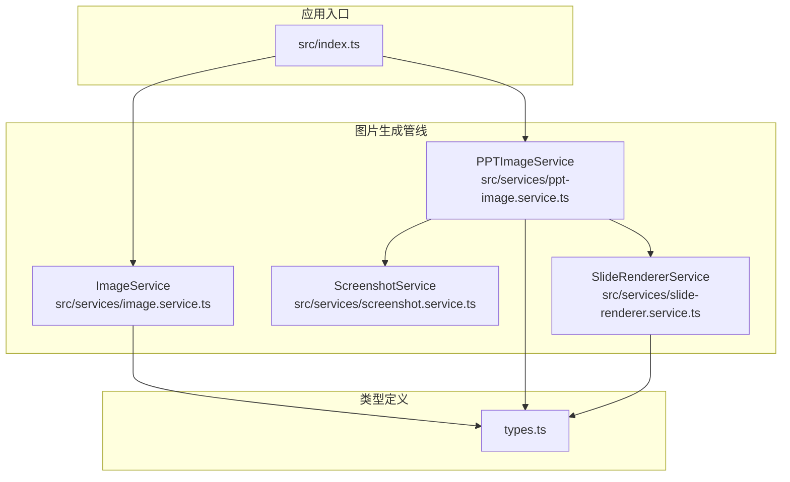
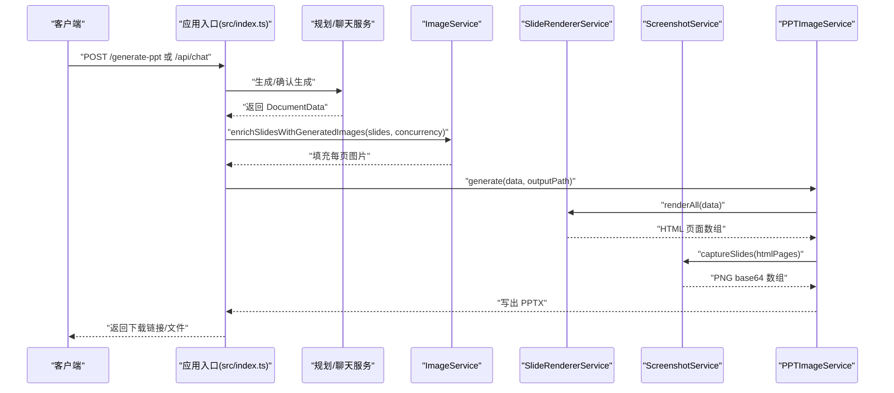
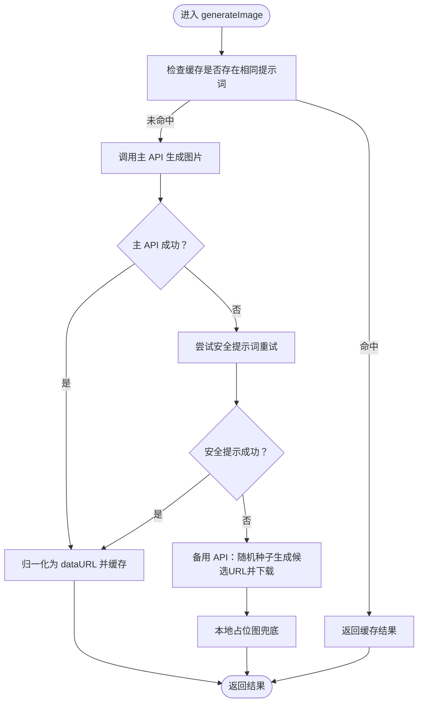
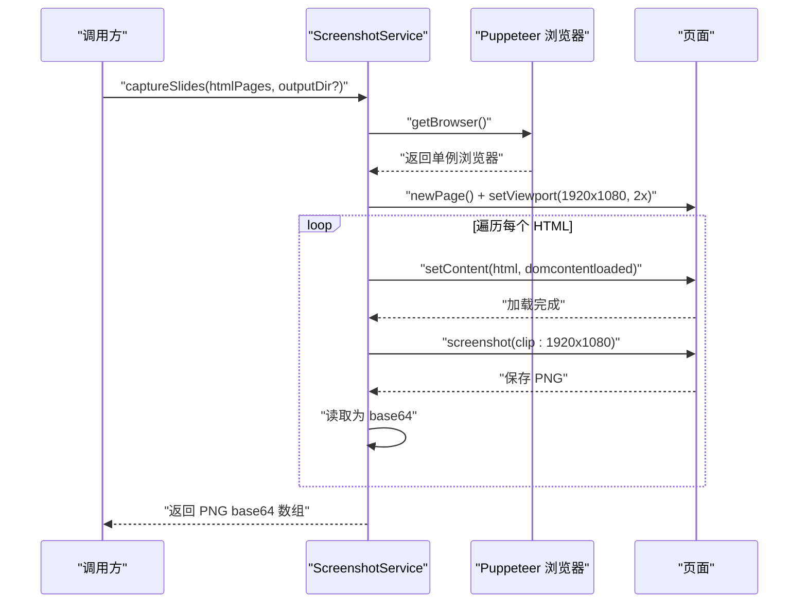
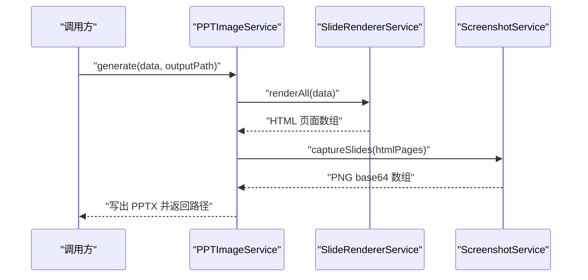
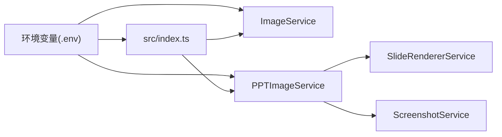

# 图片生成服务

<cite>
**本文档引用的文件**
- [src/services/image.service.ts](file://src/services/image.service.ts)
- [src/services/screenshot.service.ts](file://src/services/screenshot.service.ts)
- [src/services/ppt-image.service.ts](file://src/services/ppt-image.service.ts)
- [src/services/slide-renderer.service.ts](file://src/services/slide-renderer.service.ts)
- [src/index.ts](file://src/index.ts)
- [src/types.ts](file://src/types.ts)
- [package.json](file://package.json)
- [readme.md](file://readme.md)
- [test/test_image_api.ts](file://test/test_image_api.ts)
- [test/test-image-backfill.ts](file://test/test-image-backfill.ts)
</cite>

## 目录
1. [简介](#简介)
2. [项目结构](#项目结构)
3. [核心组件](#核心组件)
4. [架构总览](#架构总览)
5. [详细组件分析](#详细组件分析)
6. [依赖关系分析](#依赖关系分析)
7. [性能考虑](#性能考虑)
8. [故障排除指南](#故障排除指南)
9. [结论](#结论)
10. [附录](#附录)

## 简介
本文件面向 Generate-PPT 的图片生成服务，系统性阐述 AI 图像生成的集成实现、并发控制、缓存策略与质量控制；同时详解截图服务的实现原理与应用场景，并给出配置选项、API 集成方式、性能优化策略、使用示例与错误处理方案。文档还解释图片生成与 PPT 生成服务的协作机制与数据流转，以及图片质量评估与优化建议。

## 项目结构
图片生成服务由以下模块协同完成：
- 图像生成服务：负责构建提示词、调用主/备用接口、缓存与归一化处理
- 截图服务：基于 Puppeteer 将 HTML 渲染为高清 PNG
- HTML 渲染器：将幻灯片数据渲染为独立 HTML 页面
- PPT 图片服务：将截图作为全屏背景写入 PPTX
- 应用入口：提供 Web API 与 CLI，协调各服务并进行环境配置

**图表来源**
- [src/index.ts:71-270](file://src/index.ts#L71-L270)
- [src/services/image.service.ts:4-218](file://src/services/image.service.ts#L4-L218)
- [src/services/screenshot.service.ts:9-77](file://src/services/screenshot.service.ts#L9-L77)
- [src/services/slide-renderer.service.ts:7-46](file://src/services/slide-renderer.service.ts#L7-L46)
- [src/services/ppt-image.service.ts:14-53](file://src/services/ppt-image.service.ts#L14-L53)
- [src/types.ts:48-71](file://src/types.ts#L48-L71)

**章节来源**
- [src/index.ts:71-270](file://src/index.ts#L71-L270)
- [src/services/image.service.ts:4-218](file://src/services/image.service.ts#L4-L218)
- [src/services/screenshot.service.ts:9-77](file://src/services/screenshot.service.ts#L9-L77)
- [src/services/slide-renderer.service.ts:7-46](file://src/services/slide-renderer.service.ts#L7-L46)
- [src/services/ppt-image.service.ts:14-53](file://src/services/ppt-image.service.ts#L14-L53)
- [src/types.ts:48-71](file://src/types.ts#L48-L71)

## 核心组件
- ImageService：负责为每页幻灯片生成或回填图片，支持主/备 API、缓存与负载均衡
- ScreenshotService：使用 Puppeteer 将 HTML 页面渲染为 3840×2160 PNG，供 PPTX 使用
- SlideRendererService：将 DocumentData 渲染为多页 HTML，适配不同幻灯片角色
- PPTImageService：串联渲染与截图，将图片作为全屏背景写入 PPTX
- 应用入口：提供 /generate-ppt 与 /api/chat 接口，支持环境变量控制渲染模式与并发

**章节来源**
- [src/services/image.service.ts:4-218](file://src/services/image.service.ts#L4-L218)
- [src/services/screenshot.service.ts:9-77](file://src/services/screenshot.service.ts#L9-L77)
- [src/services/slide-renderer.service.ts:7-46](file://src/services/slide-renderer.service.ts#L7-L46)
- [src/services/ppt-image.service.ts:14-53](file://src/services/ppt-image.service.ts#L14-L53)
- [src/index.ts:71-270](file://src/index.ts#L71-L270)

## 架构总览
图片生成服务在 PPT 生成流程中的位置如下：

**图表来源**
- [src/index.ts:71-270](file://src/index.ts#L71-L270)
- [src/services/image.service.ts:15-28](file://src/services/image.service.ts#L15-L28)
- [src/services/ppt-image.service.ts:18-51](file://src/services/ppt-image.service.ts#L18-L51)
- [src/services/slide-renderer.service.ts:14-45](file://src/services/slide-renderer.service.ts#L14-L45)
- [src/services/screenshot.service.ts:15-52](file://src/services/screenshot.service.ts#L15-L52)

## 详细组件分析

### ImageService 组件分析
- 功能职责
  - 为每页幻灯片生成图片：若已有图片则跳过
  - 构建高质量提示词：优先使用 slide.imagePrompt，否则基于标题、要点与上下文拼接
  - 主 API 调用：向 IMAGE_API_BASE_URL 发送请求，支持超时与鉴权头
  - 备用 API：当主 API 失败时，使用种子哈希生成候选 URL 并下载为 dataURL
  - 缓存策略：以标准化后的提示词为键，缓存生成结果，避免重复请求
  - 归一化：统一输出 data:image/*;base64,xxx 格式，兼容直接嵌入
  - 并发控制：通过 runWithConcurrency 控制同时执行的任务数
- 关键流程

**图表来源**
- [src/services/image.service.ts:30-120](file://src/services/image.service.ts#L30-L120)
- [src/services/image.service.ts:122-156](file://src/services/image.service.ts#L122-L156)

- 提示词构建策略
  - 优先使用 slide.imagePrompt（来自 LLM 生成），并追加风格约束
  - 若无，则基于 slide.title、breadcrumb 与前两条要点拼接
  - 最终附加“极简风格、科技风、高画质、4K、无文字”等约束
- 错误处理
  - 主 API 失败记录错误与响应体
  - 备用 API 逐个尝试候选 URL，失败后返回本地占位图
- 性能与可靠性
  - 缓存减少重复请求
  - 安全提示词重试提升成功率
  - 备用 API 保证“自动图片”可用性

**章节来源**
- [src/services/image.service.ts:4-218](file://src/services/image.service.ts#L4-L218)
- [src/types.ts:48-64](file://src/types.ts#L48-L64)

### ScreenshotService 组件分析
- 功能职责
  - 使用 Puppeteer 无头浏览器渲染 HTML 页面为 PNG
  - 视口设置为 1920×1080，deviceScaleFactor=2，输出 3840×2160 高清图
  - 将 PNG 读取为 base64，供 PPTX 使用
- 生命周期管理
  - 单例浏览器实例：首次使用时启动，断开后重建
  - 支持显式关闭，释放资源
- 错误处理
  - 页面加载超时与下载失败均记录错误并返回空结果

**图表来源**
- [src/services/screenshot.service.ts:15-52](file://src/services/screenshot.service.ts#L15-L52)
- [src/services/screenshot.service.ts:54-77](file://src/services/screenshot.service.ts#L54-L77)

**章节来源**
- [src/services/screenshot.service.ts:9-77](file://src/services/screenshot.service.ts#L9-L77)

### SlideRendererService 组件分析
- 功能职责
  - 将 DocumentData 渲染为多页 HTML，每页独立，便于截图
  - 支持多种幻灯片角色：封面、议程、对比、时间线、总结/下一步等
  - 使用固定设计分辨率 1920×1080，配合 2x deviceScaleFactor 实现高分辨率输出
- 关键点
  - 封面可叠加首张内容图作为背景装饰
  - 不同角色采用差异化样式与布局，确保视觉一致性
  - 所有文本进行 HTML 转义，防止注入

**章节来源**
- [src/services/slide-renderer.service.ts:7-46](file://src/services/slide-renderer.service.ts#L7-L46)
- [src/services/slide-renderer.service.ts:94-199](file://src/services/slide-renderer.service.ts#L94-L199)
- [src/services/slide-renderer.service.ts:202-309](file://src/services/slide-renderer.service.ts#L202-L309)
- [src/services/slide-renderer.service.ts:312-376](file://src/services/slide-renderer.service.ts#L312-L376)
- [src/services/slide-renderer.service.ts:378-432](file://src/services/slide-renderer.service.ts#L378-L432)
- [src/services/slide-renderer.service.ts:434-488](file://src/services/slide-renderer.service.ts#L434-L488)
- [src/services/slide-renderer.service.ts:490-544](file://src/services/slide-renderer.service.ts#L490-L544)

### PPTImageService 组件分析
- 功能职责
  - 串联渲染与截图：renderAll → captureSlides → 写入 PPTX
  - 将每张截图作为全屏背景插入 PPT，使用宽屏布局
- 工作流

**图表来源**
- [src/services/ppt-image.service.ts:18-51](file://src/services/ppt-image.service.ts#L18-L51)

**章节来源**
- [src/services/ppt-image.service.ts:14-53](file://src/services/ppt-image.service.ts#L14-L53)

## 依赖关系分析
- 运行时依赖
  - axios：HTTP 请求（图像生成与备用下载）
  - puppeteer：无头浏览器截图
  - pptxgenjs：PPTX 写入
- 环境变量
  - IMAGE_API_KEY、IMAGE_API_BASE_URL：图像生成 API 配置
  - ENABLE_AI_IMAGES：是否启用 AI 图片生成
  - IMAGE_CONCURRENCY：并发数
  - PPT_RENDER_MODE：渲染模式（html/native）
  - 其他：评估、模板样式、长度等

**图表来源**
- [readme.md:17-50](file://readme.md#L17-L50)
- [src/index.ts:71-270](file://src/index.ts#L71-L270)
- [src/services/image.service.ts:9-13](file://src/services/image.service.ts#L9-L13)
- [src/services/ppt-image.service.ts:15-16](file://src/services/ppt-image.service.ts#L15-L16)

**章节来源**
- [package.json:18-30](file://package.json#L18-L30)
- [readme.md:17-50](file://readme.md#L17-L50)
- [src/index.ts:71-270](file://src/index.ts#L71-L270)

## 性能考虑
- 并发控制
  - ImageService.runWithConcurrency 限制同时执行的任务数，避免 API 限流与资源争用
  - 默认并发可通过环境变量调整，建议结合目标 API 的 QPS 与服务端资源评估
- 缓存策略
  - 以标准化提示词为键的内存缓存，显著降低重复请求
  - 建议在高并发场景下评估缓存容量与淘汰策略
- 截图性能
  - 3840×2160 高分辨率输出带来更高的 CPU 与内存消耗
  - 可根据硬件条件适当降低分辨率或减少并发
- 备用 API
  - 备用 API 仅在主 API 失败时触发，避免不必要的外部请求
- I/O 优化
  - 截图输出到临时目录，完成后读取为 base64，减少内存峰值

[本节为通用性能讨论，无需具体文件引用]

## 故障排除指南
- 图像生成失败
  - 检查 IMAGE_API_KEY 与 IMAGE_API_BASE_URL 是否正确配置
  - 查看主 API 调用日志与响应体，定位错误原因
  - 启用备用 API 以验证网络与代理设置
- 截图异常
  - 确认 Puppeteer 依赖安装与系统字体可用
  - 检查页面内容是否导致渲染超时，适当增加等待条件
- PPTX 无图片
  - 确认 ENABLE_AI_IMAGES 已启用
  - 检查 /api/chat 的“确认生成”阶段是否正确回填原始图片
- 环境变量问题
  - 使用 .env 示例文件校验键值
  - 在 CLI 与 Web 两种入口下分别验证环境变量生效

**章节来源**
- [src/services/image.service.ts:95-101](file://src/services/image.service.ts#L95-L101)
- [src/services/screenshot.service.ts:15-52](file://src/services/screenshot.service.ts#L15-L52)
- [src/index.ts:169-185](file://src/index.ts#L169-L185)
- [readme.md:17-50](file://readme.md#L17-L50)

## 结论
图片生成服务通过“提示词构建 → 主/备 API → 缓存与归一化 → 截图 → PPTX 写入”的完整链路，实现了高质量、可扩展的幻灯片图片生成。并发控制与缓存策略有效提升了吞吐与稳定性；备用 API 保障了在不稳定环境下的可用性。结合评估体系，可进一步优化图片语义对齐与整体 PPT 质量。

[本节为总结性内容，无需具体文件引用]

## 附录

### 配置选项与环境变量
- 图像生成
  - IMAGE_API_KEY：图像生成 API 鉴权
  - IMAGE_API_BASE_URL：图像生成 API 基础地址
  - ENABLE_AI_IMAGES：是否启用 AI 图片生成（默认启用）
  - IMAGE_CONCURRENCY：并发数（默认 2）
  - IMAGE_MODEL：模型名称（默认特定值）
  - IMAGE_RESOLUTION：分辨率（默认 2K）
- 渲染模式
  - PPT_RENDER_MODE：渲染模式，html 或 native
- 其他
  - ENABLE_EVALUATION：是否输出质量评估报告
  - PPT_IMAGE_ONLY_MODE：仅图片模式开关
  - PPT_TEMPLATE_STYLE、PPT_KEEP_TEXT 等模板样式参数

**章节来源**
- [readme.md:17-50](file://readme.md#L17-L50)
- [src/index.ts:380-406](file://src/index.ts#L380-L406)
- [src/index.ts:236-255](file://src/index.ts#L236-L255)

### API 集成方式
- Web API
  - POST /generate-ppt：上传文档，返回 PPTX
  - POST /api/chat：对话式生成，支持“大纲阶段”与“确认生成”两阶段
- CLI
  - npm run generate：命令行生成 PPT，支持 --input、--output、--planner-mode 等参数

**章节来源**
- [src/index.ts:314-428](file://src/index.ts#L314-L428)
- [src/index.ts:71-270](file://src/index.ts#L71-L270)
- [readme.md:104-121](file://readme.md#L104-L121)

### 使用示例
- 启用 AI 图片并指定并发
  - 设置 ENABLE_AI_IMAGES=true、IMAGE_CONCURRENCY=2
  - 通过 /generate-ppt 或 /api/chat 触发图片生成
- 测试图像 API
  - 使用 test/test_image_api.ts 进行快速验证
- 回填原始图片
  - 在 /api/chat 的“确认生成”阶段，系统会从缓存中恢复并回填原始图片

**章节来源**
- [test/test_image_api.ts:8-44](file://test/test_image_api.ts#L8-L44)
- [src/index.ts:169-185](file://src/index.ts#L169-L185)

### 错误处理方案
- 主 API 失败：记录错误与响应体，自动尝试安全提示词重试
- 备用 API 失败：逐个尝试候选 URL，最终返回本地占位图
- 截图失败：记录错误并跳过该页，不影响整体流程
- 评估失败：不影响 PPT 生成，但会丢失质量报告

**章节来源**
- [src/services/image.service.ts:95-101](file://src/services/image.service.ts#L95-L101)
- [src/services/image.service.ts:104-120](file://src/services/image.service.ts#L104-L120)
- [src/services/screenshot.service.ts:142-156](file://src/services/screenshot.service.ts#L142-L156)

### 与 PPT 生成服务的协作机制与数据流转
- 数据模型
  - SlideContent.images：存放每页图片的 dataURL 或 URL
  - DocumentData：包含标题、幻灯片集合等
- 协作流程
  - ImageService 为每页补充图片
  - PPTImageService 将 HTML 渲染为 PNG 并写入 PPTX
  - 应用入口根据 PPT_RENDER_MODE 选择渲染路径

**章节来源**
- [src/types.ts:48-71](file://src/types.ts#L48-L71)
- [src/services/image.service.ts:15-28](file://src/services/image.service.ts#L15-L28)
- [src/services/ppt-image.service.ts:18-51](file://src/services/ppt-image.service.ts#L18-L51)
- [src/index.ts:236-255](file://src/index.ts#L236-L255)

### 图片质量评估与优化建议
- 评估维度
  - 内容逻辑、版式质量、图片语义对齐、内容丰富度、受众契合度、一致性
- 优化建议
  - 提示词：优先使用 LLM 生成的 imagePrompt，确保与内容高度相关
  - 风格约束：统一“极简风格、科技风、高画质、4K、无文字”等要求
  - 缓存复用：合理利用提示词缓存，减少重复生成
  - 并发调优：根据 API 限额与服务端资源调整 IMAGE_CONCURRENCY
  - 备用策略：保持备用 API 可用，提高整体成功率

**章节来源**
- [readme.md:68-83](file://readme.md#L68-L83)
- [src/services/image.service.ts:158-178](file://src/services/image.service.ts#L158-L178)
- [src/services/image.service.ts:30-57](file://src/services/image.service.ts#L30-L57)