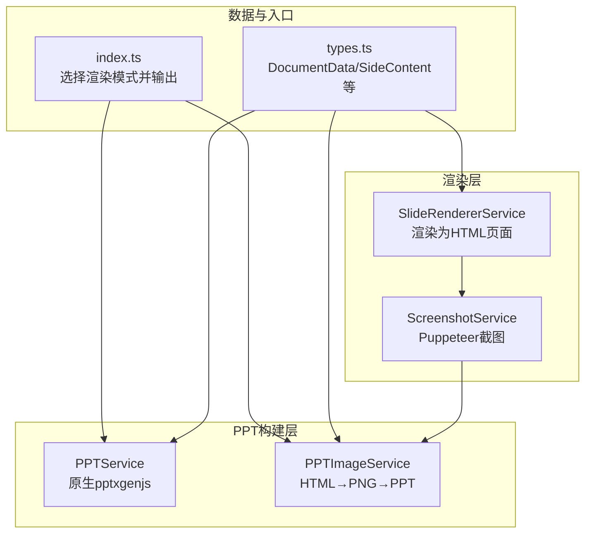
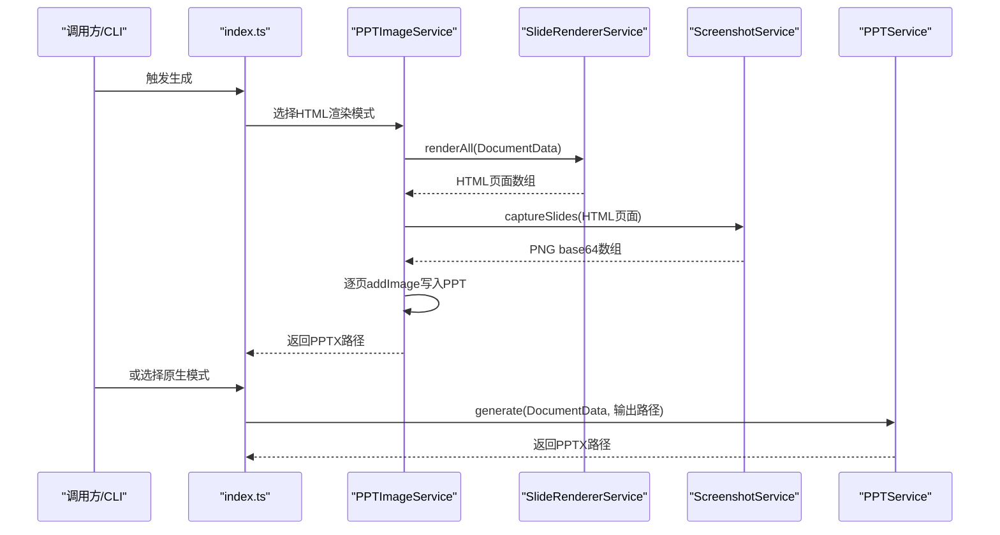
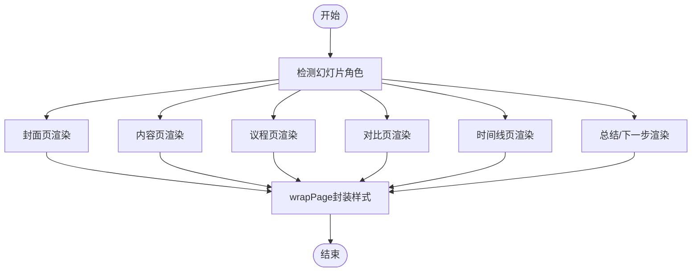
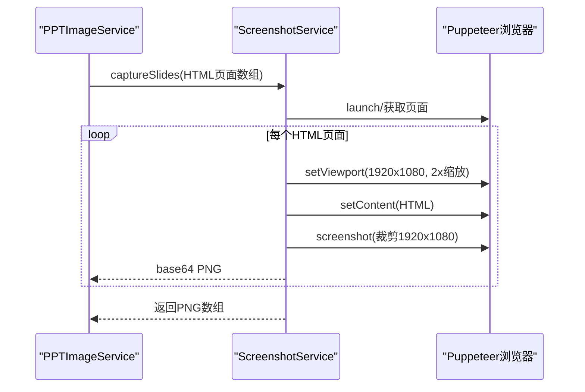
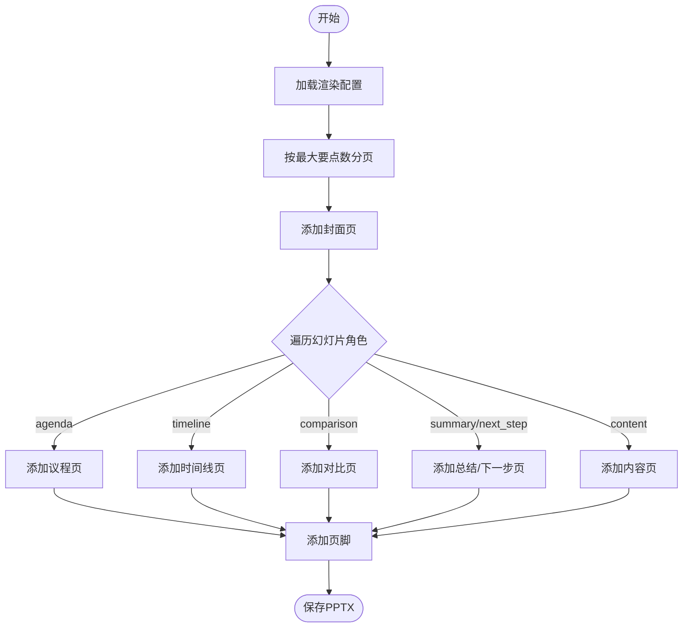
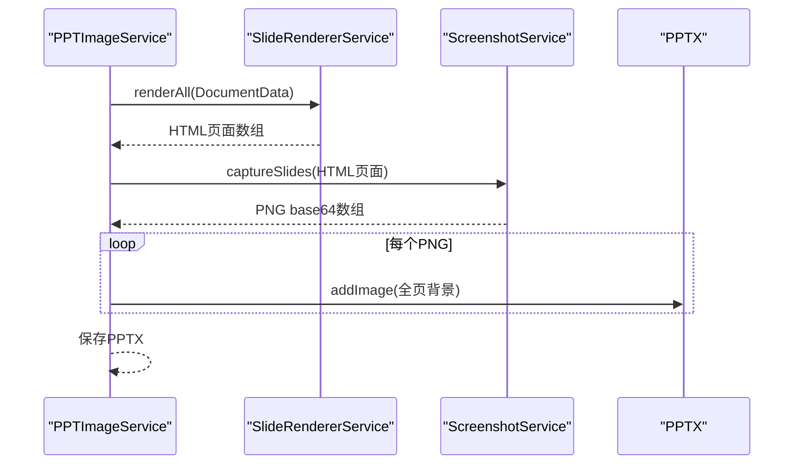
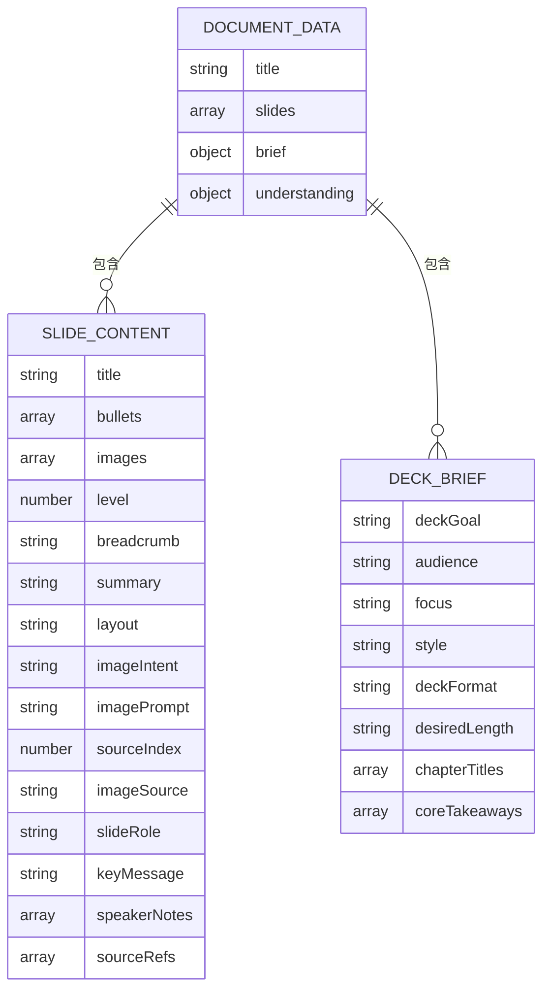
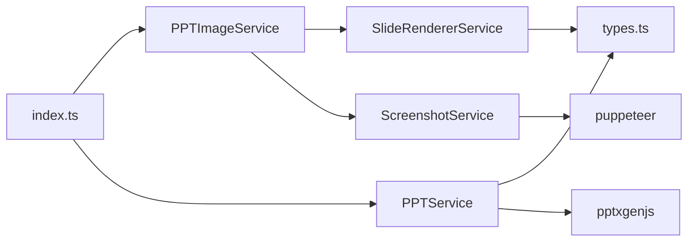

# 幻灯片渲染服务

<cite>
**本文引用的文件**
- [slide-renderer.service.ts](file://src/services/slide-renderer.service.ts)
- [ppt.service.ts](file://src/services/ppt.service.ts)
- [ppt-image.service.ts](file://src/services/ppt-image.service.ts)
- [screenshot.service.ts](file://src/services/screenshot.service.ts)
- [types.ts](file://src/types.ts)
- [index.ts](file://src/index.ts)
- [package.json](file://package.json)
- [test.md](file://test.md)
</cite>

## 目录
1. [简介](#简介)
2. [项目结构](#项目结构)
3. [核心组件](#核心组件)
4. [架构总览](#架构总览)
5. [详细组件分析](#详细组件分析)
6. [依赖关系分析](#依赖关系分析)
7. [性能考虑](#性能考虑)
8. [故障排查指南](#故障排查指南)
9. [结论](#结论)
10. [附录](#附录)

## 简介
本文件聚焦于 Generate-PPT 的“幻灯片渲染服务”，系统性阐述其核心实现、内容布局、样式应用与格式转换流程，并解释与 PPT 生成服务的协作机制、渲染配置选项、性能优化策略、兼容性处理、渲染质量控制与错误处理最佳实践。文档同时提供渲染示例与输出格式说明，帮助开发者与使用者快速理解与高效使用该渲染体系。

## 项目结构
围绕“幻灯片渲染”主题，项目中与之直接相关的模块包括：
- 渲染器：将幻灯片数据渲染为独立 HTML 页面（每页一个），用于后续截图或直接嵌入 PPT
- 截图服务：基于 Puppeteer 将 HTML 页面渲染为高清 PNG
- PPT 服务：原生使用 pptxgenjs 构建 PPT
- PPT 图像服务：采用“HTML → 高清 PNG → PPT”的混合渲染管线
- 类型定义：统一描述文档、幻灯片、简报等数据结构
- 入口与集成：在主流程中根据环境变量选择渲染模式并输出 PPTX

图表来源
- [slide-renderer.service.ts:14-46](file://src/services/slide-renderer.service.ts#L14-L46)
- [screenshot.service.ts:15-52](file://src/services/screenshot.service.ts#L15-L52)
- [ppt.service.ts:53-75](file://src/services/ppt.service.ts#L53-L75)
- [ppt-image.service.ts:18-51](file://src/services/ppt-image.service.ts#L18-L51)
- [types.ts:48-71](file://src/types.ts#L48-L71)
- [index.ts:399-406](file://src/index.ts#L399-L406)

章节来源
- [slide-renderer.service.ts:14-46](file://src/services/slide-renderer.service.ts#L14-L46)
- [ppt.service.ts:53-75](file://src/services/ppt.service.ts#L53-L75)
- [ppt-image.service.ts:18-51](file://src/services/ppt-image.service.ts#L18-L51)
- [screenshot.service.ts:15-52](file://src/services/screenshot.service.ts#L15-L52)
- [types.ts:48-71](file://src/types.ts#L48-L71)
- [index.ts:399-406](file://src/index.ts#L399-L406)

## 核心组件
- SlideRendererService：负责将 DocumentData 中的每一张幻灯片渲染为独立 HTML 页面字符串，支持多种幻灯片角色（封面、内容页、议程、对比、时间线、总结/下一步等），并内置基础样式与排版规则。
- ScreenshotService：通过 Puppeteer 将 HTML 页面渲染为 1920×1080、deviceScaleFactor=2 的高清 PNG，确保输出清晰度。
- PPTService：直接使用 pptxgenjs 构建 PPT，按角色添加不同样式的幻灯片，支持模板风格、仅图像模式、保留文本、最大条目数、来源引用显示等配置。
- PPTImageService：串联渲染器与截图服务，将每个 HTML 页面截图后作为全页背景写入 PPT，形成“HTML→PNG→PPT”的渲染链路。
- types.ts：定义 DocumentData、SlideContent、DeckBrief 等类型，统一数据契约。

章节来源
- [slide-renderer.service.ts:7-46](file://src/services/slide-renderer.service.ts#L7-L46)
- [screenshot.service.ts:9-52](file://src/services/screenshot.service.ts#L9-L52)
- [ppt.service.ts:52-85](file://src/services/ppt.service.ts#L52-L85)
- [ppt-image.service.ts:14-51](file://src/services/ppt-image.service.ts#L14-L51)
- [types.ts:48-71](file://src/types.ts#L48-L71)

## 架构总览
渲染服务的整体工作流分为两条路径：
- 原生路径（PPTService）：直接以 pptxgenjs 绘制图形与文本，无需中间截图。
- HTML 路径（PPTImageService）：先将幻灯片渲染为 HTML，再由 Puppeteer 截图生成 PNG，最后将 PNG 作为全页背景写入 PPT。

图表来源
- [index.ts:399-406](file://src/index.ts#L399-L406)
- [ppt-image.service.ts:18-51](file://src/services/ppt-image.service.ts#L18-L51)
- [slide-renderer.service.ts:14-46](file://src/services/slide-renderer.service.ts#L14-L46)
- [screenshot.service.ts:15-52](file://src/services/screenshot.service.ts#L15-L52)
- [ppt.service.ts:53-75](file://src/services/ppt.service.ts#L53-L75)

## 详细组件分析

### SlideRendererService（HTML 渲染器）
- 设计目标：将每张幻灯片渲染为独立 HTML 页面，便于后续截图或直接嵌入 PPT。
- 关键能力：
  - 封面页：使用首张含图片的幻灯片作为背景装饰，叠加渐变、图案与标题信息。
  - 内容页：支持带图片与无图片两种布局，左侧标题/要点，右侧图片或强调块。
  - 议程页：网格展示章节标题或要点，适配中英文。
  - 对比页：左右两列对比内容，带强调色点与分隔线。
  - 时间线页：横向轨道展示事件卡片，带连接线与发光圆点。
  - 总结/下一步：列表式要点，勾选符号与颜色区分。
- 样式与排版：
  - 固定画布尺寸 1920×1080，字体族统一为“Microsoft YaHei”等，保证跨平台一致性。
  - 使用 CSS 变量与 HSL 色彩体系，实现主题色与动态色相（按索引变化）。
  - 内置转义函数防止 XSS，HTML 片段安全注入。
- 输出：返回 HTML 字符串数组，每项对应一页。

图表来源
- [slide-renderer.service.ts:14-46](file://src/services/slide-renderer.service.ts#L14-L46)
- [slide-renderer.service.ts:94-199](file://src/services/slide-renderer.service.ts#L94-L199)
- [slide-renderer.service.ts:202-309](file://src/services/slide-renderer.service.ts#L202-L309)
- [slide-renderer.service.ts:312-376](file://src/services/slide-renderer.service.ts#L312-L376)
- [slide-renderer.service.ts:379-432](file://src/services/slide-renderer.service.ts#L379-L432)
- [slide-renderer.service.ts:435-488](file://src/services/slide-renderer.service.ts#L435-L488)
- [slide-renderer.service.ts:491-544](file://src/services/slide-renderer.service.ts#L491-L544)

章节来源
- [slide-renderer.service.ts:7-46](file://src/services/slide-renderer.service.ts#L7-L46)
- [slide-renderer.service.ts:94-199](file://src/services/slide-renderer.service.ts#L94-L199)
- [slide-renderer.service.ts:202-309](file://src/services/slide-renderer.service.ts#L202-L309)
- [slide-renderer.service.ts:312-376](file://src/services/slide-renderer.service.ts#L312-L376)
- [slide-renderer.service.ts:379-432](file://src/services/slide-renderer.service.ts#L379-L432)
- [slide-renderer.service.ts:435-488](file://src/services/slide-renderer.service.ts#L435-L488)
- [slide-renderer.service.ts:491-544](file://src/services/slide-renderer.service.ts#L491-L544)

### ScreenshotService（截图服务）
- 设计目标：将 HTML 页面渲染为高清 PNG，分辨率 1920×1080，deviceScaleFactor=2，输出 3840×2160 的高分辨率图像。
- 关键能力：
  - 复用浏览器实例，避免重复启动开销。
  - 支持可选输出目录，便于调试与缓存。
  - 将截图读取为 base64，供 PPT 使用。
- 兼容性：通过 Puppeteer 参数禁用 GPU、沙箱等，提升容器与 CI 环境稳定性。

图表来源
- [ppt-image.service.ts:18-51](file://src/services/ppt-image.service.ts#L18-L51)
- [screenshot.service.ts:15-52](file://src/services/screenshot.service.ts#L15-L52)

章节来源
- [screenshot.service.ts:9-52](file://src/services/screenshot.service.ts#L9-L52)
- [ppt-image.service.ts:14-51](file://src/services/ppt-image.service.ts#L14-L51)

### PPTService（原生 PPT 服务）
- 设计目标：直接使用 pptxgenjs 构建 PPT，按角色绘制形状、文本与背景，实现与 HTML 渲染一致的视觉风格。
- 关键能力：
  - 封面页：深色背景、渐变光晕、右半覆盖图与遮罩、徽标与标题。
  - 议程页：网格卡片、序号与标签。
  - 对比页：左右两列胶囊标题与项目点。
  - 时间线页：水平轨道、发光圆点与卡片。
  - 总结/下一步：勾选符号与颜色区分。
  - 页脚：页码与角色标签。
- 渲染配置（环境变量）：
  - PPT_TEMPLATE_STYLE：是否启用模板风格（默认开启）
  - PPT_IMAGE_ONLY_MODE：仅图像模式（默认关闭）
  - PPT_KEEP_TEXT：是否保留文本（默认开启）
  - PPT_MAX_BULLETS_PER_SLIDE：每页最大要点数（默认 5，最小 3）
  - PPT_SHOW_SOURCE_REFS：是否显示来源引用（默认开启）

图表来源
- [ppt.service.ts:53-75](file://src/services/ppt.service.ts#L53-L75)
- [ppt.service.ts:77-85](file://src/services/ppt.service.ts#L77-L85)
- [ppt.service.ts:231-277](file://src/services/ppt.service.ts#L231-L277)

章节来源
- [ppt.service.ts:52-85](file://src/services/ppt.service.ts#L52-L85)
- [ppt.service.ts:231-277](file://src/services/ppt.service.ts#L231-L277)

### PPTImageService（HTML→PNG→PPT）
- 设计目标：串联渲染器与截图服务，将每个 HTML 页面截图后作为全页背景写入 PPT，形成稳定且高质量的输出。
- 关键流程：
  - renderAll：生成所有 HTML 页面
  - captureSlides：Puppeteer 截图生成 PNG base64 数组
  - 逐页 addImage 写入 PPT，保持宽高比与布局一致

图表来源
- [ppt-image.service.ts:18-51](file://src/services/ppt-image.service.ts#L18-L51)
- [slide-renderer.service.ts:14-46](file://src/services/slide-renderer.service.ts#L14-L46)
- [screenshot.service.ts:15-52](file://src/services/screenshot.service.ts#L15-L52)

章节来源
- [ppt-image.service.ts:14-51](file://src/services/ppt-image.service.ts#L14-L51)

### 数据模型与类型
- DocumentData：包含标题、幻灯片数组、简报与理解结果
- SlideContent：包含标题、要点、图片、层级、面包屑、摘要、布局、意图、提示词、来源索引、图片来源、角色、关键信息、讲者备注、来源引用等
- DeckBrief：包含目标、受众、焦点、风格、格式、期望长度、章节标题、核心要点等

图表来源
- [types.ts:48-71](file://src/types.ts#L48-L71)
- [types.ts:21-30](file://src/types.ts#L21-L30)

章节来源
- [types.ts:21-71](file://src/types.ts#L21-L71)

## 依赖关系分析
- 外部依赖：
  - puppeteer：用于 HTML 截图，生成高清 PNG
  - pptxgenjs：用于原生构建 PPT，绘制形状、文本与背景
- 内部依赖：
  - PPTImageService 依赖 SlideRendererService 与 ScreenshotService
  - index.ts 根据环境变量选择 PPTService 或 PPTImageService
  - PPTService 依赖 types.ts 中的数据结构

图表来源
- [index.ts:399-406](file://src/index.ts#L399-L406)
- [ppt-image.service.ts:14-51](file://src/services/ppt-image.service.ts#L14-L51)
- [ppt.service.ts:52-85](file://src/services/ppt.service.ts#L52-L85)
- [slide-renderer.service.ts:7-46](file://src/services/slide-renderer.service.ts#L7-L46)
- [screenshot.service.ts:9-52](file://src/services/screenshot.service.ts#L9-L52)
- [package.json:29-30](file://package.json#L29-L30)

章节来源
- [index.ts:399-406](file://src/index.ts#L399-L406)
- [ppt-image.service.ts:14-51](file://src/services/ppt-image.service.ts#L14-L51)
- [ppt.service.ts:52-85](file://src/services/ppt.service.ts#L52-L85)
- [slide-renderer.service.ts:7-46](file://src/services/slide-renderer.service.ts#L7-L46)
- [screenshot.service.ts:9-52](file://src/services/screenshot.service.ts#L9-L52)
- [package.json:18-30](file://package.json#L18-L30)

## 性能考虑
- 渲染分辨率与缩放：HTML 渲染器固定 1920×1080，Puppeteer 使用 2x deviceScaleFactor，确保输出清晰度；在资源受限环境中可适当降低缩放或减少并发。
- 浏览器复用：ScreenshotService 复用浏览器实例，避免频繁启动带来的开销。
- 分页与限制：PPTService 支持按最大要点数分页，避免单页内容过多导致渲染与阅读体验下降。
- 模板风格开关：PPT_TEMPLATE_STYLE 可在需要时关闭以减少复杂绘制开销。
- 并发控制：在生成 AI 图像时可通过环境变量控制并发度，避免资源争用。

## 故障排查指南
- HTML 截图失败或空白页
  - 检查 Puppeteer 启动参数与容器环境（GPU、沙箱、内存）设置
  - 确认 HTML 页面已正确加载（等待 domcontentloaded），必要时增加超时
  - 验证字体与网络资源可用性（如 Google Fonts）
- PNG 输出异常
  - 确认截图裁剪区域与视口一致（1920×1080）
  - 检查输出目录权限与磁盘空间
- PPT 构建异常
  - 检查 pptxgenjs 版本与 Node.js 兼容性
  - 确认文本换行与字体适配（Microsoft YaHei）
- 环境变量未生效
  - 确认 index.ts 中的模式选择逻辑与环境变量命名一致
  - 检查 PPTService 的配置加载顺序与默认值

章节来源
- [screenshot.service.ts:54-68](file://src/services/screenshot.service.ts#L54-L68)
- [ppt.service.ts:77-85](file://src/services/ppt.service.ts#L77-L85)
- [index.ts:399-406](file://src/index.ts#L399-L406)

## 结论
Generate-PPT 的幻灯片渲染服务提供了两条互补的渲染路径：原生 PPT 构建与 HTML→PNG→PPT 的高质量输出。前者侧重效率与可控性，后者强调视觉一致性与跨平台稳定性。通过合理的配置项、严格的样式与排版规范、以及完善的错误处理与性能优化策略，渲染服务能够稳定地输出符合预期的 PPTX 文件，并为后续的质量评估与改进提供数据支撑。

## 附录

### 渲染配置选项（环境变量）
- PPT_RENDER_MODE：选择渲染模式
  - 值为 html 时走 HTML→PNG→PPT 路径
  - 默认或其他值走原生 PPTService 路径
- PPT_TEMPLATE_STYLE：是否启用模板风格（默认开启）
- PPT_IMAGE_ONLY_MODE：仅图像模式（默认关闭）
- PPT_KEEP_TEXT：是否保留文本（默认开启）
- PPT_MAX_BULLETS_PER_SLIDE：每页最大要点数（默认 5，最小 3）
- PPT_SHOW_SOURCE_REFS：是否显示来源引用（默认开启）

章节来源
- [index.ts:399-406](file://src/index.ts#L399-L406)
- [ppt.service.ts:77-85](file://src/services/ppt.service.ts#L77-L85)

### 输出格式说明
- PPTX：最终输出文件，包含按角色组织的幻灯片，支持封面、议程、内容、对比、时间线、总结/下一步等
- PNG：在 HTML→PNG→PPT 路径中，每页生成高清 PNG 作为背景

章节来源
- [ppt.service.ts:53-75](file://src/services/ppt.service.ts#L53-L75)
- [ppt-image.service.ts:28-44](file://src/services/ppt-image.service.ts#L28-L44)

### 渲染示例
- 使用 HTML 渲染模式
  - 设置 PPT_RENDER_MODE=html
  - 调用 PPTImageService.generate，生成 PPTX
- 使用原生渲染模式
  - 不设置或设置其他值
  - 调用 PPTService.generate，生成 PPTX

章节来源
- [index.ts:399-406](file://src/index.ts#L399-L406)
- [ppt-image.service.ts:18-51](file://src/services/ppt-image.service.ts#L18-L51)
- [ppt.service.ts:53-75](file://src/services/ppt.service.ts#L53-L75)