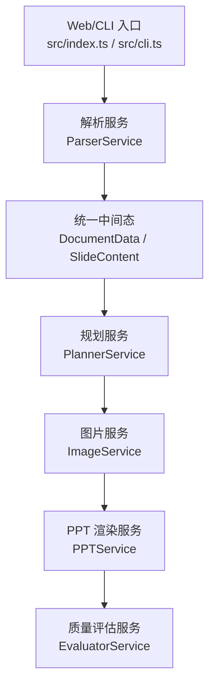
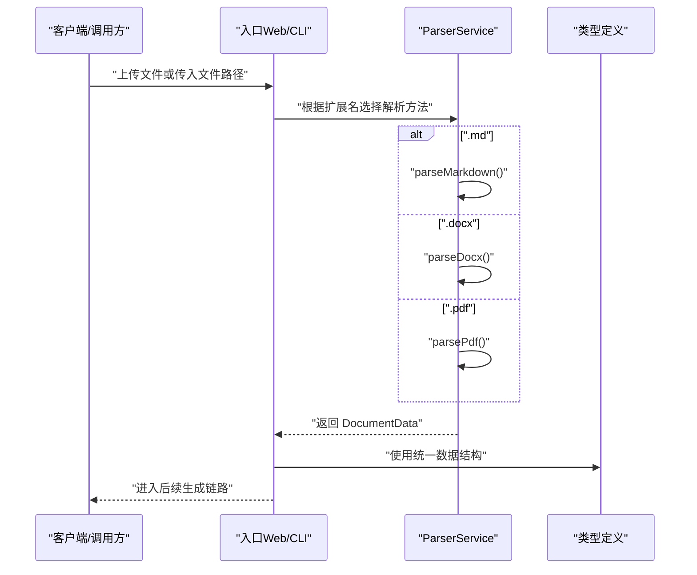
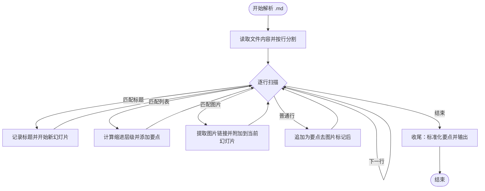
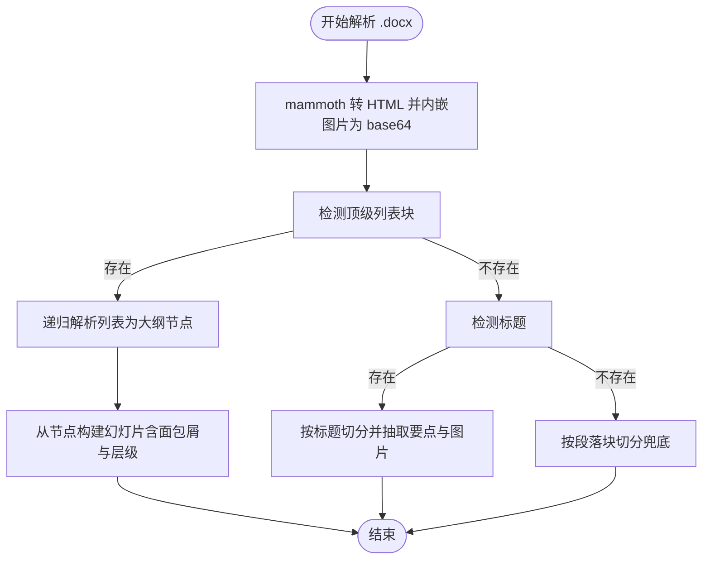
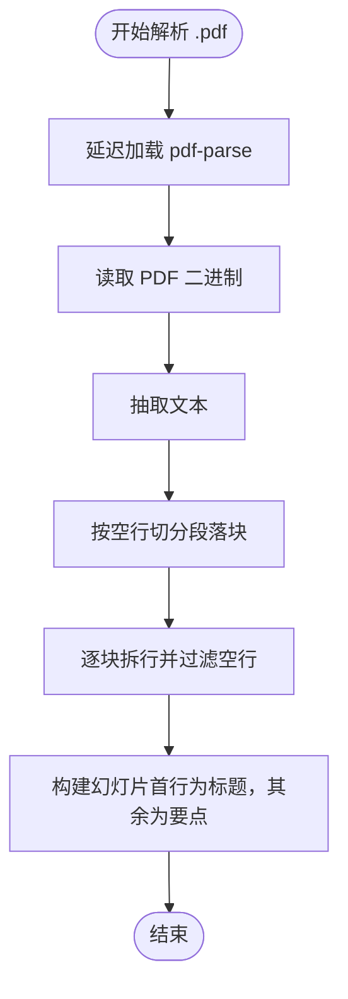
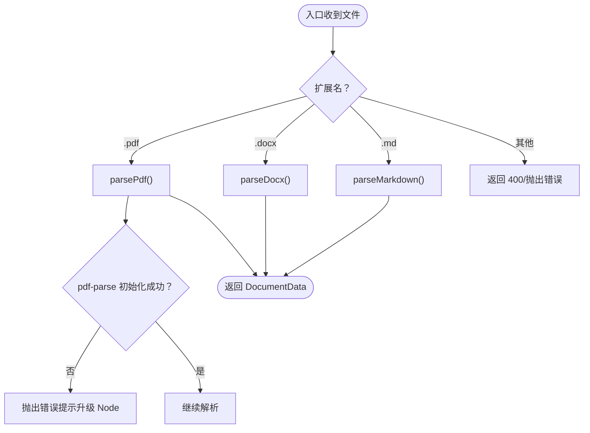
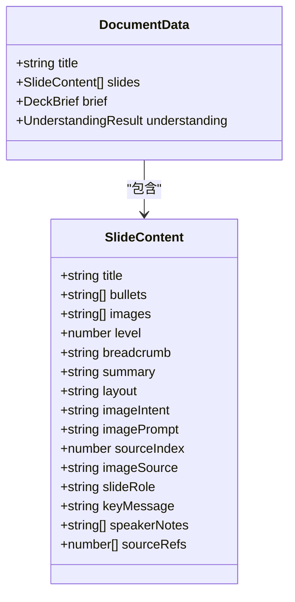
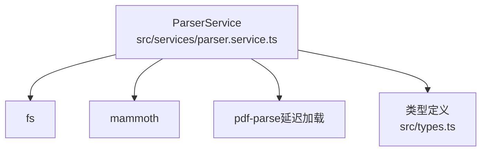

# 文档解析服务

<cite>
**本文引用的文件**
- [src/services/parser.service.ts](file://src/services/parser.service.ts)
- [src/types.ts](file://src/types.ts)
- [src/index.ts](file://src/index.ts)
- [src/cli.ts](file://src/cli.ts)
- [package.json](file://package.json)
- [ARCHITECTURE.md](file://ARCHITECTURE.md)
- [readme.md](file://readme.md)
</cite>

## 目录
1. [简介](#简介)
2. [项目结构](#项目结构)
3. [核心组件](#核心组件)
4. [架构总览](#架构总览)
5. [详细组件分析](#详细组件分析)
6. [依赖关系分析](#依赖关系分析)
7. [性能考量](#性能考量)
8. [故障排查指南](#故障排查指南)
9. [结论](#结论)
10. [附录](#附录)

## 简介
本文件聚焦于 Generate-PPT 的文档解析服务，系统性阐述多格式文档解析的实现原理与策略，涵盖 Markdown、DOCX、PDF 三类输入的解析算法、解析器选择逻辑、错误处理与边界情况处理，并给出使用示例、解析结果数据结构说明、后续处理流程、性能优化建议与常见问题解决方案。

## 项目结构
- 解析服务位于 src/services/parser.service.ts，负责将 Markdown、DOCX、PDF 转换为统一的 DocumentData 结构。
- 类型定义位于 src/types.ts，定义了 DocumentData、SlideContent 等核心数据结构。
- Web 服务入口 src/index.ts 与 CLI 入口 src/cli.ts 展示了如何调用解析服务并进入后续生成链路。
- 项目依赖 package.json 中声明了解析所需的关键库（如 mammoth、pdf-parse）。
- ARCHITECTURE.md 与 readme.md 提供了端到端流程、模块职责与运行方式的背景说明。

**图表来源**
- [src/index.ts:314-428](file://src/index.ts#L314-L428)
- [src/cli.ts:65-176](file://src/cli.ts#L65-L176)
- [src/services/parser.service.ts:11-134](file://src/services/parser.service.ts#L11-L134)
- [src/types.ts:48-71](file://src/types.ts#L48-L71)

**章节来源**
- [src/services/parser.service.ts:11-134](file://src/services/parser.service.ts#L11-L134)
- [src/types.ts:48-71](file://src/types.ts#L48-L71)
- [src/index.ts:314-428](file://src/index.ts#L314-L428)
- [src/cli.ts:65-176](file://src/cli.ts#L65-L176)
- [package.json:18-31](file://package.json#L18-L31)
- [ARCHITECTURE.md:103-120](file://ARCHITECTURE.md#L103-L120)
- [readme.md:84-121](file://readme.md#L84-L121)

## 核心组件
- ParserService：多格式文档解析器，提供 parseMarkdown、parseDocx、parsePdf 三个入口方法，统一输出 DocumentData。
- DocumentData 与 SlideContent：解析结果的数据结构，承载标题、要点、图片、层级、面包屑等信息，供后续规划、图片与渲染使用。
- Web/CLI 入口：负责接收文件、调用解析服务、进入后续生成链路，并在必要时进行错误处理与响应。

**章节来源**
- [src/services/parser.service.ts:11-134](file://src/services/parser.service.ts#L11-L134)
- [src/types.ts:48-71](file://src/types.ts#L48-L71)
- [src/index.ts:314-428](file://src/index.ts#L314-L428)
- [src/cli.ts:65-176](file://src/cli.ts#L65-L176)

## 架构总览
解析服务处于“端到端生成链路”的第一步，其职责是“读懂文档的外在结构”，并尽可能保留层次信息，为后续规划、图片与渲染奠定基础。解析器选择逻辑遵循“格式匹配 + 多级兜底”的策略：优先使用格式特定解析器，若失败或不可用，则回退到通用策略。

**图表来源**
- [src/index.ts:314-428](file://src/index.ts#L314-L428)
- [src/cli.ts:65-176](file://src/cli.ts#L65-L176)
- [src/services/parser.service.ts:11-134](file://src/services/parser.service.ts#L11-L134)
- [src/types.ts:48-71](file://src/types.ts#L48-L71)

## 详细组件分析

### Markdown 解析策略
- 标题层级拆分：以 # 开头的行作为标题，第一级标题作为文档标题；后续遇到标题时即视为新幻灯片开始。
- 列表转要点：支持无序列表与有序列表，通过缩进层级映射为缩进后的要点文本。
- 图片提取：识别 Markdown 图片语法，提取图片链接并附加到当前幻灯片。
- 内容兜底：若解析后无幻灯片，将以整段内容作为唯一幻灯片兜底，确保输出非空。

**图表来源**
- [src/services/parser.service.ts:12-97](file://src/services/parser.service.ts#L12-L97)

**章节来源**
- [src/services/parser.service.ts:12-97](file://src/services/parser.service.ts#L12-L97)

### DOCX 解析策略
- HTML 转换：使用 mammoth 将 DOCX 转为 HTML，并将内嵌图片转为 base64 数据 URL。
- 三层解析策略：
  1) 顶层列表优先：提取所有顶级列表块，递归解析为大纲节点，构建幻灯片树；
  2) 标题回退：若无列表结构，则按标题层级切分；
  3) 段落兜底：若仍无有效结构，则按段落块切分为若干幻灯片。
- 图片提取：从 HTML 中提取 img 标签的 src，支持 base64 与外链。
- 标题与首段：若无法提取标题，使用首个文本片段作为标题。

**图表来源**
- [src/services/parser.service.ts:99-134](file://src/services/parser.service.ts#L99-L134)
- [src/services/parser.service.ts:185-244](file://src/services/parser.service.ts#L185-L244)
- [src/services/parser.service.ts:246-285](file://src/services/parser.service.ts#L246-L285)
- [src/services/parser.service.ts:287-310](file://src/services/parser.service.ts#L287-L310)
- [src/services/parser.service.ts:312-366](file://src/services/parser.service.ts#L312-L366)
- [src/services/parser.service.ts:404-416](file://src/services/parser.service.ts#L404-L416)

**章节来源**
- [src/services/parser.service.ts:99-134](file://src/services/parser.service.ts#L99-L134)
- [src/services/parser.service.ts:185-244](file://src/services/parser.service.ts#L185-L244)
- [src/services/parser.service.ts:246-285](file://src/services/parser.service.ts#L246-L285)
- [src/services/parser.service.ts:287-310](file://src/services/parser.service.ts#L287-L310)
- [src/services/parser.service.ts:312-366](file://src/services/parser.service.ts#L312-L366)
- [src/services/parser.service.ts:404-416](file://src/services/parser.service.ts#L404-L416)

### PDF 解析策略
- 文本抽取：延迟加载 pdf-parse，读取 PDF 二进制后抽取文本。
- 段落切分：按连续空行切分为“段落块”，再按换行拆分为行，形成若干幻灯片。
- 标题与要点：第一个非空行作为标题，其余作为要点；限制标题长度。
- 兜底策略：若无有效段落，返回单张兜底幻灯片。

**图表来源**
- [src/services/parser.service.ts:136-167](file://src/services/parser.service.ts#L136-L167)
- [src/services/parser.service.ts:169-183](file://src/services/parser.service.ts#L169-L183)

**章节来源**
- [src/services/parser.service.ts:136-167](file://src/services/parser.service.ts#L136-L167)
- [src/services/parser.service.ts:169-183](file://src/services/parser.service.ts#L169-L183)

### 解析器选择逻辑与错误处理
- Web 入口选择：根据上传文件扩展名选择对应解析方法，若扩展名不支持则返回 400。
- CLI 入口选择：根据输入文件扩展名选择解析方法，不支持时抛出错误。
- PDF 初始化异常：当 pdf-parse 加载失败（如 Node 版本过低）时抛出明确错误，提示升级 Node 版本。
- 兜底策略：若某解析路径无有效结果，自动回退到更通用的策略（列表→标题→段落）。

**图表来源**
- [src/index.ts:314-350](file://src/index.ts#L314-L350)
- [src/cli.ts:65-92](file://src/cli.ts#L65-L92)
- [src/services/parser.service.ts:169-183](file://src/services/parser.service.ts#L169-L183)

**章节来源**
- [src/index.ts:314-350](file://src/index.ts#L314-L350)
- [src/cli.ts:65-92](file://src/cli.ts#L65-L92)
- [src/services/parser.service.ts:169-183](file://src/services/parser.service.ts#L169-L183)

### 解析结果数据结构与后续处理
- DocumentData：包含 title 与 slides 数组，以及可选的 brief 与 understanding。
- SlideContent：包含 title、bullets、images、level、breadcrumb 等字段，后续规划、图片与渲染均围绕该结构展开。
- Web/CLI 入口：解析完成后进入规划、图片增强、PPT 渲染与质量评估的完整链路。

**图表来源**
- [src/types.ts:48-71](file://src/types.ts#L48-L71)
- [src/types.ts:48-64](file://src/types.ts#L48-L64)

**章节来源**
- [src/types.ts:48-71](file://src/types.ts#L48-L71)
- [src/index.ts:370-406](file://src/index.ts#L370-L406)
- [src/cli.ts:127-151](file://src/cli.ts#L127-L151)

### 使用示例（路径指引）
- Web API 使用（POST /generate-ppt）：通过 multipart/form-data 上传文件，服务端根据扩展名选择解析方法，随后进入完整生成链路。
  - 参考：[src/index.ts:314-428](file://src/index.ts#L314-L428)
- CLI 使用（ts-node src/cli.ts）：传入 --input 指定文件路径，自动根据扩展名选择解析方法，随后进入完整生成链路。
  - 参考：[src/cli.ts:65-176](file://src/cli.ts#L65-L176)
- 解析服务直接调用：在业务代码中实例化 ParserService，分别调用 parseMarkdown、parseDocx、parsePdf 获取 DocumentData。
  - 参考：[src/services/parser.service.ts:11-134](file://src/services/parser.service.ts#L11-L134)

**章节来源**
- [src/index.ts:314-428](file://src/index.ts#L314-L428)
- [src/cli.ts:65-176](file://src/cli.ts#L65-L176)
- [src/services/parser.service.ts:11-134](file://src/services/parser.service.ts#L11-L134)

## 依赖关系分析
- 解析服务依赖：
  - fs：读取文件内容；
  - mammoth：DOCX → HTML 转换与内嵌图片转 base64；
  - pdf-parse：PDF 文本抽取（延迟加载）。
- 类型依赖：DocumentData、SlideContent 等类型定义由 src/types.ts 提供，贯穿整个生成链路。

**图表来源**
- [src/services/parser.service.ts:1-3](file://src/services/parser.service.ts#L1-L3)
- [package.json:24-28](file://package.json#L24-L28)
- [src/types.ts:48-71](file://src/types.ts#L48-L71)

**章节来源**
- [src/services/parser.service.ts:1-3](file://src/services/parser.service.ts#L1-L3)
- [package.json:24-28](file://package.json#L24-L28)
- [src/types.ts:48-71](file://src/types.ts#L48-L71)

## 性能考量
- PDF 解析延迟加载：pdf-parse 仅在请求 PDF 解析时加载，避免在旧版 Node 环境下影响 Markdown/DOCX 路径。
- DOCX 列表优先：优先解析列表结构，能显著提升结构化程度与幻灯片数量控制。
- 段落切分阈值：DOCX 段落兜底时按固定块大小切分，可根据内容密度调整以平衡幻灯片数量与信息密度。
- 图片处理：DOCX 内嵌图片转为 base64，注意内存占用与传输成本；在后续图片服务中可利用缓存减少重复生成。

**章节来源**
- [src/services/parser.service.ts:169-183](file://src/services/parser.service.ts#L169-L183)
- [src/services/parser.service.ts:219-244](file://src/services/parser.service.ts#L219-L244)
- [src/services/parser.service.ts:104-109](file://src/services/parser.service.ts#L104-L109)

## 故障排查指南
- PDF 解析报错（Node 版本过低）：检查 Node 版本是否满足推荐要求，升级后重试。
  - 参考：[src/services/parser.service.ts:176-182](file://src/services/parser.service.ts#L176-L182)
- Web API 返回 400（不支持的扩展名）：确认上传文件扩展名为 .md/.docx/.pdf。
  - 参考：[src/index.ts:333-335](file://src/index.ts#L333-L335)
- CLI 报错（不支持的扩展名）：确认输入文件扩展名正确。
  - 参考：[src/cli.ts:90-92](file://src/cli.ts#L90-L92)
- DOCX 无结构：若文档未使用标题或列表表达层级，解析将回退到段落兜底；建议在源文档中规范使用标题与列表。
  - 参考：[src/services/parser.service.ts:116-127](file://src/services/parser.service.ts#L116-L127)
- Markdown 无幻灯片：若文档无标题或列表，解析将生成单张兜底幻灯片；建议在 Markdown 中添加标题与要点。
  - 参考：[src/services/parser.service.ts:84-91](file://src/services/parser.service.ts#L84-L91)

**章节来源**
- [src/services/parser.service.ts:176-182](file://src/services/parser.service.ts#L176-L182)
- [src/index.ts:333-335](file://src/index.ts#L333-L335)
- [src/cli.ts:90-92](file://src/cli.ts#L90-L92)
- [src/services/parser.service.ts:116-127](file://src/services/parser.service.ts#L116-L127)
- [src/services/parser.service.ts:84-91](file://src/services/parser.service.ts#L84-L91)

## 结论
ParserService 通过“格式匹配 + 多级兜底”的策略，实现了对 Markdown、DOCX、PDF 的稳健解析，并以统一的 DocumentData/SlideContent 结构衔接后续规划、图片与渲染阶段。其延迟加载与回退机制提升了在不同运行环境下的兼容性与鲁棒性。建议在源文档层面规范标题与列表结构，以获得更佳的解析与生成效果。

## 附录
- 端到端流程与模块职责可参考 ARCHITECTURE.md。
- Web 与 CLI 的使用方式与 API 说明可参考 readme.md。

**章节来源**
- [ARCHITECTURE.md:103-120](file://ARCHITECTURE.md#L103-L120)
- [readme.md:84-121](file://readme.md#L84-L121)