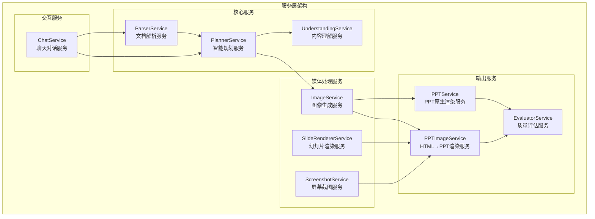
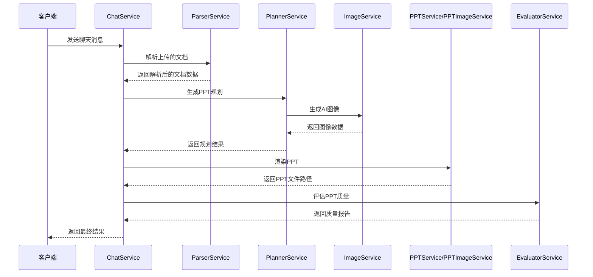
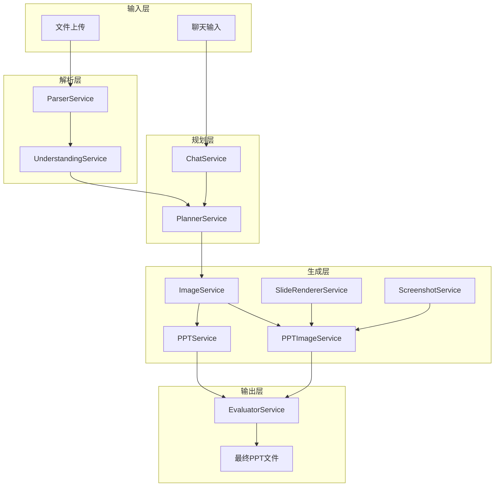
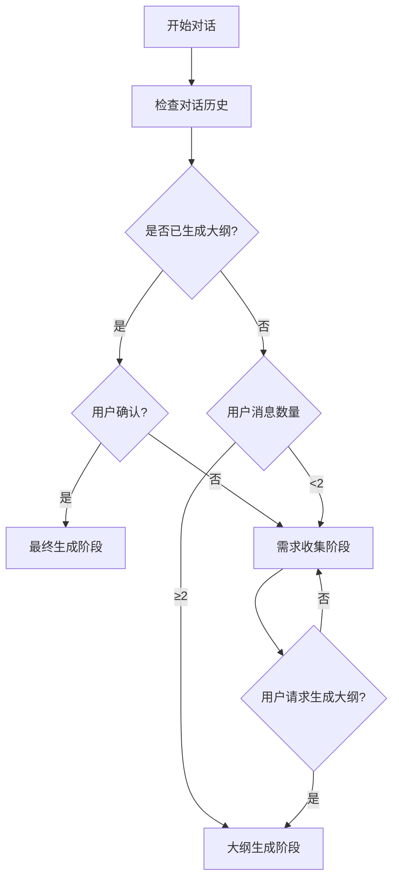
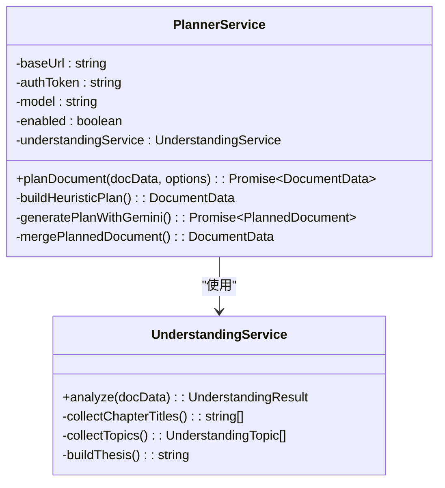
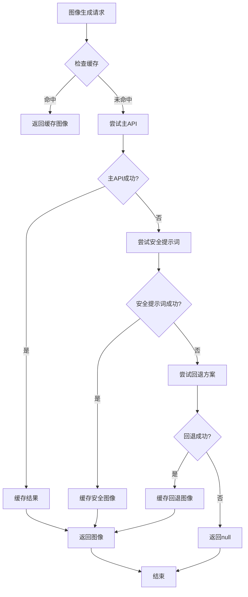
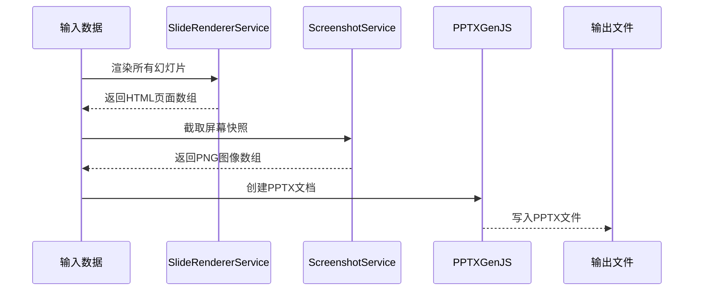
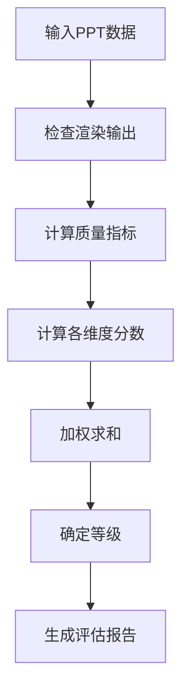
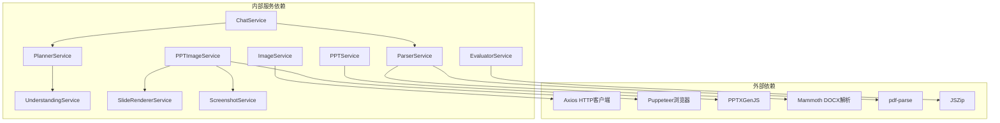
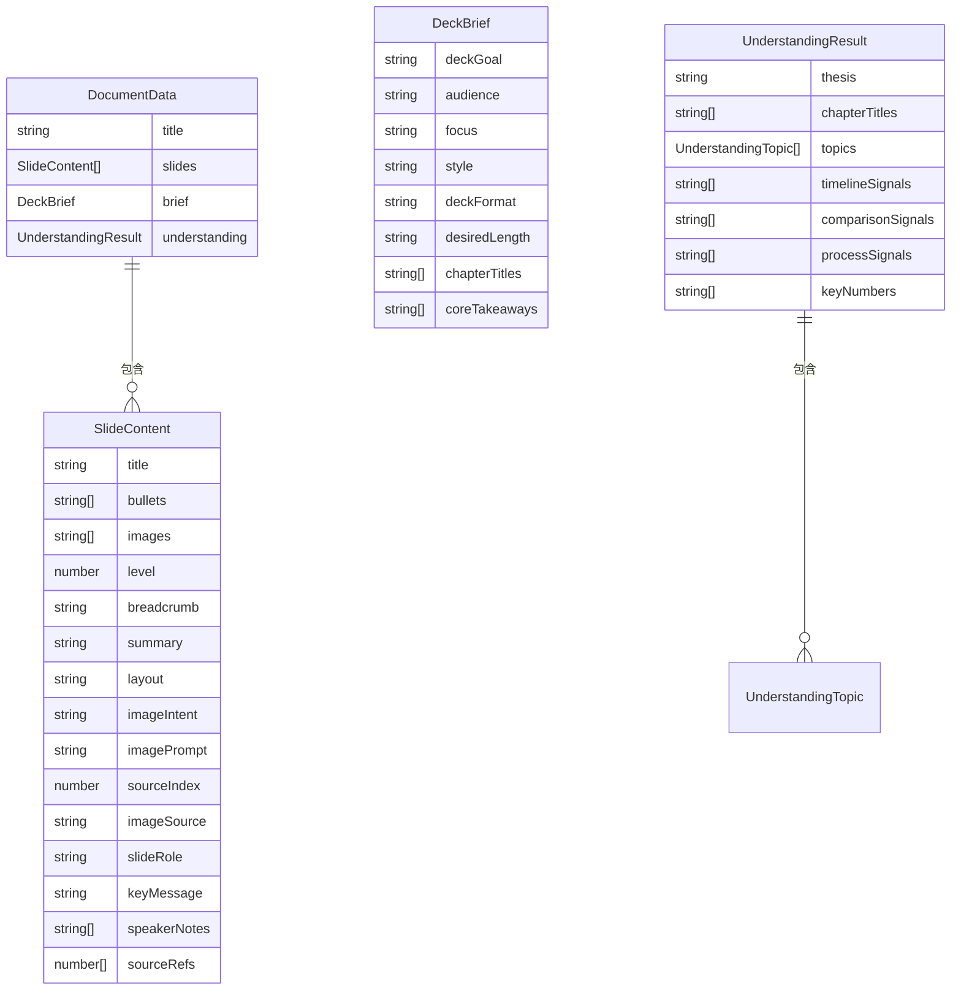

# 服务层架构

<cite>
**本文档引用的文件**
- [src/services/chat.service.ts](file://src/services/chat.service.ts)
- [src/services/evaluator.service.ts](file://src/services/evaluator.service.ts)
- [src/services/image.service.ts](file://src/services/image.service.ts)
- [src/services/parser.service.ts](file://src/services/parser.service.ts)
- [src/services/planner.service.ts](file://src/services/planner.service.ts)
- [src/services/ppt-image.service.ts](file://src/services/ppt-image.service.ts)
- [src/services/ppt.service.ts](file://src/services/ppt.service.ts)
- [src/services/screenshot.service.ts](file://src/services/screenshot.service.ts)
- [src/services/slide-renderer.service.ts](file://src/services/slide-renderer.service.ts)
- [src/services/understanding.service.ts](file://src/services/understanding.service.ts)
- [src/types.ts](file://src/types.ts)
- [src/index.ts](file://src/index.ts)
- [package.json](file://package.json)
</cite>

## 目录
1. [简介](#简介)
2. [项目结构](#项目结构)
3. [核心组件](#核心组件)
4. [架构概览](#架构概览)
5. [详细组件分析](#详细组件分析)
6. [依赖关系分析](#依赖关系分析)
7. [性能考虑](#性能考虑)
8. [故障排除指南](#故障排除指南)
9. [结论](#结论)

## 简介

Generate-PPT 是一个基于人工智能的演示文稿自动生成系统。该系统采用模块化的服务层架构，通过多个专门的服务模块协同工作，实现从文档解析、智能规划、图像生成到最终PPT输出的完整流程。服务层采用面向对象设计，每个服务模块都有明确的职责边界和清晰的接口定义。

## 项目结构

项目采用基于功能域的服务层组织结构，所有服务模块位于 `src/services/` 目录下，每个服务负责特定的业务功能：

**图表来源**
- [src/services/chat.service.ts:31-400](file://src/services/chat.service.ts#L31-L400)
- [src/services/parser.service.ts:11-453](file://src/services/parser.service.ts#L11-L453)
- [src/services/planner.service.ts:53-800](file://src/services/planner.service.ts#L53-L800)

**章节来源**
- [src/services/chat.service.ts:1-400](file://src/services/chat.service.ts#L1-L400)
- [src/services/evaluator.service.ts:23-1542](file://src/services/evaluator.service.ts#L23-L1542)
- [src/services/image.service.ts:4-218](file://src/services/image.service.ts#L4-L218)
- [src/services/parser.service.ts:1-453](file://src/services/parser.service.ts#L1-L453)
- [src/services/planner.service.ts:1-800](file://src/services/planner.service.ts#L1-L800)
- [src/services/ppt-image.service.ts:14-53](file://src/services/ppt-image.service.ts#L14-L53)
- [src/services/ppt.service.ts:52-800](file://src/services/ppt.service.ts#L52-L800)
- [src/services/screenshot.service.ts:9-77](file://src/services/screenshot.service.ts#L9-L77)
- [src/services/slide-renderer.service.ts:7-546](file://src/services/slide-renderer.service.ts#L7-L546)
- [src/services/understanding.service.ts:3-96](file://src/services/understanding.service.ts#L3-L96)

## 核心组件

### 服务层设计模式

服务层采用了多种设计模式来确保代码的可维护性和可扩展性：

1. **单例模式**: 主要服务实例在应用启动时创建，确保全局唯一性
2. **工厂模式**: 通过构造函数参数配置不同服务的行为
3. **策略模式**: 支持不同的渲染模式（原生PPT vs HTML→PPT）
4. **观察者模式**: 事件驱动的错误处理和日志记录

### 服务模块职责分工

| 服务模块 | 主要职责 | 关键方法 | 依赖关系 |
|---------|----------|----------|----------|
| ChatService | AI对话交互与PPT生成协调 | chatAndGenerate, detectPhase | ParserService, PlannerService |
| ParserService | 多格式文档解析 | parseMarkdown, parseDocx, parsePdf | Mammoth, PDF解析库 |
| PlannerService | 智能规划与内容重组 | planDocument, generatePlanWithGemini | UnderstandingService |
| UnderstandingService | 内容语义分析 | analyze, collectTopics | 无外部依赖 |
| ImageService | AI图像生成与缓存 | generateImage, enrichSlidesWithGeneratedImages | Axios, Puppeteer |
| PPTService | 原生PPT渲染 | generate, addRoleAwareSlide | PPTXGenJS |
| PPTImageService | HTML→PPT渲染流水线 | generate | SlideRendererService, ScreenshotService |
| SlideRendererService | 幻灯片HTML渲染 | renderAll, renderContentSlide | 无外部依赖 |
| ScreenshotService | 屏幕截图捕获 | captureSlides, close | Puppeteer |
| EvaluatorService | PPT质量评估 | evaluate, saveReport | JSZip |

**章节来源**
- [src/services/chat.service.ts:31-400](file://src/services/chat.service.ts#L31-L400)
- [src/services/parser.service.ts:11-453](file://src/services/parser.service.ts#L11-L453)
- [src/services/planner.service.ts:53-800](file://src/services/planner.service.ts#L53-L800)
- [src/services/understanding.service.ts:3-96](file://src/services/understanding.service.ts#L3-L96)
- [src/services/image.service.ts:4-218](file://src/services/image.service.ts#L4-L218)
- [src/services/ppt.service.ts:52-800](file://src/services/ppt.service.ts#L52-L800)
- [src/services/ppt-image.service.ts:14-53](file://src/services/ppt-image.service.ts#L14-L53)
- [src/services/slide-renderer.service.ts:7-546](file://src/services/slide-renderer.service.ts#L7-L546)
- [src/services/screenshot.service.ts:9-77](file://src/services/screenshot.service.ts#L9-L77)
- [src/services/evaluator.service.ts:23-1542](file://src/services/evaluator.service.ts#L23-L1542)

## 架构概览

### 整体架构流程

**图表来源**
- [src/index.ts:72-270](file://src/index.ts#L72-L270)
- [src/services/chat.service.ts:40-101](file://src/services/chat.service.ts#L40-L101)
- [src/services/planner.service.ts:84-101](file://src/services/planner.service.ts#L84-L101)

### 数据流架构

**图表来源**
- [src/services/parser.service.ts:11-453](file://src/services/parser.service.ts#L11-L453)
- [src/services/understanding.service.ts:3-96](file://src/services/understanding.service.ts#L3-L96)
- [src/services/planner.service.ts:53-800](file://src/services/planner.service.ts#L53-L800)
- [src/services/image.service.ts:4-218](file://src/services/image.service.ts#L4-L218)
- [src/services/slide-renderer.service.ts:7-546](file://src/services/slide-renderer.service.ts#L7-L546)
- [src/services/screenshot.service.ts:9-77](file://src/services/screenshot.service.ts#L9-L77)
- [src/services/ppt.service.ts:52-800](file://src/services/ppt.service.ts#L52-L800)
- [src/services/ppt-image.service.ts:14-53](file://src/services/ppt-image.service.ts#L14-L53)
- [src/services/evaluator.service.ts:23-1542](file://src/services/evaluator.service.ts#L23-L1542)

## 详细组件分析

### ChatService - 对话协调服务

ChatService是整个系统的协调中枢，负责管理AI对话流程和PPT生成的各个阶段。

#### 核心功能特性

1. **多阶段对话管理**: 支持需求收集、大纲生成、最终确认三个阶段
2. **智能阶段检测**: 自动识别对话所处阶段并调整响应策略
3. **灵活的输出格式**: 支持JSON结构化输出和大纲预览两种格式

#### 阶段检测算法

**图表来源**
- [src/services/chat.service.ts:109-141](file://src/services/chat.service.ts#L109-L141)

#### 关键实现细节

- **响应解析**: 支持多种AI模型的响应格式，自动提取JSON结构
- **大纲转换**: 将AI生成的JSON转换为结构化的大纲数据
- **缓存机制**: 对AI生成的图像进行缓存，避免重复请求

**章节来源**
- [src/services/chat.service.ts:31-400](file://src/services/chat.service.ts#L31-L400)

### PlannerService - 智能规划服务

PlannerService负责将解析后的文档内容转换为高质量的演示文稿规划。

#### 规划策略

1. **启发式规划**: 基于文档结构快速生成基础规划
2. **LLM增强**: 利用大语言模型优化和丰富规划内容
3. **多模式支持**: 支持严格模式和创意模式两种规划风格

#### 内容理解集成

**图表来源**
- [src/services/planner.service.ts:53-82](file://src/services/planner.service.ts#L53-L82)
- [src/services/understanding.service.ts:3-22](file://src/services/understanding.service.ts#L3-L22)

#### 规划优化技术

- **叙事连贯性**: 确保幻灯片之间的逻辑连贯性
- **标题去重**: 自动生成唯一的幻灯片标题
- **语言净化**: 移除AI生成的元数据和人工痕迹
- **布局优化**: 根据内容特点选择合适的幻灯片布局

**章节来源**
- [src/services/planner.service.ts:53-800](file://src/services/planner.service.ts#L53-L800)
- [src/services/understanding.service.ts:3-96](file://src/services/understanding.service.ts#L3-L96)

### ImageService - 图像生成服务

ImageService提供AI图像生成功能，为演示文稿添加视觉元素。

#### 图像生成策略

**图表来源**
- [src/services/image.service.ts:30-57](file://src/services/image.service.ts#L30-L57)

#### 并发控制机制

- **并发限制**: 默认并发度为2，避免API限流
- **重试机制**: 多层重试策略确保图像生成成功率
- **缓存优化**: 基于提示词的智能缓存减少重复请求

**章节来源**
- [src/services/image.service.ts:4-218](file://src/services/image.service.ts#L4-L218)

### PPTImageService - HTML渲染服务

PPTImageService实现了基于HTML渲染的PPT生成流程，提供更高的视觉质量。

#### 渲染流水线

**图表来源**
- [src/services/ppt-image.service.ts:18-51](file://src/services/ppt-image.service.ts#L18-L51)

#### 技术实现特点

- **高分辨率输出**: 使用1920×1080分辨率和2x缩放因子
- **Puppeteer集成**: 利用Chrome浏览器进行精确渲染
- **模板系统**: 支持丰富的CSS样式和动画效果

**章节来源**
- [src/services/ppt-image.service.ts:14-53](file://src/services/ppt-image.service.ts#L14-L53)
- [src/services/slide-renderer.service.ts:7-546](file://src/services/slide-renderer.service.ts#L7-L546)
- [src/services/screenshot.service.ts:9-77](file://src/services/screenshot.service.ts#L9-L77)

### EvaluatorService - 质量评估服务

EvaluatorService提供全面的PPT质量评估功能，包含多个维度的质量指标。

#### 评估维度

| 维度 | 权重 | 评估指标 |
|------|------|----------|
| 内容逻辑 | 17% | 标题完整性、层级跳跃、过渡连接 |
| 布局质量 | 14% | 图像覆盖率、文本密度、布局变化 |
| 图像语义 | 12% | 提示词覆盖率、图像一致性、视觉多样性 |
| 内容丰富度 | 15% | 平均字数、稀疏内容检测、摘要覆盖率 |
| 受众适配 | 14% | 动作提示、字数控制、语言一致性 |
| 一致性 | 10% | 标题重复、通用标题、弱过渡 |
| 源理解 | 18% | 主题覆盖率、章节覆盖率、论点一致性 |

#### 质量评分算法

**图表来源**
- [src/services/evaluator.service.ts:32-93](file://src/services/evaluator.service.ts#L32-L93)

**章节来源**
- [src/services/evaluator.service.ts:23-1542](file://src/services/evaluator.service.ts#L23-L1542)

## 依赖关系分析

### 服务间依赖关系

**图表来源**
- [package.json:18-31](file://package.json#L18-L31)
- [src/services/chat.service.ts:1-2](file://src/services/chat.service.ts#L1-L2)
- [src/services/parser.service.ts:1-3](file://src/services/parser.service.ts#L1-L3)
- [src/services/planner.service.ts:1-17](file://src/services/planner.service.ts#L1-L17)
- [src/services/image.service.ts:1-2](file://src/services/image.service.ts#L1-L2)
- [src/services/ppt-image.service.ts:1-4](file://src/services/ppt-image.service.ts#L1-L4)
- [src/services/screenshot.service.ts:1-3](file://src/services/screenshot.service.ts#L1-L3)
- [src/services/evaluator.service.ts:1-10](file://src/services/evaluator.service.ts#L1-L10)

### 数据模型关系

**图表来源**
- [src/types.ts:66-71](file://src/types.ts#L66-L71)
- [src/types.ts:48-64](file://src/types.ts#L48-L64)
- [src/types.ts:21-30](file://src/types.ts#L21-L30)
- [src/types.ts:38-46](file://src/types.ts#L38-L46)

**章节来源**
- [src/types.ts:1-160](file://src/types.ts#L1-L160)

## 性能考虑

### 并发处理策略

1. **图像生成并发**: 默认并发度为2，可根据API限流调整
2. **批量处理**: 支持多文件同时处理，提高吞吐量
3. **内存管理**: 及时清理临时文件和缓存数据

### 缓存机制

- **图像缓存**: 基于提示词的智能缓存，避免重复请求
- **会话缓存**: 对上传文档的原始图片进行短期缓存
- **配置缓存**: 环境变量和配置的缓存机制

### 错误处理策略

- **渐进式降级**: API失败时自动切换到回退方案
- **超时控制**: 合理设置HTTP请求超时时间
- **重试机制**: 多层重试确保操作成功率

## 故障排除指南

### 常见问题及解决方案

| 问题类型 | 症状 | 可能原因 | 解决方案 |
|----------|------|----------|----------|
| API调用失败 | 429/503错误 | API限流或服务不可用 | 检查环境变量配置，降低并发度 |
| 图像生成失败 | 返回null | 提示词不合规或网络问题 | 使用安全提示词，检查网络连接 |
| 渲染异常 | PPT文件损坏 | 浏览器渲染失败 | 检查Puppeteer安装，更新Chrome版本 |
| 内存不足 | 进程崩溃 | 大文件处理内存溢出 | 优化并发度，增加系统内存 |

### 调试建议

1. **启用详细日志**: 设置环境变量 `DEBUG=true`
2. **监控资源使用**: 关注CPU和内存使用情况
3. **测试API连通性**: 验证外部服务可用性
4. **检查配置文件**: 确认环境变量设置正确

**章节来源**
- [src/services/image.service.ts:95-101](file://src/services/image.service.ts#L95-L101)
- [src/services/screenshot.service.ts:54-68](file://src/services/screenshot.service.ts#L54-L68)
- [src/services/ppt-image.service.ts:18-51](file://src/services/ppt-image.service.ts#L18-L51)

## 结论

Generate-PPT的服务层架构展现了现代Web应用的最佳实践，通过模块化设计实现了高度的内聚性和低耦合性。各服务模块职责明确，协作紧密，形成了完整的PPT自动生成生态系统。

### 架构优势

1. **可扩展性**: 模块化设计便于功能扩展和新服务集成
2. **可维护性**: 清晰的职责分离和接口定义降低了维护成本
3. **可靠性**: 多层错误处理和回退机制确保系统稳定性
4. **性能**: 并发控制和缓存机制提升了系统性能

### 技术亮点

- **AI集成**: 深度整合大语言模型和图像生成技术
- **多格式支持**: 支持Markdown、DOCX、PDF等多种输入格式
- **双渲染模式**: 提供原生PPT和HTML渲染两种输出方案
- **质量评估**: 全面的质量评估体系确保输出质量

该架构为类似内容生成系统的开发提供了优秀的参考模板，展示了如何在保证功能完整性的同时实现良好的可扩展性和可维护性。