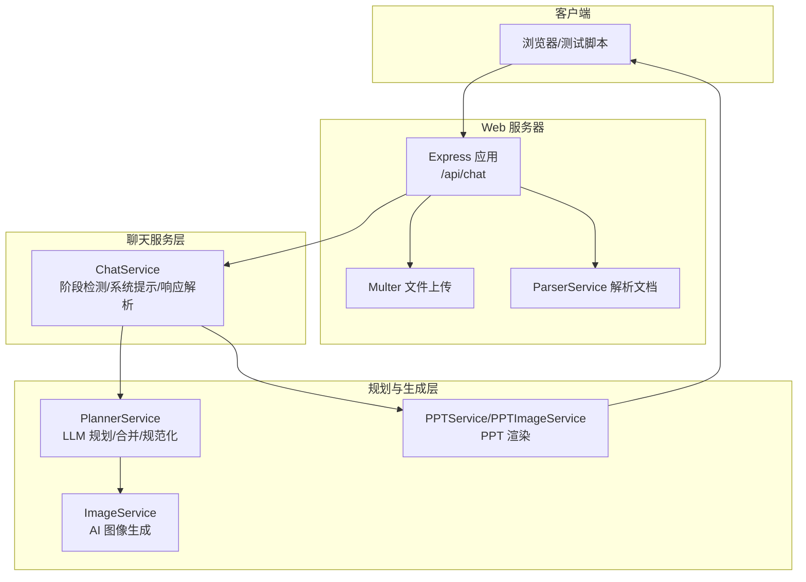
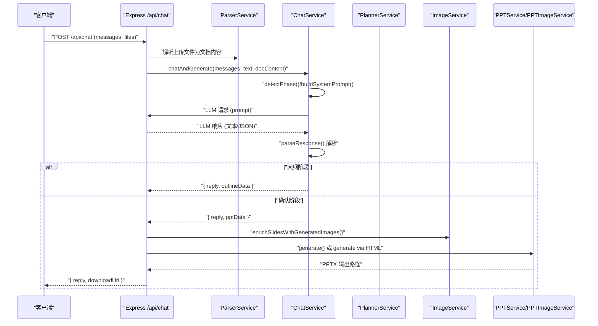
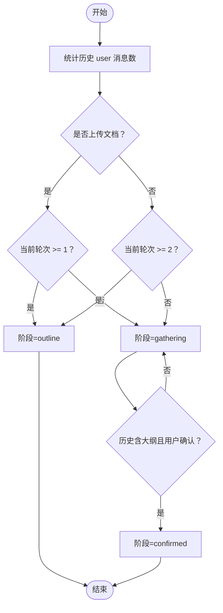
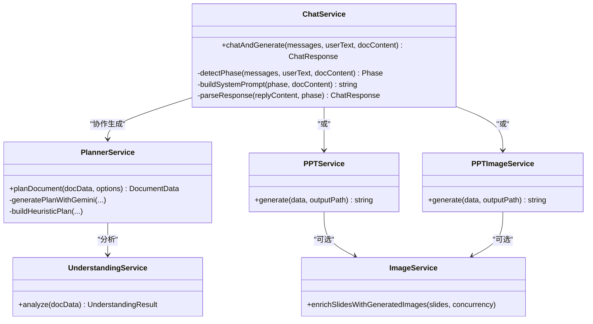

# 聊天交互服务

<cite>
**本文引用的文件列表**
- [chat.service.ts](file://src/services/chat.service.ts)
- [index.ts](file://src/index.ts)
- [types.ts](file://src/types.ts)
- [planner.service.ts](file://src/services/planner.service.ts)
- [ppt.service.ts](file://src/services/ppt.service.ts)
- [image.service.ts](file://src/services/image.service.ts)
- [ppt-image.service.ts](file://src/services/ppt-image.service.ts)
- [understanding.service.ts](file://src/services/understanding.service.ts)
- [package.json](file://package.json)
- [readme.md](file://readme.md)
- [test-chat.js](file://test-chat.js)
- [test-chat-upload.js](file://test-chat-upload.js)
</cite>

## 目录
1. [简介](#简介)
2. [项目结构](#项目结构)
3. [核心组件](#核心组件)
4. [架构总览](#架构总览)
5. [详细组件分析](#详细组件分析)
6. [依赖关系分析](#依赖关系分析)
7. [性能考量](#性能考量)
8. [故障排查指南](#故障排查指南)
9. [结论](#结论)
10. [附录](#附录)

## 简介
本文件面向 Generate-PPT 的“聊天交互服务”，系统性阐述对话式生成的完整流程，包括阶段检测、状态管理、响应解析与消息格式。文档重点说明聊天服务如何处理用户输入、维护对话历史、协调规划与 PPT 生成服务，并提供交互示例与错误处理策略，以及与规划服务和 PPT 生成服务的协作机制。

## 项目结构
聊天交互服务位于后端服务层，通过 Express 提供 REST 接口，接收用户文本与可选的多文件上传，调用聊天服务进行对话与大纲/最终数据生成，再协调图像生成与 PPT 渲染服务完成最终产物输出。



图表来源
- [index.ts:71-270](file://src/index.ts#L71-L270)
- [chat.service.ts:31-141](file://src/services/chat.service.ts#L31-L141)
- [planner.service.ts:53-101](file://src/services/planner.service.ts#L53-L101)
- [ppt.service.ts:52-75](file://src/services/ppt.service.ts#L52-L75)
- [ppt-image.service.ts:14-51](file://src/services/ppt-image.service.ts#L14-L51)
- [image.service.ts:4-28](file://src/services/image.service.ts#L4-L28)

章节来源
- [index.ts:71-270](file://src/index.ts#L71-L270)
- [package.json:18-44](file://package.json#L18-L44)

## 核心组件
- 聊天服务 ChatService：负责阶段检测、系统提示构建、LLM 请求、响应解析与结构化数据输出。
- 规划服务 PlannerService：基于源文档与偏好参数，生成/优化 PPT 计划，支持严格/创意模式与工作器代理。
- PPT 服务 PPTService 与 PPTImageService：分别提供原生模板渲染与 HTML→截图→PPT 的渲染管线。
- 图像服务 ImageService：为幻灯片生成 AI 图像，具备缓存与降级策略。
- 类型定义 types.ts：统一文档、幻灯片、简报、规划选项等数据结构。

章节来源
- [chat.service.ts:31-141](file://src/services/chat.service.ts#L31-L141)
- [planner.service.ts:53-101](file://src/services/planner.service.ts#L53-L101)
- [ppt.service.ts:52-75](file://src/services/ppt.service.ts#L52-L75)
- [ppt-image.service.ts:14-51](file://src/services/ppt-image.service.ts#L14-L51)
- [image.service.ts:4-28](file://src/services/image.service.ts#L4-L28)
- [types.ts:1-160](file://src/types.ts#L1-L160)

## 架构总览
聊天交互服务的端到端流程如下：
- 客户端通过 /api/chat 发送消息与可选文件。
- 服务解析上传文件，提取文档内容与原始图片，建立会话级图片缓存。
- ChatService 根据历史消息与用户输入检测阶段（需求收集/大纲/确认），构建系统提示与用户消息序列。
- 向外部 LLM API 发起请求，解析返回的 JSON 或大纲块，产出回复与结构化数据。
- 若为大纲阶段，返回 outlineData；若为确认阶段，返回 pptData 并进入 PPT 渲染。
- 渲染阶段可选择原生渲染或 HTML 截图渲染，并可按需生成 AI 图像。
- 最终返回回复文本与下载链接。



图表来源
- [index.ts:71-270](file://src/index.ts#L71-L270)
- [chat.service.ts:40-101](file://src/services/chat.service.ts#L40-L101)
- [planner.service.ts:84-101](file://src/services/planner.service.ts#L84-L101)
- [image.service.ts:15-28](file://src/services/image.service.ts#L15-L28)
- [ppt.service.ts:53-75](file://src/services/ppt.service.ts#L53-L75)
- [ppt-image.service.ts:18-51](file://src/services/ppt-image.service.ts#L18-L51)

## 详细组件分析

### 聊天协议与消息格式
- 消息结构：包含 role（system/user/assistant）与 content。
- 请求体字段：
  - messages：数组或 JSON 字符串，元素为 ChatMessage。
  - text：当前用户输入文本。
  - files：最多 5 个，支持 .md/.docx/.pdf/.png/.jpg。
- 响应体字段：
  - reply：回复文本。
  - outlineData：大纲阶段返回的结构化大纲数据。
  - pptData：确认阶段返回的最终 PPT 数据。
  - downloadUrl：PPT 下载地址（仅当生成成功时）。

章节来源
- [chat.service.ts:4-13](file://src/services/chat.service.ts#L4-L13)
- [index.ts:71-270](file://src/index.ts#L71-L270)

### 阶段检测与状态管理
- 阶段类型：
  - gathering：需求收集阶段，不输出结构化 JSON。
  - outline：输出大纲供用户确认，可直接返回 JSON 或大纲块。
  - confirmed：用户确认后，输出最终 JSON。
- 检测逻辑：
  - 识别用户确认语义（如“确认生成”、“开始生成”等）。
  - 检查历史中是否已出现大纲标记。
  - 根据用户消息数量与是否上传文档决定是否进入 outline。
  - 无文档时至少两轮对话才出大纲；有文档时一轮即可。



图表来源
- [chat.service.ts:109-141](file://src/services/chat.service.ts#L109-L141)

章节来源
- [chat.service.ts:109-141](file://src/services/chat.service.ts#L109-L141)

### 系统提示构建与响应解析
- 系统提示：
  - gathering：引导逐步收集需求，保持友好语气，限制每条回复长度。
  - outline：要求直接输出结构化 JSON，页数与要点数量规范。
  - confirmed：要求基于已确认大纲生成最终数据，强调 imagePrompt 的英文描述。
- 响应解析：
  - 优先解析 ```json 代码块；若为 outline 阶段但未包裹代码块，采用 response priming 逻辑尝试识别裸 JSON。
  - 若解析到大纲块 ```outline，则转换为 outlineData。
  - 若为 confirmed 阶段，确保 slides 字段存在并补全默认值，返回 pptData。
  - 若未解析到结构化数据，保留原始回复文本。

章节来源
- [chat.service.ts:171-270](file://src/services/chat.service.ts#L171-L270)
- [chat.service.ts:272-347](file://src/services/chat.service.ts#L272-L347)

### 对话历史维护与图片回填
- 会话级图片缓存：
  - 上传文档时提取原始图片，按文档标题映射与顺序收集，10 分钟 TTL 自动清理。
  - 确认生成阶段若未上传文件，尝试从缓存恢复图片，模糊匹配对话内容或取最近缓存。
- 图片回填策略：
  - 按标题精确匹配回填。
  - 未匹配到的空 slide 按顺序轮流分配剩余图片。
  - 统计回填数量并记录日志。

章节来源
- [index.ts:53-185](file://src/index.ts#L53-L185)
- [index.ts:194-227](file://src/index.ts#L194-L227)

### 与规划服务的协作
- PlannerService 在启用时参与生成流程：
  - 通过 heuristics 生成初稿，再调用 LLM 生成计划并与之合并。
  - 支持严格/创意模式、工作器代理、稀疏内容扩展、叙事连贯性强化等。
  - 输出规范化后的 DocumentData，包含 slides、brief、understanding 等。
- ChatService 与 PlannerService 的交互：
  - ChatService 在 confirmed 阶段返回的 pptData 即为 PlannerService 的输入之一（由 ChatService 生成）。
  - 两者共享相同的 DocumentData 结构与 SlideContent 字段。

章节来源
- [planner.service.ts:84-101](file://src/services/planner.service.ts#L84-L101)
- [planner.service.ts:103-162](file://src/services/planner.service.ts#L103-L162)
- [planner.service.ts:340-394](file://src/services/planner.service.ts#L340-L394)
- [types.ts:48-71](file://src/types.ts#L48-L71)

### 与 PPT 生成服务的协作
- 渲染模式：
  - 原生模式：使用 pptxgenjs 直接渲染，支持模板样式、仅图模式、保留文本等配置。
  - HTML 模式：先渲染 HTML 页面，再截图生成高清 PNG，最后以全屏图片写入 PPT。
- AI 图像生成：
  - 在渲染前可调用 ImageService 为每个幻灯片生成 AI 图像，支持并发控制与缓存。
- 输出：
  - 成功后返回 downloadUrl，客户端可直接下载。

章节来源
- [ppt.service.ts:52-75](file://src/services/ppt.service.ts#L52-L75)
- [ppt-image.service.ts:18-51](file://src/services/ppt-image.service.ts#L18-L51)
- [image.service.ts:15-28](file://src/services/image.service.ts#L15-L28)
- [index.ts:236-255](file://src/index.ts#L236-L255)

### 错误处理策略
- LLM API 失败：
  - 检查响应状态与 success 字段，抛出统一错误。
  - 记录错误日志并返回用户可读提示。
- 解析失败：
  - JSON 解析异常时记录错误并回退到普通回复。
  - outline 阶段未返回结构化数据时追加提示信息。
- 文件解析异常：
  - 单个文件解析失败不影响整体流程，记录错误并继续处理其他文件。
- 图像生成失败：
  - 主 API 失败时尝试简化提示词重试，再降级到备用 API 或本地占位图。
- 端到端错误：
  - /api/chat 统一捕获异常并返回 500 与错误信息。

章节来源
- [chat.service.ts:81-100](file://src/services/chat.service.ts#L81-L100)
- [chat.service.ts:328-331](file://src/services/chat.service.ts#L328-L331)
- [index.ts:266-269](file://src/index.ts#L266-L269)
- [image.service.ts:30-57](file://src/services/image.service.ts#L30-L57)

### 交互示例
- 健康检查：访问根路径确认服务运行。
- 仅文本聊天：发送一条用户消息，观察回复。
- 上传文件聊天：同时上传 .docx 或 .md，触发文档解析与图片缓存。
- 直接生成 PPT：使用 /generate-ppt 接口直接生成，适用于非对话式场景。

章节来源
- [test-chat-upload.js:47-189](file://test-chat-upload.js#L47-L189)
- [test-chat.js:4-29](file://test-chat.js#L4-L29)

## 依赖关系分析



图表来源
- [chat.service.ts:31-141](file://src/services/chat.service.ts#L31-L141)
- [planner.service.ts:53-101](file://src/services/planner.service.ts#L53-L101)
- [ppt.service.ts:52-75](file://src/services/ppt.service.ts#L52-L75)
- [ppt-image.service.ts:14-51](file://src/services/ppt-image.service.ts#L14-L51)
- [image.service.ts:4-28](file://src/services/image.service.ts#L4-L28)
- [understanding.service.ts:3-22](file://src/services/understanding.service.ts#L3-L22)

章节来源
- [chat.service.ts:31-141](file://src/services/chat.service.ts#L31-L141)
- [planner.service.ts:53-101](file://src/services/planner.service.ts#L53-L101)
- [ppt.service.ts:52-75](file://src/services/ppt.service.ts#L52-L75)
- [ppt-image.service.ts:14-51](file://src/services/ppt-image.service.ts#L14-L51)
- [image.service.ts:4-28](file://src/services/image.service.ts#L4-L28)
- [understanding.service.ts:3-22](file://src/services/understanding.service.ts#L3-L22)

## 性能考量
- 并发控制：图像生成支持并发参数，默认 2，可根据资源调整。
- 缓存策略：图像服务内置缓存，避免重复生成相同提示词的图片。
- 渲染模式选择：HTML 截图模式质量更高但耗时更长；原生模式更快但可定制性有限。
- 会话级图片缓存：减少重复解析与网络开销，提升确认生成阶段的体验。

章节来源
- [image.service.ts:199-216](file://src/services/image.service.ts#L199-L216)
- [index.ts:249-254](file://src/index.ts#L249-L254)

## 故障排查指南
- 无法连接 LLM API：
  - 检查环境变量 PLANNER_AUTH_TOKEN/IMAGE_API_KEY 与 PLANNER_API_BASE_URL/IMAGE_API_BASE_URL。
  - 使用 test-chat.js 进行健康检查。
- /api/chat 返回 500：
  - 查看服务端日志，定位具体异常位置。
  - 确认上传文件格式与大小限制（最多 5 个，单个文件大小受 Multer 限制）。
- 未返回结构化数据：
  - 确认用户输入是否包含确认语义，或是否已进入 outline 阶段。
  - 检查 LLM 返回内容是否包含 ```json 或 ```outline 标记。
- 图像生成失败：
  - 检查 IMAGE_API_KEY 是否正确配置。
  - 观察主 API 失败后的降级行为（简化提示词、备用 API、本地占位图）。

章节来源
- [readme.md:17-60](file://readme.md#L17-L60)
- [test-chat.js:4-29](file://test-chat.js#L4-L29)
- [index.ts:266-269](file://src/index.ts#L266-L269)
- [image.service.ts:30-57](file://src/services/image.service.ts#L30-L57)

## 结论
聊天交互服务通过“阶段检测—系统提示—响应解析”的闭环，实现了从需求收集到大纲确认再到最终 PPT 生成的完整对话式流程。其与规划服务、图像服务、PPT 渲染服务紧密协作，既保证了生成质量，又提供了灵活的渲染与图像策略。通过会话级图片缓存与错误处理机制，提升了用户体验与稳定性。

## 附录
- 环境变量参考：见 [readme.md:17-60](file://readme.md#L17-L60)。
- 测试脚本：见 [test-chat.js:4-29](file://test-chat.js#L4-L29)、[test-chat-upload.js:47-189](file://test-chat-upload.js#L47-L189)。
- 依赖包：见 [package.json:18-44](file://package.json#L18-L44)。