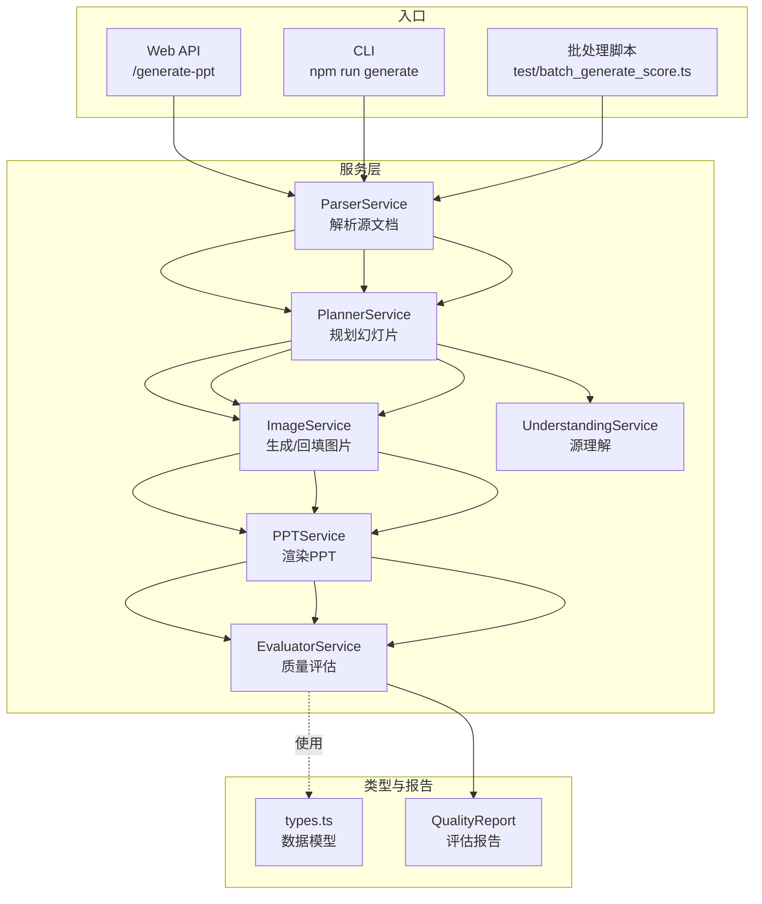
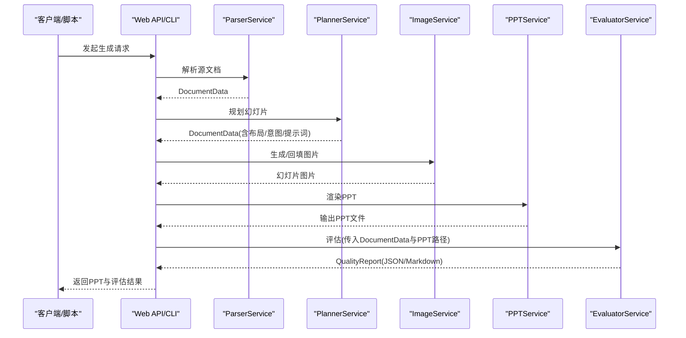
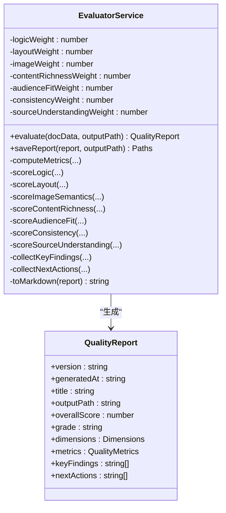
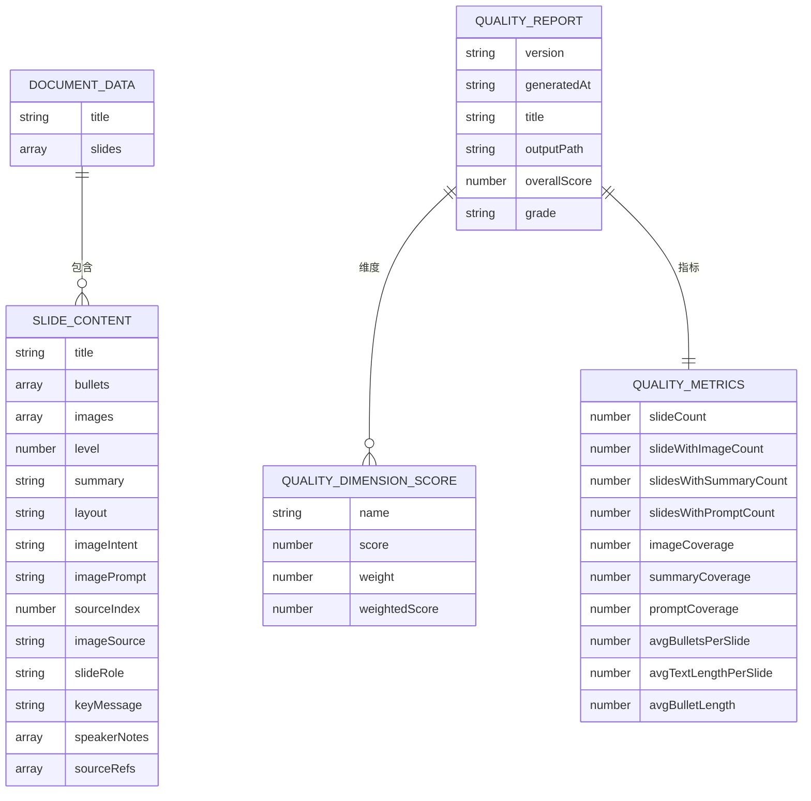
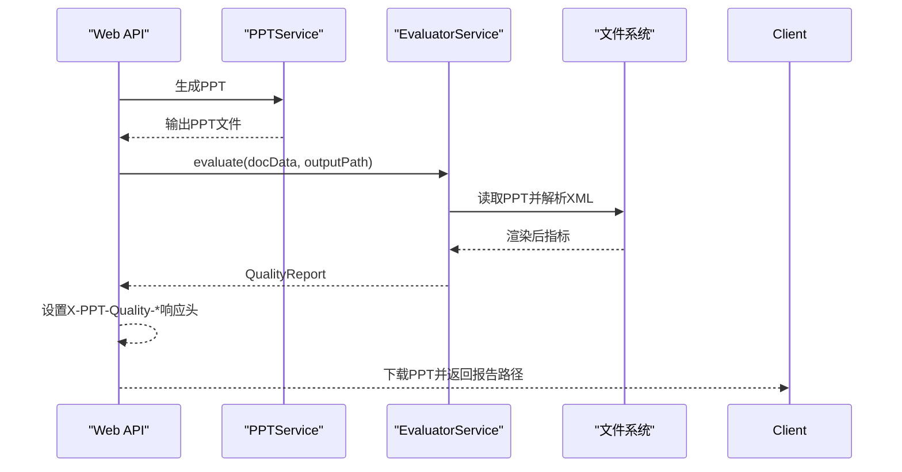
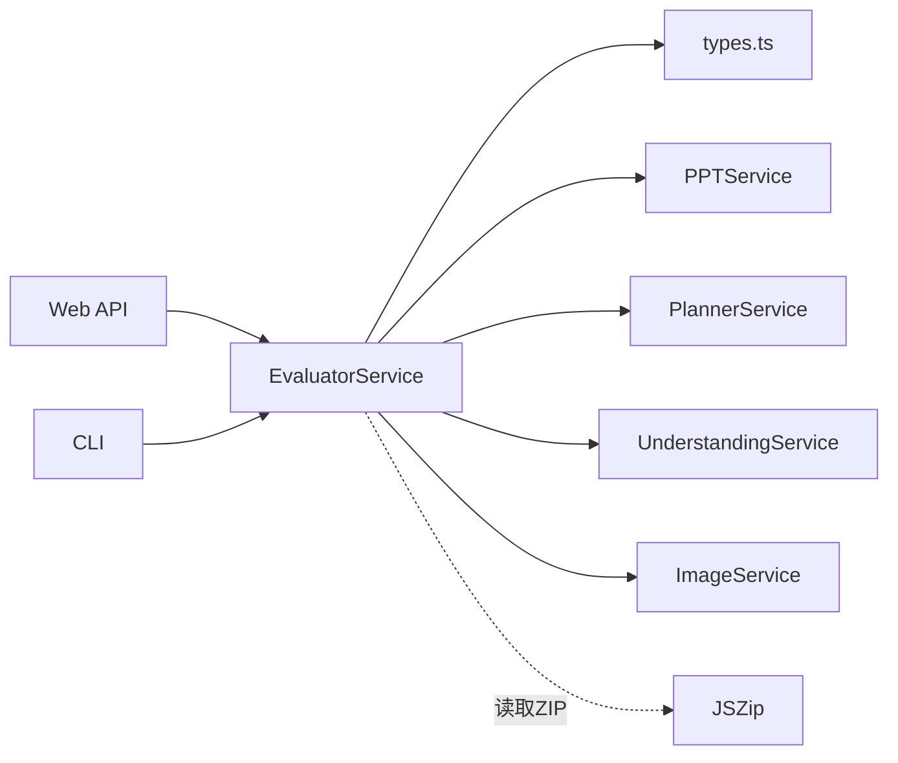

# 质量评估服务

<cite>
**本文引用的文件**
- [src/services/evaluator.service.ts](file://src/services/evaluator.service.ts)
- [src/types.ts](file://src/types.ts)
- [src/services/planner.service.ts](file://src/services/planner.service.ts)
- [src/services/ppt.service.ts](file://src/services/ppt.service.ts)
- [src/services/parser.service.ts](file://src/services/parser.service.ts)
- [src/services/image.service.ts](file://src/services/image.service.ts)
- [src/services/understanding.service.ts](file://src/services/understanding.service.ts)
- [src/index.ts](file://src/index.ts)
- [src/cli.ts](file://src/cli.ts)
- [test/batch_generate_score.ts](file://test/batch_generate_score.ts)
- [readme.md](file://readme.md)
- [package.json](file://package.json)
</cite>

## 目录
1. [简介](#简介)
2. [项目结构](#项目结构)
3. [核心组件](#核心组件)
4. [架构总览](#架构总览)
5. [详细组件分析](#详细组件分析)
6. [依赖分析](#依赖分析)
7. [性能考虑](#性能考虑)
8. [故障排查指南](#故障排查指南)
9. [结论](#结论)
10. [附录](#附录)

## 简介
本文件系统化阐述 Generate-PPT 的质量评估服务，围绕多维度评分体系的设计原理与实现逻辑展开，覆盖评估算法、指标定义、可视化报告生成、自动优化建议、权重配置与结果解释。文档还说明评估服务与 PPT 生成服务的集成方式与反馈机制，并给出评估准确性优化与性能考量建议。

## 项目结构
项目采用模块化分层设计，质量评估服务位于服务层，与解析、规划、图像生成、PPT 渲染等服务协同工作；通过 Web API 与 CLI 提供统一的生成与评估入口；批处理脚本支持批量评估与统计汇总。

图示来源
- [src/index.ts:314-428](file://src/index.ts#L314-L428)
- [src/cli.ts:65-170](file://src/cli.ts#L65-L170)
- [test/batch_generate_score.ts:274-431](file://test/batch_generate_score.ts#L274-L431)
- [src/services/evaluator.service.ts:23-93](file://src/services/evaluator.service.ts#L23-L93)
- [src/types.ts:82-159](file://src/types.ts#L82-L159)

章节来源
- [src/index.ts:314-428](file://src/index.ts#L314-L428)
- [src/cli.ts:65-170](file://src/cli.ts#L65-L170)
- [test/batch_generate_score.ts:274-431](file://test/batch_generate_score.ts#L274-L431)

## 核心组件
- 评估服务（EvaluatorService）：负责对生成的 PPT 进行多维度评分，产出结构化报告与建议。
- 规划服务（PlannerService）：基于源文档与偏好生成幻灯片计划，提供布局、意图与提示词等基础信息。
- 图像服务（ImageService）：为幻灯片生成或回填图片，支撑“图像语义”维度评估。
- PPT 渲染服务（PPTService）：将规划后的文档渲染为 PPT 文件，供评估服务抽样分析。
- 解析服务（ParserService）：将 Markdown/Docx/PDF 解析为统一的文档数据结构。
- 源理解服务（UnderstandingService）：抽取主题、信号词、论点等，辅助“源理解”维度评估。
- 类型系统（types.ts）：定义文档、幻灯片、质量维度、报告等核心数据结构。

章节来源
- [src/services/evaluator.service.ts:23-93](file://src/services/evaluator.service.ts#L23-L93)
- [src/services/planner.service.ts:53-101](file://src/services/planner.service.ts#L53-L101)
- [src/services/image.service.ts:4-28](file://src/services/image.service.ts#L4-L28)
- [src/services/ppt.service.ts:52-75](file://src/services/ppt.service.ts#L52-L75)
- [src/services/parser.service.ts:11-97](file://src/services/parser.service.ts#L11-L97)
- [src/services/understanding.service.ts:3-22](file://src/services/understanding.service.ts#L3-L22)
- [src/types.ts:48-159](file://src/types.ts#L48-L159)

## 架构总览
评估服务在 PPT 生成完成后执行，结合“已生成 PPT 文件”与“规划阶段的文本内容”，计算多维指标并加权汇总，输出 JSON 与 Markdown 报告，同时通过 HTTP 头或 CLI 输出返回关键指标。

图示来源
- [src/index.ts:314-428](file://src/index.ts#L314-L428)
- [src/cli.ts:65-170](file://src/cli.ts#L65-L170)
- [src/services/evaluator.service.ts:32-93](file://src/services/evaluator.service.ts#L32-L93)

## 详细组件分析

### 评估服务（EvaluatorService）
- 多维度评分
  - 内容逻辑（Content Logic）：检查标题完整性、重复标题、通用标题、层级跳跃、弱过渡、同页重复、子弹密度、标题缺失等。
  - 布局质量（Layout Quality）：关注图像覆盖率、渲染后图像覆盖率、溢出风险、元数据泄漏、布局重复性、叠加页文字密度等。
  - 图像语义（Image Semantics）：提示覆盖率、提示对齐度、回退图片数量、渲染图像多样性、视觉优先输出下的权重下调。
  - 内容丰富度（Content Richness）：稀疏页惩罚、平均字数、摘要覆盖率、视觉优先输出下的补偿策略。
  - 受众适配（Audience Fit）：行动线索覆盖率、子弹长度分布、摘要覆盖率、渲染后指令文本与混合语言检测、最终页行动提示。
  - 一致性（Consistency）：标题风格一致性、过渡一致性、跨页完整性差距、布局模式重复、提示与摘要一致性、回退图片与元数据泄漏。
  - 源理解（Source Understanding）：主题覆盖率、章节覆盖率、论点契合度、信号词保留、引用覆盖率、标题改写比例与支撑度、结尾合成层。
- 权重配置
  - 内容逻辑：17%
  - 布局质量：14%
  - 图像语义：12%
  - 内容丰富度：15%
  - 受众适配：14%
  - 一致性：10%
  - 源理解：18%
- 渲染后抽样分析
  - 评估服务可读取生成的 PPT 文件，解析 XML 获取每页文本与图片目标，识别元数据泄漏、指令文本、混合语言等。
- 报告生成
  - 输出 JSON 与 Markdown，包含各维度得分、证据、问题与建议、关键发现与下一步行动清单。
- 自动优化建议
  - 基于维度问题与证据，汇总形成可操作的建议集合，如“减少重复标题”“提升图像覆盖率”“增强摘要覆盖率”等。

图示来源
- [src/services/evaluator.service.ts:23-93](file://src/services/evaluator.service.ts#L23-L93)
- [src/types.ts:140-159](file://src/types.ts#L140-L159)

章节来源
- [src/services/evaluator.service.ts:23-93](file://src/services/evaluator.service.ts#L23-L93)
- [src/services/evaluator.service.ts:325-356](file://src/services/evaluator.service.ts#L325-L356)
- [src/services/evaluator.service.ts:401-482](file://src/services/evaluator.service.ts#L401-L482)
- [src/services/evaluator.service.ts:484-550](file://src/services/evaluator.service.ts#L484-L550)
- [src/services/evaluator.service.ts:552-625](file://src/services/evaluator.service.ts#L552-L625)
- [src/services/evaluator.service.ts:627-698](file://src/services/evaluator.service.ts#L627-L698)
- [src/services/evaluator.service.ts:700-772](file://src/services/evaluator.service.ts#L700-L772)
- [src/services/evaluator.service.ts:774-862](file://src/services/evaluator.service.ts#L774-L862)
- [src/services/evaluator.service.ts:864-985](file://src/services/evaluator.service.ts#L864-L985)
- [src/services/evaluator.service.ts:1426-1469](file://src/services/evaluator.service.ts#L1426-L1469)
- [src/services/evaluator.service.ts:1500-1526](file://src/services/evaluator.service.ts#L1500-L1526)

### 数据模型与报告结构
- 文档数据（DocumentData）：标题、幻灯片数组、简要信息、源理解结果。
- 幻灯片（SlideContent）：标题、要点、图片、层级、摘要、布局、意图、提示词、来源索引、图片来源、角色、关键信息、演讲者备注、引用。
- 质量维度分数（QualityDimensionScore）：名称、得分、权重、加权得分、证据、问题、建议。
- 质量指标（QualityMetrics）：覆盖度、密度、重复项、稀疏度、溢出风险、提示对齐、回退图片、渲染后指标、源理解指标等。
- 质量报告（QualityReport）：版本、生成时间、标题、输出路径、总分、等级、维度、指标、关键发现、下一步行动。

图示来源
- [src/types.ts:48-159](file://src/types.ts#L48-L159)

章节来源
- [src/types.ts:48-159](file://src/types.ts#L48-L159)

### 评估算法与指标定义
- 指标计算
  - 覆盖率类：图像覆盖率、摘要覆盖率、提示覆盖率、渲染后图像覆盖率、渲染后文本覆盖率。
  - 密度类：平均子弹数、平均字数、平均子弹长度、提示对齐均值。
  - 结构类：层级跳跃违规数、重复标题数、通用标题数、弱过渡数、行动线索数、稀疏页数（普通/严重）、溢出风险页数。
  - 视觉类：叠加页数、仅图页数、主导布局比例、渲染后图像唯一性比率、是否“视觉优先”输出。
  - 源理解类：主题覆盖率、章节覆盖率、信号覆盖率、信号数量、引用覆盖率、论点契合度、标题改写比例（改写/复制/不支持）。
- 算法要点
  - 维度得分经加权求和得到总分，四舍五入至小数点后一位。
  - “视觉优先”输出（渲染后文本覆盖率低、平均字数低）时，部分文本导向的维度（如标题、过渡、摘要覆盖率）权重下调。
  - 关键问题触发时，最终得分不超过 98，确保问题可见性。

章节来源
- [src/services/evaluator.service.ts:285-356](file://src/services/evaluator.service.ts#L285-L356)
- [src/services/evaluator.service.ts:1471-1484](file://src/services/evaluator.service.ts#L1471-L1484)

### 可视化报告与自动优化建议
- 报告格式
  - JSON：完整指标与维度明细，便于程序消费。
  - Markdown：表格化维度得分、指标 JSON、关键发现、建议清单，便于人工审阅。
- 关键发现与建议
  - 汇总图像覆盖率、摘要覆盖率、稀疏页数量、源主题/章节覆盖率、各维度得分、回退图片数量、溢出风险、元数据泄漏、混合语言等。
  - 建议去重、补全摘要、提升图像覆盖率、改善提示对齐、减少弱过渡与重复标题、控制布局重复性等。

章节来源
- [src/services/evaluator.service.ts:1426-1469](file://src/services/evaluator.service.ts#L1426-L1469)
- [src/services/evaluator.service.ts:1486-1490](file://src/services/evaluator.service.ts#L1486-L1490)
- [src/services/evaluator.service.ts:1500-1526](file://src/services/evaluator.service.ts#L1500-L1526)

### 评估服务与 PPT 生成服务的集成与反馈
- Web API 集成
  - 在生成 PPT 后调用评估服务，若启用评估，则设置响应头携带质量分数、等级与报告路径，并返回 PPT 文件。
- CLI 集成
  - 生成完成后调用评估服务，打印分数与报告路径。
- 批处理脚本
  - 对输入目录内多个文档进行批量生成与评估，汇总平均分与结果列表，输出汇总 JSON 与 Markdown。

图示来源
- [src/index.ts:408-417](file://src/index.ts#L408-L417)
- [src/services/evaluator.service.ts:110-162](file://src/services/evaluator.service.ts#L110-L162)

章节来源
- [src/index.ts:408-417](file://src/index.ts#L408-L417)
- [src/cli.ts:153-160](file://src/cli.ts#L153-L160)
- [test/batch_generate_score.ts:362-378](file://test/batch_generate_score.ts#L362-L378)

### 评估准确性优化与性能考量
- 准确性优化
  - 通过“视觉优先”判定动态调整文本导向维度权重，避免纯图像输出误导评分。
  - 引入渲染后指标（如渲染后图像覆盖率、唯一图像比）作为补偿信号，提升视觉叙事质量评估的稳健性。
  - 源理解维度引入主题、章节、信号词与论点契合度，确保内容与源材料一致。
- 性能考量
  - 评估服务读取 ZIP 包解析 XML，注意异常捕获与降级（返回空渲染指标），避免阻塞主流程。
  - 批处理脚本支持并发生成与评估，但评估本身为 CPU/IO 混合任务，建议合理设置并发与资源限制。

章节来源
- [src/services/evaluator.service.ts:110-162](file://src/services/evaluator.service.ts#L110-L162)
- [src/services/evaluator.service.ts:1471-1484](file://src/services/evaluator.service.ts#L1471-L1484)
- [test/batch_generate_score.ts:331-332](file://test/batch_generate_score.ts#L331-L332)

## 依赖分析
- 评估服务依赖
  - types.ts：数据结构定义。
  - PPTService：生成 PPT 文件，供评估服务抽样分析。
  - PlannerService：提供布局、意图、提示词等规划信息。
  - UnderstandingService：提供源理解结果，支撑“源理解”维度。
  - ImageService：生成图片，影响“图像语义”维度。
- 外部依赖
  - JSZip：解析 PPT ZIP 包，提取 XML 与关系文件。
  - Express/Multer：Web API 与文件上传。
  - Axios：图像生成 API 调用。

图示来源
- [src/services/evaluator.service.ts:1-10](file://src/services/evaluator.service.ts#L1-L10)
- [package.json:29-30](file://package.json#L29-L30)
- [src/index.ts:9-13](file://src/index.ts#L9-L13)
- [src/cli.ts:5-10](file://src/cli.ts#L5-L10)

章节来源
- [src/services/evaluator.service.ts:1-10](file://src/services/evaluator.service.ts#L1-L10)
- [package.json:29-30](file://package.json#L29-L30)
- [src/index.ts:9-13](file://src/index.ts#L9-L13)
- [src/cli.ts:5-10](file://src/cli.ts#L5-L10)

## 性能考虑
- I/O 与解析
  - ZIP 解析与 XML 提取为同步 IO 操作，建议在批处理场景中控制并发，避免磁盘争用。
- 计算复杂度
  - 关键词提取与重叠计算为 O(n) 到 O(n log n)，在幻灯片较多时需关注内存占用。
- 网络与外部服务
  - 图像生成依赖外部 API，建议设置超时与重试策略，评估服务内置回退方案以保证稳定性。

## 故障排查指南
- 评估报告为空或渲染指标为零
  - 检查 PPT 路径是否存在且可读。
  - 确认 ZIP 包结构与 XML 字段是否符合预期。
- 评估报错或警告
  - 查看控制台日志中的错误消息，确认 ZIP 解析异常或 XML 字段缺失。
- Web API 未返回评估头
  - 确认环境变量 ENABLE_EVALUATION 是否开启。
  - 检查评估服务是否抛出异常导致流程中断。
- CLI 未输出报告路径
  - 确认 ENABLE_EVALUATION 开启，评估服务返回报告路径并在控制台打印。

章节来源
- [src/services/evaluator.service.ts:158-162](file://src/services/evaluator.service.ts#L158-L162)
- [src/index.ts:408-417](file://src/index.ts#L408-L417)
- [src/cli.ts:153-160](file://src/cli.ts#L153-L160)

## 结论
质量评估服务通过多维度指标与权重配置，对生成的 PPT 进行全面的质量诊断，结合渲染后抽样分析与源理解信息，提供可操作的优化建议。其与解析、规划、图像与渲染服务无缝集成，既可通过 Web API 实时反馈，也可通过 CLI 与批处理脚本进行批量评估与统计，满足不同场景下的质量保障需求。

## 附录

### 评分标准与等级
- 等级划分
  - A: ≥90 分
  - B: ≥80 分
  - C: ≥70 分
  - D: ≥60 分
  - E: <60 分

章节来源
- [src/services/evaluator.service.ts:1492-1498](file://src/services/evaluator.service.ts#L1492-L1498)

### 报告格式说明
- JSON 报告字段
  - 版本、生成时间、标题、输出路径、总分、等级、维度明细、指标、关键发现、下一步行动。
- Markdown 报告字段
  - 标题、生成时间、总分、等级、维度表格、指标 JSON、关键发现、建议清单。

章节来源
- [src/types.ts:140-159](file://src/types.ts#L140-L159)
- [src/services/evaluator.service.ts:1500-1526](file://src/services/evaluator.service.ts#L1500-L1526)

### 评估示例（流程示意）
- 输入：Markdown/Docx/PDF 文档
- 步骤：解析 → 规划 → 生成图片 → 渲染 PPT → 评估 → 生成报告
- 输出：PPT 文件、质量分数、等级、JSON/Markdown 报告

章节来源
- [src/services/parser.service.ts:11-97](file://src/services/parser.service.ts#L11-L97)
- [src/services/planner.service.ts:84-101](file://src/services/planner.service.ts#L84-L101)
- [src/services/image.service.ts:15-28](file://src/services/image.service.ts#L15-L28)
- [src/services/ppt.service.ts:52-75](file://src/services/ppt.service.ts#L52-L75)
- [src/services/evaluator.service.ts:32-93](file://src/services/evaluator.service.ts#L32-L93)