# 架构设计

<cite>
**本文引用的文件**   
- [package.json](file://package.json)
- [readme.md](file://readme.md)
- [src/index.ts](file://src/index.ts)
- [src/types.ts](file://src/types.ts)
- [src/cli.ts](file://src/cli.ts)
- [src/polyfills.ts](file://src/polyfills.ts)
- [src/services/parser.service.ts](file://src/services/parser.service.ts)
- [src/services/planner.service.ts](file://src/services/planner.service.ts)
- [src/services/image.service.ts](file://src/services/image.service.ts)
- [src/services/ppt.service.ts](file://src/services/ppt.service.ts)
- [src/services/ppt-image.service.ts](file://src/services/ppt-image.service.ts)
- [src/services/screenshot.service.ts](file://src/services/screenshot.service.ts)
- [src/services/slide-renderer.service.ts](file://src/services/slide-renderer.service.ts)
- [src/services/chat.service.ts](file://src/services/chat.service.ts)
- [src/services/evaluator.service.ts](file://src/services/evaluator.service.ts)
</cite>

## 目录
1. [引言](#引言)
2. [项目结构](#项目结构)
3. [核心组件](#核心组件)
4. [架构总览](#架构总览)
5. [详细组件分析](#详细组件分析)
6. [依赖分析](#依赖分析)
7. [性能考量](#性能考量)
8. [故障排查指南](#故障排查指南)
9. [结论](#结论)
10. [附录](#附录)

## 引言
Generate-PPT 是一个面向 Word/Markdown/PDF 的统一文档到 PPT 的自动化流水线系统。其目标是在保留源文档层级结构的前提下，通过“解析-规划-图像生成-渲染-评估”的闭环，输出高质量的演示文稿，并提供可量化的质量报告。

系统支持两种渲染路径：
- 传统路径：pptxgenjs 直接写入 PPTX。
- HTML→PNG→PPT 路径：通过 Puppeteer 将每页幻灯片渲染为高清 PNG，再嵌入 PPTX，以获得更强的视觉表现力。

系统同时提供 Web API 与 CLI 两种入口，便于集成与批量处理。

## 项目结构
项目采用按职责分层的模块化组织方式：
- 入口层：HTTP 服务器与 CLI 启动器
- 控制器层：路由与请求处理（Express）
- 业务服务层：解析、规划、图像、渲染、评估等核心服务
- 类型定义层：统一的数据结构与枚举
- 基础设施：Puppeteer 浏览器、多文件上传、静态资源、输出目录

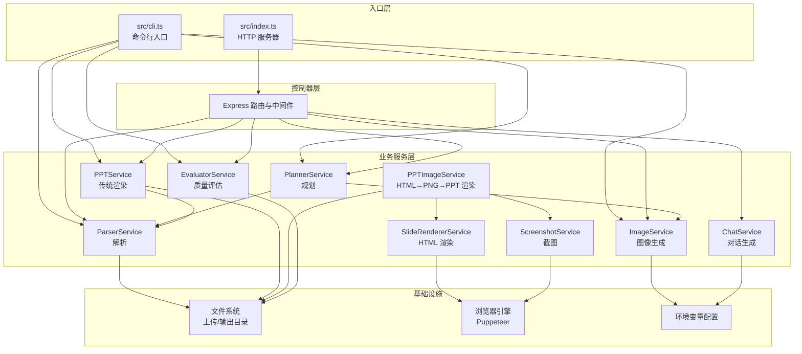

图表来源
- [src/index.ts:1-432](file://src/index.ts#L1-L432)
- [src/cli.ts:1-176](file://src/cli.ts#L1-L176)
- [src/services/parser.service.ts:1-453](file://src/services/parser.service.ts#L1-L453)
- [src/services/planner.service.ts:1-800](file://src/services/planner.service.ts#L1-L800)
- [src/services/image.service.ts:1-218](file://src/services/image.service.ts#L1-L218)
- [src/services/ppt.service.ts:1-800](file://src/services/ppt.service.ts#L1-L800)
- [src/services/ppt-image.service.ts:1-53](file://src/services/ppt-image.service.ts#L1-L53)
- [src/services/screenshot.service.ts:1-77](file://src/services/screenshot.service.ts#L1-L77)
- [src/services/slide-renderer.service.ts:1-546](file://src/services/slide-renderer.service.ts#L1-L546)
- [src/services/chat.service.ts:1-400](file://src/services/chat.service.ts#L1-L400)
- [src/services/evaluator.service.ts:1-800](file://src/services/evaluator.service.ts#L1-L800)

章节来源
- [package.json:1-45](file://package.json#L1-L45)
- [readme.md:1-131](file://readme.md#L1-L131)
- [src/index.ts:1-432](file://src/index.ts#L1-L432)
- [src/cli.ts:1-176](file://src/cli.ts#L1-L176)

## 核心组件
- 解析服务（ParserService）：从 Markdown/Docx/PDF 提取标题、要点与图片，构建结构化文档数据。
- 规划服务（PlannerService）：结合用户偏好与源内容，生成结构化幻灯片大纲与图像提示词；支持本地启发式与外部 LLM 规划。
- 图像服务（ImageService）：调用外部图像接口生成幻灯片配图，具备缓存与降级策略。
- 渲染服务（PPTService）：使用 pptxgenjs 直接生成 PPTX。
- HTML 渲染与截图（PPTImageService + SlideRendererService + ScreenshotService）：将每页幻灯片渲染为 HTML，Puppeteer 截图为 PNG，再写入 PPTX。
- 对话服务（ChatService）：支持多轮对话生成 PPT 大纲与最终数据。
- 评估服务（EvaluatorService）：对生成的 PPT 进行多维度质量评分与报告输出。
- 类型系统（types.ts）：统一定义文档、幻灯片、规划参数、质量指标等数据结构。

章节来源
- [src/services/parser.service.ts:1-453](file://src/services/parser.service.ts#L1-L453)
- [src/services/planner.service.ts:1-800](file://src/services/planner.service.ts#L1-L800)
- [src/services/image.service.ts:1-218](file://src/services/image.service.ts#L1-L218)
- [src/services/ppt.service.ts:1-800](file://src/services/ppt.service.ts#L1-L800)
- [src/services/ppt-image.service.ts:1-53](file://src/services/ppt-image.service.ts#L1-L53)
- [src/services/slide-renderer.service.ts:1-546](file://src/services/slide-renderer.service.ts#L1-L546)
- [src/services/screenshot.service.ts:1-77](file://src/services/screenshot.service.ts#L1-L77)
- [src/services/chat.service.ts:1-400](file://src/services/chat.service.ts#L1-L400)
- [src/services/evaluator.service.ts:1-800](file://src/services/evaluator.service.ts#L1-L800)
- [src/types.ts:1-160](file://src/types.ts#L1-L160)

## 架构总览
系统采用分层架构与服务导向设计：
- 分层架构：入口层（HTTP/CLI）、控制器层（路由/中间件）、业务层（服务）、基础设施层（文件/Puppeteer/网络）。
- 服务导向：各核心能力封装为独立服务，通过明确定义的输入输出进行协作。
- 事件驱动与异步：图像生成、截图、评估等耗时操作采用并发与异步处理，提升吞吐。
- 可插拔渲染：通过运行时配置切换渲染路径（传统 vs HTML→PNG）。

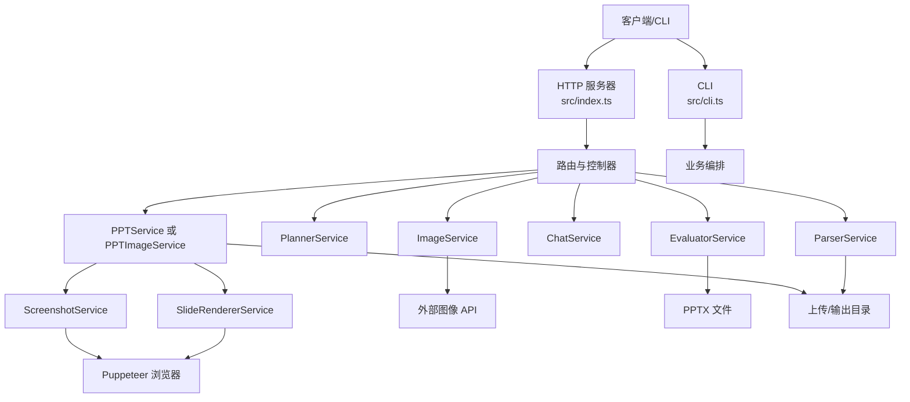

图表来源
- [src/index.ts:1-432](file://src/index.ts#L1-L432)
- [src/cli.ts:1-176](file://src/cli.ts#L1-L176)
- [src/services/parser.service.ts:1-453](file://src/services/parser.service.ts#L1-L453)
- [src/services/planner.service.ts:1-800](file://src/services/planner.service.ts#L1-L800)
- [src/services/image.service.ts:1-218](file://src/services/image.service.ts#L1-L218)
- [src/services/ppt.service.ts:1-800](file://src/services/ppt.service.ts#L1-L800)
- [src/services/ppt-image.service.ts:1-53](file://src/services/ppt-image.service.ts#L1-L53)
- [src/services/slide-renderer.service.ts:1-546](file://src/services/slide-renderer.service.ts#L1-L546)
- [src/services/screenshot.service.ts:1-77](file://src/services/screenshot.service.ts#L1-L77)
- [src/services/chat.service.ts:1-400](file://src/services/chat.service.ts#L1-L400)
- [src/services/evaluator.service.ts:1-800](file://src/services/evaluator.service.ts#L1-L800)

## 详细组件分析

### 组件 A：HTTP 服务器与路由（src/index.ts）
- 功能：启动 Express 服务，挂载 CORS、JSON、静态资源与上传中间件；提供 /generate-ppt 与 /api/chat 两个核心接口。
- 关键流程：
  - 上传文件解析：使用 multer 存储至 uploads 目录，按扩展名选择解析器。
  - 规划与渲染：调用 PlannerService 与 ImageService，随后按配置选择 PPTService 或 PPTImageService。
  - 质量评估：可选开启，生成质量报告并设置响应头。
  - 对话生成：/api/chat 支持多轮对话，结合文档内容生成 PPT 大纲或最终数据。
- 并发与缓存：会话级图片缓存（10 分钟 TTL），避免重复生成。

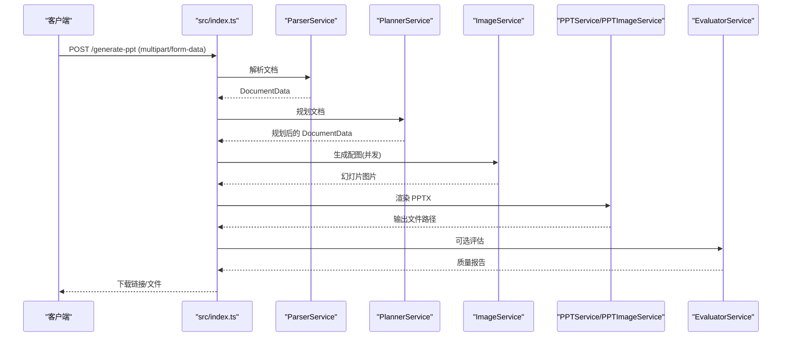

图表来源
- [src/index.ts:314-427](file://src/index.ts#L314-L427)
- [src/services/parser.service.ts:1-453](file://src/services/parser.service.ts#L1-L453)
- [src/services/planner.service.ts:1-800](file://src/services/planner.service.ts#L1-L800)
- [src/services/image.service.ts:1-218](file://src/services/image.service.ts#L1-L218)
- [src/services/ppt.service.ts:1-800](file://src/services/ppt.service.ts#L1-L800)
- [src/services/ppt-image.service.ts:1-53](file://src/services/ppt-image.service.ts#L1-L53)
- [src/services/evaluator.service.ts:1-800](file://src/services/evaluator.service.ts#L1-L800)

章节来源
- [src/index.ts:1-432](file://src/index.ts#L1-L432)

### 组件 B：解析服务（ParserService）
- 功能：从 Markdown/Docx/PDF 提取标题、要点与图片，构建统一的 DocumentData 结构。
- 特性：
  - Markdown：按标题与列表层级构建幻灯片，支持内联图片抽取。
  - Docx：解析 HTML 结构，优先提取顶层列表/标题，其次按段落分块。
  - PDF：按段落分割为幻灯片，自动截断标题长度。
- 性能：PDF 解析按需加载（懒加载 pdf-parse），避免在旧运行时强制依赖。

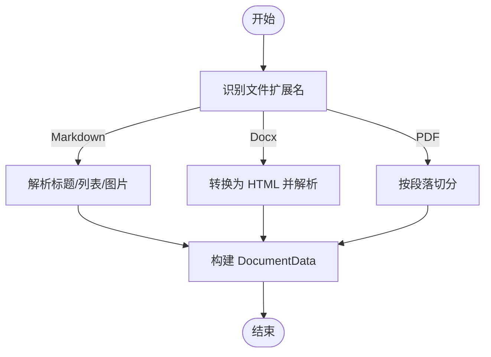

图表来源
- [src/services/parser.service.ts:11-167](file://src/services/parser.service.ts#L11-L167)

章节来源
- [src/services/parser.service.ts:1-453](file://src/services/parser.service.ts#L1-L453)

### 组件 C：规划服务（PlannerService）
- 功能：将解析结果转化为结构化幻灯片计划，生成 imagePrompt 与布局建议。
- 特性：
  - 本地启发式：基于源内容与偏好推导标题、角色、布局与要点。
  - 外部 LLM：可选通过 /api/llm/direct 获取结构化 JSON 计划；支持工作器代理模式。
  - 合并策略：将 LLM 计划与启发式计划融合，增强一致性与质量。
  - 扩展策略：对稀疏幻灯片进行内容扩展，保证信息密度。
- 安全与合规：严格遵循“事实性”约束，避免引入未证实信息。

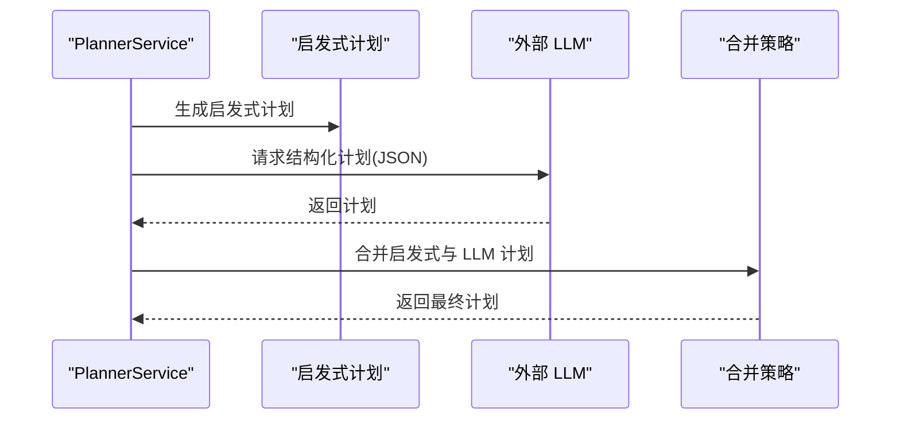

图表来源
- [src/services/planner.service.ts:84-101](file://src/services/planner.service.ts#L84-L101)
- [src/services/planner.service.ts:103-162](file://src/services/planner.service.ts#L103-L162)
- [src/services/planner.service.ts:798-800](file://src/services/planner.service.ts#L798-L800)

章节来源
- [src/services/planner.service.ts:1-800](file://src/services/planner.service.ts#L1-L800)

### 组件 D：图像服务（ImageService）
- 功能：为每页幻灯片生成配图，支持缓存与降级。
- 特性：
  - 主 API：调用外部图像接口，支持 16:9、2K 分辨率。
  - 缓存：基于提示词哈希缓存，避免重复请求。
  - 降级：主 API 失败时尝试简化提示词与备用图片源。
  - 并发：按并发度限制执行，提高吞吐。

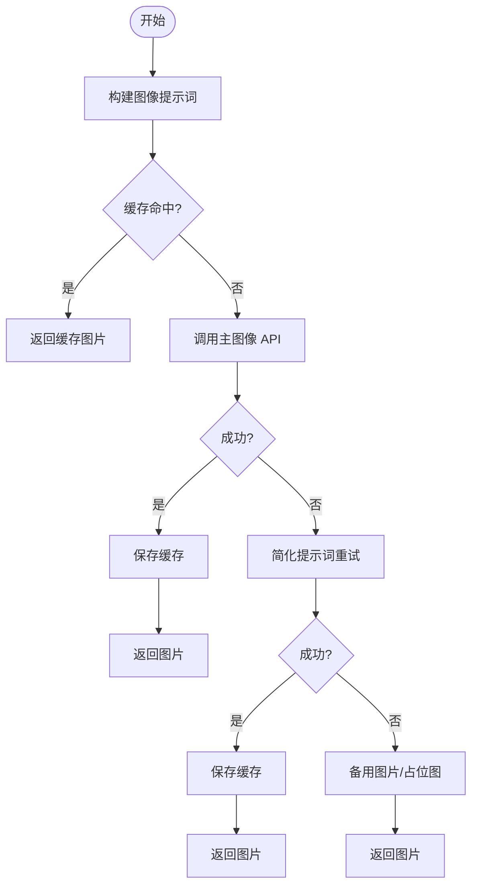

图表来源
- [src/services/image.service.ts:15-57](file://src/services/image.service.ts#L15-L57)
- [src/services/image.service.ts:59-102](file://src/services/image.service.ts#L59-L102)
- [src/services/image.service.ts:104-120](file://src/services/image.service.ts#L104-L120)
- [src/services/image.service.ts:199-216](file://src/services/image.service.ts#L199-L216)

章节来源
- [src/services/image.service.ts:1-218](file://src/services/image.service.ts#L1-L218)

### 组件 E：渲染服务（PPTService 与 PPTImageService）
- PPTService（传统路径）：
  - 使用 pptxgenjs 直接写入 PPTX，支持模板样式、仅图模式、文本保留等配置。
  - 针对不同 slideRole（目录、正文、对比、时间线、总结、下一步）生成专用布局。
- PPTImageService（HTML→PNG→PPT 路径）：
  - 通过 SlideRendererService 生成每页 HTML，Puppeteer 截图为 PNG，再嵌入 PPTX。
  - 适合追求更强视觉表现的场景，输出分辨率更高。

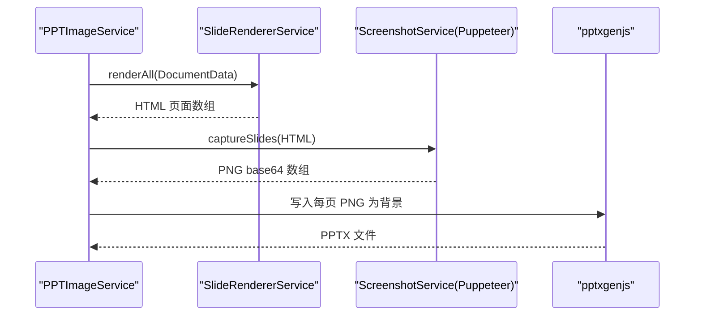

图表来源
- [src/services/ppt-image.service.ts:18-51](file://src/services/ppt-image.service.ts#L18-L51)
- [src/services/slide-renderer.service.ts:14-46](file://src/services/slide-renderer.service.ts#L14-L46)
- [src/services/screenshot.service.ts:15-52](file://src/services/screenshot.service.ts#L15-L52)
- [src/services/ppt.service.ts:46-68](file://src/services/ppt.service.ts#L46-L68)

章节来源
- [src/services/ppt.service.ts:1-800](file://src/services/ppt.service.ts#L1-L800)
- [src/services/ppt-image.service.ts:1-53](file://src/services/ppt-image.service.ts#L1-L53)
- [src/services/slide-renderer.service.ts:1-546](file://src/services/slide-renderer.service.ts#L1-L546)
- [src/services/screenshot.service.ts:1-77](file://src/services/screenshot.service.ts#L1-L77)

### 组件 F：对话服务（ChatService）
- 功能：支持多轮对话生成 PPT 大纲与最终数据。
- 阶段：
  - gathering：需求收集阶段，逐步了解用途、受众、风格、页数与重点。
  - outline：输出结构化大纲（JSON/大纲预览）供用户确认。
  - confirmed：用户确认后，生成最终 PPT 数据。
- 提示工程：针对不同阶段构建系统提示，确保输出结构化 JSON。

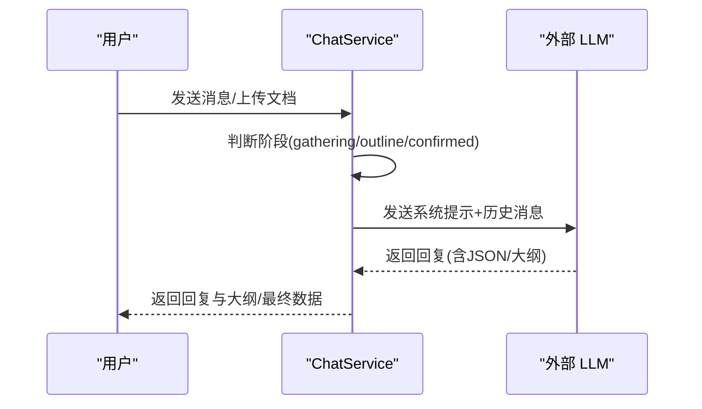

图表来源
- [src/services/chat.service.ts:40-101](file://src/services/chat.service.ts#L40-L101)
- [src/services/chat.service.ts:109-141](file://src/services/chat.service.ts#L109-L141)
- [src/services/chat.service.ts:171-270](file://src/services/chat.service.ts#L171-L270)

章节来源
- [src/services/chat.service.ts:1-400](file://src/services/chat.service.ts#L1-L400)

### 组件 G：评估服务（EvaluatorService）
- 功能：对生成的 PPT 进行多维度质量评估，输出 JSON 与 Markdown 报告。
- 维度：内容逻辑、版式质量、图像语义、内容丰富度、受众适配、一致性、源理解。
- 方法：解析 PPTX ZIP 内容，统计文本、图像、语言与布局等指标，计算加权得分。

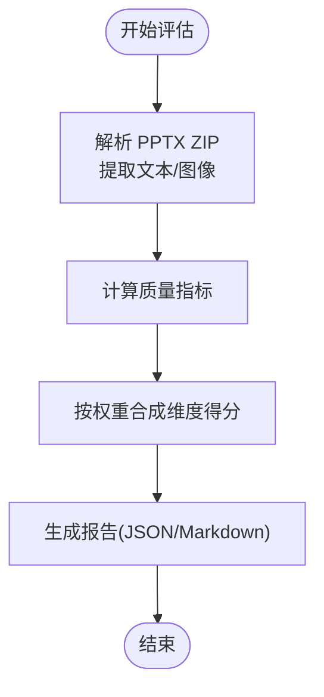

图表来源
- [src/services/evaluator.service.ts:32-93](file://src/services/evaluator.service.ts#L32-L93)
- [src/services/evaluator.service.ts:110-162](file://src/services/evaluator.service.ts#L110-L162)
- [src/services/evaluator.service.ts:285-356](file://src/services/evaluator.service.ts#L285-L356)

章节来源
- [src/services/evaluator.service.ts:1-800](file://src/services/evaluator.service.ts#L1-L800)

## 依赖分析
- 运行时依赖（节选）：Express、Multer、Puppeteer、Axios、PPTXGenJS、Mammoth、pdf-parse、marked、dotenv、cors、form-data 等。
- 开发依赖：TypeScript、ts-node、nodemon、@types/*。
- 第三方集成：外部图像 API、外部 LLM API（/api/llm/direct）、可选工作器代理。

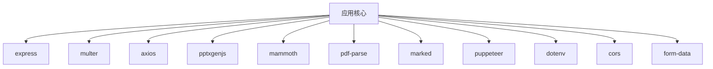

图表来源
- [package.json:18-31](file://package.json#L18-L31)
- [package.json:32-42](file://package.json#L32-L42)

章节来源
- [package.json:1-45](file://package.json#L1-L45)

## 性能考量
- 并发控制：图像生成与截图均支持并发度配置，避免资源争用。
- 缓存策略：图像服务内置提示词缓存，减少重复请求；HTTP 层提供会话级图片缓存。
- 渲染路径选择：HTML→PNG→PPT 路径输出更高质量图片，但 CPU/内存占用更高；传统路径更快更轻量。
- I/O 优化：上传与输出目录分离，避免阻塞；Puppeteer 在进程内复用浏览器实例。
- 评估开销：质量评估解析 PPTX ZIP，建议在生产中按需启用。

## 故障排查指南
- 图像生成失败：
  - 检查 IMAGE_API_KEY 与 IMAGE_API_BASE_URL 是否正确配置。
  - 查看主 API 错误响应与降级日志。
- LLM 规划失败：
  - 确认 PLANNER_API_BASE_URL、PLANNER_AUTH_TOKEN/LLM_AUTH_TOKEN。
  - 若启用工作器代理，检查 CLOUDFLARE_WORKER_URL 与 LLM_API_KEY/GOOGLE_API_KEY。
- 渲染异常：
  - HTML→PNG 路径需确保 Puppeteer 可用且无沙箱限制问题。
  - 传统路径下检查 pptxgenjs 版本与字体可用性。
- 评估报告缺失：
  - 确认 ENABLE_EVALUATION=true 且 PPTX 文件存在。
- 多媒体与上传：
  - 确保 uploads/output 目录可写，文件大小与数量限制。

章节来源
- [src/services/image.service.ts:59-102](file://src/services/image.service.ts#L59-L102)
- [src/services/planner.service.ts:67-82](file://src/services/planner.service.ts#L67-L82)
- [src/services/screenshot.service.ts:54-76](file://src/services/screenshot.service.ts#L54-L76)
- [src/services/evaluator.service.ts:95-108](file://src/services/evaluator.service.ts#L95-L108)

## 结论
Generate-PPT 通过清晰的分层架构与服务化设计，实现了从多格式文档到高质量 PPT 的自动化流水线。系统在可扩展性、可维护性与可移植性方面具备良好基础：可按需切换渲染路径、可插拔规划与图像策略、可选的质量评估与报告输出。未来可在容器化部署、可观测性与弹性伸缩方面进一步增强。

## 附录
- 系统边界图（系统上下文）
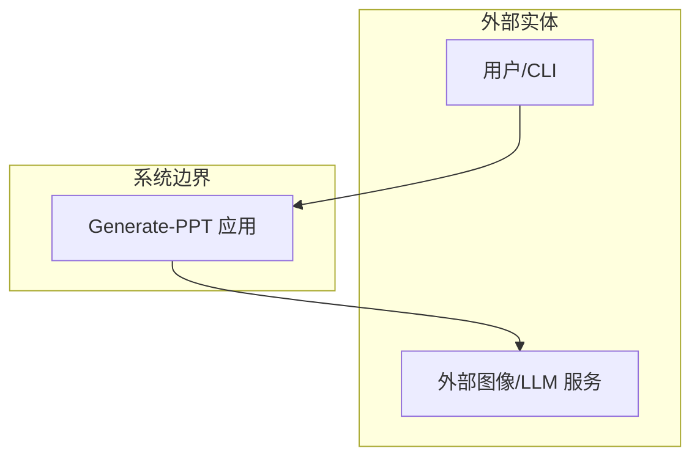

- 组件关系图（类图）
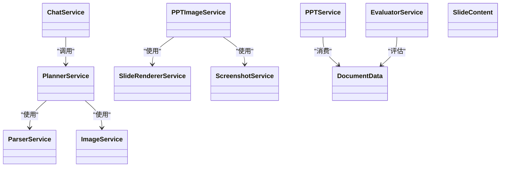

图表来源
- [src/services/parser.service.ts:1-453](file://src/services/parser.service.ts#L1-L453)
- [src/services/planner.service.ts:1-800](file://src/services/planner.service.ts#L1-L800)
- [src/services/image.service.ts:1-218](file://src/services/image.service.ts#L1-L218)
- [src/services/ppt.service.ts:1-800](file://src/services/ppt.service.ts#L1-L800)
- [src/services/ppt-image.service.ts:1-53](file://src/services/ppt-image.service.ts#L1-L53)
- [src/services/slide-renderer.service.ts:1-546](file://src/services/slide-renderer.service.ts#L1-L546)
- [src/services/screenshot.service.ts:1-77](file://src/services/screenshot.service.ts#L1-L77)
- [src/services/chat.service.ts:1-400](file://src/services/chat.service.ts#L1-L400)
- [src/services/evaluator.service.ts:1-800](file://src/services/evaluator.service.ts#L1-L800)
- [src/types.ts:66-71](file://src/types.ts#L66-L71)