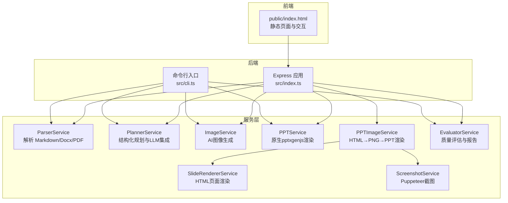
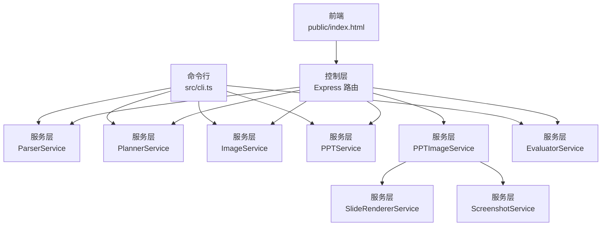
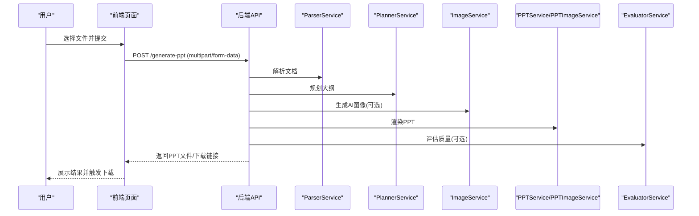
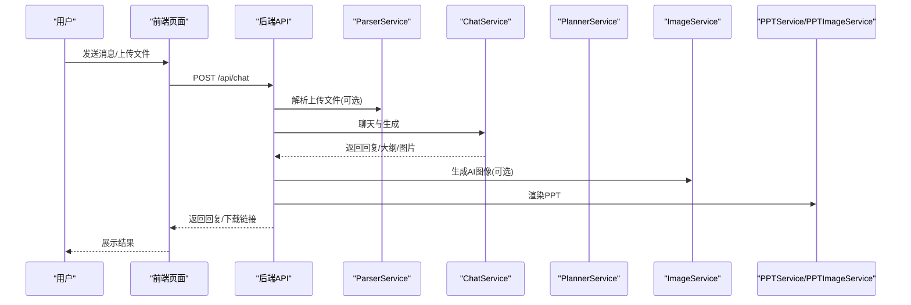
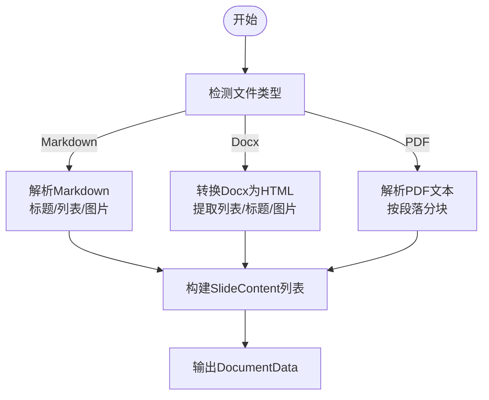
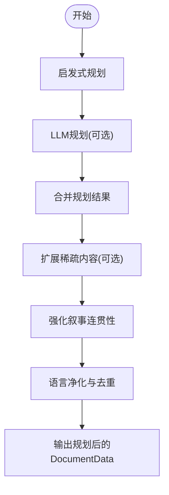
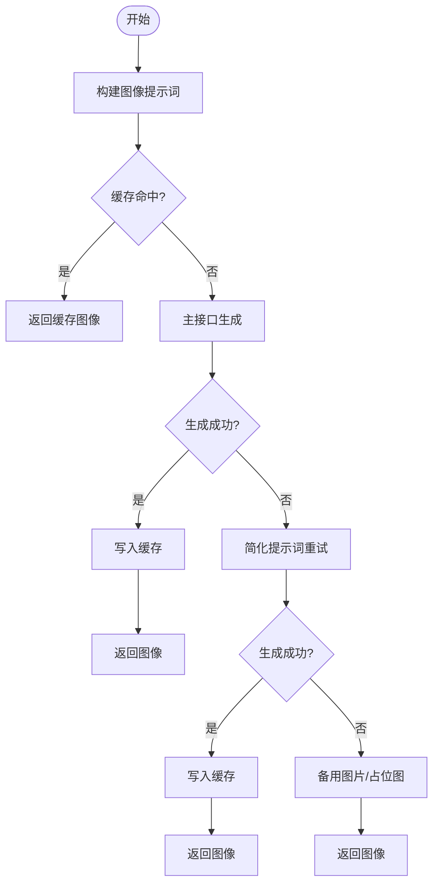
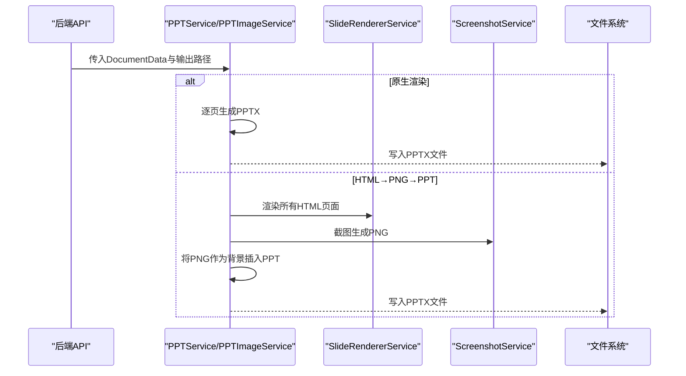
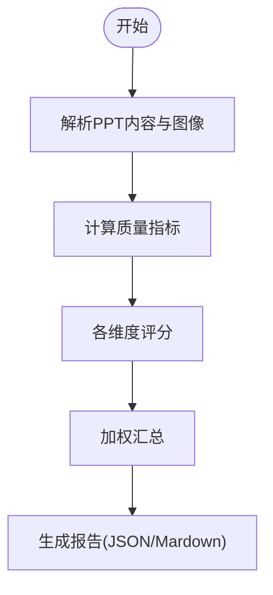
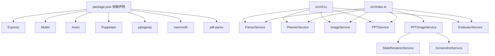

# 系统架构概览

<cite>
**本文引用的文件**
- [package.json](file://package.json)
- [readme.md](file://readme.md)
- [src/index.ts](file://src/index.ts)
- [src/cli.ts](file://src/cli.ts)
- [public/index.html](file://public/index.html)
- [src/services/parser.service.ts](file://src/services/parser.service.ts)
- [src/services/planner.service.ts](file://src/services/planner.service.ts)
- [src/services/ppt.service.ts](file://src/services/ppt.service.ts)
- [src/services/image.service.ts](file://src/services/image.service.ts)
- [src/services/evaluator.service.ts](file://src/services/evaluator.service.ts)
- [src/services/screenshot.service.ts](file://src/services/screenshot.service.ts)
- [src/services/slide-renderer.service.ts](file://src/services/slide-renderer.service.ts)
- [src/services/ppt-image.service.ts](file://src/services/ppt-image.service.ts)
- [src/types.ts](file://src/types.ts)
</cite>

## 目录
1. [简介](#简介)
2. [项目结构](#项目结构)
3. [核心组件](#核心组件)
4. [架构总览](#架构总览)
5. [详细组件分析](#详细组件分析)
6. [依赖分析](#依赖分析)
7. [性能考量](#性能考量)
8. [故障排查指南](#故障排查指南)
9. [结论](#结论)
10. [附录](#附录)

## 简介
本项目提供“文档到 PPT”的统一生成流水线，支持 Markdown、Word、PDF 输入，结合结构化规划、AI 图像生成与高质量渲染，输出符合模板风格的 PPTX，并提供质量评估报告。系统采用分层架构，清晰分离前端界面、后端服务与服务层，具备良好的可扩展性与性能优化能力。

## 项目结构
- 前端静态资源位于 public 目录，提供基于浏览器的交互界面与上传/对话生成入口。
- 后端服务由 Express 提供 REST API，处理文件上传、对话生成与 PPT 下载。
- 服务层封装解析、规划、图像生成、PPT 渲染、质量评估等核心业务逻辑。
- 类型定义集中于 types.ts，确保前后端一致的数据契约。

图表来源
- [src/index.ts:1-433](file://src/index.ts#L1-L433)
- [src/cli.ts:1-176](file://src/cli.ts#L1-L176)
- [src/services/parser.service.ts:1-453](file://src/services/parser.service.ts#L1-L453)
- [src/services/planner.service.ts:1-800](file://src/services/planner.service.ts#L1-L800)
- [src/services/ppt.service.ts:1-800](file://src/services/ppt.service.ts#L1-L800)
- [src/services/ppt-image.service.ts:1-53](file://src/services/ppt-image.service.ts#L1-L53)
- [src/services/slide-renderer.service.ts:1-546](file://src/services/slide-renderer.service.ts#L1-L546)
- [src/services/screenshot.service.ts:1-77](file://src/services/screenshot.service.ts#L1-L77)
- [src/services/image.service.ts:1-218](file://src/services/image.service.ts#L1-L218)
- [src/services/evaluator.service.ts:1-800](file://src/services/evaluator.service.ts#L1-L800)

章节来源
- [package.json:1-45](file://package.json#L1-L45)
- [readme.md:1-131](file://readme.md#L1-L131)

## 核心组件
- 前端界面：提供“文档上传生成”和“AI 对话生成”两种入口，支持拖拽上传、文件列表展示与结果下载。
- 后端 API：
  - 文档上传生成：接收 multipart/form-data，解析文档、规划大纲、生成 PPT 并返回下载链接。
  - AI 对话生成：支持多轮对话与文件上传，生成大纲预览，确认后生成 PPT。
- 服务层：
  - 解析器：从 Markdown/Docx/PDF 提取标题、要点与图片，构建结构化文档数据。
  - 规划器：基于启发式与 LLM 的混合策略生成结构化讲义，支持严格/创意模式。
  - 图像服务：调用外部图像接口生成幻灯片背景图，具备缓存与降级策略。
  - PPT 渲染：提供原生渲染与 HTML→PNG→PPT 两种方案，满足不同视觉风格需求。
  - 质量评估：对生成的 PPT 进行多维度评分，输出 JSON 与 Markdown 报告。

章节来源
- [src/index.ts:314-428](file://src/index.ts#L314-L428)
- [src/index.ts:72-270](file://src/index.ts#L72-L270)
- [src/services/parser.service.ts:11-453](file://src/services/parser.service.ts#L11-L453)
- [src/services/planner.service.ts:53-800](file://src/services/planner.service.ts#L53-L800)
- [src/services/image.service.ts:4-218](file://src/services/image.service.ts#L4-L218)
- [src/services/ppt.service.ts:52-800](file://src/services/ppt.service.ts#L52-L800)
- [src/services/ppt-image.service.ts:14-53](file://src/services/ppt-image.service.ts#L14-L53)
- [src/services/slide-renderer.service.ts:7-546](file://src/services/slide-renderer.service.ts#L7-L546)
- [src/services/screenshot.service.ts:9-77](file://src/services/screenshot.service.ts#L9-L77)
- [src/services/evaluator.service.ts:23-800](file://src/services/evaluator.service.ts#L23-L800)

## 架构总览
系统采用三层架构：
- 表现层（前端）：静态页面与交互逻辑，负责用户输入与结果展示。
- 控制层（后端）：Express 应用，路由与中间件，协调服务层完成业务流程。
- 服务层（业务逻辑）：解析、规划、图像生成、PPT 渲染、质量评估等模块化服务。

图表来源
- [src/index.ts:1-433](file://src/index.ts#L1-L433)
- [src/cli.ts:65-176](file://src/cli.ts#L65-L176)
- [src/services/parser.service.ts:11-453](file://src/services/parser.service.ts#L11-L453)
- [src/services/planner.service.ts:53-800](file://src/services/planner.service.ts#L53-L800)
- [src/services/ppt.service.ts:52-800](file://src/services/ppt.service.ts#L52-L800)
- [src/services/ppt-image.service.ts:14-53](file://src/services/ppt-image.service.ts#L14-L53)
- [src/services/slide-renderer.service.ts:7-546](file://src/services/slide-renderer.service.ts#L7-L546)
- [src/services/screenshot.service.ts:9-77](file://src/services/screenshot.service.ts#L9-L77)
- [src/services/evaluator.service.ts:23-800](file://src/services/evaluator.service.ts#L23-L800)

## 详细组件分析

### 组件A：前端交互与上传流程
- 功能概述：提供两个入口：文档上传生成与 AI 对话生成；支持拖拽上传、文件列表管理、状态提示与结果下载。
- 关键流程：
  - 文档上传生成：选择文件后提交 multipart/form-data，后端解析并生成 PPT，返回 Blob 并触发下载。
  - AI 对话生成：支持多轮对话与文件上传，后端返回回复、大纲预览与下载链接。
- 性能与可用性：前端使用 fetch 异步请求，避免页面刷新；对大文件上传进行进度提示与错误处理。

图表来源
- [public/index.html:150-175](file://public/index.html#L150-L175)
- [src/index.ts:314-428](file://src/index.ts#L314-L428)
- [src/services/parser.service.ts:11-453](file://src/services/parser.service.ts#L11-L453)
- [src/services/planner.service.ts:53-800](file://src/services/planner.service.ts#L53-L800)
- [src/services/image.service.ts:4-218](file://src/services/image.service.ts#L4-L218)
- [src/services/ppt.service.ts:52-800](file://src/services/ppt.service.ts#L52-L800)
- [src/services/evaluator.service.ts:23-800](file://src/services/evaluator.service.ts#L23-L800)

章节来源
- [public/index.html:115-388](file://public/index.html#L115-L388)
- [src/index.ts:314-428](file://src/index.ts#L314-L428)

### 组件B：AI 对话生成与确认流程
- 功能概述：支持多轮对话与文件上传，后端解析文档与图片，生成大纲预览，用户确认后生成 PPT。
- 关键流程：
  - 上传文件与消息：后端解析 Markdown/Docx/PDF，提取图片并缓存，用于后续回填。
  - 对话生成：调用聊天与生成流程，返回回复、大纲与下载链接。
  - 大纲回填：将文档原始图片回填到 LLM 生成的幻灯片中，提升一致性。
  - 渲染与导出：根据配置选择原生或 HTML→PNG→PPT 渲染路径。

图表来源
- [src/index.ts:72-270](file://src/index.ts#L72-L270)
- [src/services/parser.service.ts:11-453](file://src/services/parser.service.ts#L11-L453)
- [src/services/planner.service.ts:53-800](file://src/services/planner.service.ts#L53-L800)
- [src/services/image.service.ts:4-218](file://src/services/image.service.ts#L4-L218)
- [src/services/ppt.service.ts:52-800](file://src/services/ppt.service.ts#L52-L800)
- [src/services/ppt-image.service.ts:14-53](file://src/services/ppt-image.service.ts#L14-L53)

章节来源
- [src/index.ts:72-270](file://src/index.ts#L72-L270)

### 组件C：解析器（ParserService）
- 职责：从 Markdown/Docx/PDF 提取标题、要点与图片，构建结构化 SlideContent 列表。
- 策略：
  - Markdown：按标题与列表层级构建幻灯片，支持内联图片抽取。
  - Docx：解析 HTML 结果，优先按顶层列表块构建，其次按标题与段落切分。
  - PDF：按段落分块，每若干段组成一张幻灯片。
- 输出：DocumentData（标题、幻灯片列表、可选简述与理解结果）。

图表来源
- [src/services/parser.service.ts:11-453](file://src/services/parser.service.ts#L11-L453)

章节来源
- [src/services/parser.service.ts:11-453](file://src/services/parser.service.ts#L11-L453)

### 组件D：规划器（PlannerService）
- 职责：基于启发式与 LLM 的混合策略生成结构化讲义，支持严格/创意模式与多种受众/风格偏好。
- 策略：
  - 启发式规划：根据源材料推断章节、摘要、角色与布局。
  - LLM 规划：通过外部接口生成结构化 JSON，合并到启发式结果。
  - 扩展稀疏内容：在必要时填充与扩展内容，保持事实一致性。
  - 语言净化：针对中文/英文场景进行标题与叙述的本地化优化。
- 输出：增强后的 DocumentData（含简述、理解、角色、布局、图像意图与提示）。

图表来源
- [src/services/planner.service.ts:53-800](file://src/services/planner.service.ts#L53-L800)

章节来源
- [src/services/planner.service.ts:53-800](file://src/services/planner.service.ts#L53-L800)

### 组件E：图像生成（ImageService）
- 职责：为无图的幻灯片生成 AI 图像，支持缓存与降级策略。
- 策略：
  - 主接口：调用外部图像接口，生成高分辨率背景图。
  - 缓存：以提示词为键缓存结果，避免重复生成。
  - 降级：失败时使用简化提示词或备用图片，最后使用占位图保证不中断。
  - 并发：支持并发控制，平衡吞吐与稳定性。
- 输出：为每张幻灯片注入图像数据（Base64 或 URL）。

图表来源
- [src/services/image.service.ts:4-218](file://src/services/image.service.ts#L4-L218)

章节来源
- [src/services/image.service.ts:4-218](file://src/services/image.service.ts#L4-L218)

### 组件F：PPT 渲染（PPTService 与 PPTImageService）
- PPTService（原生渲染）：
  - 使用 pptxgenjs，按幻灯片角色与布局生成 PPTX。
  - 支持模板风格、仅图模式、保留文本、最大条目数等配置。
  - 输出：标准 PPTX 文件。
- PPTImageService（HTML→PNG→PPT 渲染）：
  - 将每张幻灯片渲染为 HTML 页面，使用 Puppeteer 截图为高清 PNG。
  - 将 PNG 作为全屏背景插入 PPT，实现更丰富的视觉效果。
  - 输出：高质量 PPTX 文件。

图表来源
- [src/services/ppt.service.ts:52-800](file://src/services/ppt.service.ts#L52-L800)
- [src/services/ppt-image.service.ts:14-53](file://src/services/ppt-image.service.ts#L14-L53)
- [src/services/slide-renderer.service.ts:7-546](file://src/services/slide-renderer.service.ts#L7-L546)
- [src/services/screenshot.service.ts:9-77](file://src/services/screenshot.service.ts#L9-L77)

章节来源
- [src/services/ppt.service.ts:52-800](file://src/services/ppt.service.ts#L52-L800)
- [src/services/ppt-image.service.ts:14-53](file://src/services/ppt-image.service.ts#L14-L53)
- [src/services/slide-renderer.service.ts:7-546](file://src/services/slide-renderer.service.ts#L7-L546)
- [src/services/screenshot.service.ts:9-77](file://src/services/screenshot.service.ts#L9-L77)

### 组件G：质量评估（EvaluatorService）
- 职责：对生成的 PPT 进行多维度评分，输出 JSON 与 Markdown 报告。
- 维度：内容逻辑、布局质量、图像语义、内容丰富度、受众适配、一致性、源理解。
- 方法：解析 PPT 内容，统计指标并计算加权得分，给出问题与改进建议。

图表来源
- [src/services/evaluator.service.ts:23-800](file://src/services/evaluator.service.ts#L23-L800)

章节来源
- [src/services/evaluator.service.ts:23-800](file://src/services/evaluator.service.ts#L23-L800)

## 依赖分析
- 外部依赖：Express、Multer、Axios、Puppeteer、pptxgenjs、mammoth、pdf-parse 等。
- 内部耦合：后端路由依赖服务层；PPTImageService 依赖渲染与截图服务；评估服务依赖 PPT 文件解析。
- 配置驱动：大量行为通过环境变量控制（如是否启用 AI 图像、渲染模式、评估开关、并发度等）。

图表来源
- [package.json:18-31](file://package.json#L18-L31)
- [src/index.ts:1-52](file://src/index.ts#L1-L52)
- [src/cli.ts:5-12](file://src/cli.ts#L5-L12)
- [src/services/ppt-image.service.ts:14-53](file://src/services/ppt-image.service.ts#L14-L53)

章节来源
- [package.json:18-31](file://package.json#L18-L31)
- [src/index.ts:1-52](file://src/index.ts#L1-L52)
- [src/cli.ts:5-12](file://src/cli.ts#L5-L12)

## 性能考量
- 并发控制：图像生成支持并发参数，避免过度占用外部接口与本地资源。
- 缓存策略：图像服务对提示词进行缓存，减少重复请求与网络开销。
- 渲染路径选择：原生渲染轻量快速，HTML→PNG→PPT 渲染视觉更强但耗时较长；可通过环境变量切换。
- 资源管理：Puppeteer 浏览器实例复用，避免频繁启动带来的冷启动成本。
- I/O 优化：上传文件先落地磁盘，解析后再清理；输出目录按需创建，避免阻塞。

## 故障排查指南
- 环境变量缺失：
  - 图像接口：IMAGE_API_KEY、IMAGE_API_BASE_URL。
  - 规划器：PLANNER_API_BASE_URL、PLANNER_AUTH_TOKEN/LLM_AUTH_TOKEN、PLANNER_MODEL。
  - 渲染：PPT_TEMPLATE_STYLE、PPT_KEEP_TEXT、PPT_IMAGE_ONLY_MODE、PPT_MAX_BULLETS_PER_SLIDE。
  - 评估：ENABLE_EVALUATION。
- 常见问题：
  - PDF 解析失败：检查 Node 版本与 pdf-parse 初始化错误。
  - 图像生成失败：查看主接口与降级策略日志，确认提示词与网络状态。
  - PPT 渲染异常：检查输出目录权限与磁盘空间。
  - 质量评估报告为空：确认输出路径存在且 PPT 文件可读。

章节来源
- [readme.md:17-50](file://readme.md#L17-L50)
- [src/services/parser.service.ts:169-183](file://src/services/parser.service.ts#L169-L183)
- [src/services/image.service.ts:59-102](file://src/services/image.service.ts#L59-L102)
- [src/services/evaluator.service.ts:110-162](file://src/services/evaluator.service.ts#L110-L162)

## 结论
本系统通过清晰的分层架构与模块化服务，实现了从文档到 PPT 的自动化流水线。前端提供直观交互，后端统一编排服务层，服务层以可插拔的方式整合解析、规划、图像与渲染能力。系统支持多种渲染路径与评估反馈，具备良好的可扩展性与性能表现，适合在企业与教育场景中规模化应用。

## 附录
- 数据模型：DocumentData、SlideContent、DeckBrief、QualityReport 等类型定义集中于 types.ts，确保前后端一致的数据契约。
- 命令行入口：CLI 支持与后端相同的流程，便于批处理与集成。

章节来源
- [src/types.ts:1-160](file://src/types.ts#L1-L160)
- [src/cli.ts:65-176](file://src/cli.ts#L65-L176)