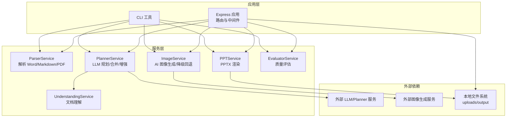
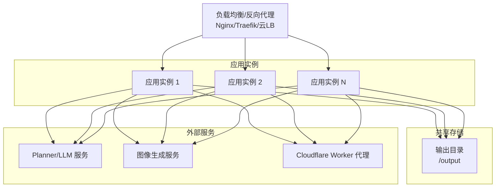
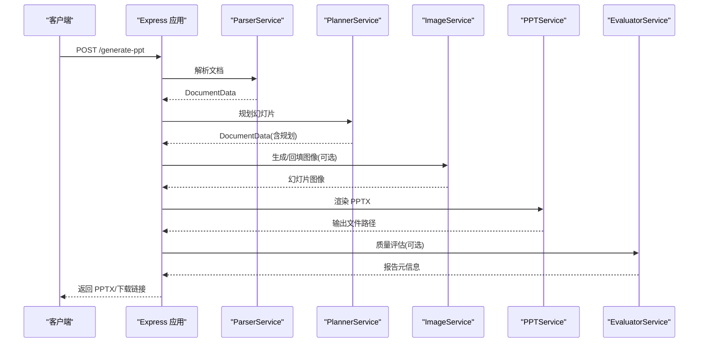
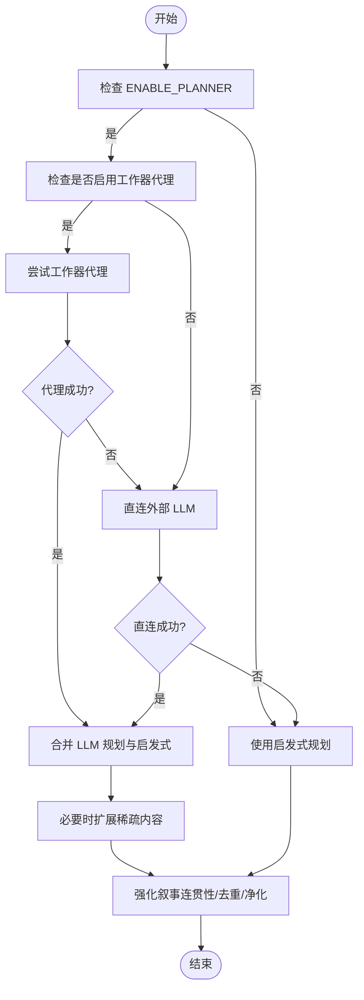
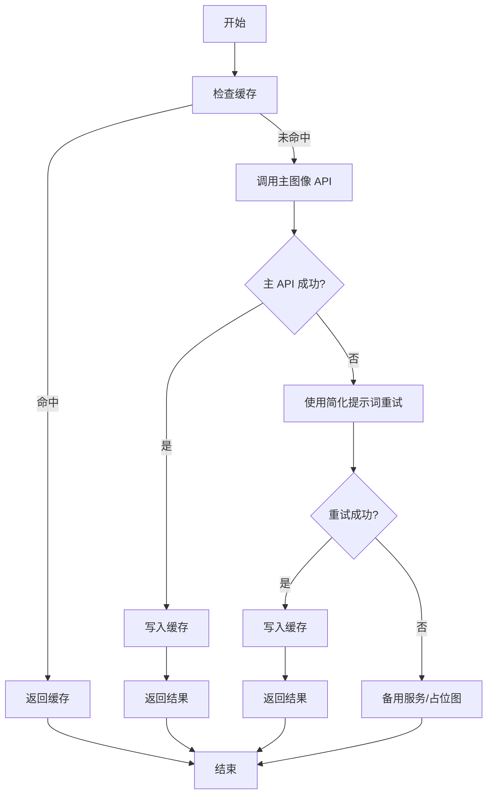
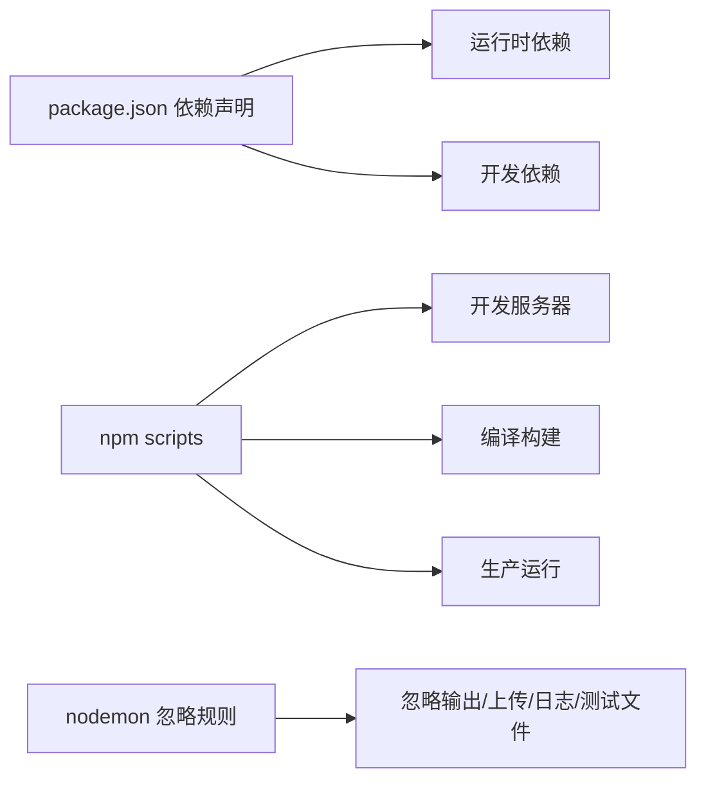

# 部署架构

<cite>
**本文引用的文件**
- [package.json](file://package.json)
- [readme.md](file://readme.md)
- [src/index.ts](file://src/index.ts)
- [src/cli.ts](file://src/cli.ts)
- [src/services/planner.service.ts](file://src/services/planner.service.ts)
- [src/services/image.service.ts](file://src/services/image.service.ts)
- [src/services/ppt.service.ts](file://src/services/ppt.service.ts)
- [src/services/understanding.service.ts](file://src/services/understanding.service.ts)
- [src/types.ts](file://src/types.ts)
- [nodemon.json](file://nodemon.json)
- [.gitignore](file://.gitignore)
- [test/test_image_api.ts](file://test/test_image_api.ts)
</cite>

## 目录
1. [简介](#简介)
2. [项目结构](#项目结构)
3. [核心组件](#核心组件)
4. [架构总览](#架构总览)
5. [详细组件分析](#详细组件分析)
6. [依赖关系分析](#依赖关系分析)
7. [性能考量](#性能考量)
8. [故障排查指南](#故障排查指南)
9. [结论](#结论)
10. [附录](#附录)

## 简介
本文件面向 Generate-PPT 的部署与运维团队，系统性阐述其部署拓扑、基础设施要求、容器化与微服务化建议、负载均衡策略、环境配置与部署流程，并给出监控、日志与故障恢复机制的最佳实践。项目采用 Node.js + Express 提供 Web API 与 CLI 能力，内部通过服务化模块实现“解析-规划-图像-渲染-评估”的端到端流水线。

## 项目结构
- 应用入口与路由：Express 应用在入口文件中初始化 CORS、静态资源、文件上传与多条业务 API。
- 服务层：按职责拆分的服务模块（解析、规划、图像、PPT 渲染、评估等），通过类型定义统一数据模型。
- CLI：独立命令行工具，复用相同的服务逻辑，便于离线批量处理。
- 配置与脚本：通过 npm scripts 启动开发服务器、构建与运行；环境变量控制行为与能力开关。
- 测试：包含图像 API 的单测样例，便于验证外部图像服务可用性。

图表来源
- [src/index.ts:1-433](file://src/index.ts#L1-L433)
- [src/cli.ts:1-176](file://src/cli.ts#L1-L176)
- [src/services/planner.service.ts:1-800](file://src/services/planner.service.ts#L1-L800)
- [src/services/image.service.ts:1-218](file://src/services/image.service.ts#L1-L218)
- [src/services/ppt.service.ts:1-800](file://src/services/ppt.service.ts#L1-L800)
- [src/services/understanding.service.ts:1-96](file://src/services/understanding.service.ts#L1-L96)

章节来源
- [src/index.ts:1-433](file://src/index.ts#L1-L433)
- [src/cli.ts:1-176](file://src/cli.ts#L1-L176)
- [package.json:1-45](file://package.json#L1-L45)
- [.gitignore:1-45](file://.gitignore#L1-L45)

## 核心组件
- Express 应用与路由
  - 初始化 CORS、JSON 解析、静态资源（前端与输出目录）、文件上传（Multer）。
  - 提供两类接口：/generate-ppt（文档转 PPT）、/api/chat（对话式生成）。
- 服务模块
  - ParserService：解析多种源格式，产出结构化文档数据。
  - PlannerService：调用外部 LLM 进行规划，支持工作器代理模式与回退策略。
  - ImageService：生成幻灯片图像，具备缓存、降级与回退能力。
  - PPTService：基于模板样式与渲染配置生成 PPTX 文件。
  - UnderstandingService：对输入文档进行主题、章节、信号等理解，辅助规划。
- 类型系统
  - 统一定义幻灯片、文档、规划参数、质量评估指标等类型，确保跨模块契约稳定。

章节来源
- [src/index.ts:1-433](file://src/index.ts#L1-L433)
- [src/services/planner.service.ts:1-800](file://src/services/planner.service.ts#L1-L800)
- [src/services/image.service.ts:1-218](file://src/services/image.service.ts#L1-L218)
- [src/services/ppt.service.ts:1-800](file://src/services/ppt.service.ts#L1-L800)
- [src/services/understanding.service.ts:1-96](file://src/services/understanding.service.ts#L1-L96)
- [src/types.ts:1-160](file://src/types.ts#L1-L160)

## 架构总览
下图展示典型生产部署拓扑：反向代理/负载均衡前置，后端由若干应用实例组成，共享输出目录与可选的外部图像服务。Planner 与图像服务可选择直连外部 LLM/图像服务或经由 Cloudflare Worker 代理。

图表来源
- [src/index.ts:314-428](file://src/index.ts#L314-L428)
- [src/services/planner.service.ts:67-82](file://src/services/planner.service.ts#L67-L82)
- [src/services/image.service.ts:9-13](file://src/services/image.service.ts#L9-L13)

## 详细组件分析

### 组件 A：Web API 与路由
- 功能要点
  - /generate-ppt：接收多格式文档，执行解析-规划-图像-渲染-评估全流程，返回 PPTX 并可选质量报告元信息。
  - /api/chat：支持多文件上传与消息上下文，结合文档原始图片缓存，完成对话式生成。
  - 文件上传与输出目录：使用 Multer 写入 uploads，最终产物写入 output。
- 关键流程
  - 解析源文档 → 规划幻灯片结构与角色 → 可选生成 AI 图像 → 渲染 PPTX → 可选质量评估 → 下载输出。

图表来源
- [src/index.ts:314-428](file://src/index.ts#L314-L428)
- [src/services/planner.service.ts:84-101](file://src/services/planner.service.ts#L84-L101)
- [src/services/image.service.ts:15-28](file://src/services/image.service.ts#L15-L28)
- [src/services/ppt.service.ts:52-75](file://src/services/ppt.service.ts#L52-L75)

章节来源
- [src/index.ts:1-433](file://src/index.ts#L1-L433)

### 组件 B：PlannerService（规划与 LLM 集成）
- 能力与配置
  - 支持严格/创意两种模式，控制语言风格与事实约束。
  - 可启用工作器代理模式，通过 Cloudflare Worker 转发至外部 LLM，避免直接暴露密钥。
  - 支持稀疏内容扩展、叙事连贯性强化、标题去重与语言净化。
- 失败与回退
  - 当外部 Planner 不可用时，回退到启发式规划；当工作器代理不可用时，尝试直连外部 LLM。

图表来源
- [src/services/planner.service.ts:84-101](file://src/services/planner.service.ts#L84-L101)
- [src/services/planner.service.ts:164-190](file://src/services/planner.service.ts#L164-L190)
- [src/services/planner.service.ts:103-162](file://src/services/planner.service.ts#L103-L162)

章节来源
- [src/services/planner.service.ts:1-800](file://src/services/planner.service.ts#L1-L800)

### 组件 C：ImageService（图像生成与回退）
- 能力与配置
  - 优先使用主图像 API；失败时尝试简化提示词重试；再降级到备用服务或本地占位图。
  - 支持并发控制与结果缓存，提升吞吐与稳定性。
- 失败与回退
  - 主 API 失败 → 简化提示词重试 → 备用服务 → 占位图。

图表来源
- [src/services/image.service.ts:15-57](file://src/services/image.service.ts#L15-L57)
- [src/services/image.service.ts:59-120](file://src/services/image.service.ts#L59-L120)

章节来源
- [src/services/image.service.ts:1-218](file://src/services/image.service.ts#L1-L218)

### 组件 D：PPTService（PPTX 渲染）
- 能力与配置
  - 基于模板样式与渲染配置生成 PPTX，支持标题页、议程、分节、时间线、对比、流程、数据高亮、总结、下一步等角色幻灯片。
  - 通过环境变量控制渲染模式（模板样式、仅图模式、保留文本、最大条目数等）。
- 数据流
  - 输入 DocumentData → 分页与角色判定 → 添加各类型幻灯片 → 写出 PPTX 文件。

章节来源
- [src/services/ppt.service.ts:1-800](file://src/services/ppt.service.ts#L1-L800)
- [src/types.ts:1-160](file://src/types.ts#L1-L160)

### 组件 E：CLI 工具
- 能力与配置
  - 与 Web API 共享同一套服务逻辑，支持输入/输出路径、规划模式与渲染配置。
  - 适合批处理与自动化场景。

章节来源
- [src/cli.ts:1-176](file://src/cli.ts#L1-L176)

## 依赖关系分析
- 运行时依赖
  - Express、Multer、Axios、Puppeteer、pptxgenjs 等，支撑 Web 服务、文件处理、HTTP 请求与 PPTX 渲染。
- 开发依赖
  - TypeScript、ts-node、nodemon 等，支撑开发与热重载。
- 运行与构建
  - npm scripts 定义启动、构建与测试命令；nodemon 配置忽略输出与临时文件。

图表来源
- [package.json:1-45](file://package.json#L1-L45)
- [nodemon.json:1-6](file://nodemon.json#L1-L6)

章节来源
- [package.json:1-45](file://package.json#L1-L45)
- [nodemon.json:1-6](file://nodemon.json#L1-L6)

## 性能考量
- 并发与限流
  - 图像生成支持并发控制，避免外部服务过载；建议在应用层设置请求速率限制与队列缓冲。
- 缓存策略
  - 图像服务内置缓存；可考虑引入分布式缓存（如 Redis）以跨实例共享。
- 渲染优化
  - PPTX 渲染为 CPU 密集型任务，建议在专用渲染节点或容器中隔离，避免与 API 实例争抢资源。
- 存储与 IO
  - 输出目录需具备高吞吐与持久化能力；建议使用本地 SSD 或网络存储（NAS/对象存储）以满足并发写入。
- 外部服务可靠性
  - Planner 与图像服务均存在失败风险，应配置超时、重试与熔断；必要时启用工作器代理以降低直接依赖。

## 故障排查指南
- 环境变量缺失
  - Planner：缺少认证令牌时将回退到启发式规划；若仍无输出，请检查令牌与代理配置。
  - 图像：缺少 API Key 时会降级到备用服务或占位图；请核对图像服务地址与分辨率配置。
- 文件上传与输出
  - 确认 uploads 与 output 目录权限与磁盘空间；关注 .gitignore 中的忽略规则。
- 日志与错误
  - Web API 在关键环节打印日志；建议接入统一日志系统（如 ELK/云日志）以便追踪。
- 单测验证
  - 使用图像 API 测试脚本验证外部图像服务连通性与可用性。

章节来源
- [src/services/planner.service.ts:67-82](file://src/services/planner.service.ts#L67-L82)
- [src/services/image.service.ts:9-13](file://src/services/image.service.ts#L9-L13)
- [.gitignore:1-45](file://.gitignore#L1-L45)
- [test/test_image_api.ts:1-43](file://test/test_image_api.ts#L1-L43)

## 结论
Generate-PPT 的部署可采用“反向代理 + 多实例 + 共享输出”的弹性架构。通过合理配置 Planner 与图像服务的代理与回退策略、引入缓存与限流、以及规范的日志与监控体系，可在保证质量的同时提升可用性与可维护性。建议优先容器化与编排化部署，配合蓝绿/滚动发布策略，逐步完善自动化测试与灰度发布流程。

## 附录

### 环境配置清单（摘自 README）
- 通用
  - PORT：服务监听端口
- Planner 与 LLM
  - ENABLE_PLANNER：是否启用 Planner
  - PLANNER_MODEL、PLANNER_API_BASE_URL、PLANNER_AUTH_TOKEN、LLM_AUTH_TOKEN
  - PLANNER_USE_WORKER_PROXY、CLOUDFLARE_WORKER_URL、LLM_API_KEY、GOOGLE_API_KEY、AIWORKFLOW_BACKEND_ENV_PATH
  - PLANNER_CONTENT_MODE、PLANNER_EXPAND_SPARSE_CONTENT、PLANNER_USE_GUEST_LOGIN
- 图像服务
  - ENABLE_AI_IMAGES、IMAGE_CONCURRENCY、IMAGE_MODEL、IMAGE_RESOLUTION、IMAGE_API_KEY、IMAGE_API_BASE_URL
- PPT 渲染
  - PPT_TEMPLATE_STYLE、PPT_KEEP_TEXT、PPT_IMAGE_ONLY_MODE、PPT_MAX_BULLETS_PER_SLIDE、PPT_RENDER_MODE
- 质量评估
  - ENABLE_EVALUATION

章节来源
- [readme.md:17-60](file://readme.md#L17-L60)
- [readme.md:68-83](file://readme.md#L68-L83)