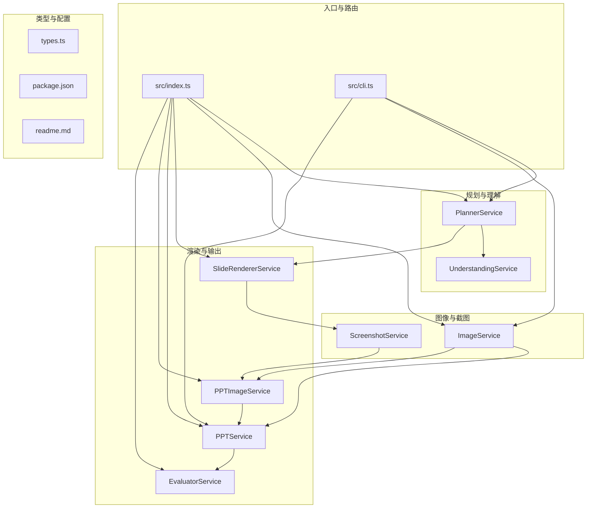
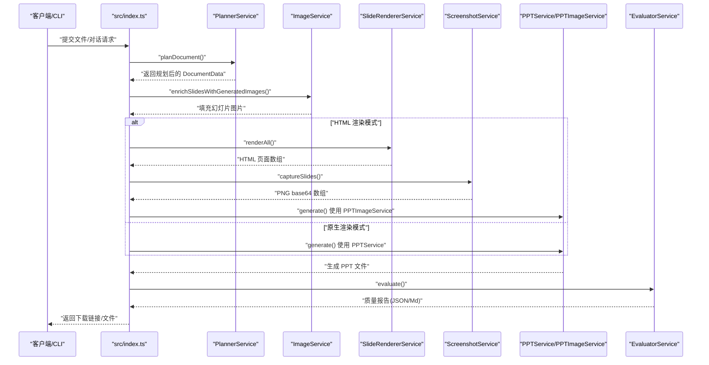
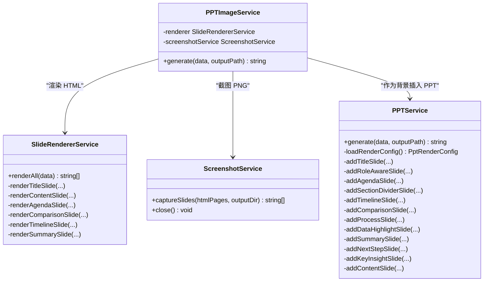
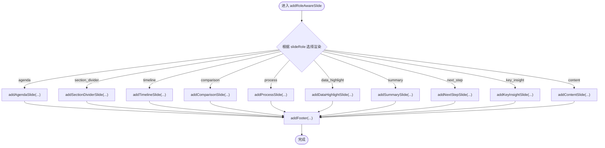
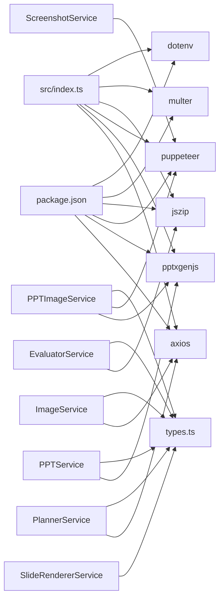

# PPT 生成服务

<cite>
**本文引用的文件列表**
- [src/index.ts](file://src/index.ts)
- [src/cli.ts](file://src/cli.ts)
- [src/services/ppt.service.ts](file://src/services/ppt.service.ts)
- [src/services/ppt-image.service.ts](file://src/services/ppt-image.service.ts)
- [src/services/slide-renderer.service.ts](file://src/services/slide-renderer.service.ts)
- [src/services/screenshot.service.ts](file://src/services/screenshot.service.ts)
- [src/services/image.service.ts](file://src/services/image.service.ts)
- [src/services/planner.service.ts](file://src/services/planner.service.ts)
- [src/services/understanding.service.ts](file://src/services/understanding.service.ts)
- [src/services/evaluator.service.ts](file://src/services/evaluator.service.ts)
- [src/services/chat.service.ts](file://src/services/chat.service.ts)
- [src/types.ts](file://src/types.ts)
- [package.json](file://package.json)
- [readme.md](file://readme.md)
</cite>

## 目录
1. [简介](#简介)
2. [项目结构](#项目结构)
3. [核心组件](#核心组件)
4. [架构总览](#架构总览)
5. [详细组件分析](#详细组件分析)
6. [依赖关系分析](#依赖关系分析)
7. [性能考量](#性能考量)
8. [故障排查指南](#故障排查指南)
9. [结论](#结论)
10. [附录](#附录)

## 简介
本项目提供从文档到 PPT 的自动化生成能力，支持多种输入格式（Markdown、Word、PDF），并通过“规划-图像-渲染”三阶段流水线产出高质量演示文稿。系统同时提供两种渲染模式：
- 模板叠加模式：基于 pptxgenjs 的原生绘制，强调可编辑性与可控性。
- HTML→PNG→PPT 模式：通过 Puppeteer 截图生成高清背景，再嵌入 PPT，强调视觉一致性与高保真。

系统还内置对话式生成接口，支持用户上传文档与多轮对话后生成 PPT 大纲与最终数据。

## 项目结构
- 顶层入口与 API：提供 Web 服务与 CLI 两种调用方式，统一调度各服务模块。
- 服务层：
  - 规划器：根据输入与偏好生成幻灯片计划与角色标注。
  - 渲染器：将幻灯片数据渲染为 HTML 页面，用于截图或直接绘制。
  - 截图器：使用 Puppeteer 将 HTML 页面渲染为高清 PNG。
  - 图像服务：调用外部图像生成 API，为幻灯片生成配图。
  - PPT 服务：原生绘制 PPT，支持模板样式、图片集成与分页。
  - PPT 图像服务：采用 HTML→PNG→PPT 的渲染链路。
  - 评估器：对生成的 PPT 进行质量评分与报告输出。
  - 对话服务：提供对话式生成 PPT 的能力。
- 类型定义：统一描述文档、幻灯片、角色、布局、质量指标等数据结构。

图表来源
- [src/index.ts:1-433](file://src/index.ts#L1-L433)
- [src/cli.ts:1-176](file://src/cli.ts#L1-L176)
- [src/services/planner.service.ts:1-1803](file://src/services/planner.service.ts#L1-L1803)
- [src/services/understanding.service.ts:1-96](file://src/services/understanding.service.ts#L1-L96)
- [src/services/slide-renderer.service.ts:1-546](file://src/services/slide-renderer.service.ts#L1-L546)
- [src/services/screenshot.service.ts:1-77](file://src/services/screenshot.service.ts#L1-L77)
- [src/services/image.service.ts:1-218](file://src/services/image.service.ts#L1-L218)
- [src/services/ppt.service.ts:1-1551](file://src/services/ppt.service.ts#L1-L1551)
- [src/services/ppt-image.service.ts:1-53](file://src/services/ppt-image.service.ts#L1-L53)
- [src/services/evaluator.service.ts:1-1542](file://src/services/evaluator.service.ts#L1-L1542)
- [src/types.ts:1-160](file://src/types.ts#L1-L160)
- [package.json:1-45](file://package.json#L1-L45)
- [readme.md:1-131](file://readme.md#L1-L131)

章节来源
- [src/index.ts:1-433](file://src/index.ts#L1-L433)
- [src/cli.ts:1-176](file://src/cli.ts#L1-L176)
- [package.json:1-45](file://package.json#L1-L45)
- [readme.md:1-131](file://readme.md#L1-L131)

## 核心组件
- PPTService：负责原生绘制 PPT，支持标题页、议程页、章节分隔、时间线、对比、流程、数据亮点、总结、下一步、关键洞察、内容页等角色的模板化渲染，以及页脚、分页与文本/图片布局控制。
- PPTImageService：采用 HTML→PNG→PPT 的渲染链路，先将每页幻灯片渲染为 HTML，再用 Puppeteer 截图生成高清 PNG，最后将 PNG 作为全屏背景插入 PPT。
- SlideRendererService：将幻灯片数据渲染为完整的 HTML 页面字符串，包含标题页、内容页、议程页、对比页、时间线页、总结/下一步页等模板样式与排版。
- ScreenshotService：启动无头浏览器，设置视口与设备缩放，将 HTML 页面截图并转换为 base64，便于直接写入 PPT。
- ImageService：调用外部图像生成 API，为幻灯片生成配图，具备缓存、降级与并发控制。
- PlannerService：根据输入与偏好生成幻灯片计划，推断角色、布局、图像意图与提示词，确保结构完整性与叙事连贯性。
- UnderstandingService：对输入文档进行主题、章节、信号词等理解，为规划与简报生成提供基础。
- EvaluatorService：对生成的 PPT 进行质量评估，输出维度分数与综合评分，并导出 JSON 与 Markdown 报告。
- ChatService：提供对话式生成能力，支持大纲阶段与最终生成阶段的 JSON 输出，配合前端交互体验。
- types.ts：定义文档、幻灯片、角色、布局、质量指标等核心类型。

章节来源
- [src/services/ppt.service.ts:1-1551](file://src/services/ppt.service.ts#L1-L1551)
- [src/services/ppt-image.service.ts:1-53](file://src/services/ppt-image.service.ts#L1-L53)
- [src/services/slide-renderer.service.ts:1-546](file://src/services/slide-renderer.service.ts#L1-L546)
- [src/services/screenshot.service.ts:1-77](file://src/services/screenshot.service.ts#L1-L77)
- [src/services/image.service.ts:1-218](file://src/services/image.service.ts#L1-L218)
- [src/services/planner.service.ts:1-1803](file://src/services/planner.service.ts#L1-L1803)
- [src/services/understanding.service.ts:1-96](file://src/services/understanding.service.ts#L1-L96)
- [src/services/evaluator.service.ts:1-1542](file://src/services/evaluator.service.ts#L1-L1542)
- [src/services/chat.service.ts:1-400](file://src/services/chat.service.ts#L1-L400)
- [src/types.ts:1-160](file://src/types.ts#L1-L160)

## 架构总览
系统采用“规划-图像-渲染-评估”的流水线，支持两种渲染模式：
- 模板叠加模式：PPTService 直接使用 pptxgenjs 绘制，适合需要可编辑性与灵活布局的场景。
- HTML→PNG→PPT 模式：通过 SlideRendererService 渲染 HTML，SceenshotService 截图，PPTImageService 将 PNG 作为背景插入 PPT，适合追求视觉一致性的场景。

图表来源
- [src/index.ts:1-433](file://src/index.ts#L1-L433)
- [src/services/planner.service.ts:1-1803](file://src/services/planner.service.ts#L1-L1803)
- [src/services/image.service.ts:1-218](file://src/services/image.service.ts#L1-L218)
- [src/services/slide-renderer.service.ts:1-546](file://src/services/slide-renderer.service.ts#L1-L546)
- [src/services/screenshot.service.ts:1-77](file://src/services/screenshot.service.ts#L1-L77)
- [src/services/ppt.service.ts:1-1551](file://src/services/ppt.service.ts#L1-L1551)
- [src/services/ppt-image.service.ts:1-53](file://src/services/ppt-image.service.ts#L1-L53)
- [src/services/evaluator.service.ts:1-1542](file://src/services/evaluator.service.ts#L1-L1542)

## 详细组件分析

### PPTService 与 PPTImageService 的协作机制
- PPTService：负责原生绘制，支持标题页、议程页、章节分隔、时间线、对比、流程、数据亮点、总结、下一步、关键洞察、内容页等角色的模板化渲染。通过配置项控制模板样式、仅图片模式、保留文本、每页最大条目数、显示参考来源等。
- PPTImageService：采用 HTML→PNG→PPT 的渲染链路。先渲染 HTML，再截图生成 PNG，最后将 PNG 作为全屏背景插入 PPT。适合追求视觉一致性的场景。

图表来源
- [src/services/ppt.service.ts:1-1551](file://src/services/ppt.service.ts#L1-L1551)
- [src/services/ppt-image.service.ts:1-53](file://src/services/ppt-image.service.ts#L1-L53)
- [src/services/slide-renderer.service.ts:1-546](file://src/services/slide-renderer.service.ts#L1-L546)
- [src/services/screenshot.service.ts:1-77](file://src/services/screenshot.service.ts#L1-L77)

章节来源
- [src/services/ppt.service.ts:52-75](file://src/services/ppt.service.ts#L52-L75)
- [src/services/ppt-image.service.ts:18-51](file://src/services/ppt-image.service.ts#L18-L51)

### 模板渲染与幻灯片生成
- 角色驱动的渲染策略：根据 slideRole 选择对应渲染函数，如议程页、章节分隔、时间线、对比、流程、数据亮点、总结、下一步、关键洞察、内容页等。
- 标题页渲染：支持深色背景、径向光晕、封面图、渐变遮罩、元标签胶囊、装饰圆环与线条等元素，适配中英双语环境。
- 内容页渲染：支持左右布局、图片区与文本区的动态比例、页码、强调色块、项目符号等。
- 议程页、时间线、对比、流程、数据亮点、总结、下一步等页面均提供独立的模板样式与排版。

图表来源
- [src/services/ppt.service.ts:231-277](file://src/services/ppt.service.ts#L231-L277)

章节来源
- [src/services/ppt.service.ts:87-229](file://src/services/ppt.service.ts#L87-L229)
- [src/services/ppt.service.ts:279-795](file://src/services/ppt.service.ts#L279-L795)

### 幻灯片角色处理逻辑
- 议程页：深色背景、径向光晕、内容导航徽章、标题、两列卡片网格，支持去重与最多 8 项。
- 章节分隔：支持封面图与半透明遮罩，若无封面图则使用深色背景；显示面包屑、标题与摘要。
- 时间线：深色背景、水平轨道、步骤点与连接线、下方卡片展示事件标签与详情。
- 对比：左右两列，A/B 标题胶囊，中心分割线，分别列出项目并带彩色圆点。
- 流程：成功色系胶囊与箭头，步骤编号与居中标题，支持 3-4 步骤自适应宽度。
- 数据亮点：封面图+深色遮罩或深色背景，左侧标题与关键数字，右侧浅色卡片承载正文。
- 总结：深色渐变背景、径向光晕、绿色徽章、标题、关键信息与勾选卡片列表。
- 下一步：深色背景、径向光晕、橙色徽章、标题、关键信息与箭头图标。
- 关键洞察：成功色系胶囊与居中标题，适合演示型讲稿。
- 内容页：默认内容页，支持图片区与文本区布局、页码、强调色块与项目符号。

章节来源
- [src/services/ppt.service.ts:279-795](file://src/services/ppt.service.ts#L279-L795)

### 模板系统设计、布局适配与样式控制
- 模板系统：通过颜色常量、形状与文本样式、背景图与遮罩组合，形成统一的视觉语言。
- 布局适配：根据角色与内容动态调整卡片尺寸、间距、列数与文本长度，保证在不同分辨率下可读性。
- 样式控制：字体族、字号、字重、对齐、行高、颜色透明度、圆角矩形、渐变与径向光晕等，确保跨角色的一致性。

章节来源
- [src/services/ppt.service.ts:6-30](file://src/services/ppt.service.ts#L6-L30)
- [src/services/ppt.service.ts:404-723](file://src/services/ppt.service.ts#L404-L723)

### 代码示例：PPT 生成流程
- Web API 调用：/generate-ppt 或 /api/chat，支持上传文件、参数传递与质量评估。
- CLI 调用：通过命令行参数指定输入、输出与规划模式，自动执行规划、图像生成与 PPT 输出。
- HTML→PNG→PPT 流程：渲染 HTML→截图→写入 PPT，适合高保真视觉输出。
- 原生绘制流程：直接使用 pptxgenjs 绘制，适合需要可编辑性与灵活布局的场景。

章节来源
- [src/index.ts:314-428](file://src/index.ts#L314-L428)
- [src/index.ts:72-270](file://src/index.ts#L72-L270)
- [src/cli.ts:65-176](file://src/cli.ts#L65-L176)
- [src/services/ppt-image.service.ts:18-51](file://src/services/ppt-image.service.ts#L18-L51)

### 质量控制机制
- 规划阶段：通过 PlannerService 推断角色、布局、图像意图与提示词，确保结构完整性与叙事连贯性。
- 视觉一致性：ImageService 生成配图并缓存，降低重复成本；PPTImageService 保证每页视觉一致性。
- 渲染一致性：SlideRendererService 与 ScreenshotService 统一分辨率与缩放，减少渲染偏差。
- 评估阶段：EvaluatorService 对生成的 PPT 进行维度评分（逻辑、布局、图像语义、内容丰富度、受众契合、一致性、源理解），输出综合评分与报告。

章节来源
- [src/services/planner.service.ts:84-101](file://src/services/planner.service.ts#L84-L101)
- [src/services/image.service.ts:15-28](file://src/services/image.service.ts#L15-L28)
- [src/services/evaluator.service.ts:32-93](file://src/services/evaluator.service.ts#L32-L93)

### 性能优化策略
- 并发控制：ImageService 使用并发队列，限制同时请求数量，避免 API 限流与资源争用。
- 缓存机制：ImageService 内置提示词到图像的缓存，减少重复生成。
- 渲染优化：Puppeteer 设置高分辨率与设备缩放，确保 PNG 质量；HTML 渲染模板精简结构，减少 DOM 复杂度。
- 环境变量：通过 PPT_TEMPLATE_STYLE、PPT_KEEP_TEXT、PPT_IMAGE_ONLY_MODE、PPT_MAX_BULLETS_PER_SLIDE 等控制渲染行为与性能权衡。

章节来源
- [src/services/image.service.ts:199-217](file://src/services/image.service.ts#L199-L217)
- [src/services/screenshot.service.ts:15-52](file://src/services/screenshot.service.ts#L15-L52)
- [src/services/ppt.service.ts:77-85](file://src/services/ppt.service.ts#L77-L85)

### 错误处理方法
- 规划失败：当外部 LLM API 不可用时，PlannerService 自动回退到启发式规划。
- 图像生成失败：ImageService 优先主 API，失败后尝试简化提示词与备用 API，最后使用本地占位图。
- 渲染失败：PPTImageService 在截图阶段记录日志，关闭浏览器句柄，避免资源泄漏。
- 评估失败：EvaluatorService 对 ZIP 解析异常进行捕获与降级，保证主流程不受影响。

章节来源
- [src/services/planner.service.ts:103-162](file://src/services/planner.service.ts#L103-L162)
- [src/services/image.service.ts:30-57](file://src/services/image.service.ts#L30-L57)
- [src/services/screenshot.service.ts:70-77](file://src/services/screenshot.service.ts#L70-L77)
- [src/services/evaluator.service.ts:110-162](file://src/services/evaluator.service.ts#L110-L162)

### 自定义模板开发、样式定制与扩展新渲染模式
- 自定义模板：可在 PPTService 中新增角色分支与渲染函数，或在 SlideRendererService 中扩展 HTML 模板与样式。
- 样式定制：通过颜色常量、字体族、字号、对齐与透明度等参数统一管理视觉风格。
- 扩展新渲染模式：新增渲染器类与截图器类，替换或并行运行现有渲染链路，保持对外接口一致。

章节来源
- [src/services/ppt.service.ts:231-277](file://src/services/ppt.service.ts#L231-L277)
- [src/services/slide-renderer.service.ts:14-46](file://src/services/slide-renderer.service.ts#L14-L46)

## 依赖关系分析
- 外部依赖：pptxgenjs（原生绘制）、puppeteer（截图）、axios（HTTP 请求）、JSZip（PPT 解析）、multer（文件上传）、dotenv（环境变量）。
- 内部依赖：各服务模块之间通过 types.ts 定义的数据结构耦合，PlannerService 与 UnderstandingService 协同生成简报与角色推断，ImageService 与 PPTService/PPTImageService 协同生成配图与插入 PPT。

图表来源
- [package.json:18-31](file://package.json#L18-L31)
- [src/index.ts:1-433](file://src/index.ts#L1-L433)
- [src/services/planner.service.ts:1-1803](file://src/services/planner.service.ts#L1-L1803)
- [src/services/ppt.service.ts:1-1551](file://src/services/ppt.service.ts#L1-L1551)
- [src/services/ppt-image.service.ts:1-53](file://src/services/ppt-image.service.ts#L1-L53)
- [src/services/slide-renderer.service.ts:1-546](file://src/services/slide-renderer.service.ts#L1-L546)
- [src/services/screenshot.service.ts:1-77](file://src/services/screenshot.service.ts#L1-L77)
- [src/services/image.service.ts:1-218](file://src/services/image.service.ts#L1-L218)
- [src/services/evaluator.service.ts:1-1542](file://src/services/evaluator.service.ts#L1-L1542)
- [src/types.ts:1-160](file://src/types.ts#L1-L160)

章节来源
- [package.json:18-31](file://package.json#L18-L31)
- [src/index.ts:1-433](file://src/index.ts#L1-L433)

## 性能考量
- 渲染性能：Puppeteer 截图分辨率与缩放需平衡质量与速度；建议在 CI 环境中限制并发与内存上限。
- API 限流：ImageService 与 PlannerService 对外部 API 进行降级与重试，避免单点故障导致整体阻塞。
- 存储与缓存：ImageService 的提示词缓存显著降低重复生成成本；会话级图片缓存用于对话式生成的回填。
- 输出体积：PPTImageService 生成的 PNG 背景会增大文件体积，可根据需要调整分辨率与压缩策略。

## 故障排查指南
- 规划失败：检查 PLANNER_AUTH_TOKEN/LLM_AUTH_TOKEN 与 API 基础地址配置，确认网络代理与超时设置。
- 图像生成失败：确认 IMAGE_API_KEY 与 IMAGE_API_BASE_URL，查看日志中的响应体；必要时启用简化提示词与备用 API。
- 截图失败：检查 Puppeteer 启动参数与系统依赖，确保无头浏览器可正常启动；关注磁盘空间与输出目录权限。
- PPT 评估失败：确认输出目录存在且可写，检查 ZIP 解析异常与 XML 解析错误。
- 对话式生成：确认 /api/chat 的消息格式与 JSON 结构，检查 LLM API 返回内容与解析逻辑。

章节来源
- [src/services/planner.service.ts:103-162](file://src/services/planner.service.ts#L103-L162)
- [src/services/image.service.ts:30-57](file://src/services/image.service.ts#L30-L57)
- [src/services/screenshot.service.ts:54-68](file://src/services/screenshot.service.ts#L54-L68)
- [src/services/evaluator.service.ts:110-162](file://src/services/evaluator.service.ts#L110-L162)
- [src/services/chat.service.ts:40-101](file://src/services/chat.service.ts#L40-L101)

## 结论
本项目通过“规划-图像-渲染-评估”的流水线，结合两种渲染模式，实现了从文档到 PPT 的自动化生成。PPTService 与 PPTImageService 各具优势：前者强调可编辑性与灵活性，后者强调视觉一致性与高保真。配合 PlannerService 的角色推断、ImageService 的图像生成与 EvaluatorService 的质量评估，系统在功能与质量上达到良好平衡。通过合理的性能优化与错误处理策略，系统能够在生产环境中稳定运行。

## 附录
- 环境变量与配置：参考 readme.md 中的环境变量说明，合理配置 API 密钥、渲染模式与评估开关。
- API 与 CLI：Web API 支持 /generate-ppt 与 /api/chat；CLI 支持 --input/--output/--planner-mode 等参数。
- 质量报告：评估器输出 JSON 与 Markdown 报告，包含维度分数与改进建议。

章节来源
- [readme.md:17-60](file://readme.md#L17-L60)
- [readme.md:104-131](file://readme.md#L104-L131)
- [src/index.ts:314-428](file://src/index.ts#L314-L428)
- [src/cli.ts:65-176](file://src/cli.ts#L65-L176)