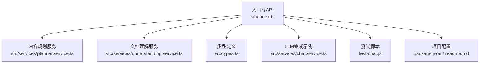
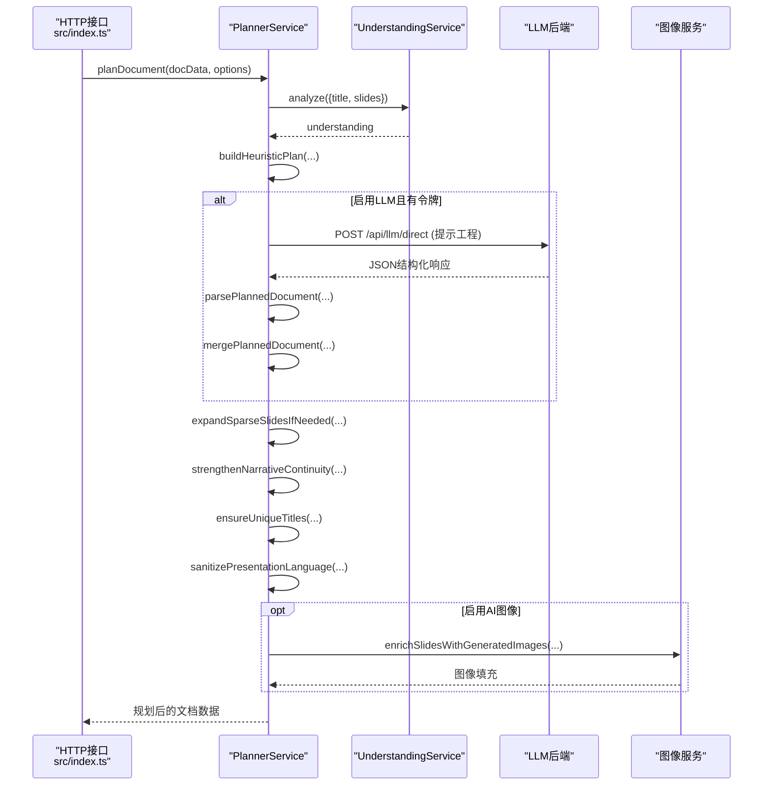
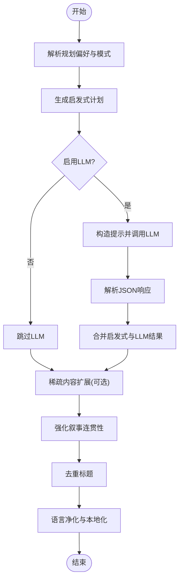
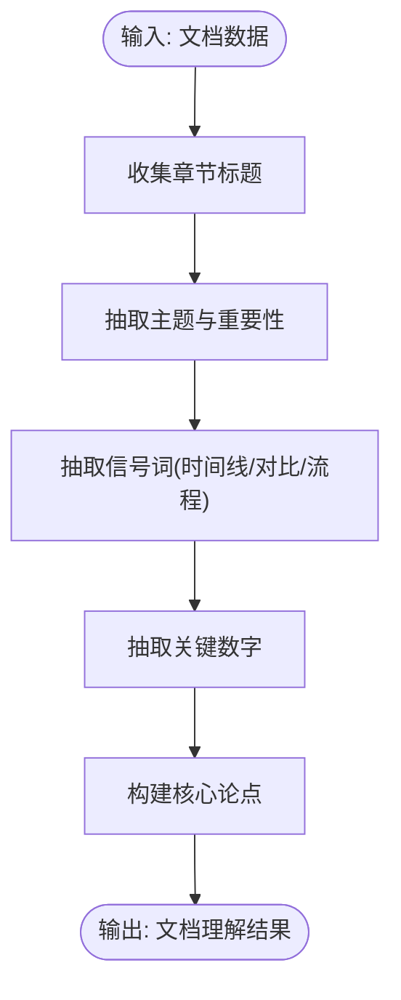
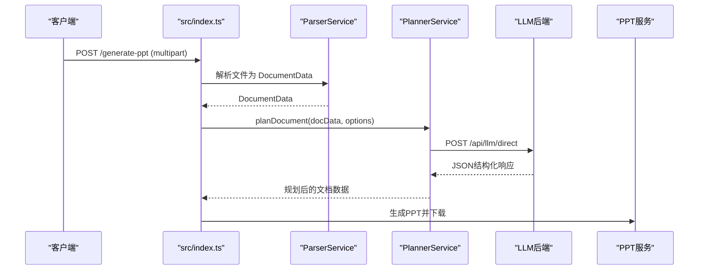
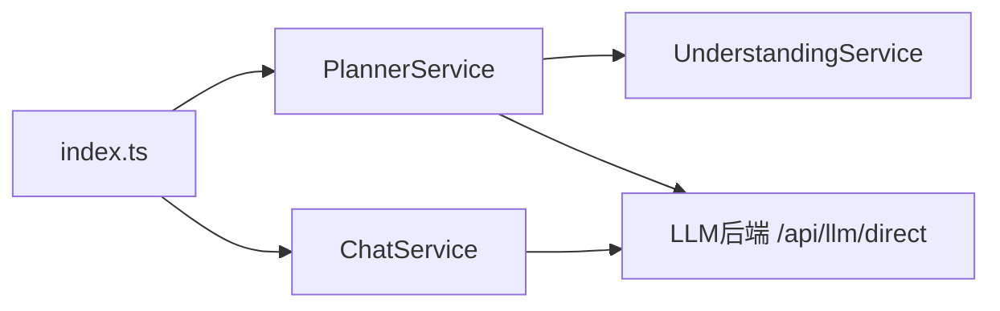

# 内容规划服务

<cite>
**本文引用的文件列表**
- [planner.service.ts](file://src/services/planner.service.ts)
- [understanding.service.ts](file://src/services/understanding.service.ts)
- [types.ts](file://src/types.ts)
- [index.ts](file://src/index.ts)
- [readme.md](file://readme.md)
- [package.json](file://package.json)
- [chat.service.ts](file://src/services/chat.service.ts)
- [test-chat.js](file://test-chat.js)
</cite>

## 目录
1. [简介](#简介)
2. [项目结构](#项目结构)
3. [核心组件](#核心组件)
4. [架构总览](#架构总览)
5. [详细组件分析](#详细组件分析)
6. [依赖关系分析](#依赖关系分析)
7. [性能考量](#性能考量)
8. [故障排查指南](#故障排查指南)
9. [结论](#结论)
10. [附录](#附录)

## 简介
本技术文档面向内容规划服务，系统性阐述 PlannerService 与 UnderstandingService 的协作机制，解释 AI 驱动的内容规划算法与启发式策略，覆盖文档理解、角色推断、布局优化与结构化规划的实现原理。文档还深入分析 LLM 集成模式、提示工程策略与响应解析逻辑，提供可操作的配置参数说明、性能调优建议、错误处理机制，以及扩展新规划算法的方法。

## 项目结构
该仓库采用分层与功能模块化组织：
- 核心服务位于 src/services，包含 PlannerService、UnderstandingService 及其他渲染与评估服务
- 类型定义集中在 src/types，统一规划与幻灯片的数据模型
- 入口与 API 在 src/index.ts，提供 Web 服务与 CLI 调用入口
- 项目根目录包含环境变量配置与 README 使用说明



图表来源
- [index.ts:1-433](file://src/index.ts#L1-L433)
- [planner.service.ts:1-1803](file://src/services/planner.service.ts#L1-L1803)
- [understanding.service.ts:1-96](file://src/services/understanding.service.ts#L1-L96)
- [types.ts:1-160](file://src/types.ts#L1-L160)
- [chat.service.ts:62-84](file://src/services/chat.service.ts#L62-L84)
- [test-chat.js:1-30](file://test-chat.js#L1-L30)
- [package.json:1-45](file://package.json#L1-L45)
- [readme.md:1-131](file://readme.md#L1-L131)

章节来源
- [index.ts:1-433](file://src/index.ts#L1-L433)
- [readme.md:1-131](file://readme.md#L1-L131)

## 核心组件
- PlannerService：负责基于源文档与偏好构建幻灯片大纲，结合启发式规则与 LLM 输出进行结构化规划；支持严格与创意两种内容模式，具备稀疏内容扩展、标题去重、叙事连贯性强化与语言净化等能力。
- UnderstandingService：对源文档进行浅层语义分析，抽取章节标题、主题、信号词与关键数字，形成“文档理解”结果，为规划阶段提供高层摘要与焦点线索。
- 类型系统：统一定义幻灯片布局、角色、受众、风格、长度、规划模式等枚举与数据结构，确保跨模块一致性。

章节来源
- [planner.service.ts:53-101](file://src/services/planner.service.ts#L53-L101)
- [understanding.service.ts:3-22](file://src/services/understanding.service.ts#L3-L22)
- [types.ts:1-160](file://src/types.ts#L1-L160)

## 架构总览
PlannerService 与 UnderstandingService 协同工作：前者以源文档为基础，先通过启发式策略生成初版大纲，再调用 LLM 进行结构化增强；后者在规划前对文档进行快速语义洞察，辅助生成更贴合主题的简报与章节标题。



图表来源
- [index.ts:314-428](file://src/index.ts#L314-L428)
- [planner.service.ts:84-101](file://src/services/planner.service.ts#L84-L101)
- [planner.service.ts:103-162](file://src/services/planner.service.ts#L103-L162)
- [planner.service.ts:340-394](file://src/services/planner.service.ts#L340-L394)
- [understanding.service.ts:4-22](file://src/services/understanding.service.ts#L4-L22)

## 详细组件分析

### PlannerService：AI驱动的结构化规划
- 初始化与配置
  - 通过环境变量加载基础 URL、认证令牌、模型名称、代理开关、默认模式、稀疏扩展开关等
  - 支持本地直连与 Cloudflare Worker 代理两种 LLM 调用路径
- 规划主流程
  - 解析规划偏好与模式
  - 生成启发式计划（含议程、章节收尾、角色推断、布局与图像提示）
  - 若启用 LLM，构造提示并调用后端接口，解析 JSON 结构，合并启发式与 LLM 结果
  - 稀疏内容扩展：识别信息不足的幻灯片，先启发式补全，再可选地请求 LLM 扩展
  - 增强叙事连贯性、去重标题、净化语言与本地化标题
- 提示工程与响应解析
  - 规则与约束显式写入提示，限定输出为合法 JSON
  - 多种响应形态兼容解析（直接文本、choices、data.reply 等）
  - JSON 提取支持三引号围栏与首尾大括号定位
- 角色推断与布局策略
  - 基于时间线、对比、流程、数据高亮等信号识别 slideRole
  - 根据角色与格式自动选择 image_overlay 或 image_only
- 语言净化与本地化
  - 针对中文场景的标题本地化、长英文短语检测与替换策略
  - 对 deckGoal、可见叙述与标题进行清洗与替换



图表来源
- [planner.service.ts:84-101](file://src/services/planner.service.ts#L84-L101)
- [planner.service.ts:103-162](file://src/services/planner.service.ts#L103-L162)
- [planner.service.ts:860-892](file://src/services/planner.service.ts#L860-L892)
- [planner.service.ts:1429-1457](file://src/services/planner.service.ts#L1429-L1457)
- [planner.service.ts:1406-1427](file://src/services/planner.service.ts#L1406-L1427)
- [planner.service.ts:450-497](file://src/services/planner.service.ts#L450-L497)

章节来源
- [planner.service.ts:67-82](file://src/services/planner.service.ts#L67-L82)
- [planner.service.ts:103-162](file://src/services/planner.service.ts#L103-L162)
- [planner.service.ts:192-231](file://src/services/planner.service.ts#L192-L231)
- [planner.service.ts:254-276](file://src/services/planner.service.ts#L254-L276)
- [planner.service.ts:340-394](file://src/services/planner.service.ts#L340-L394)
- [planner.service.ts:860-892](file://src/services/planner.service.ts#L860-L892)
- [planner.service.ts:965-1042](file://src/services/planner.service.ts#L965-L1042)
- [planner.service.ts:1429-1457](file://src/services/planner.service.ts#L1429-L1457)
- [planner.service.ts:1406-1427](file://src/services/planner.service.ts#L1406-L1427)
- [planner.service.ts:450-497](file://src/services/planner.service.ts#L450-L497)

### UnderstandingService：文档理解与主题抽取
- 章节标题收集：优先取层级较浅的标题，去重并限制数量
- 主题抽取：基于标题与要点数量计算重要性，排序取前若干
- 信号词与关键数字：通过正则匹配抽取时间线、对比、流程、数值等线索
- 论点提炼：优先取首个摘要或要点作为核心论点



图表来源
- [understanding.service.ts:4-22](file://src/services/understanding.service.ts#L4-L22)
- [understanding.service.ts:24-46](file://src/services/understanding.service.ts#L24-L46)
- [understanding.service.ts:48-66](file://src/services/understanding.service.ts#L48-L66)
- [understanding.service.ts:68-75](file://src/services/understanding.service.ts#L68-L75)
- [understanding.service.ts:77-89](file://src/services/understanding.service.ts#L77-L89)

章节来源
- [understanding.service.ts:3-22](file://src/services/understanding.service.ts#L3-L22)

### 数据模型与类型系统
- 幻灯片布局与来源：image_overlay、image_only、original/ai_primary/ai_fallback/placeholder
- 角色枚举：content/agenda/section_divider/key_insight/timeline/comparison/process/data_highlight/summary/next_step
- 规划模式：strict/creative
- 配置维度：DeckFormat、DeckAudience、DeckFocus、DeckStyle、DeckLength
- 文档数据结构：title、slides、brief、understanding
- 质量评估指标：覆盖度、重复度、稀疏度、布局比例、混合语言等

章节来源
- [types.ts:1-160](file://src/types.ts#L1-L160)

### API 工作流与集成点
- Web API：接收文件上传，解析为 DocumentData，调用 PlannerService 完成规划，可选生成 AI 图像并导出 PPT
- CLI：通过 npm run generate 调用统一管道
- LLM 集成：PlannerService 与 ChatService 均通过 /api/llm/direct 发送提示，支持温度与模型参数



图表来源
- [index.ts:314-428](file://src/index.ts#L314-L428)
- [planner.service.ts:103-162](file://src/services/planner.service.ts#L103-L162)
- [chat.service.ts:62-84](file://src/services/chat.service.ts#L62-L84)

章节来源
- [index.ts:314-428](file://src/index.ts#L314-L428)
- [chat.service.ts:62-84](file://src/services/chat.service.ts#L62-L84)

## 依赖关系分析
- PlannerService 依赖 UnderstandingService 进行文档理解
- PlannerService 与 ChatService 共享相同的 LLM 调用接口与提示风格
- index.ts 将各服务串联，形成完整的生成流水线



图表来源
- [planner.service.ts:81](file://src/services/planner.service.ts#L81)
- [understanding.service.ts:1](file://src/services/understanding.service.ts#L1)
- [chat.service.ts:62-84](file://src/services/chat.service.ts#L62-L84)
- [index.ts:45-51](file://src/index.ts#L45-L51)

章节来源
- [planner.service.ts:81](file://src/services/planner.service.ts#L81)
- [understanding.service.ts:1](file://src/services/understanding.service.ts#L1)
- [chat.service.ts:62-84](file://src/services/chat.service.ts#L62-L84)
- [index.ts:45-51](file://src/index.ts#L45-L51)

## 性能考量
- LLM 调用超时与代理：PlannerService 默认禁用代理，设置较长超时（120 秒），避免网络波动导致失败
- 温度与模式：严格模式温度较低，创意模式稍高，平衡稳定性与创造性
- 稀疏内容扩展：仅在开启扩展开关时触发，避免不必要的二次调用
- 并发与资源：图像生成可通过环境变量控制并发度，减少资源争用
- 响应解析健壮性：多形态响应兼容解析，提升鲁棒性

章节来源
- [planner.service.ts:130-138](file://src/services/planner.service.ts#L130-L138)
- [planner.service.ts:124-127](file://src/services/planner.service.ts#L124-L127)
- [planner.service.ts:875-886](file://src/services/planner.service.ts#L875-L886)
- [readme.md:26-29](file://readme.md#L26-L29)

## 故障排查指南
- LLM 无响应或返回空内容
  - 检查认证令牌是否正确配置，或是否允许访客登录
  - 确认后端 URL 与模型名称有效
  - 查看日志输出的错误状态码与消息
- JSON 解析失败
  - 确保提示中要求返回合法 JSON，且包含输出模式声明
  - 检查响应体中是否存在 ```json 围栏或首尾大括号
- Worker 代理异常
  - 确认已启用代理开关并正确配置代理 URL 与 API Key
  - 检查代理返回体结构，确保包含候选内容与文本字段
- 规划结果不符合预期
  - 调整规划模式（strict/creative）、受众、焦点、风格、长度等偏好
  - 检查稀疏扩展开关与本地化语言策略

章节来源
- [planner.service.ts:117-120](file://src/services/planner.service.ts#L117-L120)
- [planner.service.ts:140-143](file://src/services/planner.service.ts#L140-L143)
- [planner.service.ts:254-276](file://src/services/planner.service.ts#L254-L276)
- [planner.service.ts:1646-1648](file://src/services/planner.service.ts#L1646-L1648)
- [planner.service.ts:1688-1691](file://src/services/planner.service.ts#L1688-L1691)
- [readme.md:52-66](file://readme.md#L52-L66)

## 结论
PlannerService 与 UnderstandingService 通过“启发式 + LLM”的双轨策略，实现了从源文档到结构化幻灯片大纲的高质量转换。前者负责规划与布局优化、角色推断与语言净化，后者提供高层语义洞察。配合严格的提示工程与健壮的响应解析，系统在稳定性与可扩展性之间取得良好平衡。通过合理配置与参数调优，可在不同受众与风格需求下获得一致的高质量输出。

## 附录

### 提示工程与响应解析要点
- 明确规则与约束：限定输出为合法 JSON，声明输出模式与 schema
- 多形态响应兼容：支持 choices、data.reply、message 中 JSON 字段等
- JSON 提取策略：优先三引号围栏，其次首尾大括号定位

章节来源
- [planner.service.ts:192-231](file://src/services/planner.service.ts#L192-L231)
- [planner.service.ts:233-252](file://src/services/planner.service.ts#L233-L252)
- [planner.service.ts:325-338](file://src/services/planner.service.ts#L325-L338)

### 配置参数与环境变量
- 规划器开关与模式
  - ENABLE_PLANNER：启用/禁用规划器
  - PLANNER_CONTENT_MODE：strict/creative
  - PLANNER_EXPAND_SPARSE_CONTENT：稀疏内容扩展开关
- 认证与代理
  - PLANNER_AUTH_TOKEN/LLM_AUTH_TOKEN：LLM 调用令牌
  - PLANNER_USE_GUEST_LOGIN：允许访客登录
  - PLANNER_USE_WORKER_PROXY：启用 Cloudflare Worker 代理
  - CLOUDFLARE_WORKER_URL、LLM_API_KEY/GOOGLE_API_KEY：代理相关
  - AIWORKFLOW_BACKEND_ENV_PATH：外部环境文件路径
- LLM 与后端
  - PLANNER_MODEL：模型名称
  - PLANNER_API_BASE_URL：后端地址
- 图像与渲染
  - ENABLE_AI_IMAGES：启用 AI 图像
  - IMAGE_CONCURRENCY：图像并发数
  - PPT_RENDER_MODE：HTML/PPT 渲染模式
  - PPT_IMAGE_ONLY_MODE：仅图像模式
  - PPT_KEEP_TEXT：保留文本
  - PPT_MAX_BULLETS_PER_SLIDE：每页最大要点数

章节来源
- [readme.md:17-66](file://readme.md#L17-L66)
- [planner.service.ts:67-81](file://src/services/planner.service.ts#L67-L81)
- [planner.service.ts:1555-1585](file://src/services/planner.service.ts#L1555-L1585)
- [planner.service.ts:1646-1648](file://src/services/planner.service.ts#L1646-L1648)
- [index.ts:380-406](file://src/index.ts#L380-L406)

### 错误处理与回退策略
- 认证令牌缺失：记录警告并回退至启发式规划
- LLM 返回非 200 或 success=false：记录警告并跳过 LLM 结果
- 响应为空或无法解析 JSON：记录警告并回退
- Worker 代理失败：抛出错误并回退本地直连

章节来源
- [planner.service.ts:117-120](file://src/services/planner.service.ts#L117-L120)
- [planner.service.ts:140-143](file://src/services/planner.service.ts#L140-L143)
- [planner.service.ts:1688-1691](file://src/services/planner.service.ts#L1688-L1691)

### 扩展新规划算法的方法
- 新增角色与布局策略：在角色推断与布局选择处增加条件分支
- 新增稀疏内容扩展策略：在稀疏扩展流程中新增解析与应用步骤
- 新增提示工程：在提示构建函数中加入新规则与 schema
- 新增偏好维度：在偏好解析与默认值中扩展新的枚举与映射

章节来源
- [planner.service.ts:613-638](file://src/services/planner.service.ts#L613-L638)
- [planner.service.ts:1294-1328](file://src/services/planner.service.ts#L1294-L1328)
- [planner.service.ts:860-892](file://src/services/planner.service.ts#L860-L892)
- [planner.service.ts:192-231](file://src/services/planner.service.ts#L192-L231)
- [planner.service.ts:1587-1595](file://src/services/planner.service.ts#L1587-L1595)