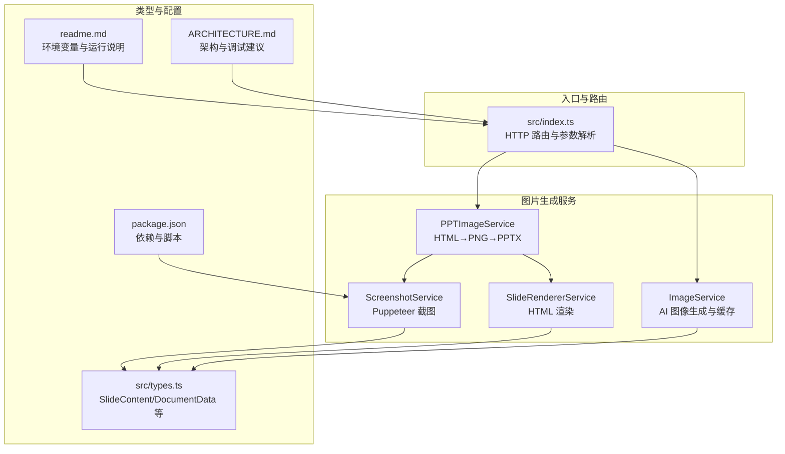
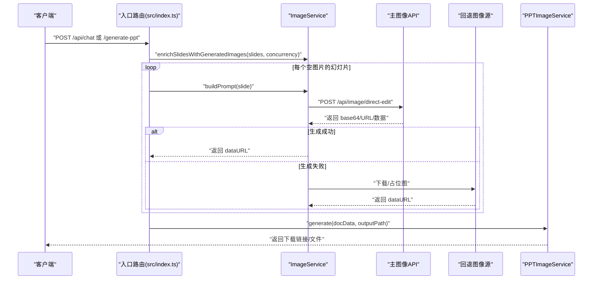
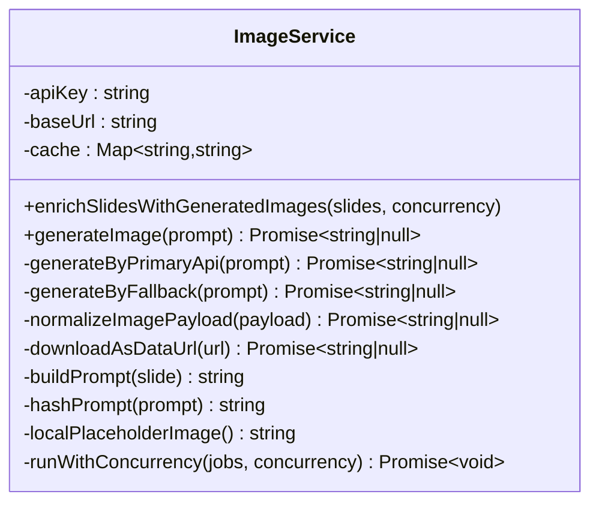
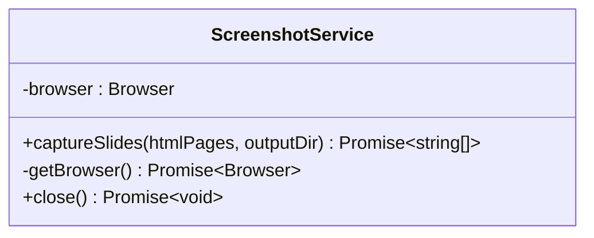
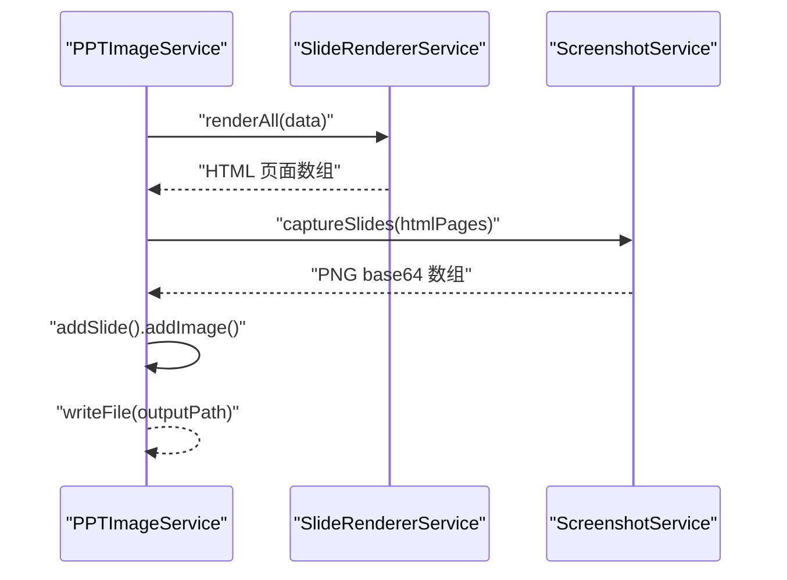
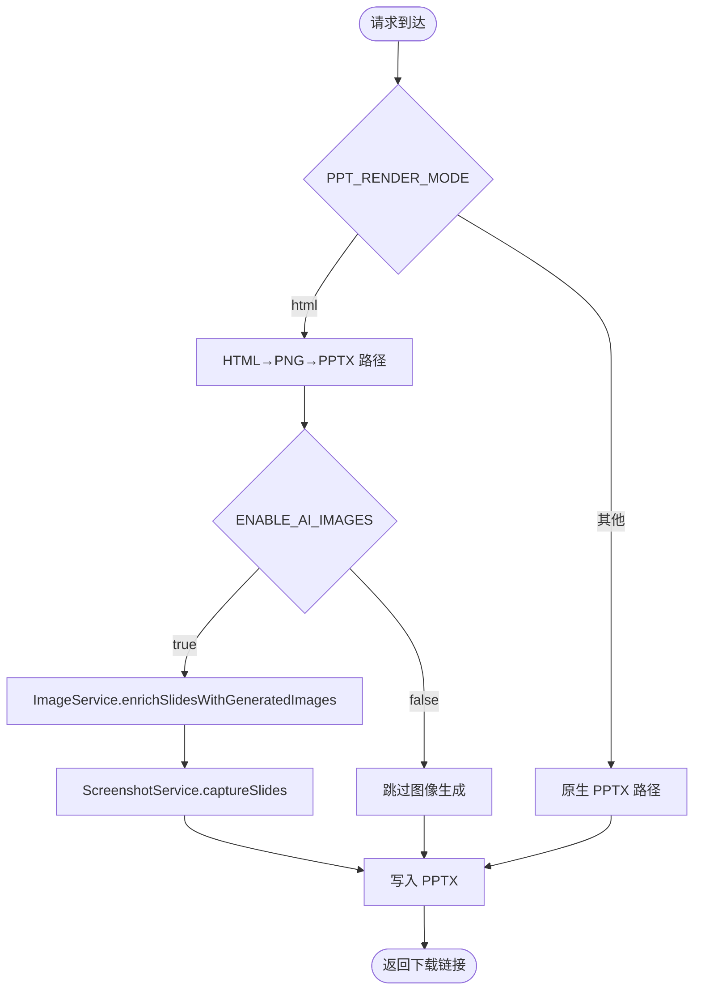
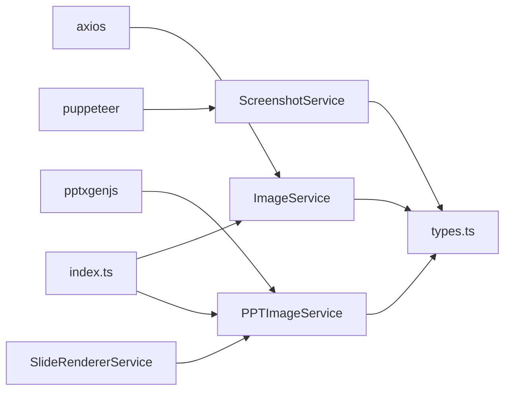

# 图片生成服务

<cite>
**本文引用的文件**
- [src/services/image.service.ts](file://src/services/image.service.ts)
- [src/services/screenshot.service.ts](file://src/services/screenshot.service.ts)
- [src/services/ppt-image.service.ts](file://src/services/ppt-image.service.ts)
- [src/services/slide-renderer.service.ts](file://src/services/slide-renderer.service.ts)
- [src/index.ts](file://src/index.ts)
- [src/types.ts](file://src/types.ts)
- [package.json](file://package.json)
- [readme.md](file://readme.md)
- [ARCHITECTURE.md](file://ARCHITECTURE.md)
- [test/test_image_api.ts](file://test/test_image_api.ts)
</cite>

## 目录
1. [简介](#简介)
2. [项目结构](#项目结构)
3. [核心组件](#核心组件)
4. [架构总览](#架构总览)
5. [详细组件分析](#详细组件分析)
6. [依赖关系分析](#依赖关系分析)
7. [性能考量](#性能考量)
8. [故障排查指南](#故障排查指南)
9. [结论](#结论)
10. [附录](#附录)

## 简介
本技术文档聚焦于图片生成服务，系统性阐述 ImageService 与 ScreenshotService 的功能特性、实现原理与集成方式，并覆盖以下主题：
- AI 图像生成集成：主 API 与回退策略、提示词构建与规范化
- 并发控制与队列管理：滑动窗口并发执行与工作线程模型
- 缓存策略：内存缓存与会话级缓存、TTL 自动清理
- 请求处理流程：从 API 提交到结果获取的端到端路径
- 性能优化：超时控制、下载归一化、占位图与降级
- 质量控制与风格调节：分辨率、宽高比、提示词约束
- 错误重试与健壮性：多层降级与日志记录
- 截图服务：基于 Puppeteer 的 HTML 渲染与高清 PNG 输出
- 与 AI 图像生成服务的集成：与 PPT 渲染管线的衔接

## 项目结构
图片生成相关模块主要分布在 src/services 下，配合入口路由与类型定义，形成“提示词构建 → AI 图像生成 → 缓存与降级 → PPT 渲染”的闭环。

**图表来源**
- [src/index.ts:71-270](file://src/index.ts#L71-L270)
- [src/services/image.service.ts:4-218](file://src/services/image.service.ts#L4-L218)
- [src/services/screenshot.service.ts:9-77](file://src/services/screenshot.service.ts#L9-L77)
- [src/services/ppt-image.service.ts:14-53](file://src/services/ppt-image.service.ts#L14-L53)
- [src/services/slide-renderer.service.ts:7-546](file://src/services/slide-renderer.service.ts#L7-L546)
- [src/types.ts:48-71](file://src/types.ts#L48-L71)
- [package.json:18-31](file://package.json#L18-L31)
- [readme.md:17-50](file://readme.md#L17-L50)
- [ARCHITECTURE.md:565-582](file://ARCHITECTURE.md#L565-L582)

**章节来源**
- [src/index.ts:71-270](file://src/index.ts#L71-L270)
- [src/services/image.service.ts:4-218](file://src/services/image.service.ts#L4-L218)
- [src/services/screenshot.service.ts:9-77](file://src/services/screenshot.service.ts#L9-L77)
- [src/services/ppt-image.service.ts:14-53](file://src/services/ppt-image.service.ts#L14-L53)
- [src/services/slide-renderer.service.ts:7-546](file://src/services/slide-renderer.service.ts#L7-L546)
- [src/types.ts:48-71](file://src/types.ts#L48-L71)
- [package.json:18-31](file://package.json#L18-L31)
- [readme.md:17-50](file://readme.md#L17-L50)
- [ARCHITECTURE.md:565-582](file://ARCHITECTURE.md#L565-L582)

## 核心组件
- ImageService：负责 AI 图像生成、提示词构建、缓存与降级回退、并发执行与结果归一化
- ScreenshotService：基于 Puppeteer 将 HTML 页面渲染为高清 PNG，支持本地输出与 base64 返回
- PPTImageService：串联 HTML 渲染与截图，将每页截图作为全屏背景写入 PPTX
- SlideRendererService：将 SlideContent 渲染为独立 HTML 页面，适配 1920×1080 像素与 2x deviceScaleFactor
- 入口路由与并发控制：通过环境变量控制是否启用 AI 图像、并发度与渲染模式

**章节来源**
- [src/services/image.service.ts:4-218](file://src/services/image.service.ts#L4-L218)
- [src/services/screenshot.service.ts:9-77](file://src/services/screenshot.service.ts#L9-L77)
- [src/services/ppt-image.service.ts:14-53](file://src/services/ppt-image.service.ts#L14-L53)
- [src/services/slide-renderer.service.ts:7-546](file://src/services/slide-renderer.service.ts#L7-L546)
- [src/index.ts:235-255](file://src/index.ts#L235-L255)

## 架构总览
图片生成服务贯穿“提示词 → AI 生成 → 缓存 → 渲染 → 导出”的主干流程；同时提供回退策略以确保系统健壮性。

**图表来源**
- [src/index.ts:235-255](file://src/index.ts#L235-L255)
- [src/services/image.service.ts:30-57](file://src/services/image.service.ts#L30-L57)
- [src/services/image.service.ts:59-102](file://src/services/image.service.ts#L59-L102)
- [src/services/image.service.ts:104-120](file://src/services/image.service.ts#L104-L120)
- [src/services/ppt-image.service.ts:18-51](file://src/services/ppt-image.service.ts#L18-L51)

## 详细组件分析

### ImageService 组件分析
- 功能职责
  - 为每个空图片的幻灯片生成提示词并调用主图像 API
  - 支持缓存命中、主 API 失败后的安全提示词重试与回退图像源
  - 归一化多种响应格式为 dataURL，便于下游使用
  - 控制并发执行，避免资源争用
- 关键实现要点
  - 提示词构建：优先使用 slide.imagePrompt，否则基于标题、面包屑与要点拼装
  - 主 API 调用：设置超时、禁用代理、指定模型、宽高比与分辨率
  - 回退策略：安全提示词重试 → 随机种子候选图 → 本地占位图
  - 缓存：Map<string, string>，键为去空白提示词
  - 并发：runWithConcurrency 使用固定数量工作线程，游标推进
- 错误处理
  - 主 API 异常捕获与日志输出
  - 回退失败时返回最小可用占位图，保证流程不中断

**图表来源**
- [src/services/image.service.ts:4-218](file://src/services/image.service.ts#L4-L218)

**章节来源**
- [src/services/image.service.ts:15-28](file://src/services/image.service.ts#L15-L28)
- [src/services/image.service.ts:30-57](file://src/services/image.service.ts#L30-L57)
- [src/services/image.service.ts:59-102](file://src/services/image.service.ts#L59-L102)
- [src/services/image.service.ts:104-120](file://src/services/image.service.ts#L104-L120)
- [src/services/image.service.ts:122-136](file://src/services/image.service.ts#L122-L136)
- [src/services/image.service.ts:142-156](file://src/services/image.service.ts#L142-L156)
- [src/services/image.service.ts:158-178](file://src/services/image.service.ts#L158-L178)
- [src/services/image.service.ts:180-192](file://src/services/image.service.ts#L180-L192)
- [src/services/image.service.ts:194-197](file://src/services/image.service.ts#L194-L197)
- [src/services/image.service.ts:199-216](file://src/services/image.service.ts#L199-L216)

### ScreenshotService 组件分析
- 功能职责
  - 使用 Puppeteer 将 HTML 字符串渲染为高清 PNG（1920×1080 viewport + 2x deviceScaleFactor）
  - 支持本地输出与 base64 返回，便于直接写入 PPTX
- 关键实现要点
  - 浏览器生命周期管理：单实例复用，必要时重启
  - 截图参数：全页截图、裁剪区域与 PNG 类型
  - 输出目录：自动创建临时目录，逐页输出 PNG
- 错误处理
  - 页面加载超时与网络异常捕获
  - 文件读取失败时返回空结果，避免中断

**图表来源**
- [src/services/screenshot.service.ts:9-77](file://src/services/screenshot.service.ts#L9-L77)

**章节来源**
- [src/services/screenshot.service.ts:15-52](file://src/services/screenshot.service.ts#L15-L52)
- [src/services/screenshot.service.ts:54-68](file://src/services/screenshot.service.ts#L54-L68)
- [src/services/screenshot.service.ts:70-76](file://src/services/screenshot.service.ts#L70-L76)

### PPTImageService 组件分析
- 功能职责
  - 将 DocumentData 渲染为 HTML 页面数组
  - 调用截图服务生成高清 PNG
  - 将每页 PNG 作为全屏背景写入 PPTX
- 关键实现要点
  - 布局：LAYOUT_WIDE，单位英寸
  - 图片尺寸：13.333 × 7.5 英寸，适配 1920×1080 像素
  - 输出：写入文件并关闭浏览器句柄

**图表来源**
- [src/services/ppt-image.service.ts:18-51](file://src/services/ppt-image.service.ts#L18-L51)
- [src/services/slide-renderer.service.ts:14-46](file://src/services/slide-renderer.service.ts#L14-L46)
- [src/services/screenshot.service.ts:15-52](file://src/services/screenshot.service.ts#L15-L52)

**章节来源**
- [src/services/ppt-image.service.ts:14-53](file://src/services/ppt-image.service.ts#L14-L53)

### SlideRendererService 组件分析
- 功能职责
  - 将 SlideContent 渲染为独立 HTML 页面，支持多种 slideRole 的专用布局
- 关键实现要点
  - 设计分辨率：1920×1080，渲染时 2x deviceScaleFactor
  - 多种布局：封面、议程、对比、时间线、总结/下一步等
  - 样式内联：使用 CSS 定义背景、渐变、遮罩与动画
  - 内容转义：防止 XSS 注入
- 与截图服务的契合
  - 1920×1080 像素与 PNG 输出，确保截图清晰度

**章节来源**
- [src/services/slide-renderer.service.ts:7-546](file://src/services/slide-renderer.service.ts#L7-L546)

### 入口路由与并发控制
- 端点
  - /api/chat：支持文件上传与消息历史，生成聊天驱动的 PPT
  - /generate-ppt：直接上传文档生成 PPT
- 并发与模式
  - 通过环境变量控制是否启用 AI 图像、并发度与渲染模式（原生 vs HTML→PNG→PPTX）
  - 会话级图片缓存：按文档标题哈希缓存原始图片，10 分钟 TTL

**图表来源**
- [src/index.ts:235-255](file://src/index.ts#L235-L255)
- [src/index.ts:314-428](file://src/index.ts#L314-L428)
- [src/index.ts:53-69](file://src/index.ts#L53-L69)

**章节来源**
- [src/index.ts:71-270](file://src/index.ts#L71-L270)
- [src/index.ts:314-428](file://src/index.ts#L314-L428)
- [src/index.ts:53-69](file://src/index.ts#L53-L69)

## 依赖关系分析
- 外部依赖
  - axios：HTTP 客户端，用于主图像 API 与回退图像下载
  - puppeteer：无头浏览器，用于 HTML 截图
  - pptxgenjs：PPTX 生成
- 内部耦合
  - ImageService 依赖 SlideContent 类型
  - PPTImageService 依赖 SlideRendererService 与 ScreenshotService
  - 入口路由同时依赖 ImageService 与 PPTImageService

**图表来源**
- [package.json:18-31](file://package.json#L18-L31)
- [src/services/image.service.ts:1-2](file://src/services/image.service.ts#L1-L2)
- [src/services/screenshot.service.ts:1](file://src/services/screenshot.service.ts#L1)
- [src/services/ppt-image.service.ts:1](file://src/services/ppt-image.service.ts#L1)
- [src/services/slide-renderer.service.ts:1](file://src/services/slide-renderer.service.ts#L1)
- [src/types.ts:48-71](file://src/types.ts#L48-L71)
- [src/index.ts:45-51](file://src/index.ts#L45-L51)

**章节来源**
- [package.json:18-31](file://package.json#L18-L31)
- [src/services/image.service.ts:1-2](file://src/services/image.service.ts#L1-L2)
- [src/services/screenshot.service.ts:1](file://src/services/screenshot.service.ts#L1)
- [src/services/ppt-image.service.ts:1](file://src/services/ppt-image.service.ts#L1)
- [src/services/slide-renderer.service.ts:1](file://src/services/slide-renderer.service.ts#L1)
- [src/types.ts:48-71](file://src/types.ts#L48-L71)
- [src/index.ts:45-51](file://src/index.ts#L45-L51)

## 性能考量
- 并发控制
  - ImageService 使用固定并发数的工作线程池，避免过度并发导致 API 限流或资源耗尽
  - 并发度可通过环境变量调整，平衡吞吐与稳定性
- 超时与重试
  - 主图像 API 设置较长超时，回退图像下载设置中等超时，保障在网络波动下的可用性
  - 失败时自动尝试安全提示词与回退图像源
- 缓存策略
  - 内存缓存：提示词去空白作为键，命中即返回，减少重复请求
  - 会话级缓存：按文档标题缓存原始图片，10 分钟 TTL，自动清理
- 渲染效率
  - Puppeteer 截图采用 2x deviceScaleFactor，确保高 DPI 输出
  - 单浏览器实例复用，减少启动成本

**章节来源**
- [src/services/image.service.ts:199-216](file://src/services/image.service.ts#L199-L216)
- [src/services/image.service.ts:78-82](file://src/services/image.service.ts#L78-L82)
- [src/services/image.service.ts:144-148](file://src/services/image.service.ts#L144-L148)
- [src/index.ts:53-69](file://src/index.ts#L53-L69)
- [src/services/screenshot.service.ts:24-28](file://src/services/screenshot.service.ts#L24-L28)
- [src/services/screenshot.service.ts:54-68](file://src/services/screenshot.service.ts#L54-L68)

## 故障排查指南
- 图像生成失败
  - 检查 IMAGE_API_KEY 与 IMAGE_API_BASE_URL 是否正确配置
  - 查看主 API 调用日志与响应体，确认模型、宽高比与分辨率参数
  - 若主 API 失败，系统会自动尝试安全提示词与回退图像源
- 截图异常
  - 确认 Puppeteer 依赖安装与无头模式参数
  - 检查输出目录权限与磁盘空间
- 并发过高
  - 适当降低 IMAGE_CONCURRENCY，避免外部 API 限流
- 会话级缓存失效
  - 确认文档标题匹配与缓存 TTL 设置
- 端到端测试
  - 使用测试脚本验证图像生成 API 的可用性与耗时

**章节来源**
- [readme.md:17-50](file://readme.md#L17-L50)
- [ARCHITECTURE.md:743-750](file://ARCHITECTURE.md#L743-L750)
- [test/test_image_api.ts:8-41](file://test/test_image_api.ts#L8-L41)

## 结论
图片生成服务通过“提示词构建 → AI 图像生成 → 缓存与降级 → 渲染导出”的完整链路，实现了高可用、可扩展的演示文稿图像增强能力。ImageService 提供稳健的主 API 调用与多层回退策略，ScreenshotService 与 PPTImageService 将 HTML 渲染与高清截图无缝衔接，入口路由通过环境变量灵活控制渲染模式与并发度。整体设计遵循“优先保证链路可完成”的原则，在外部依赖不稳定的情况下仍能持续交付可用的 PPT。

## 附录
- 环境变量参考
  - IMAGE_API_KEY、IMAGE_API_BASE_URL：图像 API 认证与地址
  - ENABLE_AI_IMAGES、IMAGE_CONCURRENCY：是否启用 AI 图像与并发度
  - PPT_RENDER_MODE：渲染模式（原生或 HTML→PNG→PPTX）
  - PPT_TEMPLATE_STYLE、PPT_IMAGE_ONLY_MODE、PPT_KEEP_TEXT 等：PPT 渲染风格控制
- 示例与测试
  - 使用测试脚本验证图像生成 API 的可用性与耗时

**章节来源**
- [readme.md:17-50](file://readme.md#L17-L50)
- [test/test_image_api.ts:8-41](file://test/test_image_api.ts#L8-L41)