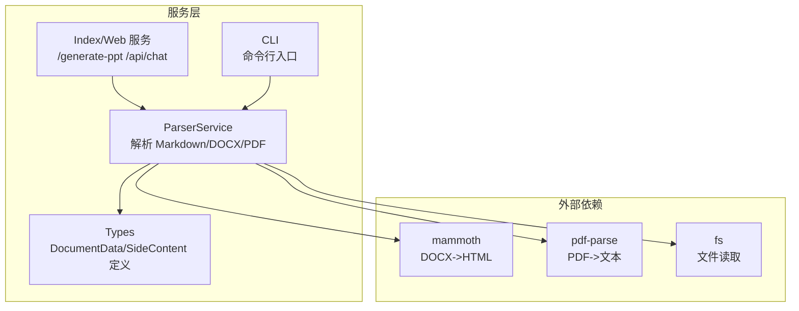
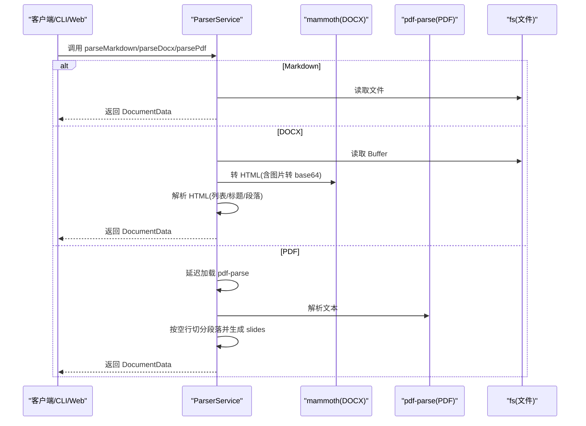
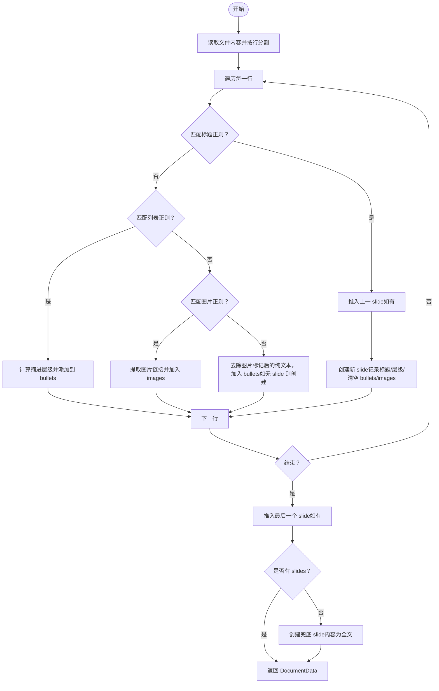
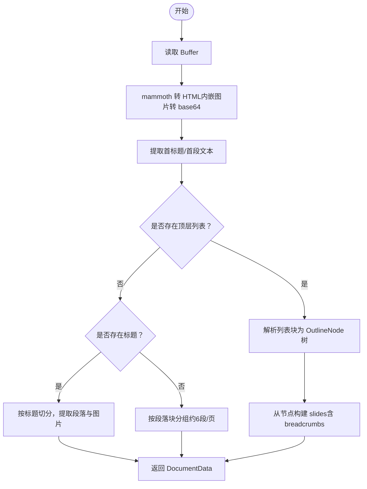
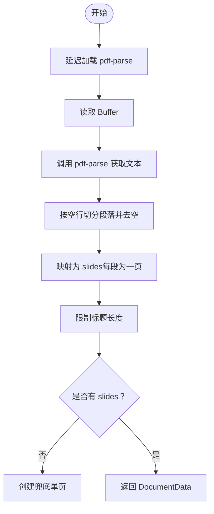
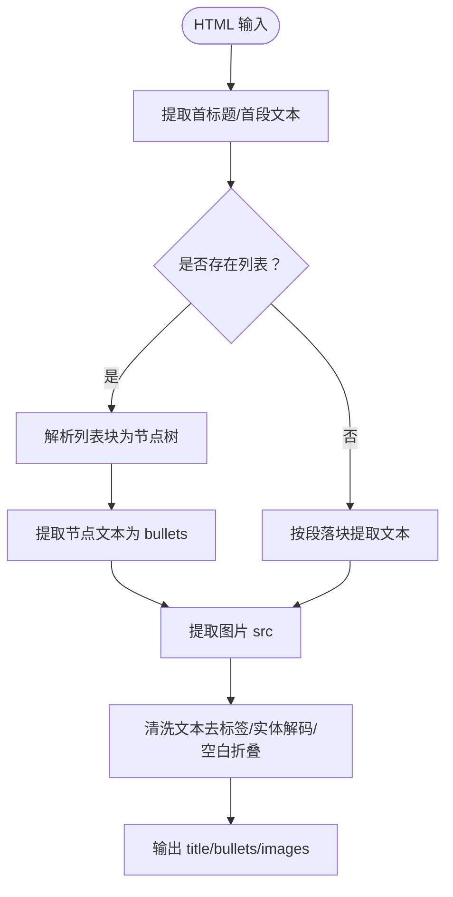
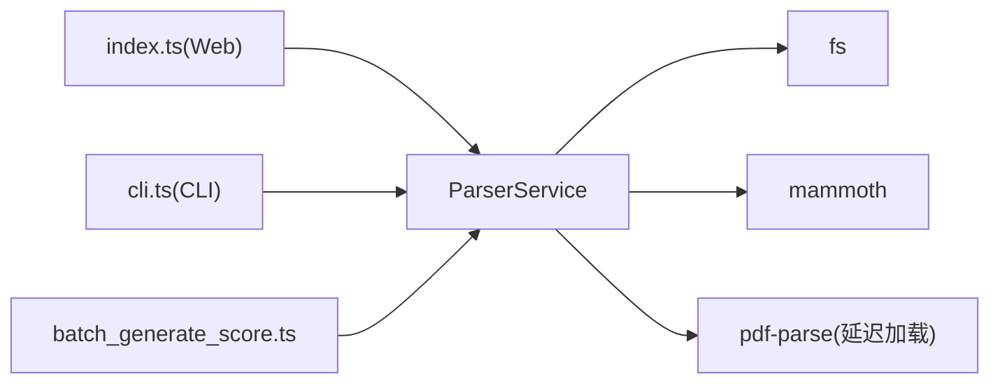

# 文档解析服务

<cite>
**本文引用的文件**
- [parser.service.ts](file://src/services/parser.service.ts)
- [types.ts](file://src/types.ts)
- [index.ts](file://src/index.ts)
- [cli.ts](file://src/cli.ts)
- [package.json](file://package.json)
- [ARCHITECTURE.md](file://ARCHITECTURE.md)
- [readme.md](file://readme.md)
- [test.md](file://test.md)
- [batch_generate_score.ts](file://test/batch_generate_score.ts)
</cite>

## 目录
1. [简介](#简介)
2. [项目结构](#项目结构)
3. [核心组件](#核心组件)
4. [架构总览](#架构总览)
5. [详细组件分析](#详细组件分析)
6. [依赖关系分析](#依赖关系分析)
7. [性能考量](#性能考量)
8. [故障排查指南](#故障排查指南)
9. [结论](#结论)
10. [附录](#附录)

## 简介
本文档解析服务围绕 ParserService 类展开，系统性阐述其在 Markdown、DOCX、PDF 三种输入格式下的解析策略与实现细节，包括正则表达式匹配规则、HTML 处理逻辑、文档结构化转换过程（标题提取、列表解析、图片识别与内容组织）、错误处理机制、性能优化策略、扩展新格式的方法、配置选项、返回值格式与最佳实践。文档同时给出与 Web 服务、CLI、批量测试等使用场景的集成说明，帮助开发者快速理解并高效使用该解析服务。

## 项目结构
ParserService 位于 src/services/parser.service.ts，负责将 Markdown、DOCX、PDF 文档解析为统一的 DocumentData 结构，供后续 PlannerService、ImageService、PPTService、EvaluatorService 使用。类型定义集中在 src/types.ts，Web 服务入口在 src/index.ts，CLI 入口在 src/cli.ts，依赖声明在 package.json 中。

**图表来源**
- [parser.service.ts:11-183](file://src/services/parser.service.ts#L11-L183)
- [index.ts:45-51](file://src/index.ts#L45-L51)
- [cli.ts:5-10](file://src/cli.ts#L5-L10)
- [package.json:18-31](file://package.json#L18-L31)

**章节来源**
- [parser.service.ts:11-183](file://src/services/parser.service.ts#L11-L183)
- [types.ts:48-71](file://src/types.ts#L48-L71)
- [index.ts:45-51](file://src/index.ts#L45-L51)
- [cli.ts:5-10](file://src/cli.ts#L5-L10)
- [package.json:18-31](file://package.json#L18-L31)

## 核心组件
- ParserService：提供 parseMarkdown、parseDocx、parsePdf 三个核心解析方法，统一输出 DocumentData。
- DocumentData：包含 title 与 slides 数组，作为中间态贯穿后续各服务。
- SlideContent：每页内容结构，包含 title、bullets、images、level、breadcrumb 等字段。
- 依赖：mammoth（DOCX->HTML）、pdf-parse（PDF->文本）、fs（文件读取）。

**章节来源**
- [parser.service.ts:11-183](file://src/services/parser.service.ts#L11-L183)
- [types.ts:48-71](file://src/types.ts#L48-L71)

## 架构总览
ParserService 作为“文档解析”阶段的唯一入口，负责将不同格式的输入转换为结构化的 DocumentData，为后续的规划、补图、渲染与评估提供高质量中间态。

**图表来源**
- [parser.service.ts:12-97](file://src/services/parser.service.ts#L12-L97)
- [parser.service.ts:99-134](file://src/services/parser.service.ts#L99-L134)
- [parser.service.ts:136-183](file://src/services/parser.service.ts#L136-L183)

## 详细组件分析

### Markdown 解析策略与实现
- 输入：Markdown 文件路径
- 核心流程
  - 读取文件内容并按行分割
  - 正则匹配标题行（# 标题），记录文档标题与层级
  - 正则匹配列表项（-、*、+ 或 数字.），计算缩进层级并规范化为缩进后的条目
  - 正则匹配 Markdown 图片语法，提取图片链接并加入当前 slide 的 images
  - 忽略图片标记后的纯文本部分，作为普通条目加入 bullets
  - 收尾：将 currentSlide 推入 slides，若无 slide 则兜底为单页
- 输出：DocumentData，包含 title 与 slides

**图表来源**
- [parser.service.ts:12-97](file://src/services/parser.service.ts#L12-L97)

**章节来源**
- [parser.service.ts:12-97](file://src/services/parser.service.ts#L12-L97)

### DOCX 解析策略与实现
- 输入：DOCX 文件路径
- 核心流程
  - 读取 Buffer，使用 mammoth 转换为 HTML，并将内嵌图片转为 data URL（base64）
  - 优先尝试提取顶层列表块（ol/ul），递归解析为 OutlineNode 树，构建 slides
  - 若无列表，则按标题（h1-h6）切分，提取每个标题后的段落与图片
  - 若仍无内容，则按段落块（p/div）分组，每组约 6 个段落为一页
  - 若仍为空，则创建单页兜底
- HTML 处理
  - 提取首标题或首段文本作为标题
  - 提取列表节点文本与子节点文本，构建 bullets
  - 提取 img src，作为 images
  - 清洗 HTML 标签、实体编码，去除多余空白

**图表来源**
- [parser.service.ts:99-134](file://src/services/parser.service.ts#L99-L134)
- [parser.service.ts:185-244](file://src/services/parser.service.ts#L185-L244)
- [parser.service.ts:246-285](file://src/services/parser.service.ts#L246-L285)
- [parser.service.ts:287-310](file://src/services/parser.service.ts#L287-L310)
- [parser.service.ts:312-338](file://src/services/parser.service.ts#L312-L338)
- [parser.service.ts:376-402](file://src/services/parser.service.ts#L376-L402)
- [parser.service.ts:404-416](file://src/services/parser.service.ts#L404-L416)

**章节来源**
- [parser.service.ts:99-134](file://src/services/parser.service.ts#L99-L134)
- [parser.service.ts:185-244](file://src/services/parser.service.ts#L185-L244)
- [parser.service.ts:246-285](file://src/services/parser.service.ts#L246-L285)
- [parser.service.ts:287-310](file://src/services/parser.service.ts#L287-L310)
- [parser.service.ts:312-338](file://src/services/parser.service.ts#L312-L338)
- [parser.service.ts:376-402](file://src/services/parser.service.ts#L376-L402)
- [parser.service.ts:404-416](file://src/services/parser.service.ts#L404-L416)

### PDF 解析策略与实现
- 输入：PDF 文件路径
- 核心流程
  - 延迟加载 pdf-parse（避免在旧 Node 环境强制依赖）
  - 读取 Buffer，调用 pdf-parse 获取文本
  - 按两个以上空行切分段落，再将每个段落按换行拆分为行，过滤空行
  - 每个段落生成一页，标题为第一行，其余为 bullets；限制标题长度
  - 若无段落，兜底为单页
- 错误处理
  - 加载 pdf-parse 失败时抛出明确错误，提示使用较新的 Node.js 版本

**图表来源**
- [parser.service.ts:136-183](file://src/services/parser.service.ts#L136-L183)

**章节来源**
- [parser.service.ts:136-183](file://src/services/parser.service.ts#L136-L183)

### HTML 处理与结构化转换
- 标题提取：优先 h1-h6，否则使用首段文本
- 列表解析：提取顶层 ol/ul，递归解析 li，剥离嵌套列表后提取文本与图片
- 段落解析：按 p/div 提取文本，作为兜底内容
- 图片提取：提取 img src，支持 data URL 与远程 URL
- 文本清洗：去除标签、折叠空白、解码 HTML 实体

**图表来源**
- [parser.service.ts:185-244](file://src/services/parser.service.ts#L185-L244)
- [parser.service.ts:376-402](file://src/services/parser.service.ts#L376-L402)
- [parser.service.ts:404-416](file://src/services/parser.service.ts#L404-L416)
- [parser.service.ts:418-451](file://src/services/parser.service.ts#L418-L451)

**章节来源**
- [parser.service.ts:185-244](file://src/services/parser.service.ts#L185-L244)
- [parser.service.ts:376-402](file://src/services/parser.service.ts#L376-L402)
- [parser.service.ts:404-416](file://src/services/parser.service.ts#L404-L416)
- [parser.service.ts:418-451](file://src/services/parser.service.ts#L418-L451)

### 正则表达式匹配规则
- 标题匹配：匹配 1-6 个 # 后跟空格与标题文本
- 列表匹配：匹配缩进（偶数空格/制表符）+ 项目符号（-、*、+ 或 数字.）+ 内容
- 图片匹配：匹配 Markdown 图片语法，提取括号内的链接
- HTML 标题匹配：匹配 h1-h6 标签及其内容
- HTML 图片匹配：匹配 img 标签的 src 属性
- HTML 段落匹配：匹配 p/div 标签块

**章节来源**
- [parser.service.ts:28](file://src/services/parser.service.ts#L28)
- [parser.service.ts:47](file://src/services/parser.service.ts#L47)
- [parser.service.ts:58](file://src/services/parser.service.ts#L58)
- [parser.service.ts:187](file://src/services/parser.service.ts#L187)
- [parser.service.ts:406](file://src/services/parser.service.ts#L406)
- [parser.service.ts:220](file://src/services/parser.service.ts#L220)

### 返回值格式与数据模型
- DocumentData
  - title: 文档标题
  - slides: SlideContent[] 数组
- SlideContent
  - title: 页面标题
  - bullets: 字符串数组
  - images: 图片链接数组（支持 data URL 与远程 URL）
  - level: 标题层级（Markdown）
  - breadcrumb: 路径导航（DOCX）
  - 其他可选字段：summary、layout、imageIntent、imagePrompt、slideRole、keyMessage、speakerNotes、sourceRefs 等（由后续服务填充）

**章节来源**
- [types.ts:48-71](file://src/types.ts#L48-L71)
- [types.ts:48-64](file://src/types.ts#L48-L64)

## 依赖关系分析
- ParserService 依赖
  - fs：文件读取
  - mammoth：DOCX->HTML 转换
  - pdf-parse：PDF->文本解析（延迟加载）
- 与 Web/CLI 的集成
  - Web 服务：/generate-ppt 接收文件并调用 parseDocx/parsePdf/parseMarkdown
  - CLI：命令行参数选择文件类型并调用对应解析方法
  - 批量测试：根据扩展名路由到对应解析方法

**图表来源**
- [parser.service.ts:1-3](file://src/services/parser.service.ts#L1-L3)
- [parser.service.ts:169-183](file://src/services/parser.service.ts#L169-L183)
- [index.ts:323-335](file://src/index.ts#L323-L335)
- [cli.ts:83-92](file://src/cli.ts#L83-L92)
- [batch_generate_score.ts:192-202](file://test/batch_generate_score.ts#L192-L202)

**章节来源**
- [parser.service.ts:1-3](file://src/services/parser.service.ts#L1-L3)
- [parser.service.ts:169-183](file://src/services/parser.service.ts#L169-L183)
- [index.ts:323-335](file://src/index.ts#L323-L335)
- [cli.ts:83-92](file://src/cli.ts#L83-L92)
- [batch_generate_score.ts:192-202](file://test/batch_generate_score.ts#L192-L202)

## 性能考量
- 延迟加载 pdf-parse：仅在解析 PDF 时加载，避免在旧 Node 环境强制依赖，减少冷启动成本
- DOCX 解析优先列表：列表结构通常更接近演示层级，优先解析可减少回退成本
- 段落分页策略：DOCX 段落分组（约 6 段/页）平衡内容密度与渲染性能
- 文本清洗与实体解码：在 HTML 处理阶段集中进行，避免重复处理
- 图片处理：DOCX 内嵌图片转为 data URL，便于后续渲染，但需注意内存占用

**章节来源**
- [parser.service.ts:169-183](file://src/services/parser.service.ts#L169-L183)
- [parser.service.ts:116-127](file://src/services/parser.service.ts#L116-L127)
- [parser.service.ts:230](file://src/services/parser.service.ts#L230)
- [parser.service.ts:429-451](file://src/services/parser.service.ts#L429-L451)

## 故障排查指南
- PDF 解析失败
  - 现象：初始化 pdf-parse 抛错，提示使用较新 Node.js
  - 处理：升级 Node.js 至推荐版本及以上
- DOCX 解析无内容
  - 现象：无列表、无标题、无段落
  - 处理：检查文档结构是否规范；确认 mammoth 能正确转换
- Markdown 解析异常
  - 现象：标题未识别、列表层级错误、图片未提取
  - 处理：检查正则匹配与缩进规则；确保图片语法正确
- Web/CLI 调用报错
  - 现象：文件类型不支持、参数非法
  - 处理：确认扩展名与解析方法匹配；检查参数规范化

**章节来源**
- [parser.service.ts:169-183](file://src/services/parser.service.ts#L169-L183)
- [index.ts:323-335](file://src/index.ts#L323-L335)
- [cli.ts:83-92](file://src/cli.ts#L83-L92)

## 结论
ParserService 通过统一的 DocumentData 输出，为后续规划、补图、渲染与评估提供了高质量中间态。其针对 Markdown、DOCX、PDF 的差异化策略与稳健的 HTML 处理逻辑，使得系统在多种输入格式下均能产出结构化、可扩展的演示骨架。建议在扩展新格式时遵循现有解析范式：优先结构化元素（标题/列表/段落），其次进行 HTML 清洗与图片提取，并提供兜底策略以保证链路可用性。

## 附录

### 使用示例（代码路径）
- Web 服务解析并生成 PPT
  - [index.ts:323-335](file://src/index.ts#L323-L335)
  - [index.ts:110-118](file://src/index.ts#L110-L118)
- CLI 解析并生成 PPT
  - [cli.ts:83-92](file://src/cli.ts#L83-L92)
- 批量测试解析
  - [batch_generate_score.ts:192-202](file://test/batch_generate_score.ts#L192-L202)

### API 定义（简化）
- parseMarkdown(filePath: string): Promise<DocumentData>
- parseDocx(filePath: string): Promise<DocumentData>
- parsePdf(filePath: string): Promise<DocumentData>

**章节来源**
- [parser.service.ts:12-97](file://src/services/parser.service.ts#L12-L97)
- [parser.service.ts:99-134](file://src/services/parser.service.ts#L99-L134)
- [parser.service.ts:136-183](file://src/services/parser.service.ts#L136-L183)

### 配置与环境变量（与解析相关）
- Node 兼容性：推荐 Node.js >=16
- PDF 解析依赖：pdf-parse
- DOCX 解析依赖：mammoth
- Web/CLI：通过扩展名自动路由到对应解析方法

**章节来源**
- [readme.md:127-131](file://readme.md#L127-L131)
- [package.json:28](file://package.json#L28)
- [package.json:24](file://package.json#L24)

### 最佳实践
- 优先使用 Markdown 与 DOCX，PDF 作为兼容输入
- DOCX 文档建议规范使用标题样式与列表缩进
- Markdown 图片链接建议使用绝对路径或可访问的相对路径
- 解析后可在后续服务中进一步清洗与增强（如 PlannerService 的角色标注、ImageService 的图片补全）

**章节来源**
- [ARCHITECTURE.md:290-302](file://ARCHITECTURE.md#L290-L302)
- [ARCHITECTURE.md:278-289](file://ARCHITECTURE.md#L278-L289)