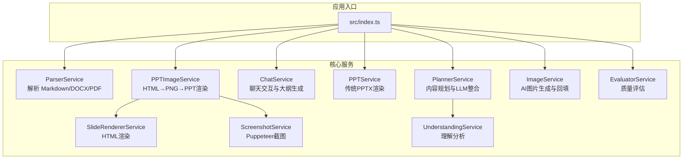
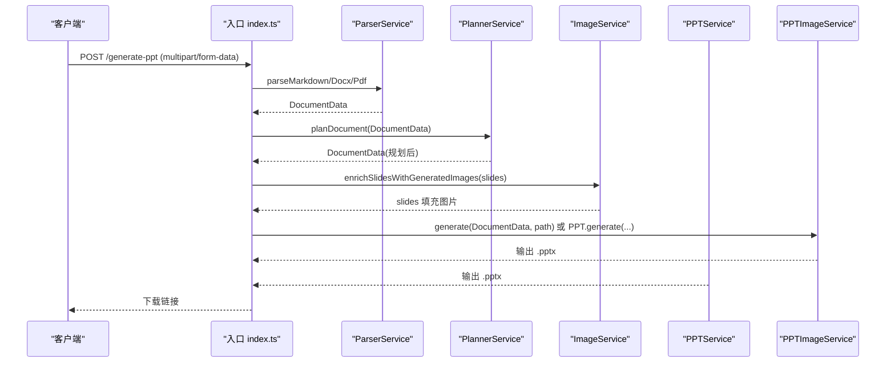
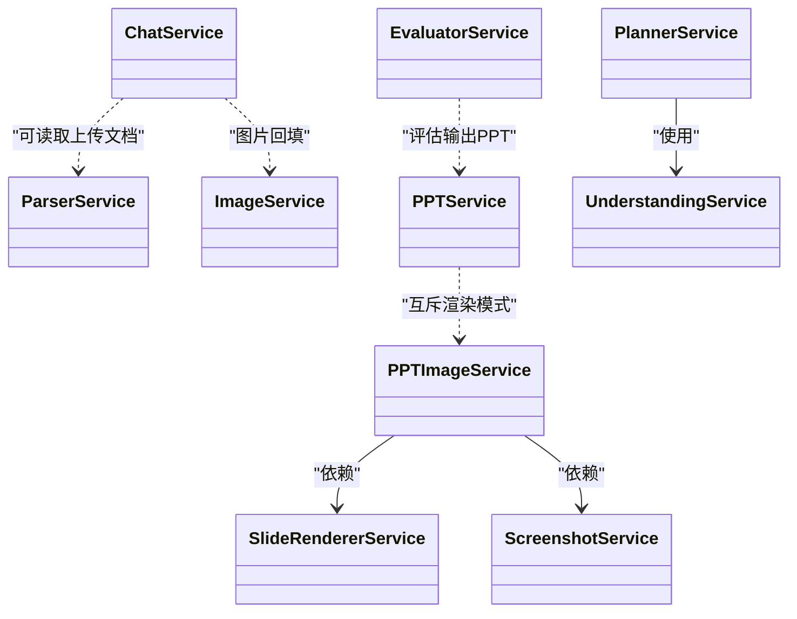

# 核心服务

<cite>
**本文引用的文件列表**
- [src/index.ts](file://src/index.ts)
- [src/types.ts](file://src/types.ts)
- [src/services/parser.service.ts](file://src/services/parser.service.ts)
- [src/services/planner.service.ts](file://src/services/planner.service.ts)
- [src/services/chat.service.ts](file://src/services/chat.service.ts)
- [src/services/ppt.service.ts](file://src/services/ppt.service.ts)
- [src/services/ppt-image.service.ts](file://src/services/ppt-image.service.ts)
- [src/services/slide-renderer.service.ts](file://src/services/slide-renderer.service.ts)
- [src/services/screenshot.service.ts](file://src/services/screenshot.service.ts)
- [src/services/image.service.ts](file://src/services/image.service.ts)
- [src/services/evaluator.service.ts](file://src/services/evaluator.service.ts)
- [src/services/understanding.service.ts](file://src/services/understanding.service.ts)
- [package.json](file://package.json)
</cite>

## 目录
1. [简介](#简介)
2. [项目结构](#项目结构)
3. [核心组件](#核心组件)
4. [架构总览](#架构总览)
5. [详细组件分析](#详细组件分析)
6. [依赖关系分析](#依赖关系分析)
7. [性能考量](#性能考量)
8. [故障排查指南](#故障排查指南)
9. [结论](#结论)
10. [附录](#附录)

## 简介
本文件面向 Generate-PPT 的核心服务模块，系统性梳理文档解析、内容规划、聊天交互、PPT 生成、图片生成与质量评估六大服务的职责、实现原理、接口与使用方式，并说明它们之间的协作关系、配置项、错误处理策略、性能优化与扩展建议。文档同时提供 API 接口说明与最佳实践，帮助开发者快速上手与深度定制。

## 项目结构
- 服务层位于 src/services 下，每个服务封装单一职责，如解析、规划、聊天、PPT 渲染、图片生成、评估等。
- 类型定义集中在 src/types.ts，统一约束数据结构与枚举类型。
- 入口位于 src/index.ts，提供 HTTP 接口与 CLI 调用入口。
- 依赖管理与脚本在 package.json 中定义。



图表来源
- [src/index.ts:1-432](file://src/index.ts#L1-L432)
- [src/services/parser.service.ts:1-453](file://src/services/parser.service.ts#L1-L453)
- [src/services/planner.service.ts:1-800](file://src/services/planner.service.ts#L1-L800)
- [src/services/chat.service.ts:1-400](file://src/services/chat.service.ts#L1-L400)
- [src/services/ppt.service.ts:1-800](file://src/services/ppt.service.ts#L1-L800)
- [src/services/ppt-image.service.ts:1-53](file://src/services/ppt-image.service.ts#L1-L53)
- [src/services/slide-renderer.service.ts:1-546](file://src/services/slide-renderer.service.ts#L1-L546)
- [src/services/screenshot.service.ts:1-77](file://src/services/screenshot.service.ts#L1-L77)
- [src/services/image.service.ts:1-218](file://src/services/image.service.ts#L1-L218)
- [src/services/evaluator.service.ts:1-800](file://src/services/evaluator.service.ts#L1-L800)
- [src/services/understanding.service.ts:1-96](file://src/services/understanding.service.ts#L1-L96)

章节来源
- [src/index.ts:1-432](file://src/index.ts#L1-L432)
- [package.json:1-45](file://package.json#L1-L45)

## 核心组件
- 文档解析服务：支持 Markdown、DOCX、PDF 三类输入，输出结构化的 DocumentData。
- 内容规划服务：结合理解分析与 LLM，生成带布局、图像意图、角色与讲稿的规划文档。
- 聊天交互服务：提供“需求收集—大纲—最终生成”的三阶段对话流程，支持结构化输出。
- PPT 生成服务：基于 pptxgenjs 的传统渲染，支持多角色幻灯片模板与样式。
- HTML→PNG→PPT 服务：通过 Puppeteer 将每页渲染为高清 PNG，再嵌入 PPT，适合高质量视觉呈现。
- 图片生成服务：为缺少图片的幻灯片生成 AI 图像，具备缓存与降级策略。
- 质量评估服务：对生成的 PPT 进行多维度评分与报告输出，辅助持续改进。

章节来源
- [src/services/parser.service.ts:1-453](file://src/services/parser.service.ts#L1-L453)
- [src/services/planner.service.ts:1-800](file://src/services/planner.service.ts#L1-L800)
- [src/services/chat.service.ts:1-400](file://src/services/chat.service.ts#L1-L400)
- [src/services/ppt.service.ts:1-800](file://src/services/ppt.service.ts#L1-L800)
- [src/services/ppt-image.service.ts:1-53](file://src/services/ppt-image.service.ts#L1-L53)
- [src/services/slide-renderer.service.ts:1-546](file://src/services/slide-renderer.service.ts#L1-L546)
- [src/services/screenshot.service.ts:1-77](file://src/services/screenshot.service.ts#L1-L77)
- [src/services/image.service.ts:1-218](file://src/services/image.service.ts#L1-L218)
- [src/services/evaluator.service.ts:1-800](file://src/services/evaluator.service.ts#L1-L800)
- [src/services/understanding.service.ts:1-96](file://src/services/understanding.service.ts#L1-L96)

## 架构总览
核心流程分为两类：
- 文件直通生成：解析 → 规划 → 图片生成（可选）→ PPT 渲染 → 下载。
- 聊天对话生成：上传文件（可选）→ 聊天阶段识别 → LLM 生成大纲/最终数据 → 图片回填 → PPT 渲染 → 下载。



图表来源
- [src/index.ts:314-427](file://src/index.ts#L314-L427)
- [src/services/parser.service.ts:12-97](file://src/services/parser.service.ts#L12-L97)
- [src/services/planner.service.ts:84-101](file://src/services/planner.service.ts#L84-L101)
- [src/services/image.service.ts:15-28](file://src/services/image.service.ts#L15-L28)
- [src/services/ppt.service.ts:53-75](file://src/services/ppt.service.ts#L53-L75)
- [src/services/ppt-image.service.ts:18-51](file://src/services/ppt-image.service.ts#L18-L51)

## 详细组件分析

### 文档解析服务（ParserService）
- 职责：从 Markdown、DOCX、PDF 解析为统一的 DocumentData 结构，包含标题与幻灯片集合。
- 实现要点：
  - Markdown：按标题与列表层级切分，提取图片与纯文本，自动补全无标题场景。
  - DOCX：使用 mammoth 转 HTML，按标题、列表、段落构建幻灯片，支持内联图片转 dataURL。
  - PDF：按段落切分，限制标题长度，兜底生成单页。
- 关键能力：多格式兼容、标题/层次/图片抽取、健壮的兜底策略。
- 性能：PDF 解析采用惰性加载，仅在需要时引入 pdf-parse。

章节来源
- [src/services/parser.service.ts:12-97](file://src/services/parser.service.ts#L12-L97)
- [src/services/parser.service.ts:99-134](file://src/services/parser.service.ts#L99-L134)
- [src/services/parser.service.ts:136-167](file://src/services/parser.service.ts#L136-L167)
- [src/services/parser.service.ts:169-183](file://src/services/parser.service.ts#L169-L183)

### 内容规划服务（PlannerService）
- 职责：将解析后的文档转换为“规划版”文档，包含角色、布局、图像意图、讲稿等。
- 实现要点：
  - 启动参数：支持外部代理（worker）、LLM 模型、默认模式、稀疏内容扩展、游客登录等。
  - Heuristic 规划：基于源文档推断章节、角色、布局、讲稿与图像提示词。
  - LLM 规划：调用外部 API 获取 JSON 规划，合并策略确保事实性与结构性平衡。
  - 后处理：语言净化、标题去重、叙事连贯性强化、摘要与要点规范化。
- 关键能力：多模式（严格/创意）、跨语言净化、角色与布局启发式、图像提示词生成。
- 错误处理：API 失败降级、空响应与无效 JSON 处理、代理模式回退。

章节来源
- [src/services/planner.service.ts:67-82](file://src/services/planner.service.ts#L67-L82)
- [src/services/planner.service.ts:84-101](file://src/services/planner.service.ts#L84-L101)
- [src/services/planner.service.ts:103-162](file://src/services/planner.service.ts#L103-L162)
- [src/services/planner.service.ts:164-190](file://src/services/planner.service.ts#L164-L190)
- [src/services/planner.service.ts:340-394](file://src/services/planner.service.ts#L340-L394)
- [src/services/planner.service.ts:450-497](file://src/services/planner.service.ts#L450-L497)
- [src/services/understanding.service.ts:1-96](file://src/services/understanding.service.ts#L1-L96)

### 聊天交互服务（ChatService）
- 职责：提供“需求收集—大纲—最终生成”的三阶段对话，支持结构化输出与图片回填。
- 实现要点：
  - 阶段识别：根据历史消息与用户输入判断当前阶段，支持“确认生成”。
  - Prompt 构建：不同阶段采用不同系统提示，强调 JSON 结构与 imagePrompt。
  - 结构化解析：识别 ```json 与 ```outline 代码块，转换为结构化数据。
  - 图片回填：将上传文档中的原始图片回填至 LLM 生成的幻灯片。
- 关键能力：阶段驱动、结构化输出、图片回填、错误提示与兜底。

章节来源
- [src/services/chat.service.ts:40-101](file://src/services/chat.service.ts#L40-L101)
- [src/services/chat.service.ts:109-141](file://src/services/chat.service.ts#L109-L141)
- [src/services/chat.service.ts:171-270](file://src/services/chat.service.ts#L171-L270)
- [src/services/chat.service.ts:272-347](file://src/services/chat.service.ts#L272-L347)
- [src/services/chat.service.ts:349-400](file://src/services/chat.service.ts#L349-L400)

### PPT 生成服务（PPTService）
- 职责：将规划后的文档渲染为 PPTX 文件，支持多种角色与布局。
- 实现要点：
  - 渲染配置：模板样式、图片模式、保留文本、最大条目数、来源标注等。
  - 幻灯片类型：封面、议程、章节分隔、时间线、对比、流程、数据高亮、总结、下一步、关键洞察、正文。
  - 主题与颜色：统一配色体系，适配中英双语环境。
  - 分页与排版：按最大条目数分页，页脚与来源标注。
- 关键能力：角色感知渲染、统一主题、分页与溢出控制。

章节来源
- [src/services/ppt.service.ts:77-85](file://src/services/ppt.service.ts#L77-L85)
- [src/services/ppt.service.ts:202-248](file://src/services/ppt.service.ts#L202-L248)
- [src/services/ppt.service.ts:250-777](file://src/services/ppt.service.ts#L250-L777)

### HTML→PNG→PPT 服务（PPTImageService）
- 职责：将每页幻灯片渲染为 HTML，使用 Puppeteer 截图为高清 PNG，再嵌入 PPT。
- 实现要点：
  - SlideRendererService：生成每页 HTML，含样式与动画。
  - ScreenshotService：设置视口与缩放，截取 PNG 并转为 base64。
  - PPTImageService：逐页插入全屏背景图，写入 PPTX。
- 关键能力：高质量视觉呈现、可扩展的 HTML 渲染管线。

章节来源
- [src/services/ppt-image.service.ts:18-51](file://src/services/ppt-image.service.ts#L18-L51)
- [src/services/slide-renderer.service.ts:14-46](file://src/services/slide-renderer.service.ts#L14-L46)
- [src/services/screenshot.service.ts:15-52](file://src/services/screenshot.service.ts#L15-L52)

### 图片生成服务（ImageService）
- 职责：为缺少图片的幻灯片生成 AI 图像，支持缓存与降级。
- 实现要点：
  - 提示词构建：优先使用 LLM 生成的 imagePrompt，否则自动拼接标题与要点。
  - 生成流程：主 API 失败后尝试简化提示词重试，再降级到备用图片或本地占位图。
  - 并发控制：按并发度执行生成任务，提升吞吐。
- 关键能力：提示词优化、缓存、降级与并发。

章节来源
- [src/services/image.service.ts:15-28](file://src/services/image.service.ts#L15-L28)
- [src/services/image.service.ts:30-57](file://src/services/image.service.ts#L30-L57)
- [src/services/image.service.ts:59-102](file://src/services/image.service.ts#L59-L102)
- [src/services/image.service.ts:104-120](file://src/services/image.service.ts#L104-L120)
- [src/services/image.service.ts:158-178](file://src/services/image.service.ts#L158-L178)
- [src/services/image.service.ts:199-216](file://src/services/image.service.ts#L199-L216)

### 质量评估服务（EvaluatorService）
- 职责：对生成的 PPT 进行多维度质量评估，输出报告与指标。
- 实现要点：
  - 渲染检查：解压 PPTX，提取每页文本与图片，统计覆盖率与多样性。
  - 指标计算：内容逻辑、布局质量、图像语义、内容丰富度、受众契合、一致性、源理解等。
  - 权重合成：按权重计算总体得分与等级，输出关键发现与改进建议。
- 关键能力：多维指标、可视化建议、可扩展的评估维度。

章节来源
- [src/services/evaluator.service.ts:32-93](file://src/services/evaluator.service.ts#L32-L93)
- [src/services/evaluator.service.ts:110-175](file://src/services/evaluator.service.ts#L110-L175)
- [src/services/evaluator.service.ts:285-356](file://src/services/evaluator.service.ts#L285-L356)
- [src/services/evaluator.service.ts:401-482](file://src/services/evaluator.service.ts#L401-L482)
- [src/services/evaluator.service.ts:484-550](file://src/services/evaluator.service.ts#L484-L550)
- [src/services/evaluator.service.ts:552-625](file://src/services/evaluator.service.ts#L552-L625)
- [src/services/evaluator.service.ts:627-698](file://src/services/evaluator.service.ts#L627-L698)
- [src/services/evaluator.service.ts:700-772](file://src/services/evaluator.service.ts#L700-L772)
- [src/services/evaluator.service.ts:774-800](file://src/services/evaluator.service.ts#L774-L800)

## 依赖关系分析



图表来源
- [src/services/planner.service.ts:81](file://src/services/planner.service.ts#L81)
- [src/services/ppt-image.service.ts:15-16](file://src/services/ppt-image.service.ts#L15-L16)
- [src/services/slide-renderer.service.ts:1-7](file://src/services/slide-renderer.service.ts#L1-L7)
- [src/services/screenshot.service.ts:1-9](file://src/services/screenshot.service.ts#L1-L9)
- [src/services/chat.service.ts:1-13](file://src/services/chat.service.ts#L1-L13)
- [src/services/image.service.ts:1-13](file://src/services/image.service.ts#L1-L13)
- [src/services/evaluator.service.ts:1-11](file://src/services/evaluator.service.ts#L1-L11)

章节来源
- [src/services/planner.service.ts:81](file://src/services/planner.service.ts#L81)
- [src/services/ppt-image.service.ts:15-16](file://src/services/ppt-image.service.ts#L15-L16)
- [src/services/slide-renderer.service.ts:1-7](file://src/services/slide-renderer.service.ts#L1-L7)
- [src/services/screenshot.service.ts:1-9](file://src/services/screenshot.service.ts#L1-L9)
- [src/services/chat.service.ts:1-13](file://src/services/chat.service.ts#L1-L13)
- [src/services/image.service.ts:1-13](file://src/services/image.service.ts#L1-L13)
- [src/services/evaluator.service.ts:1-11](file://src/services/evaluator.service.ts#L1-L11)

## 性能考量
- 并发与批处理
  - 图片生成：通过并发度控制（默认 2）提升吞吐，避免阻塞。
  - HTML 截图：Puppeteer 批量渲染，合理设置设备缩放与视口，平衡清晰度与内存占用。
- 缓存策略
  - 图片生成：按提示词缓存结果，减少重复请求。
  - 会话缓存：聊天阶段对上传文档的原始图片进行短期缓存，便于后续确认阶段回填。
- 渲染模式选择
  - 传统模式（pptxgenjs）：轻量、稳定，适合快速生成。
  - HTML→PNG→PPT：高质量视觉效果，适合对美观度要求高的场景。
- 资源与超时
  - LLM/图片 API 设置合理超时与代理策略，避免阻塞。
  - PDF 解析惰性加载，仅在需要时初始化，降低冷启动成本。

[本节为通用性能建议，无需特定文件引用]

## 故障排查指南
- 常见错误与定位
  - LLM/图片 API 失败：检查鉴权令牌、基础地址、网络代理与超时设置。
  - PDF 解析报错：确认 Node 版本满足 pdf-parse 要求（推荐 >=16）。
  - Puppeteer 截图失败：检查浏览器启动参数、磁盘空间与权限。
  - 聊天阶段无结构化输出：确认 Prompt 中包含 JSON/outline 代码块标记。
- 日志与可观测性
  - 服务内部打印阶段日志与错误堆栈，便于定位问题。
  - 质量评估服务输出渲染检查结果，辅助定位视觉与语言问题。
- 降级与兜底
  - 图片生成失败时自动使用简化提示词与备用图片。
  - 规划阶段若 LLM 不可用，使用启发式规划保证基本输出。

章节来源
- [src/services/parser.service.ts:169-183](file://src/services/parser.service.ts#L169-L183)
- [src/services/image.service.ts:30-57](file://src/services/image.service.ts#L30-L57)
- [src/services/chat.service.ts:97-100](file://src/services/chat.service.ts#L97-L100)
- [src/services/evaluator.service.ts:158-162](file://src/services/evaluator.service.ts#L158-L162)

## 结论
Generate-PPT 的核心服务以“解析—规划—渲染—评估”为主线，辅以“聊天交互—图片生成—质量评估”，形成闭环的自动化 PPT 生产流水线。服务间职责清晰、耦合度低、扩展性强，既支持快速生成，又可满足高质量视觉需求。通过合理的并发、缓存与降级策略，系统在稳定性与性能之间取得良好平衡。

[本节为总结性内容，无需特定文件引用]

## 附录

### API 接口说明
- 文件直通生成
  - 方法：POST
  - 路径：/generate-ppt
  - 表单字段：
    - file：必填，支持 .md、.docx、.pdf
    - plannerMode：可选，strict 或 creative
    - deckFormat：可选，presenter 或 detailed
    - audience：可选，枚举值见类型定义
    - focus：可选，枚举值见类型定义
    - style：可选，枚举值见类型定义
    - length：可选，枚举值见类型定义
  - 成功响应：下载链接（.pptx）
  - 异常：返回 500 与错误信息
- 聊天生成
  - 方法：POST
  - 路径：/api/chat
  - 表单字段：
    - files：可选，最多 5 个，支持 .md、.docx、.pdf、.png、.jpg、.jpeg
    - messages：可选，字符串或数组，格式见类型定义
    - text：可选，用户输入文本
  - 成功响应：包含 reply、downloadUrl、outlineData（可选）
  - 异常：返回 500 与错误信息

章节来源
- [src/index.ts:314-427](file://src/index.ts#L314-L427)
- [src/index.ts:72-270](file://src/index.ts#L72-L270)

### 配置选项与参数
- 环境变量（部分）
  - PORT：服务端口，默认 3000
  - ENABLE_PLANNER：启用规划器（默认启用）
  - PLANNER_API_BASE_URL / IMAGE_API_BASE_URL：规划/图片 API 基础地址
  - PLANNER_AUTH_TOKEN / LLM_AUTH_TOKEN / IMAGE_API_KEY：鉴权令牌
  - PLANNER_MODEL：LLM 模型名称
  - PLANNER_USE_WORKER_PROXY：使用 Cloudflare Worker 代理
  - PLANNER_CONTENT_MODE：规划模式（strict/creative）
  - PLANNER_EXPAND_SPARSE_CONTENT：稀疏内容扩展开关
  - PPT_TEMPLATE_STYLE / PPT_IMAGE_ONLY_MODE / PPT_KEEP_TEXT / PPT_SHOW_SOURCE_REFS：PPT 渲染行为
  - PPT_MAX_BULLETS_PER_SLIDE：每页最大条目数
  - PPT_RENDER_MODE：渲染模式（legacy 或其他）
  - ENABLE_AI_IMAGES：启用 AI 图片生成
  - IMAGE_CONCURRENCY：图片生成并发度
  - ENABLE_EVALUATION：启用质量评估
- 类型定义（节选）
  - SlideLayoutType、SlideImageSource、PlannerMode、DeckFormat、DeckAudience、DeckFocus、DeckStyle、DeckLength、SlideRole
  - DocumentData、DeckBrief、QualityMetrics、QualityReport 等

章节来源
- [src/index.ts:272-312](file://src/index.ts#L272-L312)
- [src/services/ppt.service.ts:77-85](file://src/services/ppt.service.ts#L77-L85)
- [src/services/ppt-image.service.ts:18-51](file://src/services/ppt-image.service.ts#L18-L51)
- [src/services/image.service.ts:15-28](file://src/services/image.service.ts#L15-L28)
- [src/services/evaluator.service.ts:32-93](file://src/services/evaluator.service.ts#L32-L93)
- [src/types.ts:1-160](file://src/types.ts#L1-L160)

### 最佳实践
- 输入规范
  - 优先使用结构化数据（.docx/.pdf）以提升解析质量。
  - Markdown 中的图片链接需可访问，或在聊天阶段上传图片以回填。
- 规划与角色
  - 明确 audience/focus/style/length，有助于生成更贴合受众的幻灯片。
  - 启用稀疏内容扩展，避免关键页过于单薄。
- 渲染与图片
  - 高质量场景优先选择 HTML→PNG→PPT 渲染。
  - 控制图片生成并发度，避免资源争用。
- 评估与迭代
  - 开启质量评估，关注内容逻辑、图像语义与受众契合度。
  - 根据评估报告调整提示词与规划参数。

[本节为通用最佳实践，无需特定文件引用]