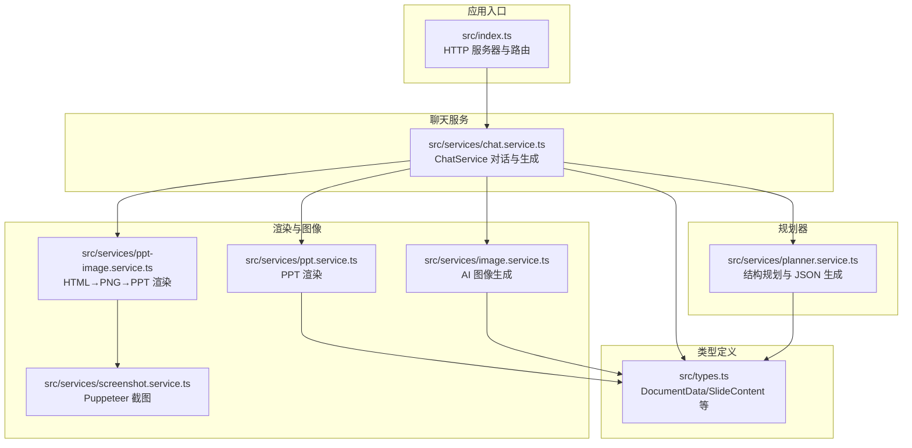
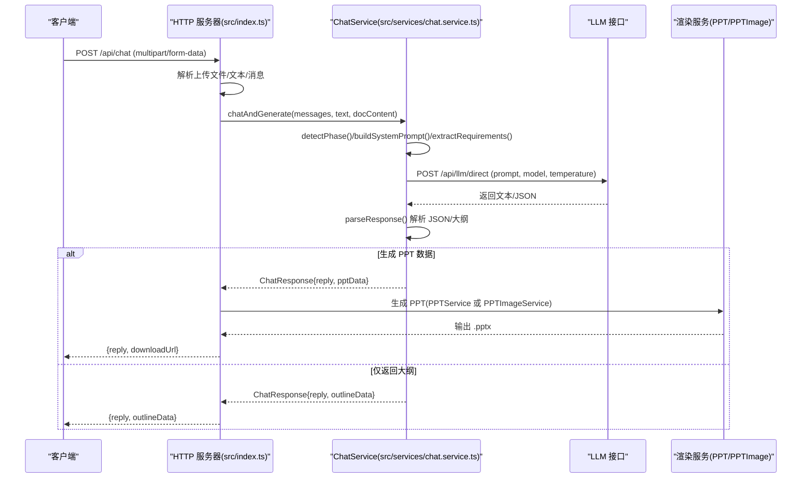
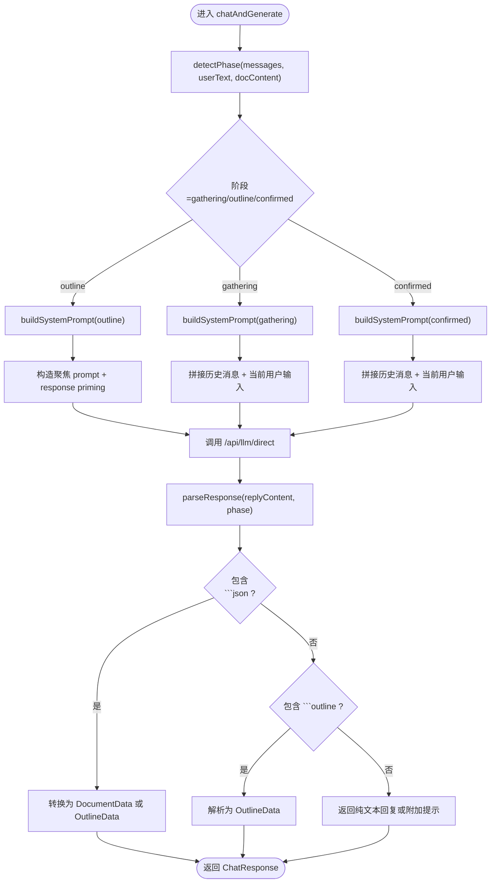
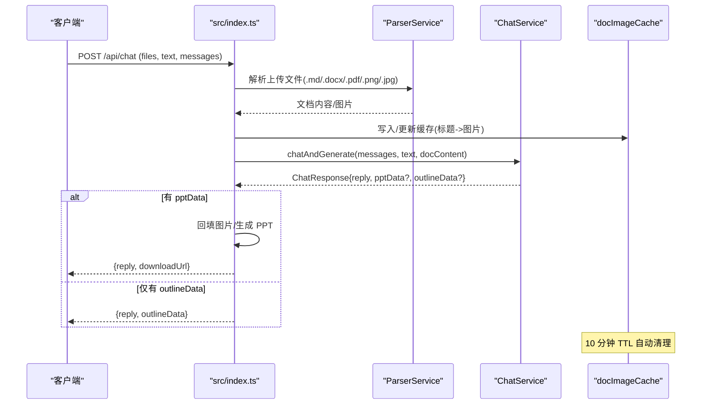
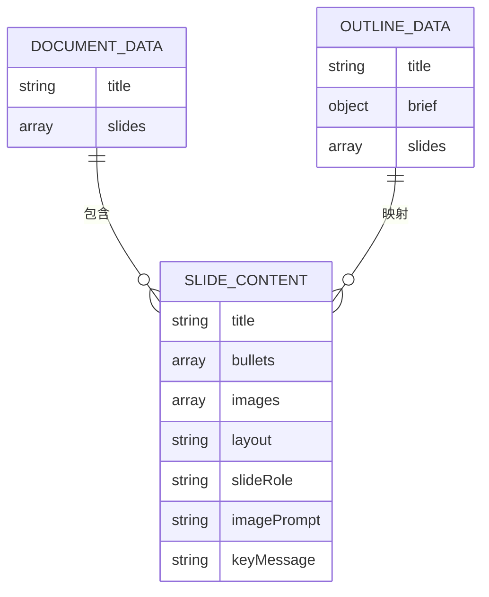
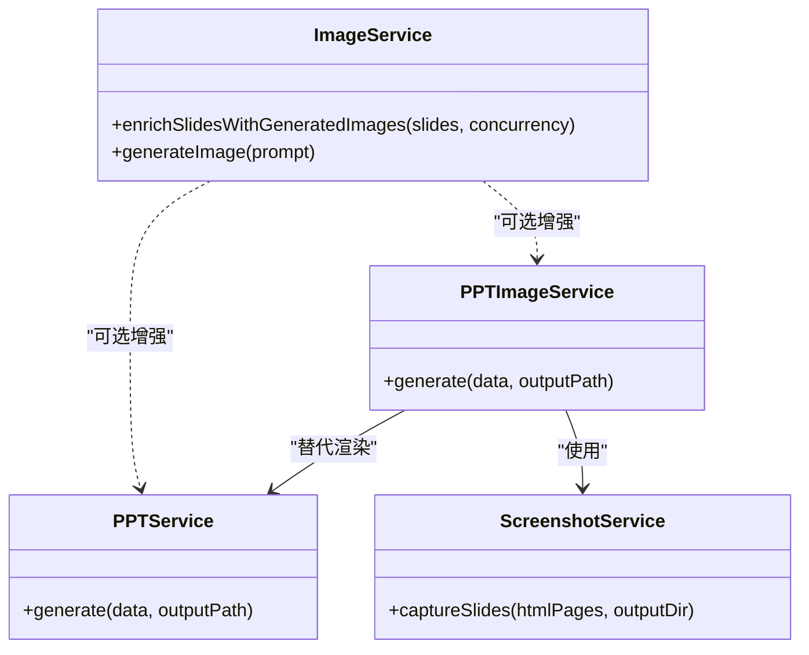
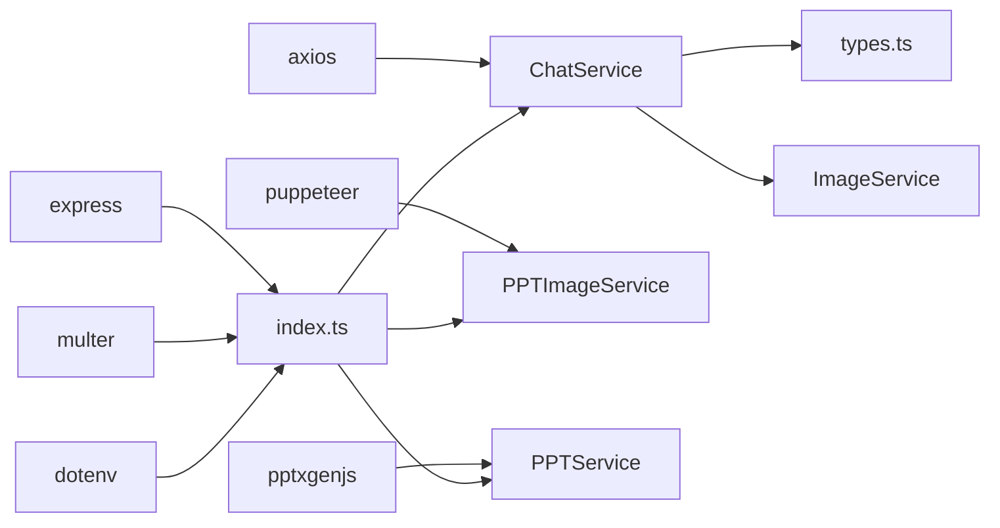

# 聊天交互服务

<cite>
**本文引用的文件**
- [src/services/chat.service.ts](file://src/services/chat.service.ts)
- [src/index.ts](file://src/index.ts)
- [src/types.ts](file://src/types.ts)
- [src/services/planner.service.ts](file://src/services/planner.service.ts)
- [src/services/ppt.service.ts](file://src/services/ppt.service.ts)
- [src/services/image.service.ts](file://src/services/image.service.ts)
- [src/services/ppt-image.service.ts](file://src/services/ppt-image.service.ts)
- [src/services/screenshot.service.ts](file://src/services/screenshot.service.ts)
- [test-chat-upload.ts](file://test-chat-upload.ts)
- [test-chat-upload.js](file://test-chat-upload.js)
- [readme.md](file://readme.md)
- [package.json](file://package.json)
</cite>

## 目录
1. [简介](#简介)
2. [项目结构](#项目结构)
3. [核心组件](#核心组件)
4. [架构总览](#架构总览)
5. [详细组件分析](#详细组件分析)
6. [依赖分析](#依赖分析)
7. [性能考虑](#性能考虑)
8. [故障排查指南](#故障排查指南)
9. [结论](#结论)
10. [附录](#附录)

## 简介
本文件面向“聊天交互服务”的技术文档，聚焦 ChatService 的对话式生成流程，包括阶段检测、消息处理与状态管理机制；详解对话轮次管理、上下文维护与响应解析算法；阐述需求收集、规划确认与最终生成三阶段的处理逻辑；提供聊天接口使用示例（消息发送、状态查询、结果获取）；说明错误处理策略、会话超时管理与并发控制；并覆盖配置项、性能优化与扩展新交互模式的方法。

## 项目结构
该项目采用模块化组织，核心聊天交互位于服务层，Web 入口在应用入口文件中定义，类型定义集中于 types 文件，渲染与图像生成由独立服务负责。



图表来源
- [src/index.ts:71-270](file://src/index.ts#L71-L270)
- [src/services/chat.service.ts:31-400](file://src/services/chat.service.ts#L31-L400)
- [src/services/planner.service.ts:53-101](file://src/services/planner.service.ts#L53-L101)
- [src/services/ppt.service.ts:52-75](file://src/services/ppt.service.ts#L52-L75)
- [src/services/ppt-image.service.ts:14-52](file://src/services/ppt-image.service.ts#L14-L52)
- [src/services/image.service.ts:4-28](file://src/services/image.service.ts#L4-L28)
- [src/services/screenshot.service.ts:9-52](file://src/services/screenshot.service.ts#L9-L52)
- [src/types.ts:66-71](file://src/types.ts#L66-L71)

章节来源
- [src/index.ts:1-433](file://src/index.ts#L1-L433)
- [src/services/chat.service.ts:1-400](file://src/services/chat.service.ts#L1-L400)
- [src/types.ts:1-160](file://src/types.ts#L1-L160)

## 核心组件
- ChatService：负责对话阶段检测、系统提示构建、消息拼接、LLM 请求、响应解析与结果封装。
- Index（HTTP 服务）：提供 /api/chat 接口，处理文件上传、文档解析、图片缓存、调用 ChatService 并生成 PPT。
- PlannerService：可选的结构规划服务，用于生成结构化的 PPT 规划（与 ChatService 的 outline 阶段互补）。
- PPTService/PPTImageService：两种渲染路径，分别使用 pptxgenjs 或 HTML→PNG→PPT。
- ImageService：为幻灯片生成 AI 图像，支持并发与缓存。
- 类型系统：统一的 DocumentData、SlideContent 等类型定义。

章节来源
- [src/services/chat.service.ts:31-400](file://src/services/chat.service.ts#L31-L400)
- [src/index.ts:71-270](file://src/index.ts#L71-L270)
- [src/services/planner.service.ts:53-101](file://src/services/planner.service.ts#L53-L101)
- [src/services/ppt.service.ts:52-75](file://src/services/ppt.service.ts#L52-L75)
- [src/services/ppt-image.service.ts:14-52](file://src/services/ppt-image.service.ts#L14-L52)
- [src/services/image.service.ts:4-28](file://src/services/image.service.ts#L4-L28)
- [src/types.ts:66-71](file://src/types.ts#L66-L71)

## 架构总览
下图展示了从客户端到 LLM、再到渲染与下载的端到端流程。



图表来源
- [src/index.ts:71-270](file://src/index.ts#L71-L270)
- [src/services/chat.service.ts:40-101](file://src/services/chat.service.ts#L40-L101)
- [src/services/chat.service.ts:272-347](file://src/services/chat.service.ts#L272-L347)
- [src/services/ppt.service.ts:52-75](file://src/services/ppt.service.ts#L52-L75)
- [src/services/ppt-image.service.ts:18-51](file://src/services/ppt-image.service.ts#L18-L51)

## 详细组件分析

### ChatService：对话阶段检测与生成流程
- 阶段检测（detectPhase）
  - gathering：默认需求收集阶段，当历史轮次较少且未出现大纲时进入。
  - outline：当用户显式请求生成大纲、或满足轮次阈值（有文档时更早触发）、或检测到历史中已存在大纲标记时进入。
  - confirmed：当历史中存在大纲且用户确认生成时进入最终生成阶段。
- 系统提示构建（buildSystemPrompt）
  - 针对不同阶段输出不同的系统指令，严格限定输出格式（如 JSON 代码块）。
  - outline 阶段强调直接输出结构化大纲，confirmed 阶段强调基于已确认大纲生成最终数据。
- 消息拼接与请求
  - outline 阶段使用聚焦 prompt 与 response priming，避免携带历史对话以提升稳定性。
  - 其他阶段将历史消息与当前用户输入拼接为多轮对话。
- 响应解析（parseResponse）
  - 优先解析 ```json 代码块；若为 outline 阶段，将 JSON 转换为 OutlineData；否则转换为 DocumentData。
  - 若检测到 ```outline 代码块，则解析为 OutlineData。
  - 若 outline 阶段未返回结构化数据，附加提示信息。
- 错误处理
  - LLM 返回非 200 或 success=false 时抛错；捕获异常并返回统一错误信息。



图表来源
- [src/services/chat.service.ts:109-141](file://src/services/chat.service.ts#L109-L141)
- [src/services/chat.service.ts:171-270](file://src/services/chat.service.ts#L171-L270)
- [src/services/chat.service.ts:272-347](file://src/services/chat.service.ts#L272-L347)

章节来源
- [src/services/chat.service.ts:40-101](file://src/services/chat.service.ts#L40-L101)
- [src/services/chat.service.ts:109-141](file://src/services/chat.service.ts#L109-L141)
- [src/services/chat.service.ts:171-270](file://src/services/chat.service.ts#L171-L270)
- [src/services/chat.service.ts:272-347](file://src/services/chat.service.ts#L272-L347)

### HTTP 服务与会话级缓存
- /api/chat 接口
  - 支持 multipart/form-data：files（最多 5 个，支持 .md/.docx/.pdf/.png/.jpg），text（用户文本），messages（历史消息数组或 JSON 字符串）。
  - 解析上传文件，提取文档内容与图片，必要时缓存图片以便后续确认生成阶段回填。
  - 调用 ChatService.chatAndGenerate，根据返回结果决定是否生成 PPT，并返回下载链接。
- 会话级图片缓存
  - 以文档标题为键，缓存原始图片（titleMap 与有序列表），10 分钟 TTL 自动清理。
  - 在确认生成阶段，若当前请求未上传文件，尝试从缓存恢复图片，提升一致性体验。



图表来源
- [src/index.ts:71-270](file://src/index.ts#L71-L270)
- [src/index.ts:53-69](file://src/index.ts#L53-L69)

章节来源
- [src/index.ts:71-270](file://src/index.ts#L71-L270)
- [src/index.ts:53-69](file://src/index.ts#L53-L69)

### 类型系统与数据模型
- DocumentData：演示文稿顶层结构，包含 title、slides 数组与可选 brief/understanding。
- SlideContent：单页内容，包含标题、要点、图片、布局、角色、关键信息、备注等字段。
- OutlineData：大纲结构，包含 title、brief 与 slides 列表，用于 outline 阶段的展示与确认。



图表来源
- [src/types.ts:66-71](file://src/types.ts#L66-L71)
- [src/types.ts:48-64](file://src/types.ts#L48-L64)
- [src/services/chat.service.ts:15-29](file://src/services/chat.service.ts#L15-L29)

章节来源
- [src/types.ts:66-71](file://src/types.ts#L66-L71)
- [src/types.ts:48-64](file://src/types.ts#L48-L64)
- [src/services/chat.service.ts:15-29](file://src/services/chat.service.ts#L15-L29)

### 渲染与图像生成
- ImageService
  - 为每个空图片的幻灯片生成 AI 图像，支持主/备 API 与缓存；支持并发执行。
- PPTService
  - 使用 pptxgenjs 直接渲染 PPT，支持模板样式、仅图模式、保留文本等配置。
- PPTImageService + ScreenshotService
  - 将每页渲染为 HTML，用 Puppeteer 截图为高清 PNG，再作为全屏背景写入 PPT，适合高质量视觉效果。



图表来源
- [src/services/image.service.ts:4-28](file://src/services/image.service.ts#L4-L28)
- [src/services/ppt.service.ts:52-75](file://src/services/ppt.service.ts#L52-L75)
- [src/services/ppt-image.service.ts:14-52](file://src/services/ppt-image.service.ts#L14-L52)
- [src/services/screenshot.service.ts:9-52](file://src/services/screenshot.service.ts#L9-L52)

章节来源
- [src/services/image.service.ts:4-28](file://src/services/image.service.ts#L4-L28)
- [src/services/ppt.service.ts:52-75](file://src/services/ppt.service.ts#L52-L75)
- [src/services/ppt-image.service.ts:14-52](file://src/services/ppt-image.service.ts#L14-L52)
- [src/services/screenshot.service.ts:9-52](file://src/services/screenshot.service.ts#L9-L52)

### 规划器（可选）
- PlannerService 可在非聊天模式下生成结构化 PPT 规划，与 ChatService 的 outline 阶段互补。
- 支持严格/创意模式、工作器代理、稀疏内容扩展等高级能力。

章节来源
- [src/services/planner.service.ts:53-101](file://src/services/planner.service.ts#L53-L101)

## 依赖分析
- 外部依赖
  - axios：HTTP 客户端，用于调用 LLM 与图像 API。
  - express：HTTP 服务器框架。
  - multer：文件上传处理。
  - dotenv：环境变量加载。
  - puppeteer：HTML 截图（PPTImageService）。
  - pptxgenjs：PPT 渲染。
- 内部耦合
  - ChatService 依赖 types.ts 的数据模型。
  - HTTP 服务同时依赖 ChatService 与渲染服务，形成“请求→生成→下载”的闭环。
  - ImageService 与渲染服务解耦，便于替换或禁用。



图表来源
- [package.json:18-31](file://package.json#L18-L31)
- [src/index.ts:1-27](file://src/index.ts#L1-L27)
- [src/services/chat.service.ts:1-7](file://src/services/chat.service.ts#L1-L7)
- [src/services/ppt-image.service.ts:1-5](file://src/services/ppt-image.service.ts#L1-L5)
- [src/services/ppt.service.ts:1-2](file://src/services/ppt.service.ts#L1-L2)
- [src/services/image.service.ts:1-2](file://src/services/image.service.ts#L1-L2)

章节来源
- [package.json:18-31](file://package.json#L18-L31)
- [src/index.ts:1-27](file://src/index.ts#L1-L27)

## 性能考虑
- 并发控制
  - ImageService 支持并发参数，避免阻塞渲染。
  - PPTImageService 的截图过程可在高并发场景下通过外部队列或限流控制。
- 缓存策略
  - 会话级图片缓存（10 分钟 TTL）减少重复解析与请求。
  - 图像生成缓存（ImageService）降低重复 prompt 的成本。
- 超时与稳定性
  - LLM 请求设置合理超时（60 秒），并进行 validateStatus 处理，避免阻塞。
  - 多路径回退（主/备图像 API、占位图）提升鲁棒性。
- 渲染路径选择
  - 默认使用 pptxgenjs；若追求更高视觉质量，可启用 HTML→PNG→PPT 渲染路径。

章节来源
- [src/services/image.service.ts:15-28](file://src/services/image.service.ts#L15-L28)
- [src/index.ts:53-69](file://src/index.ts#L53-L69)
- [src/services/chat.service.ts:76-84](file://src/services/chat.service.ts#L76-L84)
- [src/services/ppt-image.service.ts:18-51](file://src/services/ppt-image.service.ts#L18-L51)

## 故障排查指南
- 常见错误
  - LLM 返回非 200 或 success=false：检查 PLANNER_AUTH_TOKEN/IMAGE_API_KEY 与 PLANNER_API_BASE_URL/IMAGE_API_BASE_URL。
  - 无法生成 PPT：确认 ENABLE_AI_IMAGES 与 IMAGE_CONCURRENCY 设置；检查渲染路径（PPT_RENDER_MODE）。
  - 图像生成失败：查看主/备 API 日志；确认网络与代理设置。
- 诊断步骤
  - 使用测试脚本验证 /api/chat 与 /generate-ppt 接口。
  - 查看服务端日志中的请求体与响应体，定位阶段与解析问题。
  - 对比不同渲染模式（native vs HTML→PNG）的输出质量与性能。
- 会话超时与并发
  - 调整 IMAGE_CONCURRENCY 与 LLM 超时参数，避免资源争用。
  - 对于长文档，建议分批上传或限制并发数量。

章节来源
- [test-chat-upload.ts:8-121](file://test-chat-upload.ts#L8-L121)
- [test-chat-upload.js:47-190](file://test-chat-upload.js#L47-L190)
- [src/services/chat.service.ts:76-100](file://src/services/chat.service.ts#L76-L100)
- [readme.md:17-50](file://readme.md#L17-L50)

## 结论
本聊天交互服务通过 ChatService 实现“需求收集→大纲确认→最终生成”的三阶段对话式生成流程，结合会话级缓存与多种渲染路径，兼顾易用性与可扩展性。通过合理的错误处理、超时控制与并发策略，能够在复杂场景下稳定产出高质量 PPT。未来可扩展新的交互模式（如多轮细化、多模态输入）与更丰富的渲染策略。

## 附录

### API 使用示例（路径参考）
- 发送聊天消息
  - POST /api/chat
  - 表单字段：files（最多 5 个）、text、messages（数组或 JSON 字符串）
  - 示例参考：[test-chat-upload.ts:20-33](file://test-chat-upload.ts#L20-L33)、[test-chat-upload.js:73-87](file://test-chat-upload.js#L73-L87)
- 获取 PPT 下载链接
  - ChatService 返回 downloadUrl；或直接调用 /generate-ppt
  - 示例参考：[test-chat-upload.ts:48-60](file://test-chat-upload.ts#L48-L60)、[test-chat-upload.js:103-119](file://test-chat-upload.js#L103-L119)
- 直接生成 PPT（非聊天）
  - POST /generate-ppt
  - 表单字段：file（.md/.docx/.pdf）、plannerMode（可选）
  - 示例参考：[test-chat-upload.ts:89-116](file://test-chat-upload.ts#L89-L116)、[test-chat-upload.js:156-181](file://test-chat-upload.js#L156-L181)

章节来源
- [test-chat-upload.ts:20-116](file://test-chat-upload.ts#L20-L116)
- [test-chat-upload.js:73-181](file://test-chat-upload.js#L73-L181)

### 配置选项（节选）
- LLM 与认证
  - PLANNER_AUTH_TOKEN/LLM_AUTH_TOKEN/IMAGE_API_KEY
  - PLANNER_API_BASE_URL/IMAGE_API_BASE_URL
  - PLANNER_MODEL/IMAGE_MODEL
- 渲染与图像
  - ENABLE_AI_IMAGES（是否生成 AI 图像）
  - IMAGE_CONCURRENCY（图像生成并发）
  - PPT_RENDER_MODE（渲染模式：native 或 html）
  - PPT_TEMPLATE_STYLE/PPT_IMAGE_ONLY_MODE/PPT_KEEP_TEXT 等
- 规划器
  - ENABLE_PLANNER/PLANNER_USE_WORKER_PROXY/CLOUDFLARE_WORKER_URL/LLM_API_KEY/GOOGLE_API_KEY
  - PLANNER_CONTENT_MODE（strict/creative）
  - PLANNER_EXPAND_SPARSE_CONTENT

章节来源
- [readme.md:17-50](file://readme.md#L17-L50)