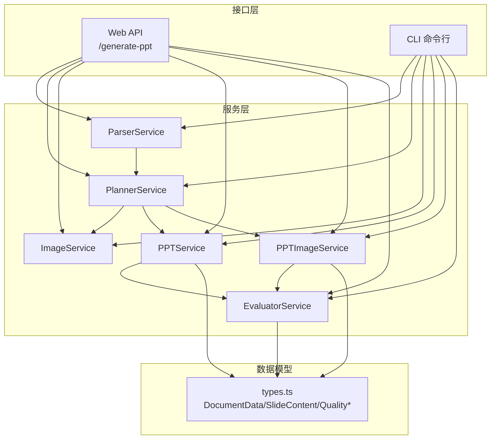
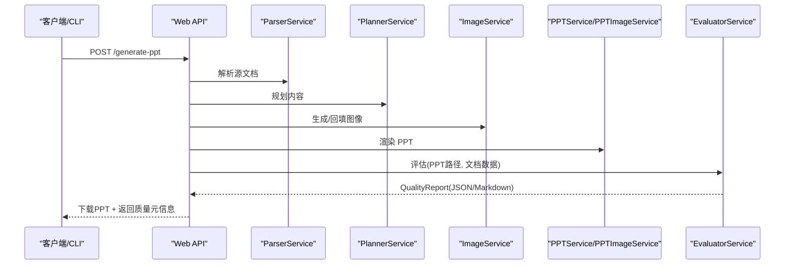
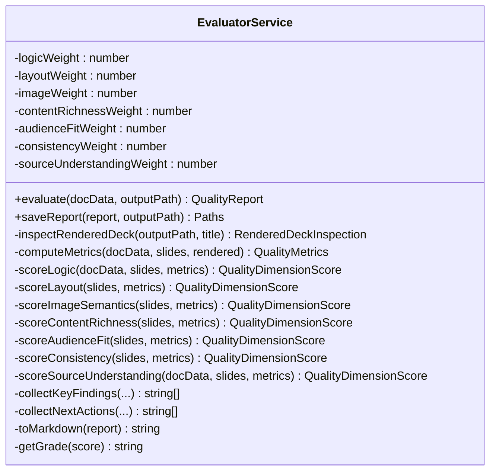
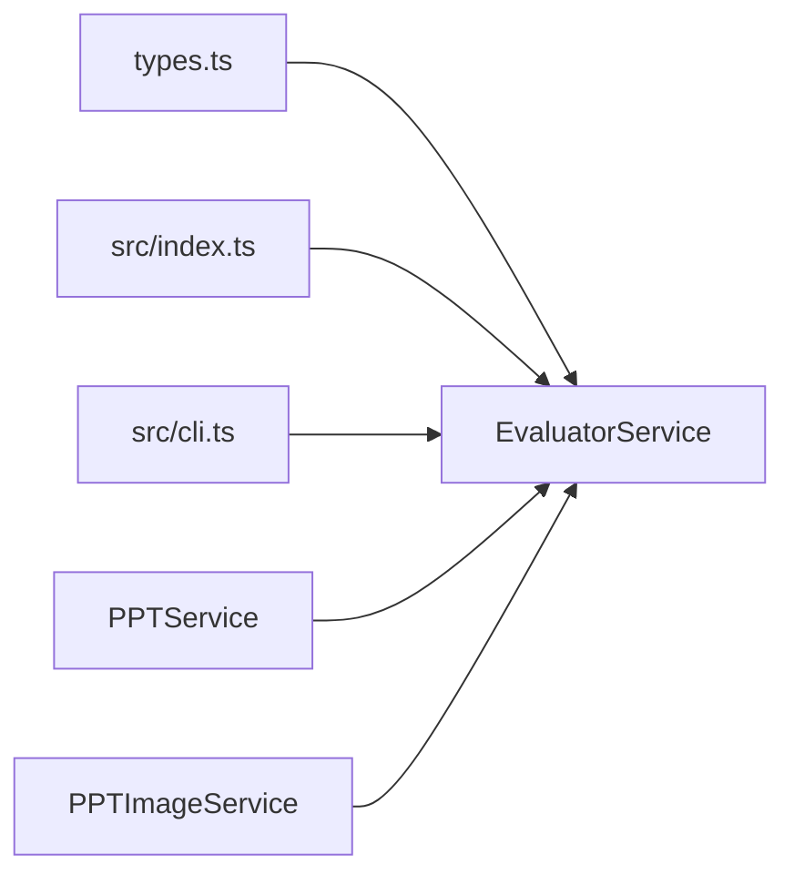

# 质量评估服务

<cite>
**本文引用的文件列表**
- [src/services/evaluator.service.ts](file://src/services/evaluator.service.ts)
- [src/types.ts](file://src/types.ts)
- [src/index.ts](file://src/index.ts)
- [src/cli.ts](file://src/cli.ts)
- [src/services/ppt.service.ts](file://src/services/ppt.service.ts)
- [src/services/ppt-image.service.ts](file://src/services/ppt-image.service.ts)
- [test/batch_generate_score.ts](file://test/batch_generate_score.ts)
- [readme.md](file://readme.md)
- [package.json](file://package.json)
</cite>

## 目录
1. [简介](#简介)
2. [项目结构](#项目结构)
3. [核心组件](#核心组件)
4. [架构总览](#架构总览)
5. [详细组件分析](#详细组件分析)
6. [依赖关系分析](#依赖关系分析)
7. [性能考量](#性能考量)
8. [故障排查指南](#故障排查指南)
9. [结论](#结论)
10. [附录](#附录)

## 简介
本文件面向“质量评估服务”，系统性阐述 EvaluatorService 的多维度评分体系与评估算法，覆盖指标设计、权重分配、综合评分计算、质量报告生成与可视化、自动优化建议，以及与 PPT 生成流程的集成与反馈闭环。文档同时提供可追溯的代码路径与图示，帮助开发者快速定位实现细节并进行扩展与优化。

## 项目结构
该项目采用分层模块化组织，质量评估服务位于服务层，与解析、规划、图像生成、PPT 渲染等服务协同工作；通过 Web API 与 CLI 提供统一的生成与评估入口；批量测试脚本支持规模化评估与统计。

图表来源
- [src/index.ts:314-428](file://src/index.ts#L314-L428)
- [src/cli.ts:65-170](file://src/cli.ts#L65-L170)
- [src/services/evaluator.service.ts:23-93](file://src/services/evaluator.service.ts#L23-L93)
- [src/types.ts:66-160](file://src/types.ts#L66-L160)

章节来源
- [src/index.ts:314-428](file://src/index.ts#L314-L428)
- [src/cli.ts:65-170](file://src/cli.ts#L65-L170)
- [src/types.ts:66-160](file://src/types.ts#L66-L160)

## 核心组件
- EvaluatorService：负责对生成的 PPT 进行质量评估，产出维度分数、综合得分、报告与建议。
- types.ts：定义文档、幻灯片、质量维度与报告的数据结构。
- PPTService/PPTImageService：生成 PPT 文件，供评估服务读取以进行渲染后检查。
- Web API 与 CLI：统一触发生成与评估流程，并在完成后返回质量报告路径与元信息。

章节来源
- [src/services/evaluator.service.ts:23-93](file://src/services/evaluator.service.ts#L23-L93)
- [src/types.ts:66-160](file://src/types.ts#L66-L160)
- [src/services/ppt.service.ts:52-75](file://src/services/ppt.service.ts#L52-L75)
- [src/services/ppt-image.service.ts:14-51](file://src/services/ppt-image.service.ts#L14-L51)

## 架构总览
质量评估服务贯穿“生成—评估—报告—反馈”的闭环：
- 生成阶段：解析源文档、规划内容、生成图像、渲染 PPT。
- 评估阶段：基于生成的 PPT ZIP 结构解析文本与图片，结合内容侧指标，计算各维度得分与综合得分。
- 报告阶段：输出 JSON 与 Markdown 报告，包含维度明细、关键发现与建议动作。
- 反馈阶段：通过 API 头部或 CLI 输出质量元信息，便于上层系统记录与追踪。

图表来源
- [src/index.ts:314-428](file://src/index.ts#L314-L428)
- [src/services/evaluator.service.ts:32-93](file://src/services/evaluator.service.ts#L32-L93)

## 详细组件分析

### EvaluatorService：多维度评分体系与算法
- 权重分配：逻辑、布局、图像语义、内容丰富度、受众适配、一致性、来源理解七大维度，权重之和为 1.0。
- 综合评分：加权求和，保留一位小数；最终得分经 0-100 区间夹紧。
- 维度评分流程：先统计指标，再根据规则打分，最后乘以权重得到加权分数。
- 报告生成：包含版本、生成时间、标题、输出路径、总分、等级、维度明细、指标、关键发现、建议动作。
- 可视化：提供 Markdown 导出，便于在网页或文档中展示。

图表来源
- [src/services/evaluator.service.ts:23-93](file://src/services/evaluator.service.ts#L23-L93)
- [src/services/evaluator.service.ts:285-356](file://src/services/evaluator.service.ts#L285-L356)
- [src/services/evaluator.service.ts:401-862](file://src/services/evaluator.service.ts#L401-L862)
- [src/services/evaluator.service.ts:864-985](file://src/services/evaluator.service.ts#L864-L985)
- [src/services/evaluator.service.ts:1426-1526](file://src/services/evaluator.service.ts#L1426-L1526)

章节来源
- [src/services/evaluator.service.ts:23-93](file://src/services/evaluator.service.ts#L23-L93)
- [src/services/evaluator.service.ts:285-356](file://src/services/evaluator.service.ts#L285-L356)
- [src/services/evaluator.service.ts:401-862](file://src/services/evaluator.service.ts#L401-L862)
- [src/services/evaluator.service.ts:864-985](file://src/services/evaluator.service.ts#L864-L985)
- [src/services/evaluator.service.ts:1426-1526](file://src/services/evaluator.service.ts#L1426-L1526)

### 评估维度与阈值设计
- 内容逻辑（Content Logic）
  - 关注标题、层级跳变、弱过渡、重复内容、子弹密度、标题缺失等。
  - 当渲染为“图像优先”时，降低文本相关惩罚权重。
  - 示例：空标题、重复标题、弱过渡、重复内容项、子弹密度不在推荐区间等均扣分。
- 布局质量（Layout Quality）
  - 关注图像覆盖率、溢出风险、元信息泄漏、布局重复性、叠加页文字密度等。
  - 图像覆盖率不足、溢出风险高、元信息泄漏、布局过于重复等扣分。
- 图像语义（Image Semantics）
  - 关注提示覆盖率、提示对齐度、回退图像数量、渲染图像覆盖率与多样性。
  - 提示覆盖率低、对齐度差、回退图像多、渲染图像覆盖率低或多样性不足扣分。
- 内容丰富度（Content Richness）
  - 关注稀疏页、平均字数、摘要覆盖率、渲染图像覆盖率与多样性。
  - 稀疏页过多、平均字数过低、摘要覆盖率不足、图像覆盖率低或多样性不足扣分。
- 受众适配（Audience Fit）
  - 关注行动提示覆盖率、平均子弹长度、混合语言渲染、摘要覆盖率、最终页行动提示等。
  - 行动提示不足、子弹过长/过短、混合语言、摘要覆盖率不足、最终页无行动提示等扣分。
- 一致性（Consistency）
  - 关注重复标题、通用标题、弱过渡、重复内容、摘要/提示覆盖率差异、回退图像、元信息泄漏、混合语言、风格一致性等。
  - 各类一致性问题扣分，图像优先时适度放宽文本相关惩罚。
- 来源理解（Source Understanding）
  - 关注主题覆盖率、章节覆盖率、论点对齐、标题改写比例、来源引用覆盖率、不支持标题比例等。
  - 主题/章节覆盖率不足、论点对齐差、标题改写比例异常、来源引用不足、不支持标题比例过高扣分。

章节来源
- [src/services/evaluator.service.ts:401-862](file://src/services/evaluator.service.ts#L401-L862)
- [src/services/evaluator.service.ts:864-985](file://src/services/evaluator.service.ts#L864-L985)

### 指标计算与权重分配
- 指标来源：
  - 计划阶段指标：图像覆盖率、摘要覆盖率、提示覆盖率、平均子弹数、平均字数、平均子弹长度、布局主导比例、溢出风险页数、提示对齐度、回退图像数、标题改写比例等。
  - 渲染后指标：渲染图像覆盖率、渲染文本覆盖率、图像唯一数、元信息泄漏页、教学辅助页、混合语言页等。
  - 来源理解指标：主题覆盖率、章节覆盖率、信号覆盖率、论点对齐、标题改写比例、来源引用覆盖率等。
- 权重分配：
  - 逻辑：0.17
  - 布局：0.14
  - 图像语义：0.12
  - 内容丰富度：0.15
  - 受众适配：0.14
  - 一致性：0.10
  - 来源理解：0.18
- 综合评分：加权求和并夹紧至 0-100，等级按 90/B、80/C、70/D、60/E 划分。

章节来源
- [src/services/evaluator.service.ts:24-30](file://src/services/evaluator.service.ts#L24-L30)
- [src/services/evaluator.service.ts:45-54](file://src/services/evaluator.service.ts#L45-L54)
- [src/services/evaluator.service.ts:1492-1498](file://src/services/evaluator.service.ts#L1492-L1498)

### 质量报告生成与可视化
- JSON 报告：包含版本、生成时间、标题、输出路径、总分、等级、维度明细、指标、关键发现、建议动作。
- Markdown 报告：表格化展示维度得分与权重、完整指标 JSON、关键发现与建议动作。
- 保存策略：默认输出目录为项目根目录下的 output，文件名基于输入或时间戳生成。

章节来源
- [src/services/evaluator.service.ts:95-108](file://src/services/evaluator.service.ts#L95-L108)
- [src/services/evaluator.service.ts:1500-1526](file://src/services/evaluator.service.ts#L1500-L1526)

### 自动优化建议生成机制
- 建议来源：每个维度在发现问题时生成具体建议，最终汇总去重并限制数量。
- 建议类型：补充图像、提升提示覆盖率、增强图像语义对齐、减少重复内容、控制子弹长度、增加摘要覆盖率、避免混合语言、减少元信息泄漏等。

章节来源
- [src/services/evaluator.service.ts:1486-1490](file://src/services/evaluator.service.ts#L1486-L1490)
- [src/services/evaluator.service.ts:401-862](file://src/services/evaluator.service.ts#L401-L862)
- [src/services/evaluator.service.ts:864-985](file://src/services/evaluator.service.ts#L864-L985)

### 评估流程示例（代码路径）
- Web API 生成并评估：
  - 触发：POST /generate-ppt
  - 步骤：解析 → 规划 → 生成图像 → 渲染 PPT → 评估 → 保存报告 → 下载 PPT
  - 元信息：X-PPT-Quality-Score、X-PPT-Quality-Grade、X-PPT-Quality-Json、X-PPT-Quality-Markdown
- CLI 生成并评估：
  - 触发：npm run generate
  - 步骤：解析 → 规划 → 生成图像 → 渲染 PPT → 评估 → 保存报告 → 控制台输出报告路径

章节来源
- [src/index.ts:314-428](file://src/index.ts#L314-L428)
- [src/cli.ts:65-170](file://src/cli.ts#L65-L170)

### 评估维度选择依据与阈值设定
- 依据：
  - 内容层面：标题质量、层级连续性、冗余与稀疏、摘要与提示对齐。
  - 视觉层面：图像覆盖率、溢出风险、布局多样性、渲染后语言一致性。
  - 来源层面：主题/章节覆盖率、论点对齐、标题改写比例、来源引用。
- 阈值：
  - 多处使用百分比阈值（如覆盖率、对齐度、比例）与绝对数量阈值（如稀疏页数、溢出风险页数）。
  - “图像优先”场景下对文本相关惩罚进行下调，以适配视觉叙事为主的输出。

章节来源
- [src/services/evaluator.service.ts:401-862](file://src/services/evaluator.service.ts#L401-L862)
- [src/services/evaluator.service.ts:864-985](file://src/services/evaluator.service.ts#L864-L985)
- [src/services/evaluator.service.ts:1482-1484](file://src/services/evaluator.service.ts#L1482-L1484)

### 评估准确性优化与性能调优
- 准确性优化：
  - 渲染后检查：通过解析 PPT ZIP 中的 slide XML 与关系文件，提取可见文本与图像目标，提高评估对实际渲染效果的反映。
  - 语言检测与混合语言识别：基于主导语言与词组长度/字母计数，识别混合语言渲染。
  - 关键词抽取与重叠：使用清洗后的关键词集合计算重叠率，衡量提示与内容的语义对齐。
- 性能调优：
  - 异步 ZIP 解析与并发：Promise.all 并行处理多个 slide 的 XML 解析与图像目标提取。
  - 缓存与去重：对关键词集合与标准化文本进行 Set/Map 去重，降低重复计算成本。
  - 条件下调权：在“图像优先”场景下调文本相关惩罚，避免误判。

章节来源
- [src/services/evaluator.service.ts:110-162](file://src/services/evaluator.service.ts#L110-L162)
- [src/services/evaluator.service.ts:1373-1420](file://src/services/evaluator.service.ts#L1373-L1420)
- [src/services/evaluator.service.ts:1482-1484](file://src/services/evaluator.service.ts#L1482-L1484)

### 扩展新评估指标的方法
- 新增指标：
  - 在 computeMetrics 中添加新的统计字段。
  - 在对应维度评分函数中加入规则与扣分逻辑。
  - 在 Markdown 报告与关键发现中体现该指标。
- 新增维度：
  - 定义新的权重与评分函数。
  - 在 evaluate 流程中调用并参与加权求和。
  - 更新报告结构与可视化输出。

章节来源
- [src/services/evaluator.service.ts:285-356](file://src/services/evaluator.service.ts#L285-L356)
- [src/services/evaluator.service.ts:401-862](file://src/services/evaluator.service.ts#L401-L862)
- [src/services/evaluator.service.ts:1500-1526](file://src/services/evaluator.service.ts#L1500-L1526)

### 与 PPT 生成流程的集成与反馈循环
- 集成点：
  - Web API：生成完成后立即评估并保存报告，通过响应头传递质量元信息。
  - CLI：生成完成后评估并输出报告路径。
  - 批量测试：遍历输入目录，逐个生成并评估，输出汇总报告。
- 反馈循环：
  - 评估结果可用于指导后续生成参数调整（如提示覆盖率、布局多样性、图像覆盖率）。
  - 可将报告路径与分数写入日志或数据库，形成质量趋势追踪。

章节来源
- [src/index.ts:314-428](file://src/index.ts#L314-L428)
- [src/cli.ts:65-170](file://src/cli.ts#L65-L170)
- [test/batch_generate_score.ts:274-431](file://test/batch_generate_score.ts#L274-L431)

## 依赖关系分析
- EvaluatorService 依赖 types.ts 中的数据结构，用于承载文档、幻灯片与质量报告。
- Web API 与 CLI 通过服务编排触发生成与评估。
- PPTService 与 PPTImageService 输出 PPT 文件，供 EvaluatorService 读取并解析渲染后内容。

图表来源
- [src/types.ts:66-160](file://src/types.ts#L66-L160)
- [src/services/evaluator.service.ts:23-93](file://src/services/evaluator.service.ts#L23-L93)
- [src/index.ts:314-428](file://src/index.ts#L314-L428)
- [src/cli.ts:65-170](file://src/cli.ts#L65-L170)
- [src/services/ppt.service.ts:52-75](file://src/services/ppt.service.ts#L52-L75)
- [src/services/ppt-image.service.ts:14-51](file://src/services/ppt-image.service.ts#L14-L51)

章节来源
- [src/types.ts:66-160](file://src/types.ts#L66-L160)
- [src/services/evaluator.service.ts:23-93](file://src/services/evaluator.service.ts#L23-L93)
- [src/index.ts:314-428](file://src/index.ts#L314-L428)
- [src/cli.ts:65-170](file://src/cli.ts#L65-L170)
- [src/services/ppt.service.ts:52-75](file://src/services/ppt.service.ts#L52-L75)
- [src/services/ppt-image.service.ts:14-51](file://src/services/ppt-image.service.ts#L14-L51)

## 性能考量
- I/O 与并发：ZIP 文件解析与 Promise.all 并行处理提升吞吐；注意磁盘与内存占用。
- 文本处理：关键词抽取与标准化在大文本场景下需关注时间复杂度；可考虑分块处理或缓存中间结果。
- 权重与阈值：阈值设置直接影响扣分频率，应结合业务目标与数据分布进行校准。
- 渲染模式：HTML→PNG→PPT 渲染模式在图像生成与截图环节可能引入额外开销，需平衡质量与性能。

## 故障排查指南
- 无法读取渲染后内容：
  - 检查 PPT 输出路径是否存在且为有效 ZIP。
  - 确认 ZIP 内 slide XML 与关系文件命名规范是否符合预期。
- 评估结果异常偏低：
  - 检查“图像优先”判定条件与文本相关惩罚下调逻辑。
  - 核对提示覆盖率、提示对齐度、稀疏页数量等关键指标。
- 报告未生成：
  - 确认 ENABLE_EVALUATION 环境变量未被禁用。
  - 检查输出目录权限与路径。
- API 未返回质量元信息：
  - 确认评估已启用且成功返回 QualityReport。
  - 检查响应头设置与网络代理配置。

章节来源
- [src/services/evaluator.service.ts:110-162](file://src/services/evaluator.service.ts#L110-L162)
- [src/index.ts:408-416](file://src/index.ts#L408-L416)
- [readme.md:44](file://readme.md#L44)

## 结论
EvaluatorService 通过多维度指标与加权评分，结合渲染后检查与来源理解，构建了较为完整的 PPT 质量评估体系。其与生成流程的无缝集成与报告输出，为自动化质量控制与持续优化提供了坚实基础。未来可在指标细化、阈值自适应与渲染模式性能优化方面进一步迭代。

## 附录
- 环境变量与运行方式参考 [readme.md](file://readme.md) 与 [package.json](file://package.json)。
- 批量评估与汇总参考 [test/batch_generate_score.ts](file://test/batch_generate_score.ts)。