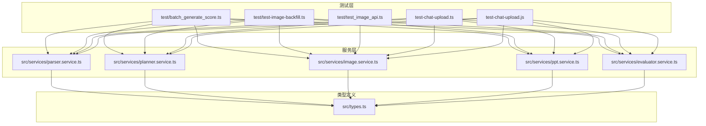
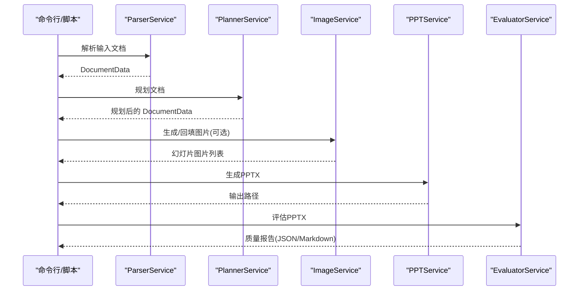
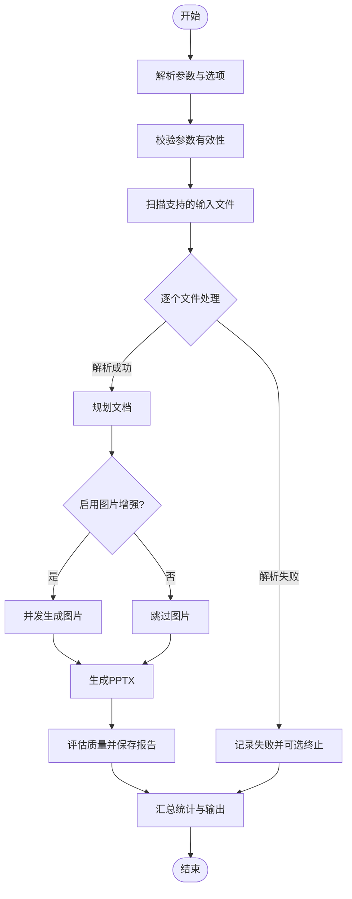
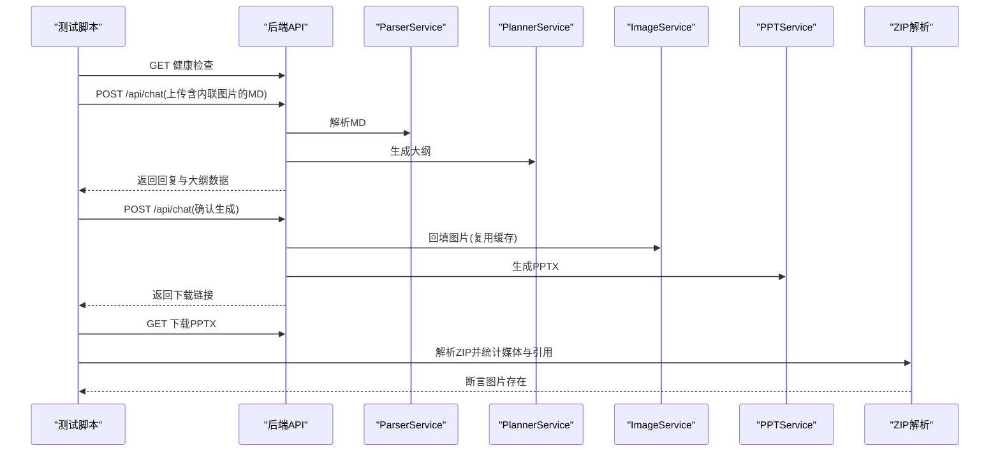
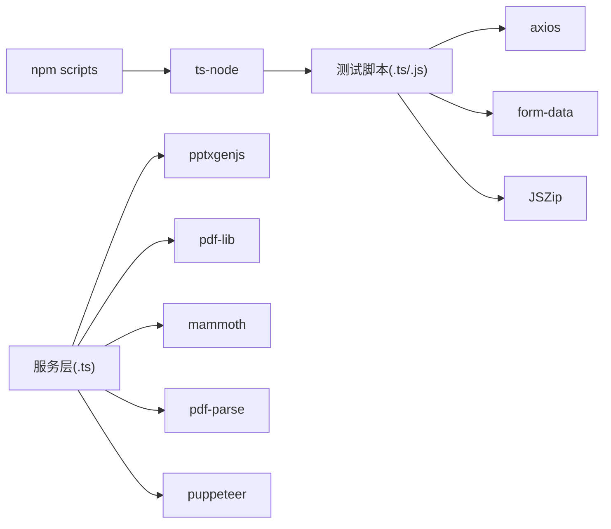

# 测试指南

<cite>
**本文档引用的文件**
- [batch_generate_score.ts](file://test/batch_generate_score.ts)
- [test-image-backfill.ts](file://test/test-image-backfill.ts)
- [test_image_api.ts](file://test/test_image_api.ts)
- [test-chat-upload.ts](file://test-chat-upload.ts)
- [test-chat-upload.js](file://test-chat-upload.js)
- [package.json](file://package.json)
- [image.service.ts](file://src/services/image.service.ts)
- [ppt.service.ts](file://src/services/ppt.service.ts)
- [planner.service.ts](file://src/services/planner.service.ts)
- [evaluator.service.ts](file://src/services/evaluator.service.ts)
- [parser.service.ts](file://src/services/parser.service.ts)
- [types.ts](file://src/types.ts)
- [test.md](file://test.md)
</cite>

## 目录
1. [简介](#简介)
2. [项目结构](#项目结构)
3. [核心组件](#核心组件)
4. [架构总览](#架构总览)
5. [详细组件分析](#详细组件分析)
6. [依赖分析](#依赖分析)
7. [性能考虑](#性能考虑)
8. [故障排查指南](#故障排查指南)
9. [结论](#结论)
10. [附录](#附录)

## 简介
本测试指南面向 Generate-PPT 项目，系统化阐述单元测试与集成测试策略、现有测试文件与用例、测试环境搭建与数据准备、性能与基准测试方法、测试覆盖率与质量标准、测试自动化与持续集成配置示例，以及测试最佳实践与扩展建议。目标是帮助开发者快速上手并高质量维护测试体系。

## 项目结构
项目采用“服务分层 + 类型定义”的组织方式，测试位于根目录 test 及项目根目录下，覆盖批量生成评分、图片回填验证、图片 API 测试、聊天上传与 PPT 生成等场景。

图表来源
- [batch_generate_score.ts:338-342](file://test/batch_generate_score.ts#L338-L342)
- [test-image-backfill.ts:10-14](file://test/test-image-backfill.ts#L10-L14)
- [test_image_api.ts:1-6](file://test/test_image_api.ts#L1-L6)
- [test-chat-upload.ts:1-6](file://test-chat-upload.ts#L1-L6)
- [parser.service.ts:1-11](file://src/services/parser.service.ts#L1-L11)
- [planner.service.ts:1-16](file://src/services/planner.service.ts#L1-L16)
- [image.service.ts:1-7](file://src/services/image.service.ts#L1-L7)
- [ppt.service.ts:1-6](file://src/services/ppt.service.ts#L1-L6)
- [evaluator.service.ts:1-10](file://src/services/evaluator.service.ts#L1-L10)
- [types.ts:1-20](file://src/types.ts#L1-L20)

章节来源
- [package.json:5-12](file://package.json#L5-L12)
- [batch_generate_score.ts:1-50](file://test/batch_generate_score.ts#L1-L50)
- [test-image-backfill.ts:1-20](file://test/test-image-backfill.ts#L1-L20)
- [test_image_api.ts:1-20](file://test/test_image_api.ts#L1-L20)
- [test-chat-upload.ts:1-20](file://test-chat-upload.ts#L1-L20)

## 核心组件
- 解析器服务：解析 Markdown、DOCX、PDF，输出结构化文档数据。
- 规划器服务：基于提示词与可选工作流代理生成幻灯片计划。
- 图片服务：生成或回退图片，支持并发与缓存。
- PPT 服务：按模板与布局生成 PPTX。
- 评估器服务：对渲染后的 PPTX 进行质量维度评估与报告生成。
- 类型定义：统一输入输出结构与枚举。

章节来源
- [parser.service.ts:11-97](file://src/services/parser.service.ts#L11-L97)
- [planner.service.ts:53-101](file://src/services/planner.service.ts#L53-L101)
- [image.service.ts:4-28](file://src/services/image.service.ts#L4-L28)
- [ppt.service.ts:52-75](file://src/services/ppt.service.ts#L52-L75)
- [evaluator.service.ts:23-93](file://src/services/evaluator.service.ts#L23-L93)
- [types.ts:48-80](file://src/types.ts#L48-L80)

## 架构总览
测试执行链路从 CLI 或 HTTP 接口进入，经解析、规划、图片增强、PPT 生成与质量评估，最终产出 PPTX 与质量报告。

图表来源
- [batch_generate_score.ts:338-363](file://test/batch_generate_score.ts#L338-L363)
- [parser.service.ts:11-97](file://src/services/parser.service.ts#L11-L97)
- [planner.service.ts:84-101](file://src/services/planner.service.ts#L84-L101)
- [image.service.ts:15-28](file://src/services/image.service.ts#L15-L28)
- [ppt.service.ts:52-75](file://src/services/ppt.service.ts#L52-L75)
- [evaluator.service.ts:32-93](file://src/services/evaluator.service.ts#L32-L93)

## 详细组件分析

### 批量生成评分测试（batch_generate_score.ts）
- 功能概述：遍历输入目录，解析文档、规划、可选图片增强、生成 PPT、评估并汇总统计。
- 关键流程：
  - 参数解析与校验（模式、格式、受众、焦点、风格、长度、是否使用图片、并发度等）。
  - 支持的输入类型：.md、.markdown、.docx、.pdf。
  - 并发生成图片与顺序生成 PPT，最后评估并保存报告。
  - 统计平均分、成功/失败计数、失败详情，并输出 Markdown 概要。
- 适用场景：CI 批量质量评估、回归对比、性能基线收集。

图表来源
- [batch_generate_score.ts:274-425](file://test/batch_generate_score.ts#L274-L425)

章节来源
- [batch_generate_score.ts:1-431](file://test/batch_generate_score.ts#L1-L431)

### 图片回填测试（test-image-backfill.ts）
- 功能概述：验证文档内联图片在 PPTX 中的正确回填与引用。
- 关键流程：
  - 健康检查（服务可用性）。
  - 创建含内联图片的 Markdown。
  - 上传文件触发大纲阶段，确认生成阶段复用缓存并回填图片。
  - 下载 PPTX，解析 ZIP 结构，统计媒体文件与幻灯片引用，断言图片存在。
- 适用场景：回归图片回填逻辑、PPTX 渲染一致性验证。

图表来源
- [test-image-backfill.ts:53-179](file://test/test-image-backfill.ts#L53-L179)
- [parser.service.ts:11-97](file://src/services/parser.service.ts#L11-L97)
- [planner.service.ts:84-101](file://src/services/planner.service.ts#L84-L101)
- [image.service.ts:15-28](file://src/services/image.service.ts#L15-L28)
- [ppt.service.ts:52-75](file://src/services/ppt.service.ts#L52-L75)

章节来源
- [test-image-backfill.ts:1-202](file://test/test-image-backfill.ts#L1-L202)

### 图片 API 测试（test_image_api.ts）
- 功能概述：验证图片服务的生成接口，检查 API Key 环境变量与耗时。
- 关键流程：
  - 加载 .env，读取图片 API Key。
  - 初始化 ImageService，调用生成接口，记录耗时并断言返回 URL。
- 适用场景：图片服务可用性与稳定性验证。

章节来源
- [test_image_api.ts:1-44](file://test/test_image_api.ts#L1-L44)
- [image.service.ts:30-57](file://src/services/image.service.ts#L30-L57)

### 聊天上传与 PPT 生成测试（test-chat-upload.ts / test-chat-upload.js）
- 功能概述：验证聊天接口与直接生成接口的端到端流程，支持文本消息、文件上传（DOCX、MD），并下载生成的 PPTX。
- 关键流程：
  - 健康检查。
  - 文本消息聊天。
  - 上传 DOCX/MD 文件，触发解析、规划、生成与下载。
  - 直接调用生成接口，下载并保存 PPTX。
- 适用场景：端到端集成测试、文件格式兼容性验证。

章节来源
- [test-chat-upload.ts:8-121](file://test-chat-upload.ts#L8-L121)
- [test-chat-upload.js:47-189](file://test-chat-upload.js#L47-L189)

## 依赖分析
- 测试脚本通过 npm scripts 调用 ts-node 执行，依赖 dotenv、axios、form-data、JSZip 等。
- 服务层依赖 pptxgenjs、pdf-lib、mammoth、pdf-parse、puppeteer 等第三方库。
- 类型定义贯穿各服务，确保输入输出一致。

图表来源
- [package.json:5-12](file://package.json#L5-L12)
- [test-image-backfill.ts:10-14](file://test/test-image-backfill.ts#L10-L14)
- [test-chat-upload.ts:1-6](file://test-chat-upload.ts#L1-L6)
- [ppt.service.ts:1-2](file://src/services/ppt.service.ts#L1-L2)
- [parser.service.ts:1-3](file://src/services/parser.service.ts#L1-L3)

章节来源
- [package.json:18-43](file://package.json#L18-L43)

## 性能考虑
- 并发控制：图片生成支持并发度配置，建议在 CI 中设置合理并发以平衡吞吐与资源占用。
- 超时与重试：图片服务与规划器服务均设置超时，建议在测试中增加重试与降级策略。
- 基准测试建议：
  - 使用批量测试统计平均生成耗时与成功率，作为回归基线。
  - 对不同输入格式（MD/DOCX/PDF）分别建立基线。
  - 在不同并发度下进行压力测试，观察 PPTX 生成耗时与内存占用。

## 故障排查指南
- 服务器未启动：健康检查失败时，先确认服务已启动。
- 环境变量缺失：图片 API Key 未配置时，图片生成会降级或失败，需检查 .env。
- 文件不存在：批量测试扫描不到支持的输入文件时，检查输入目录与文件扩展名。
- 规划器不可用：缺少认证令牌时，规划器会跳过，导致输出与预期不符。
- 图片回填失败：检查 PPTX ZIP 结构与媒体引用，确认内联图片是否被正确嵌入。

章节来源
- [test-image-backfill.ts:58-65](file://test/test-image-backfill.ts#L58-L65)
- [test_image_api.ts:11-16](file://test/test_image_api.ts#L11-L16)
- [batch_generate_score.ts:318-336](file://test/batch_generate_score.ts#L318-L336)
- [planner.service.ts:116-120](file://src/services/planner.service.ts#L116-L120)

## 结论
本测试指南提供了 Generate-PPT 的测试策略与实现方法，覆盖批量评分、图片回填与 API 测试，并给出性能与质量标准、自动化与最佳实践建议。建议在 CI 中固定运行批量评分与图片回填测试，结合端到端上传测试，形成稳定的质量保障体系。

## 附录

### 测试环境搭建与数据准备
- 安装依赖：执行安装命令后，确保 ts-node、dotenv、axios、form-data、JSZip 等可用。
- 准备测试数据：
  - 批量测试：准备包含多种扩展名的输入文档，放置于输入目录。
  - 图片回填测试：使用包含内联图片的 Markdown。
  - 聊天上传测试：准备 DOCX/MD 示例文件。
- 环境变量：配置图片 API Key 与相关服务地址。

章节来源
- [package.json:5-12](file://package.json#L5-L12)
- [test.md:1-27](file://test.md#L1-L27)
- [test-image-backfill.ts:18-51](file://test/test-image-backfill.ts#L18-L51)
- [test-chat-upload.ts:35-87](file://test-chat-upload.ts#L35-L87)

### 测试脚本与命令
- 批量生成评分：npm run test:batch
- 图片 API 测试：npm run test:image-api
- 端到端聊天上传：在测试脚本中执行相应请求

章节来源
- [package.json:5-12](file://package.json#L5-L12)
- [batch_generate_score.ts:10-11](file://test/batch_generate_score.ts#L10-L11)
- [test_image_api.ts:6-11](file://test/test_image_api.ts#L6-L11)

### 测试覆盖率与质量标准
- 覆盖率建议：
  - 单元测试：核心服务（解析、规划、图片、评估）关键函数达到高行/分支覆盖率。
  - 集成测试：端到端流程（聊天上传、生成、评估）通过。
- 质量标准：
  - 成功率：批量测试成功率达到阈值（如 ≥95%）。
  - 平均分数：评估器输出的平均分不低于阈值（如 ≥80）。
  - 回填命中率：图片回填测试中媒体文件与引用命中率达到阈值（如 ≥90%）。

### 测试自动化与持续集成
- 建议流水线步骤：
  - 安装依赖与构建。
  - 运行单元测试（针对核心服务）。
  - 运行批量生成评分测试（CI 环境）。
  - 运行图片回填测试（CI 环境）。
  - 运行聊天上传测试（可选，视服务可用性）。
  - 生成并归档质量报告与 PPTX。
- 缓存与并发：在 CI 中设置合理的图片并发度与缓存策略，避免 API 限流。

### 测试最佳实践与扩展建议
- 最佳实践：
  - 将测试数据与期望结果版本化管理，便于回归对比。
  - 对外部依赖（图片 API、规划器 API）增加降级与超时处理。
  - 使用环境隔离（不同 .env）区分开发/测试/生产。
- 扩展建议：
  - 新增单元测试：为解析器、规划器、评估器新增边界条件与错误场景测试。
  - 新增集成测试：增加多格式混合输入、大文件与长文档的稳定性测试。
  - 新增性能测试：引入基准测试工具，定期记录生成耗时与资源占用。