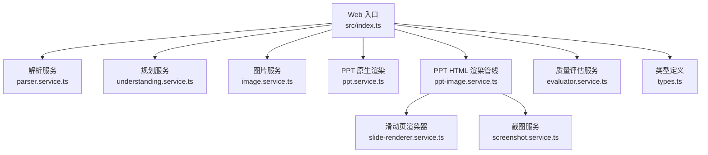
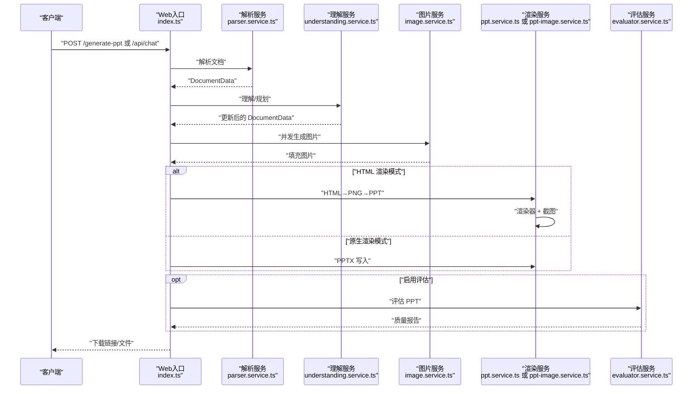
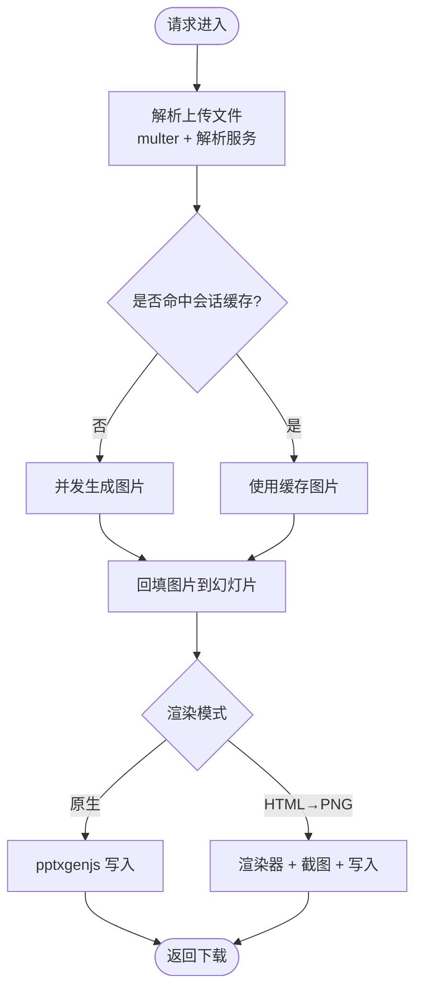
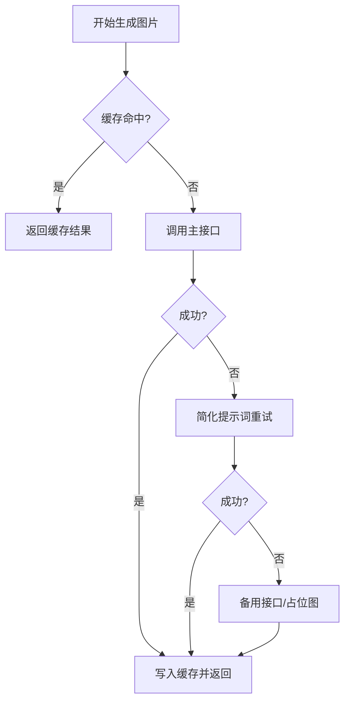
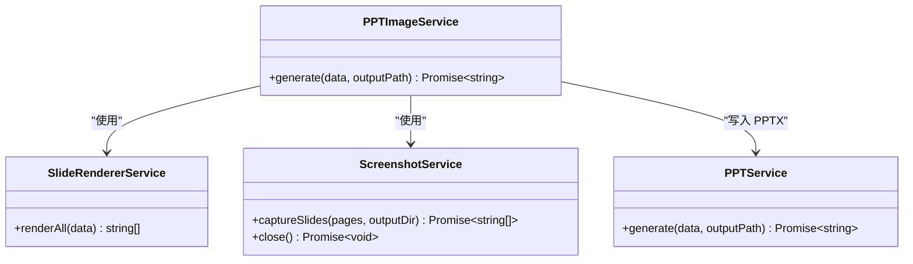
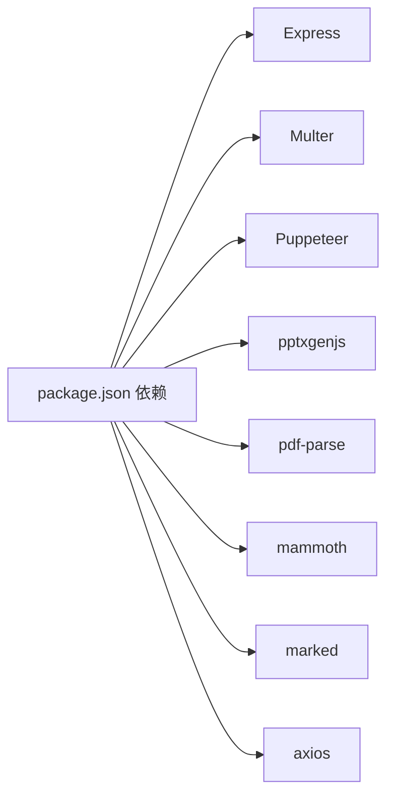

# 性能优化

<cite>
**本文引用的文件**
- [package.json](file://package.json)
- [readme.md](file://readme.md)
- [src/index.ts](file://src/index.ts)
- [src/types.ts](file://src/types.ts)
- [src/services/parser.service.ts](file://src/services/parser.service.ts)
- [src/services/slide-renderer.service.ts](file://src/services/slide-renderer.service.ts)
- [src/services/screenshot.service.ts](file://src/services/screenshot.service.ts)
- [src/services/ppt-image.service.ts](file://src/services/ppt-image.service.ts)
- [src/services/ppt.service.ts](file://src/services/ppt.service.ts)
- [src/services/image.service.ts](file://src/services/image.service.ts)
- [src/services/understanding.service.ts](file://src/services/understanding.service.ts)
- [test/batch_generate_score.ts](file://test/batch_generate_score.ts)
- [nodemon.json](file://nodemon.json)
</cite>

## 目录
1. [简介](#简介)
2. [项目结构](#项目结构)
3. [核心组件](#核心组件)
4. [架构总览](#架构总览)
5. [详细组件分析](#详细组件分析)
6. [依赖关系分析](#依赖关系分析)
7. [性能考量与优化建议](#性能考量与优化建议)
8. [故障排查指南](#故障排查指南)
9. [结论](#结论)
10. [附录](#附录)

## 简介
本指南面向 Generate-PPT 的性能优化，聚焦以下方面：
- 内存管理策略：大文件解析、图片生成与渲染、Puppeteer 浏览器实例复用
- 并发控制与线程池配置：图片生成并发、Puppeteer 页面并发
- 性能瓶颈识别与优化：解析、规划、图片生成、渲染、评估
- 数据库与缓存：会话级缓存、图片生成结果缓存
- 负载均衡与水平扩展：服务拆分、无状态化、容器编排
- 性能监控与基准测试：指标采集、日志与时间统计
- CDN 与静态资源优化：前端静态资源、图片与字体
- CPU 与内存监控：进程级指标与容器监控
- 参数与配置示例：环境变量与运行参数

## 项目结构
项目采用按功能模块划分的结构，核心流程由 Web 入口协调各服务完成文档解析、规划、图片生成、PPT 渲染与质量评估。

图表来源
- [src/index.ts](file://src/index.ts)
- [src/services/parser.service.ts](file://src/services/parser.service.ts)
- [src/services/understanding.service.ts](file://src/services/understanding.service.ts)
- [src/services/image.service.ts](file://src/services/image.service.ts)
- [src/services/ppt.service.ts](file://src/services/ppt.service.ts)
- [src/services/ppt-image.service.ts](file://src/services/ppt-image.service.ts)
- [src/services/slide-renderer.service.ts](file://src/services/slide-renderer.service.ts)
- [src/services/screenshot.service.ts](file://src/services/screenshot.service.ts)
- [src/types.ts](file://src/types.ts)

章节来源
- [src/index.ts](file://src/index.ts)
- [src/services/parser.service.ts](file://src/services/parser.service.ts)
- [src/services/understanding.service.ts](file://src/services/understanding.service.ts)
- [src/services/image.service.ts](file://src/services/image.service.ts)
- [src/services/ppt.service.ts](file://src/services/ppt.service.ts)
- [src/services/ppt-image.service.ts](file://src/services/ppt-image.service.ts)
- [src/services/slide-renderer.service.ts](file://src/services/slide-renderer.service.ts)
- [src/services/screenshot.service.ts](file://src/services/screenshot.service.ts)
- [src/types.ts](file://src/types.ts)

## 核心组件
- Web 入口与路由：负责接收请求、解析上传文件、调度解析与生成流程、返回下载链接或直接下载文件
- 解析服务：支持 Markdown、DOCX、PDF，构建文档数据结构
- 规划服务：基于理解结果生成讲稿大纲与要点
- 图片服务：基于提示词生成图片，带缓存与降级策略，并支持并发控制
- 渲染服务：
  - 原生 PPT 渲染：使用 pptxgenjs 直接写入 PPTX
  - HTML→PNG→PPT 渲染：通过 Puppeteer 截图后写入 PPTX
- 评估服务：对生成的 PPT 进行质量评分与报告输出
- 类型定义：统一的数据结构与枚举

章节来源
- [src/index.ts](file://src/index.ts)
- [src/services/parser.service.ts](file://src/services/parser.service.ts)
- [src/services/understanding.service.ts](file://src/services/understanding.service.ts)
- [src/services/image.service.ts](file://src/services/image.service.ts)
- [src/services/ppt.service.ts](file://src/services/ppt.service.ts)
- [src/services/ppt-image.service.ts](file://src/services/ppt-image.service.ts)
- [src/services/slide-renderer.service.ts](file://src/services/slide-renderer.service.ts)
- [src/services/screenshot.service.ts](file://src/services/screenshot.service.ts)
- [src/types.ts](file://src/types.ts)

## 架构总览
下图展示从请求到 PPT 下载的关键路径与性能相关节点。

图表来源
- [src/index.ts](file://src/index.ts)
- [src/services/parser.service.ts](file://src/services/parser.service.ts)
- [src/services/understanding.service.ts](file://src/services/understanding.service.ts)
- [src/services/image.service.ts](file://src/services/image.service.ts)
- [src/services/ppt.service.ts](file://src/services/ppt.service.ts)
- [src/services/ppt-image.service.ts](file://src/services/ppt-image.service.ts)

## 详细组件分析

### Web 入口与路由（性能关键点）
- 上传与解析：使用 multer 存储临时文件，解析完成后立即删除以释放磁盘空间
- 会话级图片缓存：针对同一文档的图片在内存中缓存 10 分钟，减少重复生成与网络开销
- 渲染模式切换：通过环境变量选择原生渲染或 HTML→PNG 渲染，影响 CPU 与内存占用
- 并发参数：图片生成并发度可配置，默认值来自环境变量

图表来源
- [src/index.ts](file://src/index.ts)
- [src/services/ppt.service.ts](file://src/services/ppt.service.ts)
- [src/services/ppt-image.service.ts](file://src/services/ppt-image.service.ts)
- [src/services/slide-renderer.service.ts](file://src/services/slide-renderer.service.ts)
- [src/services/screenshot.service.ts](file://src/services/screenshot.service.ts)

章节来源
- [src/index.ts](file://src/index.ts)

### 解析服务（内存与 I/O）
- Markdown：逐行扫描，构建幻灯片列表，避免一次性加载大文本
- DOCX：使用转换器将图片内嵌为 base64，注意内存峰值
- PDF：惰性加载解析器，仅在需要时初始化，降低冷启动成本

优化建议
- 大 PDF：限制单次解析页数或分段处理
- DOCX：控制图片尺寸与数量，避免超大 base64 带来的内存压力
- Markdown：对长段落进行分块处理，减少正则匹配范围

章节来源
- [src/services/parser.service.ts](file://src/services/parser.service.ts)

### 图片服务（并发与缓存）
- 并发执行：通过自定义并发调度器控制图片生成并发度
- 结果缓存：基于提示词的 Map 缓存，命中即返回
- 降级策略：主接口失败时尝试备用接口与占位图
- 超时与代理：设置合理超时与禁用代理，避免阻塞

图表来源
- [src/services/image.service.ts](file://src/services/image.service.ts)

章节来源
- [src/services/image.service.ts](file://src/services/image.service.ts)

### 渲染服务（PPT 原生 vs HTML→PNG）
- 原生渲染：直接使用 pptxgenjs，CPU 占用较低，内存占用与幻灯片数量、图片数量成正比
- HTML→PNG 渲染：先渲染 HTML，再截图生成 PNG，最后写入 PPTX
  - 渲染器：固定分辨率与样式，保证输出一致性
  - 截图服务：复用 Puppeteer 实例，设置视口与缩放因子，输出高分辨率 PNG
  - PPTImageService：将 PNG 作为全屏背景写入 PPT

图表来源
- [src/services/ppt-image.service.ts](file://src/services/ppt-image.service.ts)
- [src/services/slide-renderer.service.ts](file://src/services/slide-renderer.service.ts)
- [src/services/screenshot.service.ts](file://src/services/screenshot.service.ts)
- [src/services/ppt.service.ts](file://src/services/ppt.service.ts)

章节来源
- [src/services/ppt-image.service.ts](file://src/services/ppt-image.service.ts)
- [src/services/slide-renderer.service.ts](file://src/services/slide-renderer.service.ts)
- [src/services/screenshot.service.ts](file://src/services/screenshot.service.ts)
- [src/services/ppt.service.ts](file://src/services/ppt.service.ts)

### 评估服务（质量评估）
- 评估维度：逻辑、布局、图像语义、内容丰富度、受众适配、一致性、来源理解
- 输出：JSON 与 Markdown 报告，便于二次分析与可视化

章节来源
- [src/types.ts](file://src/types.ts)

## 依赖关系分析
- 运行时依赖：Express、Multer、Puppeteer、pptxgenjs、pdf-parse、mammoth、marked、axios 等
- 开发依赖：TypeScript、ts-node、nodemon 等
- 无外部数据库依赖，主要瓶颈集中在 CPU 与内存

图表来源
- [package.json](file://package.json)

章节来源
- [package.json](file://package.json)

## 性能考量与优化建议

### 内存管理策略
- 大文件处理
  - PDF：惰性初始化解析器，避免不必要的模块加载；对超大文件分段处理
  - DOCX：控制图片内嵌大小，必要时转存为外部文件并按需读取
  - Markdown：按段落/小节处理，避免一次性读入超大文件
- 会话级缓存
  - 文档图片缓存：10 分钟 TTL，自动清理，减少重复生成
  - 图片生成缓存：基于提示词的 Map 缓存，命中即返回
- Puppeteer 内存
  - 复用浏览器实例，避免频繁启动/关闭
  - 控制页面数量与截图分辨率，避免同时打开过多页面
- 文件清理
  - 解析完成后立即删除临时上传文件，释放磁盘与内存

章节来源
- [src/index.ts](file://src/index.ts)
- [src/services/parser.service.ts](file://src/services/parser.service.ts)
- [src/services/screenshot.service.ts](file://src/services/screenshot.service.ts)
- [src/services/image.service.ts](file://src/services/image.service.ts)

### 并发控制与线程池配置
- 图片生成并发
  - 通过环境变量设置并发度，默认值来自环境变量
  - 并发调度器：固定并发上限，避免资源争抢
- 渲染并发
  - HTML→PNG 渲染：Puppeteer 页面并发受系统资源限制，建议与图片并发之和不超过 CPU 核心数
- 最佳实践
  - 小规模部署：图片并发 2～4，Puppeteer 页面 2
  - 大规模部署：根据 CPU/内存与目标响应时间调整，逐步加压

章节来源
- [src/services/image.service.ts](file://src/services/image.service.ts)
- [src/services/screenshot.service.ts](file://src/services/screenshot.service.ts)
- [readme.md](file://readme.md)

### 性能瓶颈识别与优化
- 瓶颈定位
  - 图片生成：主接口超时、备用接口失败、提示词不一致导致重复生成
  - HTML 渲染：Puppeteer 启动慢、页面过多、截图耗时
  - 原生渲染：大量图片写入导致内存峰值升高
- 优化手段
  - 提前缓存：提升缓存命中率，减少重复请求
  - 降级策略：主接口失败快速降级至备用接口
  - 分批处理：将长文档拆分为若干子任务并行执行
  - 资源隔离：为图片生成与渲染分别配置独立队列

章节来源
- [src/services/image.service.ts](file://src/services/image.service.ts)
- [src/services/screenshot.service.ts](file://src/services/screenshot.service.ts)
- [src/services/ppt-image.service.ts](file://src/services/ppt-image.service.ts)
- [src/services/ppt.service.ts](file://src/services/ppt.service.ts)

### 数据库连接池与缓存策略
- 当前实现
  - 无数据库依赖，使用内存 Map 作为缓存
- 建议
  - 若引入外部存储（如 Redis）：设置合理的键过期时间与最大内存
  - 对热点数据（图片生成结果、会话缓存）进行本地与远程双层缓存

章节来源
- [src/index.ts](file://src/index.ts)
- [src/services/image.service.ts](file://src/services/image.service.ts)

### 负载均衡与水平扩展
- 无状态化
  - Web 层无持久化状态，可多副本横向扩展
- 负载均衡
  - 反向代理（Nginx/Traefik）分发请求至多个实例
- 扩展方向
  - 图片生成与渲染解耦：独立扩缩容
  - 使用消息队列（如 RabbitMQ/Kafka）异步化生成任务
- 容器化
  - Docker 化部署，结合 Kubernetes 进行弹性伸缩

章节来源
- [src/index.ts](file://src/index.ts)
- [nodemon.json](file://nodemon.json)

### 性能监控指标与基准测试
- 指标建议
  - 请求延迟（P50/P95/P99）、吞吐量、错误率
  - 内存使用峰值、GC 次数与耗时
  - CPU 利用率、上下文切换次数
  - Puppeteer 页面数量、截图耗时
  - 图片生成成功率、平均耗时、缓存命中率
- 基准测试
  - 使用批量测试脚本对不同输入规模进行压测
  - 记录生成耗时、评分、内存曲线，形成基线

章节来源
- [test/batch_generate_score.ts](file://test/batch_generate_score.ts)

### CDN 与静态资源优化
- 前端静态资源：将 public 目录下的静态文件托管至 CDN，开启压缩与缓存
- 字体与图片：使用 CDN 加速字体与图片加载，减少首屏时间
- 动态内容：对生成的 PPTX 文件提供短期缓存策略

章节来源
- [src/index.ts](file://src/index.ts)

### CPU 与内存监控配置
- 进程监控
  - 使用进程级监控工具（如 pprof、clinic、heapdump）捕获 CPU/内存快照
- 容器监控
  - Prometheus + Grafana 监控容器 CPU/内存/IO
  - 日志聚合（ELK/Fluentd）分析错误与慢请求

章节来源
- [src/index.ts](file://src/index.ts)

### 参数与配置示例
- 环境变量（摘录）
  - ENABLE_AI_IMAGES：是否启用 AI 图片生成
  - IMAGE_CONCURRENCY：图片生成并发度
  - PPT_RENDER_MODE：渲染模式（原生或 HTML→PNG）
  - PPT_TEMPLATE_STYLE/PPT_KEEP_TEXT/PPT_IMAGE_ONLY_MODE/PPT_MAX_BULLETS_PER_SLIDE：PPT 渲染参数
  - PLANNER_*：规划器相关参数
- 运行参数
  - CLI 批量生成：支持输入/输出目录、规划模式、是否启用图片等

章节来源
- [readme.md](file://readme.md)
- [src/index.ts](file://src/index.ts)

## 故障排查指南
- 常见问题
  - Puppeteer 启动失败：检查无头模式参数与沙箱设置
  - 图片生成超时：调整超时阈值、切换备用接口、降低并发
  - 内存溢出：减少并发、限制单次生成幻灯片数量、及时清理缓存
- 排查步骤
  - 查看日志：关注解析、图片生成、渲染阶段的错误信息
  - 采样：对慢请求进行 CPU/内存采样
  - 限流：临时降低并发观察系统行为

章节来源
- [src/services/screenshot.service.ts](file://src/services/screenshot.service.ts)
- [src/services/image.service.ts](file://src/services/image.service.ts)
- [src/services/ppt-image.service.ts](file://src/services/ppt-image.service.ts)

## 结论
通过合理的并发控制、缓存策略、渲染模式选择与资源隔离，可在保证质量的前提下显著提升生成性能。建议在生产环境中结合监控与基准测试持续优化参数，并采用水平扩展与异步化进一步提升吞吐能力。

## 附录
- 关键流程时间线（示意）
  - 解析：毫秒到秒级
  - 规划：秒级
  - 图片生成：秒到数十秒（取决于并发与网络）
  - 渲染：秒到分钟（HTML→PNG 更耗时）
  - 评估：秒级