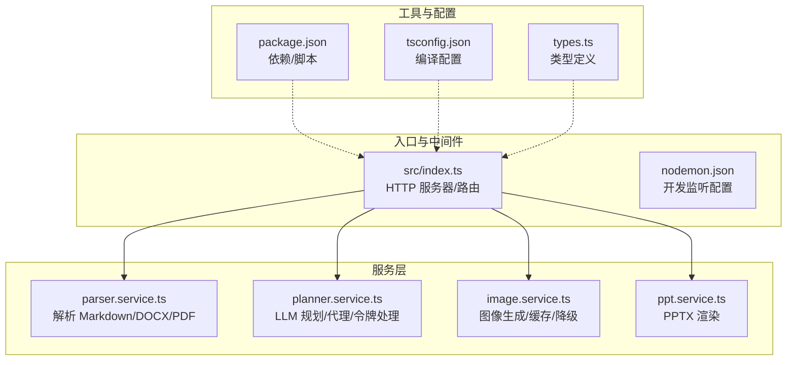
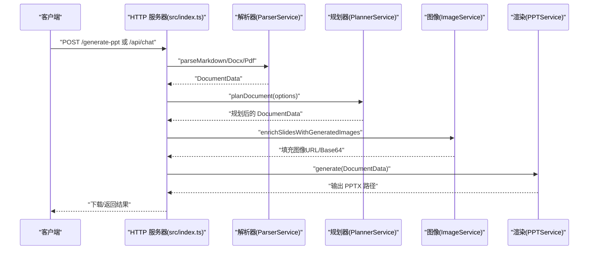
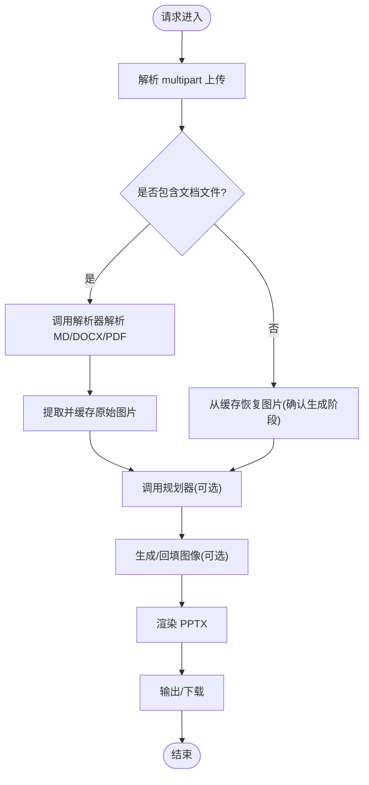
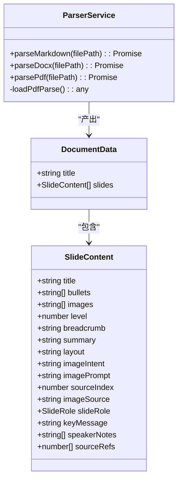
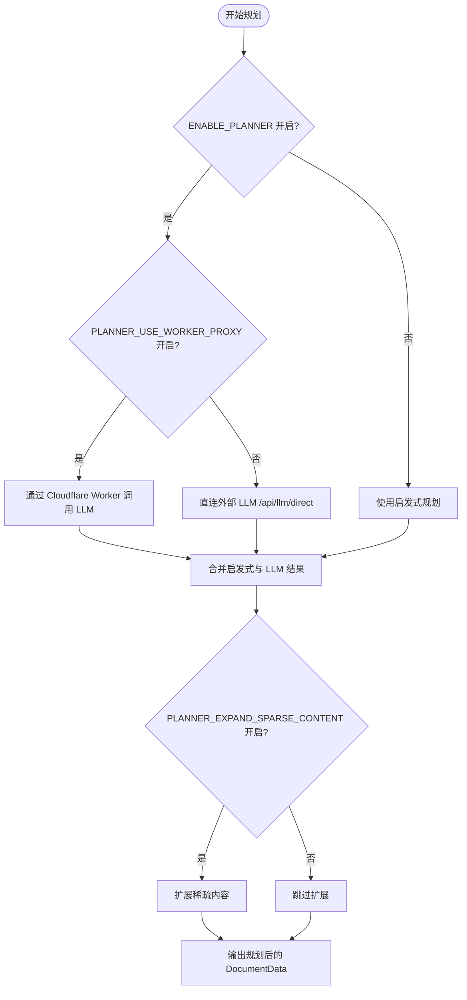
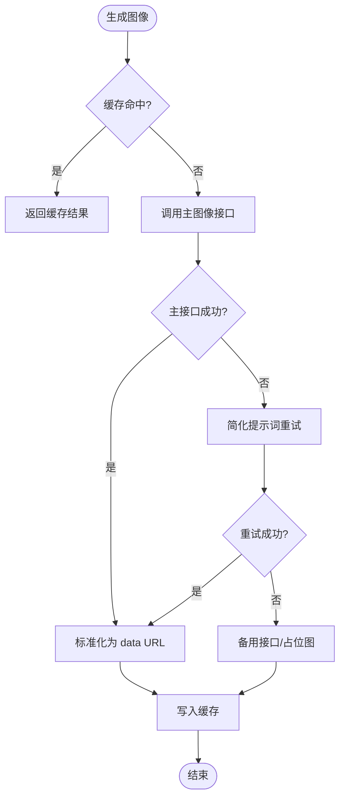
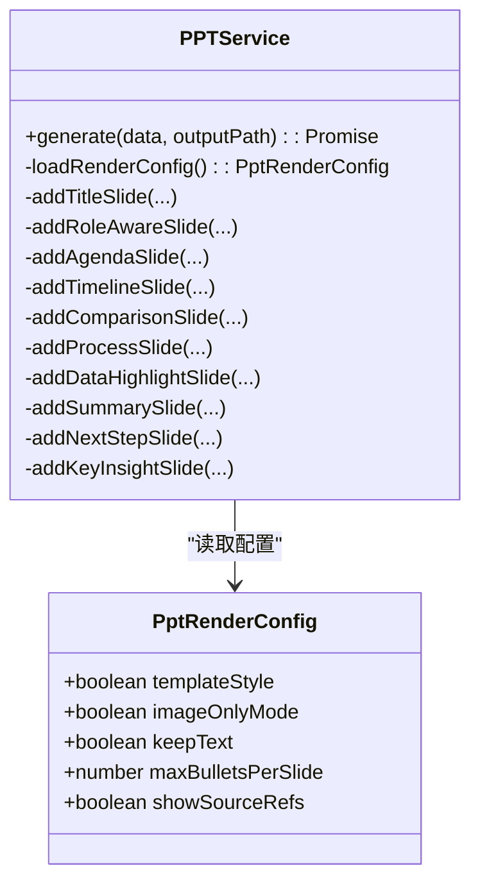
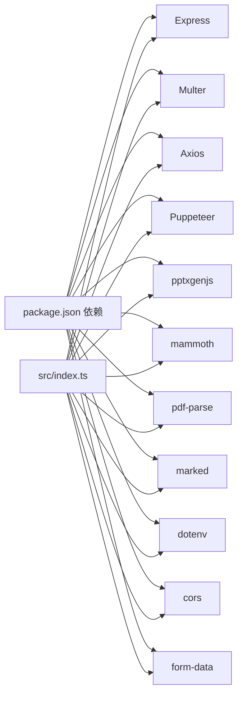

# 故障排查与常见问题

<cite>
**本文引用的文件**
- [package.json](file://package.json)
- [readme.md](file://readme.md)
- [src/index.ts](file://src/index.ts)
- [src/cli.ts](file://src/cli.ts)
- [src/services/parser.service.ts](file://src/services/parser.service.ts)
- [src/services/planner.service.ts](file://src/services/planner.service.ts)
- [src/services/image.service.ts](file://src/services/image.service.ts)
- [src/services/ppt.service.ts](file://src/services/ppt.service.ts)
- [src/types.ts](file://src/types.ts)
- [tsconfig.json](file://tsconfig.json)
- [nodemon.json](file://nodemon.json)
</cite>

## 目录
1. [简介](#简介)
2. [项目结构](#项目结构)
3. [核心组件](#核心组件)
4. [架构总览](#架构总览)
5. [详细组件分析](#详细组件分析)
6. [依赖分析](#依赖分析)
7. [性能考虑](#性能考虑)
8. [故障排查指南](#故障排查指南)
9. [结论](#结论)
10. [附录](#附录)

## 简介
本文件面向 Generate-PPT 的使用者与维护者，提供系统性的故障排查与常见问题解答，覆盖部署与运行时问题（端口占用、权限、依赖冲突）、网络连接问题、数据库与文件系统权限问题、性能诊断与优化、版本兼容与升级注意事项，以及紧急故障的快速恢复流程。同时给出日志分析方法与调试步骤，帮助快速定位问题根因。

## 项目结构
项目采用分层架构：入口控制器负责路由与中间件；服务层封装解析、规划、图像生成、PPT 渲染等业务逻辑；类型定义统一数据模型；CLI 提供命令行批量生成能力；开发工具通过 nodemon 实现热重载。

**图示来源**
- [src/index.ts:1-433](file://src/index.ts#L1-L433)
- [src/services/parser.service.ts:1-453](file://src/services/parser.service.ts#L1-L453)
- [src/services/planner.service.ts:1-800](file://src/services/planner.service.ts#L1-L800)
- [src/services/image.service.ts:1-218](file://src/services/image.service.ts#L1-L218)
- [src/services/ppt.service.ts:1-800](file://src/services/ppt.service.ts#L1-L800)
- [package.json:1-45](file://package.json#L1-L45)
- [tsconfig.json:1-23](file://tsconfig.json#L1-L23)
- [nodemon.json:1-6](file://nodemon.json#L1-L6)

**章节来源**
- [src/index.ts:1-433](file://src/index.ts#L1-L433)
- [package.json:1-45](file://package.json#L1-L45)
- [tsconfig.json:1-23](file://tsconfig.json#L1-L23)
- [nodemon.json:1-6](file://nodemon.json#L1-L6)

## 核心组件
- HTTP 服务器与路由：提供 /generate-ppt 与 /api/chat 接口，支持多格式文档解析与对话式生成。
- 解析器：支持 Markdown、DOCX、PDF，构建结构化文档数据。
- 规划器：可选启用，调用外部 LLM 接口进行幻灯片规划，支持工作器代理模式与令牌回退策略。
- 图像服务：基于配置生成 AI 图像，具备缓存与降级回退能力。
- PPT 渲染：使用模板样式与纯文本保留策略，输出标准 PPTX 文件。
- 类型系统：统一定义文档、幻灯片、规划参数与质量评估指标。

**章节来源**
- [src/index.ts:314-428](file://src/index.ts#L314-L428)
- [src/services/parser.service.ts:11-453](file://src/services/parser.service.ts#L11-L453)
- [src/services/planner.service.ts:53-82](file://src/services/planner.service.ts#L53-L82)
- [src/services/image.service.ts:4-218](file://src/services/image.service.ts#L4-L218)
- [src/services/ppt.service.ts:52-85](file://src/services/ppt.service.ts#L52-L85)
- [src/types.ts:1-160](file://src/types.ts#L1-L160)

## 架构总览
下图展示从请求到响应的关键链路，包括解析、规划、图像生成与渲染。

**图示来源**
- [src/index.ts:314-428](file://src/index.ts#L314-L428)
- [src/services/parser.service.ts:12-167](file://src/services/parser.service.ts#L12-L167)
- [src/services/planner.service.ts:84-101](file://src/services/planner.service.ts#L84-L101)
- [src/services/image.service.ts:15-28](file://src/services/image.service.ts#L15-L28)
- [src/services/ppt.service.ts:53-75](file://src/services/ppt.service.ts#L53-L75)

## 详细组件分析

### 组件 A：HTTP 服务器与路由
- 端口与静态资源：默认端口来自环境变量，支持静态目录挂载与输出目录下载。
- 上传与解析：multer 存储上传文件至 uploads 并清理临时文件；解析后清理缓存。
- 错误处理：捕获异常并返回 500 与错误信息；控制台打印堆栈便于排查。
- 会话级缓存：文档原始图片按标题映射缓存，10 分钟 TTL 自动清理。

**图示来源**
- [src/index.ts:72-270](file://src/index.ts#L72-L270)
- [src/index.ts:314-428](file://src/index.ts#L314-L428)

**章节来源**
- [src/index.ts:21-28](file://src/index.ts#L21-L28)
- [src/index.ts:29-43](file://src/index.ts#L29-L43)
- [src/index.ts:62-69](file://src/index.ts#L62-L69)
- [src/index.ts:72-270](file://src/index.ts#L72-L270)
- [src/index.ts:314-428](file://src/index.ts#L314-L428)

### 组件 B：解析器（ParserService）
- Markdown：按标题与列表层级构建幻灯片，支持内嵌图片抽取。
- DOCX：转换为 HTML 后按列表/段落/标题规则切分。
- PDF：按段落块切分，标题长度截断，避免超长标题。
- 性能与兼容：PDF 解析模块惰性加载，避免旧运行时初始化开销。

**图示来源**
- [src/services/parser.service.ts:11-453](file://src/services/parser.service.ts#L11-L453)
- [src/types.ts:48-71](file://src/types.ts#L48-L71)

**章节来源**
- [src/services/parser.service.ts:12-167](file://src/services/parser.service.ts#L12-L167)
- [src/services/parser.service.ts:169-183](file://src/services/parser.service.ts#L169-L183)
- [src/types.ts:48-71](file://src/types.ts#L48-L71)

### 组件 C：规划器（PlannerService）
- 配置项：基础 URL、令牌、模型、是否启用、代理开关、稀疏扩展、游客登录等。
- 工作器代理：当启用代理时优先走代理路径，否则直连外部 LLM。
- 令牌回退：优先使用规划器令牌，其次回退到图像 API 密钥。
- 输出：合并启发式与 LLM 规划结果，必要时扩展稀疏内容，强化叙事连贯性。

**图示来源**
- [src/services/planner.service.ts:67-82](file://src/services/planner.service.ts#L67-L82)
- [src/services/planner.service.ts:103-162](file://src/services/planner.service.ts#L103-L162)
- [src/services/planner.service.ts:164-190](file://src/services/planner.service.ts#L164-L190)

**章节来源**
- [src/services/planner.service.ts:67-82](file://src/services/planner.service.ts#L67-L82)
- [src/services/planner.service.ts:103-162](file://src/services/planner.service.ts#L103-L162)
- [src/services/planner.service.ts:164-190](file://src/services/planner.service.ts#L164-L190)

### 组件 D：图像服务（ImageService）
- 多级回退：主接口失败后尝试简化提示词重试，再降级到备用接口或本地占位图。
- 缓存：按提示词哈希缓存结果，避免重复请求。
- 并发：支持并发度控制，提升吞吐。

**图示来源**
- [src/services/image.service.ts:15-57](file://src/services/image.service.ts#L15-L57)
- [src/services/image.service.ts:59-120](file://src/services/image.service.ts#L59-L120)
- [src/services/image.service.ts:199-216](file://src/services/image.service.ts#L199-L216)

**章节来源**
- [src/services/image.service.ts:15-57](file://src/services/image.service.ts#L15-L57)
- [src/services/image.service.ts:59-120](file://src/services/image.service.ts#L59-L120)
- [src/services/image.service.ts:199-216](file://src/services/image.service.ts#L199-L216)

### 组件 E：PPT 渲染（PPTService）
- 主题与布局：宽屏布局、中文字体、颜色体系；支持模板风格、仅图模式、保留文本等配置。
- 角色化渲染：根据 slideRole 渲染不同版式（议程、时间线、对比、流程、数据高亮、总结、下一步等）。
- 输出：写入 PPTX 文件，供下载或进一步评估。

**图示来源**
- [src/services/ppt.service.ts:52-85](file://src/services/ppt.service.ts#L52-L85)
- [src/services/ppt.service.ts:87-277](file://src/services/ppt.service.ts#L87-L277)

**章节来源**
- [src/services/ppt.service.ts:52-85](file://src/services/ppt.service.ts#L52-L85)
- [src/services/ppt.service.ts:87-277](file://src/services/ppt.service.ts#L87-L277)

## 依赖分析
- 运行时依赖：Express、Multer、Axios、Puppeteer、pptxgenjs、mammoth、pdf-parse、marked、dotenv、cors、form-data 等。
- 开发依赖：ts-node、nodemon、TypeScript 及相关类型声明。
- 关键耦合点：HTTP 服务器依赖各服务层；规划器依赖外部 LLM 接口；图像服务依赖外部图像接口；PPT 渲染依赖 pptxgenjs。

**图示来源**
- [package.json:18-31](file://package.json#L18-L31)
- [src/index.ts:1-19](file://src/index.ts#L1-L19)

**章节来源**
- [package.json:18-31](file://package.json#L18-L31)
- [src/index.ts:1-19](file://src/index.ts#L1-L19)

## 性能考虑
- 并发与限流：图像生成支持并发度配置，建议结合上游接口速率限制合理设置。
- 缓存策略：图像服务对提示词进行缓存，减少重复请求；会话级图片缓存降低重复解析成本。
- 渲染优化：模板风格与仅图模式可减少渲染复杂度；最大每页要点数可控制文本密度。
- I/O 优化：上传目录与输出目录在启动时创建，避免运行时频繁创建目录引发阻塞。

**章节来源**
- [src/services/image.service.ts:15-28](file://src/services/image.service.ts#L15-L28)
- [src/services/image.service.ts:31-57](file://src/services/image.service.ts#L31-L57)
- [src/services/ppt.service.ts:77-85](file://src/services/ppt.service.ts#L77-L85)
- [src/index.ts:30-43](file://src/index.ts#L30-L43)

## 故障排查指南

### 一、部署与运行时问题

1) 端口占用
- 现象：启动时报端口被占用或无法绑定。
- 排查步骤：
  - 检查 PORT 环境变量是否被正确设置。
  - 使用系统工具查询占用进程并释放。
  - 在开发模式下，确认 nodemon 监听配置未与生产端口冲突。
- 相关位置
  - [src/index.ts:21-23](file://src/index.ts#L21-L23)
  - [readme.md:24](file://readme.md#L24)
  - [nodemon.json:1-6](file://nodemon.json#L1-L6)

2) 权限问题（文件系统）
- 现象：上传目录、输出目录创建失败或写入失败。
- 排查步骤：
  - 确认运行用户对 uploads 与 output 目录有读写权限。
  - 启动前确保目录存在或允许自动创建。
  - 检查磁盘空间与 inode 数量。
- 相关位置
  - [src/index.ts:30-43](file://src/index.ts#L30-L43)
  - [src/index.ts:390-394](file://src/index.ts#L390-L394)

3) 依赖冲突与安装失败
- 现象：安装依赖报错或运行时报模块缺失。
- 排查步骤：
  - 清理 node_modules 与包缓存后重装。
  - 对照 package.json 的依赖版本，确保 Node 版本满足要求。
  - 若使用代理，请检查 npm/yarn 配置。
- 相关位置
  - [package.json:18-43](file://package.json#L18-L43)
  - [readme.md:129-131](file://readme.md#L129-L131)

4) 环境变量缺失
- 现象：规划器/图像服务功能不可用或行为异常。
- 排查步骤：
  - 检查 .env 是否存在且包含必要的密钥与开关。
  - 核对 README 中的环境变量清单与注释。
- 相关位置
  - [readme.md:17-60](file://readme.md#L17-L60)
  - [src/services/planner.service.ts:67-82](file://src/services/planner.service.ts#L67-L82)
  - [src/services/image.service.ts:9-13](file://src/services/image.service.ts#L9-L13)

### 二、网络连接问题

1) 规划器外部接口不可达
- 现象：规划阶段失败，日志显示 API 返回非 200 或空内容。
- 排查步骤：
  - 检查 PLANNER_API_BASE_URL 与令牌配置。
  - 若启用代理，确认 CLOUDFLARE_WORKER_URL 与 LLM_API_KEY/GOOGLE_API_KEY 正确。
  - 尝试禁用代理直接访问，或切换到备用令牌。
- 相关位置
  - [src/services/planner.service.ts:103-162](file://src/services/planner.service.ts#L103-L162)
  - [src/services/planner.service.ts:164-190](file://src/services/planner.service.ts#L164-L190)
  - [readme.md:52-59](file://readme.md#L52-L59)

2) 图像接口不可达或限流
- 现象：图像生成失败，触发降级回退。
- 排查步骤：
  - 检查 IMAGE_API_BASE_URL 与 IMAGE_API_KEY。
  - 查看日志中“主接口失败”与“简化提示词重试”的提示。
  - 适当降低并发度或增加重试间隔。
- 相关位置
  - [src/services/image.service.ts:59-102](file://src/services/image.service.ts#L59-L102)
  - [src/services/image.service.ts:104-120](file://src/services/image.service.ts#L104-L120)

### 三、数据库与文件系统权限问题

- 本项目不直接依赖数据库，但涉及文件系统：
  - 上传目录：由 multer 写入，需确保目录存在且可写。
  - 输出目录：生成 PPTX 的目标目录，需确保可写。
- 排查步骤：
  - 使用最小权限原则创建独立目录，赋予运行账户读写。
  - 避免在容器或云函数中使用受限的临时目录。
- 相关位置
  - [src/index.ts:30-43](file://src/index.ts#L30-L43)
  - [src/index.ts:390-394](file://src/index.ts#L390-L394)

### 四、性能问题诊断与解决

1) 生成缓慢
- 检查图像生成并发度与外部接口响应时间。
- 评估文档体量与幻灯片数量，必要时拆分输入。
- 关闭模板风格或启用仅图模式以减少渲染开销。
- 相关位置
  - [src/services/image.service.ts:15-28](file://src/services/image.service.ts#L15-L28)
  - [src/services/ppt.service.ts:77-85](file://src/services/ppt.service.ts#L77-L85)

2) 内存占用过高
- 控制单次并发生成的幻灯片数量。
- 定期重启服务以释放内存碎片。
- 检查是否存在未清理的大对象或缓存膨胀。

3) CPU 占用偏高
- 降低图像并发度与渲染复杂度。
- 避免在生成过程中执行额外的 I/O 或网络请求。

### 五、版本兼容性与升级注意事项

- Node.js 版本：推荐 >= 16；README 明确兼容性。
- PDF 解析：pdf-parse 在较老运行时可能初始化失败，建议升级 Node。
- Puppeteer：若启用截图/渲染相关功能，注意其对系统依赖的要求。
- 升级策略：
  - 先在测试环境验证依赖版本与 Node 版本。
  - 逐步替换依赖，关注 API 变更与行为差异。
- 相关位置
  - [readme.md:127-131](file://readme.md#L127-L131)
  - [src/services/parser.service.ts:169-183](file://src/services/parser.service.ts#L169-L183)

### 六、紧急故障快速恢复流程

1) 服务无法启动
- 检查端口占用与权限。
- 临时关闭外部依赖（如禁用 ENABLE_PLANNER/ENABLE_AI_IMAGES）快速验证核心链路。
- 查看控制台日志定位具体模块。

2) 生成中断或输出为空
- 检查上传文件格式与大小限制。
- 确认输出目录可写。
- 临时禁用图像生成，仅测试解析与渲染链路。

3) 外部接口异常
- 切换到代理模式或备用令牌。
- 降低并发度，等待上游恢复。
- 记录失败时间窗口，便于后续审计。

### 七、日志分析与根因定位

- 控制台日志：HTTP 服务器与各服务均输出关键步骤日志，便于定位失败阶段。
- 关键日志点：
  - 请求进入与参数解析：[src/index.ts:72-92](file://src/index.ts#L72-L92)
  - 规划器调用与回退：[src/services/planner.service.ts:103-162](file://src/services/planner.service.ts#L103-L162)
  - 图像生成与降级：[src/services/image.service.ts:59-120](file://src/services/image.service.ts#L59-L120)
  - PPT 渲染与下载：[src/services/ppt.service.ts:53-75](file://src/services/ppt.service.ts#L53-L75)
- 建议：
  - 在生产环境开启更详细的日志级别。
  - 对外部接口调用增加超时与重试策略，并记录上下文 ID 以便追踪。

### 八、社区支持与问题反馈

- 参考项目文档与环境变量说明，确保配置正确。
- 如需协助，可基于最小复现步骤与日志片段进行反馈。

**章节来源**
- [src/index.ts:72-92](file://src/index.ts#L72-L92)
- [src/services/planner.service.ts:103-162](file://src/services/planner.service.ts#L103-L162)
- [src/services/image.service.ts:59-120](file://src/services/image.service.ts#L59-L120)
- [src/services/ppt.service.ts:53-75](file://src/services/ppt.service.ts#L53-L75)
- [readme.md:17-60](file://readme.md#L17-L60)

## 结论
通过规范的环境配置、合理的并发与缓存策略、完善的日志与监控，以及清晰的故障排查流程，可显著提升 Generate-PPT 的稳定性与可用性。建议在生产环境中固定 Node 与依赖版本，启用最小权限与隔离目录，并建立自动化健康检查与告警机制。

## 附录

### A. 常用命令与脚本
- 启动开发服务器：npm start
- 构建产物：npm run build
- 启动服务：npm run serve
- CLI 生成：npm run generate -- --input ... --output ...
- 相关位置
  - [package.json:5-12](file://package.json#L5-L12)

### B. 环境变量速查
- 端口：PORT
- 规划器：ENABLE_PLANNER、PLANNER_API_BASE_URL、PLANNER_AUTH_TOKEN、LLM_AUTH_TOKEN、PLANNER_USE_WORKER_PROXY、CLOUDFLARE_WORKER_URL、LLM_API_KEY、GOOGLE_API_KEY、PLANNER_CONTENT_MODE、PLANNER_EXPAND_SPARSE_CONTENT、PLANNER_USE_GUEST_LOGIN
- 图像：ENABLE_AI_IMAGES、IMAGE_API_KEY、IMAGE_API_BASE_URL、IMAGE_CONCURRENCY、IMAGE_MODEL、IMAGE_RESOLUTION
- PPT 渲染：PPT_TEMPLATE_STYLE、PPT_KEEP_TEXT、PPT_IMAGE_ONLY_MODE、PPT_MAX_BULLETS_PER_SLIDE、PPT_RENDER_MODE
- 质量评估：ENABLE_EVALUATION
- 相关位置
  - [readme.md:17-60](file://readme.md#L17-L60)