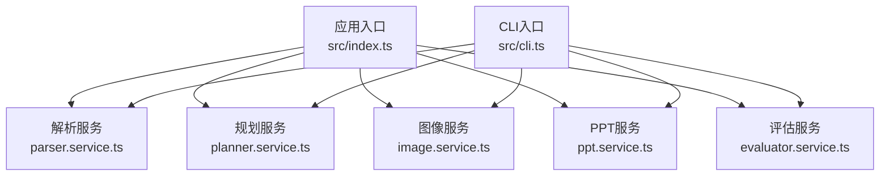
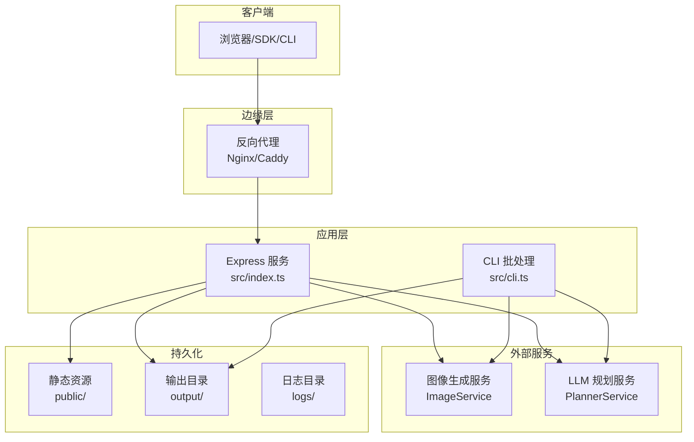
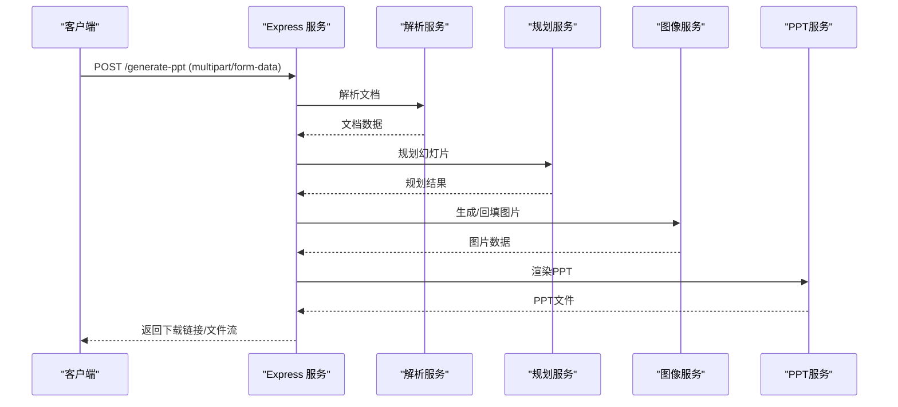
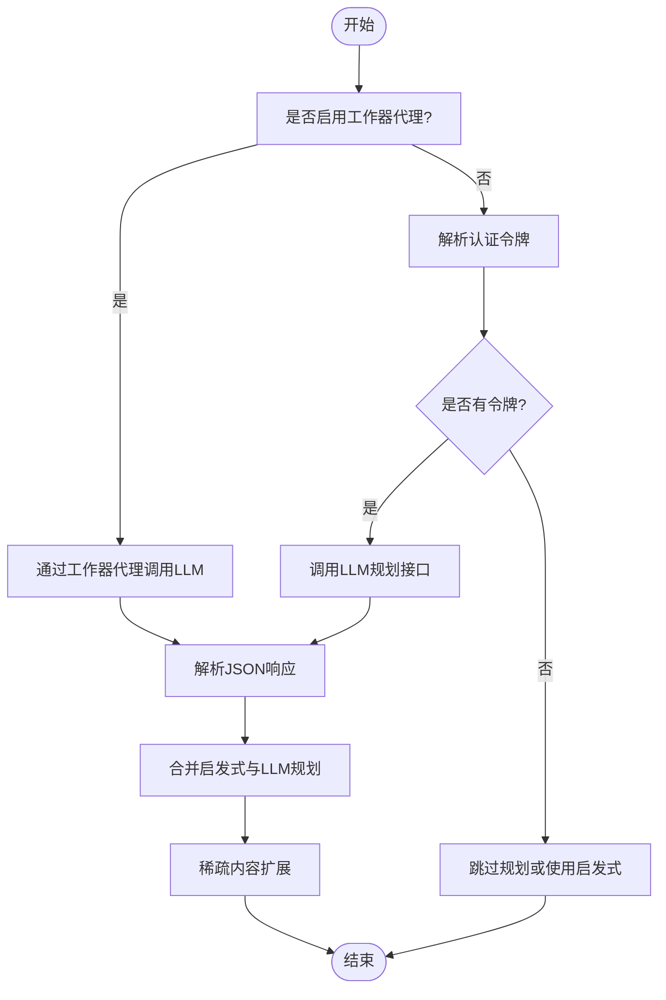
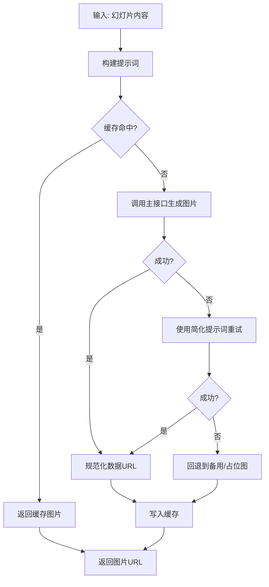
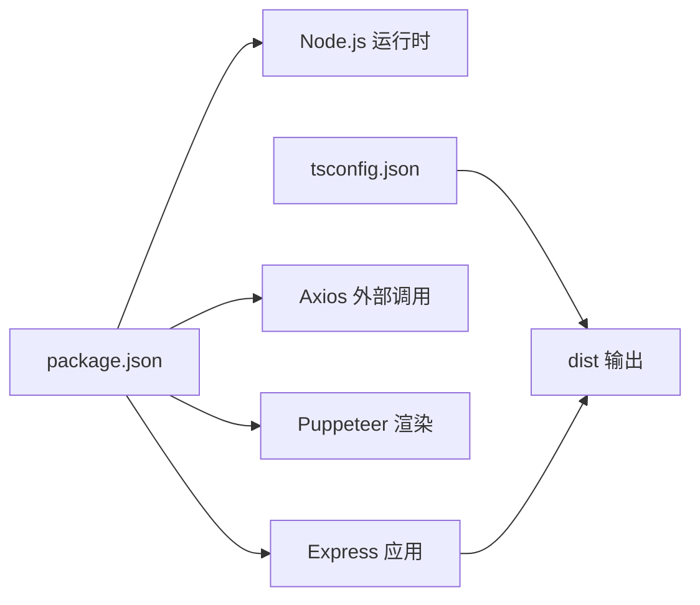

# 生产环境部署

<cite>
**本文引用的文件**
- [package.json](file://package.json)
- [readme.md](file://readme.md)
- [src/index.ts](file://src/index.ts)
- [src/services/image.service.ts](file://src/services/image.service.ts)
- [src/services/planner.service.ts](file://src/services/planner.service.ts)
- [src/services/ppt.service.ts](file://src/services/ppt.service.ts)
- [src/cli.ts](file://src/cli.ts)
- [tsconfig.json](file://tsconfig.json)
- [nodemon.json](file://nodemon.json)
- [.gitignore](file://.gitignore)
- [test-chat-upload.ts](file://test-chat-upload.ts)
</cite>

## 目录
1. [简介](#简介)
2. [项目结构](#项目结构)
3. [核心组件](#核心组件)
4. [架构总览](#架构总览)
5. [详细组件分析](#详细组件分析)
6. [依赖分析](#依赖分析)
7. [性能考虑](#性能考虑)
8. [故障排查指南](#故障排查指南)
9. [结论](#结论)
10. [附录](#附录)

## 简介
本指南面向在生产环境中部署 Generate-PPT 的工程团队，目标是提供从服务器准备、环境变量与安全配置、服务编排到域名与反向代理的完整落地方案。项目基于 Node.js + Express，提供 Web API 与 CLI 两种运行方式；同时集成 AI 图像生成与 LLM 规划能力，需关注外部服务依赖与并发控制。

## 项目结构
- 应用入口位于 src/index.ts，提供 Web 服务与路由。
- 核心业务逻辑分布在 src/services 下的多个服务模块，分别负责解析、规划、图像生成、PPT 渲染等。
- 构建产物输出至 dist，开发模式通过 ts-node/nodemon 运行。
- CLI 通过 src/cli.ts 提供离线批量处理能力。

图表来源
- [src/index.ts:1-433](file://src/index.ts#L1-L433)
- [src/services/planner.service.ts:1-800](file://src/services/planner.service.ts#L1-L800)
- [src/services/image.service.ts:1-218](file://src/services/image.service.ts#L1-L218)
- [src/services/ppt.service.ts:1-800](file://src/services/ppt.service.ts#L1-L800)
- [src/cli.ts:1-176](file://src/cli.ts#L1-L176)

章节来源
- [src/index.ts:1-433](file://src/index.ts#L1-L433)
- [tsconfig.json:1-23](file://tsconfig.json#L1-L23)
- [package.json:1-45](file://package.json#L1-L45)

## 核心组件
- Web 服务与路由
  - 使用 Express 提供 /generate-ppt 和 /api/chat 路由，支持多格式文档上传与聊天式生成。
  - 静态资源托管 public 与 output 目录，便于下载生成的 PPT。
- 服务层
  - PlannerService：调用外部 LLM 规划接口，支持工作器代理模式与本地回退。
  - ImageService：调用外部图像生成接口，具备缓存与降级策略。
  - PPTService：基于 pptxgenjs 渲染 PPT，支持模板风格与纯图模式。
- CLI 工具
  - 支持命令行参数化生成，便于批处理与 CI 场景。

章节来源
- [src/index.ts:314-428](file://src/index.ts#L314-L428)
- [src/services/planner.service.ts:53-101](file://src/services/planner.service.ts#L53-L101)
- [src/services/image.service.ts:4-28](file://src/services/image.service.ts#L4-L28)
- [src/services/ppt.service.ts:52-85](file://src/services/ppt.service.ts#L52-L85)
- [src/cli.ts:65-170](file://src/cli.ts#L65-L170)

## 架构总览
下图展示生产环境典型部署形态：反向代理（Nginx/Caddy）前置，后端以 systemd/PM2 管理 Node 进程，静态资源与输出目录持久化，外部服务（图像/LLM）通过环境变量配置。

图表来源
- [src/index.ts:21-27](file://src/index.ts#L21-L27)
- [src/services/image.service.ts:9-13](file://src/services/image.service.ts#L9-L13)
- [src/services/planner.service.ts:67-82](file://src/services/planner.service.ts#L67-L82)
- [.gitignore:36-44](file://.gitignore#L36-L44)

## 详细组件分析

### Web 服务与路由
- 路由设计
  - POST /generate-ppt：接收文件上传，执行解析、规划、图像生成与 PPT 渲染，并返回下载链接或直接下载。
  - POST /api/chat：支持文本与文件混合聊天，结合文档原始图片进行回填，生成 PPT 并返回下载链接。
- 安全与中间件
  - 默认启用 CORS，建议在生产中限制来源。
  - 使用 multer 存储上传文件至 uploads 目录，注意权限与容量限制。
- 输出与质量评估
  - 成功时将 PPT 写入 output 目录，可通过 /output 访问。
  - 可选的质量评估结果写入同名 .quality.json/.quality.md 文件。

图表来源
- [src/index.ts:314-428](file://src/index.ts#L314-L428)
- [src/services/planner.service.ts:84-101](file://src/services/planner.service.ts#L84-L101)
- [src/services/image.service.ts:15-28](file://src/services/image.service.ts#L15-L28)
- [src/services/ppt.service.ts:52-75](file://src/services/ppt.service.ts#L52-L75)

章节来源
- [src/index.ts:21-27](file://src/index.ts#L21-L27)
- [src/index.ts:314-428](file://src/index.ts#L314-L428)
- [.gitignore:7-14](file://.gitignore#L7-L14)

### 规划服务（PlannerService）
- 功能要点
  - 支持本地启发式规划与外部 LLM 规划融合。
  - 支持工作器代理模式（可选），通过 Cloudflare Worker 转发至 LLM。
  - 支持严格/创意两种规划模式，以及受众、焦点、风格、长度等偏好。
- 外部依赖
  - 通过 PLANNER_API_BASE_URL、PLANNER_AUTH_TOKEN/LLM_AUTH_TOKEN、PLANNER_MODEL 等环境变量配置。
  - 工作器代理模式需配置 CLOUDFLARE_WORKER_URL 与 LLM_API_KEY/GOOGLE_API_KEY。

图表来源
- [src/services/planner.service.ts:67-82](file://src/services/planner.service.ts#L67-L82)
- [src/services/planner.service.ts:103-162](file://src/services/planner.service.ts#L103-L162)
- [src/services/planner.service.ts:164-190](file://src/services/planner.service.ts#L164-L190)

章节来源
- [src/services/planner.service.ts:53-101](file://src/services/planner.service.ts#L53-L101)
- [readme.md:17-60](file://readme.md#L17-L60)

### 图像服务（ImageService）
- 功能要点
  - 基于外部图像生成接口生成幻灯片背景，支持缓存与降级。
  - 支持并发控制，避免对上游服务造成过大压力。
- 外部依赖
  - 通过 IMAGE_API_KEY、IMAGE_API_BASE_URL、IMAGE_CONCURRENCY 等环境变量配置。

图表来源
- [src/services/image.service.ts:15-57](file://src/services/image.service.ts#L15-L57)
- [src/services/image.service.ts:59-120](file://src/services/image.service.ts#L59-L120)
- [src/services/image.service.ts:122-156](file://src/services/image.service.ts#L122-L156)

章节来源
- [src/services/image.service.ts:4-28](file://src/services/image.service.ts#L4-L28)
- [readme.md:17-49](file://readme.md#L17-L49)

### PPT 渲染服务（PPTService）
- 功能要点
  - 基于 pptxgenjs 渲染 PPT，支持模板风格、纯图模式、保留文本等渲染选项。
  - 自动分页与布局优化，确保每页要点数量可控。
- 环境变量
  - PPT_TEMPLATE_STYLE、PPT_KEEP_TEXT、PPT_IMAGE_ONLY_MODE、PPT_MAX_BULLETS_PER_SLIDE 等。

章节来源
- [src/services/ppt.service.ts:52-85](file://src/services/ppt.service.ts#L52-L85)
- [readme.md:122-126](file://readme.md#L122-L126)

### CLI 工具（src/cli.ts）
- 功能要点
  - 支持 --input/--output 与多种规划参数，适合批处理与 CI。
  - 自动创建 output 目录并生成报告文件（如启用评估）。

章节来源
- [src/cli.ts:65-170](file://src/cli.ts#L65-L170)
- [package.json:9-12](file://package.json#L9-L12)

## 依赖分析
- 运行时依赖
  - express、cors、multer、dotenv、axios 等用于 Web 服务与外部通信。
  - puppeteer 用于截图/渲染（在 PPT 渲染链路中可选）。
- 开发依赖
  - ts-node、nodemon、typescript 用于开发调试与热重载。
- 构建配置
  - TypeScript 编译输出至 dist，源码位于 src。

图表来源
- [package.json:18-43](file://package.json#L18-L43)
- [tsconfig.json:1-23](file://tsconfig.json#L1-L23)

章节来源
- [package.json:18-43](file://package.json#L18-L43)
- [tsconfig.json:1-23](file://tsconfig.json#L1-L23)

## 性能考虑
- 并发与限流
  - 图像生成支持并发控制（IMAGE_CONCURRENCY），建议根据上游服务 QPS 与实例规格调整。
  - 规划服务与图像服务均具备超时与降级策略，避免雪崩。
- I/O 与缓存
  - 图像服务内置缓存，减少重复请求。
  - 输出目录与静态资源分离，便于 CDN 与持久化。
- 渲染优化
  - PPTService 支持模板风格与纯图模式，按需选择以平衡质量与体积。
- 进程管理
  - 建议使用 systemd/PM2 等进程管理器实现自动重启与资源监控。

## 故障排查指南
- 健康检查
  - 使用 test-chat-upload.ts 进行端到端验证，包含健康检查、文本聊天、文件上传与直接生成。
- 常见问题定位
  - 环境变量缺失：检查 .env 是否正确加载，确认 IMAGE_API_KEY、PLANNER_AUTH_TOKEN 等关键变量。
  - 外部服务不可达：查看 PlannerService/ImageService 的错误日志与超时配置。
  - 文件上传失败：确认 uploads/output 目录权限与磁盘空间。
- 日志与监控
  - 建议将日志输出到标准输出并交由系统日志服务统一采集。
  - 结合进程管理器的健康检查与重启策略。

章节来源
- [test-chat-upload.ts:1-121](file://test-chat-upload.ts#L1-L121)
- [src/services/planner.service.ts:103-162](file://src/services/planner.service.ts#L103-L162)
- [src/services/image.service.ts:59-120](file://src/services/image.service.ts#L59-L120)
- [.gitignore:16-20](file://.gitignore#L16-L20)

## 结论
通过本指南，可在生产环境稳定运行 Generate-PPT：完成服务器与 Node.js 环境准备、合理配置环境变量与安全策略、采用进程管理器进行服务编排、配合反向代理与 SSL 证书实现对外暴露，并建立完善的健康检查与日志监控体系。按需启用工作器代理与评估报告，进一步提升可用性与质量保障。

## 附录

### 服务器环境要求与系统依赖
- 操作系统
  - Linux（推荐 Ubuntu/Debian/CentOS）或 Windows（WSL/VM）。
- Node.js 版本
  - 推荐版本：>=16（详见项目说明）。
- 系统依赖
  - 无特殊系统库依赖，但若使用某些 PDF/图片解析功能，建议安装系统字体与基础工具包（具体取决于运行环境）。
- 权限与目录
  - 确保应用用户对输出目录（output）、上传目录（uploads）有读写权限。

章节来源
- [readme.md:127-131](file://readme.md#L127-L131)
- [.gitignore:36-44](file://.gitignore#L36-L44)

### 环境变量与安全设置
- 必要变量
  - PORT：服务监听端口，默认 3000。
  - IMAGE_API_KEY：图像生成服务鉴权。
  - IMAGE_API_BASE_URL：图像生成服务地址。
  - ENABLE_AI_IMAGES：是否启用 AI 图像生成。
  - IMAGE_CONCURRENCY：图像生成并发数。
  - ENABLE_PLANNER：是否启用 LLM 规划。
  - PLANNER_MODEL、PLANNER_API_BASE_URL、PLANNER_AUTH_TOKEN/LLM_AUTH_TOKEN。
  - PLANNER_USE_WORKER_PROXY、CLOUDFLARE_WORKER_URL、LLM_API_KEY、GOOGLE_API_KEY。
  - ENABLE_EVALUATION：是否生成质量评估报告。
  - PPT_TEMPLATE_STYLE、PPT_KEEP_TEXT、PPT_IMAGE_ONLY_MODE、PPT_MAX_BULLETS_PER_SLIDE。
- 安全建议
  - 将 .env/.env.local 等敏感文件加入 .gitignore，不在仓库中提交。
  - 在反向代理层开启 HTTPS 与访问控制，限制来源与速率。
  - 对外暴露仅开放必要端口，内部服务通过内网访问。

章节来源
- [readme.md:17-60](file://readme.md#L17-L60)
- [.gitignore:11-14](file://.gitignore#L11-L14)

### 部署流程（从代码到服务）
- 拉取代码与安装依赖
  - 安装 Node.js（>=16），克隆仓库后执行依赖安装。
- 构建与运行
  - 开发模式：npm start（使用 nodemon 监听）。
  - 生产模式：先构建 tsc，再使用 node dist/index.js 启动。
- 配置环境变量
  - 复制 .env.example 为 .env，填写所需变量。
- 启动服务
  - 使用 systemd 或 PM2 管理进程，设置开机自启与自动重启。
- 验证
  - 使用 curl 或 test-chat-upload.ts 进行端到端测试。

章节来源
- [package.json:5-12](file://package.json#L5-L12)
- [readme.md:84-90](file://readme.md#L84-L90)
- [test-chat-upload.ts:8-17](file://test-chat-upload.ts#L8-L17)

### 进程管理器配置示例
- systemd
  - 创建服务单元文件，设置 WorkingDirectory、ExecStart、Restart 等。
  - 使用 sudo systemctl enable generate-ppt.service 开机自启。
- PM2
  - 使用 pm2 start dist/index.js --name "generate-ppt" --restart-delay 1000
  - 设置日志轮转与内存告警。

章节来源
- [package.json:8](file://package.json#L8)
- [nodemon.json:1-6](file://nodemon.json#L1-L6)

### 域名、SSL 与反向代理
- 反向代理
  - Nginx/Caddy 前置，转发 /generate-ppt 与 /api/chat 到后端服务。
  - 配置静态资源路径 /output 与 public。
- SSL 证书
  - 使用 Let’s Encrypt 获取免费证书，配置 HTTPS 强制跳转。
- 安全加固
  - 限制来源 IP、设置速率限制、开启 WAF（可选）。

章节来源
- [src/index.ts:21-27](file://src/index.ts#L21-L27)

### 部署脚本与自动化
- 构建脚本
  - npm run build 生成 dist。
- 启动脚本
  - npm run serve 启动生产服务。
- CI/CD 建议
  - 在流水线中执行安装、构建、测试与部署步骤，结合蓝绿/滚动发布策略。

章节来源
- [package.json:7-8](file://package.json#L7-L8)

### 部署后验证与健康检查
- 健康检查
  - GET 根路径返回 200。
  - /generate-ppt 与 /api/chat 返回预期状态码与内容类型。
- 质量评估
  - 若启用评估，检查输出目录是否生成 .quality.json/.quality.md 报告。
- 日志与指标
  - 关注错误日志、慢请求与外部服务超时统计。

章节来源
- [test-chat-upload.ts:8-119](file://test-chat-upload.ts#L8-L119)
- [src/index.ts:408-416](file://src/index.ts#L408-L416)