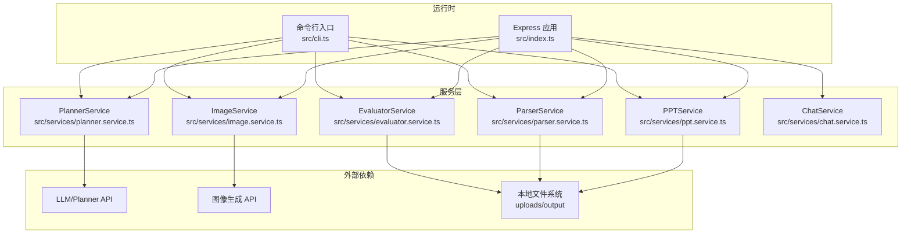
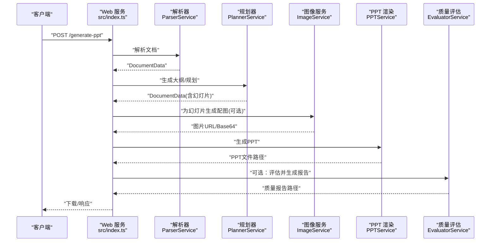
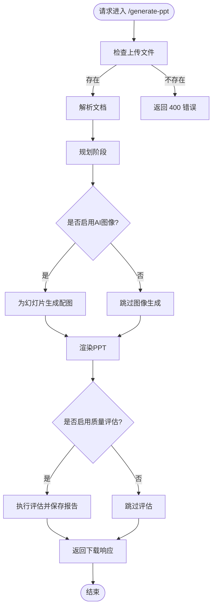
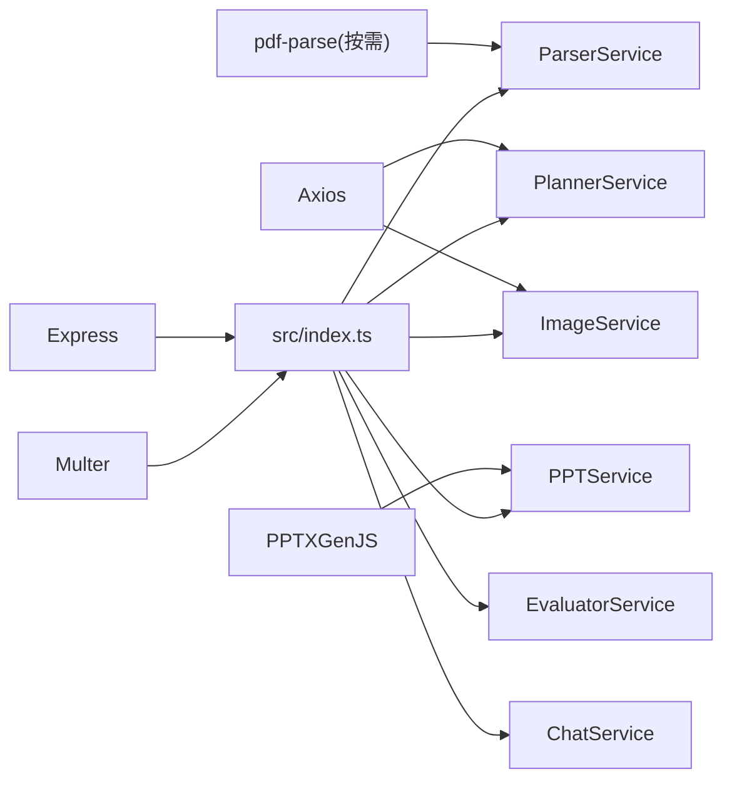

# 监控与日志

<cite>
**本文引用的文件**
- [package.json](file://package.json)
- [readme.md](file://readme.md)
- [src/index.ts](file://src/index.ts)
- [src/cli.ts](file://src/cli.ts)
- [src/types.ts](file://src/types.ts)
- [src/services/chat.service.ts](file://src/services/chat.service.ts)
- [src/services/evaluator.service.ts](file://src/services/evaluator.service.ts)
- [src/services/image.service.ts](file://src/services/image.service.ts)
- [src/services/parser.service.ts](file://src/services/parser.service.ts)
- [src/services/planner.service.ts](file://src/services/planner.service.ts)
- [src/services/ppt.service.ts](file://src/services/ppt.service.ts)
</cite>

## 目录
1. [简介](#简介)
2. [项目结构](#项目结构)
3. [核心组件](#核心组件)
4. [架构总览](#架构总览)
5. [详细组件分析](#详细组件分析)
6. [依赖分析](#依赖分析)
7. [性能考虑](#性能考虑)
8. [故障排查指南](#故障排查指南)
9. [结论](#结论)
10. [附录](#附录)

## 简介
本文件面向 Generate-PPT 项目的监控与日志管理，目标是帮助运维与开发团队建立完善的可观测性体系，覆盖应用运行状态、请求处理链路、资源使用、第三方服务依赖健康度以及质量评估结果的可追踪与可视化。文档同时给出与 Prometheus/Grafana、ELK Stack 的集成建议、告警规则与通知机制、日志轮转与存储策略、APM 使用建议及关键业务指标监控配置，并提供仪表板创建与维护指南。

## 项目结构
项目采用 Node.js + Express 构建的 Web 服务，核心入口负责路由与业务编排，服务层封装解析、规划、图像生成、PPT 渲染与质量评估等能力。CLI 提供离线批量生成能力。环境变量驱动功能开关与第三方服务地址。

图表来源
- [src/index.ts:1-433](file://src/index.ts#L1-L433)
- [src/cli.ts:1-176](file://src/cli.ts#L1-L176)
- [src/services/parser.service.ts:1-453](file://src/services/parser.service.ts#L1-L453)
- [src/services/planner.service.ts:1-800](file://src/services/planner.service.ts#L1-L800)
- [src/services/image.service.ts:1-218](file://src/services/image.service.ts#L1-L218)
- [src/services/ppt.service.ts:1-800](file://src/services/ppt.service.ts#L1-L800)
- [src/services/evaluator.service.ts:1-800](file://src/services/evaluator.service.ts#L1-L800)

章节来源
- [src/index.ts:1-433](file://src/index.ts#L1-L433)
- [src/cli.ts:1-176](file://src/cli.ts#L1-L176)
- [package.json:1-45](file://package.json#L1-L45)

## 核心组件
- Web 服务与路由
  - 提供 /generate-ppt 与 /api/chat 两个核心接口，分别支持文档到 PPT 的批量生成与对话式生成。
  - 统一启用 CORS、JSON 解析、静态资源托管与上传目录管理。
- 服务编排
  - 解析器：支持 Markdown、DOCX、PDF，抽取标题、要点与图片。
  - 规划器：调用 LLM 生成结构化大纲与幻灯片内容，支持工作流代理模式。
  - 图像服务：生成配图或回退占位图，具备并发控制与缓存。
  - PPT 渲染：基于模板样式与纯图片渲染两种模式。
  - 质量评估：对生成的 PPT 进行多维度评分与报告落盘。
  - 对话服务：与 LLM 对话，支持大纲阶段与最终生成阶段的切换。
- CLI 批处理：支持离线生成与质量评估报告输出。

章节来源
- [src/index.ts:314-428](file://src/index.ts#L314-L428)
- [src/index.ts:72-270](file://src/index.ts#L72-L270)
- [src/services/parser.service.ts:1-453](file://src/services/parser.service.ts#L1-L453)
- [src/services/planner.service.ts:1-800](file://src/services/planner.service.ts#L1-L800)
- [src/services/image.service.ts:1-218](file://src/services/image.service.ts#L1-L218)
- [src/services/ppt.service.ts:1-800](file://src/services/ppt.service.ts#L1-L800)
- [src/services/evaluator.service.ts:1-800](file://src/services/evaluator.service.ts#L1-L800)
- [src/services/chat.service.ts:1-400](file://src/services/chat.service.ts#L1-L400)
- [src/cli.ts:65-170](file://src/cli.ts#L65-L170)

## 架构总览
下图展示请求从 Web 层进入后，如何依次经过解析、规划、图像生成、PPT 渲染与质量评估，并最终返回文件下载或 JSON 响应。

图表来源
- [src/index.ts:314-428](file://src/index.ts#L314-L428)
- [src/services/parser.service.ts:1-453](file://src/services/parser.service.ts#L1-L453)
- [src/services/planner.service.ts:1-800](file://src/services/planner.service.ts#L1-L800)
- [src/services/image.service.ts:1-218](file://src/services/image.service.ts#L1-L218)
- [src/services/ppt.service.ts:1-800](file://src/services/ppt.service.ts#L1-L800)
- [src/services/evaluator.service.ts:1-800](file://src/services/evaluator.service.ts#L1-L800)

## 详细组件分析

### Web 服务与路由
- /generate-ppt
  - 支持 multipart/form-data，接收 md/docx/pdf 文件。
  - 参数校验与规范化：plannerMode、deckFormat、audience、focus、style、length。
  - 流程：解析 → 规划 → 可选图像生成 → 渲染 → 可选质量评估 → 下载。
- /api/chat
  - 支持多文件上传与消息历史，结合对话阶段识别与 LLM 交互，支持大纲预览与最终 JSON 生成。
  - 输出：文本回复、可选大纲预览、最终 PPT 下载链接。

图表来源
- [src/index.ts:314-428](file://src/index.ts#L314-L428)

章节来源
- [src/index.ts:314-428](file://src/index.ts#L314-L428)
- [src/index.ts:72-270](file://src/index.ts#L72-L270)

### 解析器服务（ParserService）
- 功能：从 Markdown、DOCX、PDF 中抽取标题、要点与图片，生成统一的 DocumentData 结构。
- 关键点：HTML 解析、列表/段落/标题提取、图片抽取与清洗。

章节来源
- [src/services/parser.service.ts:1-453](file://src/services/parser.service.ts#L1-L453)

### 规划器服务（PlannerService）
- 功能：调用 LLM 生成结构化大纲与幻灯片，支持严格/创意模式、工作流代理、稀疏内容扩展、语言净化与布局建议。
- 关键点：提示词构建、JSON 结构解析、幻灯片角色推断、跨语言净化。

章节来源
- [src/services/planner.service.ts:1-800](file://src/services/planner.service.ts#L1-L800)

### 图像服务（ImageService）
- 功能：为幻灯片生成配图，具备主 API 失败重试、简化提示词回退、占位图与缓存机制。
- 关键点：并发控制、提示词标准化、下载与 Base64 归一化。

章节来源
- [src/services/image.service.ts:1-218](file://src/services/image.service.ts#L1-L218)

### PPT 渲染服务（PPTService）
- 功能：基于模板样式与纯图片模式生成 PPT，支持分页、角色化幻灯片、页眉页脚与主题色。
- 关键点：布局与样式配置、角色化渲染、文件写入。

章节来源
- [src/services/ppt.service.ts:1-800](file://src/services/ppt.service.ts#L1-L800)

### 质量评估服务（EvaluatorService）
- 功能：对生成的 PPT 进行多维度评分（逻辑、布局、图像语义、内容丰富度、受众契合、一致性、源理解），并输出 JSON 与 Markdown 报告。
- 关键点：Zip/PPTX 解析、文本与图像统计、权重聚合与等级映射。

章节来源
- [src/services/evaluator.service.ts:1-800](file://src/services/evaluator.service.ts#L1-L800)

### 对话服务（ChatService）
- 功能：识别对话阶段（需求收集/大纲/确认），构建提示词并调用 LLM，解析 JSON/大纲输出。
- 关键点：阶段检测、提示词构建、响应解析与兜底。

章节来源
- [src/services/chat.service.ts:1-400](file://src/services/chat.service.ts#L1-L400)

## 依赖分析
- 外部依赖
  - Express：Web 框架与中间件。
  - Multer：文件上传。
  - Axios：HTTP 客户端，调用 LLM/图像服务。
  - PPTXGenJS：PPT 渲染。
  - PDF 解析：按需加载 pdf-parse。
- 内部模块耦合
  - Web 服务对各服务模块进行编排，服务间通过 DocumentData 与 SlideContent 协议耦合。
  - Planner 与 Image 作为外部依赖的抽象层，便于替换与测试。

图表来源
- [package.json:18-31](file://package.json#L18-L31)
- [src/index.ts:1-433](file://src/index.ts#L1-L433)

章节来源
- [package.json:18-31](file://package.json#L18-L31)
- [src/index.ts:1-433](file://src/index.ts#L1-L433)

## 性能考虑
- 并发与限流
  - 图像生成支持并发参数控制，避免对上游服务造成瞬时压力。
  - 建议在网关层引入速率限制与超时配置。
- 资源使用
  - PPT 渲染与图像生成属于 CPU/内存密集型，建议在容器中设置资源限制与 HPA。
- I/O 优化
  - 上传/输出目录使用磁盘，建议挂载高性能卷并开启异步写入。
- 缓存
  - 图像服务内置提示词缓存，可降低重复请求成本。

章节来源
- [src/services/image.service.ts:199-216](file://src/services/image.service.ts#L199-L216)
- [src/services/ppt.service.ts:77-85](file://src/services/ppt.service.ts#L77-L85)

## 故障排查指南
- 常见错误与定位
  - LLM/图像服务不可达：检查 PLANNER_API_BASE_URL/IMAGE_API_BASE_URL 与鉴权令牌。
  - 文件格式不支持：确认 /generate-ppt 的 Content-Type 与后缀。
  - 质量评估失败：确认输出目录可写，PPT 文件存在且可读。
- 日志与告警
  - 在关键路径增加结构化日志（请求 ID、阶段、耗时、错误码）。
  - 对外部依赖调用失败与超时进行告警。
- 诊断步骤
  - 启用 CLI 模式进行离线验证，排除 Web 层干扰。
  - 检查上传/输出目录权限与磁盘空间。

章节来源
- [src/index.ts:424-427](file://src/index.ts#L424-L427)
- [src/services/chat.service.ts:97-100](file://src/services/chat.service.ts#L97-L100)
- [src/services/image.service.ts:95-101](file://src/services/image.service.ts#L95-L101)
- [src/services/evaluator.service.ts:158-162](file://src/services/evaluator.service.ts#L158-L162)

## 监控与日志管理

### 监控指标采集与配置
- 请求级指标
  - 指标名称与含义
    - http_requests_total{endpoint, method, status}：接口总请求数
    - http_request_duration_seconds{endpoint, method, status}：接口响应耗时直方图
    - http_request_size_bytes{endpoint, method}：请求体大小
    - http_response_size_bytes{endpoint, method}：响应体大小
  - 采集方式
    - 在 Web 服务中埋点，记录请求进入、处理完成与异常时的计数与耗时。
- 错误率
  - 指标：error_rate = sum(http_requests_total{status=~"5.."} + http_requests_total{status=~"4..", endpoint!="health"}) / sum(http_requests_total)
  - 告警阈值：短期窗口（5 分钟）> 1%，长期窗口（1 小时）> 0.5%
- 资源使用
  - 指标：process_resident_memory_bytes、process_cpu_seconds_total、go_goroutines（若使用 Go）、nodejs_heap_bytes（Node.js）
  - 采集方式：Prometheus Node Exporter 或进程导出器
- 第三方依赖健康
  - 指标：external_api_calls_total{service, endpoint, status}、external_api_duration_seconds{service, endpoint}
  - 告警：连续失败次数、成功率低于阈值、延迟超过 P95

章节来源
- [src/index.ts:314-428](file://src/index.ts#L314-L428)
- [src/services/planner.service.ts:109-162](file://src/services/planner.service.ts#L109-L162)
- [src/services/image.service.ts:59-102](file://src/services/image.service.ts#L59-L102)

### 日志系统配置与管理
- 访问日志
  - 结构：请求ID、时间戳、方法、URL、状态码、耗时(ms)、远程IP、User-Agent
  - 存储：按天滚动，保留 30 天
- 错误日志
  - 结构：级别、时间戳、模块、消息、堆栈、上下文（请求ID、用户ID、输入参数片段）
  - 存储：按级别分离，保留 7 天
- 业务日志
  - 结构：事件类型（生成开始/完成、评估完成、图像生成、规划阶段切换）、耗时、输入/输出摘要、关键参数
  - 存储：保留 90 天
- 日志轮转与存储策略
  - 使用 logrotate 或 systemd-journald + rsyslog
  - 远程归档：ES/对象存储，保留周期按法规与审计要求设定

章节来源
- [src/index.ts:72-270](file://src/index.ts#L72-L270)
- [src/services/chat.service.ts:40-101](file://src/services/chat.service.ts#L40-L101)
- [src/services/evaluator.service.ts:95-108](file://src/services/evaluator.service.ts#L95-L108)

### 第三方监控工具集成
- Prometheus
  - 导出器：Node Exporter（系统指标）、自定义指标端点（业务指标）
  - 抓取：每 15 秒一次
- Grafana
  - 仪表板：请求总量/错误率/延迟、外部依赖成功率/延迟、资源使用趋势、质量评估分布
- ELK Stack
  - Logstash/Fluentd 收集日志，Kibana 可视化与检索
  - 建议字段映射：trace_id、span_id、level、module、endpoint、duration_ms、error_msg

章节来源
- [src/index.ts:314-428](file://src/index.ts#L314-L428)
- [src/services/planner.service.ts:109-162](file://src/services/planner.service.ts#L109-L162)
- [src/services/image.service.ts:59-102](file://src/services/image.service.ts#L59-L102)

### 告警规则与通知机制
- 告警规则示例
  - 请求错误率 > 1%（5 分钟）
  - 响应延迟 P95 > 5s（5 分钟）
  - 外部 API 成功率 < 95%（5 分钟）
  - 资源使用：CPU > 80%、内存 > 85%、磁盘 IO > 90%
- 通知渠道
  - 邮件、企业微信、Slack、PagerDuty（值班）

章节来源
- [src/index.ts:314-428](file://src/index.ts#L314-L428)
- [src/services/planner.service.ts:109-162](file://src/services/planner.service.ts#L109-L162)
- [src/services/image.service.ts:59-102](file://src/services/image.service.ts#L59-L102)

### APM 工具使用与性能分析
- 推荐方案：OpenTelemetry + Jaeger/Tempo + Grafana
- 采样策略：高 QPS 场景采用 1% 采样，关键路径 100%
- 关键链路：Web 入口 → 解析 → 规划 → 图像 → 渲染 → 评估
- 性能分析：慢查询定位、热点函数、外部依赖耗时占比

章节来源
- [src/index.ts:314-428](file://src/index.ts#L314-L428)
- [src/services/planner.service.ts:109-162](file://src/services/planner.service.ts#L109-L162)
- [src/services/image.service.ts:59-102](file://src/services/image.service.ts#L59-L102)

### 关键业务指标监控配置
- 生成成功率：成功生成数 / 总请求数
- 平均生成耗时：生成阶段（解析+规划+图像+渲染+评估）
- 外部依赖成功率/延迟：LLM、图像服务
- 质量评分分布：优秀/良好/合格/不合格占比
- 并发与吞吐：每秒生成数、并发活跃数

章节来源
- [src/services/evaluator.service.ts:32-93](file://src/services/evaluator.service.ts#L32-L93)
- [src/index.ts:408-416](file://src/index.ts#L408-L416)

### 监控仪表板创建与维护
- 仪表板建议
  - 实时概览：请求总量/错误率/延迟、外部依赖健康度
  - 业务看板：生成耗时分布、质量评分分布、并发趋势
  - 运维看板：资源使用、日志错误趋势、告警事件
- 维护规范
  - 版本化仪表板 JSON，变更评审与回滚策略
  - 定期审查指标有效性与阈值合理性

[本节为概念性内容，无需列出来源]

## 结论
通过在 Web 层埋点、服务层关键路径打点、第三方依赖指标采集与日志分级管理，结合 Prometheus/Grafana 与 ELK 的统一监控平台，可实现对 Generate-PPT 的全链路可观测性。配合 APM 与告警机制，能够快速定位性能瓶颈与异常，保障服务稳定性与用户体验。

## 附录
- 环境变量参考
  - PORT、ENABLE_AI_IMAGES、IMAGE_CONCURRENCY、ENABLE_PLANNER、PLANNER_MODEL、PLANNER_API_BASE_URL、PLANNER_AUTH_TOKEN、LLM_AUTH_TOKEN、PLANNER_USE_WORKER_PROXY、CLOUDFLARE_WORKER_URL、GOOGLE_API_KEY、PPT_TEMPLATE_STYLE、PPT_KEEP_TEXT、PPT_IMAGE_ONLY_MODE、PPT_MAX_BULLETS_PER_SLIDE、ENABLE_EVALUATION
- API 参考
  - POST /generate-ppt：multipart/form-data，file 字段必填，plannerMode、deckFormat、audience、focus、style、length 可选
  - POST /api/chat：files（最多 5 个）、text、messages（数组或 JSON 字符串）

章节来源
- [readme.md:17-50](file://readme.md#L17-L50)
- [src/index.ts:314-428](file://src/index.ts#L314-L428)
- [src/index.ts:72-270](file://src/index.ts#L72-L270)