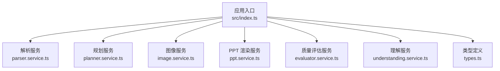
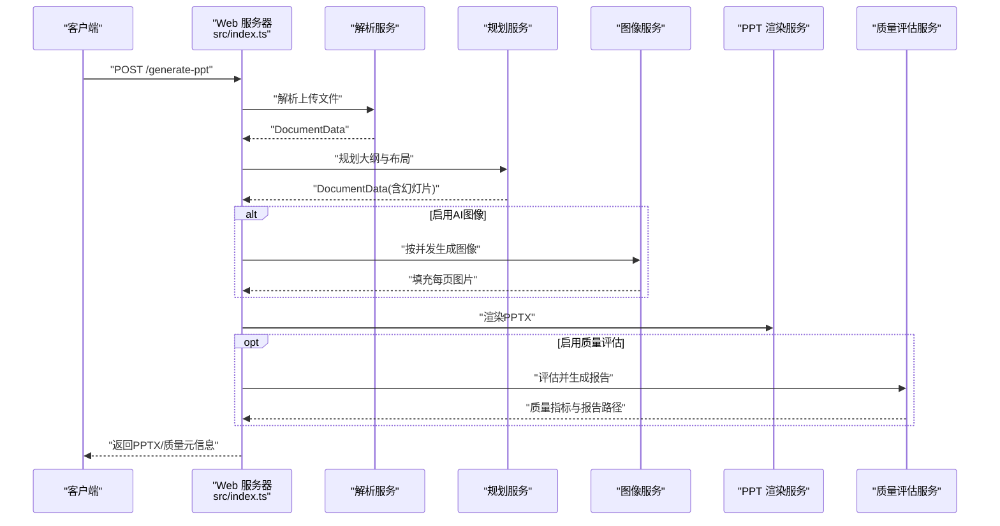
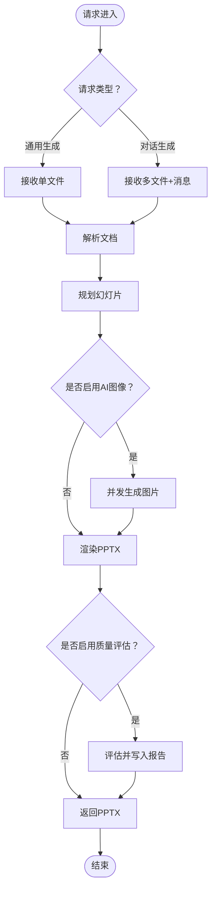
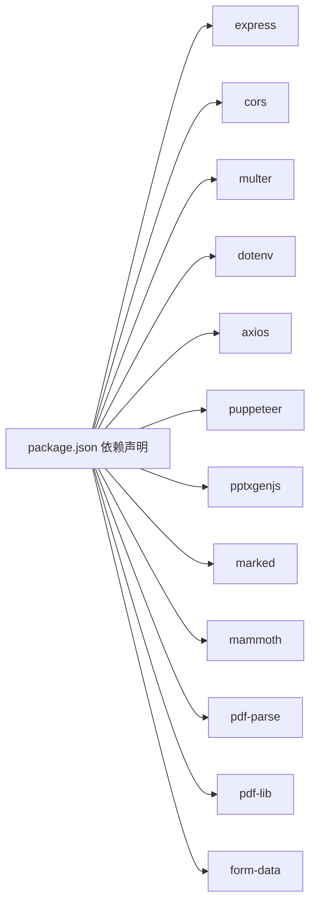

# 部署运维

<cite>
**本文引用的文件**
- [package.json](file://package.json)
- [readme.md](file://readme.md)
- [src/index.ts](file://src/index.ts)
- [src/services/ppt.service.ts](file://src/services/ppt.service.ts)
- [src/services/image.service.ts](file://src/services/image.service.ts)
- [src/services/planner.service.ts](file://src/services/planner.service.ts)
- [src/services/understanding.service.ts](file://src/services/understanding.service.ts)
- [src/types.ts](file://src/types.ts)
- [nodemon.json](file://nodemon.json)
- [tsconfig.json](file://tsconfig.json)
</cite>

## 目录
1. [简介](#简介)
2. [项目结构](#项目结构)
3. [核心组件](#核心组件)
4. [架构总览](#架构总览)
5. [详细组件分析](#详细组件分析)
6. [依赖分析](#依赖分析)
7. [性能考虑](#性能考虑)
8. [故障排查指南](#故障排查指南)
9. [结论](#结论)
10. [附录](#附录)

## 简介
本文件面向 Generate-PPT 的生产环境部署与运维，覆盖环境准备、依赖安装、配置设置、容器化与编排部署、性能优化、监控与日志、故障排查、备份恢复、安全加固、版本升级与回滚等全生命周期运维主题。系统基于 Node.js + Express 提供 Web API，支持将 Word/Markdown/PDF 转换为 PPTX，并可选进行 AI 图像生成与质量评估。

## 项目结构
- 应用入口与路由：Express 应用在入口文件中初始化，挂载 CORS、静态资源、文件上传中间件，并注册生成接口。
- 服务层：
  - 解析服务：解析 Markdown、DOCX、PDF 文档，抽取层级化内容。
  - 规划服务：通过 LLM 或启发式规则生成幻灯片大纲与布局建议。
  - 图像服务：调用外部图像接口生成幻灯片背景图，具备并发控制与缓存。
  - PPT 渲染服务：使用模板样式渲染 PPTX，支持纯图模式与文本保留策略。
  - 质量评估服务：对生成结果进行多维度评分与报告输出（可选）。
- 类型定义：统一描述幻灯片、文档、规划参数与质量评估指标的数据结构。
- 开发工具：Nodemon 用于开发热更新；TypeScript 编译配置。

**图表来源**
- [src/index.ts:1-433](file://src/index.ts#L1-L433)
- [src/services/ppt.service.ts:1-800](file://src/services/ppt.service.ts#L1-L800)
- [src/services/image.service.ts:1-218](file://src/services/image.service.ts#L1-L218)
- [src/services/planner.service.ts:1-800](file://src/services/planner.service.ts#L1-L800)
- [src/services/understanding.service.ts:1-96](file://src/services/understanding.service.ts#L1-L96)
- [src/types.ts:1-160](file://src/types.ts#L1-L160)

**章节来源**
- [src/index.ts:1-433](file://src/index.ts#L1-L433)
- [package.json:1-45](file://package.json#L1-L45)
- [tsconfig.json:1-23](file://tsconfig.json#L1-L23)

## 核心组件
- Web 服务器与路由
  - 初始化 Express、CORS、JSON/静态资源、Multer 文件上传。
  - 提供两类接口：
    - 通用生成接口：接收单文件，返回 PPTX 下载。
    - 对话生成接口：接收多文件与消息，结合文档原始图片回填，返回下载链接。
- 服务编排
  - 解析 → 规划 → 图像生成（可选）→ 渲染 → 可选质量评估 → 下载。
- 并发与缓存
  - 图像服务支持并发控制与提示词缓存。
  - 对话生成接口对文档原始图片做会话级缓存（带 TTL 自动清理）。

**章节来源**
- [src/index.ts:21-433](file://src/index.ts#L21-L433)
- [src/services/image.service.ts:15-218](file://src/services/image.service.ts#L15-L218)
- [src/services/ppt.service.ts:52-85](file://src/services/ppt.service.ts#L52-L85)

## 架构总览
下图展示从客户端到各服务模块的调用链路与关键配置项。

**图表来源**
- [src/index.ts:314-428](file://src/index.ts#L314-L428)
- [src/services/planner.service.ts:84-101](file://src/services/planner.service.ts#L84-L101)
- [src/services/image.service.ts:15-28](file://src/services/image.service.ts#L15-L28)
- [src/services/ppt.service.ts:52-75](file://src/services/ppt.service.ts#L52-L75)

## 详细组件分析

### Web 服务器与路由
- 功能点
  - CORS 放通、JSON 与静态资源中间件。
  - 多文件上传（对话生成）与单文件上传（通用生成）。
  - 对话生成接口支持文档原始图片缓存与回填。
- 关键配置
  - 端口 PORT，默认 3000。
  - 是否启用 Planner/评估/图片生成等开关。
- 错误处理
  - 统一捕获异常并返回错误信息。

**图表来源**
- [src/index.ts:314-428](file://src/index.ts#L314-L428)
- [src/index.ts:72-270](file://src/index.ts#L72-L270)

**章节来源**
- [src/index.ts:21-433](file://src/index.ts#L21-L433)

### 规划服务（PlannerService）
- 功能点
  - 读取 Planner 相关环境变量，决定是否启用 LLM 规划、是否使用 Worker 代理、是否允许游客登录等。
  - 两种规划路径：启发式规划（默认）与 LLM 规划（可选），后者可经由 Worker 代理调用。
  - 支持严格/创意两种模式，以及多种 Deck 参数（格式、受众、焦点、风格、长度）。
- 关键配置
  - PLANNER_USE_WORKER_PROXY、CLOUDFLARE_WORKER_URL、LLM_API_KEY/GOOGLE_API_KEY、PLANNER_AUTH_TOKEN/LLM_AUTH_TOKEN、IMAGE_API_KEY。
  - ENABLE_PLANNER、PLANNER_CONTENT_MODE、PLANNER_EXPAND_SPARSE_CONTENT、PLANNER_USE_GUEST_LOGIN。
- 错误处理
  - API 失败时降级为启发式规划；缺失必要 Token 时记录警告并跳过。

**章节来源**
- [src/services/planner.service.ts:53-82](file://src/services/planner.service.ts#L53-L82)
- [src/services/planner.service.ts:103-162](file://src/services/planner.service.ts#L103-L162)
- [src/services/planner.service.ts:164-190](file://src/services/planner.service.ts#L164-L190)
- [readme.md:17-61](file://readme.md#L17-L61)

### 图像服务（ImageService）
- 功能点
  - 基于提示词生成图片，支持主 API 与回退策略（随机占位图、本地占位图）。
  - 提示词缓存与并发执行，避免重复请求与提升吞吐。
  - 支持将远端 URL 或 Base64 数据标准化为 dataURL。
- 关键配置
  - IMAGE_API_KEY、IMAGE_API_BASE_URL、IMAGE_CONCURRENCY、ENABLE_AI_IMAGES、IMAGE_MODEL、IMAGE_RESOLUTION。
- 性能特性
  - 并发队列控制；提示词去重缓存；失败时自动降级。

**章节来源**
- [src/services/image.service.ts:4-13](file://src/services/image.service.ts#L4-L13)
- [src/services/image.service.ts:15-28](file://src/services/image.service.ts#L15-L28)
- [src/services/image.service.ts:199-216](file://src/services/image.service.ts#L199-L216)
- [readme.md:17-49](file://readme.md#L17-L49)

### PPT 渲染服务（PPTService）
- 功能点
  - 使用模板样式渲染标题页、议程页、分节页、时间线、对比、流程、数据高亮、总结、下一步等角色页。
  - 支持纯图模式、保留文本、最大条目数、显示来源引用等渲染选项。
- 关键配置
  - PPT_TEMPLATE_STYLE、PPT_KEEP_TEXT、PPT_IMAGE_ONLY_MODE、PPT_MAX_BULLETS_PER_SLIDE、PPT_SHOW_SOURCE_REFS。
- 输出
  - 生成 PPTX 文件并返回路径。

**章节来源**
- [src/services/ppt.service.ts:52-85](file://src/services/ppt.service.ts#L52-L85)
- [src/services/ppt.service.ts:1-800](file://src/services/ppt.service.ts#L1-L800)
- [readme.md:122-129](file://readme.md#L122-L129)

### 理解服务（UnderstandingService）
- 功能点
  - 从文档中抽取章节标题、主题、时间线/对比/流程信号、关键数字等，形成理解结果，辅助规划与语言净化。
- 用途
  - 为规划服务构建 DeckBrief 与启发式规划提供输入。

**章节来源**
- [src/services/understanding.service.ts:3-22](file://src/services/understanding.service.ts#L3-L22)
- [src/services/planner.service.ts:374-394](file://src/services/planner.service.ts#L374-L394)

### 类型定义（types.ts）
- 作用
  - 统一描述幻灯片、文档、规划参数、质量评估指标等数据结构，确保跨模块一致性。

**章节来源**
- [src/types.ts:1-160](file://src/types.ts#L1-L160)

## 依赖分析
- 运行时依赖
  - Express、CORS、Multer、dotenv、Axios、Puppeteer、pptxgenjs、marked、mammoth、pdf-parse、pdf-lib、form-data 等。
- 开发依赖
  - TypeScript、ts-node、nodemon、@types/*。
- 关键运行链路
  - Web 层依赖解析/规划/图像/PPT 渲染服务；图像与规划服务依赖外部 API；PPT 渲染依赖 pptxgenjs。

**图表来源**
- [package.json:18-31](file://package.json#L18-L31)

**章节来源**
- [package.json:1-45](file://package.json#L1-45)

## 性能考虑
- 内存管理
  - 会话级图片缓存带 TTL，避免长期持有大对象；生成完成后及时清理临时文件。
  - 图像生成采用并发队列，避免无界并发导致内存峰值过高。
- 并发控制
  - 图像生成并发度由环境变量控制；建议根据宿主机 CPU/内存与外部 API 限流策略调整。
- 资源调优
  - Puppeteer 渲染模式（HTML→PNG→PPT）适合复杂页面，但内存占用更高；默认使用原生 pptxgenjs 渲染以降低资源消耗。
  - 启用质量评估会增加 I/O 与计算开销，建议在生产中按需开启。
- I/O 与磁盘
  - 输出目录需具备写权限；建议将输出目录挂载到持久化卷，避免容器重启丢失。
- 网络与超时
  - 图像与规划 API 请求均设置了较长超时，建议结合外部服务 SLA 调整超时阈值。

**章节来源**
- [src/index.ts:53-69](file://src/index.ts#L53-L69)
- [src/services/image.service.ts:199-216](file://src/services/image.service.ts#L199-L216)
- [src/index.ts:236-255](file://src/index.ts#L236-L255)
- [src/services/ppt.service.ts:52-85](file://src/services/ppt.service.ts#L52-L85)

## 故障排查指南
- 环境变量缺失
  - 规划器/图像服务需要相应 Token 与基础 URL；缺失时会降级或跳过对应功能。
- 文件格式不支持
  - 仅支持 Markdown、DOCX、PDF；其他格式会返回错误。
- 图像生成失败
  - 主 API 失败时自动回退；若仍失败，检查网络连通性与外部服务状态。
- PPT 渲染异常
  - 检查输出目录权限与磁盘空间；确认模板样式与渲染模式配置正确。
- 质量评估失败
  - 评估服务依赖生成的 PPTX 文件；若评估失败，可关闭评估后重试定位问题。

**章节来源**
- [src/index.ts:314-428](file://src/index.ts#L314-L428)
- [src/services/image.service.ts:59-102](file://src/services/image.service.ts#L59-L102)
- [src/services/planner.service.ts:116-120](file://src/services/planner.service.ts#L116-L120)

## 结论
本项目提供了从文档到 PPTX 的完整流水线，具备可选的 AI 图像增强与质量评估能力。生产部署建议关注并发与资源限制、外部服务可用性、输出目录持久化与可观测性建设，以获得稳定高效的运行体验。

## 附录

### 生产环境部署流程（通用）
- 环境准备
  - 安装 Node.js（推荐版本见项目说明）。
  - 准备输出目录写权限。
- 依赖安装
  - 使用包管理器安装依赖。
- 配置设置
  - 复制并完善环境变量文件，至少配置端口、图像与规划相关参数。
- 启动方式
  - 生产建议使用构建产物启动，或使用进程管理器守护。
- 访问验证
  - 通过 API 上传测试文件，确认生成流程正常。

**章节来源**
- [readme.md:11-131](file://readme.md#L11-L131)
- [package.json:5-12](file://package.json#L5-L12)

### Docker 容器化部署方案（建议）
- 基础镜像
  - 使用官方 Node.js LTS 镜像作为基础镜像。
- 构建步骤
  - 安装依赖、编译 TypeScript、复制运行时依赖与构建产物。
- 运行参数
  - 挂载输出目录到持久化卷；映射端口；注入环境变量。
- 注意事项
  - Puppeteer 在容器内需安装对应系统依赖；建议使用带 Chromium 的官方镜像或自定义镜像。
  - 控制并发与内存上限，避免 OOM。

[本节为通用容器化建议，不直接分析具体文件，故不附加“章节来源”]

### Kubernetes 部署配置（建议）
- Deployment
  - 设置副本数、资源请求/限制、健康检查探针。
- Service
  - 暴露服务端口，支持集群内外访问。
- ConfigMap/Secret
  - 注入环境变量与密钥。
- PersistentVolumeClaim
  - 挂载输出目录，保证文件持久化。
- HPA
  - 根据 CPU/内存或自定义指标进行弹性伸缩。

[本节为通用编排建议，不直接分析具体文件，故不附加“章节来源”]

### 监控与日志最佳实践
- 日志
  - 将应用标准输出接入日志收集系统；区分业务日志与错误日志。
- 指标
  - 指标建议：请求量、响应时间、错误率、并发任务数、图像生成成功率、PPT 渲染耗时、磁盘使用率。
- 告警
  - 针对错误率、超时、磁盘空间不足、外部服务不可用等场景设置告警。

[本节为通用运维建议，不直接分析具体文件，故不附加“章节来源”]

### 备份与恢复策略
- 备份范围
  - 输出目录（PPTX 文件）、配置文件（环境变量/配置文件）、日志。
- 恢复流程
  - 停机或隔离故障实例；恢复持久化卷；重新启动服务；验证生成流程。

[本节为通用运维建议，不直接分析具体文件，故不附加“章节来源”]

### 安全加固与访问控制
- 网络
  - 限制对外暴露端口；使用反向代理或 Ingress 控制访问。
- 认证与授权
  - 在网关层添加鉴权；对敏感环境变量使用 Secret 管理。
- 最小权限
  - 容器以非 root 用户运行；仅授予必要的文件系统权限。
- 输入校验
  - 对上传文件大小、类型与数量进行限制；对请求体进行长度与格式校验。

[本节为通用安全建议，不直接分析具体文件，故不附加“章节来源”]

### 版本升级与回滚策略
- 升级流程
  - 制定灰度发布计划；先在预生产验证；逐步替换实例。
- 回滚策略
  - 保留上一个稳定镜像；快速回滚至前一版本；核对配置与数据兼容性。
- 发布清单
  - 依赖变更、配置项变更、数据库迁移（如有）。

[本节为通用发布建议，不直接分析具体文件，故不附加“章节来源”]