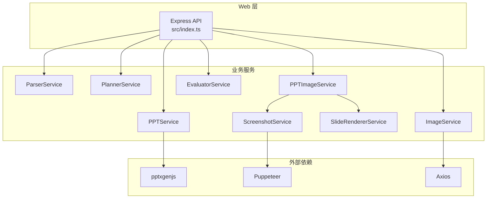
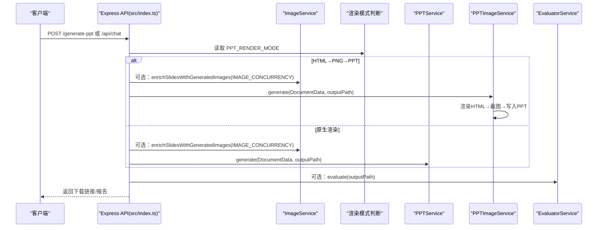
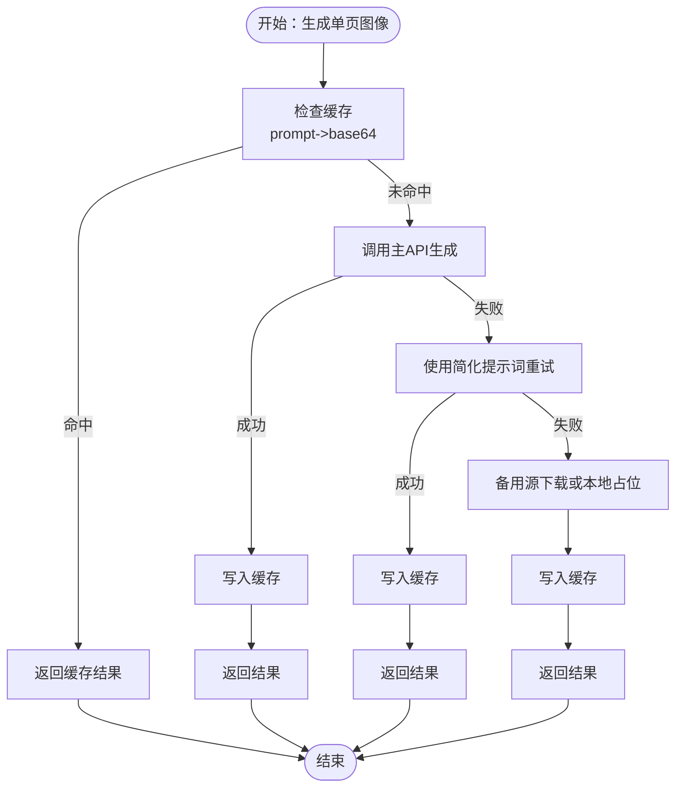
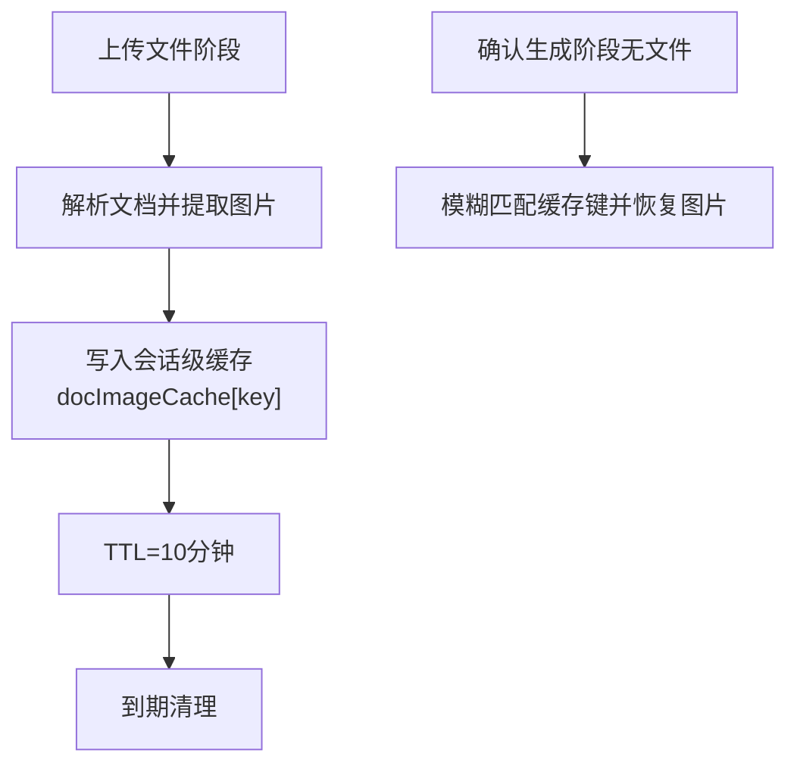
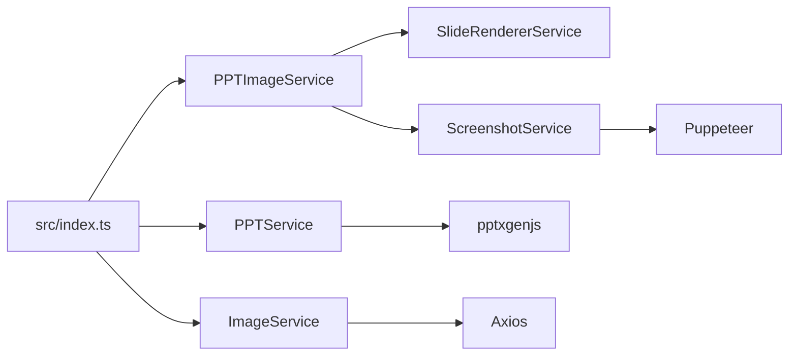

# 性能调优配置

<cite>
**本文档引用的文件**
- [package.json](file://package.json)
- [readme.md](file://readme.md)
- [src/index.ts](file://src/index.ts)
- [src/services/image.service.ts](file://src/services/image.service.ts)
- [src/services/ppt.service.ts](file://src/services/ppt.service.ts)
- [src/services/ppt-image.service.ts](file://src/services/ppt-image.service.ts)
- [src/services/screenshot.service.ts](file://src/services/screenshot.service.ts)
- [src/services/slide-renderer.service.ts](file://src/services/slide-renderer.service.ts)
- [src/services/evaluator.service.ts](file://src/services/evaluator.service.ts)
- [src/types.ts](file://src/types.ts)
- [test/batch_generate_score.ts](file://test/batch_generate_score.ts)
- [test/test-image-backfill.ts](file://test/test-image-backfill.ts)
- [test/test_image_api.ts](file://test/test_image_api.ts)
</cite>

## 目录
1. [简介](#简介)
2. [项目结构](#项目结构)
3. [核心组件](#核心组件)
4. [架构总览](#架构总览)
5. [详细组件分析](#详细组件分析)
6. [依赖关系分析](#依赖关系分析)
7. [性能考量](#性能考量)
8. [故障排查指南](#故障排查指南)
9. [结论](#结论)
10. [附录](#附录)

## 简介
本文件聚焦于 Generate-PPT 的性能调优配置，围绕以下关键主题展开：
- 影响系统性能的关键配置参数：图片生成并发度（IMAGE_CONCURRENCY）、渲染模式选择（PPT_RENDER_MODE）、AI 图像生成功能开关（ENABLE_AI_IMAGES）等
- 不同配置对系统资源消耗与生成速度的影响
- 针对不同硬件配置的推荐设置（CPU、内存、磁盘 I/O）
- 缓存策略配置（图片缓存 TTL、会话级缓存管理）
- 性能监控指标与分析方法
- 压力测试与基准测试配置指南

## 项目结构
Generate-PPT 采用模块化服务架构，主要由解析、规划、图像生成、渲染与评估等服务组成，并通过 Express 提供 Web API。

图表来源
- [src/index.ts:71-270](file://src/index.ts#L71-L270)
- [src/services/ppt-image.service.ts:14-52](file://src/services/ppt-image.service.ts#L14-L52)
- [src/services/screenshot.service.ts:9-76](file://src/services/screenshot.service.ts#L9-L76)
- [src/services/ppt.service.ts:52-75](file://src/services/ppt.service.ts#L52-L75)
- [src/services/image.service.ts:4-57](file://src/services/image.service.ts#L4-L57)

章节来源
- [package.json:18-31](file://package.json#L18-L31)
- [readme.md:104-131](file://readme.md#L104-L131)

## 核心组件
- 图像服务（ImageService）：负责 AI 图像生成与本地回退、缓存与并发控制
- 渲染服务（PPTImageService + SlideRendererService + ScreenshotService）：基于 HTML 渲染与截图生成 PPT
- 原生渲染服务（PPTService）：直接使用 pptxgenjs 生成 PPT
- 评估服务（EvaluatorService）：对生成的 PPT 进行质量评估与指标统计
- Web API（src/index.ts）：统一入口，加载环境变量并路由到相应服务

章节来源
- [src/services/image.service.ts:4-218](file://src/services/image.service.ts#L4-L218)
- [src/services/ppt-image.service.ts:14-52](file://src/services/ppt-image.service.ts#L14-L52)
- [src/services/slide-renderer.service.ts:7-546](file://src/services/slide-renderer.service.ts#L7-L546)
- [src/services/screenshot.service.ts:9-76](file://src/services/screenshot.service.ts#L9-L76)
- [src/services/ppt.service.ts:52-85](file://src/services/ppt.service.ts#L52-L85)
- [src/services/evaluator.service.ts:23-93](file://src/services/evaluator.service.ts#L23-L93)
- [src/index.ts:53-270](file://src/index.ts#L53-L270)

## 架构总览
系统支持两种渲染路径：
- 原生渲染（默认）：PPTService 直接生成 PPT
- HTML→PNG→PPT 渲染：PPTImageService 组合 SlideRendererService 与 ScreenshotService 生成高清截图后写入 PPT

图表来源
- [src/index.ts:236-255](file://src/index.ts#L236-L255)
- [src/index.ts:399-406](file://src/index.ts#L399-L406)
- [src/services/ppt-image.service.ts:18-51](file://src/services/ppt-image.service.ts#L18-L51)
- [src/services/ppt.service.ts:52-75](file://src/services/ppt.service.ts#L52-L75)

## 详细组件分析

### 图像生成与并发控制（ImageService）
- 并发控制：通过 runWithConcurrency 控制同时发起的图像生成任务数量，默认值来自环境变量 IMAGE_CONCURRENCY
- 缓存策略：基于 Map 的内存缓存，键为去空白提示词；命中则直接返回，避免重复请求
- 回退机制：主 API 失败时尝试简化提示词与备用源（picsum、dummyimage），最后降级为本地占位图
- 请求超时与响应格式：主 API 请求设置较长超时，支持多种响应字段形态并进行归一化

图表来源
- [src/services/image.service.ts:30-57](file://src/services/image.service.ts#L30-L57)
- [src/services/image.service.ts:199-216](file://src/services/image.service.ts#L199-L216)

章节来源
- [src/services/image.service.ts:15-28](file://src/services/image.service.ts#L15-L28)
- [src/services/image.service.ts:30-57](file://src/services/image.service.ts#L30-L57)
- [src/services/image.service.ts:199-216](file://src/services/image.service.ts#L199-L216)

### 渲染模式与切换（PPT_RENDER_MODE）
- 渲染模式判断：在 /api/chat 与 /generate-ppt 接口中读取 PPT_RENDER_MODE
- 模式选择：
  - html：启用 HTML→PNG→PPT 渲染路径（PPTImageService）
  - 默认：启用原生渲染路径（PPTService）
- 模式切换对性能影响：
  - HTML→PNG→PPT：CPU 占用更高，I/O 更频繁（磁盘写入截图），但可获得更高分辨率与更强视觉一致性
  - 原生渲染：CPU 占用相对较低，I/O 主要为最终 PPT 写出

章节来源
- [src/index.ts:236-255](file://src/index.ts#L236-L255)
- [src/index.ts:399-406](file://src/index.ts#L399-L406)

### AI 图像生成功能开关（ENABLE_AI_IMAGES）
- 开关逻辑：当 ENABLE_AI_IMAGES 不等于 "false" 时启用图像生成
- 生效范围：/api/chat 与 /generate-ppt 两条路径均受此开关控制
- 并发度：与 IMAGE_CONCURRENCY 配合，控制同时发起的图像生成请求数量

章节来源
- [src/index.ts:240-254](file://src/index.ts#L240-L254)
- [src/index.ts:380-385](file://src/index.ts#L380-L385)

### 图片生成并发度（IMAGE_CONCURRENCY）
- 默认值：未显式设置时使用 2
- 作用域：影响 ImageService 在 enrichSlidesWithGeneratedImages 中的并发任务数
- 影响：并发度越高，吞吐越快，但 CPU 与网络带宽占用越大；过高可能导致外部 API 限流或本地资源紧张

章节来源
- [src/index.ts:241](file://src/index.ts#L241)
- [src/index.ts:381](file://src/index.ts#L381)
- [test/batch_generate_score.ts:331](file://test/batch_generate_score.ts#L331)

### 会话级图片缓存（docImageCache）
- 缓存结构：以文档标题为键，存储每个幻灯片的图片映射与有序列表
- TTL：10 分钟，到期自动清理
- 用途：在 /api/chat 的“确认生成”阶段，若未再次上传文件，可从缓存恢复原始图片，减少重复解析与网络请求

图表来源
- [src/index.ts:53-69](file://src/index.ts#L53-L69)
- [src/index.ts:155-185](file://src/index.ts#L155-L185)

章节来源
- [src/index.ts:53-69](file://src/index.ts#L53-L69)
- [src/index.ts:155-185](file://src/index.ts#L155-L185)

### 原生渲染配置（PPTService）
- 配置项：
  - PPT_TEMPLATE_STYLE：是否启用模板样式
  - PPT_IMAGE_ONLY_MODE：仅图片模式
  - PPT_KEEP_TEXT：保留文本
  - PPT_MAX_BULLETS_PER_SLIDE：每页最大要点数
  - PPT_SHOW_SOURCE_REFS：显示来源引用
- 影响：决定 PPT 内容密度、视觉风格与生成复杂度

章节来源
- [src/services/ppt.service.ts:77-85](file://src/services/ppt.service.ts#L77-L85)

### HTML→PNG→PPT 渲染链路（PPTImageService + SlideRendererService + ScreenshotService）
- 渲染分辨率：1920×1080 视口 + 2x deviceScaleFactor，输出 3840×2160 高清 PNG
- 截图策略：逐页 setContent 后截图，随后读取为 base64 供 PPTX 写入
- 资源消耗：高 CPU、高内存、高磁盘 I/O（临时截图文件）

章节来源
- [src/services/ppt-image.service.ts:18-51](file://src/services/ppt-image.service.ts#L18-L51)
- [src/services/slide-renderer.service.ts:14-46](file://src/services/slide-renderer.service.ts#L14-L46)
- [src/services/screenshot.service.ts:15-52](file://src/services/screenshot.service.ts#L15-L52)

### 质量评估与指标（EvaluatorService）
- 评估维度：逻辑、布局、图像语义、内容丰富度、受众适配、一致性、源理解
- 指标：覆盖度、唯一图像数、混合语言、指令性文本等
- 报告：生成 JSON 与 Markdown 报告，便于性能对比与回归分析

章节来源
- [src/services/evaluator.service.ts:23-93](file://src/services/evaluator.service.ts#L23-L93)
- [src/services/evaluator.service.ts:110-175](file://src/services/evaluator.service.ts#L110-L175)

## 依赖关系分析
- 外部依赖：pptxgenjs（原生渲染）、Puppeteer（HTML 截图）、Axios（图像 API 调用）
- 模块耦合：Web API 对各服务存在直接依赖；HTML 渲染链路内部耦合度较高（渲染→截图→写入）

图表来源
- [src/index.ts:45-51](file://src/index.ts#L45-L51)
- [src/services/ppt-image.service.ts:14-16](file://src/services/ppt-image.service.ts#L14-L16)
- [src/services/screenshot.service.ts:1-4](file://src/services/screenshot.service.ts#L1-L4)
- [src/services/ppt.service.ts:1](file://src/services/ppt.service.ts#L1)
- [src/services/image.service.ts:1](file://src/services/image.service.ts#L1)

章节来源
- [package.json:18-31](file://package.json#L18-L31)

## 性能考量

### 关键配置参数与影响
- IMAGE_CONCURRENCY
  - 增大：提升吞吐，缩短队列等待时间；增大 CPU 与网络负载，可能触发外部 API 限流
  - 减小：降低资源占用，但生成时间延长
- PPT_RENDER_MODE
  - html：CPU/内存/I/O 峰值更高，适合高质量输出；默认路径通常更快
  - 默认：CPU 占用更低，I/O 主要为最终写出
- ENABLE_AI_IMAGES
  - true：启用图像生成，增加网络与缓存开销；false：跳过图像生成，整体吞吐提升
- PPT_SERVICE 渲染配置
  - PPT_MAX_BULLETS_PER_SLIDE：数值越大，渲染计算越复杂
  - PPT_TEMPLATE_STYLE/PPT_KEEP_TEXT：模板样式与文本保留会增加绘制复杂度

章节来源
- [src/index.ts:240-254](file://src/index.ts#L240-L254)
- [src/index.ts:380-385](file://src/index.ts#L380-L385)
- [src/services/ppt.service.ts:77-85](file://src/services/ppt.service.ts#L77-L85)

### 硬件配置推荐
- CPU
  - 高并发场景（IMAGE_CONCURRENCY 较高）：优先多核 CPU，避免单核瓶颈
  - HTML 渲染路径：建议至少 4 核以上，以应对 Puppeteer 的高 CPU 占用
- 内存
  - HTML 渲染路径：需要容纳高分辨率截图与浏览器实例，建议 8GB+；高并发时 16GB+
  - 原生渲染路径：内存占用相对较低，4GB+ 可满足一般需求
- 磁盘 I/O
  - HTML 渲染路径：大量临时截图写入，建议使用 SSD；注意清理 output/.slide-screenshots
  - 原生渲染路径：I/O 主要为最终 PPT 写出，SSD 同样有利

### 缓存策略
- 图像生成缓存（ImageService）
  - 作用：避免重复请求相同提示词，显著降低外部 API 调用次数
  - 建议：保持默认缓存策略；如需持久化可扩展为文件或 Redis 缓存
- 会话级图片缓存（docImageCache）
  - TTL：10 分钟，自动清理
  - 建议：在长对话或多轮生成场景下，合理利用缓存键匹配，减少重复解析

章节来源
- [src/services/image.service.ts:30-57](file://src/services/image.service.ts#L30-L57)
- [src/index.ts:53-69](file://src/index.ts#L53-L69)

### 性能监控指标
- 生成耗时：记录从请求进入至文件写出的总时长（可参考批处理脚本中的 durationMs）
- 图像生成耗时：单独统计图像生成阶段耗时
- 质量评分与维度得分：通过 EvaluatorService 输出，便于对比不同配置下的质量与性能权衡
- 资源指标：CPU 使用率、内存占用、磁盘 I/O、网络请求次数与错误率

章节来源
- [test/batch_generate_score.ts:375](file://test/batch_generate_score.ts#L375)
- [src/services/evaluator.service.ts:32-93](file://src/services/evaluator.service.ts#L32-L93)

## 故障排查指南
- 图像生成失败
  - 检查 IMAGE_API_KEY 是否正确配置
  - 观察主 API 调用是否超时或返回空数据
  - 回退机制会尝试简化提示词与备用源，确认日志输出
- HTML 渲染卡顿或崩溃
  - 检查 Puppeteer 启动参数与系统资源
  - 确认临时截图目录可写且空间充足
- 会话级缓存失效
  - 确认缓存键是否与对话内容匹配
  - 检查 TTL 是否导致过早清理

章节来源
- [test/test_image_api.ts:12-16](file://test/test_image_api.ts#L12-L16)
- [src/services/image.service.ts:59-101](file://src/services/image.service.ts#L59-L101)
- [src/services/screenshot.service.ts:54-68](file://src/services/screenshot.service.ts#L54-L68)
- [src/index.ts:169-185](file://src/index.ts#L169-L185)

## 结论
- IMAGE_CONCURRENCY 与 ENABLE_AI_IMAGES 是影响吞吐与资源占用的核心参数
- PPT_RENDER_MODE 决定了 CPU/内存/I/O 的分布与峰值
- 合理利用缓存（图像生成缓存与会话级缓存）可显著降低外部依赖与重复工作
- 建议以批处理脚本与质量评估报告为依据，逐步调整参数并对比指标，找到目标硬件上的最优组合

## 附录

### 环境变量与默认值速览
- IMAGE_API_KEY：图像 API 密钥
- IMAGE_API_BASE_URL：图像 API 基础地址
- PORT：服务端口
- ENABLE_AI_IMAGES：是否启用 AI 图像生成（默认启用）
- IMAGE_CONCURRENCY：图像生成并发度（默认 2）
- IMAGE_MODEL：图像模型名称
- IMAGE_RESOLUTION：图像分辨率
- PPT_RENDER_MODE：渲染模式（默认原生渲染，设为 "html" 使用 HTML→PNG→PPT）
- PPT_TEMPLATE_STYLE：模板样式（默认启用）
- PPT_KEEP_TEXT：保留文本（默认启用）
- PPT_IMAGE_ONLY_MODE：仅图片模式（默认关闭）
- PPT_MAX_BULLETS_PER_SLIDE：每页最大要点数（默认 5）
- ENABLE_EVALUATION：是否启用质量评估（默认启用）

章节来源
- [readme.md:21-50](file://readme.md#L21-L50)

### 压力测试与基准测试配置指南
- 批处理脚本（test/batch_generate_score.ts）
  - 输入：支持 .md/.docx/.pdf 的批量输入目录
  - 输出：每个文件的 PPTX、质量报告与汇总统计
  - 关键参数：--with-images、--planner-mode、--deck-format、--audience、--focus、--style、--length
  - 并发度：通过 IMAGE_CONCURRENCY 控制图像生成并发
- 回填测试（test/test-image-backfill.ts）
  - 验证上传文档中的图片在生成 PPTX 中的回填情况
- 图像 API 测试（test/test_image_api.ts）
  - 快速验证图像生成接口可用性与耗时

章节来源
- [test/batch_generate_score.ts:329-331](file://test/batch_generate_score.ts#L329-L331)
- [test/batch_generate_score.ts:357-359](file://test/batch_generate_score.ts#L357-L359)
- [test/test-image-backfill.ts:53-179](file://test/test-image-backfill.ts#L53-L179)
- [test/test_image_api.ts:8-44](file://test/test_image_api.ts#L8-L44)