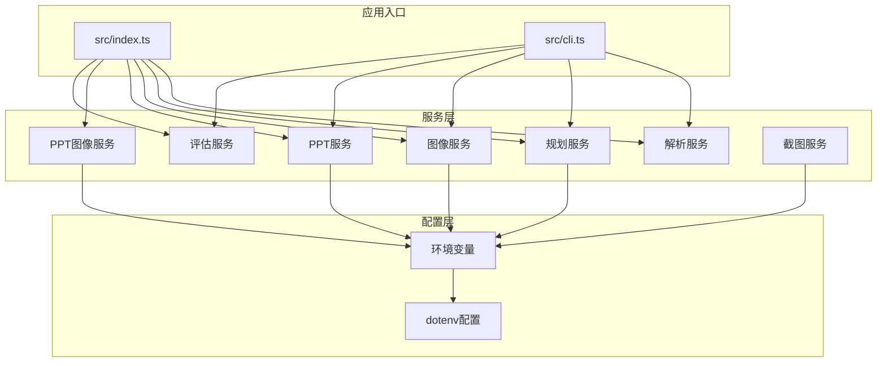
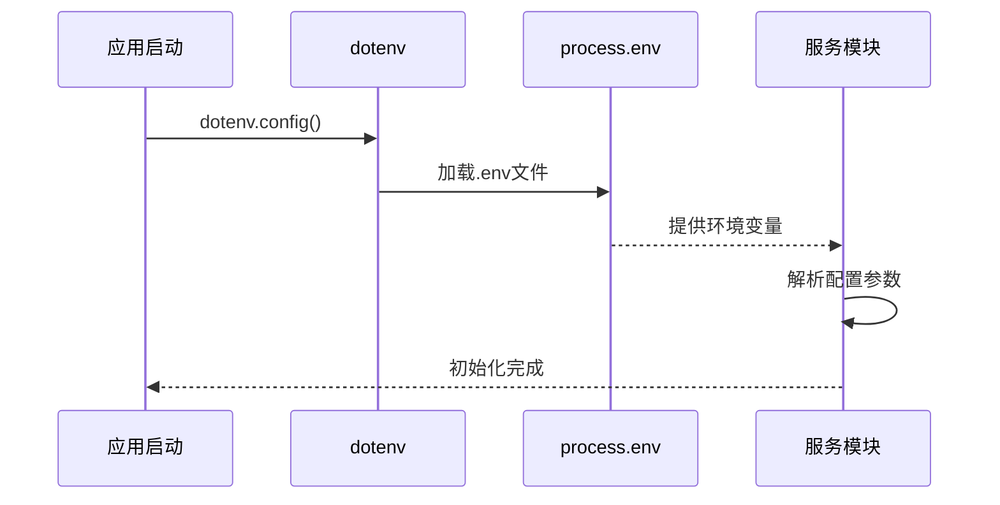
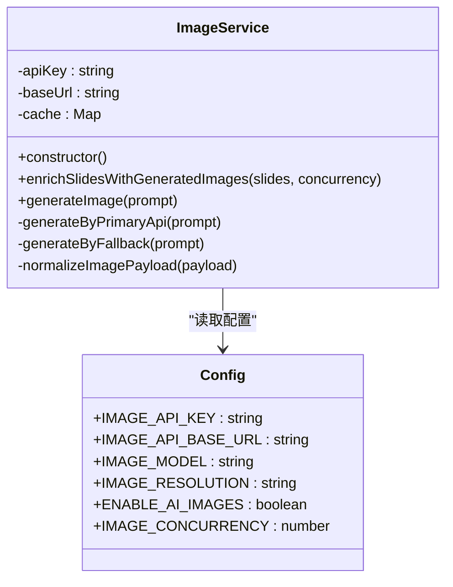
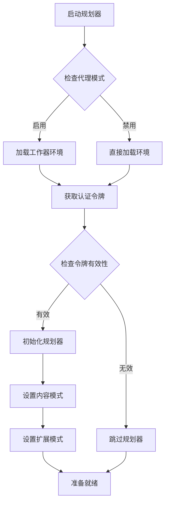
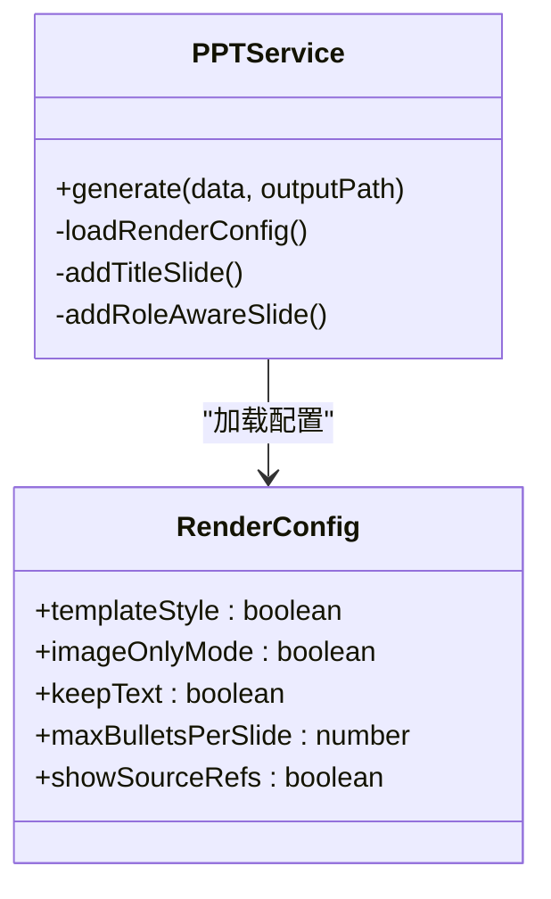
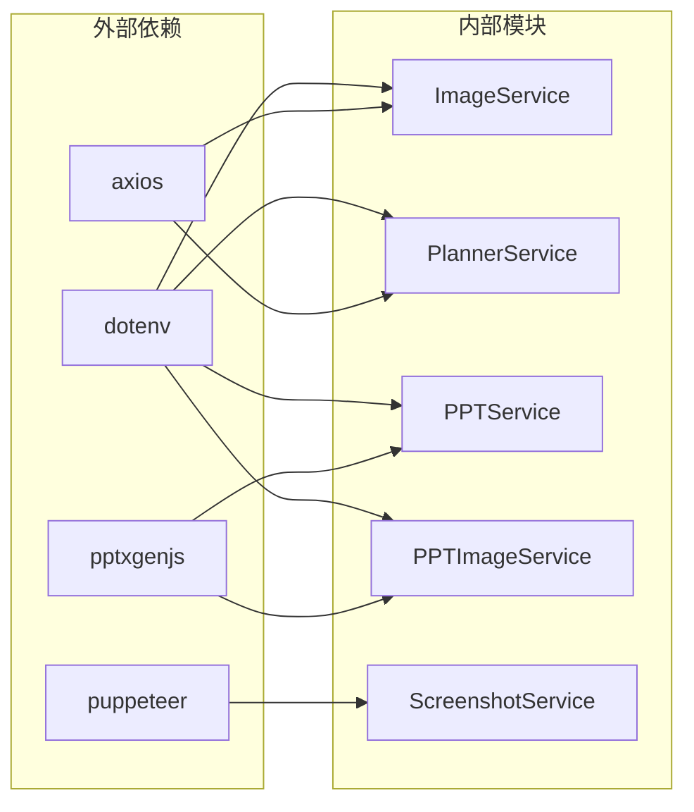
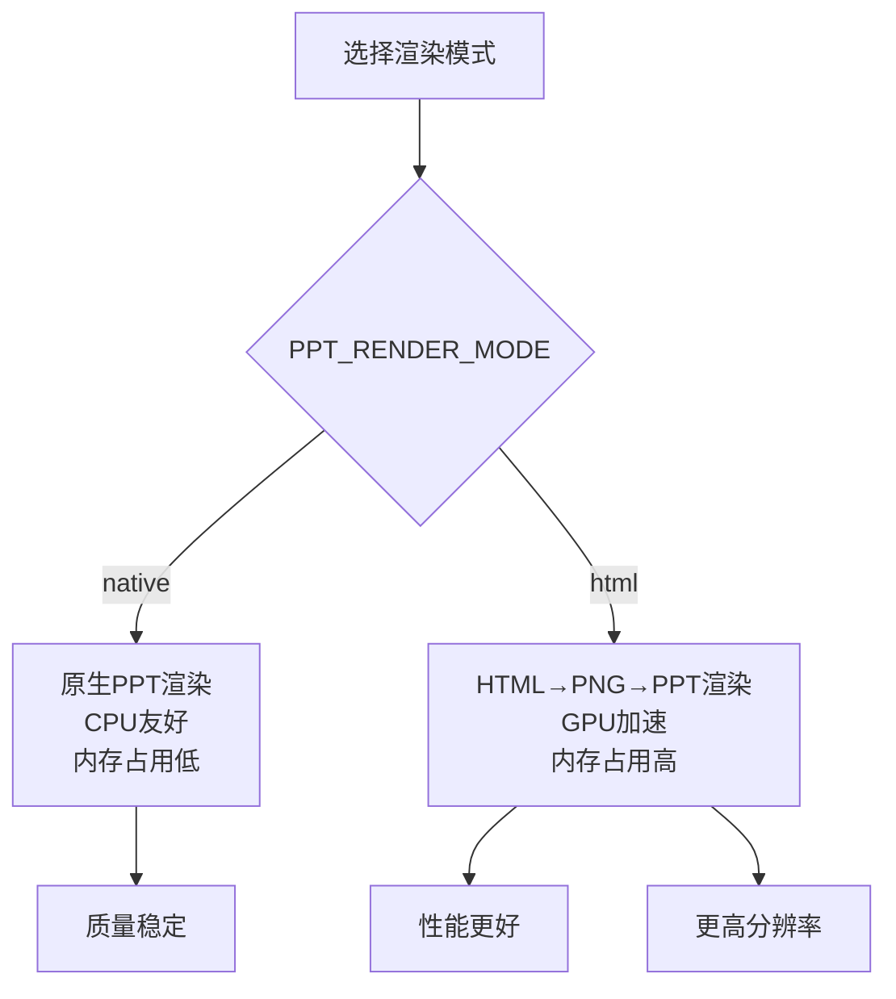
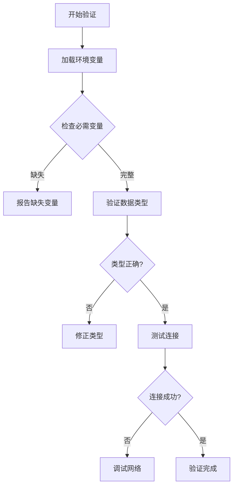

# 环境变量配置

<cite>
**本文档引用的文件**
- [package.json](file://package.json)
- [readme.md](file://readme.md)
- [src/index.ts](file://src/index.ts)
- [src/cli.ts](file://src/cli.ts)
- [src/services/image.service.ts](file://src/services/image.service.ts)
- [src/services/planner.service.ts](file://src/services/planner.service.ts)
- [src/services/ppt.service.ts](file://src/services/ppt.service.ts)
- [src/services/ppt-image.service.ts](file://src/services/ppt-image.service.ts)
- [src/services/screenshot.service.ts](file://src/services/screenshot.service.ts)
</cite>

## 目录
1. [简介](#简介)
2. [项目结构](#项目结构)
3. [核心组件](#核心组件)
4. [架构概览](#架构概览)
5. [详细组件分析](#详细组件分析)
6. [依赖分析](#依赖分析)
7. [性能考虑](#性能考虑)
8. [故障排除指南](#故障排除指南)
9. [结论](#结论)
10. [附录](#附录)

## 简介

本文件详细说明 Generate-PPT 项目的环境变量配置，涵盖所有可用的环境变量及其作用、数据类型、默认值和取值范围。文档还提供了不同部署场景下的配置示例、优先级和覆盖机制说明，以及配置验证方法和常见错误排查指南。

## 项目结构

Generate-PPT 是一个基于 Node.js 的 PPT 自动生成工具，支持通过 Web API 和 CLI 两种方式运行。项目采用模块化设计，核心功能分布在多个服务模块中：



**图表来源**
- [src/index.ts:1-50](file://src/index.ts#L1-L50)
- [src/cli.ts:1-30](file://src/cli.ts#L1-L30)

**章节来源**
- [package.json:1-45](file://package.json#L1-L45)
- [src/index.ts:1-50](file://src/index.ts#L1-L50)

## 核心组件

### 环境变量总览

根据代码分析，Generate-PPT 支持以下环境变量配置：

| 变量名称 | 类型 | 默认值 | 取值范围 | 作用描述 |
|---------|------|--------|----------|----------|
| PORT | 数字 | 3000 | 1-65535 | 服务器监听端口 |
| PPT_RENDER_MODE | 字符串 | native | native/html | PPT 渲染模式选择 |
| ENABLE_AI_IMAGES | 布尔 | true | true/false | 是否启用AI图像生成功能 |
| IMAGE_CONCURRENCY | 数字 | 2 | 1-∞ | 图像生成并发数 |
| ENABLE_EVALUATION | 布尔 | true | true/false | 是否启用质量评估功能 |
| PPT_TEMPLATE_STYLE | 布尔 | true | true/false | 是否使用模板样式 |
| PPT_KEEP_TEXT | 布尔 | true | true/false | 是否保留文本内容 |
| PPT_IMAGE_ONLY_MODE | 布尔 | false | true/false | 图像仅模式 |
| PPT_MAX_BULLETS_PER_SLIDE | 数字 | 5 | ≥3 | 每页最大要点数 |
| PPT_SHOW_SOURCE_REFS | 布尔 | true | true/false | 是否显示源引用 |

### AI 服务相关配置

| 变量名称 | 类型 | 默认值 | 取值范围 | 作用描述 |
|---------|------|--------|----------|----------|
| IMAGE_API_KEY | 字符串 | 无 | 任意字符串 | 图像API密钥 |
| IMAGE_API_BASE_URL | 字符串 | https://www.aigenimage.cn | 有效URL | 图像API基础地址 |
| IMAGE_MODEL | 字符串 | gemini-3.1-flash-image-preview | 任意字符串 | 图像模型名称 |
| IMAGE_RESOLUTION | 字符串 | 2K | 任意字符串 | 图像分辨率设置 |

### 规划器配置

| 变量名称 | 类型 | 默认值 | 取值范围 | 作用描述 |
|---------|------|--------|----------|----------|
| ENABLE_PLANNER | 布尔 | true | true/false | 是否启用规划器 |
| PLANNER_MODEL | 字符串 | gemini-3.1-pro-preview | 任意字符串 | 规划器模型名称 |
| PLANNER_API_BASE_URL | 字符串 | https://www.aigenimage.cn:3001 | 有效URL | 规划器API基础地址 |
| PLANNER_AUTH_TOKEN | 字符串 | 空 | 任意字符串 | 规划器认证令牌 |
| LLM_AUTH_TOKEN | 字符串 | 空 | 任意字符串 | LLM认证令牌 |
| PLANNER_USE_WORKER_PROXY | 布尔 | false | true/false | 是否使用工作器代理 |
| CLOUDFLARE_WORKER_URL | 字符串 | 空 | 有效URL | Cloudflare工作器URL |
| LLM_API_KEY | 字符串 | 空 | 任意字符串 | LLM API密钥 |
| GOOGLE_API_KEY | 字符串 | 空 | 任意字符串 | Google API密钥 |
| AIWORKFLOW_BACKEND_ENV_PATH | 字符串 | 空 | 任意路径 | AIWorkflow后端环境路径 |
| PLANNER_CONTENT_MODE | 字符串 | strict | strict/creative | 规划器内容模式 |
| PLANNER_EXPAND_SPARSE_CONTENT | 布尔 | true | true/false | 是否扩展稀疏内容 |
| PLANNER_USE_GUEST_LOGIN | 布尔 | false | true/false | 是否允许访客登录 |

**章节来源**
- [src/index.ts:236-255](file://src/index.ts#L236-L255)
- [src/index.ts:380-406](file://src/index.ts#L380-L406)
- [src/cli.ts:136-140](file://src/cli.ts#L136-L140)
- [src/services/image.service.ts:9-13](file://src/services/image.service.ts#L9-L13)
- [src/services/planner.service.ts:67-81](file://src/services/planner.service.ts#L67-L81)
- [src/services/ppt.service.ts:77-84](file://src/services/ppt.service.ts#L77-L84)

## 架构概览

```mermaid
graph TB
subgraph "环境变量加载"
Dotenv[dotenv.config()]
EnvLoader[环境变量解析]
end
subgraph "核心服务"
ImageService[ImageService]
PlannerService[PlannerService]
PPTService[PPTService]
PPTImageService[PPTImageService]
EvaluatorService[EvaluatorService]
end
subgraph "渲染管道"
NativeRender[原生渲染]
HTMLRender[HTML渲染]
Screenshot[截图服务]
end
Dotenv --> EnvLoader
EnvLoader --> ImageService
EnvLoader --> PlannerService
EnvLoader --> PPTService
EnvLoader --> PPTImageService
EnvLoader --> EvaluatorService
PPTImageService --> HTMLRender
HTMLRender --> Screenshot
Screenshot --> NativeRender
PPTService --> NativeRender
```

**图表来源**
- [src/index.ts:19-23](file://src/index.ts#L19-L23)
- [src/services/image.service.ts:9-13](file://src/services/image.service.ts#L9-L13)
- [src/services/planner.service.ts:67-81](file://src/services/planner.service.ts#L67-L81)
- [src/services/ppt-image.service.ts:18-21](file://src/services/ppt-image.service.ts#L18-L21)

## 详细组件分析

### 环境变量加载机制

系统通过 dotenv 库在应用启动时加载环境变量：



**图表来源**
- [src/index.ts:19-23](file://src/index.ts#L19-L23)
- [src/cli.ts:12-12](file://src/cli.ts#L12-L12)

### 图像服务配置

图像服务负责处理AI图像生成，支持多种配置选项：



**图表来源**
- [src/services/image.service.ts:4-28](file://src/services/image.service.ts#L4-L28)
- [src/services/image.service.ts:9-13](file://src/services/image.service.ts#L9-L13)

### 规划器服务配置

规划器服务支持复杂的工作器代理模式：



**图表来源**
- [src/services/planner.service.ts:67-81](file://src/services/planner.service.ts#L67-L81)
- [src/services/planner.service.ts:109-114](file://src/services/planner.service.ts#L109-L114)

### PPT渲染配置

PPT服务支持多种渲染模式和样式配置：



**图表来源**
- [src/services/ppt.service.ts:52-85](file://src/services/ppt.service.ts#L52-L85)

**章节来源**
- [src/services/image.service.ts:9-13](file://src/services/image.service.ts#L9-L13)
- [src/services/planner.service.ts:67-81](file://src/services/planner.service.ts#L67-L81)
- [src/services/ppt.service.ts:77-84](file://src/services/ppt.service.ts#L77-L84)

## 依赖分析



**图表来源**
- [package.json:18-31](file://package.json#L18-L31)
- [src/services/image.service.ts:1-2](file://src/services/image.service.ts#L1-L2)
- [src/services/screenshot.service.ts:1-1](file://src/services/screenshot.service.ts#L1-L1)

**章节来源**
- [package.json:18-31](file://package.json#L18-L31)

## 性能考虑

### 并发控制

图像生成支持并发控制，建议根据系统资源合理配置：

- **默认并发数**: 2
- **推荐范围**: 1-8（根据CPU核心数调整）
- **内存影响**: 每个并发实例约占用 100MB 内存

### 渲染模式选择



**图表来源**
- [src/index.ts:236-255](file://src/index.ts#L236-L255)

## 故障排除指南

### 常见配置错误

1. **API密钥无效**
   - 检查 `IMAGE_API_KEY` 和 `PLANNER_AUTH_TOKEN`
   - 确认密钥格式正确且未过期

2. **网络连接问题**
   - 验证 `IMAGE_API_BASE_URL` 和 `PLANNER_API_BASE_URL`
   - 检查防火墙和代理设置

3. **渲染失败**
   - 检查 `PPT_RENDER_MODE` 设置
   - 确认 Puppeteer 依赖已正确安装

### 配置验证方法



**图表来源**
- [src/services/image.service.ts:59-102](file://src/services/image.service.ts#L59-L102)
- [src/services/planner.service.ts:129-142](file://src/services/planner.service.ts#L129-L142)

**章节来源**
- [src/services/image.service.ts:59-102](file://src/services/image.service.ts#L59-L102)
- [src/services/planner.service.ts:129-142](file://src/services/planner.service.ts#L129-L142)

## 结论

Generate-PPT 提供了全面的环境变量配置支持，涵盖了从基础服务配置到高级渲染选项的各个方面。通过合理的环境变量配置，用户可以在不同部署环境中获得最佳的性能和功能体验。

## 附录

### 开发环境配置示例

```env
# 基础配置
PORT=3000

# AI服务配置
IMAGE_API_KEY=your_image_api_key
IMAGE_API_BASE_URL=https://api.example.com
ENABLE_AI_IMAGES=true
IMAGE_CONCURRENCY=2

# 规划器配置
ENABLE_PLANNER=true
PLANNER_MODEL=gemini-3.1-pro-preview
PLANNER_API_BASE_URL=https://planner.example.com
PLANNER_AUTH_TOKEN=your_planner_token

# PPT渲染配置
PPT_TEMPLATE_STYLE=true
PPT_KEEP_TEXT=true
PPT_IMAGE_ONLY_MODE=false
PPT_MAX_BULLETS_PER_SLIDE=5
PPT_RENDER_MODE=native

# 质量评估
ENABLE_EVALUATION=true
```

### 生产环境配置示例

```env
# 安全配置
PORT=8080
NODE_ENV=production

# 扩展并发
IMAGE_CONCURRENCY=4
PPT_MAX_BULLETS_PER_SLIDE=6

# 渲染优化
PPT_RENDER_MODE=html
PPT_TEMPLATE_STYLE=true
PPT_KEEP_TEXT=true

# 监控和日志
DEBUG=false
LOG_LEVEL=info
```

### 测试环境配置示例

```env
# 测试专用
PORT=3001
NODE_ENV=test

# 降低并发以节省资源
IMAGE_CONCURRENCY=1
PPT_MAX_BULLETS_PER_SLIDE=3

# 禁用质量评估
ENABLE_EVALUATION=false
ENABLE_AI_IMAGES=false
```