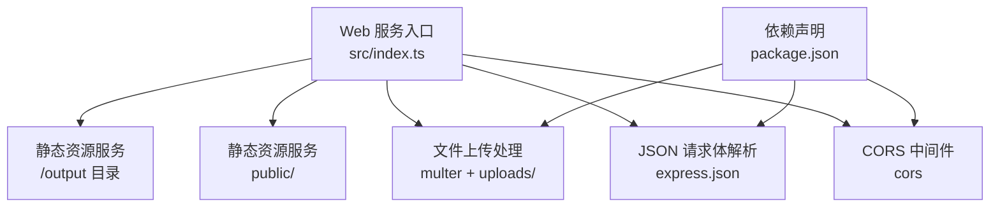
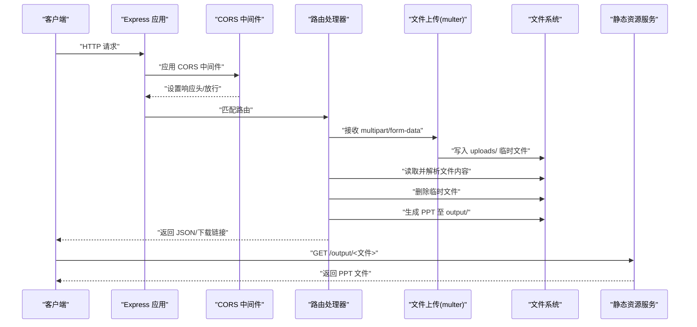
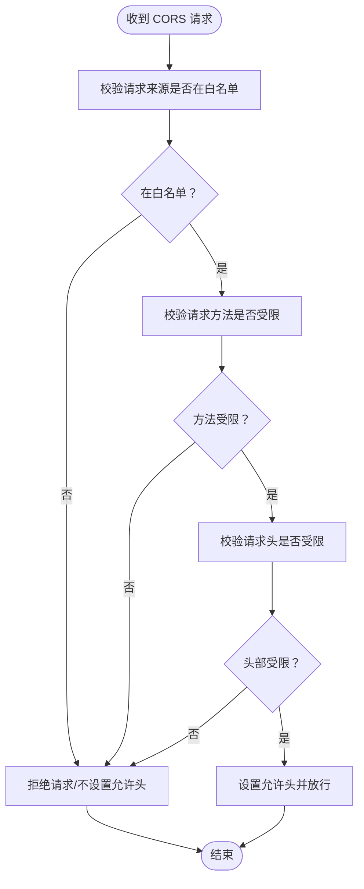
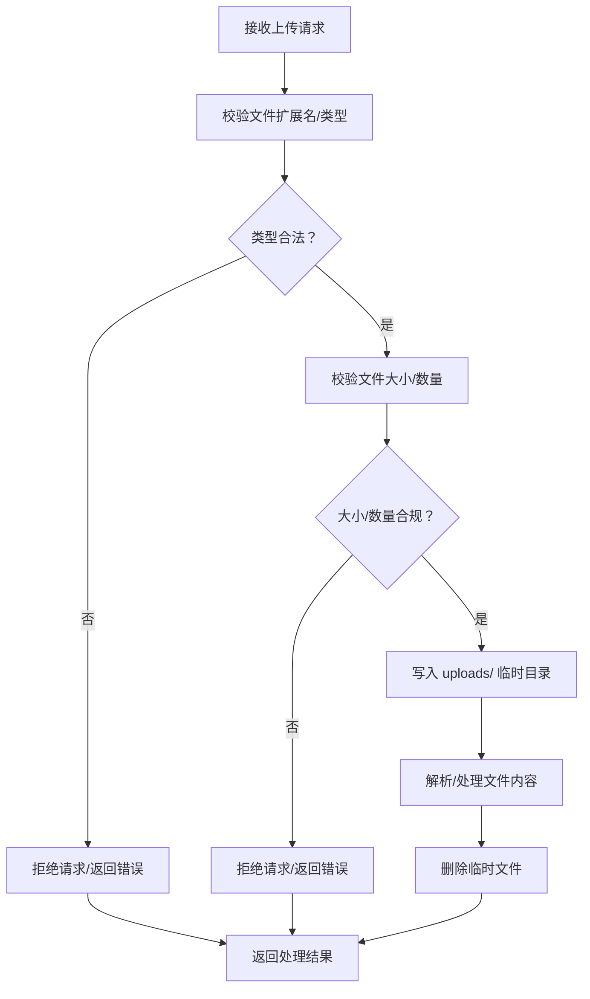
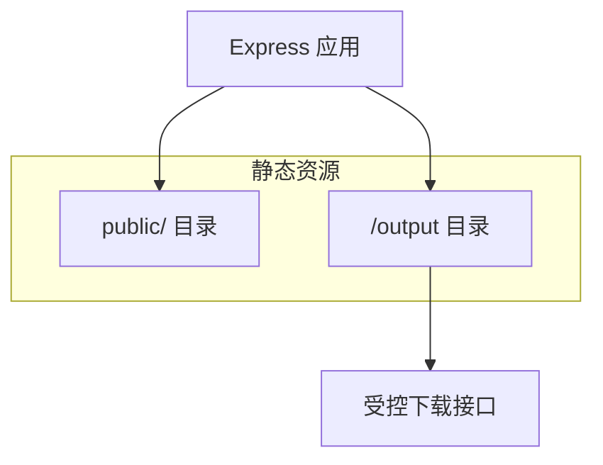
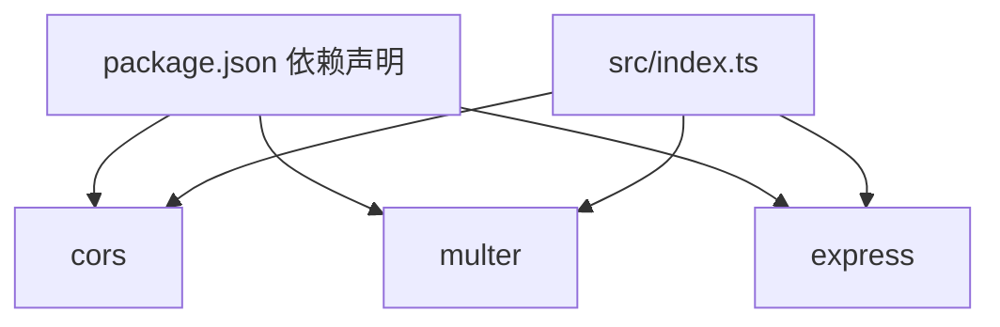

# 安全配置

<cite>
**本文引用的文件**
- [package.json](file://package.json)
- [src/index.ts](file://src/index.ts)
- [src/services/parser.service.ts](file://src/services/parser.service.ts)
- [readme.md](file://readme.md)
- [ARCHITECTURE.md](file://ARCHITECTURE.md)
</cite>

## 目录
1. [简介](#简介)
2. [项目结构](#项目结构)
3. [核心组件](#核心组件)
4. [架构总览](#架构总览)
5. [详细组件分析](#详细组件分析)
6. [依赖关系分析](#依赖关系分析)
7. [性能考量](#性能考量)
8. [故障排查指南](#故障排查指南)
9. [结论](#结论)
10. [附录](#附录)

## 简介
本文件聚焦于 Generate-PPT 的安全配置，围绕 CORS（跨域资源共享）、文件上传安全限制、静态文件服务访问控制、生产环境安全最佳实践（HTTPS、请求头校验、路径遍历防护）、防火墙与安全审计日志等方面进行系统化说明。通过对代码与配置的深入分析，帮助开发者在保障功能完整性的同时，构建安全、可控、可审计的服务。

## 项目结构
- Web 服务入口位于 src/index.ts，负责初始化 Express、挂载中间件、路由注册与静态资源服务。
- 上传文件临时目录 uploads 与生成产物输出目录 output 均通过 express.static 暴露，需谨慎配置访问范围与权限。
- 依赖包 package.json 中包含 cors、express、multer 等与安全相关的关键模块。

**图示来源**
- [src/index.ts:21-27](file://src/index.ts#L21-L27)
- [package.json:18-31](file://package.json#L18-L31)

**章节来源**
- [src/index.ts:21-27](file://src/index.ts#L21-L27)
- [package.json:18-31](file://package.json#L18-L31)
- [ARCHITECTURE.md:44-62](file://ARCHITECTURE.md#L44-L62)

## 核心组件
- CORS 中间件：当前以默认配置启用，表示接受来自任意源的跨域请求。
- 文件上传：使用 multer 将文件写入本地 uploads 目录，并在解析完成后立即删除临时文件。
- 静态文件服务：公开 public/ 与 /output 目录，前者用于前端调试页面，后者用于下载生成的 PPT。
- 环境变量：通过 dotenv 加载，包含与安全相关的令牌与渲染参数。

**章节来源**
- [src/index.ts:24-27](file://src/index.ts#L24-L27)
- [src/index.ts:29-43](file://src/index.ts#L29-L43)
- [src/index.ts:26,27:26-27](file://src/index.ts#L26-L27)
- [readme.md:17-50](file://readme.md#L17-L50)

## 架构总览
下图展示了与安全相关的关键交互：客户端请求经由 CORS 中间件放行，进入路由处理器；上传文件写入 uploads 并在解析后清理；生成的 PPT 写入 output 目录并通过静态服务对外提供下载。

**图示来源**
- [src/index.ts:24-27](file://src/index.ts#L24-L27)
- [src/index.ts:29-43](file://src/index.ts#L29-L43)
- [src/index.ts:110-132](file://src/index.ts#L110-L132)
- [src/index.ts:388-422](file://src/index.ts#L388-L422)

## 详细组件分析

### CORS（跨域资源共享）安全配置
- 当前实现：在应用启动时直接调用 app.use(cors())，未传入自定义配置，表示使用默认策略。
- 安全影响：默认策略通常允许来自任意源的请求，未限制来源、方法与头部，存在跨站请求伪造与敏感数据泄露风险。
- 建议策略：
  - 明确允许的源（Origin）白名单，避免通配符。
  - 限定允许的方法（如 GET、POST、OPTIONS）与必要的头部（如 Content-Type、Authorization）。
  - 对预检请求（OPTIONS）进行最小必要放行。
  - 生产环境务必禁用通配符，确保仅放行受信域名。

**章节来源**
- [src/index.ts:24](file://src/index.ts#L24)
- [package.json:20](file://package.json#L20)

### 文件上传安全限制
- 上传介质：multer 将文件写入本地 uploads 目录，文件名包含时间戳与原始名称，避免冲突。
- 文件清理：解析完成后立即删除临时文件，降低磁盘占用与敏感数据残留风险。
- 类型与大小限制：当前代码未显式设置文件类型白名单与大小上限，存在误传或滥用风险。
- 建议措施：
  - 限制文件类型白名单（如 .md、.docx、.pdf、.png、.jpg、.jpeg）。
  - 设置单文件大小上限与总文件数量上限。
  - 对文件内容进行二次校验（如魔数校验、MIME 推断）。
  - 上传目录与生成目录分离，限制写权限，仅允许服务进程写入。

**章节来源**
- [src/index.ts:29-43](file://src/index.ts#L29-L43)
- [src/index.ts:105-132](file://src/index.ts#L105-L132)
- [src/index.ts:314-335](file://src/index.ts#L314-L335)

### 静态文件服务安全配置
- 暴露目录：
  - public/：用于前端调试页面，建议仅包含静态资源。
  - /output：用于下载生成的 PPT 与质量报告，需严格控制访问范围。
- 访问控制建议：
  - 将 /output 作为受控路由，仅允许下载已生成的文件，禁止目录浏览。
  - 限制输出文件名生成策略，避免路径穿越与越权访问。
  - 对下载接口增加鉴权与速率限制，防止滥用。
  - 生产环境建议将输出目录置于非 Web 根目录，通过反向代理或专用下载服务暴露。

**章节来源**
- [src/index.ts:26,27:26-27](file://src/index.ts#L26-L27)
- [ARCHITECTURE.md:57-60](file://ARCHITECTURE.md#L57-L60)

### 生产环境安全最佳实践
- HTTPS 配置：
  - 使用反向代理（如 Nginx、Traefik）终止 TLS，将明文 HTTP 交给后端。
  - 强制 HSTS、安全 Cookie 属性（Secure、SameSite）与 CSP。
- 请求头验证：
  - 校验 Content-Type、Accept、User-Agent 等关键头部。
  - 对 Authorization 头进行严格解析与令牌校验。
- 路径遍历防护：
  - 对文件名与路径进行规范化与白名单校验，拒绝包含 “../” 的请求。
  - 生成文件名使用安全随机或哈希，避免用户可控输入直接影响文件系统路径。
- 防火墙与限流：
  - 使用 WAF/IPS 与 Web 应用防火墙（如 Cloudflare、AWS WAF）拦截异常流量。
  - 对上传与下载接口实施速率限制与 IP 黑名单。
- 安全审计日志：
  - 记录关键操作（上传、生成、下载）、异常事件与访问来源。
  - 日志脱敏，避免记录敏感头与令牌。

**章节来源**
- [readme.md:17-50](file://readme.md#L17-L50)
- [src/index.ts:24-27](file://src/index.ts#L24-L27)

## 依赖关系分析
- CORS 依赖：cors（MIT）
- 文件上传：multer（MIT）
- Web 框架：express（MIT）

**图示来源**
- [package.json:18-31](file://package.json#L18-L31)
- [src/index.ts:2-7](file://src/index.ts#L2-L7)

**章节来源**
- [package.json:18-31](file://package.json#L18-L31)
- [src/index.ts:2-7](file://src/index.ts#L2-L7)

## 性能考量
- CORS 默认配置可能带来额外的预检请求与响应头处理开销，建议在生产中精简允许范围。
- 文件上传与解析涉及磁盘 IO 与内存占用，建议限制并发与单次上传大小，配合 CDN 与缓存策略。
- 静态资源服务建议配合压缩与缓存策略，减少带宽与延迟。

## 故障排查指南
- CORS 相关问题
  - 症状：浏览器报跨域错误或预检失败。
  - 排查：检查是否使用默认 cors 配置、是否遗漏允许的 Origin/Methods/Headers。
- 上传失败或解析异常
  - 症状：400 错误、文件未清理、解析报错。
  - 排查：确认文件类型白名单、大小限制、临时目录权限与磁盘空间。
- 静态资源无法访问
  - 症状：/output 下载 404 或目录浏览。
  - 排查：确认输出目录权限、文件名生成策略、下载接口鉴权与路径拼接。

**章节来源**
- [src/index.ts:24-27](file://src/index.ts#L24-L27)
- [src/index.ts:314-335](file://src/index.ts#L314-L335)
- [src/index.ts:388-422](file://src/index.ts#L388-L422)

## 结论
当前项目在安全配置上存在默认 CORS 放行、上传类型与大小限制缺失、静态资源目录暴露等问题。建议尽快引入严格的 CORS 白名单、上传类型与大小限制、输出目录受控下载与鉴权、HTTPS 与 WAF 防护、以及完善的审计日志体系，以满足生产环境的安全与合规要求。

## 附录
- 环境变量与安全相关项（摘自 readme.md）：
  - IMAGE_API_KEY、PLANNER_AUTH_TOKEN、LLM_AUTH_TOKEN 等认证令牌
  - PLANNER_API_BASE_URL、IMAGE_API_BASE_URL 等上游服务地址
  - ENABLE_EVALUATION、PPT_TEMPLATE_STYLE 等渲染与评估开关

**章节来源**
- [readme.md:17-50](file://readme.md#L17-L50)