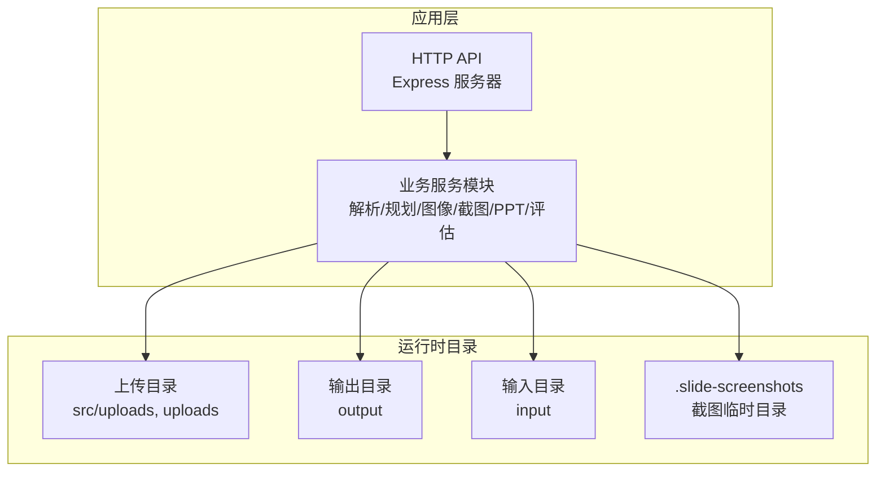
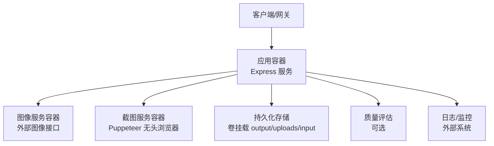
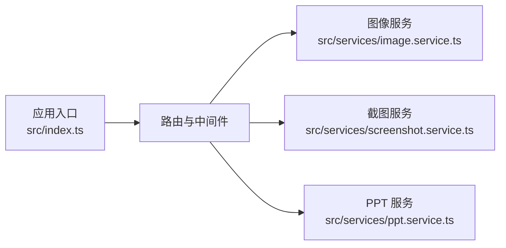

# 容器化部署

<cite>
**本文引用的文件**
- [package.json](file://package.json)
- [readme.md](file://readme.md)
- [src/index.ts](file://src/index.ts)
- [src/services/image.service.ts](file://src/services/image.service.ts)
- [src/services/screenshot.service.ts](file://src/services/screenshot.service.ts)
- [src/services/ppt.service.ts](file://src/services/ppt.service.ts)
- [.gitignore](file://.gitignore)
- [nodemon.json](file://nodemon.json)
- [tsconfig.json](file://tsconfig.json)
</cite>

## 目录
1. [简介](#简介)
2. [项目结构](#项目结构)
3. [核心组件](#核心组件)
4. [架构总览](#架构总览)
5. [详细组件分析](#详细组件分析)
6. [依赖关系分析](#依赖关系分析)
7. [性能考量](#性能考量)
8. [故障排查指南](#故障排查指南)
9. [结论](#结论)
10. [附录](#附录)

## 简介
本文件面向 Generate-PPT 的容器化部署，提供从 Docker 镜像构建、Compose 编排、运行时配置，到 Kubernetes 资源定义与容器间通信、持久化、负载均衡、监控与日志、以及故障排查的完整方案。文档以仓库现有代码与配置为基础，结合实际运行需求，给出可落地的工程实践建议。

## 项目结构
- 应用采用 Node.js + TypeScript 开发，Express 提供 HTTP 服务，核心功能通过服务模块化组织，包括解析、规划、图像生成、截图渲染、PPT 渲染与评估等。
- 关键运行产物与目录：
  - 运行时上传目录：src/uploads、uploads
  - 输出目录：output
  - 输入目录：input
  - 日志与测试数据：logs、test-*.pptx、test-*.pdf、test-*.docx、test_data
- 构建产物：dist（由 TypeScript 编译生成）

**图表来源**
- [src/index.ts:1-433](file://src/index.ts#L1-L433)
- [.gitignore:1-45](file://.gitignore#L1-L45)

**章节来源**
- [package.json:1-45](file://package.json#L1-L45)
- [tsconfig.json:1-23](file://tsconfig.json#L1-L23)
- [.gitignore:1-45](file://.gitignore#L1-L45)

## 核心组件
- HTTP 服务与路由
  - CORS、静态资源、文件上传中间件初始化与路由注册。
  - 主要端点：/generate-ppt（表单上传）、/api/chat（对话式生成）。
- 服务模块
  - 图像服务：调用外部图像接口或回退方案，支持并发控制与缓存。
  - 截图服务：基于 Puppeteer 的无头浏览器截图，生成高分辨率 PNG。
  - PPT 服务：基于 pptxgenjs 或 HTML→PNG→PPT 的渲染路径。
- 环境变量与配置
  - 端口、图像与规划器开关、并发度、渲染模式、质量评估开关、模板样式参数等。
- 运行时目录
  - 上传、输出、输入目录在容器内需持久化或挂载，避免生成过程数据丢失。

**章节来源**
- [src/index.ts:1-433](file://src/index.ts#L1-L433)
- [src/services/image.service.ts:1-218](file://src/services/image.service.ts#L1-L218)
- [src/services/screenshot.service.ts:1-77](file://src/services/screenshot.service.ts#L1-L77)
- [src/services/ppt.service.ts:1-1551](file://src/services/ppt.service.ts#L1-L1551)
- [readme.md:17-50](file://readme.md#L17-L50)

## 架构总览
下图展示容器化部署下的系统交互：客户端通过 API 访问服务；服务内部调用图像与截图模块；PPT 渲染模块生成结果并写入输出目录；质量评估模块可选地输出评分报告；日志与监控由外部系统采集。

[此图为概念性架构示意，不直接映射具体源码文件，故不提供图表来源]

## 详细组件分析

### Docker 镜像构建最佳实践
- 基础镜像选择
  - 建议使用官方 Node.js LTS 镜像作为基础，确保二进制兼容性与安全更新。
- 多阶段构建
  - 阶段一：安装依赖并编译 TypeScript 到 dist。
  - 阶段二：仅复制 dist 与运行所需资源，使用最小化运行时镜像（如 node:alpine）。
- 镜像大小优化
  - 合理分层：先安装依赖再复制源码，利用 Docker 缓存。
  - 清理无关文件：排除 node_modules、dist、.git、测试与日志目录。
  - 使用 .dockerignore 控制排除项。
- 安全扫描
  - 在 CI 中集成镜像漏洞扫描（如 Trivy、Clair、Snyk）。
  - 定期更新基础镜像与依赖版本。
- 运行用户与权限
  - 以非 root 用户运行应用，降低权限风险。
- 健康检查与启动命令
  - 健康检查：GET /（或自定义探针）。
  - 启动命令：使用生产脚本（如 npm run serve）而非开发脚本。

[本节为通用实践说明，不直接分析具体文件，故不提供章节来源]

### Docker Compose 配置要点
- 服务编排
  - 单容器服务：应用容器 + 可选的外部图像服务容器。
  - 多容器服务：应用 + 数据库（如需要）+ 缓存（如需要）。
- 网络配置
  - 自定义桥接网络，便于容器间通信与服务发现。
- 卷挂载
  - 挂载 output、uploads、input 目录到宿主机或命名卷，实现持久化与共享。
  - .env 文件挂载为只读，避免意外修改。
- 环境变量传递
  - 使用 env_file 或 environment 字段注入端口、图像 API 密钥、规划器开关等。
- 端口映射
  - 映射容器端口到宿主机端口，便于外部访问。

[本节为通用实践说明，不直接分析具体文件，故不提供章节来源]

### 容器运行时配置
- 资源限制
  - CPU/内存限制：避免资源争用影响其他容器。
  - Puppeteer 进程：无头浏览器对内存敏感，建议设置内存上限。
- 健康检查
  - HTTP GET / 或应用内探针，周期性检测服务可用性。
- 重启策略
  - unless-stopped 或 on-failure，结合健康检查与错误日志。
- 日志与审计
  - stdout/stderr 输出到容器日志驱动，配合集中式日志系统（如 Fluent Bit、Promtail）。
  - 重要错误与异常需记录到日志，便于追踪。

[本节为通用实践说明，不直接分析具体文件，故不提供章节来源]

### Kubernetes 部署配置示例
- Deployment
  - 定义副本数、滚动更新策略、资源请求与限制。
  - 设置 readinessProbe/livenessProbe，结合健康检查。
- Service
  - ClusterIP/NodePort/LoadBalancer，暴露服务给集群内外访问。
- ConfigMap
  - 存放非敏感配置（如渲染参数、日志级别）。
- Secret
  - 存放敏感信息（如图像 API 密钥、规划器令牌）。
- PersistentVolumeClaim
  - 绑定 output、uploads、input 目录，实现持久化存储。
- Ingress/网关
  - 配置域名与 TLS，实现外部流量接入与负载均衡。

[本节为通用实践说明，不直接分析具体文件，故不提供章节来源]

### 容器间通信、持久化与负载均衡
- 容器间通信
  - 同一 Pod 内容器共享存储与 IPC；跨 Pod 通过 Service 名称访问。
- 持久化存储
  - 使用 PVC 挂载 output、uploads、input，避免容器重建导致数据丢失。
- 负载均衡
  - Service 层面实现副本间的请求分发；Ingress 实现外部流量分发与路由。

[本节为通用实践说明，不直接分析具体文件，故不提供章节来源]

## 依赖关系分析
- 应用入口与路由
  - Express 初始化、CORS、静态资源、上传中间件与路由注册。
- 服务模块依赖
  - 图像服务依赖外部图像接口与缓存；截图服务依赖 Puppeteer 无头浏览器；PPT 服务依赖 pptxgenjs 或截图服务。
- 环境变量与配置
  - 端口、图像与规划器开关、并发度、渲染模式、质量评估开关、模板样式参数等通过 process.env 注入。

**图表来源**
- [src/index.ts:1-433](file://src/index.ts#L1-L433)
- [src/services/image.service.ts:1-218](file://src/services/image.service.ts#L1-L218)
- [src/services/screenshot.service.ts:1-77](file://src/services/screenshot.service.ts#L1-L77)
- [src/services/ppt.service.ts:1-1551](file://src/services/ppt.service.ts#L1-L1551)

**章节来源**
- [src/index.ts:1-433](file://src/index.ts#L1-L433)
- [src/services/image.service.ts:1-218](file://src/services/image.service.ts#L1-L218)
- [src/services/screenshot.service.ts:1-77](file://src/services/screenshot.service.ts#L1-L77)
- [src/services/ppt.service.ts:1-1551](file://src/services/ppt.service.ts#L1-L1551)

## 性能考量
- 并发与资源
  - 图像生成并发度由环境变量控制，需结合 CPU/内存资源合理设置。
  - Puppeteer 无头浏览器占用较高内存，建议限制副本数或增加节点资源。
- I/O 与存储
  - 上传与输出目录频繁读写，建议使用高性能存储与合适的卷类型。
- 渲染路径
  - HTML→PNG→PPT 渲染路径可获得更高分辨率与一致性，但计算成本更高；原生 pptxgenjs 路径更快但受字体与布局限制。
- 缓存与复用
  - 图像服务内置缓存，减少重复请求；对话式生成的图片缓存按文档标题缓存，提升确认阶段效率。

[本节为通用性能讨论，不直接分析具体文件，故不提供章节来源]

## 故障排查指南
- 端口与服务不可达
  - 检查容器端口映射与防火墙；确认健康检查与探针状态。
- 图像生成失败
  - 核对 IMAGE_API_KEY、IMAGE_API_BASE_URL；查看图像服务日志与超时设置。
- 截图失败或内存不足
  - 检查 Puppeteer 启动参数与资源限制；确认无头浏览器可用性。
- 输出文件缺失
  - 确认 output 目录已正确挂载为持久卷；检查权限与磁盘空间。
- 环境变量未生效
  - 检查 .env 文件挂载路径与只读设置；确认变量名与默认值逻辑。

**章节来源**
- [src/services/image.service.ts:1-218](file://src/services/image.service.ts#L1-L218)
- [src/services/screenshot.service.ts:1-77](file://src/services/screenshot.service.ts#L1-L77)
- [src/index.ts:1-433](file://src/index.ts#L1-L433)
- [.gitignore:1-45](file://.gitignore#L1-L45)

## 结论
通过多阶段构建与最小化运行时镜像、合理的卷挂载与资源限制、完善的健康检查与重启策略，以及基于 Kubernetes 的编排与负载均衡，Generate-PPT 可以在容器环境中稳定、高效地运行。结合监控与日志体系，能够快速定位问题并保障服务质量。

## 附录
- 环境变量参考（摘自项目文档）
  - 端口、图像 API 密钥与基础地址、图像并发度、是否启用 AI 图像、规划器开关与模型、质量评估开关、PPT 渲染样式与文本保留策略等。
- 开发与构建参考
  - 使用 npm scripts 进行开发（nodemon）与生产构建（TypeScript 编译），输出至 dist 目录。

**章节来源**
- [readme.md:17-50](file://readme.md#L17-L50)
- [package.json:5-12](file://package.json#L5-L12)
- [tsconfig.json:1-23](file://tsconfig.json#L1-L23)
- [nodemon.json:1-6](file://nodemon.json#L1-L6)