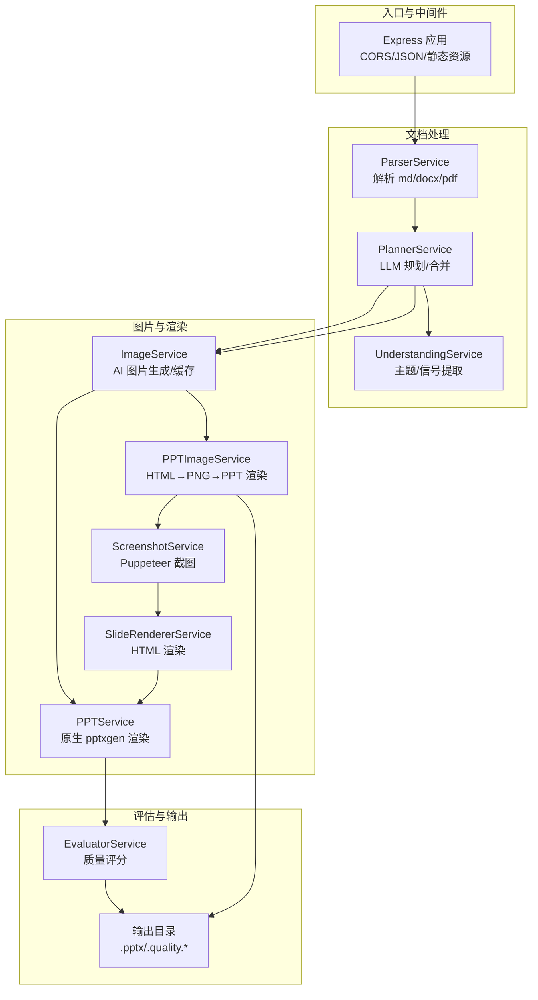
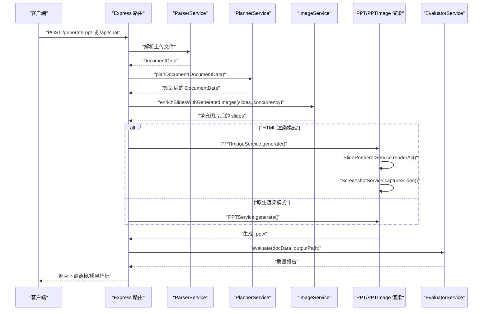
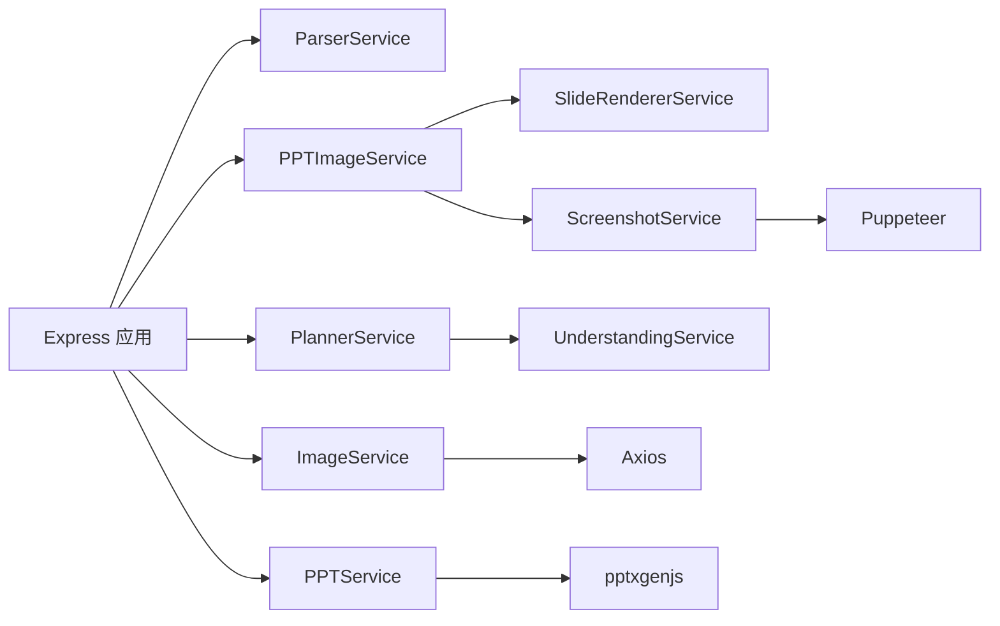

# 性能调优

<cite>
**本文引用的文件**
- [package.json](file://package.json)
- [readme.md](file://readme.md)
- [src/index.ts](file://src/index.ts)
- [src/services/image.service.ts](file://src/services/image.service.ts)
- [src/services/ppt.service.ts](file://src/services/ppt.service.ts)
- [src/services/ppt-image.service.ts](file://src/services/ppt-image.service.ts)
- [src/services/slide-renderer.service.ts](file://src/services/slide-renderer.service.ts)
- [src/services/screenshot.service.ts](file://src/services/screenshot.service.ts)
- [src/services/planner.service.ts](file://src/services/planner.service.ts)
- [src/services/understanding.service.ts](file://src/services/understanding.service.ts)
- [src/types.ts](file://src/types.ts)
- [test/batch_generate_score.ts](file://test/batch_generate_score.ts)
- [test/test_image_api.ts](file://test/test_image_api.ts)
</cite>

## 目录
1. [简介](#简介)
2. [项目结构](#项目结构)
3. [核心组件](#核心组件)
4. [架构总览](#架构总览)
5. [详细组件分析](#详细组件分析)
6. [依赖分析](#依赖分析)
7. [性能考虑](#性能考虑)
8. [故障排查指南](#故障排查指南)
9. [结论](#结论)
10. [附录](#附录)

## 简介
本文件面向 Generate-PPT 的性能调优，围绕以下目标展开：
- 内存使用优化：大文件解析与图片缓存的 TTL 策略
- 并发处理配置：图片生成并发数与请求队列管理
- 超时设置：文件上传、AI 服务调用、PPT 生成的超时策略
- 资源分配：Node.js 进程内存限制与硬件适配
- 性能监控与基准测试：指标采集与测试方法
- 不同硬件配置下的优化建议

## 项目结构
项目采用分层与功能模块化组织，核心运行入口在 Web 服务器中，服务层负责解析、规划、图片生成、渲染与评估；CLI 与批量测试脚本支持离线基准测试。

图表来源
- [src/index.ts:71-428](file://src/index.ts#L71-L428)
- [src/services/planner.service.ts:84-101](file://src/services/planner.service.ts#L84-L101)
- [src/services/image.service.ts:15-28](file://src/services/image.service.ts#L15-L28)
- [src/services/ppt.service.ts:52-75](file://src/services/ppt.service.ts#L52-L75)
- [src/services/ppt-image.service.ts:18-51](file://src/services/ppt-image.service.ts#L18-L51)
- [src/services/slide-renderer.service.ts:14-46](file://src/services/slide-renderer.service.ts#L14-L46)
- [src/services/screenshot.service.ts:15-52](file://src/services/screenshot.service.ts#L15-L52)

章节来源
- [src/index.ts:21-52](file://src/index.ts#L21-L52)
- [package.json:18-31](file://package.json#L18-L31)

## 核心组件
- Web 服务器与路由：提供 /generate-ppt 与 /api/chat 接口，支持多文件上传、参数校验与输出下载
- 解析器：解析 md/docx/pdf，提取标题、层级、要点与图片
- 规划器：基于 LLM 的幻灯片规划与合并，支持严格/创意模式
- 图片服务：AI 图片生成、本地缓存与降级回退
- 渲染服务：原生 pptxgen 与 HTML→PNG→PPT 两种渲染路径
- 评估服务：质量维度评分与报告输出

章节来源
- [src/index.ts:71-428](file://src/index.ts#L71-L428)
- [src/services/planner.service.ts:84-101](file://src/services/planner.service.ts#L84-L101)
- [src/services/image.service.ts:4-57](file://src/services/image.service.ts#L4-L57)
- [src/services/ppt.service.ts:52-75](file://src/services/ppt.service.ts#L52-L75)
- [src/services/ppt-image.service.ts:18-51](file://src/services/ppt-image.service.ts#L18-L51)
- [src/services/understanding.service.ts:4-22](file://src/services/understanding.service.ts#L4-L22)

## 架构总览
下图展示一次典型请求的端到端流程，涵盖解析、规划、图片生成、渲染与评估。

图表来源
- [src/index.ts:314-428](file://src/index.ts#L314-L428)
- [src/services/planner.service.ts:84-101](file://src/services/planner.service.ts#L84-L101)
- [src/services/image.service.ts:15-28](file://src/services/image.service.ts#L15-L28)
- [src/services/ppt-image.service.ts:18-51](file://src/services/ppt-image.service.ts#L18-L51)
- [src/services/ppt.service.ts:52-75](file://src/services/ppt.service.ts#L52-L75)

## 详细组件分析

### 内存使用优化与图片缓存 TTL
- 会话级文档图片缓存：在路由层维护 Map 缓存，键为文档标题（小写），值包含按标题映射的图片列表与顺序列表，并记录创建时间；定时清理过期缓存（默认 10 分钟）
- 图片生成缓存：图片服务对提示词进行缓存，避免重复请求同一提示词；同时具备主 API 失败时的降级回退与兜底占位图
- 建议
  - 对于大文件：解析后及时释放中间对象引用，避免长时间持有大文本/二进制
  - 对于图片缓存：结合业务场景调整 TTL，或按文档大小动态缩短 TTL
  - 对于并发：控制单次请求的图片生成并发，避免瞬时内存峰值

章节来源
- [src/index.ts:53-69](file://src/index.ts#L53-L69)
- [src/index.ts:155-185](file://src/index.ts#L155-L185)
- [src/services/image.service.ts:7-57](file://src/services/image.service.ts#L7-L57)

### 并发处理配置
- 图片生成并发：通过环境变量 IMAGE_CONCURRENCY 控制，缺省 2；服务内部以固定并发数调度任务队列
- 渲染并发：HTML→PNG→PPT 渲染路径使用 Puppeteer，单页截图在浏览器上下文中执行；并发度受系统资源与 Puppeteer 实例限制
- 请求队列：Multer 上传文件采用磁盘存储，避免内存堆积；路由层未显式实现请求排队，建议在网关或进程外加队列

章节来源
- [src/index.ts:241-245](file://src/index.ts#L241-L245)
- [src/index.ts:381-385](file://src/index.ts#L381-L385)
- [src/services/image.service.ts:199-216](file://src/services/image.service.ts#L199-L216)
- [src/services/screenshot.service.ts:15-52](file://src/services/screenshot.service.ts#L15-L52)

### 超时设置配置
- 图片生成主接口：请求超时 120 秒，下载图片超时 45 秒
- 规划器 LLM 调用：请求超时 120 秒
- 文件上传：Express 默认无显式超时，实际受底层网络栈影响；建议在网关或反向代理层设置上传超时
- PPT 生成：原生渲染与 HTML 渲染均无显式超时参数，建议在路由层包裹超时控制

章节来源
- [src/services/image.service.ts:79](file://src/services/image.service.ts#L79)
- [src/services/image.service.ts:146](file://src/services/image.service.ts#L146)
- [src/services/planner.service.ts:135](file://src/services/planner.service.ts#L135)

### CPU 与内存资源分配
- Node.js 版本：推荐 16 及以上，内置兼容性补丁
- 内存限制：可通过 Node.js 启动参数设置最大堆大小；建议在容器/进程管理器中固定内存上限，防止 OOM
- 硬件适配：CPU 核心数与并发数成正比，建议将 IMAGE_CONCURRENCY 与 CPU 核心数匹配；I/O 密集场景可适度提高并发

章节来源
- [readme.md:127-131](file://readme.md#L127-L131)
- [package.json:18-31](file://package.json#L18-L31)

### 性能监控与基准测试
- 批量测试：提供 CLI 脚本，支持遍历输入目录、批量生成 PPT、输出质量报告与统计摘要
- 指标采集：脚本记录每个文件的耗时、分数、等级、幻灯片数量等，便于横向对比
- 建议指标
  - 单文件生成耗时（秒）
  - 平均分数与分布
  - 图片覆盖率、布局多样性、文本密度
  - 并发与 CPU/内存占用

章节来源
- [test/batch_generate_score.ts:274-431](file://test/batch_generate_score.ts#L274-L431)
- [src/services/understanding.service.ts:4-22](file://src/services/understanding.service.ts#L4-L22)
- [src/types.ts:140-160](file://src/types.ts#L140-L160)

## 依赖分析
- 外部依赖：Express、Multer、Axios、pptxgenjs、Puppeteer、mammoth、pdf-parse、marked 等
- 关键耦合点
  - 路由层依赖解析、规划、图片与渲染服务
  - 渲染服务依赖 Puppeteer（高内存占用）
  - 规划器依赖外部 LLM 服务（网络与超时敏感）

图表来源
- [src/index.ts:45-51](file://src/index.ts#L45-L51)
- [src/services/ppt-image.service.ts:15-16](file://src/services/ppt-image.service.ts#L15-L16)
- [src/services/screenshot.service.ts:1-4](file://src/services/screenshot.service.ts#L1-L4)
- [package.json:18-31](file://package.json#L18-L31)

章节来源
- [package.json:18-31](file://package.json#L18-L31)
- [src/index.ts:45-51](file://src/index.ts#L45-L51)

## 性能考虑
- 大文件处理
  - 解析阶段：按需读取与流式处理，避免一次性加载至内存
  - 图片缓存：TTL 10 分钟，适合短会话内复用；长会话建议缩短 TTL 或禁用缓存
- 并发与队列
  - 图片生成并发：根据 CPU 与网络带宽调整，避免过度并发导致抖动
  - 请求队列：在网关层增加限流与排队，保障稳定性
- 超时与重试
  - AI 服务与截图阶段设置合理超时，失败时启用降级策略
- 渲染路径选择
  - 原生渲染：轻量、稳定；HTML 渲染：视觉一致但内存高
- 资源限制
  - 固定 Node.js 堆大小，结合容器资源限制，避免突发内存增长

[本节为通用指导，无需特定文件引用]

## 故障排查指南
- 图片生成失败
  - 检查 IMAGE_API_KEY 与基础 URL 配置
  - 查看主 API 超时与降级回退日志
- 规划器调用失败
  - 核对认证令牌与模型配置，关注超时与响应状态
- HTML 渲染异常
  - Puppeteer 启动参数与系统依赖（字体、沙箱）是否满足
- 上传超时
  - 在网关或反向代理层设置上传超时与大小限制
- 内存溢出
  - 降低并发、缩短 TTL、限制单文件大小、启用内存上限

章节来源
- [test/test_image_api.ts:8-44](file://test/test_image_api.ts#L8-L44)
- [src/services/planner.service.ts:135](file://src/services/planner.service.ts#L135)
- [src/services/screenshot.service.ts:54-68](file://src/services/screenshot.service.ts#L54-L68)

## 结论
通过合理的内存管理（TTL 缓存）、并发控制（图片生成与渲染）、超时治理与资源限制，可在保证质量的前提下显著提升 Generate-PPT 的吞吐与稳定性。建议结合批量测试脚本持续监控关键指标，并根据硬件配置动态调整并发与超时参数。

[本节为总结，无需特定文件引用]

## 附录

### 环境变量与性能相关项
- ENABLE_AI_IMAGES：是否启用 AI 图片生成
- IMAGE_CONCURRENCY：图片生成并发数
- IMAGE_MODEL、IMAGE_RESOLUTION：图片模型与分辨率
- PPT_TEMPLATE_STYLE、PPT_KEEP_TEXT、PPT_IMAGE_ONLY_MODE、PPT_MAX_BULLETS_PER_SLIDE：PPT 渲染样式与文本策略
- PPT_RENDER_MODE：渲染模式（原生或 HTML）

章节来源
- [readme.md:21-50](file://readme.md#L21-L50)
- [src/index.ts:236-255](file://src/index.ts#L236-L255)
- [src/index.ts:399-406](file://src/index.ts#L399-L406)
- [src/services/ppt.service.ts:77-85](file://src/services/ppt.service.ts#L77-L85)