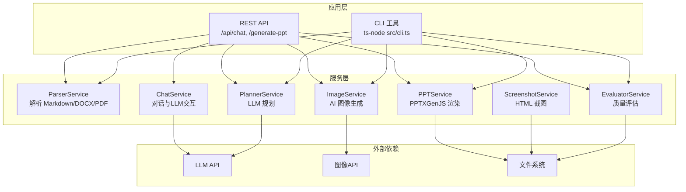
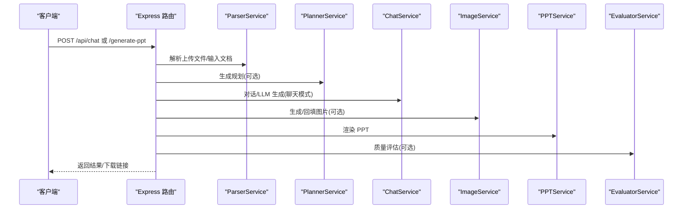
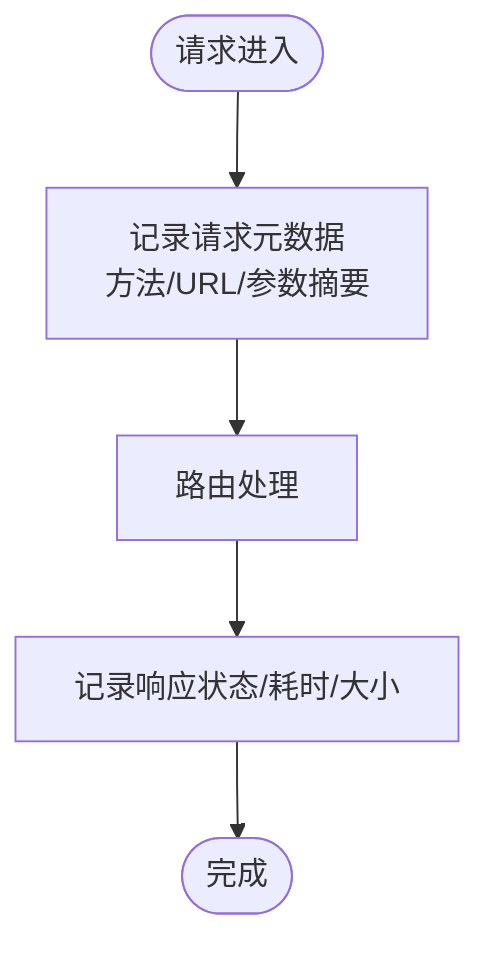
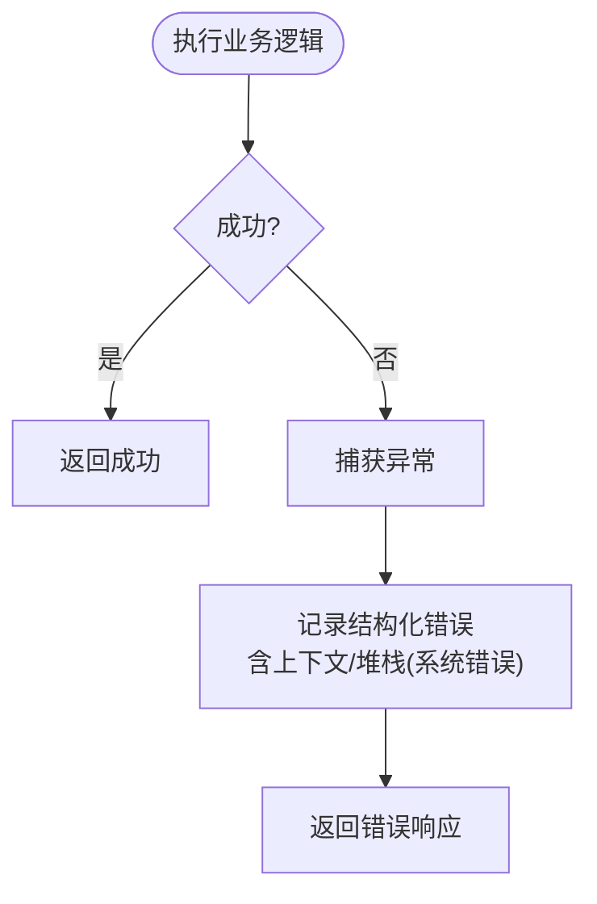
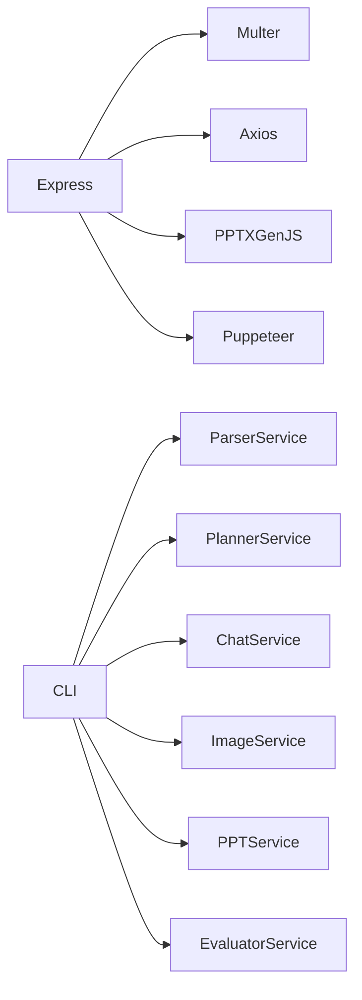

# 监控与日志

<cite>
**本文引用的文件**
- [package.json](file://package.json)
- [src/index.ts](file://src/index.ts)
- [src/cli.ts](file://src/cli.ts)
- [src/services/chat.service.ts](file://src/services/chat.service.ts)
- [src/services/parser.service.ts](file://src/services/parser.service.ts)
- [src/services/ppt.service.ts](file://src/services/ppt.service.ts)
- [src/services/image.service.ts](file://src/services/image.service.ts)
- [src/services/evaluator.service.ts](file://src/services/evaluator.service.ts)
- [src/services/screenshot.service.ts](file://src/services/screenshot.service.ts)
- [src/services/planner.service.ts](file://src/services/planner.service.ts)
</cite>

## 目录
1. [简介](#简介)
2. [项目结构](#项目结构)
3. [核心组件](#核心组件)
4. [架构总览](#架构总览)
5. [详细组件分析](#详细组件分析)
6. [依赖分析](#依赖分析)
7. [性能考虑](#性能考虑)
8. [故障排查指南](#故障排查指南)
9. [结论](#结论)
10. [附录](#附录)

## 简介
本文件面向 Generate-PPT 项目的监控与日志配置，系统性说明现有日志记录方式、错误处理策略、性能观测点，并给出可落地的日志聚合与告警建议。当前项目以控制台日志为主，未内置专门的日志框架或指标采集模块，因此本文在不改变现有实现的前提下，提供可扩展的监控与日志最佳实践。

## 项目结构
- 后端入口：Express 应用位于入口文件，提供 REST API 与静态资源服务。
- 业务服务：解析器、规划器、图像生成、PPT 渲染、截图、评估等服务模块。
- CLI：命令行工具，支持离线批量生成与质量评估报告输出。
- 依赖：Express、Multer、Axios、Puppeteer、PPTXGenJS 等。

图表来源
- [src/index.ts:1-433](file://src/index.ts#L1-L433)
- [src/cli.ts:1-176](file://src/cli.ts#L1-L176)
- [src/services/chat.service.ts:1-400](file://src/services/chat.service.ts#L1-L400)
- [src/services/planner.service.ts:1-800](file://src/services/planner.service.ts#L1-L800)
- [src/services/image.service.ts:1-218](file://src/services/image.service.ts#L1-L218)
- [src/services/ppt.service.ts:1-800](file://src/services/ppt.service.ts#L1-L800)
- [src/services/screenshot.service.ts:1-77](file://src/services/screenshot.service.ts#L1-L77)
- [src/services/evaluator.service.ts:1-800](file://src/services/evaluator.service.ts#L1-L800)

章节来源
- [package.json:1-45](file://package.json#L1-L45)
- [src/index.ts:1-433](file://src/index.ts#L1-L433)
- [src/cli.ts:1-176](file://src/cli.ts#L1-L176)

## 核心组件
- 日志记录现状
  - 控制台日志：广泛使用 console.log/console.error 记录关键流程与错误。
  - 错误处理：接口层与服务层均采用 try/catch 并统一返回错误信息。
- 性能观测点
  - 关键阶段耗时：解析、规划、图像生成、PPT 渲染、质量评估。
  - 资源使用：图像并发度、Puppeteer 浏览器实例生命周期。
- 监控与告警
  - 当前未集成专门的监控 SDK；建议引入轻量指标库与日志聚合平台。

章节来源
- [src/index.ts:72-270](file://src/index.ts#L72-L270)
- [src/services/chat.service.ts:62-101](file://src/services/chat.service.ts#L62-L101)
- [src/services/image.service.ts:15-28](file://src/services/image.service.ts#L15-L28)
- [src/services/ppt.service.ts:53-75](file://src/services/ppt.service.ts#L53-L75)
- [src/services/evaluator.service.ts:32-93](file://src/services/evaluator.service.ts#L32-L93)

## 架构总览
下图展示请求在系统内的流转与日志落点位置。

图表来源
- [src/index.ts:72-428](file://src/index.ts#L72-L428)
- [src/services/parser.service.ts:12-167](file://src/services/parser.service.ts#L12-L167)
- [src/services/planner.service.ts:84-101](file://src/services/planner.service.ts#L84-L101)
- [src/services/chat.service.ts:40-101](file://src/services/chat.service.ts#L40-L101)
- [src/services/image.service.ts:15-28](file://src/services/image.service.ts#L15-L28)
- [src/services/ppt.service.ts:53-75](file://src/services/ppt.service.ts#L53-L75)
- [src/services/evaluator.service.ts:32-93](file://src/services/evaluator.service.ts#L32-L93)

## 详细组件分析

### 访问日志与请求记录
- 现状
  - 未内置专用访问日志中间件；请求进入路由后通过 console.log 输出关键上下文。
  - 示例：记录请求体片段、文件数量、阶段信息等。
- 建议
  - 引入日志中间件（如 morgan）统一记录请求方法、URL、状态码、响应时间。
  - 自定义格式：包含 trace-id、用户标识、请求体摘要、响应大小等。
  - 日志轮转：结合文件轮转工具（如 Winston DailyRotateFile 或 logrotate）实现按天/按大小轮转。

图表来源
- [src/index.ts:72-270](file://src/index.ts#L72-L270)

章节来源
- [src/index.ts:72-270](file://src/index.ts#L72-L270)

### 错误日志与异常捕获
- 现状
  - 统一 try/catch 并输出 console.error，随后返回 5xx 或错误消息。
  - LLM/图像 API 失败时记录状态码与错误信息。
- 建议
  - 结构化错误对象：包含错误码、层级、上下文、trace-id。
  - 区分业务错误与系统错误：前者不打堆栈，后者记录堆栈以便定位。
  - 关键错误标识：如“LLM API 失败”、“图像生成失败”、“PPT 渲染失败”。

图表来源
- [src/index.ts:266-269](file://src/index.ts#L266-L269)
- [src/services/chat.service.ts:97-100](file://src/services/chat.service.ts#L97-L100)
- [src/services/image.service.ts:95-101](file://src/services/image.service.ts#L95-L101)

章节来源
- [src/index.ts:266-269](file://src/index.ts#L266-L269)
- [src/services/chat.service.ts:97-100](file://src/services/chat.service.ts#L97-L100)
- [src/services/image.service.ts:95-101](file://src/services/image.service.ts#L95-L101)

### 性能指标监控
- 现状
  - 未内置指标采集；部分服务存在并发控制与缓存。
- 建议指标
  - 响应时间：P95/P99（按端点分组）。
  - 并发请求数：活跃连接数、队列长度。
  - 资源使用：CPU/内存、Puppeteer 进程数、磁盘 IO。
  - 业务指标：PPT 生成成功率、平均耗时、图像生成成功率。
- 实现建议
  - 引入轻量指标库（如 Prometheus 客户端）暴露 /metrics。
  - 在关键路径埋点：解析、规划、图像生成、PPT 渲染、评估。
  - 与日志关联：每个指标附带 trace-id，便于链路追踪。

章节来源
- [src/services/image.service.ts:199-216](file://src/services/image.service.ts#L199-L216)
- [src/services/screenshot.service.ts:15-52](file://src/services/screenshot.service.ts#L15-L52)
- [src/services/evaluator.service.ts:32-93](file://src/services/evaluator.service.ts#L32-L93)

### 日志聚合与分析
- 建议方案
  - 日志采集：Agent（如 Fluent Bit/Filebeat）收集 stdout/stderr。
  - 存储与索引：ELK/EFK 或 Loki + Promtail。
  - 可视化：Kibana/Grafana。
  - 关键字段：level、service、trace_id、endpoint、status、duration_ms、error。
- 关联查询
  - 通过 trace_id 关联一次请求的多条日志。
  - 按端点/错误类型/响应时间进行聚合分析。

[本节为概念性说明，无需图表来源]

### 告警与故障检测
- 告警维度
  - 错误率阈值（如 5xx/错误日志占比）。
  - 响应时间突增（P95/P99）。
  - 资源使用上限（CPU/内存/磁盘）。
  - 业务指标异常（PPT 成功率下降、图像生成失败率上升）。
- 建议
  - 使用告警平台（如 Alertmanager/Grafana OnCall）对接指标。
  - 分级告警：Warn（自动修复）、Critical（值班）。

[本节为概念性说明，无需图表来源]

## 依赖分析
- 外部依赖
  - Express：HTTP 服务器与路由。
  - Multer：文件上传。
  - Axios：调用 LLM/图像 API。
  - Puppeteer：HTML 截图。
  - PPTXGenJS：PPT 渲染。
- 内部依赖
  - 服务间组合：Parser → Planner/Chat → Image → PPT/Evaluator。
  - CLI 与 API 共享相同服务，便于统一监控口径。

图表来源
- [package.json:18-31](file://package.json#L18-L31)
- [src/index.ts:1-433](file://src/index.ts#L1-L433)
- [src/cli.ts:1-176](file://src/cli.ts#L1-L176)

章节来源
- [package.json:18-31](file://package.json#L18-L31)
- [src/index.ts:1-433](file://src/index.ts#L1-L433)
- [src/cli.ts:1-176](file://src/cli.ts#L1-L176)

## 性能考虑
- 并发与限流
  - 图像生成并发度受环境变量控制，建议按机器资源设置上限。
  - Puppeteer 浏览器实例复用，避免频繁启动。
- I/O 优化
  - 临时文件与输出目录提前创建，减少运行时开销。
  - 评估阶段读写 ZIP 文件，注意磁盘空间与 IO 峰值。
- 超时与重试
  - LLM/图像 API 设置合理超时与重试策略，避免阻塞请求线程。

章节来源
- [src/services/image.service.ts:15-28](file://src/services/image.service.ts#L15-L28)
- [src/services/screenshot.service.ts:54-68](file://src/services/screenshot.service.ts#L54-L68)
- [src/services/evaluator.service.ts:115-162](file://src/services/evaluator.service.ts#L115-L162)

## 故障排查指南
- 常见问题定位
  - LLM/图像 API 失败：检查鉴权头、基础地址、超时配置。
  - 文件解析异常：确认上传格式与大小限制。
  - PPT 渲染失败：检查输出目录权限与磁盘空间。
  - 质量评估异常：确认输出目录存在且可写。
- 日志检索
  - 关键关键字：LLM API failed、Primary image API failed、Rendered deck inspection failed。
  - 时间窗口：结合请求 ID 与 trace-id 定位整条链路。

章节来源
- [src/services/chat.service.ts:81-84](file://src/services/chat.service.ts#L81-L84)
- [src/services/image.service.ts:95-101](file://src/services/image.service.ts#L95-L101)
- [src/services/evaluator.service.ts:158-161](file://src/services/evaluator.service.ts#L158-L161)

## 结论
- 现状：以控制台日志为主，错误处理统一但缺乏结构化与指标化。
- 建议：引入访问日志中间件、结构化错误日志、Prometheus 指标、日志聚合平台与告警体系，形成闭环的可观测性能力。
- 实施顺序：先完善日志与指标，再接入告警与可视化，最后扩展链路追踪。

[本节为总结性说明，无需章节来源]

## 附录

### 环境变量与日志相关配置
- 生成模式与并发
  - ENABLE_AI_IMAGES：是否启用 AI 图像生成
  - IMAGE_CONCURRENCY：图像生成并发度
  - PPT_RENDER_MODE：渲染模式（native/html）
  - ENABLE_EVALUATION：是否启用质量评估
- LLM/图像服务
  - PLANNER_AUTH_TOKEN/IMAGE_API_KEY：鉴权头
  - PLANNER_API_BASE_URL/IMAGE_API_BASE_URL：服务地址
  - PLANNER_MODEL：模型名称
- 其他
  - PORT：监听端口
  - PPT_* 系列：PPT 渲染相关开关与参数

章节来源
- [src/index.ts:236-427](file://src/index.ts#L236-L427)
- [src/cli.ts:136-160](file://src/cli.ts#L136-L160)
- [src/services/chat.service.ts:35-38](file://src/services/chat.service.ts#L35-L38)
- [src/services/image.service.ts:9-13](file://src/services/image.service.ts#L9-L13)
- [src/services/planner.service.ts:67-82](file://src/services/planner.service.ts#L67-L82)