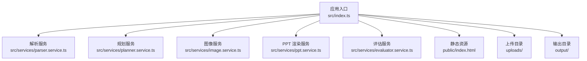
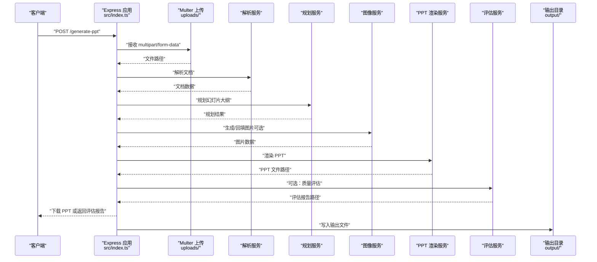
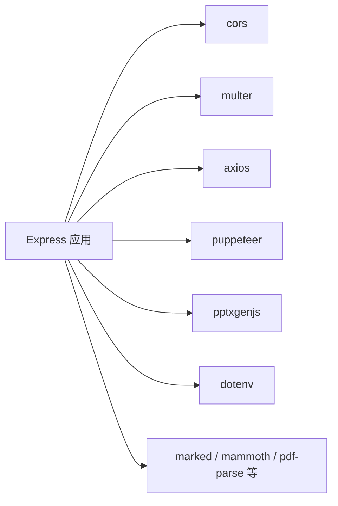

# 部署配置

<cite>
**本文引用的文件**
- [package.json](file://package.json)
- [readme.md](file://readme.md)
- [src/index.ts](file://src/index.ts)
- [src/services/ppt.service.ts](file://src/services/ppt.service.ts)
- [src/services/image.service.ts](file://src/services/image.service.ts)
- [src/services/planner.service.ts](file://src/services/planner.service.ts)
- [src/services/evaluator.service.ts](file://src/services/evaluator.service.ts)
- [nodemon.json](file://nodemon.json)
</cite>

## 目录
1. [简介](#简介)
2. [项目结构](#项目结构)
3. [核心组件](#核心组件)
4. [架构总览](#架构总览)
5. [详细组件分析](#详细组件分析)
6. [依赖分析](#依赖分析)
7. [性能考虑](#性能考虑)
8. [故障排查指南](#故障排查指南)
9. [结论](#结论)
10. [附录](#附录)

## 简介
本文件面向 Generate-PPT 的部署与运维团队，提供覆盖多部署场景的配置指南与最佳实践，包括：
- Docker 容器化部署
- 传统服务器部署
- 云平台部署
- 生产安全配置（CORS、文件上传限制、输出目录权限）
- Nginx 反向代理与 SSL 证书配置
- 负载均衡与高可用部署要点
- 性能调优参数（内存、并发、超时）
- 监控与日志配置建议
- 容器化部署最佳实践与配置示例

## 项目结构
- 应用入口与路由集中在后端主程序，采用 Express 框架，提供文档解析、规划、图像生成、PPT 渲染与质量评估能力。
- 关键运行时目录：
  - uploads：文件上传临时目录（由 multer 写入）
  - output：PPT 输出目录（由服务端写入）
- 开发工具：nodemon 用于热更新开发模式。

图表来源
- [src/index.ts:1-433](file://src/index.ts#L1-L433)

章节来源
- [src/index.ts:1-433](file://src/index.ts#L1-L433)
- [nodemon.json:1-6](file://nodemon.json#L1-L6)

## 核心组件
- 应用入口与中间件
  - CORS：默认启用全局跨域支持
  - JSON/静态资源：解析 JSON 请求体与静态文件
  - 文件上传：multer 存储至 uploads 目录
- 业务服务
  - 规划服务：可选启用，支持本地直连或通过 Cloudflare Worker 代理
  - 图像服务：支持主接口与回退策略，具备并发控制
  - PPT 渲染服务：支持模板样式、仅图模式、保留文本等渲染选项
  - 评估服务：对生成的 PPT 进行质量评分与报告落盘

章节来源
- [src/index.ts:24-27](file://src/index.ts#L24-L27)
- [src/index.ts:29-43](file://src/index.ts#L29-L43)
- [src/services/planner.service.ts:67-82](file://src/services/planner.service.ts#L67-L82)
- [src/services/image.service.ts:15-28](file://src/services/image.service.ts#L15-L28)
- [src/services/ppt.service.ts:77-85](file://src/services/ppt.service.ts#L77-L85)
- [src/services/evaluator.service.ts:95-108](file://src/services/evaluator.service.ts#L95-L108)

## 架构总览
下图展示请求在系统内的处理链路与关键组件交互。

图表来源
- [src/index.ts:314-428](file://src/index.ts#L314-L428)
- [src/services/planner.service.ts:84-101](file://src/services/planner.service.ts#L84-L101)
- [src/services/image.service.ts:15-28](file://src/services/image.service.ts#L15-L28)
- [src/services/ppt.service.ts:52-75](file://src/services/ppt.service.ts#L52-L75)
- [src/services/evaluator.service.ts:32-93](file://src/services/evaluator.service.ts#L32-L93)

## 详细组件分析

### 应用入口与路由（src/index.ts）
- CORS 默认开启，生产环境建议按需收紧
- 静态资源挂载 public 与 output 目录，便于直接访问输出文件
- 上传目录 uploads 由 multer 动态创建
- 提供两类接口：
  - /generate-ppt：单文件生成 PPT
  - /api/chat：多文件对话式生成 PPT（含会话级图片缓存）

章节来源
- [src/index.ts:24-27](file://src/index.ts#L24-L27)
- [src/index.ts:29-43](file://src/index.ts#L29-L43)
- [src/index.ts:314-428](file://src/index.ts#L314-L428)
- [src/index.ts:71-270](file://src/index.ts#L71-L270)

### 规划服务（src/services/planner.service.ts）
- 支持两种调用路径：
  - 直连后端 /api/llm（需令牌）
  - 通过 Cloudflare Worker 代理（可选）
- 环境变量控制开关与行为：
  - 启用/禁用：ENABLE_PLANNER
  - 代理开关：PLANNER_USE_WORKER_PROXY
  - 代理地址与密钥：CLOUDFLARE_WORKER_URL、LLM_API_KEY、GOOGLE_API_KEY
  - 内容模式：PLANNER_CONTENT_MODE（strict/creative）
  - 扩展稀疏内容：PLANNER_EXPAND_SPARSE_CONTENT
  - 访客登录：PLANNER_USE_GUEST_LOGIN

章节来源
- [src/services/planner.service.ts:67-82](file://src/services/planner.service.ts#L67-L82)
- [src/services/planner.service.ts:103-162](file://src/services/planner.service.ts#L103-L162)
- [src/services/planner.service.ts:164-190](file://src/services/planner.service.ts#L164-L190)
- [readme.md:52-61](file://readme.md#L52-L61)

### 图像服务（src/services/image.service.ts）
- 主要能力：
  - 生成图片：基于主接口，失败时回退到备用方案
  - 并发控制：runWithConcurrency 控制同时生成数量
  - 缓存：按提示词缓存结果
- 超时与网络：
  - 主接口请求超时、禁用代理
  - 下载远程图片超时、禁用代理
- 环境变量：
  - IMAGE_API_KEY、IMAGE_API_BASE_URL
  - IMAGE_CONCURRENCY（并发度）
  - ENABLE_AI_IMAGES（是否启用 AI 图片）

章节来源
- [src/services/image.service.ts:15-28](file://src/services/image.service.ts#L15-L28)
- [src/services/image.service.ts:59-102](file://src/services/image.service.ts#L59-L102)
- [src/services/image.service.ts:142-156](file://src/services/image.service.ts#L142-L156)
- [src/services/image.service.ts:199-216](file://src/services/image.service.ts#L199-L216)
- [readme.md:21-44](file://readme.md#L21-L44)

### PPT 渲染服务（src/services/ppt.service.ts）
- 渲染选项：
  - PPT_TEMPLATE_STYLE：模板样式
  - PPT_IMAGE_ONLY_MODE：仅图模式
  - PPT_KEEP_TEXT：保留文本
  - PPT_MAX_BULLETS_PER_SLIDE：每页最大要点数
  - PPT_SHOW_SOURCE_REFS：显示来源引用
- 渲染模式：
  - 通过 PPT 渲染（默认）
  - HTML→PNG→PPT 渲染（受 PPT_RENDER_MODE 控制）

章节来源
- [src/services/ppt.service.ts:77-85](file://src/services/ppt.service.ts#L77-L85)
- [src/index.ts:399-406](file://src/index.ts#L399-L406)

### 评估服务（src/services/evaluator.service.ts）
- 生成质量报告（JSON/Markdown），并落盘到输出目录
- 可通过响应头携带质量分数与报告路径

章节来源
- [src/services/evaluator.service.ts:95-108](file://src/services/evaluator.service.ts#L95-L108)
- [src/index.ts:408-416](file://src/index.ts#L408-L416)

## 依赖分析
- 运行时依赖
  - express：Web 框架
  - cors：跨域支持
  - multer：文件上传
  - axios：HTTP 客户端（图像与规划服务）
  - puppeteer：HTML→PNG 渲染（当选择 HTML 渲染模式时）
  - 其他：文档解析、PPT 生成等
- 开发依赖
  - ts-node、nodemon、typescript 等

图表来源
- [package.json:18-31](file://package.json#L18-L31)

章节来源
- [package.json:18-43](file://package.json#L18-L43)

## 性能考虑
- 并发与吞吐
  - 图像生成并发：通过 IMAGE_CONCURRENCY 控制，避免过载外部图像服务
  - 规划服务并发：由上游调用方控制；若启用直连，注意外部 LLM 速率限制
- 超时与稳定性
  - 图像主接口请求超时、禁用代理
  - 远程图片下载超时、禁用代理
  - 规划服务请求超时
- 内存与磁盘
  - 上传与输出目录均位于宿主机文件系统，需确保磁盘空间充足
  - Puppeteer 渲染模式会增加内存占用，建议在资源充足的环境中启用
- 建议
  - 在生产环境为每个实例设置合理的内存上限与并发上限
  - 对外暴露的 API 使用限流与配额控制

章节来源
- [src/services/image.service.ts:79-82](file://src/services/image.service.ts#L79-L82)
- [src/services/image.service.ts:146-148](file://src/services/image.service.ts#L146-L148)
- [src/services/planner.service.ts:135-137](file://src/services/planner.service.ts#L135-L137)
- [src/services/ppt.service.ts:77-85](file://src/services/ppt.service.ts#L77-L85)

## 故障排查指南
- CORS 相关
  - 默认启用全局 CORS，若出现跨域问题，请检查前端域名与代理配置
- 文件上传
  - 确认 uploads 目录存在且具备写权限
  - 若上传后解析失败，检查文件类型与大小限制
- 输出文件无法访问
  - 确认 output 目录存在且具备写权限
  - 若通过反向代理访问，确保静态资源映射正确
- 图像生成失败
  - 检查 IMAGE_API_KEY、IMAGE_API_BASE_URL 是否正确
  - 查看日志中关于主接口与回退策略的错误信息
- 规划服务异常
  - 若启用直连，确认令牌有效与网络可达
  - 若启用代理，确认代理地址与密钥配置正确
- 质量评估
  - 确认评估服务已启用，输出目录具备写权限

章节来源
- [src/index.ts:24-27](file://src/index.ts#L24-L27)
- [src/index.ts:29-43](file://src/index.ts#L29-L43)
- [src/index.ts:408-416](file://src/index.ts#L408-L416)
- [src/services/image.service.ts:59-102](file://src/services/image.service.ts#L59-L102)
- [src/services/planner.service.ts:103-162](file://src/services/planner.service.ts#L103-L162)

## 结论
本文提供了 Generate-PPT 在多部署场景下的配置要点与运维建议，涵盖安全、性能、监控与高可用等方面。建议在生产环境中结合实际流量与资源情况，逐步优化并发、超时与输出目录权限，并配合反向代理与 SSL 证书实现安全稳定的对外服务。

## 附录

### 部署场景与配置要点

- Docker 部署
  - 建议将 uploads 与 output 映射为持久卷
  - 将 PORT、IMAGE_API_KEY、IMAGE_API_BASE_URL 等敏感配置通过环境变量注入
  - 使用健康检查与重启策略，确保容器稳定运行
  - 参考镜像构建与编排文件（例如 docker-compose）进行编排

- 传统服务器部署
  - 安装 Node.js 运行时，安装依赖并构建产物
  - 使用进程管理器（PM2、systemd）守护进程
  - 配置文件上传与输出目录权限，确保应用可读写
  - 使用反向代理（Nginx）暴露服务并启用 SSL

- 云平台部署
  - 使用容器组或无服务器函数承载服务
  - 利用平台提供的密钥管理与网络策略强化安全
  - 配置弹性伸缩与自动扩缩容策略以应对流量波动

### 生产安全配置
- CORS
  - 限定允许的源、方法与头部，避免使用通配符
- 文件上传限制
  - 限制文件类型与大小，防止滥用
  - 严格校验上传目录权限，避免任意文件写入
- 输出目录权限
  - 仅授予必要写权限，避免过度授权
  - 定期清理旧文件，防止磁盘占满

### Nginx 反向代理与 SSL 配置
- 反向代理
  - 将 /api/* 与静态资源映射到后端服务
  - 配置超时、缓冲区与压缩策略
- SSL 证书
  - 使用 Let’s Encrypt 或商业证书
  - 强制 HTTPS 重定向与安全头部

### 负载均衡与高可用
- 多实例部署
  - 使用反向代理进行请求分发
  - 将上传与输出目录共享（如 NFS/S3），或通过状态无关设计避免共享
- 健康检查与故障转移
  - 配置健康检查端点与自动重启策略
  - 使用数据库/缓存集群提升可用性

### 监控与日志
- 访问日志
  - 记录请求路径、状态码、耗时与客户端 IP
- 错误日志
  - 记录异常堆栈与关键参数，便于定位问题
- 性能指标
  - 指标采集（CPU、内存、并发、响应时间、错误率）
  - 与告警系统集成，及时发现异常

### 容器化部署最佳实践
- 分层镜像与最小化依赖
- 使用只读根文件系统与非 root 用户运行
- 合理设置资源限制与探针
- 使用配置文件与密钥管理工具统一管理环境变量