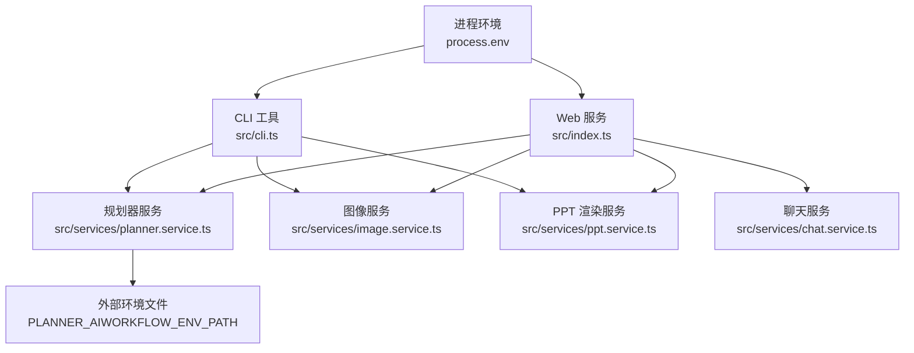
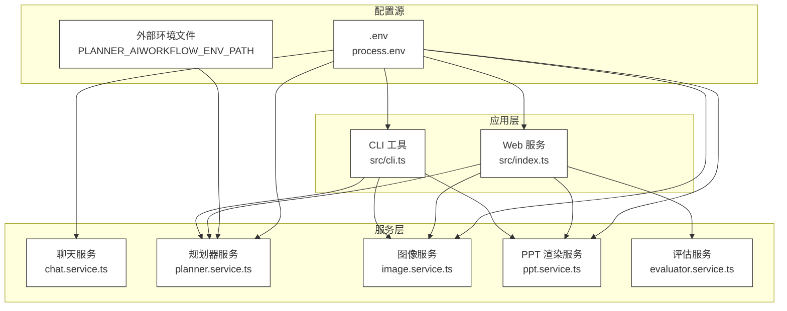
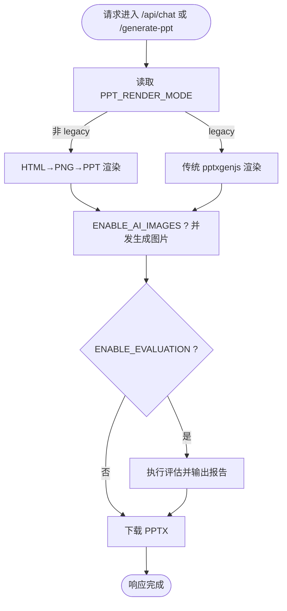
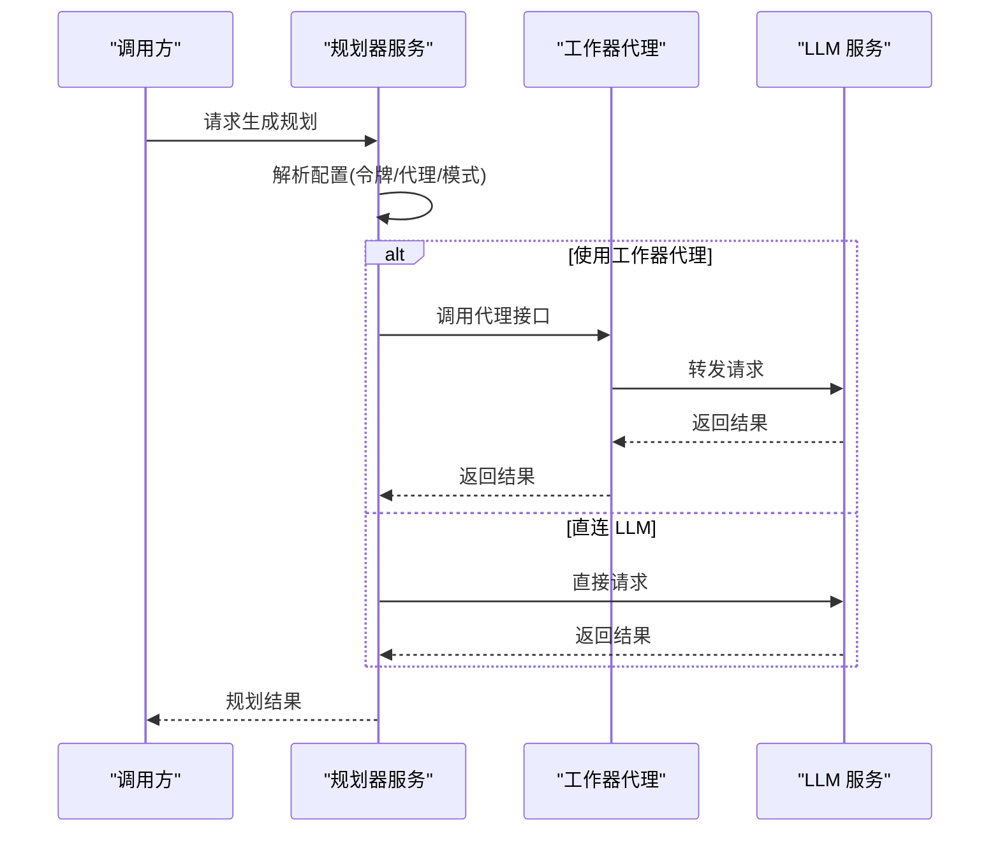
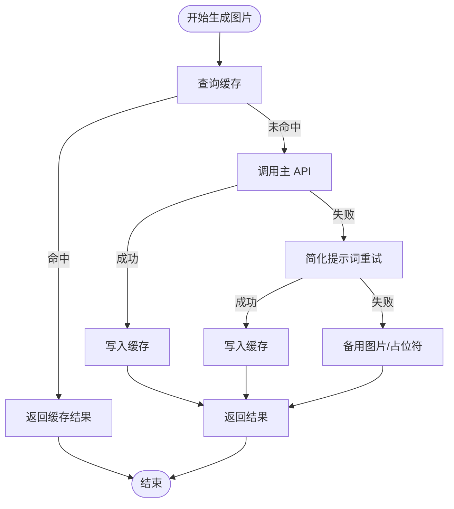
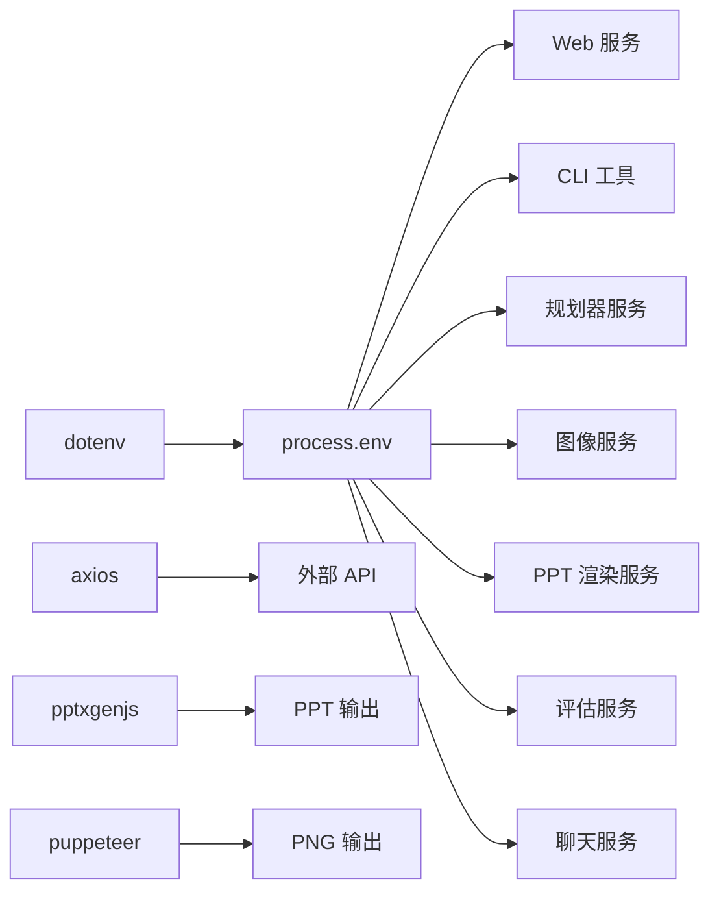

# 配置管理

<cite>
**本文引用的文件**
- [package.json](file://package.json)
- [readme.md](file://readme.md)
- [src/index.ts](file://src/index.ts)
- [src/cli.ts](file://src/cli.ts)
- [src/services/chat.service.ts](file://src/services/chat.service.ts)
- [src/services/image.service.ts](file://src/services/image.service.ts)
- [src/services/planner.service.ts](file://src/services/planner.service.ts)
- [src/services/ppt.service.ts](file://src/services/ppt.service.ts)
- [src/services/evaluator.service.ts](file://src/services/evaluator.service.ts)
- [src/types.ts](file://src/types.ts)
- [nodemon.json](file://nodemon.json)
</cite>

## 目录
1. [简介](#简介)
2. [项目结构](#项目结构)
3. [核心组件](#核心组件)
4. [架构总览](#架构总览)
5. [详细组件分析](#详细组件分析)
6. [依赖分析](#依赖分析)
7. [性能考虑](#性能考虑)
8. [故障排查指南](#故障排查指南)
9. [结论](#结论)
10. [附录](#附录)

## 简介
本文件系统性梳理 Generate-PPT 的配置管理，覆盖环境变量定义、加载与优先级、运行时行为控制、渲染与评估参数、以及生产部署建议。文档面向开发者与运维人员，既提供代码级实现细节，也给出可操作的配置模板与最佳实践。

## 项目结构
- 配置加载入口：应用启动时通过 dotenv 加载 .env 文件至 process.env。
- 配置来源与使用：
  - Web 服务与 CLI 均读取 process.env 中的键值进行运行时决策。
  - 部分服务内部还支持从外部文件加载额外配置（如规划器的外部环境文件）。
- 关键配置文件：
  - package.json：脚本与依赖声明，间接影响运行方式。
  - nodemon.json：开发热重载配置，避免监听输出目录与临时文件。
  - readme.md：提供完整的环境变量清单与说明。

图表来源
- [src/index.ts:19](file://src/index.ts#L19)
- [src/cli.ts:12](file://src/cli.ts#L12)
- [src/services/planner.service.ts:67](file://src/services/planner.service.ts#L67)
- [src/services/image.service.ts:9](file://src/services/image.service.ts#L9)
- [src/services/ppt.service.ts:52](file://src/services/ppt.service.ts#L52)
- [src/services/chat.service.ts:31](file://src/services/chat.service.ts#L31)

章节来源
- [package.json:1-45](file://package.json#L1-L45)
- [readme.md:17-50](file://readme.md#L17-L50)
- [nodemon.json:1-6](file://nodemon.json#L1-L6)

## 核心组件
- 环境变量加载
  - 应用启动时通过 dotenv.config() 将 .env 文件注入 process.env。
  - CLI 同样显式加载 dotenv，确保命令行模式下也能读取配置。
- 配置读取点
  - Web 服务：端口、渲染模式、AI 图像开关、并发度、评估开关、PPT 渲染参数等。
  - 规划器：启用状态、模型、代理模式、令牌、扩展稀疏内容等。
  - 图像服务：API 基地址、密钥、缓存与降级策略。
  - PPT 渲染：模板样式、仅图模式、保留文本、最大条目数、来源标注等。
  - 评估：质量报告开关与输出路径。
- 配置优先级与继承
  - 运行时读取顺序：process.env > 默认值（硬编码）。
  - 外部环境文件（规划器）：当启用工作器代理时，可从指定路径读取额外键值，作为 process.env 的补充。

章节来源
- [src/index.ts:19](file://src/index.ts#L19)
- [src/cli.ts:12](file://src/cli.ts#L12)
- [src/services/planner.service.ts:67](file://src/services/planner.service.ts#L67)
- [src/services/image.service.ts:9](file://src/services/image.service.ts#L9)
- [src/services/ppt.service.ts:77](file://src/services/ppt.service.ts#L77)
- [src/services/evaluator.service.ts:95](file://src/services/evaluator.service.ts#L95)

## 架构总览
下图展示配置在各模块间的传递与使用关系：

图表来源
- [src/index.ts:19](file://src/index.ts#L19)
- [src/cli.ts:12](file://src/cli.ts#L12)
- [src/services/planner.service.ts:67](file://src/services/planner.service.ts#L67)
- [src/services/image.service.ts:9](file://src/services/image.service.ts#L9)
- [src/services/ppt.service.ts:52](file://src/services/ppt.service.ts#L52)
- [src/services/evaluator.service.ts:23](file://src/services/evaluator.service.ts#L23)
- [src/services/chat.service.ts:31](file://src/services/chat.service.ts#L31)

## 详细组件分析

### 环境变量与配置项总览
- 通用
  - PORT：服务端口，默认 3000。
- AI 服务配置
  - IMAGE_API_KEY：图像生成 API 密钥。
  - IMAGE_API_BASE_URL：图像服务基础地址。
  - PLANNER_API_BASE_URL / IMAGE_API_BASE_URL：规划器/聊天服务基础地址（规划器优先使用前者）。
  - PLANNER_AUTH_TOKEN / LLM_AUTH_TOKEN / IMAGE_API_KEY：认证令牌来源（多处回退）。
  - GOOGLE_API_KEY / LLM_API_KEY：工作器代理所需的外部密钥。
  - PLANNER_MODEL：规划器使用的模型名称。
  - IMAGE_MODEL：图像生成模型名称。
  - IMAGE_RESOLUTION：图像分辨率。
- 功能开关
  - ENABLE_AI_IMAGES：是否启用 AI 生成图片。
  - ENABLE_PLANNER：是否启用规划器。
  - ENABLE_EVALUATION：是否启用质量评估。
  - PLANNER_USE_WORKER_PROXY：是否使用工作器代理。
  - PLANNER_USE_GUEST_LOGIN：是否允许访客登录。
  - PPT_TEMPLATE_STYLE：是否启用模板样式。
  - PPT_KEEP_TEXT：是否保留文本。
  - PPT_IMAGE_ONLY_MODE：是否仅图模式。
  - PPT_SHOW_SOURCE_REFS：是否显示来源标注。
- 性能与行为
  - IMAGE_CONCURRENCY：图像生成并发度。
  - PLANNER_CONTENT_MODE：规划器内容模式（strict/creative）。
  - PLANNER_EXPAND_SPARSE_CONTENT：是否扩展稀疏内容。
  - PPT_MAX_BULLETS_PER_SLIDE：每页最大要点数。
  - PPT_RENDER_MODE：渲染模式（非 legacy 则走 HTML→PNG→PPT 流水线）。
- 外部环境
  - AIWORKFLOW_BACKEND_ENV_PATH / PLANNER_AIWORKFLOW_ENV_PATH：外部环境文件路径（用于工作器代理）。

章节来源
- [readme.md:17-50](file://readme.md#L17-L50)
- [src/index.ts:236](file://src/index.ts#L236)
- [src/index.ts:380](file://src/index.ts#L380)
- [src/services/chat.service.ts:31](file://src/services/chat.service.ts#L31)
- [src/services/image.service.ts:4](file://src/services/image.service.ts#L4)
- [src/services/planner.service.ts:67](file://src/services/planner.service.ts#L67)
- [src/services/ppt.service.ts:77](file://src/services/ppt.service.ts#L77)

### Web 服务配置读取与行为
- 端口与静态资源
  - 读取 PORT，未设置则默认 3000；静态资源目录映射 output 目录。
- 渲染模式与图像生成
  - PPT_RENDER_MODE 非 legacy 时启用 HTML→PNG→PPT 渲染流水线；否则使用传统 pptxgenjs。
  - ENABLE_AI_IMAGES 控制是否为幻灯片补充 AI 生成图片；IMAGE_CONCURRENCY 控制并发。
- 质量评估
  - ENABLE_EVALUATION 控制是否执行评估并输出 JSON/Mardown 报告。
- 缓存与会话
  - 文档原始图片按上传文件名哈希缓存，10 分钟 TTL 自动清理。

图表来源
- [src/index.ts:236](file://src/index.ts#L236)
- [src/index.ts:380](file://src/index.ts#L380)
- [src/index.ts:407](file://src/index.ts#L407)

章节来源
- [src/index.ts:21-28](file://src/index.ts#L21-L28)
- [src/index.ts:236](file://src/index.ts#L236)
- [src/index.ts:380](file://src/index.ts#L380)
- [src/index.ts:407](file://src/index.ts#L407)

### 规划器服务配置
- 启用与模型
  - ENABLE_PLANNER 控制是否启用；PLANNER_MODEL 指定模型。
- 认证与代理
  - 令牌来源优先级：PLANNER_AUTH_TOKEN > LLM_AUTH_TOKEN > IMAGE_API_KEY。
  - PLANNER_USE_WORKER_PROXY 控制是否通过工作器代理访问 LLM。
  - 外部环境文件：PLANNER_AIWORKFLOW_ENV_PATH 指向的文件可提供 CLOUDFLARE_WORKER_URL、LLM_API_KEY、GOOGLE_API_KEY 等。
- 内容模式与扩展
  - PLANNER_CONTENT_MODE：strict/creative。
  - PLANNER_EXPAND_SPARSE_CONTENT：是否扩展稀疏内容。
- 语言与本地化
  - PLANNER_USE_GUEST_LOGIN：是否允许访客登录。

图表来源
- [src/services/planner.service.ts:67](file://src/services/planner.service.ts#L67)
- [src/services/planner.service.ts:109](file://src/services/planner.service.ts#L109)
- [src/services/planner.service.ts:164](file://src/services/planner.service.ts#L164)

章节来源
- [src/services/planner.service.ts:67](file://src/services/planner.service.ts#L67)
- [src/services/planner.service.ts:103](file://src/services/planner.service.ts#L103)
- [src/services/planner.service.ts:164](file://src/services/planner.service.ts#L164)
- [src/services/planner.service.ts:1736](file://src/services/planner.service.ts#L1736)

### 图像服务配置
- 基础地址与密钥
  - IMAGE_API_BASE_URL 与 IMAGE_API_KEY。
- 生成策略
  - 优先主 API；失败后尝试简化提示词重试；再失败则降级到备用图片或本地占位符。
  - prompt 缓存：相同 prompt 返回同一结果，提升一致性与性能。
- 并发与超时
  - 通过并发队列控制生成速率；设置较长超时以适配图像生成耗时。

图表来源
- [src/services/image.service.ts:15](file://src/services/image.service.ts#L15)
- [src/services/image.service.ts:30](file://src/services/image.service.ts#L30)
- [src/services/image.service.ts:104](file://src/services/image.service.ts#L104)

章节来源
- [src/services/image.service.ts:4](file://src/services/image.service.ts#L4)
- [src/services/image.service.ts:15](file://src/services/image.service.ts#L15)
- [src/services/image.service.ts:199](file://src/services/image.service.ts#L199)

### PPT 渲染服务配置
- 渲染参数
  - PPT_TEMPLATE_STYLE：启用模板样式。
  - PPT_IMAGE_ONLY_MODE：仅图模式。
  - PPT_KEEP_TEXT：保留文本。
  - PPT_MAX_BULLETS_PER_SLIDE：限制每页要点数。
  - PPT_SHOW_SOURCE_REFS：显示来源标注。
- 渲染模式
  - PPT_RENDER_MODE 非 legacy 时走 HTML→PNG→PPT 流程；否则使用传统渲染。

章节来源
- [src/services/ppt.service.ts:77](file://src/services/ppt.service.ts#L77)
- [src/services/ppt.service.ts:52](file://src/services/ppt.service.ts#L52)

### 聊天服务配置
- 基础地址与令牌
  - PLANNER_API_BASE_URL / IMAGE_API_BASE_URL 作为默认基础地址；PLANNER_AUTH_TOKEN / LLM_AUTH_TOKEN / IMAGE_API_KEY 作为令牌来源。
- 模型与温度
  - PLANNER_MODEL；温度固定为 0.7。
- 阶段识别
  - 根据对话历史与用户输入判断需求收集、大纲、确认三个阶段，决定输出结构。

章节来源
- [src/services/chat.service.ts:31](file://src/services/chat.service.ts#L31)
- [src/services/chat.service.ts:62](file://src/services/chat.service.ts#L62)
- [src/services/chat.service.ts:109](file://src/services/chat.service.ts#L109)

### 评估服务配置
- 输出路径
  - 若传入输出路径，则在同目录生成 JSON 与 Markdown 报告；否则在 output 目录生成。
- 维度权重
  - 内容逻辑、布局质量、图像语义、内容丰富度、受众契合、一致性、源理解等维度权重在代码中固定。

章节来源
- [src/services/evaluator.service.ts:95](file://src/services/evaluator.service.ts#L95)
- [src/services/evaluator.service.ts:23](file://src/services/evaluator.service.ts#L23)

## 依赖分析
- 配置耦合
  - Web 服务与 CLI 对 process.env 的读取高度一致，保证行为统一。
  - 规划器服务对令牌与代理的处理存在多源回退，增强可用性。
- 外部依赖
  - dotenv：.env 注入 process.env。
  - axios：对外部 API（图像、规划器、聊天）请求。
  - pptxgenjs：传统 PPT 渲染。
  - puppeteer：新渲染模式下的 PNG 生成（由 PPT 图像服务间接使用）。

图表来源
- [package.json:18-31](file://package.json#L18-L31)
- [src/index.ts:19](file://src/index.ts#L19)
- [src/cli.ts:12](file://src/cli.ts#L12)

章节来源
- [package.json:18-31](file://package.json#L18-L31)

## 性能考虑
- 并发控制
  - IMAGE_CONCURRENCY 控制图像生成并发，避免资源争用导致超时。
- 渲染模式选择
  - 新渲染模式（HTML→PNG→PPT）在高分辨率与复杂布局下更具表现力，但 CPU/内存占用更高；传统模式更轻量。
- 缓存策略
  - 图像服务对 prompt 建立缓存，减少重复请求。
  - Web 服务对文档原始图片进行短期缓存，降低重复生成成本。
- 超时与重试
  - 图像服务与规划器服务均设置合理超时；失败时采用降级策略，保障可用性。

章节来源
- [src/services/image.service.ts:199](file://src/services/image.service.ts#L199)
- [src/index.ts:53](file://src/index.ts#L53)

## 故障排查指南
- 环境变量缺失
  - 现象：规划器/图像服务报错或被跳过。
  - 排查：确认 IMAGE_API_KEY、PLANNER_AUTH_TOKEN、PLANNER_API_BASE_URL、IMAGE_API_BASE_URL 是否正确设置。
- 工作器代理问题
  - 现象：PLANNER_USE_WORKER_PROXY=true 时仍失败。
  - 排查：检查 CLOUDFLARE_WORKER_URL、LLM_API_KEY、GOOGLE_API_KEY 是否在外部环境文件中正确提供。
- 渲染异常
  - 现象：PPT 输出为空或布局异常。
  - 排查：切换 PPT_RENDER_MODE；调整 PPT_TEMPLATE_STYLE、PPT_IMAGE_ONLY_MODE、PPT_MAX_BULLETS_PER_SLIDE。
- 评估失败
  - 现象：评估报告未生成。
  - 排查：确认 ENABLE_EVALUATION=true，检查输出目录权限。

章节来源
- [src/services/planner.service.ts:67](file://src/services/planner.service.ts#L67)
- [src/services/image.service.ts:9](file://src/services/image.service.ts#L9)
- [src/services/ppt.service.ts:77](file://src/services/ppt.service.ts#L77)
- [src/services/evaluator.service.ts:95](file://src/services/evaluator.service.ts#L95)

## 结论
本项目通过 dotenv 将 .env 注入 process.env，形成统一的配置源。Web 服务与 CLI 在运行时读取这些配置，驱动规划器、图像生成、PPT 渲染与评估等模块的行为。规划器服务具备多令牌回退与工作器代理能力，图像服务具备缓存与降级策略，PPT 渲染参数可灵活调节。建议在生产环境中严格管理密钥与代理配置，结合性能参数与评估报告持续优化输出质量。

## 附录

### 配置优先级与继承机制
- 运行时读取顺序：process.env > 默认值（硬编码）。
- 多令牌回退：PLANNER_AUTH_TOKEN > LLM_AUTH_TOKEN > IMAGE_API_KEY。
- 外部环境文件：PLANNER_AIWORKFLOW_ENV_PATH 指向的文件可补充工作器代理所需键值。

章节来源
- [src/services/planner.service.ts:71](file://src/services/planner.service.ts#L71)
- [src/services/planner.service.ts:1736](file://src/services/planner.service.ts#L1736)

### 生产环境部署配置指南
- 安全配置
  - 严格管理 IMAGE_API_KEY、PLANNER_AUTH_TOKEN、LLM_API_KEY、GOOGLE_API_KEY。
  - 使用 HTTPS 与反向代理，限制暴露端口。
- 性能调优
  - 根据服务器资源设置 IMAGE_CONCURRENCY；在高并发场景下适当降低。
  - 选择合适的渲染模式：复杂布局优先新渲染模式，简单场景可用传统模式。
- 监控设置
  - 记录评估报告（JSON/Mardown）以便质量追踪。
  - 监控外部 API 调用成功率与延迟。

章节来源
- [src/services/evaluator.service.ts:95](file://src/services/evaluator.service.ts#L95)

### 不同部署场景下的配置差异与最佳实践
- 开发环境
  - 使用 dotenv 加载本地 .env；开启 nodemon 热重载。
- 生产环境
  - 通过容器/平台变量注入配置；禁用 ENABLE_EVALUATION 以降低成本。
- 代理与网络
  - 如需工作器代理，确保 CLOUDFLARE_WORKER_URL 与密钥正确配置。

章节来源
- [nodemon.json:1-6](file://nodemon.json#L1-L6)
- [src/services/planner.service.ts:67](file://src/services/planner.service.ts#L67)

### 配置验证、错误检查与动态更新
- 配置验证
  - Web 服务与 CLI 在启动时读取配置；若缺少必要令牌，相关功能将被跳过或降级。
- 错误检查
  - 外部 API 失败时记录状态码与消息；图像服务失败时自动降级。
- 动态更新
  - 本项目未实现配置热重载；建议通过重启服务或容器实现配置更新。

章节来源
- [src/services/chat.service.ts:81](file://src/services/chat.service.ts#L81)
- [src/services/image.service.ts:95](file://src/services/image.service.ts#L95)

### 配置模板与示例文件
- .env 示例字段（摘自项目文档）
  - IMAGE_API_KEY、IMAGE_API_BASE_URL、PORT
  - ENABLE_AI_IMAGES、IMAGE_CONCURRENCY、IMAGE_MODEL、IMAGE_RESOLUTION
  - ENABLE_PLANNER、PLANNER_MODEL、PLANNER_API_BASE_URL、PLANNER_AUTH_TOKEN、LLM_AUTH_TOKEN
  - PLANNER_USE_WORKER_PROXY、CLOUDFLARE_WORKER_URL、LLM_API_KEY、GOOGLE_API_KEY、AIWORKFLOW_BACKEND_ENV_PATH
  - PLANNER_CONTENT_MODE、PLANNER_EXPAND_SPARSE_CONTENT、PLANNER_USE_GUEST_LOGIN
  - ENABLE_EVALUATION
  - PPT_TEMPLATE_STYLE、PPT_KEEP_TEXT、PPT_IMAGE_ONLY_MODE、PPT_MAX_BULLETS_PER_SLIDE

章节来源
- [readme.md:17-50](file://readme.md#L17-L50)

### 配置变更的影响分析与回滚策略
- 影响分析
  - 启用/禁用 AI 图像：影响生成时间与输出质量。
  - 渲染模式切换：影响输出格式与资源消耗。
  - 评估开关：影响输出体积与生成时间。
- 回滚策略
  - 通过版本化配置与环境隔离快速回退。
  - 保留上一版 .env 与外部环境文件，按需切换。

章节来源
- [src/index.ts:236](file://src/index.ts#L236)
- [src/index.ts:380](file://src/index.ts#L380)
- [src/services/evaluator.service.ts:95](file://src/services/evaluator.service.ts#L95)