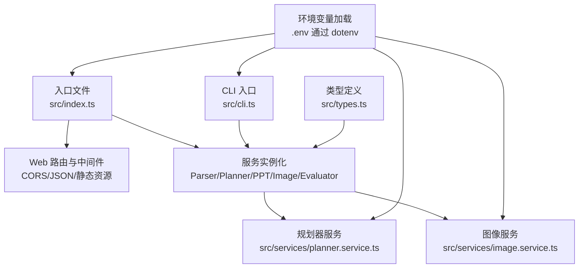
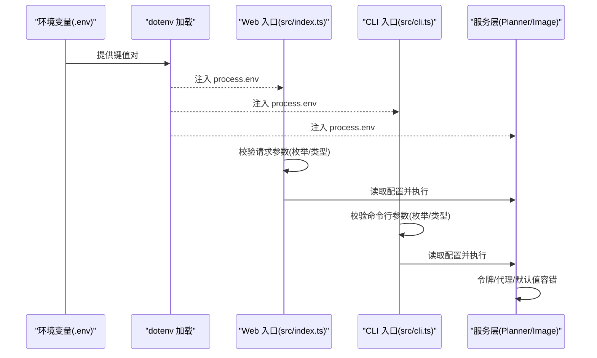
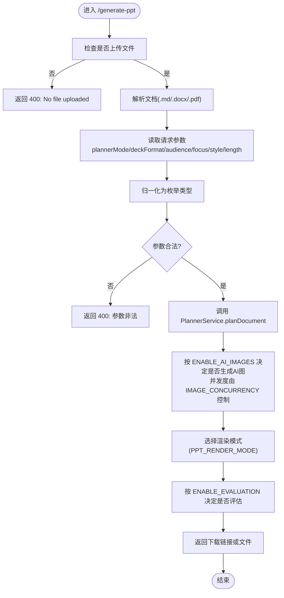
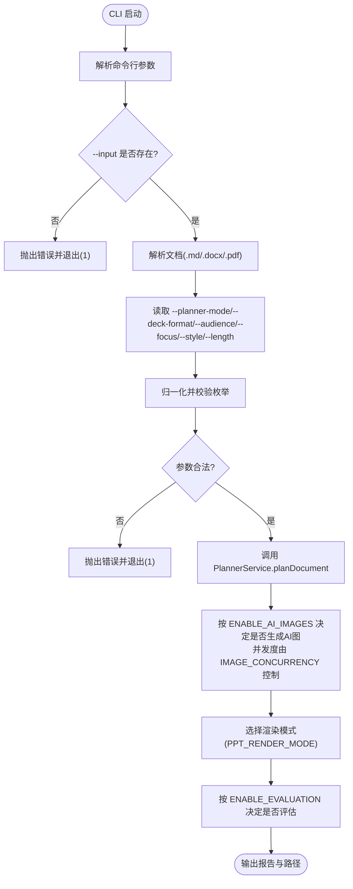
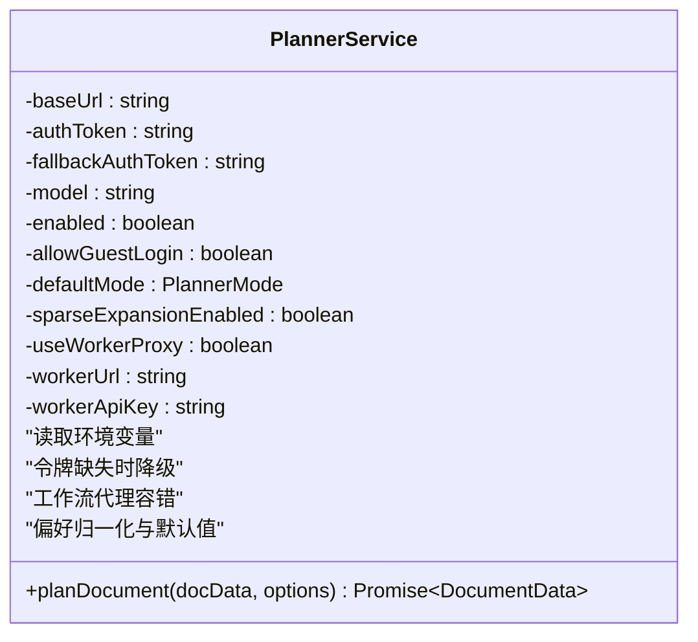
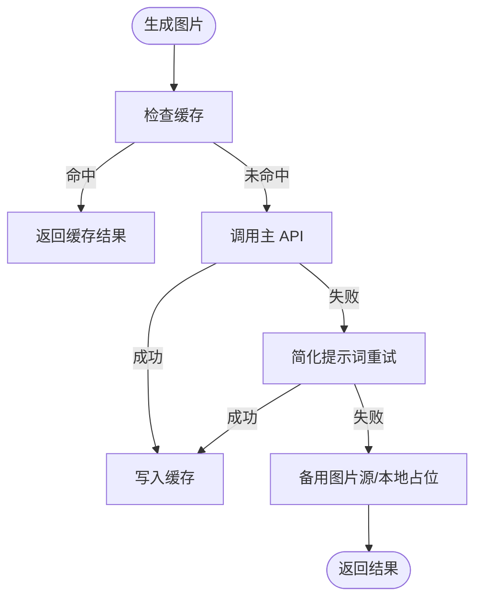
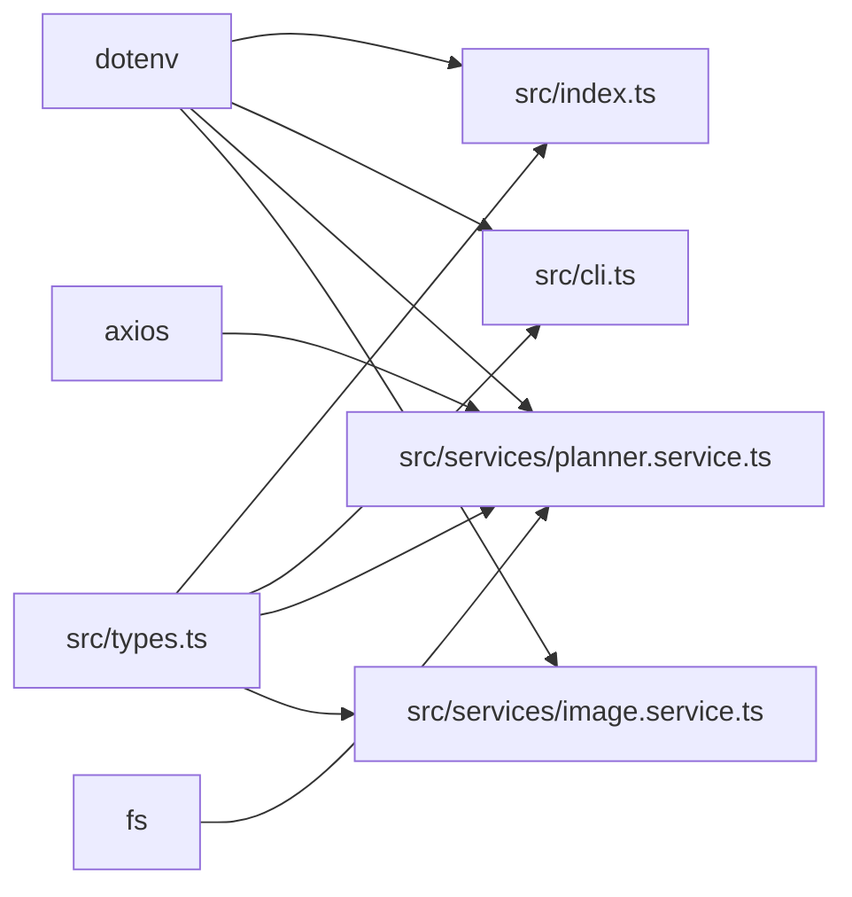

# 配置验证与错误处理

<cite>
**本文引用的文件**
- [src/index.ts](file://src/index.ts)
- [src/cli.ts](file://src/cli.ts)
- [src/types.ts](file://src/types.ts)
- [src/services/planner.service.ts](file://src/services/planner.service.ts)
- [src/services/image.service.ts](file://src/services/image.service.ts)
- [readme.md](file://readme.md)
- [package.json](file://package.json)
</cite>

## 目录
1. [简介](#简介)
2. [项目结构](#项目结构)
3. [核心组件](#核心组件)
4. [架构总览](#架构总览)
5. [详细组件分析](#详细组件分析)
6. [依赖分析](#依赖分析)
7. [性能考虑](#性能考虑)
8. [故障排查指南](#故障排查指南)
9. [结论](#结论)
10. [附录](#附录)

## 简介
本文件面向 Generate-PPT 项目的配置验证与错误处理，系统性说明以下内容：
- 启动时的配置加载与验证机制
- 必需配置项与可选配置项的检查与默认值处理
- 配置参数的类型验证与范围检查（枚举值、布尔值、数值等）
- 常见配置错误及解决方案（无效环境变量、缺失 API 密钥、不兼容配置组合）
- 配置热更新支持与限制
- 配置变更的回滚策略与备份机制建议
- 配置调试工具与日志分析方法

## 项目结构
本项目采用“入口文件 + 服务层 + 类型定义”的分层组织方式。配置验证与错误处理贯穿于入口文件、CLI、以及各业务服务模块。

图表来源
- [src/index.ts:19](file://src/index.ts#L19)
- [src/cli.ts:12](file://src/cli.ts#L12)
- [src/services/planner.service.ts:67-82](file://src/services/planner.service.ts#L67-L82)
- [src/services/image.service.ts:9-13](file://src/services/image.service.ts#L9-L13)

章节来源
- [src/index.ts:19](file://src/index.ts#L19)
- [src/cli.ts:12](file://src/cli.ts#L12)
- [src/services/planner.service.ts:67-82](file://src/services/planner.service.ts#L67-L82)
- [src/services/image.service.ts:9-13](file://src/services/image.service.ts#L9-L13)

## 核心组件
- 环境变量加载：通过 dotenv 在应用启动时读取 .env 文件，使 process.env 可用。
- 配置解析与校验：
  - Web API 层：对请求参数进行类型与枚举值校验，并在不合法时返回 400 错误。
  - CLI 层：对命令行参数进行类型与枚举值校验，并抛出错误终止执行。
  - 服务层：对环境变量进行读取、默认值处理与容错（如令牌缺失时降级）。
- 默认值与容错：
  - 渲染模式、并发度、评估开关等通过布尔或数值默认值控制。
  - 规划器支持工作流代理与回退令牌，令牌缺失时记录警告并跳过远程规划。
- 错误处理：
  - Web API 使用 try/catch 包裹，捕获异常后统一返回 500。
  - CLI 使用 Promise.catch 记录错误并退出进程码 1。
  - 服务内部对第三方 API 失败进行日志记录与降级处理。

章节来源
- [src/index.ts:72-270](file://src/index.ts#L72-L270)
- [src/index.ts:314-428](file://src/index.ts#L314-L428)
- [src/cli.ts:65-176](file://src/cli.ts#L65-L176)
- [src/services/planner.service.ts:67-82](file://src/services/planner.service.ts#L67-L82)
- [src/services/image.service.ts:15-28](file://src/services/image.service.ts#L15-L28)

## 架构总览
下图展示配置验证与错误处理在系统中的位置与交互：

图表来源
- [src/index.ts:19](file://src/index.ts#L19)
- [src/cli.ts:12](file://src/cli.ts#L12)
- [src/services/planner.service.ts:67-82](file://src/services/planner.service.ts#L67-L82)

## 详细组件分析

### Web API 配置验证与错误处理
- 请求参数校验：
  - 对 plannerMode、deckFormat、audience、focus、style、length 进行字符串到枚举的归一化与合法性检查，非法值直接返回 400。
- 环境变量读取与默认值：
  - 渲染模式：PPT_RENDER_MODE 控制 HTML 或原生渲染；默认原生。
  - AI 图像开关：ENABLE_AI_IMAGES 非 "false" 时启用；默认启用。
  - 并发度：IMAGE_CONCURRENCY 读取为数字，默认 2。
  - 评估开关：ENABLE_EVALUATION 非 "false" 时启用；默认启用。
- 异常处理：
  - try/catch 包裹整个 /api/chat 与 /generate-ppt 流程，捕获异常后统一返回 500。

图表来源
- [src/index.ts:314-428](file://src/index.ts#L314-L428)
- [src/index.ts:236-255](file://src/index.ts#L236-L255)
- [src/index.ts:380-416](file://src/index.ts#L380-L416)

章节来源
- [src/index.ts:314-428](file://src/index.ts#L314-L428)
- [src/index.ts:236-255](file://src/index.ts#L236-L255)
- [src/index.ts:380-416](file://src/index.ts#L380-L416)

### CLI 配置验证与错误处理
- 参数校验：
  - --input 必填，否则抛出错误。
  - --planner-mode、--deck-format、--audience、--focus、--style、--length 逐一归一化并校验，非法值抛出错误。
- 环境变量读取与默认值：
  - 与 Web API 相同的规则：渲染模式、AI 图像开关、并发度、评估开关。
- 异常处理：
  - Promise.catch 记录错误并以进程码 1 退出。

图表来源
- [src/cli.ts:65-176](file://src/cli.ts#L65-L176)
- [src/cli.ts:136-160](file://src/cli.ts#L136-L160)

章节来源
- [src/cli.ts:65-176](file://src/cli.ts#L65-L176)
- [src/cli.ts:136-160](file://src/cli.ts#L136-L160)

### 规划器服务的配置读取与容错
- 关键配置读取与默认值：
  - 启用开关：ENABLE_PLANNER 非 "false" 时启用。
  - 工作流代理：PLANNER_USE_WORKER_PROXY 为 "true" 时启用，读取外部环境文件（PLANNER_AIWORKFLOW_ENV_PATH 或 AIWORKFLOW_BACKEND_ENV_PATH）。
  - 认证令牌：PLANNER_AUTH_TOKEN 或 LLM_AUTH_TOKEN，若为空则回退 IMAGE_API_KEY。
  - 模型与默认模式：PLANNER_MODEL、PLANNER_CONTENT_MODE。
  - 稀疏扩展：PLANNER_EXPAND_SPARSE_CONTENT 非 "false" 时启用。
- 容错逻辑：
  - 令牌缺失时记录警告并跳过远程规划，转而使用启发式计划。
  - 工作流代理失败时记录警告并尝试其他路径。
- 归一化与默认值：
  - 规划偏好（deckFormat/audience/focus/style/length）在读取时进行归一化，无法识别时采用默认值。

图表来源
- [src/services/planner.service.ts:67-82](file://src/services/planner.service.ts#L67-L82)
- [src/services/planner.service.ts:1587-1595](file://src/services/planner.service.ts#L1587-L1595)
- [src/services/planner.service.ts:1597-1623](file://src/services/planner.service.ts#L1597-L1623)

章节来源
- [src/services/planner.service.ts:67-82](file://src/services/planner.service.ts#L67-L82)
- [src/services/planner.service.ts:1587-1595](file://src/services/planner.service.ts#L1587-L1595)
- [src/services/planner.service.ts:1597-1623](file://src/services/planner.service.ts#L1597-L1623)

### 图像服务的配置读取与容错
- 关键配置读取：
  - API Key：IMAGE_API_KEY（可选）。
  - 基础地址：IMAGE_API_BASE_URL（默认备用）。
- 容错与降级：
  - 主 API 失败时尝试简化提示词重试。
  - 失败时回退到备用图片源（占位图或本地占位）。
- 并发控制：
  - 通过 runWithConcurrency 控制并发度，避免超载。

图表来源
- [src/services/image.service.ts:15-57](file://src/services/image.service.ts#L15-L57)
- [src/services/image.service.ts:59-120](file://src/services/image.service.ts#L59-L120)

章节来源
- [src/services/image.service.ts:15-57](file://src/services/image.service.ts#L15-L57)
- [src/services/image.service.ts:59-120](file://src/services/image.service.ts#L59-L120)

### 类型定义与配置约束
- 枚举类型：
  - PlannerMode、DeckFormat、DeckAudience、DeckFocus、DeckStyle、DeckLength。
- 作用：
  - Web API 与 CLI 将字符串参数映射到上述枚举，非法值被拒绝。
  - 服务层对偏好参数进行归一化，无法识别时采用默认值。

章节来源
- [src/types.ts:3-8](file://src/types.ts#L3-L8)
- [src/index.ts:272-312](file://src/index.ts#L272-L312)
- [src/cli.ts:22-63](file://src/cli.ts#L22-L63)

## 依赖分析
- 环境变量加载依赖：
  - dotenv：在入口与 CLI 中均调用 dotenv.config()。
- 服务依赖：
  - PlannerService 依赖 axios、fs、自研 UnderstandingService。
  - ImageService 依赖 axios。
- 配置耦合点：
  - Web API 与 CLI 共享相同的环境变量键名，确保一致性。
  - 服务层对令牌、代理、模型等配置有强依赖，缺失时进行降级。

图表来源
- [src/index.ts:19](file://src/index.ts#L19)
- [src/cli.ts:12](file://src/cli.ts#L12)
- [src/services/planner.service.ts:1-18](file://src/services/planner.service.ts#L1-L18)
- [src/services/image.service.ts:1-3](file://src/services/image.service.ts#L1-L3)

章节来源
- [src/index.ts:19](file://src/index.ts#L19)
- [src/cli.ts:12](file://src/cli.ts#L12)
- [src/services/planner.service.ts:1-18](file://src/services/planner.service.ts#L1-L18)
- [src/services/image.service.ts:1-3](file://src/services/image.service.ts#L1-L3)

## 性能考虑
- 并发控制：
  - Web API 与 CLI 均通过 IMAGE_CONCURRENCY 控制图片生成并发度，默认 2，避免资源争用。
- 渲染模式：
  - PPT_RENDER_MODE 可切换 HTML→PNG→PPT 或原生渲染，影响生成耗时与资源占用。
- 评估开销：
  - ENABLE_EVALUATION 开启时会额外计算质量评分与报告，建议在调试阶段开启，生产默认关闭可减少延迟。

章节来源
- [src/index.ts:240-241](file://src/index.ts#L240-L241)
- [src/index.ts:380-381](file://src/index.ts#L380-L381)
- [src/cli.ts:137](file://src/cli.ts#L137)

## 故障排查指南
- 常见错误与定位
  - Web API 返回 400：检查请求参数是否为允许的枚举值；查看对应字段的校验逻辑。
  - Web API 返回 500：查看服务端日志，定位具体环节（解析/规划/渲染/评估）。
  - CLI 抛出错误：检查命令行参数是否正确；查看参数校验与归一化逻辑。
  - 规划器跳过远程规划：检查 PLANNER_AUTH_TOKEN/LLM_AUTH_TOKEN/IMAGE_API_KEY 是否设置；查看服务层警告日志。
  - 图片生成失败：检查 IMAGE_API_KEY 与 IMAGE_API_BASE_URL；查看主 API 失败与降级日志。
- 日志与调试
  - Web API：在关键路径打印请求体与中间状态，便于定位输入问题。
  - 服务层：对 API 失败、令牌缺失、代理异常进行日志记录。
  - CLI：输出质量评分与报告路径，便于核对生成结果。

章节来源
- [src/index.ts:72-92](file://src/index.ts#L72-L92)
- [src/index.ts:266-269](file://src/index.ts#L266-L269)
- [src/services/planner.service.ts:117-120](file://src/services/planner.service.ts#L117-L120)
- [src/services/image.service.ts:95-101](file://src/services/image.service.ts#L95-L101)

## 结论
本项目在启动阶段通过 dotenv 加载环境变量，在 Web API 与 CLI 层完成参数的类型与枚举校验，并在服务层对令牌缺失与网络异常进行容错处理。配置项覆盖渲染模式、AI 图像、并发度、评估开关等，具备明确的默认值与降级策略。建议在生产环境中：
- 明确 .env 中的必填项与可选项，避免运行时缺省导致的功能降级。
- 对不兼容的配置组合进行前置校验（例如渲染模式与评估开关的组合）。
- 建立配置热更新与回滚机制（见附录），以提升运维稳定性。

## 附录

### 配置清单与默认值
- 必需配置（建议）
  - IMAGE_API_KEY：图像生成 API 密钥。
  - PORT：服务监听端口。
- 可选配置（默认值）
  - ENABLE_AI_IMAGES：默认启用。
  - IMAGE_CONCURRENCY：默认 2。
  - PPT_RENDER_MODE：默认原生渲染。
  - ENABLE_EVALUATION：默认启用。
  - ENABLE_PLANNER：默认启用。
  - PLANNER_MODEL：默认模型。
  - PLANNER_CONTENT_MODE：默认 strict。
  - PLANNER_USE_WORKER_PROXY：默认 false。
  - PPT_TEMPLATE_STYLE：默认启用。
  - PPT_KEEP_TEXT：默认启用。
  - PPT_IMAGE_ONLY_MODE：默认 false。
  - PPT_MAX_BULLETS_PER_SLIDE：默认 5。

章节来源
- [readme.md:21-50](file://readme.md#L21-L50)
- [src/index.ts:236-255](file://src/index.ts#L236-L255)
- [src/index.ts:380-416](file://src/index.ts#L380-L416)
- [src/cli.ts:136-160](file://src/cli.ts#L136-L160)
- [src/services/planner.service.ts:67-82](file://src/services/planner.service.ts#L67-L82)

### 配置热更新、回滚与备份建议
- 热更新支持情况
  - 当前实现未提供配置热更新能力。服务启动后读取一次环境变量并初始化服务实例，运行期间不会重新读取新的 .env 变更。
- 限制
  - 更改 .env 后需重启服务或 CLI 才会生效。
- 回滚与备份机制建议
  - 在修改 .env 前保留备份文件（如 .env.backup）。
  - 通过版本化管理 .env 示例文件，配合 CI/CD 在部署时注入环境变量。
  - 对关键配置（如 API 密钥）使用密钥管理服务，避免明文泄露与误改。

章节来源
- [src/index.ts:19](file://src/index.ts#L19)
- [src/cli.ts:12](file://src/cli.ts#L12)