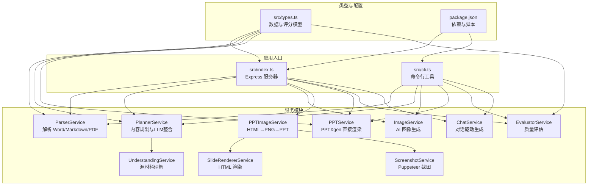
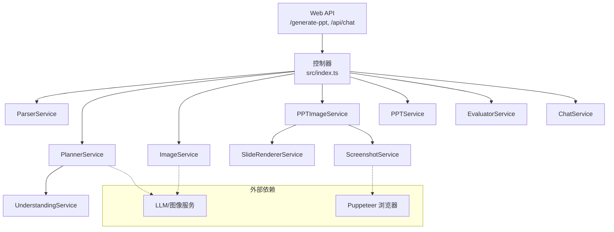
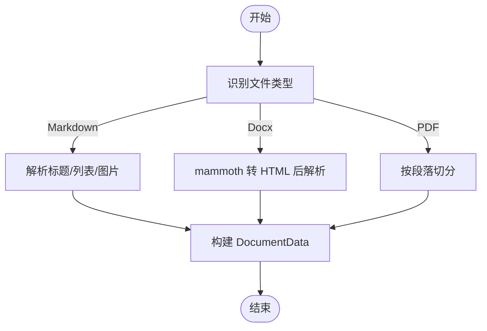
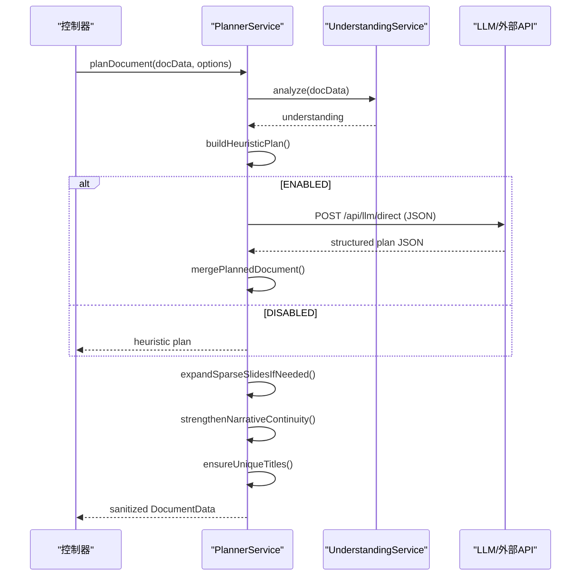
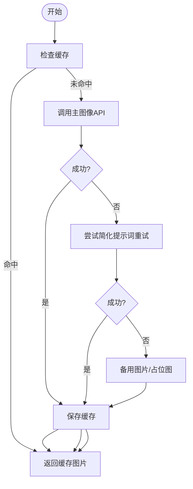
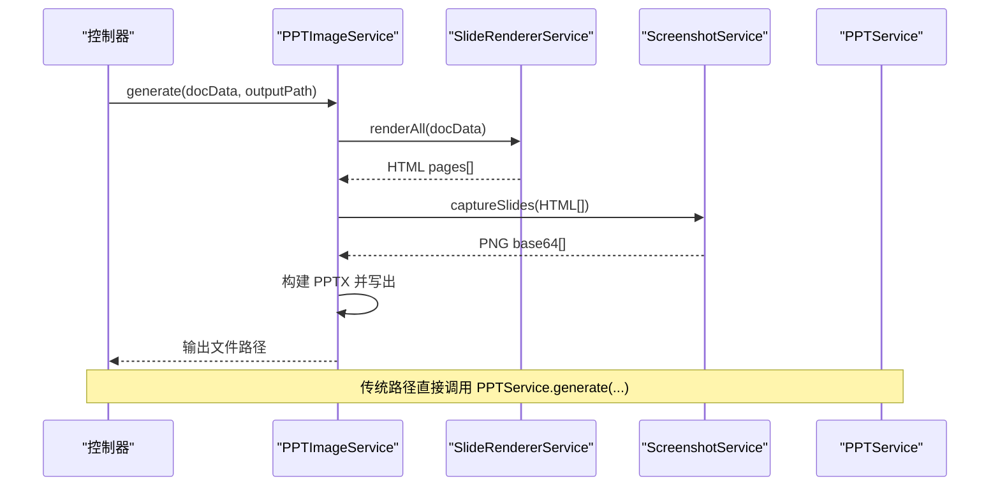
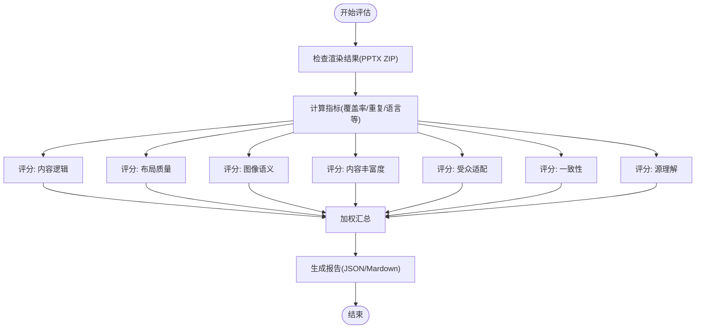
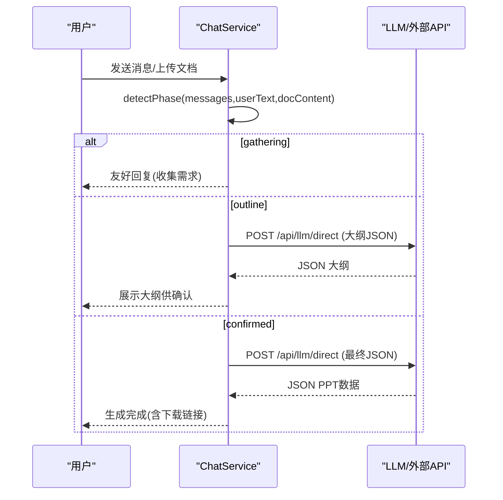
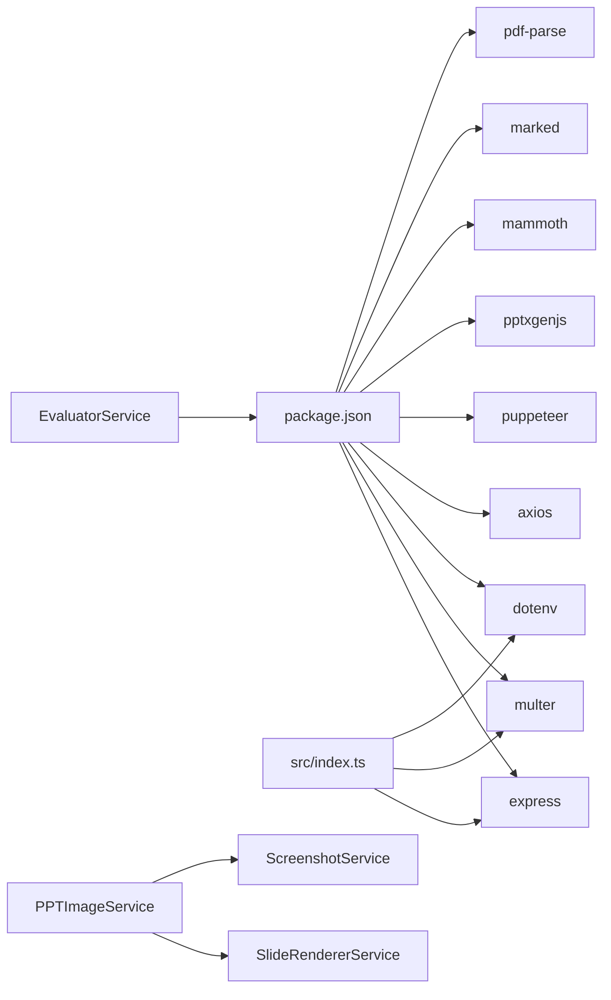

# 项目概述

<cite>
**本文引用的文件**
- [readme.md](file://readme.md)
- [package.json](file://package.json)
- [src/index.ts](file://src/index.ts)
- [src/types.ts](file://src/types.ts)
- [src/cli.ts](file://src/cli.ts)
- [src/services/parser.service.ts](file://src/services/parser.service.ts)
- [src/services/planner.service.ts](file://src/services/planner.service.ts)
- [src/services/image.service.ts](file://src/services/image.service.ts)
- [src/services/ppt.service.ts](file://src/services/ppt.service.ts)
- [src/services/ppt-image.service.ts](file://src/services/ppt-image.service.ts)
- [src/services/screenshot.service.ts](file://src/services/screenshot.service.ts)
- [src/services/slide-renderer.service.ts](file://src/services/slide-renderer.service.ts)
- [src/services/evaluator.service.ts](file://src/services/evaluator.service.ts)
- [src/services/chat.service.ts](file://src/services/chat.service.ts)
- [src/services/understanding.service.ts](file://src/services/understanding.service.ts)
</cite>

## 目录
1. [简介](#简介)
2. [项目结构](#项目结构)
3. [核心组件](#核心组件)
4. [架构总览](#架构总览)
5. [详细组件分析](#详细组件分析)
6. [依赖分析](#依赖分析)
7. [性能考虑](#性能考虑)
8. [故障排查指南](#故障排查指南)
9. [结论](#结论)
10. [附录](#附录)

## 简介
Generate-PPT 是一个面向多格式文档（Word、Markdown、PDF）的自动化演示文稿生成系统。它通过统一的处理管道，实现“解析-规划-图像-渲染-评估”的全流程自动化，帮助用户将任意来源的文本材料快速转换为专业级 PowerPoint 演示文稿。项目支持两种渲染路径：传统 PPTX 渲染与基于 HTML→PNG 的高保真渲染，并提供可选的质量评估体系，输出评分与报告。

## 项目结构
项目采用前后端分离与模块化服务的设计，核心入口位于后端服务，前端静态资源放置于 public 目录，输出文件统一写入 output 目录。核心模块包括：
- 控制器与路由：Express 应用负责接收请求、解析上传文件、编排各服务模块
- 服务层：解析、规划、图像生成、PPT 渲染、截图、评估、对话集成等
- 类型定义：统一的数据结构与评分维度
- CLI：命令行工具，便于本地批量生成与测试

图表来源
- [src/index.ts:1-432](file://src/index.ts#L1-L432)
- [src/cli.ts:1-176](file://src/cli.ts#L1-L176)
- [src/services/parser.service.ts:1-453](file://src/services/parser.service.ts#L1-L453)
- [src/services/planner.service.ts:1-800](file://src/services/planner.service.ts#L1-L800)
- [src/services/image.service.ts:1-218](file://src/services/image.service.ts#L1-L218)
- [src/services/ppt-image.service.ts:1-53](file://src/services/ppt-image.service.ts#L1-L53)
- [src/services/screenshot.service.ts:1-77](file://src/services/screenshot.service.ts#L1-L77)
- [src/services/slide-renderer.service.ts:1-546](file://src/services/slide-renderer.service.ts#L1-L546)
- [src/services/ppt.service.ts:1-800](file://src/services/ppt.service.ts#L1-L800)
- [src/services/evaluator.service.ts:1-800](file://src/services/evaluator.service.ts#L1-L800)
- [src/services/chat.service.ts:1-400](file://src/services/chat.service.ts#L1-L400)
- [src/services/understanding.service.ts:1-96](file://src/services/understanding.service.ts#L1-L96)
- [src/types.ts:1-160](file://src/types.ts#L1-L160)
- [package.json:1-45](file://package.json#L1-L45)

章节来源
- [readme.md:1-131](file://readme.md#L1-L131)
- [package.json:1-45](file://package.json#L1-L45)
- [src/index.ts:1-432](file://src/index.ts#L1-L432)

## 核心组件
- 解析服务（ParserService）：从 Markdown、Docx、PDF 中抽取标题、要点与图片，构建结构化的文档数据
- 规划服务（PlannerService）：结合理解服务与外部 LLM，生成结构化大纲与图像提示词，支持严格/创意两种模式
- 图像服务（ImageService）：调用图像接口生成幻灯片配图，具备缓存与降级策略
- 渲染服务（PPTService 与 PPTImageService）：前者直接使用 PPTXgen 渲染，后者通过 HTML→PNG→PPT 实现高保真输出
- 截图服务（ScreenshotService）：基于 Puppeteer 在高分辨率下截图，确保输出清晰度
- HTML 渲染器（SlideRendererService）：将每页幻灯片渲染为独立 HTML 页面
- 评估服务（EvaluatorService）：对生成的 PPT 进行质量打分，覆盖逻辑、布局、图像语义、内容丰富度、受众适配、一致性等维度
- 对话服务（ChatService）：提供三阶段对话流程（需求收集→大纲→最终生成），支持与文档上传联动
- 类型系统（types.ts）：统一定义幻灯片、文档、评分维度与报告结构

章节来源
- [src/services/parser.service.ts:1-453](file://src/services/parser.service.ts#L1-L453)
- [src/services/planner.service.ts:1-800](file://src/services/planner.service.ts#L1-L800)
- [src/services/image.service.ts:1-218](file://src/services/image.service.ts#L1-L218)
- [src/services/ppt.service.ts:1-800](file://src/services/ppt.service.ts#L1-L800)
- [src/services/ppt-image.service.ts:1-53](file://src/services/ppt-image.service.ts#L1-L53)
- [src/services/screenshot.service.ts:1-77](file://src/services/screenshot.service.ts#L1-L77)
- [src/services/slide-renderer.service.ts:1-546](file://src/services/slide-renderer.service.ts#L1-L546)
- [src/services/evaluator.service.ts:1-800](file://src/services/evaluator.service.ts#L1-L800)
- [src/services/chat.service.ts:1-400](file://src/services/chat.service.ts#L1-L400)
- [src/types.ts:1-160](file://src/types.ts#L1-L160)

## 架构总览
系统采用分层与模块化设计：
- 表现层：Express 路由与控制器，提供 Web API 与静态资源服务
- 业务层：解析、规划、图像、渲染、评估、对话等服务模块
- 数据层：内存缓存（如图片缓存）、文件系统（上传/输出目录）
- 外部集成：图像与 LLM 服务（可选代理）、Puppeteer 浏览器环境

图表来源
- [src/index.ts:1-432](file://src/index.ts#L1-L432)
- [src/services/planner.service.ts:1-800](file://src/services/planner.service.ts#L1-L800)
- [src/services/image.service.ts:1-218](file://src/services/image.service.ts#L1-L218)
- [src/services/ppt-image.service.ts:1-53](file://src/services/ppt-image.service.ts#L1-L53)
- [src/services/screenshot.service.ts:1-77](file://src/services/screenshot.service.ts#L1-L77)
- [src/services/slide-renderer.service.ts:1-546](file://src/services/slide-renderer.service.ts#L1-L546)

## 详细组件分析

### 解析服务（ParserService）
职责：从 Markdown、Docx、PDF 中抽取层次化内容与图片，构建统一的文档数据结构。
- Markdown：按标题与列表层级切分，提取图片链接
- Docx：解析 HTML 并按列表/标题/段落构建幻灯片
- PDF：按段落切分，形成若干幻灯片

图表来源
- [src/services/parser.service.ts:11-167](file://src/services/parser.service.ts#L11-L167)

章节来源
- [src/services/parser.service.ts:1-453](file://src/services/parser.service.ts#L1-L453)

### 规划服务（PlannerService）
职责：将解析后的文档转换为结构化的大纲与图像提示词，支持严格/创意模式与可选的 LLM 扩展。
- 理解服务：抽取主题、章节、信号词与论点
- Heuristic 计划：基于源材料启发式生成大纲
- LLM 规划：通过外部 API 生成严格/创意模式的结构化 JSON
- 合并与增强：合并启发式与 LLM 结果，扩展稀疏内容，强化叙事连贯性

图表来源
- [src/services/planner.service.ts:84-101](file://src/services/planner.service.ts#L84-L101)
- [src/services/understanding.service.ts:1-96](file://src/services/understanding.service.ts#L1-L96)

章节来源
- [src/services/planner.service.ts:1-800](file://src/services/planner.service.ts#L1-L800)
- [src/services/understanding.service.ts:1-96](file://src/services/understanding.service.ts#L1-L96)

### 图像服务（ImageService）
职责：为每页幻灯片生成配图，具备缓存与降级策略，提升稳定性与性能。
- Prompt 构建：优先使用 LLM 生成的 imagePrompt，否则基于标题与要点自动生成
- 并发控制：支持并发限制，避免资源争用
- 重试与降级：失败时回退到简化提示词与备用图片

图表来源
- [src/services/image.service.ts:15-57](file://src/services/image.service.ts#L15-L57)

章节来源
- [src/services/image.service.ts:1-218](file://src/services/image.service.ts#L1-L218)

### 渲染服务（PPTService 与 PPTImageService）
职责：将结构化数据渲染为 PPTX 文件，提供两种路径：
- 传统路径：PPTXgen 直接绘制，适合快速生成与兼容性
- 高保真路径：HTML 渲染→Puppeteer 截图→PPT 插图，适合高质量展示

图表来源
- [src/services/ppt-image.service.ts:18-51](file://src/services/ppt-image.service.ts#L18-L51)
- [src/services/slide-renderer.service.ts:14-46](file://src/services/slide-renderer.service.ts#L14-L46)
- [src/services/screenshot.service.ts:15-52](file://src/services/screenshot.service.ts#L15-L52)
- [src/services/ppt.service.ts:46-68](file://src/services/ppt.service.ts#L46-L68)

章节来源
- [src/services/ppt-image.service.ts:1-53](file://src/services/ppt-image.service.ts#L1-L53)
- [src/services/slide-renderer.service.ts:1-546](file://src/services/slide-renderer.service.ts#L1-L546)
- [src/services/screenshot.service.ts:1-77](file://src/services/screenshot.service.ts#L1-L77)
- [src/services/ppt.service.ts:1-800](file://src/services/ppt.service.ts#L1-L800)

### 评估服务（EvaluatorService）
职责：对生成的 PPT 进行质量评估，输出综合评分与维度明细。
- 渲染后检查：解析 PPTX ZIP，提取文本与图片信息
- 维度评分：逻辑、布局、图像语义、内容丰富度、受众适配、一致性、源理解
- 报告输出：同时生成 JSON 与 Markdown 报告

图表来源
- [src/services/evaluator.service.ts:32-93](file://src/services/evaluator.service.ts#L32-L93)
- [src/services/evaluator.service.ts:285-356](file://src/services/evaluator.service.ts#L285-L356)

章节来源
- [src/services/evaluator.service.ts:1-800](file://src/services/evaluator.service.ts#L1-L800)

### 对话服务（ChatService）
职责：提供三阶段对话流程，支持与文档上传联动，生成大纲或最终 PPT 数据。
- 阶段检测：需求收集/大纲/确认生成
- Prompt 构建：针对不同阶段构建系统提示与聚焦需求
- 结构化解析：从 LLM 回复中提取 JSON 或大纲

图表来源
- [src/services/chat.service.ts:40-101](file://src/services/chat.service.ts#L40-L101)
- [src/services/chat.service.ts:109-141](file://src/services/chat.service.ts#L109-L141)
- [src/services/chat.service.ts:272-347](file://src/services/chat.service.ts#L272-L347)

章节来源
- [src/services/chat.service.ts:1-400](file://src/services/chat.service.ts#L1-L400)

### 类型系统（types.ts）
职责：统一定义文档、幻灯片、评分维度与报告结构，保证前后端与各模块间的数据契约一致。

章节来源
- [src/types.ts:1-160](file://src/types.ts#L1-L160)

## 依赖分析
- 运行时依赖：Express、Multer、Dotenv、Axios、Puppeteer、PPTXGenJS、Mammoth、Marked、PDF 解析库等
- 开发依赖：TypeScript、ts-node、nodemon、类型声明包等
- 关键耦合点：
  - 控制器与服务：通过构造函数注入各服务实例
  - 渲染链路：PPTImageService 依赖 SlideRendererService 与 ScreenshotService
  - 评估链路：EvaluatorService 依赖 PPTX ZIP 解析与 XML 文本提取

图表来源
- [package.json:18-31](file://package.json#L18-L31)
- [src/index.ts:1-52](file://src/index.ts#L1-L52)
- [src/services/ppt-image.service.ts:14-16](file://src/services/ppt-image.service.ts#L14-L16)
- [src/services/screenshot.service.ts:1-4](file://src/services/screenshot.service.ts#L1-L4)
- [src/services/evaluator.service.ts:1-10](file://src/services/evaluator.service.ts#L1-L10)

章节来源
- [package.json:1-45](file://package.json#L1-L45)
- [src/index.ts:1-52](file://src/index.ts#L1-L52)

## 性能考虑
- 并发与限流：图像生成支持并发参数控制，避免过度占用带宽与算力
- 缓存策略：图像服务内置缓存，减少重复请求；会话级图片缓存用于对话确认阶段回填
- 渲染优化：高分辨率截图（1920×1080，2x 缩放）兼顾清晰度与体积；HTML 渲染按需生成
- I/O 优化：上传文件写入磁盘，输出目录集中管理，避免内存压力

章节来源
- [src/services/image.service.ts:199-216](file://src/services/image.service.ts#L199-L216)
- [src/index.ts:53-69](file://src/index.ts#L53-L69)
- [src/services/screenshot.service.ts:24-28](file://src/services/screenshot.service.ts#L24-L28)

## 故障排查指南
- 环境变量缺失：检查 .env 是否正确配置（图像/LLM/端口等），必要字段包括 IMAGE_API_KEY、IMAGE_API_BASE_URL、PORT、ENABLE_AI_IMAGES、PLANNER_* 等
- LLM/图像接口异常：查看 PlannerService 与 ImageService 的错误日志；确认鉴权令牌与代理设置
- Puppeteer 截图失败：确认浏览器启动参数与沙箱设置；检查磁盘空间与权限
- PDF 解析报错：确认 Node 版本满足要求（推荐 ≥16），并检查 pdf-parse 初始化
- 评估报告为空：确认输出路径存在且可写，PPTX ZIP 能被正确读取

章节来源
- [readme.md:17-60](file://readme.md#L17-L60)
- [src/services/planner.service.ts:109-162](file://src/services/planner.service.ts#L109-L162)
- [src/services/image.service.ts:59-101](file://src/services/image.service.ts#L59-L101)
- [src/services/screenshot.service.ts:54-68](file://src/services/screenshot.service.ts#L54-L68)
- [src/services/parser.service.ts:169-183](file://src/services/parser.service.ts#L169-L183)
- [src/services/evaluator.service.ts:110-162](file://src/services/evaluator.service.ts#L110-L162)

## 结论
Generate-PPT 通过模块化与分层架构，实现了从多格式文档到高质量演示文稿的自动化流水线。其核心价值在于：
- 统一处理：一套管道适配 Word/Markdown/PDF
- 智能规划：结合启发式与 LLM，生成结构化大纲与图像提示
- 高质量渲染：提供传统与高保真两条渲染路径
- 质量评估：可选的评分与报告，辅助持续改进
建议在生产环境中合理配置并发与缓存策略，完善监控与日志，以获得稳定高效的体验。

## 附录
- 快速开始
  - 安装：npm install
  - 启动：npm start（默认端口 3000）
  - CLI：npm run generate -- --input <文件> --output <输出路径>
- API
  - POST /generate-ppt：表单上传文件，返回 PPTX
  - POST /api/chat：对话生成，支持上传文件与消息历史
- 环境变量
  - 图像与 LLM：IMAGE_API_KEY、IMAGE_API_BASE_URL、PLANNER_API_BASE_URL、PLANNER_AUTH_TOKEN、LLM_AUTH_TOKEN、GOOGLE_API_KEY、LLM_API_KEY
  - 功能开关：ENABLE_AI_IMAGES、ENABLE_PLANNER、ENABLE_EVALUATION
  - 渲染与质量：PPT_TEMPLATE_STYLE、PPT_KEEP_TEXT、PPT_IMAGE_ONLY_MODE、PPT_MAX_BULLETS_PER_SLIDE、PPT_RENDER_MODE
  - 并发与代理：IMAGE_CONCURRENCY、PLANNER_USE_WORKER_PROXY、CLOUDFLARE_WORKER_URL、AIWORKFLOW_BACKEND_ENV_PATH

章节来源
- [readme.md:11-131](file://readme.md#L11-L131)
- [src/index.ts:314-427](file://src/index.ts#L314-L427)
- [src/cli.ts:65-176](file://src/cli.ts#L65-L176)